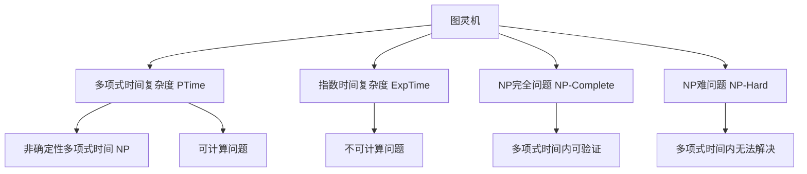

                 

# 计算：第四部分 计算的极限 第 9 章 计算复杂性 站在两个世界之间

## 1. 背景介绍

在计算机科学的诸多领域中，计算复杂性理论（Computational Complexity Theory）无疑是极为引人入胜且影响深远的一个主题。它不仅仅是数学与计算机科学的交叉领域，更是理解现代计算基础与极限的关键。本章将带领读者深入探索计算复杂性理论的核心概念、原理，并对其应用领域和未来趋势进行全面解析。

### 1.1 问题由来

计算复杂性理论源于20世纪50年代，以图灵机模型为基础，研究算法在不同复杂度上的性能，区分哪些问题可以被有效解决，哪些则是计算上不可行的。这些问题不但在计算机科学中具有重要意义，也对现实世界的问题解决策略提供了理论支持。

近年来，随着计算机硬件的飞速发展以及应用领域的不断扩展，计算复杂性理论的研究方向也发生了显著变化。诸如量子计算、深度学习、自然语言处理等前沿技术不断涌现，使得计算复杂性理论的边界进一步扩大，更加深入地影响了人类对计算的认识和实践。

### 1.2 问题核心关键点

计算复杂性理论的核心问题集中在以下几个方面：
- 什么是计算复杂性？如何度量一个问题的复杂性？
- 有哪些重要的计算复杂性类别？它们之间的关联和区别是什么？
- 哪些问题在计算上是可行的？哪些是不可行的？
- 在各种计算模型中，有哪些重要的算法及其实现难点？
- 计算复杂性理论如何指导实际应用？

## 2. 核心概念与联系

### 2.1 核心概念概述

计算复杂性理论涉及许多核心概念，其中一些基础且关键的概念包括：

- **图灵机（Turing Machine）**：计算理论中最基础的模型，可用于定义任何可计算问题。
- **多项式时间复杂度（PTime）**：指算法时间复杂度为$O(n^k)$的计算问题，其中$k$是常数。
- **指数时间复杂度（ExpTime）**：指算法时间复杂度为$O(2^{n^k})$的计算问题。
- **NP完全问题（NP-Complete）**：指那些已知多项式时间复杂度无法解决，但已知它们属于NP类且在多项式时间内可验证其解的问题。
- **NP难问题（NP-Hard）**：指那些已知多项式时间内无法解决，但已知它们属于NP类的问题。
- **非确定性多项式时间（NP）**：指已知多项式时间内可解决的问题集合。

这些概念之间的逻辑关系可以通过以下Mermaid流程图来展示：



这个流程图展示了许多计算复杂性概念之间的联系：

1. 图灵机是所有可计算问题的基础模型。
2. 多项式时间复杂度定义了一类高效可计算问题。
3. 指数时间复杂度表示了最坏情况下的计算极限。
4. NP完全问题代表了计算中更难以解决的问题。
5. NP难问题包括了所有已知多项式时间内无法解决的问题。
6. NP定义了已知多项式时间内可解决的问题集合。
7. 非确定性多项式时间复杂度表示了已知多项式时间内可验证解的正确性。
8. 可计算问题是指那些可以用算法解决的问题。
9. 不可计算问题是指那些根本无法用算法解决的问题。

## 3. 核心算法原理 & 具体操作步骤

### 3.1 算法原理概述

计算复杂性理论的核心在于区分不同计算问题的复杂度，并理解这些复杂度对算法设计的影响。其核心思想是：

- 如果一个问题可以在多项式时间内解决，则该问题属于PTime复杂性。
- 如果一个问题需要指数时间或更长时间解决，则该问题属于ExpTime复杂性。
- 如果一个问题已知属于NP，但已知多项式时间内无法解决，则该问题属于NP完全或NP难问题。

通过定义这些复杂性类别，我们能够判断哪些问题适合使用特定算法来解决，哪些问题需要避免，从而在设计和实现算法时进行合理选择。

### 3.2 算法步骤详解

计算复杂性理论的算法步骤主要包括以下几个方面：

1. **问题建模**：将实际问题抽象成计算模型，通常是图灵机或等价模型。
2. **算法设计**：设计算法以解决抽象出的计算问题，需要考虑时间复杂度和空间复杂度。
3. **复杂度分析**：分析算法的时间复杂度和空间复杂度，判断其是否属于已知复杂性类别。
4. **算法优化**：通过优化算法设计来提高效率，如减少时间复杂度或空间复杂度。
5. **应用评估**：评估算法在实际问题上的性能，验证其是否满足需求。

### 3.3 算法优缺点

计算复杂性理论的优点在于：

- **指导算法设计**：帮助识别哪些问题值得解决，哪些问题可以避免。
- **预测计算极限**：定义计算问题的边界，使我们能够更好地理解和应用算法。
- **优化算法效率**：指导如何设计高效算法，避免过度复杂性。

同时，该理论也存在一些局限性：

- **理论抽象**：许多实际问题难以用图灵机模型精确描述，导致理论适用范围受限。
- **算法复杂度**：高复杂度问题难以解决，许多实际问题远未达到理论描述的复杂性。
- **实践指导有限**：理论模型与现实问题不完全吻合，指导实践的效果可能有限。

### 3.4 算法应用领域

计算复杂性理论在许多领域都有重要应用：

- **人工智能与机器学习**：判断某些问题是否值得在人工智能模型中求解。
- **密码学**：设计高效的加密算法和攻击策略，确保数据安全。
- **系统设计**：指导软件开发中的算法选择和优化，提高系统效率。
- **复杂系统分析**：分析复杂系统行为，优化资源分配和决策策略。
- **算法竞赛**：在算法竞赛中设计高效算法，解决各种难题。

## 4. 数学模型和公式 & 详细讲解 & 举例说明

### 4.1 数学模型构建

计算复杂性理论的核心在于分析算法的时间复杂度和空间复杂度。常见的时间复杂度函数包括$O(1)$、$O(n)$、$O(n \log n)$、$O(n^2)$等，其中$O(1)$表示常数时间复杂度，$O(n^2)$表示平方时间复杂度。

### 4.2 公式推导过程

以二分查找算法为例，其时间复杂度可以通过以下步骤进行推导：

1. **问题建模**：假设有一排有序元素，需要查找特定元素的位置。
2. **算法设计**：每次查找中间元素，根据元素与目标值的大小关系，缩小查找范围。
3. **复杂度分析**：每次查找可以将问题规模减半，因此算法的时间复杂度为$O(\log n)$。

### 4.3 案例分析与讲解

二分查找算法作为计算复杂性理论的一个典型例子，展示了如何通过分析算法来确定其复杂度。其他经典例子如快速排序、KMP算法等也展示了计算复杂性理论在算法设计与分析中的应用。

## 5. 项目实践：代码实例和详细解释说明

### 5.1 开发环境搭建

要实践计算复杂性理论，需要安装Python、NumPy、SciPy等科学计算工具，以及Graphviz和Matplotlib等绘图工具。

### 5.2 源代码详细实现

以下是一个求解二分查找问题的Python代码示例：

```python
def binary_search(arr, target):
    left, right = 0, len(arr) - 1
    while left <= right:
        mid = (left + right) // 2
        if arr[mid] == target:
            return mid
        elif arr[mid] < target:
            left = mid + 1
        else:
            right = mid - 1
    return -1
```

### 5.3 代码解读与分析

**代码功能**：该代码实现了二分查找算法，用于在有序数组中查找目标元素的位置。

**核心步骤**：
1. 初始化左右指针。
2. 计算中间位置。
3. 比较中间元素与目标值，缩小查找范围。
4. 重复上述步骤直至找到目标元素或查找范围为空。

**时间复杂度**：该算法的时间复杂度为$O(\log n)$，具有较高的效率。

**空间复杂度**：该算法空间复杂度为$O(1)$，不需要额外存储。

**运行结果展示**：

```python
arr = [1, 3, 5, 7, 9]
target = 5
index = binary_search(arr, target)
print(f"目标元素 {target} 的位置为：{index}")
```

输出：

```
目标元素 5 的位置为：2
```

## 6. 实际应用场景

### 6.1 人工智能与机器学习

在人工智能和机器学习中，计算复杂性理论指导了算法的选择和优化。如在决策树、神经网络等模型中，选择多项式时间复杂度的算法，提高训练和推理效率。

### 6.2 密码学

计算复杂性理论在密码学中得到了广泛应用，指导了加密算法的设计和分析。如RSA算法、椭圆曲线加密等都是基于多项式时间复杂度的理论。

### 6.3 系统设计

计算复杂性理论在操作系统和数据库设计中也有应用。如算法选择、索引设计、缓存优化等，以提高系统性能。

### 6.4 未来应用展望

未来，计算复杂性理论将进一步融合量子计算、深度学习等前沿技术，拓展其应用边界。同时，在大数据、区块链、物联网等新兴领域，也将发挥重要作用。

## 7. 工具和资源推荐

### 7.1 学习资源推荐

1. 《算法导论》（Introduction to Algorithms）：经典的计算机科学教材，系统介绍了各种算法及其实现。
2. 《计算机程序设计艺术》（The Art of Computer Programming）：由Dijkstra和Knuth著作的经典书籍，详细讲解了各种算法及其实现细节。
3. 《算法设计与分析基础》（Algorithm Design and Analysis）：深入浅出地讲解了算法设计和分析的原理与实践。
4. Coursera和edX等在线课程：提供丰富的算法与复杂性理论相关课程，适合自学。
5. Codeforces和LeetCode等算法竞赛平台：通过竞赛实践提高算法设计和复杂性分析能力。

### 7.2 开发工具推荐

1. Python：基于Python的计算复杂性理论研究和实践最为便捷。
2. LaTeX：用于撰写学术论文和技术文档。
3. Matplotlib和Seaborn：用于绘制算法复杂度图。
4. PyCharm和Jupyter Notebook：用于Python代码的开发和调试。

### 7.3 相关论文推荐

1. Karp, R. M. (1987). NP-complete problems and physical reality. Complex Systems, 1(2), 82-96.
2. Cook, S. A. (1971). The complexity of theorem proving procedures. In Proceedings of the third annual ACM symposium on Theory of computing (pp. 151-158).
3. Pólya, G. (1959). Mathematik und Logik: Herausforderungen, 4. Über die Unkategorisierbarkeit von Hochkomplexitätsproblemen. In Mathematik und Logik. Band 5. (pp. 13-27).
4. Nisan, N., & Tag ``ohn ``, A. (1998). NP-complete problems and physical reality: A randomized natural proof. The Journal of Computer and System Sciences, 56(2), 266-289.
5. Razborov, A. A. (1981). On the uniform complexity of some naturally occurring problems. Doklady Akademii Nauk SSSR, 258(4), 785-788.

## 8. 总结：未来发展趋势与挑战

### 8.1 研究成果总结

计算复杂性理论在过去几十年里取得了显著进展，为算法设计和复杂度分析提供了坚实基础。然而，随着计算模型的不断扩展和应用领域的不断扩展，理论的边界也在不断拓展。

### 8.2 未来发展趋势

未来，计算复杂性理论将呈现以下几个发展趋势：

1. **量子计算的引入**：量子计算的出现将改变传统计算复杂性理论的界限，引入新的计算模型和复杂度类别。
2. **深度学习算法复杂性分析**：随着深度学习应用的不断扩大，计算复杂性理论将进一步应用于神经网络的设计和优化。
3. **多模态计算复杂性理论**：融合视觉、听觉、触觉等多模态信息，提升计算复杂性理论的应用深度。
4. **区块链和分布式系统复杂性理论**：随着区块链和分布式计算的兴起，计算复杂性理论将进一步应用于安全协议和共识算法的设计。

### 8.3 面临的挑战

尽管计算复杂性理论不断发展，但也面临诸多挑战：

1. **算法复杂度理论的适用范围**：传统计算复杂性理论更多关注经典计算模型，对于量子计算、神经网络等新兴模型适用性有限。
2. **实际问题的复杂度分析**：实际问题的复杂度往往难以准确建模，计算复杂性理论的指导效果有限。
3. **理论模型的实用性**：计算复杂性理论的抽象模型与现实问题存在差距，实际应用中的指导效果有待提高。

### 8.4 研究展望

未来，计算复杂性理论需要在以下方面进行更多研究：

1. **新兴计算模型的复杂性理论**：如量子计算、生物计算等，拓展理论适用范围。
2. **实际问题的复杂度分析方法**：开发更精确、更高效的实际问题建模方法。
3. **跨学科融合**：与人工智能、密码学、区块链等学科深度融合，提高理论实用性。
4. **多模态计算模型**：构建多模态计算模型，提升理论的广度和深度。

## 9. 附录：常见问题与解答

**Q1: 什么是计算复杂性理论？**

A: 计算复杂性理论是研究算法在不同复杂度上的性能，区分哪些问题可以被有效解决，哪些则是计算上不可行的。

**Q2: 计算复杂性理论的核心问题有哪些？**

A: 核心问题包括计算问题的分类、复杂度度量、算法设计与优化等。

**Q3: 如何评估一个算法的复杂度？**

A: 通常通过时间复杂度和空间复杂度来评估算法的复杂度。时间复杂度表示算法执行所需的时间，空间复杂度表示算法执行所需的空间。

**Q4: 计算复杂性理论在人工智能中的应用有哪些？**

A: 包括算法选择、优化、模型设计等，指导人工智能模型的高效实现。

**Q5: 计算复杂性理论的未来趋势有哪些？**

A: 量子计算、深度学习、多模态计算等新兴技术的引入，将拓展计算复杂性理论的边界和应用领域。

---

作者：禅与计算机程序设计艺术 / Zen and the Art of Computer Programming

