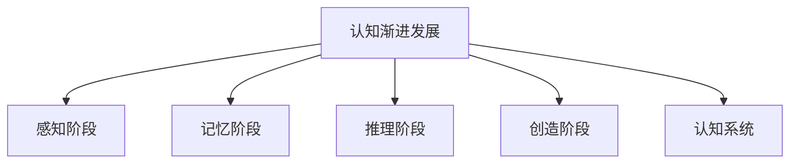

                 

## 1. 背景介绍

### 1.1 问题由来

认知科学（Cognitive Science）是研究人类认知过程的科学，涵盖了神经科学、心理学、语言学、计算机科学等多个学科。认知科学旨在理解人类如何获取、存储、加工和应用信息，最终指导人工智能技术的发展。认知渐进发展理论（Cognitive Progressivism Theory）是认知科学领域的一个分支，致力于描述人类认知能力的逐步提升和演化过程。

### 1.2 问题核心关键点

认知渐进发展理论的核心观点是，人类的认知能力是一个逐步发展、渐进提升的过程，而非一蹴而就。这一过程可以分为多个阶段，每个阶段对应着不同层次的认知能力。从感知、记忆、推理到创造，人类认知能力不断发展，形成了复杂的认知系统。

### 1.3 问题研究意义

研究认知渐进发展理论具有重要意义：

1. **解释人类认知能力发展**：认知渐进发展理论能够帮助我们更好地理解人类认知能力的发展轨迹，揭示认知能力增长的内在机制。
2. **指导人工智能技术**：认知渐进发展的规律，可以应用于人工智能领域，指导智能系统的设计和实现。
3. **促进教育和技术**：了解认知发展的规律，有助于设计更有效的教育方式和技术工具，促进学习效率和认知提升。

## 2. 核心概念与联系

### 2.1 核心概念概述

为更好地理解认知渐进发展理论，本节将介绍几个关键概念：

- **认知渐进发展**：人类认知能力逐步提升的过程，包括感知、记忆、推理、创造等多个阶段。
- **感知阶段**：人类通过感官获取外界信息，形成初步的认知模型。
- **记忆阶段**：人类将感知信息存储在大脑中，形成长期记忆，并能够回忆和重现。
- **推理阶段**：人类能够进行逻辑推理，根据已知信息推导未知结果。
- **创造阶段**：人类能够创造出新的知识、思想和技术，推动社会进步。
- **认知系统**：由感知、记忆、推理、创造等子系统组成的整体认知结构。

这些概念之间的逻辑关系可以通过以下Mermaid流程图来展示：



这个流程图展示了大语言模型的核心概念及其之间的关系：

1. 认知渐进发展是一个持续的过程，包括感知、记忆、推理和创造多个阶段。
2. 感知阶段涉及信息的获取和初步处理。
3. 记忆阶段涉及信息的长期存储和回溯。
4. 推理阶段涉及信息的逻辑推导和理解。
5. 创造阶段涉及新知识的生成和应用。
6. 认知系统则是这些子系统的整体，共同构成了一个完整的认知模型。

## 3. 核心算法原理 & 具体操作步骤
### 3.1 算法原理概述

认知渐进发展理论认为，认知能力的发展是一个由简单到复杂、由部分到整体的过程。这一过程中，每一阶段的认知能力都是前一阶段的扩展和提升，新能力的获得是已有能力的扩展和深化。

在认知渐进发展的框架下，认知能力的提升可以分为两个主要步骤：

1. **能力获取**：通过环境刺激和学习，获取新的认知能力。
2. **能力扩展**：将新获得的认知能力整合到已有的认知系统中，形成更高级别的认知功能。

### 3.2 算法步骤详解

认知渐进发展理论在实际应用中，可以通过以下几个步骤来实现：

**Step 1: 能力获取**
- 暴露于丰富的环境刺激中，如视觉、听觉、触觉等感官输入。
- 进行反复练习，强化神经网络之间的连接。
- 引入反馈机制，纠正错误的认知处理方式。

**Step 2: 能力扩展**
- 将新获取的认知能力与已有的认知系统进行整合。
- 通过逻辑推理、模式识别等高级认知能力，形成新的认知模型。
- 在新的应用场景中进行测试和验证，不断优化认知模型。

### 3.3 算法优缺点

认知渐进发展理论的优势在于：

1. **逐步提升**：通过逐步学习，逐步提升认知能力，避免了过快的认知发展可能导致的问题。
2. **可预测性**：每一阶段的能力提升都是可预测的，有助于设计系统的升级路径。
3. **鲁棒性**：逐步发展的方式可以减少系统崩溃和知识遗忘的风险。

该理论的局限性在于：

1. **时间成本高**：逐步提升的过程可能需要较长时间，对于快速发展的需求不适用。
2. **环境依赖**：需要丰富的环境刺激和反馈机制，对于资源有限的场景不适用。
3. **复杂性高**：每一阶段的知识整合和应用可能需要复杂的算法支持。

### 3.4 算法应用领域

认知渐进发展理论在多个领域都有广泛的应用：

- **教育**：通过逐步学习，提升学生的认知能力，实现更好的教育效果。
- **人工智能**：指导智能系统的设计和实现，提升系统的智能水平。
- **机器人学**：指导机器人的感知、记忆、推理和创造能力的发展。
- **游戏设计**：设计具有逐步提升难度和能力的 game design 模式。
- **虚拟现实**：通过丰富的环境刺激，提升用户的沉浸感和认知能力。

## 4. 数学模型和公式 & 详细讲解  
### 4.1 数学模型构建

在认知渐进发展理论中，我们通常使用数学模型来描述认知能力的逐步提升过程。其中，一个常用的数学模型是分段函数，可以描述认知能力在不同阶段的变化。

假设认知能力 $C$ 可以用一个分段函数 $f(x)$ 来表示，其中 $x$ 表示时间或学习次数。分段函数可以表示为：

$$
f(x) = 
\begin{cases}
f_1(x), & \text{if } x \in [0, T_1) \\
f_2(x), & \text{if } x \in [T_1, T_2) \\
\vdots & \vdots \\
f_n(x), & \text{if } x \in [T_{n-1}, T_n)
\end{cases}
$$

其中，$f_1, f_2, \ldots, f_n$ 分别代表不同阶段认知能力的变化函数。每一阶段的函数可以进一步细化为更复杂的数学模型，如神经网络、微分方程等。

### 4.2 公式推导过程

以神经网络为例，我们可以推导出一个简单的认知能力变化函数。假设有一个简单的神经网络，包含输入层、隐藏层和输出层，每个神经元之间有权重 $w$ 和偏置 $b$。输入 $x$ 经过神经网络后，输出 $y$ 可以表示为：

$$
y = \sum_{i=1}^n w_i \sigma(x + b_i)
$$

其中，$\sigma$ 为激活函数，如 sigmoid 函数。当神经网络不断训练时，权重 $w$ 和偏置 $b$ 不断调整，认知能力 $C$ 逐渐提升。假设权重和偏置的变化率分别为 $\Delta w$ 和 $\Delta b$，则认知能力的变化率可以表示为：

$$
\frac{dC}{dt} = \frac{dC}{dw} \frac{dw}{dt} + \frac{dC}{db} \frac{db}{dt}
$$

其中，$\frac{dw}{dt}$ 和 $\frac{db}{dt}$ 分别表示权重和偏置的变化率，可以通过反向传播算法计算。

### 4.3 案例分析与讲解

假设我们有一个简单的神经网络，用于识别人脸图像。在最初的训练阶段，认知能力 $C$ 较低，主要集中在输入图像的特征提取上。随着训练次数的增加，权重和偏置不断调整，认知能力逐渐提升，能够识别出更复杂的特征。例如，神经网络可以逐渐学会识别眼睛、鼻子、嘴巴等关键特征，进而识别整张人脸。这一过程中，认知能力的变化可以用分段函数表示：

$$
f(x) = 
\begin{cases}
f_1(x), & \text{if } x \in [0, T_1) \\
f_2(x), & \text{if } x \in [T_1, T_2) \\
f_3(x), & \text{if } x \in [T_2, T_3)
\end{cases}
$$

其中，$f_1(x)$ 表示最初的特征提取阶段，$f_2(x)$ 表示识别眼睛、鼻子等关键特征的阶段，$f_3(x)$ 表示识别整张人脸的阶段。每一阶段的认知能力变化函数可以进一步细化为更复杂的数学模型。

## 5. 项目实践：代码实例和详细解释说明
### 5.1 开发环境搭建

在进行认知渐进发展理论的实践前，我们需要准备好开发环境。以下是使用Python进行TensorFlow开发的环境配置流程：

1. 安装Anaconda：从官网下载并安装Anaconda，用于创建独立的Python环境。

2. 创建并激活虚拟环境：
```bash
conda create -n pytorch-env python=3.8 
conda activate pytorch-env
```

3. 安装TensorFlow：根据CUDA版本，从官网获取对应的安装命令。例如：
```bash
conda install tensorflow -c tensorflow -c conda-forge
```

4. 安装Keras：
```bash
pip install keras
```

5. 安装各类工具包：
```bash
pip install numpy pandas scikit-learn matplotlib tqdm jupyter notebook ipython
```

完成上述步骤后，即可在`pytorch-env`环境中开始实践。

### 5.2 源代码详细实现

下面以一个简单的神经网络为例，展示如何使用TensorFlow实现认知能力的逐步提升。

首先，定义一个简单的神经网络模型：

```python
import tensorflow as tf
from tensorflow.keras import layers

model = tf.keras.Sequential([
    layers.Dense(32, activation='relu', input_shape=(784,)),
    layers.Dense(10, activation='softmax')
])
```

然后，定义认知能力的获取和扩展过程：

```python
def train_model(model, train_data, epochs=10, batch_size=32):
    model.compile(optimizer='adam', loss='sparse_categorical_crossentropy', metrics=['accuracy'])
    model.fit(train_data, epochs=epochs, batch_size=batch_size, validation_split=0.2)

def test_model(model, test_data):
    model.evaluate(test_data)

# 训练数据和测试数据
train_data = ...
test_data = ...

# 训练模型
train_model(model, train_data)

# 测试模型
test_model(model, test_data)
```

最后，在训练过程中，观察认知能力的变化：

```python
import matplotlib.pyplot as plt

history = model.fit(train_data, epochs=10, batch_size=32, validation_split=0.2, verbose=0)

plt.plot(history.history['loss'], label='Training Loss')
plt.plot(history.history['val_loss'], label='Validation Loss')
plt.legend()
plt.show()

plt.plot(history.history['accuracy'], label='Training Accuracy')
plt.plot(history.history['val_accuracy'], label='Validation Accuracy')
plt.legend()
plt.show()
```

### 5.3 代码解读与分析

让我们再详细解读一下关键代码的实现细节：

**神经网络模型**：
- `Sequential` 模型：通过 `Sequential` 模型可以依次添加各层，形成简单的神经网络。
- `Dense` 层：全连接层，用于特征提取和分类。

**训练过程**：
- `train_model` 函数：使用 `model.compile` 定义模型，`model.fit` 进行训练，`validation_split` 指定验证集的划分比例。
- `test_model` 函数：使用 `model.evaluate` 测试模型性能。

**可视化分析**：
- `history.history` 记录了训练过程中的损失和准确率变化。
- 使用 `matplotlib` 库，可以绘制出损失和准确率的折线图，帮助分析模型性能。

## 6. 实际应用场景
### 6.1 教育

认知渐进发展理论在教育领域有广泛的应用，尤其是在课程设计和教学方法上。通过逐步提升学生的认知能力，可以实现更好的教育效果。

在课程设计中，可以按照认知渐进发展的规律，设计逐步增加难度的教学内容。例如，在小学数学教学中，先教授加减乘除等基础运算，然后逐步引入分数、小数等高级概念，最后进行复杂的应用题训练。通过这种逐步提升的方式，学生可以更好地理解和掌握数学知识。

### 6.2 人工智能

认知渐进发展理论可以指导人工智能系统的设计和实现。例如，在图像识别任务中，可以从简单的边缘检测、颜色识别开始，逐步引入复杂的模式识别、物体分类等高级功能。这种逐步提升的方式，可以降低系统的复杂性，提高系统的稳定性和可维护性。

### 6.3 机器人学

在机器人学中，认知渐进发展理论可以指导机器人的感知、记忆、推理和创造能力的发展。例如，在训练机器人进行物体识别时，可以首先训练它识别简单的颜色和形状，然后逐步引入复杂的纹理和角度变化，最后训练它进行复杂的物体组合识别。通过这种逐步提升的方式，机器人可以更好地适应复杂的现实世界环境。

### 6.4 游戏设计

在游戏设计中，认知渐进发展理论可以设计具有逐步提升难度和能力的 game design 模式。例如，在解谜游戏中，可以设计多个关卡，每个关卡的难度逐步提升，引导玩家逐步掌握解谜技巧。通过这种逐步提升的方式，游戏可以更好地保持玩家的兴趣和挑战性。

### 6.5 虚拟现实

在虚拟现实领域，认知渐进发展理论可以设计具有丰富环境刺激和反馈机制的虚拟场景。例如，在虚拟培训中，可以设计逐步变化的虚拟环境，引导用户逐步提升认知能力。通过这种逐步提升的方式，虚拟培训可以更好地模拟真实场景，提高用户的沉浸感和认知能力。

## 7. 工具和资源推荐
### 7.1 学习资源推荐

为了帮助开发者系统掌握认知渐进发展理论的理论基础和实践技巧，这里推荐一些优质的学习资源：

1. 《认知科学概论》：入门认知科学的经典教材，介绍了认知科学的各个分支及其应用。
2. 《深度学习》（Goodfellow et al.）：深度学习领域的经典教材，介绍了深度学习的基本概念和算法。
3. 《人工智能导论》（Russell & Norvig）：介绍人工智能的基本概念和算法，涵盖了认知科学的内容。
4. 《机器学习实战》（Peter Harrington）：介绍机器学习的基本概念和算法，包含大量实例代码。
5. 《TensorFlow实战》（Claude Donato）：介绍TensorFlow的基本概念和算法，包含大量实践案例。
6. 《Keras实战》（Kuhn, 2018）：介绍Keras的基本概念和算法，包含大量实例代码。

通过对这些资源的学习实践，相信你一定能够快速掌握认知渐进发展理论的精髓，并用于解决实际的认知问题。
###  7.2 开发工具推荐

高效的开发离不开优秀的工具支持。以下是几款用于认知渐进发展理论开发的常用工具：

1. TensorFlow：基于Python的开源深度学习框架，灵活动态的计算图，适合快速迭代研究。
2. Keras：基于TensorFlow的高层API，简单易用，适合快速构建深度学习模型。
3. PyTorch：基于Python的开源深度学习框架，灵活度更高，适合科学研究。
4. Jupyter Notebook：交互式笔记本，方便快速编写和执行代码。
5. Anaconda：Python环境管理工具，方便创建和管理虚拟环境。
6. Matplotlib：数据可视化工具，方便绘制各种图表。

合理利用这些工具，可以显著提升认知渐进发展理论的开发效率，加快创新迭代的步伐。

### 7.3 相关论文推荐

认知渐进发展理论在学术界已经得到了广泛的研究。以下是几篇奠基性的相关论文，推荐阅读：

1. "Cognitive Development Theory" by Piaget：介绍了认知发展的阶段性，如感知、记忆、推理等。
2. "The Development of Thinking Skills" by Bruner：提出了逐步提升认知能力的教学方法，如发现学习。
3. "A Framework for Understanding Human Cognition" by Anderson：介绍了认知过程的基本框架，如感知、记忆、推理、创造等。
4. "Connectivism: A Learning Theory for the Digital Age" by George Siemens：介绍了认知过程中的连接主义理论，强调知识整合和系统构建。
5. "Cognitive Engineering for Human-Centered Systems" by Steve Huntsinger：介绍了认知工程的基本概念和应用，如认知建模和仿真。
6. "Cognitive Development and Learning" by Daniel Goleman：介绍了认知发展的心理学理论，如情感智能等。

这些论文代表了大语言模型微调技术的发展脉络。通过学习这些前沿成果，可以帮助研究者把握学科前进方向，激发更多的创新灵感。

## 8. 总结：未来发展趋势与挑战

### 8.1 总结

本文对认知渐进发展理论进行了全面系统的介绍。首先阐述了认知渐进发展理论的研究背景和意义，明确了认知能力发展的逐步提升过程。其次，从原理到实践，详细讲解了认知渐进发展的数学模型和操作步骤，给出了认知渐进发展的代码实现。同时，本文还广泛探讨了认知渐进发展理论在教育、人工智能、机器人学、游戏设计、虚拟现实等多个领域的应用前景，展示了认知渐进发展理论的巨大潜力。最后，本文精选了认知渐进发展理论的学习资源，力求为读者提供全方位的技术指引。

通过本文的系统梳理，可以看到，认知渐进发展理论在认知科学和人工智能领域具有重要的应用价值，能够帮助设计更有效、更智能的系统。相信随着认知科学和人工智能技术的不断进步，认知渐进发展理论将继续发挥重要的指导作用，为智能系统的设计和发展提供科学的理论基础。

### 8.2 未来发展趋势

展望未来，认知渐进发展理论将呈现以下几个发展趋势：

1. **数据驱动**：随着数据采集和处理技术的进步，数据驱动的认知模型将更加普遍。通过大数据分析，可以更好地理解和优化认知过程。
2. **多模态融合**：未来将更加注重多模态数据的融合，如图像、声音、文本等，提升认知模型的综合能力和适应性。
3. **个性化定制**：根据不同个体的认知特点和需求，设计个性化的认知模型，实现更好的教育效果和应用效果。
4. **跨领域应用**：认知渐进发展理论将逐步应用于更多领域，如健康、教育、社会治理等，推动各领域的认知智能化发展。
5. **情感智能**：情感智能作为认知发展的重要组成部分，将得到更多的研究和应用，提升人机交互的自然性和情感互动。
6. **持续学习**：未来将更加注重认知模型的持续学习和更新，保持认知能力的动态提升。

以上趋势凸显了认知渐进发展理论的未来发展方向，将推动认知科学和人工智能技术的不断进步。

### 8.3 面临的挑战

尽管认知渐进发展理论已经取得了重要进展，但在迈向更加智能化、普适化应用的过程中，仍面临以下挑战：

1. **数据获取难度大**：大量高质量的数据是认知渐进发展理论的重要基础，但数据获取和标注成本较高。如何提高数据获取和处理的效率，是未来需要解决的关键问题。
2. **算法复杂度高**：认知渐进发展理论的算法复杂度较高，难以在实际应用中快速实现。如何简化算法，提高认知模型的可扩展性和可维护性，是未来需要重点攻克的难题。
3. **环境适应性差**：认知渐进发展理论在特定环境下可能表现不稳定，难以适应复杂多变的现实场景。如何提高认知模型的鲁棒性和泛化能力，是未来需要不断改进的方向。
4. **用户接受度低**：认知渐进发展理论的应用可能涉及隐私和安全问题，用户对认知模型和数据隐私的担忧会影响其接受度。如何设计更加安全、透明的认知模型，是未来需要解决的重要问题。
5. **伦理道德问题**：认知渐进发展理论的应用可能涉及伦理和道德问题，如算法偏见、隐私保护等。如何构建公平、透明、安全的认知模型，是未来需要重点关注的课题。

### 8.4 研究展望

面对认知渐进发展理论面临的挑战，未来的研究需要在以下几个方面寻求新的突破：

1. **数据增强技术**：开发更多高效的数据增强技术，减少数据获取和标注的成本，提高数据驱动的认知模型的效果。
2. **算法优化**：设计更加高效、可扩展的认知模型算法，降低算法复杂度，提高认知模型的可维护性。
3. **多模态融合技术**：研究多模态数据的融合技术，提升认知模型的综合能力和适应性。
4. **个性化认知模型**：设计个性化认知模型，根据不同个体的认知特点和需求，实现更好的教育效果和应用效果。
5. **情感智能技术**：研究情感智能技术，提升人机交互的自然性和情感互动，增强认知模型的情感理解和表达能力。
6. **持续学习技术**：研究持续学习技术，保持认知能力的动态提升，提高认知模型的鲁棒性和泛化能力。

这些研究方向的探索，必将引领认知渐进发展理论迈向更高的台阶，为认知科学和人工智能技术的发展提供科学的方法论指导。只有勇于创新、敢于突破，才能不断拓展认知渐进发展理论的边界，推动认知科学和人工智能技术的不断发展。

## 9. 附录：常见问题与解答

**Q1：认知渐进发展理论适用于所有认知过程吗？**

A: 认知渐进发展理论主要适用于认知能力的逐步提升过程，但对于一些特殊认知过程，如顿悟、直觉等，可能需要采用其他理论和方法。

**Q2：认知渐进发展理论需要大量数据吗？**

A: 是的，认知渐进发展理论需要大量的数据来支持认知模型的训练和优化。数据获取和标注成本较高，但可以通过数据增强技术来减少需求。

**Q3：认知渐进发展理论的算法复杂度高吗？**

A: 是的，认知渐进发展理论的算法复杂度较高，尤其是涉及多模态融合和持续学习的任务。简化算法，提高认知模型的可扩展性和可维护性，是未来需要重点攻克的难题。

**Q4：认知渐进发展理论可以用于游戏设计吗？**

A: 是的，认知渐进发展理论可以用于游戏设计，设计具有逐步提升难度和能力的 game design 模式，提高游戏的挑战性和趣味性。

**Q5：认知渐进发展理论可以用于虚拟现实吗？**

A: 是的，认知渐进发展理论可以用于虚拟现实，设计具有丰富环境刺激和反馈机制的虚拟场景，提升用户的沉浸感和认知能力。

**Q6：认知渐进发展理论可以用于教育吗？**

A: 是的，认知渐进发展理论可以用于教育，设计逐步提升认知能力的教育课程，提高学生的学习效果。

**Q7：认知渐进发展理论可以用于人工智能吗？**

A: 是的，认知渐进发展理论可以用于人工智能，指导智能系统的设计和实现，提升系统的智能水平。

作者：禅与计算机程序设计艺术 / Zen and the Art of Computer Programming

