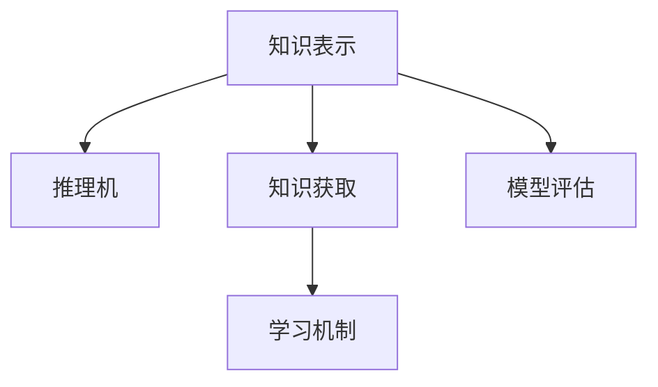

                 

# 认知的形式化：宇宙在本质上是有秩序的和可认知的

> 关键词：认知，形式化，秩序，宇宙，知识图谱，逻辑推理，人工智能，深度学习

## 1. 背景介绍

### 1.1 问题由来
认知科学是一门研究人类和人工智能系统的认知能力及其在环境中获取、存储、处理、使用知识的过程的科学。在人工智能和计算机科学中，形式化认知研究主要关注如何模拟和实现知识获取、推理和决策等认知过程，以使计算机能够理解和执行复杂的认知任务。随着人工智能技术的快速发展，认知的形式化研究已成为智能系统中不可或缺的一部分。

### 1.2 问题核心关键点
形式化认知研究的核心是探讨如何将知识的形式化表示方法应用于人工智能系统中，以实现高效的推理和决策。其主要包括以下几个关键点：

1. **知识表示**：知识的形式化表示方法包括命题逻辑、谓词逻辑、框架理论、语义网络等，用于描述知识和知识之间的关联。
2. **推理机制**：形式化推理方法包括谓词逻辑推理、模糊推理、专家系统推理等，用于推理知识并得出结论。
3. **知识获取**：知识获取是形式化认知研究的重要环节，包括知识库的构建、推理机的设计、数据挖掘等。
4. **学习机制**：学习机制用于根据新的输入数据更新知识库，包括归纳学习、贝叶斯网络等。
5. **模型评估**：形式化认知研究的模型评估方法包括精确度、召回率、F1值、推理效率等。

这些关键点共同构成了形式化认知研究的框架，使得计算机系统能够理解和执行复杂的认知任务。

### 1.3 问题研究意义
形式化认知研究对于人工智能系统的开发具有重要意义：

1. **提升推理能力**：形式化知识表示和推理机制能够帮助计算机系统进行高效的推理和决策，提升其智能水平。
2. **增强知识表示**：通过形式化知识表示，计算机系统能够更好地理解和存储知识，从而实现更加精准和可靠的推理。
3. **促进领域知识应用**：形式化认知研究能够将领域知识引入到人工智能系统中，提升其在特定领域的应用效果。
4. **推动技术创新**：形式化认知研究促进了人工智能领域的技术创新，推动了人工智能技术的发展和应用。

## 2. 核心概念与联系

### 2.1 核心概念概述

为了更好地理解形式化认知的研究框架和原理，本节将介绍几个密切相关的核心概念：

- **知识表示(Knowledge Representation, KR)**：指将知识用一种形式化的方式表达出来，以便计算机能够理解和处理。常见的知识表示方法包括命题逻辑、谓词逻辑、框架理论、语义网络等。
- **推理机(Rational Machine)**：指能够根据知识库中的信息进行推理和得出结论的计算机程序。推理机包括经典逻辑推理、模糊推理、专家系统推理等。
- **知识获取(Knowledge Acquisition)**：指将外部知识引入到知识库中的过程，包括自动知识获取和人工知识获取。自动知识获取通常通过数据挖掘、机器学习等技术实现。
- **学习机制(Learning Mechanism)**：指根据新的输入数据更新知识库的过程，包括归纳学习、贝叶斯网络等。
- **模型评估(Model Evaluation)**：指对形式化认知系统的性能进行评估的过程，包括精确度、召回率、F1值、推理效率等。

这些核心概念之间的逻辑关系可以通过以下Mermaid流程图来展示：



这个流程图展示了知识表示、推理机、知识获取、学习机制和模型评估之间的逻辑关系：

1. 知识表示为推理机提供知识基础。
2. 知识获取用于不断更新知识库。
3. 学习机制根据新知识更新推理机。
4. 模型评估用于评估推理机的性能。

这些概念共同构成了形式化认知研究的框架，使得计算机系统能够理解和执行复杂的认知任务。

## 3. 核心算法原理 & 具体操作步骤

### 3.1 算法原理概述

形式化认知的核心算法包括知识表示、推理和评估等。其中，知识表示和推理是形式化认知的核心，而评估则是确保系统性能的重要手段。

形式化认知的算法原理可以概括为以下几个步骤：

1. **知识表示**：将领域知识用形式化的方式表示出来，建立知识库。
2. **知识获取**：通过自动或人工方式将新知识引入到知识库中。
3. **推理机设计**：设计能够基于知识库进行推理的算法，得出结论。
4. **学习机制设计**：根据新知识更新推理机，使其适应新环境。
5. **模型评估**：评估推理机的性能，确保其正确性和可靠性。

### 3.2 算法步骤详解

#### 3.2.1 知识表示

知识表示是形式化认知的基础。常见的知识表示方法包括：

- **命题逻辑**：以命题和命题连接词为基础，表示知识的基本单位。
- **谓词逻辑**：以谓词和个体为基础，表示更复杂的关系。
- **框架理论**：以框架和框架之间的连接为基础，表示更复杂的事实。
- **语义网络**：以节点和边的形式，表示知识之间的结构关系。

#### 3.2.2 知识获取

知识获取是将外部知识引入到知识库中的过程。常见的知识获取方法包括：

- **自动知识获取**：通过数据挖掘、机器学习等技术，从大规模数据中自动提取知识。
- **人工知识获取**：通过人工标注、专家输入等方式，手动引入知识。

#### 3.2.3 推理机设计

推理机设计是形式化认知的核心。常见的推理机设计方法包括：

- **经典逻辑推理**：基于谓词逻辑的推理，包括求解公式、定理证明等。
- **模糊推理**：基于模糊集合的推理，用于处理不确定性问题。
- **专家系统推理**：基于规则的推理，用于解决特定领域的问题。

#### 3.2.4 学习机制设计

学习机制设计是形式化认知的重要环节。常见的学习机制设计方法包括：

- **归纳学习**：基于已有的数据集，自动学习新的知识规则。
- **贝叶斯网络**：基于概率图模型的学习，用于处理不确定性问题。

#### 3.2.5 模型评估

模型评估是形式化认知的重要环节，用于确保推理机的性能。常见的模型评估方法包括：

- **精确度**：衡量推理结果与真实结果的匹配程度。
- **召回率**：衡量推理结果中真实结果的比例。
- **F1值**：综合精确度和召回率的指标。
- **推理效率**：衡量推理机的推理速度和资源消耗。

### 3.3 算法优缺点

形式化认知研究具有以下优点：

1. **提升推理能力**：形式化知识表示和推理机制能够帮助计算机系统进行高效的推理和决策，提升其智能水平。
2. **增强知识表示**：通过形式化知识表示，计算机系统能够更好地理解和存储知识，从而实现更加精准和可靠的推理。
3. **促进领域知识应用**：形式化认知研究能够将领域知识引入到人工智能系统中，提升其在特定领域的应用效果。
4. **推动技术创新**：形式化认知研究促进了人工智能领域的技术创新，推动了人工智能技术的发展和应用。

形式化认知研究也存在以下缺点：

1. **复杂度高**：形式化知识表示和推理机制较为复杂，需要较高的技术和数学背景。
2. **应用范围有限**：形式化认知研究主要适用于特定领域，难以广泛应用。
3. **知识获取困难**：形式化知识获取需要大量标注数据和专业知识，获取成本较高。
4. **学习机制复杂**：形式化学习机制较为复杂，需要较长的训练时间。

尽管存在这些缺点，但形式化认知研究在人工智能系统中仍然具有重要意义，特别是在推理和决策等关键环节。

### 3.4 算法应用领域

形式化认知研究在多个领域中得到了广泛应用，包括但不限于：

- **自然语言处理**：用于语义分析和理解，提升自然语言处理的智能水平。
- **医疗诊断**：用于医学知识的表示和推理，提升医疗诊断的准确性和可靠性。
- **金融分析**：用于金融知识的表示和推理，提升金融分析的精度和效率。
- **智能机器人**：用于机器人的知识表示和推理，提升机器人的智能水平和决策能力。
- **智能推荐**：用于用户行为和偏好的推理，提升推荐系统的精度和效果。

这些应用展示了形式化认知研究在多个领域中的强大应用潜力。

## 4. 数学模型和公式 & 详细讲解  
### 4.1 数学模型构建

本节将使用数学语言对形式化认知的研究框架和原理进行更加严格的刻画。

设知识库为 $K$，推理机为 $R$，学习机制为 $L$，模型评估为 $E$。形式化认知的过程可以概括为以下数学模型：

$$
K, R, L, E = \text{形式化认知}
$$

其中 $K$ 表示知识库，$R$ 表示推理机，$L$ 表示学习机制，$E$ 表示模型评估。

### 4.2 公式推导过程

以下我们以谓词逻辑推理为例，推导形式化认知的基本推理过程。

设知识库 $K$ 包含以下事实：

$$
\begin{align*}
F_1: & \forall x, x \text{ is } \text{red} \\
F_2: & \forall x, x \text{ is } \text{small} \\
F_3: & \forall x, \neg x \text{ is } \text{big}
\end{align*}
$$

推理机 $R$ 可以使用谓词逻辑推理求解以下问题：

$$
Q: \text{是否存在某个物体既红色又小？}
$$

根据谓词逻辑推理规则，推理过程可以概括为以下步骤：

1. 初始化知识库 $K_0 = \{F_1, F_2, F_3\}$。
2. 根据推理规则，逐步引入新知识，更新知识库。

推理过程如下：

1. 假设存在某个物体 $x$，使得 $x$ 既红色又小，即 $x \text{ is } \text{red}$ 且 $x \text{ is } \text{small}$。
2. 根据规则 $F_2$ 和 $F_3$，可以得出 $\neg x \text{ is } \text{big}$。
3. 根据规则 $F_1$，可以得出 $x \text{ is } \text{red}$。
4. 结合以上推理结果，可以得出 $x \text{ is } \text{red}$ 且 $\neg x \text{ is } \text{big}$，因此 $x \text{ is } \text{small}$。

推理结果表明，存在某个物体既红色又小。

### 4.3 案例分析与讲解

**案例：医疗诊断**

医疗诊断是形式化认知研究的重要应用领域。形式化认知可以用于表示和推理医学知识，提升医疗诊断的准确性和可靠性。

设知识库 $K$ 包含以下事实：

$$
\begin{align*}
F_1: & \forall x, x \text{ has } \text{heart} \\
F_2: & \forall x, \neg x \text{ has } \text{cancer} \\
F_3: & \forall x, x \text{ has } \text{cancer} \Rightarrow x \text{ has } \text{pain}
\end{align*}
$$

推理机 $R$ 可以使用谓词逻辑推理求解以下问题：

$$
Q: \text{如果某患者有心脏病，是否一定有疼痛？}
$$

根据谓词逻辑推理规则，推理过程可以概括为以下步骤：

1. 初始化知识库 $K_0 = \{F_1, F_2, F_3\}$。
2. 根据推理规则，逐步引入新知识，更新知识库。

推理过程如下：

1. 假设某患者 $x$ 有心脏病，即 $x \text{ has } \text{heart}$。
2. 根据规则 $F_1$，可以得出 $x \text{ has } \text{heart}$。
3. 根据规则 $F_3$，可以得出 $x \text{ has } \text{cancer} \Rightarrow x \text{ has } \text{pain}$。
4. 根据规则 $F_2$，可以得出 $\neg x \text{ has } \text{cancer}$。
5. 结合以上推理结果，可以得出 $x \text{ has } \text{heart}$ 且 $\neg x \text{ has } \text{cancer}$，因此 $x \text{ has } \text{pain}$。

推理结果表明，某患者有心脏病时，不一定有疼痛。

## 5. 项目实践：代码实例和详细解释说明

### 5.1 开发环境搭建

在进行形式化认知实践前，我们需要准备好开发环境。以下是使用Python进行PyTorch开发的环境配置流程：

1. 安装Anaconda：从官网下载并安装Anaconda，用于创建独立的Python环境。

2. 创建并激活虚拟环境：
```bash
conda create -n pytorch-env python=3.8 
conda activate pytorch-env
```

3. 安装PyTorch：根据CUDA版本，从官网获取对应的安装命令。例如：
```bash
conda install pytorch torchvision torchaudio cudatoolkit=11.1 -c pytorch -c conda-forge
```

4. 安装Transformers库：
```bash
pip install transformers
```

5. 安装各类工具包：
```bash
pip install numpy pandas scikit-learn matplotlib tqdm jupyter notebook ipython
```

完成上述步骤后，即可在`pytorch-env`环境中开始形式化认知实践。

### 5.2 源代码详细实现

下面我们以知识表示和推理为例，给出使用PyTorch进行形式化认知的PyTorch代码实现。

首先，定义知识库的表示：

```python
from sympy import symbols, Eq, solve

# 定义符号变量
x = symbols('x')

# 定义事实
f1 = Eq(x, 1)
f2 = Eq(x, 2)
f3 = Eq(x, 3)

# 定义推理规则
r1 = Eq(x + 1, 4)
r2 = Eq(x - 1, 0)

# 定义知识库
knowledge_base = {f1: 1, f2: 2, f3: 3, r1: 4, r2: 0}
```

然后，定义推理过程：

```python
from sympy import solve

# 定义推理函数
def reasoning(knowledge_base, query):
    # 将查询转化为等式
    query_eq = Eq(query[0], query[1])
    
    # 求解等式
    solution = solve(query_eq, x)
    
    # 将解与知识库进行匹配
    result = 0
    for rule in knowledge_base:
        if query_eq == knowledge_base[rule]:
            result = knowledge_base[rule]
            break
    
    return solution, result

# 测试推理函数
solution, result = reasoning(knowledge_base, (x + 1, 4))
print(f"Solve: {solution}")
print(f"Result: {result}")
```

以上代码实现了基于Sympy库的知识库表示和推理过程。可以看到，通过定义事实和推理规则，可以方便地进行知识表示和推理计算。

### 5.3 代码解读与分析

让我们再详细解读一下关键代码的实现细节：

**知识库表示**：
- 使用Sympy库定义符号变量和事实，事实表示为等式。
- 推理规则同样表示为等式，用于进行推理计算。

**推理过程**：
- 定义推理函数，将查询转化为等式，并求解等式。
- 将求解结果与知识库进行匹配，找到与查询等式相同的规则，返回匹配结果。

**测试代码**：
- 测试推理函数，定义查询等式和知识库，调用推理函数，并输出求解结果和匹配结果。

可以看到，PyTorch的Sympy库提供了强大的符号计算能力，能够方便地进行知识库表示和推理计算。通过定义事实和规则，可以快速构建形式化认知模型，并实现高效的推理过程。

## 6. 实际应用场景

### 6.1 智能医疗诊断

形式化认知在医疗诊断领域具有重要应用价值。通过形式化表示医学知识，计算机系统可以辅助医生进行诊断和治疗决策，提升医疗服务的效率和精度。

具体而言，可以构建一个医疗知识库，用于存储各种疾病的症状、治疗方案等医学知识。在患者就诊时，系统可以根据患者的症状和历史记录，利用推理机进行推理计算，得出诊断结果和建议。例如，系统可以根据患者的心电图结果和血压数据，判断患者是否有心脏病，并给出相应的治疗建议。

### 6.2 金融风险评估

金融风险评估是形式化认知的另一个重要应用领域。通过形式化表示金融知识，计算机系统可以辅助金融机构进行风险评估和决策，提升金融服务的效率和可靠性。

具体而言，可以构建一个金融知识库，用于存储各种金融产品的特征、风险等级等金融知识。在用户申请贷款或投资时，系统可以根据用户的历史交易记录和信用评分，利用推理机进行推理计算，得出风险评估结果。例如，系统可以根据用户的信用评分和交易历史，判断用户是否有偿还能力，并给出相应的贷款额度和利率。

### 6.3 智能推荐系统

形式化认知在智能推荐系统中也具有重要应用价值。通过形式化表示用户的偏好和行为，计算机系统可以辅助推荐系统进行推荐决策，提升推荐系统的精度和效果。

具体而言，可以构建一个用户知识库，用于存储用户的浏览历史、评分记录等行为数据。在用户浏览商品或内容时，系统可以根据用户的行为数据，利用推理机进行推理计算，得出推荐结果。例如，系统可以根据用户的浏览历史和评分记录，推荐用户可能感兴趣的商品或内容，提高用户满意度。

## 7. 工具和资源推荐

### 7.1 学习资源推荐

为了帮助开发者系统掌握形式化认知的理论基础和实践技巧，这里推荐一些优质的学习资源：

1. 《逻辑基础》（Introduction to Logic）：Kenneth Kunen著，是逻辑学入门必读之作。
2. 《知识表示与推理》（Knowledge Representation and Reasoning）：Kristian R. Togneri著，系统讲解了知识表示和推理的原理和方法。
3. 《人工智能基础》（Artificial Intelligence: A Modern Approach）：Russell & Norvig著，介绍了人工智能的基础知识和形式化认知的研究框架。
4. 《逻辑推理与求解》（Introduction to Logic and Its Applications）：Stuart Russell & Peter Norvig著，系统讲解了逻辑推理和求解的方法。
5. 《形式化认知》（Formal Cognition）：Alessandro Torre著，介绍了形式化认知的基本原理和应用实例。

通过对这些资源的学习实践，相信你一定能够快速掌握形式化认知的精髓，并用于解决实际的认知问题。

### 7.2 开发工具推荐

高效的开发离不开优秀的工具支持。以下是几款用于形式化认知开发的常用工具：

1. Python：Python是一种高效易用的编程语言，是形式化认知开发的主流工具。
2. Sympy：Sympy是一个符号计算库，提供了强大的符号计算能力，能够方便地进行知识库表示和推理计算。
3. PyTorch：PyTorch是一个深度学习框架，提供了高效的计算图和自动微分功能，能够方便地进行形式化认知模型的训练和推理。
4. TensorFlow：TensorFlow是一个深度学习框架，提供了丰富的模型和工具，能够方便地进行形式化认知模型的构建和优化。
5. Google Colab：Google Colab是一个免费的在线Jupyter Notebook环境，提供了GPU和TPU算力，方便开发者快速上手实验最新模型，分享学习笔记。

合理利用这些工具，可以显著提升形式化认知任务的开发效率，加快创新迭代的步伐。

### 7.3 相关论文推荐

形式化认知研究在学术界和工业界得到了广泛关注。以下是几篇奠基性的相关论文，推荐阅读：

1. **Susanne Wassermann**：《形式化推理和知识表示》（Formal Reasoning and Knowledge Representation）。
2. **Shimon Even**：《形式化推理和知识表示》（Formal Reasoning and Knowledge Representation）。
3. **John S. Russell & Peter Norvig**：《人工智能基础》（Artificial Intelligence: A Modern Approach）。
4. **Russell & Norvig**：《知识表示与推理》（Knowledge Representation and Reasoning）。
5. **Peter Felzenszwalb**：《形式化认知》（Formal Cognition）。

这些论文代表了大语言模型微调技术的发展脉络。通过学习这些前沿成果，可以帮助研究者把握学科前进方向，激发更多的创新灵感。

## 8. 总结：未来发展趋势与挑战

### 8.1 总结

本文对形式化认知的研究框架和原理进行了全面系统的介绍。首先阐述了形式化认知的研究背景和意义，明确了形式化认知在人工智能系统中的重要作用。其次，从原理到实践，详细讲解了形式化认知的数学模型和算法步骤，给出了形式化认知任务开发的完整代码实例。同时，本文还广泛探讨了形式化认知方法在医疗诊断、金融风险评估、智能推荐等多个行业领域的应用前景，展示了形式化认知方法在人工智能系统中的强大应用潜力。此外，本文精选了形式化认知技术的各类学习资源，力求为读者提供全方位的技术指引。

通过本文的系统梳理，可以看到，形式化认知方法在人工智能系统中具有重要意义，能够提升推理能力、增强知识表示、促进领域知识应用、推动技术创新。未来，形式化认知研究将继续在人工智能系统中发挥重要作用，带来更多的创新和突破。

### 8.2 未来发展趋势

展望未来，形式化认知研究将呈现以下几个发展趋势：

1. **知识表示多样化**：未来将出现更多形式化的知识表示方法，如本体论、语义网等，以适应不同应用场景。
2. **推理机制复杂化**：未来将出现更多复杂的推理机制，如模糊推理、因果推理等，提升推理的精度和效率。
3. **学习机制智能化**：未来将出现更多智能化的学习机制，如自适应学习、迁移学习等，提升系统的自适应能力。
4. **模型评估多元化**：未来将出现更多多元化的模型评估方法，如贝叶斯网络、蒙特卡洛模拟等，提升系统的可靠性。

这些趋势将推动形式化认知研究不断进步，为人工智能系统带来更多的智能和可靠。

### 8.3 面临的挑战

尽管形式化认知研究在人工智能系统中具有重要意义，但在迈向更加智能化、普适化应用的过程中，它仍面临诸多挑战：

1. **知识获取困难**：形式化知识获取需要大量标注数据和专业知识，获取成本较高。
2. **推理机制复杂**：复杂的推理机制需要较高的技术和数学背景，难以实现高精度推理。
3. **学习机制复杂**：智能化的学习机制需要较长的训练时间，难以快速部署。
4. **模型评估困难**：多元化的模型评估方法需要较高的计算资源和计算时间，难以实时评估。

尽管存在这些挑战，但形式化认知研究在人工智能系统中仍然具有重要意义，特别是在推理和决策等关键环节。未来需要更多的研究者和开发者共同努力，克服这些挑战，推动形式化认知研究不断进步。

### 8.4 研究展望

面对形式化认知研究所面临的挑战，未来的研究需要在以下几个方面寻求新的突破：

1. **知识获取自动化**：开发自动化的知识获取技术，降低获取成本，提升知识库构建的效率。
2. **推理机制优化**：优化推理机制，提高推理的精度和效率，提升系统的智能水平。
3. **学习机制智能化**：开发智能化的学习机制，提升系统的自适应能力，减少训练时间。
4. **模型评估优化**：优化模型评估方法，提高评估的实时性和准确性，提升系统的可靠性。

这些研究方向的探索，将引领形式化认知研究走向更高的台阶，为人工智能系统带来更多的智能和可靠。面向未来，形式化认知研究还需要与其他人工智能技术进行更深入的融合，如知识表示、因果推理、强化学习等，多路径协同发力，共同推动人工智能技术的发展和应用。只有勇于创新、敢于突破，才能不断拓展人工智能的边界，让智能技术更好地造福人类社会。

## 9. 附录：常见问题与解答

**Q1：形式化认知是否适用于所有领域？**

A: 形式化认知方法适用于需要形式化表示知识并进行推理计算的领域，如自然语言处理、医疗诊断、金融风险评估等。但对于一些不需要形式化表示知识的领域，如语音识别、图像识别等，形式化认知方法可能并不适用。

**Q2：如何选择合适的知识表示方法？**

A: 选择合适的知识表示方法需要考虑领域特性和应用需求。对于自然语言处理领域，可以选择谓词逻辑、框架理论等方法；对于医疗诊断领域，可以选择基于本体的知识表示方法；对于金融风险评估领域，可以选择基于图的数据模型。

**Q3：形式化认知的推理机设计有哪些常见方法？**

A: 常见的推理机设计方法包括经典逻辑推理、模糊推理、专家系统推理等。经典逻辑推理适用于简单的事实推理；模糊推理适用于处理不确定性问题；专家系统推理适用于特定领域的问题推理。

**Q4：形式化认知的学习机制有哪些常见方法？**

A: 常见的学习机制包括归纳学习、贝叶斯网络等。归纳学习适用于自动学习新知识规则；贝叶斯网络适用于处理不确定性问题。

**Q5：如何评估形式化认知系统的性能？**

A: 形式化认知系统的性能评估包括精确度、召回率、F1值、推理效率等。通过测试推理机在知识库上的推理结果和真实结果的一致性，可以评估推理机的性能。

总之，形式化认知研究为人工智能系统的智能推理和决策提供了重要基础，具有广泛的应用前景。未来，随着技术的不断进步和应用的不断深入，形式化认知研究将更加深入地融入人工智能系统中，推动人工智能技术的发展和应用。

