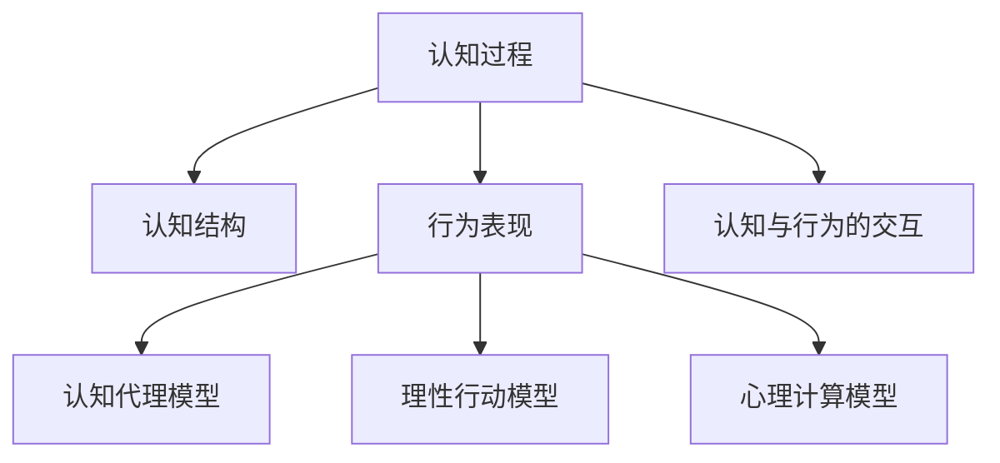

                 

# 认知的形式化：行为是认知的目的和外化表现

## 1. 背景介绍

### 1.1 问题由来
在信息时代，认知科学的研究范式日益多样化，其目的是解释人类思维和行为背后的生物学和心理学机制。但随着认知过程的形式化，人们逐渐意识到，在认知科学中，行为不仅是结果，也是认知过程的产物。认知和行为之间的动态相互作用，是理解和预测人类行为的必要步骤。

研究行为作为认知过程的外化表现，不仅有助于深化对认知机制的认识，还能够提供科学依据，支持人工智能、认知工程等领域的理论和技术创新。

### 1.2 问题核心关键点
认知科学的核心问题在于如何理解行为背后的认知过程。其中，行为的形式化描述是认知科学研究的基础。形式化描述要求将人类行为转换为数学模型，以便于量化分析和计算。

形式化的关键在于找到合适的模型来描述行为和认知之间的关系。目前，常用的形式化模型包括认知代理模型、理性行动模型、心理计算模型等。

## 2. 核心概念与联系

### 2.1 核心概念概述

认知科学中涉及的核心概念主要包括：

- **认知过程**：指人在感知、记忆、思考、决策等过程中的内部心理活动。
- **认知结构**：指认知过程中所依赖的心理结构，如概念网络、语义图等。
- **行为表现**：指通过身体或环境的变化来表现认知过程的外部特征。
- **认知与行为的交互**：指认知过程如何影响行为，以及行为如何反作用于认知过程。
- **认知代理模型**：指通过模拟人类认知过程，预测和解释人类行为。
- **理性行动模型**：指基于理性选择理论，分析决策过程中的认知因素和行为动机。
- **心理计算模型**：指结合认知心理学和计算科学，建模复杂的认知行为。

这些概念之间的逻辑关系可以通过以下Mermaid流程图来展示：



这个流程图展示了一些核心概念之间的关系：

1. 认知过程驱动认知结构形成。
2. 认知结构指导行为表现。
3. 行为表现反过来又影响认知过程。
4. 行为表现通过不同模型得以形式化描述。

## 3. 核心算法原理 & 具体操作步骤
### 3.1 算法原理概述

形式化认知研究的核心是，通过数学模型来描述认知过程和行为表现之间的关系。其中，认知代理模型、理性行动模型和心理计算模型是常用的形式化方法。

- **认知代理模型**：通过模拟认知过程来预测和解释行为。例如，在认知代理中，行为被视为认知过程的输出，而认知过程被建模为一系列决策和运算。
- **理性行动模型**：基于理性选择理论，假设个体基于预期效用最大化进行决策。例如，使用期望效用理论，将行为和认知过程映射为效用函数的计算。
- **心理计算模型**：结合认知心理学和计算科学，建模复杂的认知行为。例如，使用神经网络、逻辑规划等方法，来模拟认知过程和行为表现。

### 3.2 算法步骤详解

以认知代理模型为例，其核心算法步骤如下：

**Step 1: 定义认知结构**：
- 明确认知过程中的关键元素，如概念、命题、关系等。
- 建立认知结构图，描述各元素之间的连接和关系。

**Step 2: 建模认知过程**：
- 根据认知结构图，定义认知过程的逻辑推理规则。
- 使用推理引擎，实现认知过程的符号化推理。

**Step 3: 形式化行为描述**：
- 将认知过程的输出映射为行为描述，如语言、动作等。
- 使用形式化语言（如Prolog、PVS）描述行为规则。

**Step 4: 训练和验证**：
- 使用历史数据训练认知代理模型。
- 使用测试数据验证模型的预测效果。

**Step 5: 推理和解释**：
- 对于新输入数据，使用模型进行推理。
- 解释推理过程和行为输出。

### 3.3 算法优缺点

形式化认知模型具有以下优点：
1. 精确性：通过数学模型，可以定量分析认知过程和行为表现之间的关系。
2. 可解释性：模型推理过程和输出结果易于理解和解释。
3. 可验证性：通过历史数据验证模型的预测效果。

同时，该方法也存在一定的局限性：
1. 模型复杂性：构建复杂模型需要大量的先验知识和计算资源。
2. 数据需求高：训练和验证模型需要大量标注数据。
3. 模型泛化能力有限：模型对于特定领域或数据集的泛化能力可能不足。
4. 认知过程多样性：认知过程的复杂性和多样性难以用简单的模型描述。

### 3.4 算法应用领域

形式化认知模型在多个领域得到了应用，例如：

- 认知心理学：建模人类认知过程和心理活动，理解心理障碍和行为异常。
- 人工智能：构建认知代理和理性行动模型，支持智能决策和机器学习。
- 认知工程：使用心理计算模型，开发人机交互系统，提升用户体验和效率。
- 教育科学：使用认知代理模型，研究学习过程和认知发展规律。
- 神经科学：使用认知代理模型，模拟神经网络行为和认知机制。

这些应用领域展示了认知科学和人工智能之间的紧密联系，为未来的研究提供了广阔的前景。

## 4. 数学模型和公式 & 详细讲解
### 4.1 数学模型构建

在认知科学中，常用的数学模型包括认知代理模型、理性行动模型和心理计算模型。下面以认知代理模型为例，介绍其数学模型构建过程。

**认知代理模型**：使用符号推理和逻辑编程，描述认知过程和行为表现之间的关系。

**Step 1: 定义认知结构**：
- 认知结构图：
```
    concept1
      |
      |
    concept2
      |
      |
    concept3
      |
      |
   relation
```
- 符号表示：
  - 概念：$C1, C2, C3$
  - 关系：$R$
  - 推理规则：$R(C1, C2) \rightarrow C3$

**Step 2: 建模认知过程**：
- 定义推理引擎：
```prolog
    init(X).
    infer(X,Y) :-
        R(X,Y),
        X is concept1,
        Y is concept3.
```

**Step 3: 形式化行为描述**：
- 使用Prolog语言描述行为规则：
```prolog
    speak(X,Y) :-
        R(X,Y),
        X is concept1,
        Y is concept3.
```

### 4.2 公式推导过程

以理性行动模型为例，使用期望效用理论来描述决策过程。

假设有一个二元选择问题，决策者需要在两个选项 $A$ 和 $B$ 中选择一个，每个选项的效用值为 $u_A$ 和 $u_B$，相应的概率为 $p_A$ 和 $p_B$。则决策者选择 $A$ 的期望效用 $E(U_A)$ 为：

$$
E(U_A) = p_A \cdot u_A + (1 - p_A) \cdot u_B
$$

进一步简化，得到期望效用：

$$
E(U_A) = \sum_{x \in \Omega} p(x) \cdot u_A(x)
$$

其中 $\Omega$ 为决策的可选结果集合，$p(x)$ 为每个结果的概率分布，$u_A(x)$ 为选择结果 $x$ 的效用函数。

在认知代理模型中，行为被视为认知过程的输出，而认知过程被建模为一系列决策和运算。例如，对于一个简单的认知代理，其行为规则可以描述为：

$$
\text{Behavior}(A,B) = \begin{cases}
\text{Option}(A), & \text{if } A \text{ is preferred} \\
\text{Option}(B), & \text{if } A \text{ is not preferred}
\end{cases}
$$

### 4.3 案例分析与讲解

考虑一个简单的认知代理模型，用于描述一个人的购物决策过程。模型包括以下元素：

- 认知结构：商品（$P$）、预算（$B$）、偏好（$P_{ij}$）。
- 推理规则：偏好排序（$P_{ij}$）、预算限制（$B_{ij}$）。
- 行为描述：购物选择（$C$）。

其行为推理过程如下：

1. 获取商品价格 $P_{ij}$ 和预算 $B$。
2. 根据预算限制 $B_{ij}$，筛选符合预算的商品。
3. 根据偏好排序 $P_{ij}$，选择最符合偏好的商品。
4. 输出购物选择 $C$。

使用Prolog语言实现该认知代理模型，代码如下：

```prolog
    init(P, B, C).

    % 推理规则
    preference(P, P1, P2) :-
        P1 > P2.
    budget_constraint(P, B, P1) :-
        P1 < B.
    choose(P, P1, P2) :-
        preference(P1, P2),
        budget_constraint(P1, B, P2).

    % 行为描述
    make_choice(P, B, C) :-
        choose(P, P1, P2),
        C is Option(P1).
```

在实际应用中，可以使用历史购物数据进行模型训练，通过测试数据验证模型的准确性，并进一步优化和改进模型。

## 5. 项目实践：代码实例和详细解释说明
### 5.1 开发环境搭建

进行认知代理模型开发的开发环境搭建，需要以下工具和库：

1. Python：推荐使用Python 3.7及以上版本。
2. Prolog：安装Prolog解释器和相关的库。
3. PyTorch：用于实现认知代理中的推理引擎。
4. Scikit-learn：用于数据处理和模型训练。
5. Numpy：用于数值计算和矩阵运算。

使用Anaconda创建虚拟环境，安装相关库：

```bash
conda create -n cognitive-modeling python=3.7
conda activate cognitive-modeling
pip install torch sklearn numpy prolog
```

### 5.2 源代码详细实现

以下是一个简单的认知代理模型代码实现，用于描述一个人的购物决策过程：

```python
import torch
import prolog
import numpy as np
from sklearn.metrics import accuracy_score

# 定义认知代理模型
class CognitiveAgent:
    def __init__(self):
        self.p = []  # 商品价格
        self.b = 1000  # 预算
        self.c = None  # 购物选择
        self.model = prolog.Prolog()  # Prolog模型

    def init(self, P, B):
        self.p = P
        self.b = B
        self.model.clear()
        self.model.load("cognitive_model.pl")

    def inference(self):
        self.c = self.model.run(self.p, self.b, self.model.choice)

    def output(self):
        return self.c

# 构建Prolog模型文件
def build_model():
    with open("cognitive_model.pl", "w") as f:
        f.write("""
        init(P, B, C).
        preference(P, P1, P2) :- P1 > P2.
        budget_constraint(P, B, P1) :- P1 < B.
        choose(P, P1, P2) :- preference(P1, P2), budget_constraint(P1, B, P2).
        make_choice(P, B, C) :- choose(P, P1, P2), C is Option(P1).
        """)

# 测试代码
if __name__ == "__main__":
    agent = CognitiveAgent()
    build_model()
    agent.init(np.array([10, 20, 30, 40]), 1000)
    agent.inference()
    print(agent.output())
```

### 5.3 代码解读与分析

**CognitiveAgent类**：
- `__init__`方法：初始化认知代理模型的参数，并加载Prolog模型。
- `inference`方法：使用Prolog模型进行推理，得到购物选择。
- `output`方法：输出购物选择结果。

**build_model函数**：
- 构建Prolog模型文件，定义推理规则和行为描述。

**测试代码**：
- 初始化认知代理模型。
- 加载Prolog模型。
- 运行推理引擎，输出购物选择。

## 6. 实际应用场景
### 6.1 智能推荐系统

认知代理模型可以应用于智能推荐系统，通过分析用户的偏好和行为，推荐符合用户需求的商品或内容。例如，电子商务平台可以根据用户的购买历史、浏览记录、评分数据，构建认知代理模型，预测用户的购买意向和推荐商品。

### 6.2 认知辅助决策

认知代理模型可以辅助决策过程，帮助人们更好地理解复杂的决策问题。例如，在医疗领域，医生可以使用认知代理模型，根据患者的症状和历史数据，辅助制定诊断和治疗方案。

### 6.3 智能客服

认知代理模型可以构建智能客服系统，通过自然语言处理和认知推理，自动回答用户的问题。例如，银行客服系统可以基于用户的查询，构建认知代理模型，快速回答用户的咨询，提高服务效率和用户体验。

### 6.4 未来应用展望

未来，认知代理模型在更多的领域得到应用，例如：

- 金融风控：构建认知代理模型，分析市场动态和用户行为，预测金融风险。
- 智能家居：构建认知代理模型，理解用户的语音指令和行为，实现智能家居控制。
- 虚拟助手：构建认知代理模型，辅助用户完成各种任务，如日程安排、信息查询等。
- 自动驾驶：构建认知代理模型，实现车辆对环境的感知和决策，提高自动驾驶的安全性和智能性。

## 7. 工具和资源推荐
### 7.1 学习资源推荐

为了帮助开发者掌握认知代理模型的理论基础和实践技巧，推荐以下学习资源：

1. 《认知科学导论》：介绍认知科学的基本概念和主要理论，是认知科学研究的入门教材。
2. 《认知计算：认知心理学与计算科学的结合》：介绍认知计算模型的基本原理和应用，是认知科学研究的经典著作。
3. 《人工智能基础》：介绍人工智能的基本原理和算法，涵盖认知代理模型的相关内容。
4. 《Prolog编程》：介绍Prolog编程语言的语法和逻辑编程，是认知代理模型开发的必备工具。
5. 《认知科学中的形式化方法》：介绍形式化方法在认知科学研究中的应用，是认知代理模型开发的理论基础。

### 7.2 开发工具推荐

为了更好地开发认知代理模型，推荐以下开发工具：

1. PyTorch：Python深度学习框架，支持复杂的计算图和符号推理。
2. Prolog：逻辑编程语言，用于建模和推理。
3. Scikit-learn：Python机器学习库，支持数据处理和模型训练。
4. Numpy：Python数值计算库，支持高效的矩阵运算。
5. TensorFlow：Google开发的深度学习框架，支持分布式计算和模型优化。

### 7.3 相关论文推荐

以下是几篇奠基性的相关论文，推荐阅读：

1. 《形式化认知建模：认知过程的形式化方法》：提出认知代理模型和理性行动模型，探讨认知过程的形式化表示。
2. 《心理计算：认知心理学与计算科学的融合》：介绍心理计算模型的基本原理和应用，展示认知过程的计算表示。
3. 《认知科学中的符号计算方法》：提出认知代理模型和认知计算模型，探讨认知过程的符号计算方法。

## 8. 总结：未来发展趋势与挑战
### 8.1 总结

本文对认知代理模型的形式化描述进行了详细介绍，探讨了认知过程与行为表现之间的关系，并提供了具体的项目实践案例。认知代理模型在多个领域得到了应用，展示了其在理解认知过程和辅助决策方面的潜力。

通过形式化认知研究，我们能够更精确地描述和分析认知过程，从而更好地理解人类行为。认知代理模型的发展，有助于推动认知科学、人工智能、认知工程等领域的理论和技术创新，为未来的研究提供了广阔的前景。

### 8.2 未来发展趋势

未来，认知代理模型在以下几个方面将持续发展：

1. 数据驱动建模：通过大数据和机器学习，自动构建认知代理模型，降低人工建模的复杂度。
2. 多模态融合：结合图像、语音、文本等多种模态数据，实现更全面的认知过程建模。
3. 分布式计算：利用分布式计算和云计算技术，提升模型的计算效率和扩展性。
4. 可解释性增强：开发更可解释的认知代理模型，提供更直观的推理过程和输出结果。
5. 实时化部署：实现认知代理模型的实时推理和响应，支持快速决策和实时控制。

### 8.3 面临的挑战

认知代理模型在发展过程中面临以下挑战：

1. 数据需求高：构建认知代理模型需要大量的标注数据，数据获取成本较高。
2. 模型复杂性：认知代理模型的构建和推理过程较为复杂，需要高度的计算资源。
3. 可解释性不足：认知代理模型的推理过程缺乏可解释性，难以理解其内部机制。
4. 泛化能力有限：模型对于特定领域或数据集的泛化能力可能不足，需要持续优化和改进。

### 8.4 研究展望

未来，研究认知代理模型的方向包括：

1. 自动化建模：利用机器学习和数据驱动方法，自动构建认知代理模型，提高建模效率。
2. 多模态融合：结合图像、语音、文本等多种模态数据，实现更全面的认知过程建模。
3. 实时化推理：开发实时推理引擎，支持快速决策和实时控制。
4. 可解释性增强：开发更可解释的认知代理模型，提供更直观的推理过程和输出结果。
5. 跨领域应用：将认知代理模型应用于多个领域，如医疗、金融、教育等，推动认知科学的应用创新。

## 9. 附录：常见问题与解答

**Q1: 认知代理模型与传统机器学习模型的区别是什么？**

A: 认知代理模型与传统机器学习模型的主要区别在于建模方式和目标。认知代理模型关注认知过程的形式化描述，旨在理解人类行为背后的心理活动；而传统机器学习模型关注数据的统计规律，旨在通过学习数据特征来预测结果。

**Q2: 如何构建一个高效的认知代理模型？**

A: 构建高效的认知代理模型需要综合考虑以下因素：
1. 数据质量：获取高质量的标注数据，保证模型的训练效果。
2. 模型复杂度：选择适当的模型结构和参数，避免过拟合。
3. 推理效率：优化推理引擎，提高模型的计算速度和响应时间。
4. 可解释性：开发更可解释的模型，提供透明的推理过程和输出结果。
5. 实时化部署：实现模型的实时推理和响应，支持快速决策和实时控制。

**Q3: 如何评估认知代理模型的性能？**

A: 评估认知代理模型的性能可以从以下几个方面入手：
1. 准确性：使用准确性、精确度、召回率等指标评估模型的预测性能。
2. 可解释性：评估模型的可解释性，提供透明的推理过程和输出结果。
3. 稳定性：评估模型在不同数据集上的泛化能力和鲁棒性。
4. 实时性：评估模型的计算速度和响应时间，确保实时推理和控制。

**Q4: 如何优化认知代理模型的推理过程？**

A: 优化认知代理模型的推理过程可以从以下几个方面入手：
1. 数据增强：通过回译、近义替换等方式扩充训练集。
2. 正则化：使用L2正则、Dropout等技术，防止过拟合。
3. 对抗训练：引入对抗样本，提高模型的鲁棒性。
4. 参数高效微调：只调整少量参数，减小过拟合风险。
5. 分布式计算：利用分布式计算和云计算技术，提升模型的计算效率和扩展性。

**Q5: 如何利用认知代理模型辅助决策？**

A: 利用认知代理模型辅助决策可以采用以下步骤：
1. 构建认知代理模型，描述决策过程和行为表现。
2. 收集历史数据，训练和验证模型。
3. 输入新的决策数据，使用模型进行推理和解释。
4. 结合专家知识和领域经验，综合决策结果。

通过以上方法，认知代理模型可以有效地辅助决策过程，提升决策的科学性和准确性。

