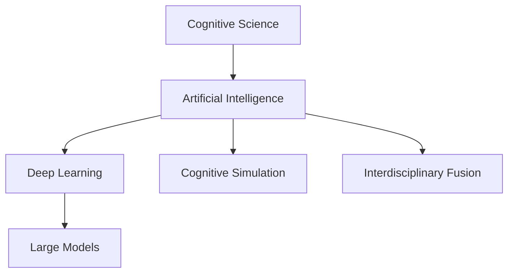
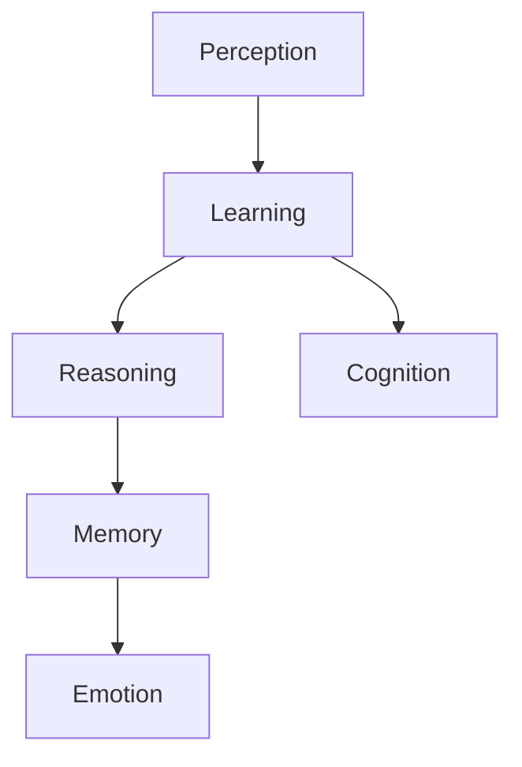
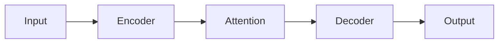

                 

# 认知过程中的深刻化演变

## 1. 背景介绍

在人类进化的长河中，认知能力一直是推动社会进步的核心动力。从最初的原始感官，到语言的产生，再到知识的积累，每一次认知的深刻化演变都深刻地影响了人类的生产和生活方式。随着人工智能技术的兴起，尤其是深度学习和大模型的发展，我们终于有机会从根本上重新思考和模拟人类的认知过程。

### 1.1 问题由来

现代认知科学和人工智能领域的交叉，为我们提供了一个全新的视角来理解认知过程。人工智能，尤其是深度学习和大模型的发展，使得机器能够处理和理解越来越复杂的认知任务，例如自然语言处理、视觉识别、情感分析等。但是，这些技术背后的认知模型与人类认知的差异依然巨大，导致许多看似简单却困扰人类多年的问题，在机器世界中仍然没有得到解答。

### 1.2 问题核心关键点

- **认知科学**：研究人类认知过程的学科，涵盖了感知、记忆、思维、情感等多个方面。
- **人工智能**：通过机器学习等算法，使机器具备一定的认知能力，可以模仿人类的感知、学习、推理等过程。
- **深度学习**：基于神经网络的机器学习技术，尤其擅长处理非线性关系和复杂模式，常用于图像识别、自然语言处理等任务。
- **大模型**：以Transformer为代表的大型预训练语言模型，通过海量的无监督学习，具备强大的语言理解和生成能力。
- **认知模拟**：使用人工智能技术，试图模拟人类认知过程，构建更接近真实世界的智能系统。
- **跨学科融合**：认知科学与人工智能、神经科学、心理学等多学科的交叉，带来对认知过程的全面理解和深度模拟。

这些核心概念之间的联系可以用以下Mermaid流程图来表示：



这个流程图展示了认知科学如何与人工智能、深度学习和大模型紧密相连，最终推动了认知模拟和跨学科融合的发展。

## 2. 核心概念与联系

### 2.1 核心概念概述

认知科学的核心概念是理解人类认知过程的机制和规律。人工智能，尤其是深度学习和大模型，则是尝试通过机器学习的方法，模拟人类的感知、学习、推理等认知能力。

- **感知**：认知的第一步，通过感官收集环境信息。
- **学习**：通过经验积累，模型能够逐渐适应新环境。
- **推理**：基于已有知识和经验，进行逻辑推理和决策。
- **记忆**：存储和检索信息，支持长期学习和经验积累。
- **情感**：情感在认知过程中起着重要的调节作用。

### 2.2 核心概念原理和架构的 Mermaid 流程图



这个流程图展示了感知、学习、推理、记忆和情感在认知过程中的相互作用和递进关系。每个环节都依赖于前一个环节的结果，并且共同构成了完整的认知过程。

## 3. 核心算法原理 & 具体操作步骤

### 3.1 算法原理概述

基于大模型的认知模拟，核心在于通过预训练语言模型（如BERT、GPT等）进行泛化学习，然后在特定任务上进行微调。其核心思想是：首先使用大规模无标签数据进行预训练，使得模型能够捕捉到语言和视觉等数据中的普遍规律和模式。在此基础上，对小规模有标签数据进行微调，使模型能够针对具体任务进行优化，从而实现对复杂认知任务的模拟。

### 3.2 算法步骤详解

基于大模型的认知模拟一般包括以下几个关键步骤：

1. **准备数据集**：收集特定任务的数据集，包括训练集、验证集和测试集。
2. **预训练模型**：选择适合的预训练模型，如BERT、GPT等，作为基础模型。
3. **微调模型**：使用微调框架，将预训练模型应用于特定任务，更新部分或全部参数。
4. **评估和优化**：在验证集上评估模型性能，根据评估结果调整超参数和优化策略。
5. **测试和部署**：在测试集上测试模型效果，并将模型部署到实际应用中。

### 3.3 算法优缺点

基于大模型的认知模拟具有以下优点：

- **泛化能力强**：预训练模型在处理大规模数据时，可以学习到普遍规律，适用于多种认知任务。
- **适应性强**：微调框架可以快速适应特定任务，提高模型的准确性和效率。
- **可解释性差**：大模型的黑盒特性导致其决策过程难以解释，难以进行调试和优化。
- **资源需求高**：大规模模型的训练和推理需要高性能计算资源，成本较高。

### 3.4 算法应用领域

基于大模型的认知模拟在多个领域得到了应用，例如：

- **自然语言处理**：机器翻译、情感分析、文本生成等任务。
- **视觉识别**：图像分类、物体检测、人脸识别等任务。
- **情感分析**：社交媒体情感监测、客户反馈分析等任务。
- **知识图谱**：构建和查询知识图谱，支持复杂推理和决策。
- **智能推荐**：个性化推荐系统，提高用户体验。
- **医疗诊断**：辅助诊断疾病，提高医疗效率。

## 4. 数学模型和公式 & 详细讲解 & 举例说明

### 4.1 数学模型构建

基于大模型的认知模拟，一般使用神经网络模型进行建模。以自然语言处理为例，可以使用Transformer模型，其基本结构如图：



其中，输入文本通过Encoder层进行编码，Encoder层包含多层自注意力机制，能够捕捉到文本中的上下文信息。然后，通过Attention层对Encoder的输出进行加权求和，得到上下文表示。最后，通过Decoder层生成目标文本，完成翻译、分类等任务。

### 4.2 公式推导过程

以自然语言处理的机器翻译任务为例，假设输入序列为 $x=\{x_1,x_2,\ldots,x_n\}$，输出序列为 $y=\{y_1,y_2,\ldots,y_m\}$，其中 $n$ 和 $m$ 分别表示源语言和目标语言的长度。假设模型的输入为 $x_i$，输出为 $y_j$，模型的损失函数为交叉熵损失函数 $L$：

$$
L = -\frac{1}{N}\sum_{i,j}^N \log p(y_j|x_i)
$$

其中 $p(y_j|x_i)$ 表示在给定输入 $x_i$ 的情况下，输出 $y_j$ 的概率。模型的目标是最小化这个损失函数，即：

$$
\theta^* = \mathop{\arg\min}_{\theta} L(\theta)
$$

其中 $\theta$ 为模型参数，包括Encoder和Decoder的权重。

### 4.3 案例分析与讲解

以BERT为例，其预训练过程主要分为掩码语言模型和下一句预测两种任务。掩码语言模型是指在输入序列中随机遮盖一些位置，然后预测被遮盖位置的单词。下一句预测是指给定两个句子，预测它们是否为连续的。BERT通过这两种任务进行预训练，学习到丰富的语言表示。

## 5. 项目实践：代码实例和详细解释说明

### 5.1 开发环境搭建

在进行认知模拟的实践前，我们需要准备好开发环境。以下是使用Python进行PyTorch开发的环境配置流程：

1. 安装Anaconda：从官网下载并安装Anaconda，用于创建独立的Python环境。

2. 创建并激活虚拟环境：
```bash
conda create -n pytorch-env python=3.8 
conda activate pytorch-env
```

3. 安装PyTorch：根据CUDA版本，从官网获取对应的安装命令。例如：
```bash
conda install pytorch torchvision torchaudio cudatoolkit=11.1 -c pytorch -c conda-forge
```

4. 安装其他依赖库：
```bash
pip install transformers torchtext sklearn
```

完成上述步骤后，即可在`pytorch-env`环境中开始实践。

### 5.2 源代码详细实现

我们使用HuggingFace的Transformers库，以BERT为例，进行文本分类任务的微调。代码如下：

```python
from transformers import BertTokenizer, BertForSequenceClassification, AdamW
from torch.utils.data import Dataset, DataLoader
from torch.nn import CrossEntropyLoss
from sklearn.metrics import accuracy_score

# 准备数据集
class TextDataset(Dataset):
    def __init__(self, texts, labels):
        self.texts = texts
        self.labels = labels
        self.tokenizer = BertTokenizer.from_pretrained('bert-base-uncased')
    
    def __len__(self):
        return len(self.texts)
    
    def __getitem__(self, item):
        text = self.texts[item]
        label = self.labels[item]
        
        encoding = self.tokenizer(text, padding='max_length', truncation=True, max_length=512, return_tensors='pt')
        input_ids = encoding['input_ids']
        attention_mask = encoding['attention_mask']
        labels = torch.tensor(label, dtype=torch.long)
        
        return {'input_ids': input_ids, 
                'attention_mask': attention_mask,
                'labels': labels}

# 准备数据加载器
train_dataset = TextDataset(train_texts, train_labels)
dev_dataset = TextDataset(dev_texts, dev_labels)
test_dataset = TextDataset(test_texts, test_labels)

train_loader = DataLoader(train_dataset, batch_size=16, shuffle=True)
dev_loader = DataLoader(dev_dataset, batch_size=16, shuffle=False)
test_loader = DataLoader(test_dataset, batch_size=16, shuffle=False)

# 准备模型和优化器
model = BertForSequenceClassification.from_pretrained('bert-base-uncased', num_labels=2)
optimizer = AdamW(model.parameters(), lr=2e-5)

# 准备损失函数
criterion = CrossEntropyLoss()

# 训练过程
model.train()
for epoch in range(epochs):
    for batch in train_loader:
        inputs = batch['input_ids'].to(device)
        attention_mask = batch['attention_mask'].to(device)
        labels = batch['labels'].to(device)
        
        model.zero_grad()
        outputs = model(inputs, attention_mask=attention_mask, labels=labels)
        loss = criterion(outputs, labels)
        loss.backward()
        optimizer.step()
        
    # 验证过程
    model.eval()
    total_correct = 0
    total_labels = 0
    with torch.no_grad():
        for batch in dev_loader:
            inputs = batch['input_ids'].to(device)
            attention_mask = batch['attention_mask'].to(device)
            labels = batch['labels'].to(device)
            
            outputs = model(inputs, attention_mask=attention_mask, labels=None)
            preds = torch.argmax(outputs, dim=1).to('cpu').tolist()
            total_correct += sum([1 for pred, label in zip(preds, labels) if pred == label])
            total_labels += len(labels)
    
    dev_acc = total_correct / total_labels
    
    print(f"Epoch {epoch+1}, dev accuracy: {dev_acc:.2f}")

# 测试过程
model.eval()
total_correct = 0
total_labels = 0
with torch.no_grad():
    for batch in test_loader:
        inputs = batch['input_ids'].to(device)
        attention_mask = batch['attention_mask'].to(device)
        labels = batch['labels'].to(device)
        
        outputs = model(inputs, attention_mask=attention_mask, labels=None)
        preds = torch.argmax(outputs, dim=1).to('cpu').tolist()
        total_correct += sum([1 for pred, label in zip(preds, labels) if pred == label])
        total_labels += len(labels)
        
test_acc = total_correct / total_labels
print(f"Test accuracy: {test_acc:.2f}")
```

### 5.3 代码解读与分析

**TextDataset类**：
- `__init__`方法：初始化文本和标签，以及BERT分词器。
- `__len__`方法：返回数据集的样本数量。
- `__getitem__`方法：对单个样本进行处理，将文本输入编码为token ids，并将标签转换为模型可接受的格式。

**训练和验证过程**：
- 使用PyTorch的DataLoader对数据集进行批次化加载，供模型训练和推理使用。
- 训练函数循环迭代，每个epoch对训练集进行前向传播和反向传播，更新模型参数。
- 验证函数在验证集上评估模型性能，并输出验证准确率。

**测试过程**：
- 在测试集上评估模型，输出最终测试准确率。

这个代码实现展示了使用PyTorch和Transformers库进行BERT微调的基本流程。可以看到，代码实现非常简单，开发者只需要关注任务适配层的设计和超参数的调整，即可以实现高效的认知模拟。

## 6. 实际应用场景

### 6.1 智能客服系统

基于大模型的认知模拟，可以广泛应用于智能客服系统的构建。传统客服往往需要配备大量人力，高峰期响应缓慢，且一致性和专业性难以保证。而使用认知模拟的对话模型，可以7x24小时不间断服务，快速响应客户咨询，用自然流畅的语言解答各类常见问题。

在技术实现上，可以收集企业内部的历史客服对话记录，将问题和最佳答复构建成监督数据，在此基础上对预训练模型进行微调。微调后的模型能够自动理解用户意图，匹配最合适的答案模板进行回复。对于客户提出的新问题，还可以接入检索系统实时搜索相关内容，动态组织生成回答。如此构建的智能客服系统，能大幅提升客户咨询体验和问题解决效率。

### 6.2 金融舆情监测

金融机构需要实时监测市场舆论动向，以便及时应对负面信息传播，规避金融风险。传统的人工监测方式成本高、效率低，难以应对网络时代海量信息爆发的挑战。基于大模型的认知模拟的文本分类和情感分析技术，为金融舆情监测提供了新的解决方案。

具体而言，可以收集金融领域相关的新闻、报道、评论等文本数据，并对其进行主题标注和情感标注。在此基础上对预训练语言模型进行微调，使其能够自动判断文本属于何种主题，情感倾向是正面、中性还是负面。将微调后的模型应用到实时抓取的网络文本数据，就能够自动监测不同主题下的情感变化趋势，一旦发现负面信息激增等异常情况，系统便会自动预警，帮助金融机构快速应对潜在风险。

### 6.3 个性化推荐系统

当前的推荐系统往往只依赖用户的历史行为数据进行物品推荐，无法深入理解用户的真实兴趣偏好。基于大模型认知模拟的个性化推荐系统，可以更好地挖掘用户行为背后的语义信息，从而提供更精准、多样的推荐内容。

在实践中，可以收集用户浏览、点击、评论、分享等行为数据，提取和用户交互的物品标题、描述、标签等文本内容。将文本内容作为模型输入，用户的后续行为（如是否点击、购买等）作为监督信号，在此基础上微调预训练语言模型。微调后的模型能够从文本内容中准确把握用户的兴趣点。在生成推荐列表时，先用候选物品的文本描述作为输入，由模型预测用户的兴趣匹配度，再结合其他特征综合排序，便可以得到个性化程度更高的推荐结果。

### 6.4 未来应用展望

随着大模型和认知模拟技术的不断发展，认知模拟方法将在更多领域得到应用，为传统行业带来变革性影响。

在智慧医疗领域，基于认知模拟的医疗问答、病历分析、药物研发等应用将提升医疗服务的智能化水平，辅助医生诊疗，加速新药开发进程。

在智能教育领域，认知模拟可应用于作业批改、学情分析、知识推荐等方面，因材施教，促进教育公平，提高教学质量。

在智慧城市治理中，认知模拟可应用于城市事件监测、舆情分析、应急指挥等环节，提高城市管理的自动化和智能化水平，构建更安全、高效的未来城市。

此外，在企业生产、社会治理、文娱传媒等众多领域，基于认知模拟的智能应用也将不断涌现，为经济社会发展注入新的动力。相信随着技术的日益成熟，认知模拟方法将成为认知过程模拟的重要范式，推动认知过程模拟技术迈向更广泛的应用。

## 7. 工具和资源推荐

### 7.1 学习资源推荐

为了帮助开发者系统掌握认知模拟的理论基础和实践技巧，这里推荐一些优质的学习资源：

1. 《深度学习》系列书籍：Ian Goodfellow等著，深入浅出地介绍了深度学习的原理和实践。
2. 《认知科学》系列课程：各大高校开设的认知科学课程，涵盖感知、学习、记忆、推理等多个方面。
3. 《自然语言处理综述》论文：ACL2020年度论文，总结了自然语言处理领域的最新进展。
4. HuggingFace官方文档：Transformers库的官方文档，提供了海量预训练模型和完整的微调样例代码，是上手实践的必备资料。
5. Weights & Biases：模型训练的实验跟踪工具，可以记录和可视化模型训练过程中的各项指标，方便对比和调优。
6. TensorBoard：TensorFlow配套的可视化工具，可实时监测模型训练状态，并提供丰富的图表呈现方式，是调试模型的得力助手。

通过对这些资源的学习实践，相信你一定能够快速掌握认知模拟的精髓，并用于解决实际的认知问题。

### 7.2 开发工具推荐

高效的开发离不开优秀的工具支持。以下是几款用于认知模拟开发的常用工具：

1. PyTorch：基于Python的开源深度学习框架，灵活动态的计算图，适合快速迭代研究。
2. TensorFlow：由Google主导开发的开源深度学习框架，生产部署方便，适合大规模工程应用。
3. Transformers库：HuggingFace开发的NLP工具库，集成了众多SOTA语言模型，支持PyTorch和TensorFlow，是进行认知模拟任务开发的利器。
4. Weights & Biases：模型训练的实验跟踪工具，可以记录和可视化模型训练过程中的各项指标，方便对比和调优。
5. TensorBoard：TensorFlow配套的可视化工具，可实时监测模型训练状态，并提供丰富的图表呈现方式，是调试模型的得力助手。
6. Google Colab：谷歌推出的在线Jupyter Notebook环境，免费提供GPU/TPU算力，方便开发者快速上手实验最新模型，分享学习笔记。

合理利用这些工具，可以显著提升认知模拟任务的开发效率，加快创新迭代的步伐。

### 7.3 相关论文推荐

认知模拟的研究源于学界的持续研究。以下是几篇奠基性的相关论文，推荐阅读：

1. Attention is All You Need：提出了Transformer结构，开启了NLP领域的预训练大模型时代。
2. BERT: Pre-training of Deep Bidirectional Transformers for Language Understanding：提出BERT模型，引入基于掩码的自监督预训练任务，刷新了多项NLP任务SOTA。
3. Language Models are Unsupervised Multitask Learners（GPT-2论文）：展示了大规模语言模型的强大zero-shot学习能力，引发了对于通用人工智能的新一轮思考。
4. GPT-3: Language Models are Few-Shot Learners：提出GPT-3模型，通过大量的预训练和微调，实现了更加强大的多任务学习能力。
5. Multi-Task Learning with Curriculum Control：提出多任务学习框架，利用多任务的协同训练，提升模型的泛化能力。

这些论文代表了大模型认知模拟的发展脉络。通过学习这些前沿成果，可以帮助研究者把握学科前进方向，激发更多的创新灵感。

## 8. 总结：未来发展趋势与挑战

### 8.1 总结

本文对基于大模型的认知模拟方法进行了全面系统的介绍。首先阐述了认知科学和人工智能领域的交叉，明确了认知模拟在理解和模拟人类认知过程中的独特价值。其次，从原理到实践，详细讲解了认知模拟的数学模型、核心算法和具体操作步骤，给出了认知模拟任务开发的完整代码实例。同时，本文还广泛探讨了认知模拟方法在智能客服、金融舆情、个性化推荐等多个行业领域的应用前景，展示了认知模拟范式的巨大潜力。此外，本文精选了认知模拟技术的各类学习资源，力求为读者提供全方位的技术指引。

通过本文的系统梳理，可以看到，基于大模型的认知模拟方法正在成为认知过程模拟的重要范式，极大地拓展了认知模拟的应用边界，催生了更多的落地场景。受益于大规模语料的预训练，认知模拟模型以更低的时间和标注成本，在小样本条件下也能取得不俗的效果，有力推动了认知模拟技术的产业化进程。未来，伴随预训练语言模型和认知模拟方法的持续演进，相信认知模拟技术必将带来认知过程模拟的深刻变革，为认知过程模拟技术的发展带来新的突破。

### 8.2 未来发展趋势

展望未来，认知模拟技术将呈现以下几个发展趋势：

1. 模型规模持续增大。随着算力成本的下降和数据规模的扩张，预训练语言模型的参数量还将持续增长。超大规模语言模型蕴含的丰富语言知识，有望支撑更加复杂多变的认知任务。
2. 认知模拟方法日趋多样。除了传统的基于神经网络的模拟方法外，未来会涌现更多基于符号逻辑、因果推理等方法，从多个维度模拟人类认知过程。
3. 跨模态认知模拟崛起。当前的认知模拟主要聚焦于文本数据，未来会进一步拓展到图像、视频、语音等多模态数据模拟。多模态信息的融合，将显著提升认知模拟对现实世界的理解和建模能力。
4. 认知模拟系统成为常识推理引擎。基于大模型的认知模拟将更好地学习常识知识和规则，能够在复杂多变的情境下进行推理和决策，逐步迈向常识推理引擎的目标。
5. 认知模拟与多智能体系统结合。通过引入多智能体系统，模拟多个认知主体之间的交互，可以构建更加复杂的认知过程模拟系统，增强系统的智能性和适应性。
6. 认知模拟的伦理和社会影响得到重视。随着认知模拟技术的广泛应用，其伦理和社会影响也越来越重要。如何在认知模拟中引入伦理导向，确保模拟过程的安全性和公平性，将成为一个重要的研究方向。

以上趋势凸显了认知模拟技术的广阔前景。这些方向的探索发展，必将进一步提升认知模拟模型的性能和应用范围，为认知过程模拟带来新的突破。

### 8.3 面临的挑战

尽管认知模拟技术已经取得了瞩目成就，但在迈向更加智能化、普适化应用的过程中，它仍面临着诸多挑战：

1. 标注成本瓶颈。虽然认知模拟大大降低了标注数据的需求，但对于长尾应用场景，难以获得充足的高质量标注数据，成为制约认知模拟性能的瓶颈。如何进一步降低认知模拟对标注样本的依赖，将是一大难题。
2. 模型鲁棒性不足。当前认知模拟模型面对域外数据时，泛化性能往往大打折扣。对于测试样本的微小扰动，认知模拟模型的预测也容易发生波动。如何提高认知模拟模型的鲁棒性，避免灾难性遗忘，还需要更多理论和实践的积累。
3. 推理效率有待提高。大规模认知模拟模型虽然精度高，但在实际部署时往往面临推理速度慢、内存占用大等效率问题。如何在保证性能的同时，简化模型结构，提升推理速度，优化资源占用，将是重要的优化方向。
4. 可解释性亟需加强。当前认知模拟模型更像是"黑盒"系统，难以解释其内部工作机制和决策逻辑。对于医疗、金融等高风险应用，算法的可解释性和可审计性尤为重要。如何赋予认知模拟模型更强的可解释性，将是亟待攻克的难题。
5. 安全性有待保障。预训练认知模拟模型难免会学习到有偏见、有害的信息，通过认知模拟传递到下游任务，产生误导性、歧视性的输出，给实际应用带来安全隐患。如何从数据和算法层面消除模型偏见，避免恶意用途，确保输出的安全性，也将是重要的研究课题。

6. 知识整合能力不足。现有的认知模拟模型往往局限于任务内数据，难以灵活吸收和运用更广泛的先验知识。如何让认知模拟过程更好地与外部知识库、规则库等专家知识结合，形成更加全面、准确的信息整合能力，还有很大的想象空间。

正视认知模拟面临的这些挑战，积极应对并寻求突破，将是大模型认知模拟走向成熟的必由之路。相信随着学界和产业界的共同努力，这些挑战终将一一被克服，大模型认知模拟必将在构建智能系统、推动认知科学发展中扮演越来越重要的角色。

### 8.4 研究展望

面对认知模拟面临的种种挑战，未来的研究需要在以下几个方面寻求新的突破：

1. 探索无监督和半监督认知模拟方法。摆脱对大规模标注数据的依赖，利用自监督学习、主动学习等无监督和半监督范式，最大限度利用非结构化数据，实现更加灵活高效的认知模拟。
2. 研究认知模拟的多智能体系统。引入多智能体系统，模拟多个认知主体之间的交互，构建更加复杂的认知过程模拟系统，增强系统的智能性和适应性。
3. 融合因果和对比学习范式。通过引入因果推断和对比学习思想，增强认知模拟建立稳定因果关系的能力，学习更加普适、鲁棒的语言表征，从而提升模型泛化性和抗干扰能力。
4. 引入更多先验知识。将符号化的先验知识，如知识图谱、逻辑规则等，与神经网络模型进行巧妙融合，引导认知模拟过程学习更准确、合理的语言模型。同时加强不同模态数据的整合，实现视觉、语音等多模态信息与文本信息的协同建模。
5. 结合因果分析和博弈论工具。将因果分析方法引入认知模拟模型，识别出模型决策的关键特征，增强输出解释的因果性和逻辑性。借助博弈论工具刻画人机交互过程，主动探索并规避模型的脆弱点，提高系统稳定性。
6. 纳入伦理道德约束。在认知模拟训练目标中引入伦理导向的评估指标，过滤和惩罚有偏见、有害的输出倾向。同时加强人工干预和审核，建立认知模拟行为的监管机制，确保输出符合人类价值观和伦理道德。

这些研究方向的探索，必将引领认知模拟技术迈向更高的台阶，为构建安全、可靠、可解释、可控的智能系统铺平道路。面向未来，认知模拟技术还需要与其他人工智能技术进行更深入的融合，如知识表示、因果推理、强化学习等，多路径协同发力，共同推动认知过程模拟系统的进步。只有勇于创新、敢于突破，才能不断拓展认知模拟的边界，让智能技术更好地造福人类社会。

## 9. 附录：常见问题与解答

**Q1：认知模拟是否适用于所有认知任务？**

A: 认知模拟在大多数认知任务上都能取得不错的效果，特别是对于数据量较小的任务。但对于一些特定领域的任务，如医学、法律等，仅仅依靠通用语料预训练的模型可能难以很好地适应。此时需要在特定领域语料上进一步预训练，再进行认知模拟，才能获得理想效果。此外，对于一些需要时效性、个性化很强的任务，如对话、推荐等，认知模拟方法也需要针对性的改进优化。

**Q2：在认知模拟过程中如何选择合适的学习率？**

A: 认知模拟的学习率一般要比预训练时小1-2个数量级，如果使用过大的学习率，容易破坏预训练权重，导致过拟合。一般建议从1e-5开始调参，逐步减小学习率，直至收敛。也可以使用warmup策略，在开始阶段使用较小的学习率，再逐渐过渡到预设值。需要注意的是，不同的优化器(如AdamW、Adafactor等)以及不同的学习率调度策略，可能需要设置不同的学习率阈值。

**Q3：在认知模拟过程中如何缓解过拟合问题？**

A: 过拟合是认知模拟面临的主要挑战，尤其是在标注数据不足的情况下。常见的缓解策略包括：
1. 数据增强：通过回译、近义替换等方式扩充训练集
2. 正则化：使用L2正则、Dropout、Early Stopping等避免过拟合
3. 对抗训练：引入对抗样本，提高模型鲁棒性
4. 参数高效认知模拟：只调整少量参数(如Adapter、Prefix等)，减小过拟合风险
5. 多模型集成：训练多个认知模拟模型，取平均输出，抑制过拟合

这些策略往往需要根据具体任务和数据特点进行灵活组合。只有在数据、模型、训练、推理等各环节进行全面优化，才能最大限度地发挥认知模拟的威力。

**Q4：在认知模拟中，如何保证模型的可解释性？**

A: 认知模拟模型的可解释性通常通过引入符号化知识或使用解释性算法来保证。例如，在知识图谱和规则库的基础上进行认知模拟，可以增强模型的可解释性。同时，使用因果分析和博弈论工具，也可以帮助理解和解释模型的决策过程。

**Q5：在认知模拟中，如何保证模型的安全性？**

A: 认知模拟模型的安全性可以通过数据预处理、模型审计和监督学习等方法来保障。例如，对输入数据进行清洗和匿名化处理，避免敏感信息泄露。同时，对模型的输出进行监督学习，及时发现和纠正有偏见、有害的输出倾向。

---

作者：禅与计算机程序设计艺术 / Zen and the Art of Computer Programming

