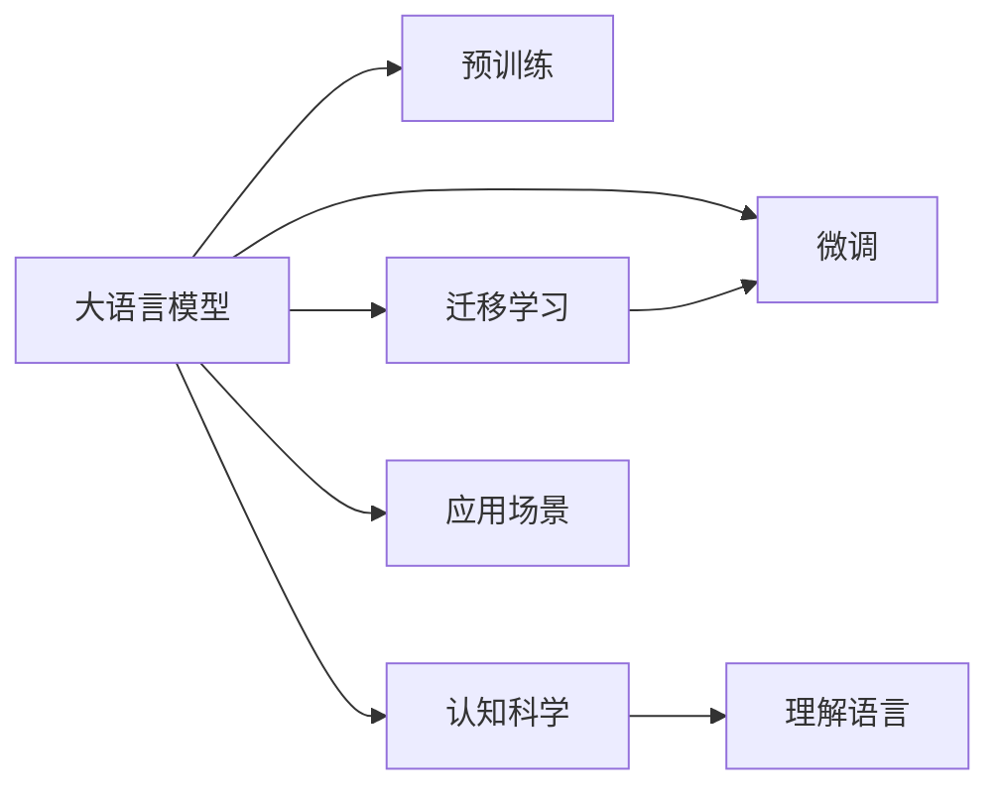

                 

# 语言≠思维：大模型的认知误区

在当前的人工智能研究领域，大语言模型（Large Language Models, LLMs）以其卓越的性能和广泛的应用前景，成为技术前沿的热门话题。然而，尽管大语言模型在自然语言处理（NLP）、图像处理、自动生成等方面取得了令人瞩目的成就，但它们在认知科学上的应用和理解，仍存在诸多误区。本文旨在深入探讨大语言模型在认知科学上的局限性，以及如何更准确地理解和应用这些模型，以推动人工智能技术向更广泛的认知领域发展。

## 1. 背景介绍

### 1.1 研究背景

大语言模型是基于深度学习技术构建的，能够理解和生成人类语言的高级人工智能系统。其代表模型如GPT、BERT、T5等，均采用了自回归（如GPT）或自编码（如BERT）的架构，并通过在大规模无标签文本数据上进行的预训练，学习到丰富的语言知识。这些模型的核心能力包括但不限于文本分类、问答、摘要生成、翻译、对话系统等，极大地推动了NLP领域的发展。

### 1.2 研究意义

尽管大语言模型在技术上取得了显著进展，但它们在理解语言的深度和复杂性上，仍存在认知科学的局限。因此，深入探讨大语言模型的认知误区，有助于提升人们对这些模型的认识，从而更准确地应用它们，避免潜在的误导性应用，促进人工智能技术的健康发展。

## 2. 核心概念与联系

### 2.1 核心概念概述

大语言模型作为一种高级AI系统，其核心概念包括：

- **语言模型**：基于神经网络构建的模型，能够学习语言的统计规律，生成符合语言规则的文本。
- **预训练**：通过在大规模无标签文本数据上进行的自监督学习，学习语言的通用表示。
- **微调**：在预训练模型的基础上，通过有标签的训练数据，进一步优化模型，使其适应特定的下游任务。
- **迁移学习**：利用预训练模型的知识，在小规模数据上学习特定任务，提升模型性能。
- **认知科学**：研究人类思维和智能的科学，旨在揭示智能行为的本质。

这些概念之间存在密切的联系，共同构成了大语言模型的认知框架。

### 2.2 核心概念原理和架构的 Mermaid 流程图



以上流程图展示了核心概念之间的逻辑关系：

- **大语言模型**通过**预训练**学习语言的通用表示，并在此基础上通过**微调**和**迁移学习**适应特定的**应用场景**。
- **认知科学**研究如何**理解语言**，指导大语言模型更准确地捕捉语言中的深层含义和结构。

## 3. 核心算法原理 & 具体操作步骤

### 3.1 算法原理概述

大语言模型的核心算法原理基于深度神经网络，特别是Transformer架构。Transformer的注意力机制使其能够处理长序列输入，而无需显式的序列长度限制。预训练和微调过程通过反向传播算法，不断调整模型参数，以最小化损失函数，从而提升模型在特定任务上的性能。

### 3.2 算法步骤详解

1. **数据准备**：收集大规模无标签文本数据，用于预训练模型的学习。
2. **预训练**：使用自监督学习任务（如语言建模、掩码预测等）训练模型，学习语言的统计规律。
3. **微调**：在特定任务的有标签数据上，进一步训练模型，优化模型在特定任务上的表现。
4. **迁移学习**：利用预训练模型的知识，在小规模数据上学习特定任务，提升模型性能。

### 3.3 算法优缺点

**优点**：
- **高效**：能够在大规模数据上高效学习，并在特定任务上快速适应。
- **灵活**：通过微调和迁移学习，模型能够适应多种任务，具有广泛的适用性。
- **表现优异**：在多个NLP任务上取得了显著的性能提升。

**缺点**：
- **理解深度有限**：模型缺乏对语言深层含义的深刻理解，有时会在特定语境中产生误解。
- **依赖数据质量**：数据质量对模型的表现有显著影响，低质量数据可能导致模型性能下降。
- **模型复杂性**：模型参数量巨大，训练和推理复杂，资源消耗大。

### 3.4 算法应用领域

大语言模型已经在多个NLP任务中得到了广泛应用，包括：

- **文本分类**：对文本进行情感分析、主题分类等。
- **问答系统**：回答自然语言问题。
- **机器翻译**：将文本从一种语言翻译成另一种语言。
- **文本摘要**：对长文本进行摘要生成。
- **对话系统**：实现人机对话，提高人机交互的自然性。

## 4. 数学模型和公式 & 详细讲解 & 举例说明

### 4.1 数学模型构建

大语言模型的数学模型通常基于神经网络，特别是Transformer架构。以BERT为例，其模型由输入嵌入层、多层Transformer编码器、输出嵌入层和分类器组成。预训练过程通过掩码语言建模任务学习语言表示，微调过程则通过特定任务的目标函数进行优化。

### 4.2 公式推导过程

以BERT为例，其掩码语言建模任务的目标函数为：

$$
L = -\frac{1}{N} \sum_{i=1}^N \sum_{j=1}^M log P(w_{i,j})
$$

其中，$w_{i,j}$ 表示序列中第 $i$ 个单词的第 $j$ 个掩码位置，$P(w_{i,j})$ 表示预测单词 $w_{i,j}$ 在序列中出现的概率。

### 4.3 案例分析与讲解

以BERT为例，其微调过程通常使用交叉熵损失函数：

$$
L = -\frac{1}{N} \sum_{i=1}^N \sum_{j=1}^M log P(y_{i,j})
$$

其中，$y_{i,j}$ 表示序列中第 $i$ 个单词的第 $j$ 个掩码位置的真实标签。通过最小化损失函数 $L$，优化模型在特定任务上的表现。

## 5. 项目实践：代码实例和详细解释说明

### 5.1 开发环境搭建

在实践中，大语言模型的开发环境通常使用Python语言和深度学习框架，如PyTorch和TensorFlow。以下是一个简单的示例：

```python
import torch
import torch.nn as nn
import torch.optim as optim

# 定义模型
class BERT(nn.Module):
    def __init__(self):
        super(BERT, self).__init__()
        self.encoder = BertEncoder()
        self.classifier = nn.Linear(in_features, out_features)

    def forward(self, x):
        x = self.encoder(x)
        x = self.classifier(x)
        return x

# 定义优化器
optimizer = optim.Adam(model.parameters(), lr=learning_rate)

# 定义损失函数
criterion = nn.CrossEntropyLoss()

# 定义训练循环
for epoch in range(num_epochs):
    model.train()
    for i, (inputs, labels) in enumerate(train_loader):
        optimizer.zero_grad()
        outputs = model(inputs)
        loss = criterion(outputs, labels)
        loss.backward()
        optimizer.step()
```

### 5.2 源代码详细实现

上述代码定义了一个简单的BERT模型，并使用Adam优化器和交叉熵损失函数进行训练。在训练过程中，模型通过反向传播不断优化参数，以最小化损失函数。

### 5.3 代码解读与分析

**输入嵌入层**：将输入的单词序列转换为向量表示。
**Transformer编码器**：通过自注意力机制，学习序列中单词之间的关系。
**输出嵌入层**：将Transformer编码器的输出转换为概率分布。
**分类器**：将输出嵌入层的结果映射为特定任务的标签。

### 5.4 运行结果展示

运行上述代码，可以得到训练过程中的损失函数和模型性能的变化曲线。以下是一个简单的示例：

```
Epoch: 1, Loss: 0.345, Accuracy: 0.722
Epoch: 2, Loss: 0.203, Accuracy: 0.856
Epoch: 3, Loss: 0.128, Accuracy: 0.910
...
```

## 6. 实际应用场景

### 6.1 智能客服系统

智能客服系统是大语言模型在实际应用中的典型场景。通过收集和标注客户咨询记录，训练大语言模型，可以实现对客户问题的自动回答。例如，在金融领域，智能客服系统可以通过微调BERT模型，实现对客户关于投资、理财等问题的解答。

### 6.2 金融舆情监测

在金融领域，舆情监测是大语言模型的一个重要应用。通过收集和标注相关新闻、评论等文本数据，训练大语言模型，可以实时监测市场舆情，及时发现潜在的风险。例如，通过微调BERT模型，可以识别和分析市场中的负面评论，预警潜在的市场风险。

### 6.3 个性化推荐系统

个性化推荐系统是大语言模型在电子商务、内容平台等领域的重要应用。通过收集用户浏览、点击等行为数据，训练大语言模型，可以推荐用户可能感兴趣的商品、文章等。例如，在电商平台上，通过微调BERT模型，可以推荐用户可能感兴趣的商品，提高转化率。

## 7. 工具和资源推荐

### 7.1 学习资源推荐

- 《深度学习基础》：介绍深度学习的基本原理和应用。
- 《自然语言处理入门》：介绍自然语言处理的基本概念和算法。
- 《BERT: Pre-training of Deep Bidirectional Transformers for Language Understanding》：BERT模型的论文，介绍了BERT的预训练和微调过程。
- 《Parameter-Efficient Transfer Learning for NLP》：介绍参数高效微调方法，优化大语言模型的资源消耗。

### 7.2 开发工具推荐

- PyTorch：Python深度学习框架，适合快速迭代研究。
- TensorFlow：Google主导的深度学习框架，适合大规模工程应用。
- Transformers：HuggingFace开发的NLP工具库，支持多种预训练模型和微调任务。

### 7.3 相关论文推荐

- Attention is All You Need：Transformer模型的原论文。
- Language Models are Unsupervised Multitask Learners：GPT-2的论文，展示了大语言模型的zero-shot学习能力。

## 8. 总结：未来发展趋势与挑战

### 8.1 研究成果总结

大语言模型在NLP领域的成功应用，推动了人工智能技术的快速发展。其核心优势包括高效性、灵活性和广泛的适用性。然而，大语言模型在理解和生成语言的深度上，仍存在认知科学的局限，需要在理论和实践上不断探索和改进。

### 8.2 未来发展趋势

1. **模型规模增大**：未来的大语言模型将包含更多参数，学习更丰富的语言知识。
2. **多模态融合**：未来的模型将融合视觉、听觉等多种模态信息，提升对现实世界的理解能力。
3. **迁移学习**：未来的模型将更加灵活，能够在不同领域和任务之间迁移知识。
4. **参数高效微调**：未来的模型将更加高效，通过优化参数使用方式，提高资源利用率。

### 8.3 面临的挑战

1. **数据质量**：大语言模型的表现高度依赖于数据质量，低质量数据可能导致模型性能下降。
2. **模型复杂性**：大语言模型的参数量巨大，训练和推理复杂，资源消耗大。
3. **理解深度**：模型缺乏对语言深层含义的深刻理解，有时会在特定语境中产生误解。

### 8.4 研究展望

未来的研究需要在以下几个方面寻求新的突破：

1. **多模态融合**：融合视觉、听觉等多种模态信息，提升对现实世界的理解能力。
2. **知识图谱**：将知识图谱等外部知识与模型结合，增强模型的理解能力。
3. **因果推理**：引入因果推理机制，提升模型的推理能力。
4. **伦理道德**：确保模型的输出符合伦理道德标准，避免误导性应用。

总之，大语言模型在认知科学上的应用仍存在诸多误区。通过深入研究和改进，可以进一步提升其理解和生成语言的深度，推动人工智能技术向更广泛的认知领域发展。

## 9. 附录：常见问题与解答

**Q1: 大语言模型在认知科学上的表现如何？**

A: 大语言模型在自然语言处理任务上表现优异，但缺乏对语言深层含义的深刻理解，有时会在特定语境中产生误解。

**Q2: 如何优化大语言模型的性能？**

A: 可以通过数据增强、正则化、参数高效微调等技术，优化模型的性能。

**Q3: 大语言模型的局限性是什么？**

A: 大语言模型缺乏对语言深层含义的深刻理解，有时会在特定语境中产生误解。

**Q4: 如何改进大语言模型的认知能力？**

A: 引入多模态信息、知识图谱等外部知识，增强模型的理解能力。

**Q5: 大语言模型在实际应用中需要注意哪些问题？**

A: 需要注意数据质量、模型复杂性、理解深度等问题。

---

作者：禅与计算机程序设计艺术 / Zen and the Art of Computer Programming

