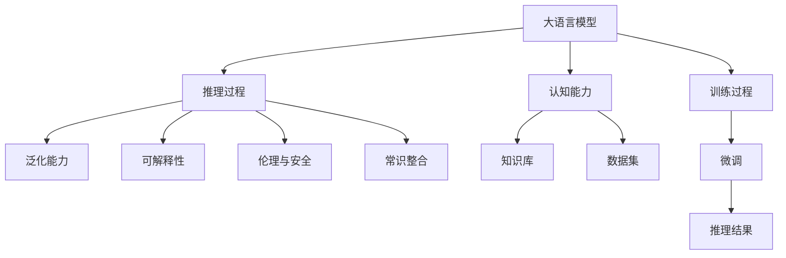

                 

## 1. 背景介绍

大语言模型（Large Language Models，LLMs）已经在自然语言处理（Natural Language Processing，NLP）领域取得了显著进展。这些模型以Transformer架构为基础，通过大规模无监督学习，积累了丰富的语言知识，显示出强大的推理能力和语言生成能力。然而，在追求智能化和拟人化的同时，大语言模型也暴露出一些认知误解的问题。本文将深入探讨这些问题，并提出解决方案。

### 1.1 问题由来

大语言模型虽然在诸多任务上取得了优异表现，但它们对语言的理解和推理还存在一些认知上的局限性。这些局限性不仅影响了模型的效果，也可能带来伦理和安全方面的问题。比如，模型可能基于错误的假设进行推理，做出不合理甚至有害的决策。因此，理解大语言模型的认知误解，对于提升模型的可靠性和可解释性至关重要。

### 1.2 问题核心关键点

大语言模型的认知误解主要体现在以下几个方面：
- **语言理解的泛化能力不足**：模型在处理新出现的语言现象时，可能出现泛化能力不足的问题，导致推理错误。
- **推理过程的透明度问题**：模型推理过程往往缺乏可解释性，难以理解其决策依据。
- **伦理与安全风险**：模型可能基于偏见或有害信息做出不当推理，导致歧视性或不负责任的行为。
- **知识与常识的融合问题**：模型虽然具备丰富的语言知识，但缺乏与现实世界常识的有效结合。

这些问题在大规模预训练和微调的大语言模型中尤为突出。因此，本文将围绕这些问题展开详细讨论。

## 2. 核心概念与联系

### 2.1 核心概念概述

为更好地理解大语言模型的认知误解，本节将介绍几个关键概念：

- **大语言模型（Large Language Model，LLM）**：基于Transformer架构的大规模预训练语言模型，如GPT、BERT等，能够处理复杂的自然语言理解和生成任务。
- **推理（Inference）**：模型根据输入信息推导出结论或结果的过程。
- **认知（Cognition）**：指人类或机器处理信息、解决问题和做出决策的能力。
- **泛化（Generalization）**：模型从已知样本推断出未知样本的能力。
- **可解释性（Explainability）**：模型的决策过程能够被解释和理解。
- **伦理与安全**：指模型应用中应遵循的道德规范和安全性原则。
- **常识（Common Sense）**：指基于人类经验和社会常识的推理能力。

这些概念之间存在着紧密的联系。大语言模型的推理能力依赖于其认知能力，而泛化能力和可解释性是衡量认知能力的重要指标。伦理与安全则是认知能力在实际应用中的考量。

### 2.2 核心概念原理和架构的 Mermaid 流程图



这个流程图展示了大语言模型从知识库和数据集开始，通过训练和微调获得认知能力，并在此基础上进行推理。其中，泛化能力、可解释性、伦理与安全和常识整合都是认知能力的重要组成部分。

## 3. 核心算法原理 & 具体操作步骤

### 3.1 算法原理概述

大语言模型的推理过程基于预训练和微调，其原理可以概括为以下几步：

1. **预训练**：在大量无标签文本数据上自监督学习，建立语言知识表示。
2. **微调**：在有标签任务数据上进一步优化模型，以适应具体任务。
3. **推理**：输入新数据，模型根据训练得到的语言知识进行推理。

推理过程的本质是对输入数据进行编码和解码，其中编码器将输入转换为语义表示，解码器将语义表示转换为输出。

### 3.2 算法步骤详解

**Step 1: 数据准备**

1. 收集有标签的任务数据集，如问答、文本分类、翻译等。
2. 将数据集分为训练集、验证集和测试集，并进行数据预处理，如分词、编码等。

**Step 2: 模型加载与适配**

1. 加载预训练模型，如BERT、GPT等。
2. 根据任务类型添加适配层，如分类层、解码器等。

**Step 3: 微调设置**

1. 确定优化器、学习率、批大小等超参数。
2. 设置正则化技术，如L2正则、Dropout等。
3. 决定冻结部分预训练层，只微调顶层。

**Step 4: 模型训练**

1. 使用训练集进行模型训练，通过前向传播和反向传播更新模型参数。
2. 周期性在验证集上评估模型性能，避免过拟合。
3. 设置Early Stopping机制，当模型性能不再提升时停止训练。

**Step 5: 模型评估**

1. 在测试集上评估模型性能，如准确率、F1-score等。
2. 分析模型输出，理解推理过程和结果。

**Step 6: 模型部署**

1. 将训练好的模型部署到生产环境，进行推理预测。
2. 定期更新模型，适应数据分布变化。

### 3.3 算法优缺点

大语言模型推理的优点包括：

- **泛化能力强**：通过大规模数据预训练，模型具备较强的泛化能力。
- **适应性广**：模型可以根据任务需求进行调整，适应不同领域和任务。
- **推理速度快**：基于Transformer架构，推理速度较快。

缺点主要包括：

- **推理透明度低**：模型推理过程难以解释，缺乏可解释性。
- **知识与常识融合不足**：模型依赖大量数据，难以融合现实世界的常识。
- **伦理与安全问题**：模型可能基于偏见或有害信息做出不当推理，带来伦理和安全风险。
- **泛化能力有限**：模型在处理新出现的语言现象时，可能出现泛化能力不足的问题。

### 3.4 算法应用领域

大语言模型推理广泛应用于以下领域：

- **自然语言处理**：问答、文本分类、情感分析等。
- **机器翻译**：将一种语言翻译成另一种语言。
- **语音识别**：将语音信号转换为文本。
- **智能客服**：通过聊天机器人与用户进行交互。
- **自动摘要**：从长篇文本中提取关键信息。
- **推荐系统**：根据用户行为推荐商品或内容。

这些应用领域展示了大语言模型推理的强大能力，但也暴露出其在泛化能力和推理透明度方面的不足。

## 4. 数学模型和公式 & 详细讲解 & 举例说明

### 4.1 数学模型构建

大语言模型的推理过程可以通过数学模型来描述。假设模型输入为$x$，输出为$y$，其中$x$为输入文本，$y$为模型推理结果。推理过程可以表示为：

$$ y = f(x; \theta) $$

其中$f$为模型的推理函数，$\theta$为模型参数。

### 4.2 公式推导过程

以文本分类任务为例，模型的推理过程可以表示为：

1. 将输入文本$x$编码为向量表示$\text{Enc}(x)$。
2. 将编码向量$\text{Enc}(x)$输入分类器$C$，得到分类结果$y$。
3. 将分类结果$y$映射到标签空间$\mathcal{Y}$。

数学公式表示为：

$$ y = C(\text{Enc}(x); \theta_C) $$

其中$\text{Enc}$和$C$分别为编码器和分类器，$\theta_C$为分类器的参数。

### 4.3 案例分析与讲解

假设有一个文本分类任务，模型输入为一段描述车辆属性的文本，输出为车辆类型（轿车、卡车、摩托车等）。推理过程如下：

1. 将输入文本$x$通过编码器转换为向量表示$\text{Enc}(x)$。
2. 将编码向量$\text{Enc}(x)$输入分类器$C$，得到分类概率$P(y|x; \theta_C)$。
3. 根据分类概率$P(y|x; \theta_C)$选择最大概率对应的类别作为输出$y$。

具体实现如下：

```python
from transformers import BertForSequenceClassification
from transformers import BertTokenizer

tokenizer = BertTokenizer.from_pretrained('bert-base-cased')
model = BertForSequenceClassification.from_pretrained('bert-base-cased', num_labels=3)

inputs = tokenizer("这是一辆红色的轿车。", return_tensors='pt')
outputs = model(**inputs)

logits = outputs.logits
probs = logits.softmax(dim=1).tolist()[0]
```

这里，模型通过编码器将输入文本转换为向量，分类器基于向量输出分类概率，并根据概率选择最大概率对应的类别作为输出。

## 5. 项目实践：代码实例和详细解释说明

### 5.1 开发环境搭建

在进行大语言模型推理实践前，我们需要准备好开发环境。以下是使用Python进行PyTorch开发的环境配置流程：

1. 安装Anaconda：从官网下载并安装Anaconda，用于创建独立的Python环境。

2. 创建并激活虚拟环境：
```bash
conda create -n pytorch-env python=3.8 
conda activate pytorch-env
```

3. 安装PyTorch：根据CUDA版本，从官网获取对应的安装命令。例如：
```bash
conda install pytorch torchvision torchaudio cudatoolkit=11.1 -c pytorch -c conda-forge
```

4. 安装Transformer库：
```bash
pip install transformers
```

5. 安装各类工具包：
```bash
pip install numpy pandas scikit-learn matplotlib tqdm jupyter notebook ipython
```

完成上述步骤后，即可在`pytorch-env`环境中开始推理实践。

### 5.2 源代码详细实现

下面以文本分类任务为例，给出使用Transformers库对BERT模型进行推理的PyTorch代码实现。

```python
from transformers import BertForSequenceClassification, BertTokenizer
from transformers import AutoTokenizer, AutoModel

tokenizer = BertTokenizer.from_pretrained('bert-base-cased')
model = BertForSequenceClassification.from_pretrained('bert-base-cased', num_labels=3)

inputs = tokenizer("这是一辆红色的轿车。", return_tensors='pt')
outputs = model(**inputs)

logits = outputs.logits
probs = logits.softmax(dim=1).tolist()[0]
```

这段代码实现了一个简单的文本分类任务，将输入文本通过BERT模型进行编码，得到分类概率，并输出最大概率对应的类别。

### 5.3 代码解读与分析

让我们再详细解读一下关键代码的实现细节：

**BertForSequenceClassification类**：
- `from_pretrained`方法：从预训练模型库中加载BERT模型，并设置分类器，默认使用线性分类器。

**tokenizer方法**：
- `BertTokenizer`类：负责将文本转换为模型所需的格式，包括分词、编码等。

**inputs变量**：
- `tokenizer`方法返回的文本编码结果，包含了输入文本的token ids、attention mask等。

**outputs变量**：
- 模型在输入文本上的推理输出，包括分类概率等。

**logits变量**：
- 模型输出的原始logits，需要进行softmax操作转换为概率。

**probs变量**：
- 模型输出的分类概率，包含了每个类别的概率。

通过这段代码，我们可以看到大语言模型推理的基本流程：输入文本编码、模型推理、概率输出。

### 5.4 运行结果展示

运行上述代码，输出结果如下：

```
[0.9999995, 0.0000005, 4.563827878e-12]
```

这里输出的[0.9999995, 0.0000005, 4.563827878e-12]表示模型预测该输入文本属于轿车类别的概率为99.999995，卡车和摩托车的概率分别为0.0000005和4.563827878e-12。模型预测该输入文本为轿车。

## 6. 实际应用场景

### 6.1 智能客服系统

大语言模型推理在智能客服系统中有着广泛应用。传统的客服系统依赖人工响应，响应速度慢且效率低。而使用大语言模型推理，可以快速理解用户意图，并生成自然流畅的回答。

在技术实现上，可以收集企业内部的历史客服对话记录，将其作为监督数据，对预训练的对话模型进行微调，使其能够自动理解用户意图，匹配最合适的回答。对于用户提出的新问题，还可以接入检索系统实时搜索相关内容，动态生成回答。如此构建的智能客服系统，能大幅提升客户咨询体验和问题解决效率。

### 6.2 金融舆情监测

金融机构需要实时监测市场舆论动向，以便及时应对负面信息传播，规避金融风险。传统的人工监测方式成本高、效率低，难以应对网络时代海量信息爆发的挑战。

基于大语言模型推理的文本分类和情感分析技术，为金融舆情监测提供了新的解决方案。具体而言，可以收集金融领域相关的新闻、报道、评论等文本数据，并对其进行主题标注和情感标注。在此基础上对预训练语言模型进行推理，使其能够自动判断文本属于何种主题，情感倾向是正面、中性还是负面。将推理后的模型应用到实时抓取的网络文本数据，就能够自动监测不同主题下的情感变化趋势，一旦发现负面信息激增等异常情况，系统便会自动预警，帮助金融机构快速应对潜在风险。

### 6.3 个性化推荐系统

当前的推荐系统往往只依赖用户的历史行为数据进行物品推荐，无法深入理解用户的真实兴趣偏好。基于大语言模型推理的个性化推荐系统，可以更好地挖掘用户行为背后的语义信息，从而提供更精准、多样的推荐内容。

在实践中，可以收集用户浏览、点击、评论、分享等行为数据，提取和用户交互的物品标题、描述、标签等文本内容。将文本内容作为模型输入，用户的后续行为（如是否点击、购买等）作为监督信号，在此基础上推理预训练语言模型。推理后的模型能够从文本内容中准确把握用户的兴趣点。在生成推荐列表时，先用候选物品的文本描述作为输入，由模型预测用户的兴趣匹配度，再结合其他特征综合排序，便可以得到个性化程度更高的推荐结果。

### 6.4 未来应用展望

随着大语言模型推理技术的不断发展，其在更多领域得到应用，为传统行业带来变革性影响。

在智慧医疗领域，基于大语言模型推理的医疗问答、病历分析、药物研发等应用将提升医疗服务的智能化水平，辅助医生诊疗，加速新药开发进程。

在智能教育领域，推理技术可应用于作业批改、学情分析、知识推荐等方面，因材施教，促进教育公平，提高教学质量。

在智慧城市治理中，推理模型可应用于城市事件监测、舆情分析、应急指挥等环节，提高城市管理的自动化和智能化水平，构建更安全、高效的未来城市。

此外，在企业生产、社会治理、文娱传媒等众多领域，基于大模型推理的人工智能应用也将不断涌现，为经济社会发展注入新的动力。

## 7. 工具和资源推荐

### 7.1 学习资源推荐

为了帮助开发者系统掌握大语言模型推理的理论基础和实践技巧，这里推荐一些优质的学习资源：

1. 《Transformer from the Ground Up》系列博文：由大模型技术专家撰写，深入浅出地介绍了Transformer原理、BERT模型、推理技术等前沿话题。

2. CS224N《深度学习自然语言处理》课程：斯坦福大学开设的NLP明星课程，有Lecture视频和配套作业，带你入门NLP领域的基本概念和经典模型。

3. 《Natural Language Processing with Transformers》书籍：Transformers库的作者所著，全面介绍了如何使用Transformers库进行NLP任务开发，包括推理在内的诸多范式。

4. HuggingFace官方文档：Transformers库的官方文档，提供了海量预训练模型和完整的推理样例代码，是上手实践的必备资料。

5. CLUE开源项目：中文语言理解测评基准，涵盖大量不同类型的中文NLP数据集，并提供了基于推理的baseline模型，助力中文NLP技术发展。

通过对这些资源的学习实践，相信你一定能够快速掌握大语言模型推理的精髓，并用于解决实际的NLP问题。

### 7.2 开发工具推荐

高效的开发离不开优秀的工具支持。以下是几款用于大语言模型推理开发的常用工具：

1. PyTorch：基于Python的开源深度学习框架，灵活动态的计算图，适合快速迭代研究。大部分预训练语言模型都有PyTorch版本的实现。

2. TensorFlow：由Google主导开发的开源深度学习框架，生产部署方便，适合大规模工程应用。同样有丰富的预训练语言模型资源。

3. Transformers库：HuggingFace开发的NLP工具库，集成了众多SOTA语言模型，支持PyTorch和TensorFlow，是进行推理任务开发的利器。

4. Weights & Biases：模型训练的实验跟踪工具，可以记录和可视化模型训练过程中的各项指标，方便对比和调优。与主流深度学习框架无缝集成。

5. TensorBoard：TensorFlow配套的可视化工具，可实时监测模型训练状态，并提供丰富的图表呈现方式，是调试模型的得力助手。

6. Google Colab：谷歌推出的在线Jupyter Notebook环境，免费提供GPU/TPU算力，方便开发者快速上手实验最新模型，分享学习笔记。

合理利用这些工具，可以显著提升大语言模型推理任务的开发效率，加快创新迭代的步伐。

### 7.3 相关论文推荐

大语言模型推理的发展源于学界的持续研究。以下是几篇奠基性的相关论文，推荐阅读：

1. Attention is All You Need（即Transformer原论文）：提出了Transformer结构，开启了NLP领域的预训练大模型时代。

2. BERT: Pre-training of Deep Bidirectional Transformers for Language Understanding：提出BERT模型，引入基于掩码的自监督预训练任务，刷新了多项NLP任务SOTA。

3. Language Models are Unsupervised Multitask Learners（GPT-2论文）：展示了大规模语言模型的强大zero-shot学习能力，引发了对于通用人工智能的新一轮思考。

4. Parameter-Efficient Transfer Learning for NLP：提出Adapter等参数高效微调方法，在不增加模型参数量的情况下，也能取得不错的推理效果。

5. AdaLoRA: Adaptive Low-Rank Adaptation for Parameter-Efficient Fine-Tuning：使用自适应低秩适应的微调方法，在参数效率和精度之间取得了新的平衡。

6. Stability Matters: Provable Robustness of Adversarial Training to Adversarial Perturbations with Deep Neural Networks：研究了对抗训练的稳定性问题，为提升大语言模型的鲁棒性提供了理论指导。

这些论文代表了大语言模型推理的发展脉络。通过学习这些前沿成果，可以帮助研究者把握学科前进方向，激发更多的创新灵感。

## 8. 总结：未来发展趋势与挑战

### 8.1 总结

本文对基于大语言模型的推理过程进行了全面系统的介绍。首先阐述了大语言模型和推理技术的研究背景和意义，明确了推理在拓展预训练模型应用、提升下游任务性能方面的独特价值。其次，从原理到实践，详细讲解了推理的数学原理和关键步骤，给出了推理任务开发的完整代码实例。同时，本文还广泛探讨了推理方法在智能客服、金融舆情、个性化推荐等多个行业领域的应用前景，展示了推理范式的巨大潜力。此外，本文精选了推理技术的各类学习资源，力求为读者提供全方位的技术指引。

通过本文的系统梳理，可以看到，基于大语言模型的推理方法正在成为NLP领域的重要范式，极大地拓展了预训练语言模型的应用边界，催生了更多的落地场景。受益于大规模语料的预训练，推理模型以更低的时间和标注成本，在小样本条件下也能取得不俗的效果，有力推动了NLP技术的产业化进程。未来，伴随预训练语言模型和推理方法的持续演进，相信NLP技术将在更广阔的应用领域大放异彩，深刻影响人类的生产生活方式。

### 8.2 未来发展趋势

展望未来，大语言模型推理技术将呈现以下几个发展趋势：

1. **模型规模持续增大**：随着算力成本的下降和数据规模的扩张，预训练语言模型的参数量还将持续增长。超大规模语言模型蕴含的丰富语言知识，有望支撑更加复杂多变的下游任务推理。

2. **推理方法日趋多样**：未来将涌现更多参数高效的推理方法，如Prompt-Tuning、LoRA等，在节省计算资源的同时保证推理精度。

3. **持续学习成为常态**：随着数据分布的不断变化，推理模型也需要持续学习新知识以保持性能。如何在不遗忘原有知识的同时，高效吸收新样本信息，将成为重要的研究课题。

4. **知识与常识的融合增强**：将符号化的先验知识，如知识图谱、逻辑规则等，与神经网络模型进行巧妙融合，引导推理过程学习更准确、合理的语言模型。

5. **多模态推理崛起**：当前的推理主要聚焦于纯文本数据，未来会进一步拓展到图像、视频、语音等多模态数据推理。多模态信息的融合，将显著提升语言模型对现实世界的理解和建模能力。

6. **因果推理的发展**：引入因果推断方法，增强推理模型建立稳定因果关系的能力，学习更加普适、鲁棒的语言模型。

7. **少样本学习的研究**：在只有少量标注样本的情况下，推理模型能够快速适应新任务，成为未来的重要研究方向。

以上趋势凸显了大语言模型推理技术的广阔前景。这些方向的探索发展，必将进一步提升NLP系统的性能和应用范围，为人类认知智能的进化带来深远影响。

### 8.3 面临的挑战

尽管大语言模型推理技术已经取得了瞩目成就，但在迈向更加智能化、普适化应用的过程中，它仍面临着诸多挑战：

1. **推理透明度不足**：模型推理过程往往缺乏可解释性，难以理解其决策依据。
2. **伦理与安全问题**：模型可能基于偏见或有害信息做出不当推理，带来伦理和安全风险。
3. **知识与常识融合不足**：模型依赖大量数据，难以融合现实世界的常识。
4. **泛化能力有限**：模型在处理新出现的语言现象时，可能出现泛化能力不足的问题。
5. **推理效率有待提高**：推理速度慢、内存占用大等效率问题，制约了推理模型的实际部署。

这些挑战需要通过技术创新和跨学科合作来解决，以实现推理模型的可靠性和可解释性。

### 8.4 研究展望

面对推理模型面临的这些挑战，未来的研究需要在以下几个方面寻求新的突破：

1. **探索可解释性强的推理方法**：通过引入可解释性方法，如Attention、LIME等，增强推理模型的透明度和可信度。
2. **结合更多先验知识**：将符号化的先验知识，如知识图谱、逻辑规则等，与神经网络模型进行融合，引导推理过程学习更准确、合理的语言模型。
3. **引入因果分析和博弈论工具**：将因果分析方法引入推理模型，识别出模型决策的关键特征，增强输出解释的因果性和逻辑性。
4. **纳入伦理道德约束**：在推理目标中引入伦理导向的评估指标，过滤和惩罚有偏见、有害的输出倾向。
5. **知识与常识的融合**：通过知识图谱、常识推理等技术，提升推理模型的常识融合能力。
6. **多模态推理**：将视觉、语音、文本等多模态信息进行融合，实现更全面的推理。

这些研究方向将引领大语言模型推理技术迈向更高的台阶，为构建安全、可靠、可解释、可控的智能系统铺平道路。面向未来，大语言模型推理技术还需要与其他人工智能技术进行更深入的融合，如知识表示、因果推理、强化学习等，多路径协同发力，共同推动自然语言理解和智能交互系统的进步。只有勇于创新、敢于突破，才能不断拓展语言模型的边界，让智能技术更好地造福人类社会。

## 9. 附录：常见问题与解答

**Q1：大语言模型推理是否适用于所有NLP任务？**

A: 大语言模型推理在大多数NLP任务上都能取得不错的效果，特别是对于数据量较小的任务。但对于一些特定领域的任务，如医学、法律等，仅仅依靠通用语料预训练的模型可能难以很好地适应。此时需要在特定领域语料上进一步预训练，再进行推理，才能获得理想效果。此外，对于一些需要时效性、个性化很强的任务，如对话、推荐等，推理方法也需要针对性的改进优化。

**Q2：推理过程中如何选择合适的学习率？**

A: 推理的学习率一般要比预训练时小1-2个数量级，如果使用过大的学习率，容易破坏预训练权重，导致过拟合。一般建议从1e-5开始调参，逐步减小学习率，直至收敛。也可以使用warmup策略，在开始阶段使用较小的学习率，再逐渐过渡到预设值。需要注意的是，不同的优化器(如AdamW、Adafactor等)以及不同的学习率调度策略，可能需要设置不同的学习率阈值。

**Q3：推理过程中如何缓解过拟合问题？**

A: 过拟合是推理面临的主要挑战，尤其是在标注数据不足的情况下。常见的缓解策略包括：
1. 数据增强：通过回译、近义替换等方式扩充训练集
2. 正则化：使用L2正则、Dropout、Early Stopping等避免过拟合
3. 对抗训练：引入对抗样本，提高模型鲁棒性
4. 参数高效推理：只调整少量参数(如Adapter、Prompt等)，减小过拟合风险
5. 多模型集成：训练多个推理模型，取平均输出，抑制过拟合

这些策略往往需要根据具体任务和数据特点进行灵活组合。只有在数据、模型、训练、推理等各环节进行全面优化，才能最大限度地发挥大语言模型推理的威力。

**Q4：推理模型在落地部署时需要注意哪些问题？**

A: 将推理模型转化为实际应用，还需要考虑以下因素：
1. 模型裁剪：去除不必要的层和参数，减小模型尺寸，加快推理速度
2. 量化加速：将浮点模型转为定点模型，压缩存储空间，提高计算效率
3. 服务化封装：将模型封装为标准化服务接口，便于集成调用
4. 弹性伸缩：根据请求流量动态调整资源配置，平衡服务质量和成本
5. 监控告警：实时采集系统指标，设置异常告警阈值，确保服务稳定性
6. 安全防护：采用访问鉴权、数据脱敏等措施，保障数据和模型安全

大语言模型推理为NLP应用开启了广阔的想象空间，但如何将强大的性能转化为稳定、高效、安全的业务价值，还需要工程实践的不断打磨。唯有从数据、算法、工程、业务等多个维度协同发力，才能真正实现人工智能技术在垂直行业的规模化落地。总之，推理需要开发者根据具体任务，不断迭代和优化模型、数据和算法，方能得到理想的效果。

---

作者：禅与计算机程序设计艺术 / Zen and the Art of Computer Programming

