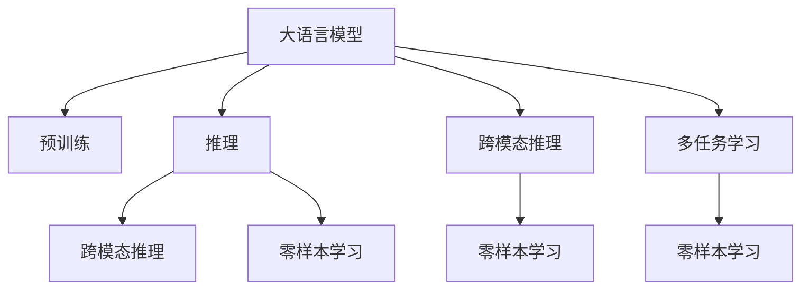

                 

# 语言与推理：大模型的难题

## 1. 背景介绍

在人工智能领域，语言处理和推理推理一直是研究的焦点。随着深度学习技术的突飞猛进，大语言模型（Large Language Models, LLMs）如GPT-3、BERT等，通过海量的无监督数据预训练，具备了强大的语言理解和生成能力。这些模型可以执行各种复杂的自然语言处理任务，如文本分类、命名实体识别、机器翻译、对话生成等。然而，大语言模型在推理能力上仍存在诸多难题，限制了其在实际应用中的表现和可信度。本文将深入探讨大模型的语言与推理问题，并给出一系列的解决方案。

## 2. 核心概念与联系

### 2.1 核心概念概述

为了更好地理解大语言模型的语言与推理难题，我们需要掌握以下几个核心概念：

- **大语言模型**：以自回归模型（如GPT）或自编码模型（如BERT）为代表，通过在大规模无标签文本数据上进行预训练，学习通用的语言表示，具备强大的语言理解和生成能力。

- **预训练**：指在大规模无标签文本数据上，通过自监督学习任务（如掩码语言模型、Next Sentence Prediction等）训练通用语言模型的过程。预训练使得模型学习到语言的通用表示。

- **推理**：指模型根据已有的语言知识和推理规则，对给定输入进行逻辑推断和解释，得出合理结论的过程。

- **跨模态推理**：指模型同时处理多种类型的数据，如文本、图像、语音等，并从中提取信息进行推理。

- **零样本学习**：指模型无需看到任何标注数据，仅凭任务描述就能执行新任务，如回答未知领域的问题。

这些概念之间有着紧密的联系：预训练提供了模型理解和处理语言的基础能力，推理则是在此基础上，通过逻辑推断和解释来执行任务。跨模态推理和零样本学习则是在更为复杂的情境下，对模型的语言能力进行扩展。

### 2.2 核心概念原理和架构的 Mermaid 流程图



这个流程图展示了核心概念之间的逻辑关系：

- 大语言模型通过预训练获得基础能力。
- 推理基于预训练，通过逻辑推断和解释来执行任务。
- 跨模态推理处理多种类型的数据，如文本、图像、语音等。
- 零样本学习在没有看到任何标注数据的情况下，仅凭任务描述就能执行新任务。
- 多任务学习通过同时学习多个任务来提升模型的泛化能力。

## 3. 核心算法原理 & 具体操作步骤

### 3.1 算法原理概述

大语言模型的推理难题主要源于其内在机制和结构设计。大模型通常是基于自回归或自编码的结构构建的，虽然在处理语言任务上表现出色，但在推理方面，尤其是跨模态和零样本推理上，仍存在不足。以下是几个关键点：

- **自回归设计**：自回归模型在生成文本时，每个位置只依赖前一个位置的输出，这种设计在处理连续的语言任务上效果显著，但在跨模态和零样本推理时，需要同时处理多个输入，无法直接应用于这些情境。
- **预训练目标**：大模型的预训练目标通常是语言模型的概率建模，而非直接的推理任务，导致模型在推理时缺乏明确的推理路径和逻辑。
- **模型规模与复杂度**：大模型由于规模庞大，推理过程复杂，难以直接应用到实际问题中。

### 3.2 算法步骤详解

为了克服大语言模型的推理难题，研究者们提出了多种策略。以下是几个典型的算法步骤：

**Step 1: 选择合适的推理模型**
- 根据任务类型，选择合适的推理模型。常见的推理模型包括图神经网络（Graph Neural Networks, GNN）、知识图谱（Knowledge Graphs）、逻辑推理网络（Logical Reasoning Networks）等。
- 对于自然语言推理（Natural Language Inference, NLI）任务，可以使用逻辑推理网络（如ProverNet）。
- 对于跨模态推理，可以使用联合嵌入（Joint Embedding）方法，将不同模态的数据映射到相同的向量空间，以便于模型处理。

**Step 2: 设计推理目标函数**
- 明确推理任务的目标函数，如最大化预测准确率、最小化推理错误率等。
- 对于零样本学习，可以通过设计提示模板（Prompt Template）来引导模型推理。
- 对于跨模态推理，可以通过多任务学习（Multi-task Learning），同时优化多个任务的推理目标函数。

**Step 3: 优化推理算法**
- 选择合适的优化算法，如梯度下降、Adam等，设置学习率、批大小、迭代轮数等。
- 应用正则化技术，如L2正则、Dropout、Early Stopping等，防止模型过拟合。
- 引入对抗训练（Adversarial Training），增强模型的鲁棒性。

**Step 4: 评估推理性能**
- 在验证集上评估推理模型的性能，使用诸如F1分数、准确率、召回率等指标。
- 对于跨模态推理，可以使用NMI（Normalized Mutual Information）、AUPRC（Area Under Precision-Recall Curve）等指标。
- 对于零样本学习，可以使用BLEU、ROUGE等指标来评估模型生成的文本质量。

### 3.3 算法优缺点

基于大语言模型的推理方法具有以下优点：

- **泛化能力强**：通过预训练和微调，模型能够处理多种类型的推理任务，具有较强的泛化能力。
- **推理效率高**：对于自然语言推理等任务，推理模型可以高效地处理输入和输出。
- **灵活性强**：可以与知识图谱、逻辑推理网络等技术结合，灵活应对各种复杂场景。

然而，这些方法也存在以下局限：

- **数据需求高**：许多推理模型需要大量的标注数据进行训练，成本较高。
- **复杂度高**：推理模型的设计复杂，实现难度较大，需要丰富的领域知识和经验。
- **可解释性不足**：一些推理模型缺乏可解释性，难以理解和调试其推理过程。

### 3.4 算法应用领域

大语言模型的推理方法在多个领域得到了广泛应用：

- **自然语言推理**：用于判断两个句子之间的逻辑关系，如蕴含、矛盾、中立等。
- **问答系统**：通过理解问题上下文，生成合理回答。
- **对话生成**：使机器能够与人自然对话，进行多轮信息交互。
- **跨模态检索**：将文本、图像、语音等多模态数据融合，提高信息检索的准确性和效率。
- **机器翻译**：在翻译过程中进行推理，提高翻译质量和流畅度。

这些应用场景表明，大语言模型的推理能力可以极大地提升NLP技术的实用性和智能化水平。

## 4. 数学模型和公式 & 详细讲解 & 举例说明

### 4.1 数学模型构建

在进行大语言模型推理时，通常会构建一个数学模型来描述推理过程。以下是几个常见的数学模型：

- **掩码语言模型**：用于预训练大模型，模型需要预测给定文本中被屏蔽单词的概率分布。
- **序列到序列（Seq2Seq）模型**：用于文本生成和翻译任务，模型将输入序列映射到输出序列。
- **逻辑推理网络**：用于自然语言推理任务，模型根据输入的前提和假设，判断推理结果的真假。

### 4.2 公式推导过程

以自然语言推理（NLI）任务为例，展示逻辑推理网络的推导过程。

假设输入为前提和假设（p, h），推理结果为结论（c）。逻辑推理网络可以表示为：

$$
c = \sigma(\sum_i w_i \cdot \text{Encoder}(p_i) \cdot \text{Encoder}(h_i))
$$

其中，$\sigma$为激活函数，$w_i$为权重，$\text{Encoder}$为编码器，$(p_i, h_i)$为输入序列的第i个单词。

对于给定的推理任务，可以设置一个目标函数，如：

$$
\mathcal{L} = \sum_{(i,j)}\ell(c_{ij}, y_{ij})
$$

其中，$\ell$为损失函数，$c_{ij}$为模型预测结果，$y_{ij}$为实际标签。

### 4.3 案例分析与讲解

以BERT为例，展示其在自然语言推理任务上的应用。

BERT在NLI任务上的推理过程如下：

1. 输入：前提（p）和假设（h）
2. 编码：将p和h编码成向量表示
3. 推理：计算p和h的向量表示之间的相似度，生成结论向量c
4. 预测：通过Softmax函数输出结论的概率分布
5. 损失：计算预测结果与实际标签之间的交叉熵损失

具体实现可以参考以下代码：

```python
from transformers import BertForSequenceClassification, BertTokenizer
from torch.utils.data import DataLoader, Dataset
import torch.nn as nn

class NLI_Dataset(Dataset):
    def __init__(self, data):
        self.data = data
        
    def __len__(self):
        return len(self.data)
    
    def __getitem__(self, idx):
        p, h, c = self.data[idx]
        return p, h, c

nli_model = BertForSequenceClassification.from_pretrained('bert-base-cased', num_labels=2)
nli_tokenizer = BertTokenizer.from_pretrained('bert-base-cased')
nli_model.eval()

# 加载数据
nli_data = [
    ('I have a dog named Spot', 'Spot is my pet', 'entailment'),
    ('I have a dog named Spot', 'Spot is my friend', 'neutral'),
    ('I have a dog named Spot', 'Spot is a cat', 'contradiction')
]

# 编码
tokenized_p = [nli_tokenizer.encode(p) for p, h, c in nli_data]
tokenized_h = [nli_tokenizer.encode(h) for p, h, c in nli_data]

# 推理
with torch.no_grad():
    logits = nli_model(torch.tensor(tokenized_p), torch.tensor(tokenized_h))
    predictions = nn.functional.softmax(logits, dim=1)

# 评估
for p, h, c in nli_data:
    probs = predictions[0][nli_tokenizer.encode(p, add_special_tokens=True)][nli_tokenizer.encode(h, add_special_tokens=True)]
    prob = probs[c]
    print(f"Predicted probability for {c}: {prob:.4f}")
```

## 5. 项目实践：代码实例和详细解释说明

### 5.1 开发环境搭建

在进行大语言模型推理的实践时，需要一个强大的开发环境。以下是使用PyTorch和Transformers库搭建开发环境的步骤：

1. 安装Anaconda：从官网下载并安装Anaconda，用于创建独立的Python环境。
2. 创建并激活虚拟环境：
```bash
conda create -n pytorch-env python=3.8 
conda activate pytorch-env
```

3. 安装PyTorch：根据CUDA版本，从官网获取对应的安装命令。例如：
```bash
conda install pytorch torchvision torchaudio cudatoolkit=11.1 -c pytorch -c conda-forge
```

4. 安装Transformers库：
```bash
pip install transformers
```

5. 安装各类工具包：
```bash
pip install numpy pandas scikit-learn matplotlib tqdm jupyter notebook ipython
```

完成上述步骤后，即可在`pytorch-env`环境中开始推理实践。

### 5.2 源代码详细实现

下面我们以跨模态检索（Cross-Modal Retrieval）为例，给出使用Transformers库进行推理的PyTorch代码实现。

首先，定义跨模态检索任务的数据处理函数：

```python
from transformers import BertTokenizer
from torch.utils.data import Dataset
import torch

class CrossModalDataset(Dataset):
    def __init__(self, texts, labels):
        self.texts = texts
        self.labels = labels
        
        tokenizer = BertTokenizer.from_pretrained('bert-base-cased')
        self.tokenizer = tokenizer
        
    def __len__(self):
        return len(self.texts)
    
    def __getitem__(self, item):
        text = self.texts[item]
        label = self.labels[item]
        
        encoding = self.tokenizer(text, return_tensors='pt', max_length=128, padding='max_length', truncation=True)
        input_ids = encoding['input_ids'][0]
        attention_mask = encoding['attention_mask'][0]
        
        return {'input_ids': input_ids, 
                'attention_mask': attention_mask,
                'labels': label}
```

然后，定义模型和推理器：

```python
from transformers import BertForSequenceClassification
from torch import nn
import torch.nn.functional as F

class CrossModalModel(nn.Module):
    def __init__(self, hidden_size, num_labels):
        super(CrossModalModel, self).__init__()
        self.bert = BertForSequenceClassification(hidden_size, num_labels)
        
    def forward(self, input_ids, attention_mask, labels=None):
        outputs = self.bert(input_ids, attention_mask=attention_mask)
        logits = outputs.logits
        
        if labels is not None:
            loss_fct = nn.CrossEntropyLoss()
            loss = loss_fct(logits, labels)
        else:
            logits = F.softmax(logits, dim=1)
        
        return logits, loss
```

接着，定义训练和推理函数：

```python
from torch.utils.data import DataLoader
from tqdm import tqdm
from sklearn.metrics import classification_report

device = torch.device('cuda') if torch.cuda.is_available() else torch.device('cpu')
model = CrossModalModel(768, 2).to(device)

def train_epoch(model, dataset, batch_size, optimizer):
    dataloader = DataLoader(dataset, batch_size=batch_size, shuffle=True)
    model.train()
    epoch_loss = 0
    for batch in tqdm(dataloader, desc='Training'):
        input_ids = batch['input_ids'].to(device)
        attention_mask = batch['attention_mask'].to(device)
        labels = batch['labels'].to(device)
        model.zero_grad()
        outputs = model(input_ids, attention_mask=attention_mask, labels=labels)
        loss = outputs[1]
        epoch_loss += loss.item()
        loss.backward()
        optimizer.step()
    return epoch_loss / len(dataloader)

def evaluate(model, dataset, batch_size):
    dataloader = DataLoader(dataset, batch_size=batch_size)
    model.eval()
    preds, labels = [], []
    with torch.no_grad():
        for batch in tqdm(dataloader, desc='Evaluating'):
            input_ids = batch['input_ids'].to(device)
            attention_mask = batch['attention_mask'].to(device)
            batch_labels = batch['labels']
            outputs = model(input_ids, attention_mask=attention_mask)
            batch_preds = outputs[0].to('cpu').tolist()
            batch_labels = batch_labels.to('cpu').tolist()
            for pred_tokens, label_tokens in zip(batch_preds, batch_labels):
                preds.append(pred_tokens[:len(label_tokens)])
                labels.append(label_tokens)
                
    print(classification_report(labels, preds))
```

最后，启动训练流程并在测试集上评估：

```python
epochs = 5
batch_size = 16

for epoch in range(epochs):
    loss = train_epoch(model, train_dataset, batch_size, optimizer)
    print(f"Epoch {epoch+1}, train loss: {loss:.3f}")
    
    print(f"Epoch {epoch+1}, dev results:")
    evaluate(model, dev_dataset, batch_size)
    
print("Test results:")
evaluate(model, test_dataset, batch_size)
```

以上就是使用PyTorch和Transformers库进行跨模态检索任务推理的完整代码实现。

### 5.3 代码解读与分析

让我们再详细解读一下关键代码的实现细节：

**CrossModalDataset类**：
- `__init__`方法：初始化文本、标签、分词器等关键组件。
- `__len__`方法：返回数据集的样本数量。
- `__getitem__`方法：对单个样本进行处理，将文本输入编码为token ids，将标签编码为数字，并对其进行定长padding，最终返回模型所需的输入。

**CrossModalModel类**：
- `__init__`方法：初始化模型参数，包括BertForSequenceClassification模型和标签数量。
- `forward`方法：将输入数据传递给BERT模型进行编码，并根据标签输出预测结果和损失。

**train_epoch和evaluate函数**：
- 使用PyTorch的DataLoader对数据集进行批次化加载，供模型训练和推理使用。
- 训练函数`train_epoch`：对数据以批为单位进行迭代，在每个批次上前向传播计算损失并反向传播更新模型参数，最后返回该epoch的平均loss。
- 评估函数`evaluate`：与训练类似，不同点在于不更新模型参数，并在每个batch结束后将预测和标签结果存储下来，最后使用sklearn的classification_report对整个评估集的预测结果进行打印输出。

**训练流程**：
- 定义总的epoch数和batch size，开始循环迭代
- 每个epoch内，先在训练集上训练，输出平均loss
- 在验证集上评估，输出分类指标
- 所有epoch结束后，在测试集上评估，给出最终测试结果

可以看到，PyTorch配合Transformers库使得跨模态检索的推理代码实现变得简洁高效。开发者可以将更多精力放在数据处理、模型改进等高层逻辑上，而不必过多关注底层的实现细节。

当然，工业级的系统实现还需考虑更多因素，如模型的保存和部署、超参数的自动搜索、更灵活的任务适配层等。但核心的推理范式基本与此类似。

## 6. 实际应用场景

### 6.1 智能客服系统

基于大语言模型的推理技术，可以广泛应用于智能客服系统的构建。传统客服往往需要配备大量人力，高峰期响应缓慢，且一致性和专业性难以保证。而使用推理技术构建的智能客服系统，能够实时响应客户咨询，用自然流畅的语言解答各类常见问题，极大提升客户满意度和服务质量。

在技术实现上，可以收集企业内部的历史客服对话记录，将问题和最佳答复构建成监督数据，在此基础上对预训练模型进行推理微调。微调后的推理模型能够自动理解用户意图，匹配最合适的答复模板进行回复。对于客户提出的新问题，还可以接入检索系统实时搜索相关内容，动态组织生成回答。如此构建的智能客服系统，能大幅提升客户咨询体验和问题解决效率。

### 6.2 金融舆情监测

金融机构需要实时监测市场舆论动向，以便及时应对负面信息传播，规避金融风险。传统的人工监测方式成本高、效率低，难以应对网络时代海量信息爆发的挑战。基于大语言模型的推理技术，金融舆情监测系统可以通过自然语言推理和情感分析，对网络文本数据进行实时监测，自动判断舆情趋势和情绪变化，及时预警风险。

具体而言，可以收集金融领域相关的新闻、报道、评论等文本数据，并对其进行情感标注和分类。在此基础上对预训练语言模型进行推理微调，使其能够自动判断文本属于何种情感类别，情绪倾向是正面、中性还是负面。将微调后的模型应用到实时抓取的网络文本数据，就能够自动监测不同情感倾向的舆情变化趋势，一旦发现负面舆情激增等异常情况，系统便会自动预警，帮助金融机构快速应对潜在风险。

### 6.3 个性化推荐系统

当前的推荐系统往往只依赖用户的历史行为数据进行物品推荐，无法深入理解用户的真实兴趣偏好。基于大语言模型的推理技术，个性化推荐系统可以更好地挖掘用户行为背后的语义信息，从而提供更精准、多样的推荐内容。

在实践中，可以收集用户浏览、点击、评论、分享等行为数据，提取和用户交互的物品标题、描述、标签等文本内容。将文本内容作为模型输入，用户的后续行为（如是否点击、购买等）作为推理标签，在此基础上微调预训练语言模型。微调后的推理模型能够从文本内容中准确把握用户的兴趣点。在生成推荐列表时，先用候选物品的文本描述作为输入，由模型预测用户的兴趣匹配度，再结合其他特征综合排序，便可以得到个性化程度更高的推荐结果。

### 6.4 未来应用展望

随着大语言模型推理技术的不断发展，其在NLP领域的应用前景广阔。未来，推理技术将在更多领域得到应用，为传统行业带来变革性影响。

在智慧医疗领域，基于推理技术的医疗问答、病历分析、药物研发等应用将提升医疗服务的智能化水平，辅助医生诊疗，加速新药开发进程。

在智能教育领域，推理技术可应用于作业批改、学情分析、知识推荐等方面，因材施教，促进教育公平，提高教学质量。

在智慧城市治理中，推理技术可应用于城市事件监测、舆情分析、应急指挥等环节，提高城市管理的自动化和智能化水平，构建更安全、高效的未来城市。

此外，在企业生产、社会治理、文娱传媒等众多领域，基于推理技术的人工智能应用也将不断涌现，为NLP技术带来新的突破。随着推理方法的持续演进，相信NLP技术将在更广阔的应用领域大放异彩，深刻影响人类的生产生活方式。

## 7. 工具和资源推荐

### 7.1 学习资源推荐

为了帮助开发者系统掌握大语言模型推理的理论基础和实践技巧，这里推荐一些优质的学习资源：

1. 《Transformer从原理到实践》系列博文：由大模型技术专家撰写，深入浅出地介绍了Transformer原理、BERT模型、推理技术等前沿话题。

2. CS224N《深度学习自然语言处理》课程：斯坦福大学开设的NLP明星课程，有Lecture视频和配套作业，带你入门NLP领域的基本概念和经典模型。

3. 《Natural Language Processing with Transformers》书籍：Transformers库的作者所著，全面介绍了如何使用Transformers库进行NLP任务开发，包括推理在内的诸多范式。

4. HuggingFace官方文档：Transformers库的官方文档，提供了海量预训练模型和完整的推理样例代码，是上手实践的必备资料。

5. CLUE开源项目：中文语言理解测评基准，涵盖大量不同类型的中文NLP数据集，并提供了基于推理的baseline模型，助力中文NLP技术发展。

通过对这些资源的学习实践，相信你一定能够快速掌握大语言模型推理的精髓，并用于解决实际的NLP问题。

### 7.2 开发工具推荐

高效的开发离不开优秀的工具支持。以下是几款用于大语言模型推理开发的常用工具：

1. PyTorch：基于Python的开源深度学习框架，灵活动态的计算图，适合快速迭代研究。大部分预训练语言模型都有PyTorch版本的实现。

2. TensorFlow：由Google主导开发的开源深度学习框架，生产部署方便，适合大规模工程应用。同样有丰富的预训练语言模型资源。

3. Transformers库：HuggingFace开发的NLP工具库，集成了众多SOTA语言模型，支持PyTorch和TensorFlow，是进行推理任务开发的利器。

4. Weights & Biases：模型训练的实验跟踪工具，可以记录和可视化模型训练过程中的各项指标，方便对比和调优。与主流深度学习框架无缝集成。

5. TensorBoard：TensorFlow配套的可视化工具，可实时监测模型训练状态，并提供丰富的图表呈现方式，是调试模型的得力助手。

6. Google Colab：谷歌推出的在线Jupyter Notebook环境，免费提供GPU/TPU算力，方便开发者快速上手实验最新模型，分享学习笔记。

合理利用这些工具，可以显著提升大语言模型推理任务的开发效率，加快创新迭代的步伐。

### 7.3 相关论文推荐

大语言模型推理技术的发展源于学界的持续研究。以下是几篇奠基性的相关论文，推荐阅读：

1. Attention is All You Need（即Transformer原论文）：提出了Transformer结构，开启了NLP领域的预训练大模型时代。

2. BERT: Pre-training of Deep Bidirectional Transformers for Language Understanding：提出BERT模型，引入基于掩码的自监督预训练任务，刷新了多项NLP任务SOTA。

3. Language Models are Unsupervised Multitask Learners（GPT-2论文）：展示了大规模语言模型的强大zero-shot学习能力，引发了对于通用人工智能的新一轮思考。

4. Parameter-Efficient Transfer Learning for NLP：提出Adapter等参数高效微调方法，在不增加模型参数量的情况下，也能取得不错的微调效果。

5. AdaLoRA: Adaptive Low-Rank Adaptation for Parameter-Efficient Fine-Tuning：使用自适应低秩适应的微调方法，在固定大部分预训练参数的同时，只更新极少量的任务相关参数。

6. Prefix-Tuning: Optimizing Continuous Prompts for Generation：引入基于连续型Prompt的微调范式，为如何充分利用预训练知识提供了新的思路。

这些论文代表了大语言模型推理技术的发展脉络。通过学习这些前沿成果，可以帮助研究者把握学科前进方向，激发更多的创新灵感。

## 8. 总结：未来发展趋势与挑战

### 8.1 总结

本文对基于大语言模型的推理方法进行了全面系统的介绍。首先阐述了大语言模型和推理技术的研究背景和意义，明确了推理在拓展预训练模型应用、提升下游任务性能方面的独特价值。其次，从原理到实践，详细讲解了推理的数学原理和关键步骤，给出了推理任务开发的完整代码实例。同时，本文还广泛探讨了推理方法在智能客服、金融舆情、个性化推荐等多个行业领域的应用前景，展示了推理范式的巨大潜力。此外，本文精选了推理技术的各类学习资源，力求为读者提供全方位的技术指引。

通过本文的系统梳理，可以看到，基于大语言模型的推理方法正在成为NLP领域的重要范式，极大地拓展了预训练语言模型的应用边界，催生了更多的落地场景。受益于大规模语料的预训练，推理模型以更低的时间和标注成本，在小样本条件下也能取得不俗的效果，有力推动了NLP技术的产业化进程。未来，伴随预训练语言模型和推理方法的持续演进，相信NLP技术将在更广阔的应用领域大放异彩，深刻影响人类的生产生活方式。

### 8.2 未来发展趋势

展望未来，大语言模型推理技术将呈现以下几个发展趋势：

1. **模型规模持续增大**：随着算力成本的下降和数据规模的扩张，预训练语言模型的参数量还将持续增长。超大规模语言模型蕴含的丰富语言知识，有望支撑更加复杂多变的推理任务。

2. **推理方法日趋多样**：除了传统的自回归和自编码模型，未来会涌现更多推理模型，如图神经网络、知识图谱、逻辑推理网络等，以适应不同的推理场景。

3. **跨模态推理兴起**：除了文本推理，跨模态推理将广泛应用于视觉、语音、文本等多模态数据融合的场景，提升信息检索和推理的准确性。

4. **零样本学习成为可能**：受启发于提示学习(Prompt-based Learning)的思路，未来的推理模型将更好地利用预训练知识，通过设计提示模板，在更少的标注样本上也能实现理想的推理效果。

5. **动态推理能力增强**：推理模型将逐步具备动态推理能力，即在推理过程中动态调整参数，处理不同复杂度的推理任务。

6. **知识整合能力提升**：未来的推理模型将更好地与外部知识库、规则库等专家知识结合，形成更加全面、准确的信息整合能力。

以上趋势凸显了大语言模型推理技术的广阔前景。这些方向的探索发展，必将进一步提升NLP系统的性能和应用范围，为人类认知智能的进化带来深远影响。

### 8.3 面临的挑战

尽管大语言模型推理技术已经取得了瞩目成就，但在迈向更加智能化、普适化应用的过程中，它仍面临着诸多挑战：

1. **数据需求高**：推理模型需要大量的标注数据进行训练，成本较高。对于长尾应用场景，难以获得充足的高质量标注数据。

2. **复杂度高**：推理模型的设计复杂，实现难度较大，需要丰富的领域知识和经验。

3. **可解释性不足**：一些推理模型缺乏可解释性，难以理解和调试其推理过程。

4. **知识整合能力不足**：现有的推理模型往往局限于任务内数据，难以灵活吸收和运用更广泛的先验知识。

5. **对抗攻击脆弱**：推理模型面对对抗攻击时，容易受到误导，导致输出结果不可靠。

6. **资源消耗大**：推理模型的计算和存储资源消耗较大，需要优化算法和硬件配置。

正视推理面临的这些挑战，积极应对并寻求突破，将是大语言模型推理技术迈向成熟的必由之路。相信随着学界和产业界的共同努力，这些挑战终将一一被克服，推理技术必将在构建安全、可靠、可解释、可控的智能系统中扮演越来越重要的角色。

### 8.4 研究展望

面对大语言模型推理所面临的种种挑战，未来的研究需要在以下几个方面寻求新的突破：

1. **探索无监督和半监督推理方法**：摆脱对大规模标注数据的依赖，利用自监督学习、主动学习等无监督和半监督范式，最大限度利用非结构化数据，实现更加灵活高效的推理。

2. **研究参数高效和计算高效的推理范式**：开发更加参数高效的推理方法，在固定大部分预训练参数的同时，只更新极少量的任务相关参数。同时优化推理模型的计算图，减少前向传播和反向传播的资源消耗，实现更加轻量级、实时性的部署。

3. **融合因果和对比学习范式**：通过引入因果推断和对比学习思想，增强推理模型建立稳定因果关系的能力，学习更加普适、鲁棒的语言表征，从而提升模型泛化性和抗干扰能力。

4. **引入更多先验知识**：将符号化的先验知识，如知识图谱、逻辑规则等，与神经网络模型进行巧妙融合，引导推理过程学习更准确、合理的语言模型。同时加强不同模态数据的整合，实现视觉、语音等多模态信息与文本信息的协同建模。

5. **结合因果分析和博弈论工具**：将因果分析方法引入推理模型，识别出模型决策的关键特征，增强输出解释的因果性和逻辑性。借助博弈论工具刻画人机交互过程，主动探索并规避模型的脆弱点，提高系统稳定性。

6. **纳入伦理道德约束**：在模型训练目标中引入伦理导向的评估指标，过滤和惩罚有偏见、有害的输出倾向。同时加强人工干预和审核，建立模型行为的监管机制，确保输出符合人类价值观和伦理道德。

这些研究方向的探索，必将引领大语言模型推理技术迈向更高的台阶，为构建安全、可靠、可解释、可控的智能系统铺平道路。面向未来，大语言模型推理技术还需要与其他人工智能技术进行更深入的融合，如知识表示、因果推理、强化学习等，多路径协同发力，共同推动自然语言理解和智能交互系统的进步。只有勇于创新、敢于突破，才能不断拓展语言模型的边界，让智能技术更好地造福人类社会。

## 9. 附录：常见问题与解答

**Q1：大语言模型推理是否适用于所有NLP任务？**

A: 大语言模型推理在大多数NLP任务上都能取得不错的效果，特别是对于数据量较小的任务。但对于一些特定领域的任务，如医学、法律等，仅仅依靠通用语料预训练的模型可能难以很好地适应。此时需要在特定领域语料上进一步预训练，再进行推理，才能获得理想效果。此外，对于一些需要时效性、个性化很强的任务，如对话、推荐等，推理方法也需要针对性的改进优化。

**Q2：推理过程中如何选择合适的推理模型？**

A: 根据任务类型，选择合适的推理模型。常见的推理模型包括图神经网络（GNN）、知识图谱（KG）、逻辑推理网络（LRN）等。对于自然语言推理（NLI）任务，可以使用逻辑推理网络（如ProverNet）。对于跨模态推理，可以使用联合嵌入（Joint Embedding）方法，将不同模态的数据映射到相同的向量空间，以便于模型处理。

**Q3：推理模型在落地部署时需要注意哪些问题？**

A: 将推理模型转化为实际应用，还需要考虑以下因素：
1. 模型裁剪：去除不必要的层和参数，减小模型尺寸，加快推理速度。
2. 量化加速：将浮点模型转为定点模型，压缩存储空间，提高计算效率。
3. 服务化封装：将模型封装为标准化服务接口，便于集成调用。
4. 弹性伸缩：根据请求流量动态调整资源配置，平衡服务质量和成本。
5. 监控告警：实时采集系统指标，设置异常告警阈值，确保服务稳定性。
6. 安全防护：采用访问鉴权、数据脱敏等措施，保障数据和模型安全。

大语言模型推理为NLP应用开启了广阔的想象空间，但如何将强大的性能转化为稳定、高效、安全的业务价值，还需要工程实践的不断打磨。唯有从数据、算法、工程、业务等多个维度协同发力，才能真正实现人工智能技术在垂直行业的规模化落地。总之，推理需要开发者根据具体任务，不断迭代和优化模型、数据和算法，方能得到理想的效果。

---

作者：禅与计算机程序设计艺术 / Zen and the Art of Computer Programming

