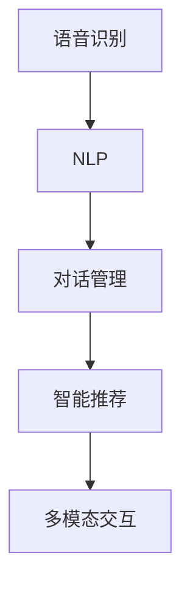

                 

# 语音和文字交互在CUI中的应用

## 1. 背景介绍

在计算机用户界面（Computer User Interface, CUI）的发展历程中，语音和文字交互技术一直扮演着重要角色。从早期的语音识别和文字输入技术的结合，到现代的智能助手和聊天机器人，这些技术推动了人机交互方式的革新，使计算机更加智能和人性化的服务于人类。本文将深入探讨语音和文字交互技术在CUI中的应用，包括其基本原理、核心算法、具体实现和未来趋势。

## 2. 核心概念与联系

### 2.1 核心概念概述

语音和文字交互技术基于人机交互的多个层次，包括但不限于以下几个方面：

- **语音识别（Speech Recognition）**：将语音信号转化为文本，是语音交互的第一步。
- **自然语言处理（Natural Language Processing, NLP）**：理解和生成自然语言，包括分词、句法分析、语义分析等，是文字交互的核心。
- **对话管理（Dialogue Management）**：管理人机对话的上下文，确保对话连贯性和逻辑性。
- **智能推荐（Recommendation System）**：根据用户历史行为和偏好，提供个性化信息。
- **多模态交互（Multimodal Interaction）**：结合语音、文字、图像等多模态信息，提升用户体验。

这些概念紧密联系，共同构建了现代CUI的核心交互模式。

### 2.2 核心概念原理和架构的 Mermaid 流程图



这个流程图展示了语音和文字交互技术的核心架构：语音输入经过语音识别转化成文本，再经过自然语言处理进行理解和生成，最后结合对话管理和智能推荐，形成多模态交互，从而实现人机交互。

## 3. 核心算法原理 & 具体操作步骤

### 3.1 算法原理概述

语音和文字交互的核心算法包括语音识别、自然语言处理、对话管理和智能推荐。其中，语音识别和自然语言处理是文本输入和输出的核心，对话管理则负责维护对话上下文和逻辑，智能推荐则为用户提供个性化的信息和服务。

### 3.2 算法步骤详解

#### 3.2.1 语音识别算法

语音识别算法主要包括以下几个步骤：

1. **特征提取**：将语音信号转化为数字特征，常用的特征提取方法包括MFCC、梅尔倒谱系数等。
2. **声学模型训练**：通过大量语音数据训练声学模型，识别出语音信号中的音素或单词。
3. **语言模型训练**：通过大量文本数据训练语言模型，确保识别的单词和句子符合语法和语义规则。
4. **解码**：通过动态规划等算法，将特征序列解码为最可能的文本序列。

#### 3.2.2 自然语言处理算法

自然语言处理算法主要包括以下几个步骤：

1. **分词**：将文本序列切分为词语序列，是自然语言处理的基础。
2. **词性标注**：标注每个词语的词性，帮助理解句子结构。
3. **句法分析**：分析句子的句法结构，提取句子的语法信息。
4. **语义分析**：理解句子的语义信息，包括实体识别、关系抽取、情感分析等。
5. **生成文本**：根据输入文本生成相应的回复，如生成对话、自动摘要等。

#### 3.2.3 对话管理算法

对话管理算法主要包括以下几个步骤：

1. **意图识别**：根据用户输入识别其意图，如查询信息、下订单等。
2. **状态转移**：根据当前状态和用户输入，决定下一个状态和应答内容。
3. **上下文维护**：记录对话上下文，确保对话连贯性。
4. **错误处理**：处理用户输入错误和系统错误，确保对话顺利进行。

#### 3.2.4 智能推荐算法

智能推荐算法主要包括以下几个步骤：

1. **用户画像建立**：根据用户历史行为和偏好，建立用户画像。
2. **内容画像建立**：根据物品属性和标签，建立内容画像。
3. **相似度计算**：计算用户画像和内容画像之间的相似度，找到匹配的物品。
4. **推荐排序**：根据相似度和用户偏好，排序推荐结果。

### 3.3 算法优缺点

#### 3.3.1 语音识别的优缺点

**优点**：

- 解放双手，提高效率。
- 可以同时处理多任务。

**缺点**：

- 识别准确率受环境噪音影响较大。
- 对输入语速和口音敏感。

#### 3.3.2 自然语言处理的优缺点

**优点**：

- 可以处理自然语言，符合人类习惯。
- 可以进行复杂的语义分析。

**缺点**：

- 需要大量标注数据进行训练。
- 处理长文本时效率较低。

#### 3.3.3 对话管理的优缺点

**优点**：

- 能够维护对话上下文，确保连贯性。
- 可以处理多种意图和场景。

**缺点**：

- 对话管理策略复杂，需要大量规则和模型。
- 难以处理异常情况。

#### 3.3.4 智能推荐的优缺点

**优点**：

- 可以提供个性化服务，提高用户体验。
- 可以实时动态调整推荐内容。

**缺点**：

- 推荐结果受数据质量影响较大。
- 需要平衡推荐多样性和准确性。

### 3.4 算法应用领域

语音和文字交互技术在多个领域有着广泛的应用，包括但不限于以下几个方面：

- **智能助手**：如Apple的Siri、Google Assistant等，可以执行指令、回答问题、设置提醒等。
- **在线客服**：如阿里巴巴的阿里小蜜、腾讯的腾讯客服等，可以处理用户查询、故障排除等。
- **语音搜索**：如Google语音搜索、百度智能音箱等，可以提供语音搜索服务。
- **聊天机器人**：如微软的小冰、小米的Xiaoice等，可以进行对话互动。
- **语音控制**：如Amazon的Alexa、小米的小爱同学等，可以控制智能家居设备。
- **视频会议**：如Zoom、Skype等，可以通过语音和文字进行沟通。

## 4. 数学模型和公式 & 详细讲解 & 举例说明

### 4.1 数学模型构建

语音和文字交互技术的核心算法模型包括语音识别模型、自然语言处理模型、对话管理模型和智能推荐模型。下面以自然语言处理模型为例，介绍其数学模型构建和公式推导。

假设输入文本序列为 $X = \{x_1, x_2, ..., x_n\}$，其中 $x_i$ 为第 $i$ 个词语。文本的语义向量表示为 $V = \{v_1, v_2, ..., v_n\}$，其中 $v_i$ 为第 $i$ 个词语的语义向量。

文本的上下文向量表示为 $C = \{c_1, c_2, ..., c_n\}$，其中 $c_i$ 为第 $i$ 个词语的上下文向量。

文本的生成概率模型为 $P(V|C)$，表示在给定上下文 $C$ 的情况下，生成文本 $V$ 的概率。模型的条件概率公式为：

$$
P(V|C) = \prod_{i=1}^n P(v_i|v_{i-1}, c_i)
$$

其中 $P(v_i|v_{i-1}, c_i)$ 表示在给定前一个词语 $v_{i-1}$ 和当前上下文 $c_i$ 的情况下，生成当前词语 $v_i$ 的概率。

### 4.2 公式推导过程

在自然语言处理中，常用的生成模型包括基于RNN的模型和基于Transformer的模型。这里以基于Transformer的模型为例，进行公式推导。

Transformer模型的核心是自注意力机制（Self-Attention Mechanism），公式如下：

$$
Attention(Q, K, V) = Softmax(\frac{QK^T}{\sqrt{d_k}})V
$$

其中 $Q, K, V$ 分别为查询向量、键向量和值向量，$d_k$ 为键向量的维度。

Transformer模型的生成概率模型公式为：

$$
P(V|C) = \prod_{i=1}^n P(v_i|v_{i-1}, C)
$$

通过自注意力机制，模型可以计算出每个词语与其他词语之间的关联度，从而更好地理解句子的语义信息。

### 4.3 案例分析与讲解

以一个简单的情感分析任务为例，分析其基于自然语言处理和机器学习的实现。

假设有一个简单的情感分类任务，输入为一段文本，输出为该文本的情感类别（如积极、消极、中性）。可以使用以下步骤进行实现：

1. **分词**：将文本切分为词语序列。
2. **嵌入向量化**：将每个词语转化为向量表示。
3. **情感分类器训练**：使用机器学习算法（如SVM、随机森林等）训练情感分类器。
4. **情感分类器预测**：使用训练好的情感分类器对输入文本进行分类预测。

使用Python和NLTK库，代码实现如下：

```python
import nltk
from nltk.corpus import movie_reviews
from nltk.tokenize import word_tokenize
from sklearn.feature_extraction.text import CountVectorizer
from sklearn.svm import SVC

# 加载电影评论数据
nltk.download('movie_reviews')
data = movie_reviews.fileids()
X = []
y = []

for fileid in data:
     reviews = movie_reviews.raw(fileid)
     X.append(reviews)
     y.append('pos' if 'pos' in fileid else 'neg')

# 分词和向量化
vectorizer = CountVectorizer()
X_vectorized = vectorizer.fit_transform(X)

# 训练情感分类器
classifier = SVC(kernel='linear')
classifier.fit(X_vectorized, y)

# 预测文本情感
text = 'This movie is really good!'
text_vectorized = vectorizer.transform([text])
result = classifier.predict(text_vectorized)

print('情感预测结果：', result[0])
```

该代码实现了从文本输入到情感分类的全过程，展示了自然语言处理和机器学习的结合。

## 5. 项目实践：代码实例和详细解释说明

### 5.1 开发环境搭建

在开发语音和文字交互应用时，需要搭建相应的开发环境。以下是Python开发环境的搭建步骤：

1. **安装Python**：从官网下载安装Python，建议安装最新版本。
2. **安装虚拟环境**：使用pip安装virtualenv或conda创建虚拟环境。
3. **安装相关库**：安装所需的Python库，如TensorFlow、Keras、NLTK等。
4. **安装语音识别库**：如SpeechRecognition、PyAudio等。

### 5.2 源代码详细实现

以一个简单的聊天机器人为例，展示其自然语言处理和对话管理部分的代码实现。

```python
import nltk
from nltk.chat.util import Chat, reflections
import random

# 定义聊天机器人模板
pairs = [
    [
        r'my name is (.*)',
        ['Hello %1, How are you today?']
    ],
    [
        r'hi|hello',
        ['Hello', 'Hey there']
    ],
    [
        r'what is your name?',
        ['My name is ChatBot', 'I am ChatBot']
    ],
    [
        r'how are you?',
        ['I am fine', 'I am good']
    ],
    [
        r'what time is it?',
        ['The time is now', 'It is 10:30']
    ],
    [
        r'(.*)',
        ['I am sorry, I do not understand', 'Can you please rephrase that']
    ]
]

# 构建聊天机器人
chatbot = Chat(pairs, reflections)

# 对话管理
while True:
    user_input = input('You: ')
    if user_input.lower() == 'quit':
        break
    reply = chatbot.respond(user_input.lower())
    print('ChatBot: ', reply)
```

这段代码实现了一个简单的聊天机器人，可以处理一些基本的对话请求。使用NLTK库进行自然语言处理和对话管理。

### 5.3 代码解读与分析

以上代码实现了从用户输入到聊天机器人回复的全过程，展示了自然语言处理和对话管理的结合。代码中使用了NLTK库的`Chat`类，通过定义对话模板和反射规则，构建了一个简单的聊天机器人。用户输入经过反射规则处理后，进入对话模板进行匹配，生成相应的回复。

## 6. 实际应用场景

### 6.1 智能助手

智能助手如Apple的Siri、Google Assistant等，已经成为现代生活中不可或缺的一部分。它们可以执行各种任务，如设定闹钟、播放音乐、回答问题等。智能助手通常结合了语音识别、自然语言处理和对话管理等技术，为用户提供自然流畅的交互体验。

### 6.2 在线客服

在线客服如阿里巴巴的阿里小蜜、腾讯的腾讯客服等，可以处理用户的各种查询和问题。在线客服通常使用自然语言处理和对话管理技术，对用户输入进行理解和处理，生成相应的回复。

### 6.3 语音搜索

语音搜索如Google语音搜索、百度智能音箱等，可以通过语音输入进行搜索。语音搜索通常结合了语音识别和自然语言处理技术，将语音输入转化为文本搜索请求。

### 6.4 聊天机器人

聊天机器人如微软的小冰、小米的Xiaoice等，可以进行对话互动。聊天机器人通常使用自然语言处理和对话管理技术，对用户输入进行理解和处理，生成相应的回复。

### 6.5 语音控制

语音控制如Amazon的Alexa、小米的小爱同学等，可以控制智能家居设备。语音控制通常结合了语音识别和对话管理技术，对用户语音指令进行理解和处理，生成相应的控制命令。

### 6.6 视频会议

视频会议如Zoom、Skype等，可以通过语音和文字进行沟通。视频会议通常结合了语音识别和自然语言处理技术，将语音和文字输入转化为会议记录和控制指令。

## 7. 工具和资源推荐

### 7.1 学习资源推荐

为了帮助开发者掌握语音和文字交互技术的核心算法和实现细节，以下是一些优质的学习资源：

1. **自然语言处理教材**：《Speech and Language Processing》和《Natural Language Processing with Python》等教材，全面介绍了自然语言处理的基本概念和算法。
2. **在线课程**：Coursera、edX等平台上的自然语言处理和人工智能课程，涵盖从基础到高级的内容。
3. **论文和书籍**：大量自然语言处理领域的经典论文和书籍，如ACL、EMNLP等会议论文集，以及《Handbook of Natural Language Processing》等书籍。

### 7.2 开发工具推荐

为了高效开发语音和文字交互应用，以下是一些常用的开发工具：

1. **Python**：Python是自然语言处理和人工智能开发的主要语言，提供了丰富的库和框架。
2. **TensorFlow**：Google开发的深度学习框架，支持大规模的神经网络模型训练。
3. **Keras**：Keras是一个高层次的深度学习库，易于上手和使用。
4. **NLTK**：Natural Language Toolkit，提供了自然语言处理的基本工具和算法。
5. **SpeechRecognition**：Python语音识别库，支持多种语音识别引擎。
6. **PyAudio**：Python音频处理库，支持音频录制和播放。

### 7.3 相关论文推荐

为了了解语音和文字交互技术的最新进展，以下是一些具有代表性的论文：

1. **Attention Is All You Need**：提出了Transformer模型，改变了传统的循环神经网络模型，提升了自然语言处理的效果。
2. **BERT: Pre-training of Deep Bidirectional Transformers for Language Understanding**：提出了BERT模型，通过预训练和微调，提高了自然语言处理的精度。
3. **Efficient Speech Recognition with Transformer-based Models**：介绍了Transformer模型在语音识别中的应用，提高了语音识别的准确率。
4. **Neural Machine Translation by Jointly Learning to Align and Translate**：提出了基于Transformer的机器翻译模型，提升了翻译的质量和效率。
5. **Transformers are Universal Function Approximators**：证明了Transformer模型在自然语言处理中的通用性，推动了自然语言处理技术的发展。

## 8. 总结：未来发展趋势与挑战

### 8.1 研究成果总结

语音和文字交互技术在现代CUI中扮演着重要角色，推动了人机交互方式的革新。目前，自然语言处理和对话管理技术已经取得了显著进展，语音识别和情感分析技术也在不断提升。

### 8.2 未来发展趋势

未来，语音和文字交互技术将继续向以下几个方向发展：

1. **多模态交互**：结合语音、文字、图像等多模态信息，提升用户体验。
2. **实时语音识别**：使用实时语音识别技术，提高语音交互的流畅性和响应速度。
3. **情感分析**：结合情感分析技术，提升聊天机器人和智能助手的交互质量。
4. **自然语言生成**：使用自然语言生成技术，提升对话管理的灵活性和多样性。
5. **个性化推荐**：结合智能推荐技术，提升个性化服务的效果。
6. **隐私保护**：加强隐私保护技术，保护用户数据的安全。

### 8.3 面临的挑战

语音和文字交互技术在发展过程中，也面临着一些挑战：

1. **数据隐私**：如何保护用户数据隐私，防止数据泄露和滥用。
2. **数据质量**：如何获取高质量的标注数据，提高语音和文字交互的效果。
3. **系统鲁棒性**：如何提高系统的鲁棒性，应对复杂和多变的交互场景。
4. **计算资源**：如何高效利用计算资源，提升系统的性能和响应速度。
5. **用户接受度**：如何提高用户对语音和文字交互技术的接受度，推广应用。

### 8.4 研究展望

未来，语音和文字交互技术的研究方向将包括以下几个方面：

1. **多模态融合**：结合多模态信息，提升交互效果和用户体验。
2. **隐私保护**：研究隐私保护技术，确保用户数据的安全。
3. **个性化推荐**：结合个性化推荐技术，提升推荐效果。
4. **智能对话**：研究智能对话技术，提升聊天机器人和智能助手的交互质量。
5. **情感分析**：结合情感分析技术，提升聊天机器人和智能助手的交互质量。
6. **多语言支持**：研究多语言支持技术，提升系统的跨语言能力。

## 9. 附录：常见问题与解答

### 9.1 常见问题

1. **语音识别准确率低**：语音识别准确率受环境噪音、口音等因素影响较大，可以通过增加训练数据、使用降噪技术等方式提高准确率。
2. **自然语言处理效率低**：自然语言处理效率低通常是因为模型复杂度高，可以通过简化模型结构、优化计算图等方式提高效率。
3. **对话管理复杂**：对话管理复杂通常是因为规则和模型过于复杂，可以通过设计更简洁的规则和模型，或者引入强化学习技术提升管理效果。
4. **智能推荐效果差**：智能推荐效果差通常是因为数据质量差，可以通过数据清洗、特征工程等方式提高数据质量。

### 9.2 解答

1. **语音识别准确率低**：可以通过增加训练数据、使用降噪技术等方式提高准确率。例如，增加环境噪音的数据训练，或者使用降噪算法过滤噪音。
2. **自然语言处理效率低**：可以通过简化模型结构、优化计算图等方式提高效率。例如，使用轻量级模型、优化计算图、使用GPU加速等。
3. **对话管理复杂**：可以通过设计更简洁的规则和模型，或者引入强化学习技术提升管理效果。例如，使用基于规则的对话管理，或者引入强化学习技术，让系统从对话中学习策略。
4. **智能推荐效果差**：可以通过数据清洗、特征工程等方式提高数据质量。例如，使用更精细的特征提取方法，或者引入更多的用户行为数据。

---

作者：禅与计算机程序设计艺术 / Zen and the Art of Computer Programming

