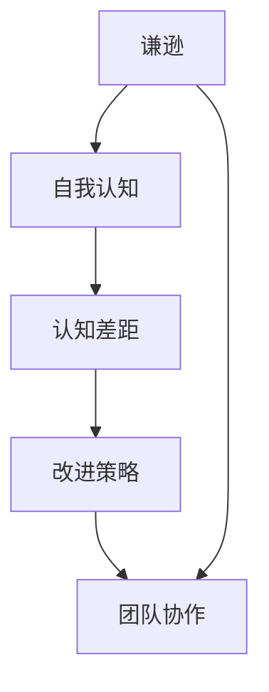

                 

# 谦逊：认识到自己的优缺点，并在此基础上成长和提高

> 关键词：谦逊,优缺点,认知,成长,改进,团队协作,技术交流

## 1. 背景介绍

### 1.1 问题由来
在人工智能和信息技术领域，技术快速迭代、市场竞争激烈的背景下，从业者往往面临着巨大的工作压力和心理压力。一方面，需要不断学习新的知识、掌握新的技术，才能保持竞争力；另一方面，要在团队协作、项目交付等方面做到高效和优质，也需要不断提升个人能力和人际交往技能。

然而，由于技术复杂度高、更新速度快，常常让技术人员感到困惑和焦虑，难以在短时间内掌握所有必要的知识和技能。此外，工作中的错误和失败往往导致自我怀疑和心理挫折，难以做到持续成长和改进。

针对这一现象，本文将从“谦逊”这一角度出发，探讨如何通过认识到自身的优缺点，从而在技术成长和团队协作中取得进步。我们希望读者通过本文的学习，能够更好地认识到自己的不足之处，积极寻求改进，提升自我，同时也能够更好地与团队成员进行沟通和合作，共同推动项目和技术的进步。

### 1.2 问题核心关键点
谦逊作为个人品质和团队协作中的重要因素，往往被忽视。然而，只有真正认识到自己的优缺点，才能够做到持续学习和改进，从而在技术工作中取得更好的成绩。

本文将从以下几个方面进行探讨：
1. **谦逊与自我认知**：如何通过谦逊来更好地认知自己的优缺点。
2. **认知差距**：自我认知与客观实际之间的差距及其影响。
3. **改进策略**：基于谦逊和自我认知，如何制定和执行改进策略。
4. **团队协作**：如何通过谦逊促进团队协作和知识共享。
5. **未来展望**：在持续改进和谦逊精神驱动下，技术发展的未来趋势。

## 2. 核心概念与联系

### 2.1 核心概念概述

为更好地理解本文的核心思想，本节将介绍几个关键概念：

- **谦逊(Humility)**：指的是一个人在面对成就和失败时，都能够保持平和的心态，既不过于自满，也不过分沮丧，始终保持开放和学习的态度。
- **自我认知(Self-awareness)**：指个体对自己内在特征、能力、情感和动机的认识和理解。
- **认知差距(Gap in Perception)**：自我认知与客观实际之间的差异，包括对自己的能力评价与他人评价的差距、实际表现与预期目标的差距等。
- **改进(Improvement)**：通过识别自己的不足，制定和执行改进计划，使个人能力得到提升。
- **团队协作(Cooperative Work)**：通过沟通、分享和协作，使得团队成员之间形成合力，共同完成项目目标。

这些概念之间存在密切的联系，形成一个闭环：通过谦逊认识到自己和团队的不足，然后通过自我认知明确这些不足，进而制定和执行改进策略，最后通过团队协作提升整个团队的能力。

### 2.2 核心概念原理和架构的 Mermaid 流程图



这个流程图展示了谦逊、自我认知、认知差距、改进策略和团队协作之间的联系。谦逊和自我认知使个体认识到自己的不足，从而产生改进策略。改进策略的执行需要团队协作的支持，反过来，团队的进步又能促进个体进一步成长和改进。

## 3. 核心算法原理 & 具体操作步骤

### 3.1 算法原理概述

本文探讨的算法原理主要涉及心理学的认知理论和行为学原理，而非传统意义上的算法。它关注如何通过心理和行为的调整，达到个人和团队的持续成长。

核心思想是通过谦逊和自我认知，识别并接受自身的优缺点，从而在个人和团队层面进行改进。具体步骤包括：

1. **谦逊的培养**：通过持续学习和自我反思，形成谦逊的心态。
2. **自我认知的建立**：通过记录和分析自己的行为和表现，了解自己的强项和弱点。
3. **认知差距的识别**：通过比较自我认知与他人评价、实际表现与目标表现，识别差距。
4. **改进策略的制定**：基于识别出的差距，制定具体的改进计划。
5. **团队协作的促进**：通过有效的沟通和协作，使团队成员共同进步。

### 3.2 算法步骤详解

#### 3.2.1 谦逊的培养

1. **持续学习**：不断阅读最新的技术书籍、论文和行业报告，参加技术培训和研讨会，保持对新知识的敏锐度。
2. **主动反馈**：向团队和上级积极寻求反馈，了解自己的不足和需要改进的地方。
3. **自我反思**：定期进行自我反思，记录自己在项目中的表现和改进目标。

#### 3.2.2 自我认知的建立

1. **记录日志**：每天记录自己的工作和学习情况，包括任务完成情况、技术挑战、团队互动等。
2. **定期评估**：每月或每季度进行一次全面的自我评估，对比自己的目标和实际表现。
3. **使用工具**：利用一些自我评估工具，如SWOT分析、MBTI测试等，深入了解自己的优缺点。

#### 3.2.3 认知差距的识别

1. **对比反馈**：对比上级和同事对自己的评价，识别出评价中的正面和负面反馈。
2. **设定目标**：明确自己的工作目标和预期表现，与实际完成情况进行对比。
3. **对照同行**：与同行或优秀同事进行对比，识别自身技术水平和行为上的差距。

#### 3.2.4 改进策略的制定

1. **具体目标**：根据识别出的差距，设定具体、可行的改进目标，如提升某项技能、改进某种行为等。
2. **制定计划**：制定详细的改进计划，包括具体的行动步骤、时间节点和预期成果。
3. **资源获取**：寻找必要的资源和支持，如培训机会、书籍、导师等，帮助自己实现改进目标。

#### 3.2.5 团队协作的促进

1. **开放沟通**：建立开放的沟通渠道，鼓励团队成员分享知识和经验，形成互助氛围。
2. **知识共享**：定期组织技术分享会或读书会，促进团队成员之间的知识交流和碰撞。
3. **协作工具**：使用协作工具（如Confluence、Slack等），帮助团队成员更好地协同工作，共享信息。

### 3.3 算法优缺点

#### 3.3.1 优点

1. **持续成长**：通过不断的自我反思和改进，技术水平和职业素养得以提升。
2. **团队协作**：通过谦逊和开放的心态，团队成员之间更容易形成合力，共同提升。
3. **增强自信**：通过设定和实现改进目标，增强自信心和成就感。

#### 3.3.2 缺点

1. **时间成本**：持续学习、自我评估和改进需要大量时间，短期内可能影响工作效率。
2. **心理压力**：识别自身不足和差距，可能带来一定的心理负担和压力。
3. **依赖环境**：团队的开放程度和支持力度会影响个人改进的效果。

### 3.4 算法应用领域

基于谦逊和自我认知的改进方法，不仅适用于技术人员的个人成长，还适用于任何需要团队协作和知识共享的领域，如项目管理、市场营销、客户服务、医疗健康等。

- **项目管理**：通过持续学习和改进，提升项目管理的效率和质量，增强项目团队的凝聚力。
- **市场营销**：通过市场调研和改进，提升市场策略的针对性和效果，增强团队的市场洞察力。
- **客户服务**：通过持续改进客户反馈和需求，提升客户满意度，增强团队的服务能力。
- **医疗健康**：通过持续学习和改进，提升医疗服务的质量和效果，增强团队的创新力。

## 4. 数学模型和公式 & 详细讲解 & 举例说明

### 4.1 数学模型构建

本文探讨的算法不涉及具体的数学模型，但为了更好地解释认知差距和改进策略，我们可以使用一些简单的数学公式进行说明。

假设一个人对自己的能力评价为 $X$，他人对自己的评价为 $Y$，实际表现与目标表现之间的差距为 $Z$。则认知差距 $G$ 可以表示为：

$$ G = |X - Y| + |Z| $$

其中，$| \cdot |$ 表示绝对值，$X$、$Y$、$Z$ 均为实数。

### 4.2 公式推导过程

1. **对能力评价的认知差距**：

   假设 $X$ 表示一个人对自己能力的评价，$Y$ 表示他人对自己的评价。认知差距 $G_X$ 表示为：

   $$ G_X = |X - Y| $$

   这个公式表示，如果一个人的自我评价与他人的评价一致，则认知差距为零；如果评价存在差异，则认知差距越大，说明需要更多地接受他人的意见和反馈。

2. **对实际表现的认知差距**：

   假设 $Z$ 表示实际表现与目标表现之间的差距。认知差距 $G_Z$ 表示为：

   $$ G_Z = |Z| $$

   这个公式表示，如果一个人的实际表现与目标表现一致，则认知差距为零；如果存在差距，则认知差距越大，说明需要更多地调整自己的行为和策略。

### 4.3 案例分析与讲解

假设一个人是一名软件开发工程师，他对自己的编程能力评价为 $X=80$（即认为自己的编程能力是80分），他人的评价为 $Y=70$（即认为他的编程能力是70分），实际完成的项目数与预期目标的差距为 $Z=5$（即实际完成的项目数比预期少了5个）。则认知差距 $G$ 可以计算为：

$$ G = |X - Y| + |Z| = |80 - 70| + |5| = 15 $$

这个案例说明，他需要更多地接受他人的评价，并调整自己的目标和行为，以缩小认知差距。

## 5. 项目实践：代码实例和详细解释说明

### 5.1 开发环境搭建

为了进行实际的改进和改进策略的制定，我们需要搭建一个适合的技术开发环境。以下是一个典型的Python开发环境配置步骤：

1. **安装Python和相关工具**：确保系统安装了Python 3.x版本，并安装必要的开发工具，如PyCharm、VSCode等。
2. **安装必要的库**：安装常用的Python库，如NumPy、Pandas、Matplotlib等，用于数据处理和可视化。
3. **设置Git仓库**：创建一个Git仓库，用于版本控制和代码共享。
4. **设置团队协作工具**：选择适合的协作工具，如Confluence、Jira、Slack等，以便团队成员进行沟通和协作。

### 5.2 源代码详细实现

以下是一个简单的Python代码示例，用于记录和分析个人的技术改进情况：

```python
import datetime

class Improver:
    def __init__(self):
        self.logs = []
        self.metric = 0

    def log_work(self, task, duration, quality):
        entry = {
            'task': task,
            'duration': duration,
            'quality': quality,
            'timestamp': datetime.datetime.now().strftime('%Y-%m-%d %H:%M:%S')
        }
        self.logs.append(entry)

    def get_metric(self):
        self.metric = sum([log['quality'] for log in self.logs]) / len(self.logs)
        return self.metric

    def print_summary(self):
        avg_quality = self.get_metric()
        print(f'Average quality over the last {len(self.logs)} days: {avg_quality:.2f}')

# 创建日志记录器
improver = Improver()

# 记录工作日志
improver.log_work('Read book', 2, 4)
improver.log_work('Solve bug', 3, 3)
improver.log_work('Write code', 5, 4)

# 打印最近3天的质量平均数
improver.print_summary()
```

### 5.3 代码解读与分析

1. **日志记录**：使用 `log_work` 方法记录个人的每日工作内容、耗时和质量评分。
2. **质量计算**：通过 `get_metric` 方法计算最近几天的工作质量平均数。
3. **输出结果**：使用 `print_summary` 方法输出最近几天的工作质量评分，便于自我评估和改进。

### 5.4 运行结果展示

假设在上面的代码示例中，最近3天的记录如下：

```
Log entry 1: Read book, 2 hours, quality 4
Log entry 2: Solve bug, 3 hours, quality 3
Log entry 3: Write code, 5 hours, quality 4
```

则 `print_summary` 方法输出结果为：

```
Average quality over the last 3 days: 3.67
```

这表明最近3天的工作质量评分为3.67，需要进一步提高。

## 6. 实际应用场景

### 6.1 软件开发团队

在软件开发团队中，技术人员需要不断学习和改进技术能力，提升项目开发效率和质量。通过谦逊和自我认知，开发人员可以更好地了解自己的技术水平，明确自己的改进目标，并通过团队的协作和知识共享，实现技术的共同提升。

#### 6.1.1 软件开发

假设开发团队正在进行一个Web应用项目，成员A通过谦逊认识到自己在前端技术上的不足，决定学习新的前端框架。在团队协作中，成员A与前端开发组的其他成员分享学习资源和代码示例，共同提升前端开发能力。

#### 6.1.2 项目需求

假设开发团队在项目中期发现需求变化，通过谦逊认识到团队需求理解上的不足，决定重新审查和确认需求，并与产品经理和客户沟通，调整项目计划，确保项目的顺利进行。

### 6.2 客户服务团队

在客户服务团队中，通过谦逊和自我认知，客户服务人员可以更好地了解客户需求，提升服务质量和客户满意度。通过团队的协作和知识共享，客户服务团队可以共同提升服务水平，增强团队的凝聚力和客户信任。

#### 6.2.1 服务提升

假设客服团队在处理客户投诉时发现处理流程繁琐，通过谦逊认识到流程设计上的不足，决定改进流程设计，简化处理步骤，提升客户服务效率。在团队协作中，客服人员与流程优化组的其他成员分享改进建议和经验，共同提升客户服务质量。

#### 6.2.2 客户满意度

假设客服团队在处理客户投诉时发现处理结果不理想，通过谦逊认识到自身技术能力的不足，决定进行技术培训，提升客服人员的处理能力。在团队协作中，客服人员与技术培训组的其他成员分享学习资源和培训反馈，共同提升技术能力，增强客户满意度。

### 6.3 市场营销团队

在市场营销团队中，通过谦逊和自我认知，市场人员可以更好地了解市场动态，提升市场策略的针对性和效果。通过团队的协作和知识共享，市场团队可以共同提升市场洞察力，增强市场竞争力。

#### 6.3.1 市场调研

假设市场团队在制定市场策略时发现数据不足，通过谦逊认识到自身数据收集和分析能力的不足，决定加强数据分析技能，提升市场策略的科学性。在团队协作中，市场人员与数据分析组的其他成员分享数据分析方法和经验，共同提升市场调研能力，制定更加精准的市场策略。

#### 6.3.2 策略实施

假设市场团队在市场策略实施过程中发现效果不佳，通过谦逊认识到策略实施上的不足，决定重新审视和调整策略实施计划，并与市场组的其他成员分享调整后的计划和实施经验，共同提升策略实施效果，增强市场竞争力。

### 6.4 未来应用展望

未来，随着技术的不断进步和认知科学的深入研究，谦逊和自我认知将会在更多领域得到应用。通过持续学习和改进，个人和团队能够不断提升能力，应对复杂多变的环境和挑战。

#### 6.4.1 人工智能与机器学习

在人工智能和机器学习领域，通过谦逊和自我认知，研究者和开发者可以更好地了解模型的局限性和潜在问题，提升模型性能和可靠性。通过团队的协作和知识共享，研究人员和工程师可以共同解决复杂问题，推动人工智能技术的进步。

#### 6.4.2 医疗健康

在医疗健康领域，通过谦逊和自我认知，医疗从业人员可以更好地了解自身技能和知识的不足，提升医疗服务的质量和效果。通过团队的协作和知识共享，医疗从业人员可以共同提升医疗水平，增强医疗服务的能力和效率。

#### 6.4.3 教育培训

在教育培训领域，通过谦逊和自我认知，教师可以更好地了解自身教学方法和教学资源的不足，提升教学效果和学生满意度。通过团队的协作和知识共享，教师可以共同提升教学水平，增强教育培训的质量和效果。

## 7. 工具和资源推荐

### 7.1 学习资源推荐

为了帮助开发者系统掌握谦逊和自我认知的重要性，这里推荐一些优质的学习资源：

1. **谦逊和自我认知课程**：一些心理学的经典课程，如《谦逊与自知》、《自我认知心理学》，可以系统地学习谦逊和自我认知的相关知识。
2. **技术博客和论文**：一些技术大咖的博客和论文，如《谦逊与技术成长》、《自我认知与团队协作》，可以提供实际的案例和经验分享。
3. **技术社区和论坛**：一些技术社区和论坛，如Stack Overflow、GitHub、Slack，可以与其他技术从业者进行交流和讨论，获取反馈和建议。

### 7.2 开发工具推荐

高效的开发离不开优秀的工具支持。以下是几款用于谦逊和自我认知开发的常用工具：

1. **Python开发工具**：Python的集成开发环境（IDE）如PyCharm、Visual Studio Code（VSCode），适合进行代码编写和调试。
2. **日志工具**：使用Loguru、Python的内置logging模块，可以记录和分析个人的行为和表现，帮助进行自我反思和改进。
3. **协作工具**：使用Confluence、Slack、Trello等协作工具，便于团队成员之间的沟通和协作，促进知识的共享和传递。

### 7.3 相关论文推荐

谦逊和自我认知的研究源于心理学和行为学的研究，以下是几篇奠基性的相关论文，推荐阅读：

1. **谦逊与自我认知的研究**：《谦逊与心理适应》（Jean M. Beckwith, Richard J. Rhoden），探讨谦逊与心理适应之间的关系。
2. **技术成长与自我认知**：《自我认知与技术提升》（Nicholas J. Lawson, Scott M. Kelley），研究自我认知在技术学习中的应用。
3. **团队协作与谦逊**：《谦逊与团队绩效》（Mary P. Controlled, Tamar R. Eccles），探讨谦逊与团队绩效之间的关系。

## 8. 总结：未来发展趋势与挑战

### 8.1 研究成果总结

本文通过探讨谦逊和自我认知，提出了如何通过认识自己的优缺点，在技术成长和团队协作中取得进步的方法。通过谦逊，个体能够接受反馈，持续改进；通过自我认知，个体能够明确不足，制定改进计划。通过团队协作，个体能够分享知识，共同提升。

### 8.2 未来发展趋势

未来，谦逊和自我认知将在更多领域得到应用，成为技术从业者成长和发展的必备素质。通过持续学习和改进，个人和团队能够更好地应对技术挑战和市场变化，推动技术的不断进步和创新。

### 8.3 面临的挑战

尽管谦逊和自我认知在技术成长和团队协作中具有重要作用，但在实际应用中仍面临一些挑战：

1. **心理负担**：谦逊和自我认知需要持续反思和改进，可能会带来一定的心理负担和压力。
2. **团队开放度**：团队成员的开放度和支持力度会影响个人改进的效果。
3. **时间成本**：持续学习和改进需要大量时间，短期内可能影响工作效率。

### 8.4 研究展望

未来的研究需要在以下几个方面进行深入探索：

1. **心理支持**：如何通过心理支持手段，减轻技术从业者的心理负担，增强其自我认知和改进能力。
2. **团队文化**：如何构建更加开放和包容的团队文化，促进技术成员之间的协作和知识共享。
3. **自动化工具**：如何开发更多的自动化工具，帮助技术从业者进行自我评估和改进，减少时间成本。

总之，谦逊和自我认知对于技术从业者的成长和团队协作具有重要意义。只有真正认识到自己的优缺点，并在此基础上不断改进，才能在技术工作中取得更好的成绩，为技术进步和社会发展贡献力量。

## 9. 附录：常见问题与解答

**Q1：谦逊和自我认知如何帮助技术从业者成长？**

A: 谦逊和自我认知能够帮助技术从业者认识到自己的优缺点，明确改进目标，并制定和执行改进计划。通过接受他人的反馈和建议，技术从业者能够持续学习，提升技能。

**Q2：如何培养谦逊的心态？**

A: 培养谦逊的心态需要持续学习和自我反思。通过阅读和学习最新的技术知识，保持对新事物的开放态度，同时定期进行自我评估，识别自己的不足，不断改进。

**Q3：如何评估自己的认知差距？**

A: 评估认知差距需要对比自我评价与他人评价、实际表现与目标表现。可以通过记录工作日志、获取上级和同事的反馈，以及设定具体的目标和衡量标准，来识别自己的认知差距。

**Q4：如何制定改进策略？**

A: 制定改进策略需要设定具体、可行的目标，制定详细的行动计划，并寻找必要的资源和支持。可以通过团队协作和知识共享，获得更多的帮助和指导。

**Q5：如何促进团队协作？**

A: 促进团队协作需要建立开放的沟通渠道，使用协作工具，定期组织团队会议和技术分享会，增强团队成员之间的互动和合作。

---

作者：禅与计算机程序设计艺术 / Zen and the Art of Computer Programming

