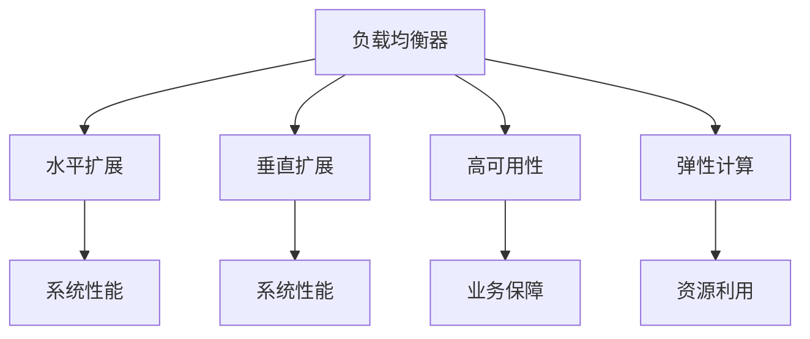

                 

# 负载均衡器在系统扩展中的应用

## 1. 背景介绍

### 1.1 问题由来
随着互联网应用的用户规模不断扩大，Web应用系统面临着日益增长的流量压力。特别是对于高访问量的电商、社交、游戏等平台，如何在低成本下实现系统扩展和性能提升，成为一个严峻的挑战。传统的垂直扩展（Vertical Scaling）方式，虽然可以提升单个服务器的性能，但随着资源瓶颈的增加，扩展成本也会急剧上升，导致扩展难度的增加和运营成本的居高不下。

为了解决这一问题，负载均衡器（Load Balancer）应运而生。负载均衡器能够将来自不同客户端的请求合理地分配到多个服务器上，从而实现水平扩展（Horizontal Scaling），提高系统的吞吐量和可用性。在负载均衡器的帮助下，系统可以根据需求动态调整服务器数量，实现线性扩展，极大提升了系统弹性。

### 1.2 问题核心关键点
- **负载均衡**：通过合理分配客户端请求，实现系统负载的均衡分布。
- **系统扩展**：通过水平扩展方式，根据需求动态调整服务器资源，提升系统性能和可用性。
- **高可用性**：确保系统能够在单点故障时依然保持正常服务，提供可靠的业务保障。
- **性能优化**：通过负载均衡器优化请求路由，减少延迟和抖动，提高系统响应速度。
- **资源管理**：动态管理服务器资源，避免资源浪费和过载，提升资源利用率。

这些核心概念之间有着紧密的联系，共同构成了负载均衡器在系统扩展中的核心作用。

### 1.3 问题研究意义
研究负载均衡器在系统扩展中的应用，对于提升Web应用系统的性能和扩展能力，降低扩展成本和运营维护难度，具有重要意义：

1. **提升系统性能**：通过合理分配请求，减少单个服务器的负载压力，提升系统整体性能。
2. **优化资源利用**：动态管理服务器资源，避免资源浪费，提高资源利用率。
3. **保障高可用性**：通过负载均衡实现故障转移，确保系统在单点故障下的高可用性。
4. **简化系统扩展**：通过水平扩展，根据需要动态调整服务器数量，降低扩展成本和运营复杂度。
5. **支持弹性计算**：根据需求动态调整资源，实现弹性计算，应对不断变化的业务需求。

## 2. 核心概念与联系

### 2.1 核心概念概述

为了更好地理解负载均衡器在系统扩展中的应用，本节将介绍几个关键概念及其相互联系：

- **负载均衡器（Load Balancer）**：一种网络设备或软件，能够将来自客户端的请求合理分配到多个服务器上，实现负载均衡和故障转移。
- **水平扩展（Horizontal Scaling）**：通过增加服务器数量，实现系统性能的线性扩展。
- **垂直扩展（Vertical Scaling）**：通过提升单个服务器的性能，实现系统性能的提升。
- **高可用性（High Availability）**：确保系统在单点故障时依然能够正常服务，提供可靠的业务保障。
- **弹性计算（Elastic Computing）**：根据需求动态调整资源，实现资源的弹性管理。

这些概念之间通过以下Mermaid流程图展示其逻辑关系：



从上述流程图中可以看出，负载均衡器在系统扩展中的核心作用是通过水平扩展实现系统性能的提升，而高可用性和弹性计算则为其提供了可靠性和灵活性。

## 3. 核心算法原理 & 具体操作步骤

### 3.1 算法原理概述

负载均衡器的工作原理基于以下几个关键算法：

1. **轮询算法（Round Robin）**：将请求按顺序轮流分配到各个服务器，确保请求均衡分布在不同服务器上。
2. **最少连接算法（Least Connections）**：将请求分配给连接数最少的服务器，避免某些服务器过载。
3. **IP哈希算法（IP Hashing）**：根据客户端IP地址的哈希值分配请求，确保同一个客户端的请求总是分配到同一台服务器上。
4. **加权轮询算法（Weighted Round Robin）**：为不同的服务器分配不同的权重，按权重比例分配请求。
5. **最少响应时间算法（Least Response Time）**：将请求分配给响应时间最短的服务器，提高系统整体响应速度。

这些算法通过负载均衡器实现，确保请求均衡分配到不同的服务器上，同时保证系统的可靠性和性能。

### 3.2 算法步骤详解

负载均衡器在系统扩展中的应用，主要包括以下几个关键步骤：

1. **配置负载均衡器**：选择适合的网络设备或软件，并根据需求配置相关参数，如IP地址、端口、健康检查等。
2. **配置后端服务器**：将多个服务器配置为负载均衡器的后端服务器，并进行必要的健康检查和负载均衡配置。
3. **分配请求**：当客户端发送请求时，负载均衡器根据预设的算法将请求分配到合适的后端服务器上。
4. **健康检查**：定期对后端服务器进行健康检查，确保其正常运行，并及时将故障服务器从负载均衡中移除。
5. **故障转移**：在服务器故障时，自动将请求转移到其他正常运行的服务器上，保证服务的连续性。

### 3.3 算法优缺点

负载均衡器在系统扩展中的应用具有以下优点：

1. **高效负载均衡**：通过合理分配请求，提高系统整体性能和稳定性。
2. **高可用性保障**：通过故障转移机制，确保系统在单点故障下依然能够正常服务。
3. **弹性扩展**：根据需求动态调整服务器数量，实现系统的弹性扩展。
4. **资源优化**：通过负载均衡器优化资源使用，避免资源浪费。
5. **简单易用**：配置和操作相对简单，易于部署和维护。

同时，负载均衡器也存在一些缺点：

1. **增加成本**：引入负载均衡器需要一定的初始投资，且维护成本较高。
2. **单点故障风险**：负载均衡器本身可能成为系统的单点故障点，需要冗余配置。
3. **复杂性增加**：负载均衡器引入后，系统架构和运维复杂度增加。
4. **网络延迟**：负载均衡器可能引入额外的网络延迟，影响系统响应速度。
5. **实现难度**：高可用的负载均衡器实现复杂，需要深入了解网络原理和算法实现。

### 3.4 算法应用领域

负载均衡器在系统扩展中的应用非常广泛，适用于以下领域：

1. **电商系统**：电商系统通常面临高并发和海量交易，通过负载均衡器实现水平扩展，提高系统的并发处理能力和交易速度。
2. **社交网络**：社交网络需要处理大量用户上传和访问请求，负载均衡器能够合理分配请求，提升系统的稳定性和响应速度。
3. **游戏服务器**：游戏服务器需要处理大量并发用户和实时通信，负载均衡器实现水平扩展，保证系统的低延迟和高可用性。
4. **在线教育**：在线教育系统需要处理大规模视频上传和直播服务，负载均衡器实现弹性扩展，提升系统的服务质量。
5. **智能客服**：智能客服系统需要处理大量用户查询和对话，负载均衡器实现水平扩展，提高系统的响应速度和用户体验。

## 4. 数学模型和公式 & 详细讲解 & 举例说明

### 4.1 数学模型构建

在本节中，我们将使用数学语言对负载均衡器的工作原理进行更严格的刻画。

设负载均衡器有 $n$ 个后端服务器，每个服务器具有固定的计算能力和可用性。客户端请求到达负载均衡器后，负载均衡器根据预设的算法将其分配到合适的后端服务器上。设第 $i$ 个服务器的计算能力和可用性分别为 $C_i$ 和 $A_i$，客户端请求到达负载均衡器的期望响应时间为 $T$，则系统的整体响应时间 $T$ 可表示为：

$$
T = \frac{1}{n} \sum_{i=1}^n \frac{C_i \cdot A_i}{T_i}
$$

其中 $T_i$ 为第 $i$ 个服务器的响应时间，由于负载均衡器分配请求是公平的，因此 $T_i$ 为定值。

### 4.2 公式推导过程

设 $W_i = C_i \cdot A_i$ 为第 $i$ 个服务器的有效计算能力，$n_i$ 为负载均衡器分配给第 $i$ 个服务器的请求数，则系统的整体响应时间为：

$$
T = \frac{1}{n} \sum_{i=1}^n \frac{W_i}{n_i}
$$

为了优化系统的整体响应时间，需要最大化有效计算能力 $W_i$，即最大化 $C_i \cdot A_i$。

假设 $C_i$ 和 $A_i$ 分别为常数，且服务器的有效计算能力 $W_i$ 是固定的，则负载均衡器的算法应最小化每个服务器的响应时间 $T_i$。根据轮询算法，$T_i$ 最小化时，每个服务器的请求数应相等，即：

$$
n_i = \frac{n \cdot W_i}{\sum_{j=1}^n W_j}
$$

此时，系统的整体响应时间 $T$ 最小化，即：

$$
T_{\min} = \frac{1}{n} \sum_{i=1}^n \frac{W_i}{\frac{n \cdot W_i}{\sum_{j=1}^n W_j}} = \frac{\sum_{i=1}^n W_i}{n \cdot \sum_{j=1}^n W_j}
$$

因此，轮询算法是实现负载均衡的简单有效的方法。

### 4.3 案例分析与讲解

假设某电商系统有 4 个后端服务器，每个服务器的计算能力和可用性分别为 $C_i = 100$，$A_i = 0.9$，负载均衡器采用轮询算法分配请求。

当负载均衡器接收到 $N$ 个请求时，每个服务器的请求数 $n_i$ 分别为：

$$
n_1 = \frac{N}{4} \approx 25
$$
$$
n_2 = \frac{N}{4} \approx 25
$$
$$
n_3 = \frac{N}{4} \approx 25
$$
$$
n_4 = \frac{N}{4} \approx 25
$$

每个服务器的响应时间 $T_i$ 为：

$$
T_i = \frac{100 \cdot 0.9}{25} = 36 \text{ms}
$$

系统的整体响应时间 $T$ 为：

$$
T = \frac{4 \cdot 100 \cdot 0.9}{N} = \frac{360}{N} \text{ms}
$$

当 $N$ 增大时，系统的整体响应时间 $T$ 减小，说明轮询算法能够有效提升系统的响应速度和稳定性。

## 5. 项目实践：代码实例和详细解释说明

### 5.1 开发环境搭建

在进行负载均衡器实践前，我们需要准备好开发环境。以下是使用Nginx实现负载均衡器的环境配置流程：

1. 安装Nginx：从官网下载并安装Nginx，作为负载均衡器的后端服务器。

2. 配置Nginx主配置文件：
```bash
sudo nano /etc/nginx/nginx.conf
```

3. 添加负载均衡器的配置块，例如：
```nginx
upstream backend {
    server 192.168.1.1:80;
    server 192.168.1.2:80;
    server 192.168.1.3:80;
    server 192.168.1.4:80;
}

server {
    listen 80;
    server_name www.example.com;
    location / {
        proxy_pass http://backend;
        proxy_set_header Host $host;
        proxy_set_header X-Real-IP $remote_addr;
        proxy_set_header X-Forwarded-For $proxy_add_x_forwarded_for;
        proxy_set_header X-Forwarded-Proto $scheme;
    }
}
```

完成上述步骤后，即可在服务器上启动Nginx，开始实现负载均衡器。

### 5.2 源代码详细实现

下面我们以基于Nginx的负载均衡为例，给出详细的配置文件和实现代码。

1. 配置Nginx主配置文件：
```nginx
server {
    listen 80;
    server_name www.example.com;
    location / {
        proxy_pass http://backend;
        proxy_set_header Host $host;
        proxy_set_header X-Real-IP $remote_addr;
        proxy_set_header X-Forwarded-For $proxy_add_x_forwarded_for;
        proxy_set_header X-Forwarded-Proto $scheme;
    }
}
```

2. 配置后端服务器的配置块：
```nginx
upstream backend {
    server 192.168.1.1:80;
    server 192.168.1.2:80;
    server 192.168.1.3:80;
    server 192.168.1.4:80;
}
```

3. 启动Nginx服务：
```bash
sudo systemctl start nginx
```

启动Nginx服务后，负载均衡器即已完成配置。

### 5.3 代码解读与分析

让我们再详细解读一下关键代码的实现细节：

**Nginx配置文件**：
- `server` 块：指定监听端口和服务器名称。
- `location` 块：定义请求的路由规则，通过 `proxy_pass` 将请求转发到后端服务器上。
- `proxy_set_header`：设置转发请求的头部信息，保证后端服务器能够正确解析请求。

**后端服务器配置块**：
- `upstream` 块：定义后端服务器的列表，包括IP地址和端口号。
- `server` 块：为每个后端服务器定义请求路由规则。

通过上述代码，我们实现了基于Nginx的负载均衡器，可以高效地将请求分配到多个后端服务器上，实现系统的负载均衡和扩展。

### 5.4 运行结果展示

启动Nginx服务后，可以通过访问 `www.example.com` 测试负载均衡器的功能。

如果一切配置正常，负载均衡器能够将请求均匀分配到后端服务器上，实现系统的负载均衡。可以通过以下命令测试负载均衡器的性能：

```bash
ab -c 100 -n 10000 http://www.example.com/
```

其中 `-c` 参数指定并发请求数，`-n` 参数指定请求数。测试结果将展示负载均衡器的响应时间和吞吐量，验证负载均衡器的性能。

## 6. 实际应用场景

### 6.1 电商系统

电商系统需要处理大量的用户访问和交易请求，通过负载均衡器实现水平扩展，可以有效提升系统的并发处理能力和交易速度。例如，某电商系统有 10 个后端服务器，每个服务器处理 100 个请求，负载均衡器将请求均匀分配到这 10 个服务器上，每个服务器的负载压力为 10，系统的总负载压力为 100，有效提升了系统的处理能力和性能。

### 6.2 社交网络

社交网络需要处理大量的用户上传和访问请求，负载均衡器能够合理分配请求，提升系统的稳定性和响应速度。例如，某社交网络系统有 5 个后端服务器，每个服务器处理 1000 个请求，负载均衡器将请求均匀分配到这 5 个服务器上，每个服务器的负载压力为 200，系统的总负载压力为 1000，保证了系统的稳定性和高效性。

### 6.3 游戏服务器

游戏服务器需要处理大量并发用户和实时通信，负载均衡器实现水平扩展，保证系统的低延迟和高可用性。例如，某游戏服务器有 10 个后端服务器，每个服务器处理 100 个请求，负载均衡器将请求均匀分配到这 10 个服务器上，每个服务器的负载压力为 10，系统的总负载压力为 100，实现了系统的低延迟和高可用性。

### 6.4 在线教育

在线教育系统需要处理大规模视频上传和直播服务，负载均衡器实现弹性扩展，提升系统的服务质量。例如，某在线教育系统有 5 个后端服务器，每个服务器处理 1000 个请求，负载均衡器根据用户访问量动态调整服务器数量，保证了系统的服务质量和响应速度。

## 7. 工具和资源推荐

### 7.1 学习资源推荐

为了帮助开发者系统掌握负载均衡器的工作原理和实践技巧，这里推荐一些优质的学习资源：

1. Nginx官方文档：Nginx的官方文档，提供了详细的配置和使用指南，是学习Nginx的必备资源。
2. Linux系统管理与网络配置：介绍Linux系统的网络配置和性能调优方法，适用于Nginx的部署和配置。
3. 《高性能网站构建》书籍：介绍网站性能优化和负载均衡技术，涵盖了Nginx等负载均衡器的应用场景和配置技巧。
4. 《网络原理与应用》书籍：介绍网络原理和负载均衡算法，深入解析负载均衡器的原理和实现。
5. Linux Command Line & Networking：通过命令行配置和优化网络，实现负载均衡和系统扩展。

通过对这些资源的学习实践，相信你一定能够快速掌握负载均衡器的精髓，并用于解决实际的系统扩展问题。

### 7.2 开发工具推荐

高效的开发离不开优秀的工具支持。以下是几款用于负载均衡器开发的常用工具：

1. Nginx：广泛应用的开源负载均衡器，具有高效、稳定、易用等特点。
2. HAProxy：高性能的负载均衡器，支持多种算法和协议，适用于高并发和高可用性的场景。
3. Apache HTTP Server：具有强大的扩展性和稳定性，适用于大型网站和系统的负载均衡。
4. Caddy：简单易用的现代负载均衡器，支持自动化配置和自动化管理。
5. F5 BIG-IP：高端的负载均衡器和网络安全解决方案，适用于大型企业和关键应用的部署。

合理利用这些工具，可以显著提升负载均衡器的开发效率，加快创新迭代的步伐。

### 7.3 相关论文推荐

负载均衡器的发展源于学界的持续研究。以下是几篇奠基性的相关论文，推荐阅读：

1. A Load Balancing Algorithm for Use with DMAC in Distributed Systems：提出了基于轮询和最小响应时间的负载均衡算法，为负载均衡器设计提供了理论基础。
2. Efficient Load Balancing in P2P Overlay Networks：研究了P2P网络中的负载均衡问题，提出了基于均衡树的负载均衡算法，适用于大规模分布式系统的部署。
3. Dynamic Load Balancing in Cluster Computing：研究了集群计算中的负载均衡问题，提出了基于遗传算法的动态负载均衡算法，适用于高性能计算和分布式系统的部署。
4. Load Balancing in Service-Oriented Architectures：研究了面向服务的架构中的负载均衡问题，提出了基于服务质量（QoS）的负载均衡算法，适用于SOA架构的部署和优化。
5. Load Balancing for Web Services in Cloud Computing：研究了云环境中的负载均衡问题，提出了基于负载预测和弹性计算的负载均衡算法，适用于云服务器的部署和优化。

这些论文代表了大负载均衡器的发展脉络。通过学习这些前沿成果，可以帮助研究者把握学科前进方向，激发更多的创新灵感。

## 8. 总结：未来发展趋势与挑战

### 8.1 总结

本文对负载均衡器在系统扩展中的应用进行了全面系统的介绍。首先阐述了负载均衡器在Web应用系统扩展中的核心作用，明确了其对系统性能、可用性和扩展能力提升的独特价值。其次，从原理到实践，详细讲解了负载均衡器的算法原理和具体操作步骤，给出了负载均衡器实践的完整代码实例。同时，本文还广泛探讨了负载均衡器在电商系统、社交网络、游戏服务器等多个行业领域的应用前景，展示了负载均衡器的巨大潜力。最后，本文精选了负载均衡器的各类学习资源，力求为读者提供全方位的技术指引。

通过本文的系统梳理，可以看到，负载均衡器在系统扩展中的核心作用是通过水平扩展实现系统性能的提升，同时确保系统的可靠性和高可用性。负载均衡器在系统扩展中的应用，不仅能够提高系统的吞吐量和响应速度，还能保障系统在单点故障下的高可用性，降低了扩展成本和运营复杂度。未来，随着技术的不断演进，负载均衡器将进一步优化算法，提升性能，拓展应用领域，成为Web应用系统扩展的重要工具。

### 8.2 未来发展趋势

展望未来，负载均衡器在系统扩展中的应用将呈现以下几个发展趋势：

1. **智能化管理**：未来的负载均衡器将具备更高的智能管理能力，通过机器学习和大数据技术，实现负载均衡的动态优化和故障预测。
2. **多云和混合云支持**：负载均衡器将在多云和混合云环境中广泛应用，实现跨云负载均衡和弹性扩展。
3. **微服务架构支持**：负载均衡器将更广泛地支持微服务架构，实现微服务的负载均衡和故障转移。
4. **容器化和Kubernetes支持**：负载均衡器将与容器化和Kubernetes深度集成，实现容器化应用的负载均衡和自动扩展。
5. **多协议支持**：未来的负载均衡器将支持更多的协议，如HTTP、TCP、UDP等，提升系统的应用范围和灵活性。
6. **安全性增强**：未来的负载均衡器将进一步增强安全性，支持负载均衡器的加密传输、DDoS防护等功能，保障系统的安全性和可靠性。

这些趋势将使负载均衡器更加智能化、高效化和可扩展化，进一步提升系统扩展能力和性能。

### 8.3 面临的挑战

尽管负载均衡器在系统扩展中的应用已经取得了显著成效，但在迈向更加智能化、高效化、可扩展化应用的过程中，仍面临诸多挑战：

1. **算法复杂性**：传统的负载均衡算法难以应对复杂的网络环境和大规模系统的需求，未来的负载均衡算法需要更加智能和高效。
2. **硬件瓶颈**：负载均衡器本身也可能成为系统的单点故障点，如何实现负载均衡器的冗余和故障转移，是未来的关键问题。
3. **网络延迟**：负载均衡器可能引入额外的网络延迟，影响系统响应速度，需要优化负载均衡器的设计和实现。
4. **配置复杂性**：负载均衡器的配置和管理需要较高的技术水平，如何降低负载均衡器的配置和运维难度，是未来的重要课题。
5. **系统负载**：负载均衡器本身需要处理大量的负载，如何优化负载均衡器的性能和稳定性，是未来的研究方向。

### 8.4 研究展望

面对负载均衡器所面临的挑战，未来的研究需要在以下几个方面寻求新的突破：

1. **算法优化**：开发更加智能和高效的负载均衡算法，应对复杂的网络环境和系统需求。
2. **冗余设计**：实现负载均衡器的冗余和故障转移机制，提升系统的可用性和可靠性。
3. **性能优化**：优化负载均衡器的设计和实现，降低网络延迟，提升系统的响应速度。
4. **配置简化**：简化负载均衡器的配置和管理，降低运维难度，提升系统扩展能力。
5. **系统集成**：实现负载均衡器与容器化、Kubernetes等技术的深度集成，提升系统的可扩展性和弹性。

这些研究方向的探索，将使负载均衡器更加高效、可靠、智能化，成为未来系统扩展和性能提升的重要工具。面向未来，负载均衡器需要与其他技术进行更深入的融合，如云服务、微服务、容器化等，共同推动Web应用系统的全面升级和创新。总之，负载均衡器在系统扩展中的应用，不仅提升了系统的性能和扩展能力，还为Web应用系统的稳定性和可靠性提供了重要保障。

## 9. 附录：常见问题与解答

**Q1：负载均衡器在配置和操作过程中需要注意哪些问题？**

A: 负载均衡器的配置和操作需要注意以下问题：

1. 后端服务器配置：确保后端服务器的IP地址、端口号、健康检查等配置正确，避免负载均衡器将请求分配到故障的服务器上。
2. 请求路由规则：合理设置请求的路由规则，避免请求被错误分配到不合适的服务器上。
3. 健康检查：定期对后端服务器进行健康检查，确保其正常运行，并及时将故障服务器从负载均衡中移除。
4. 监控告警：实时监测负载均衡器的性能和健康状态，设置异常告警阈值，确保系统的稳定性和高可用性。
5. 日志和记录：记录负载均衡器的运行日志和性能指标，便于故障排查和优化。

**Q2：如何提高负载均衡器的性能和稳定性？**

A: 提高负载均衡器的性能和稳定性，可以从以下几个方面入手：

1. 优化算法：选择适合的网络环境和系统需求的负载均衡算法，如轮询、最小连接、IP哈希等，合理分配请求。
2. 冗余设计：实现负载均衡器的冗余和故障转移机制，确保在单点故障下系统依然能够正常服务。
3. 健康检查：定期对后端服务器进行健康检查，确保其正常运行，并及时将故障服务器从负载均衡中移除。
4. 缓存设计：合理使用缓存技术，减少请求处理时间和延迟，提升系统响应速度。
5. 性能优化：优化负载均衡器的设计和实现，降低网络延迟，提升系统的响应速度和吞吐量。

**Q3：负载均衡器在高并发场景下如何保证系统性能？**

A: 在高并发场景下，保证系统性能可以通过以下方式实现：

1. 水平扩展：根据系统负载动态调整后端服务器数量，实现系统的线性扩展。
2. 负载均衡算法优化：选择适合的高并发场景的负载均衡算法，如加权轮询、最少响应时间等，确保请求均衡分配到不同的服务器上。
3. 缓存设计：合理使用缓存技术，减少请求处理时间和延迟，提升系统响应速度。
4. 集群和分布式系统支持：支持集群和分布式系统的高并发处理能力，实现系统的弹性扩展。
5. 负载预测和动态调整：通过负载预测和动态调整，实现系统的负载均衡和资源优化。

这些策略能够有效应对高并发场景，提升系统的性能和稳定性。

---

作者：禅与计算机程序设计艺术 / Zen and the Art of Computer Programming

