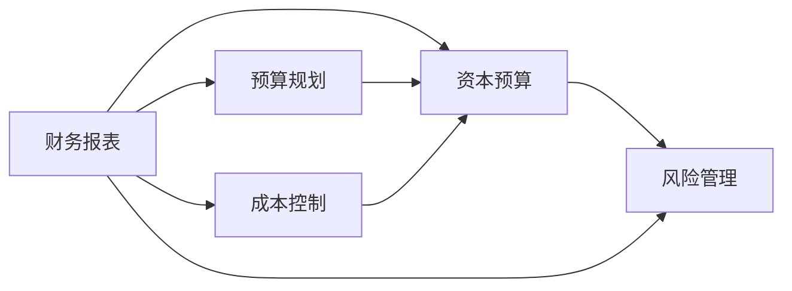

                 

# 财务管理：非财务经理也需要了解的知识

> 关键词：财务管理,非财务经理,商业决策,预算规划,财务报表,资本预算,风险管理

## 1. 背景介绍

### 1.1 问题由来

在当今商业环境中，财务管理已成为企业成功运营的核心要素之一。尽管财务管理通常被认为是财务部门的职责，但所有管理人员，无论其在公司中的角色是什么，都需具备一定的财务知识，以便更好地做出商业决策。财务状况、盈利能力和现金流直接影响到企业的长期发展和成功。因此，非财务经理需要掌握一定的财务管理知识，以支持决策过程和促进业务增长。

### 1.2 问题核心关键点

财务管理的关键在于理解财务报表、掌握预算和成本控制、以及有效进行资本预算和风险管理。本文将详细探讨这些核心概念，并解释它们如何相互关联，共同支持企业的整体战略目标。

## 2. 核心概念与联系

### 2.1 核心概念概述

为更好地理解财务管理，本节将介绍几个关键概念及其相互关系：

- **财务报表**：财务报表是企业财务状况的总结，包括资产负债表、利润表和现金流量表。这些报表提供了关于企业的资源、负债、盈利和现金流量的信息。
- **预算规划**：预算规划涉及设定目标和预测未来的财务状况，以确保企业按计划运营。预算有助于资源分配、成本控制和业绩衡量。
- **成本控制**：成本控制旨在最小化支出，优化资源使用，提高盈利能力。
- **资本预算**：资本预算关注于长期投资项目的财务评估和决策，包括项目识别、投资回报率计算和风险评估。
- **风险管理**：风险管理涉及识别、评估和减轻财务风险，保护企业免受潜在负面影响。

这些核心概念通过一个简单的Mermaid流程图进行展示：



这个流程图展示了财务报表如何影响预算规划、成本控制和资本预算，而风险管理则贯穿于整个财务管理过程。

## 3. 核心算法原理 & 具体操作步骤

### 3.1 算法原理概述

财务管理的基础是理解财务报表和财务比率。财务报表提供了企业财务状况的全面视图，而财务比率则用于分析企业的健康状况、效率和流动性。

- **资产负债表**：反映了企业的资产、负债和股东权益的状况。
- **利润表**：显示了企业的收入、成本和利润。
- **现金流量表**：记录了企业的现金流入和流出情况。

通过财务比率分析，可以评估企业的盈利能力、流动性和偿债能力。例如，流动比率（Current Ratio）衡量企业的短期偿债能力，而净利润率（Net Profit Margin）反映了企业的盈利效率。

### 3.2 算法步骤详解

财务管理的具体步骤包括：

1. **财务报表分析**：收集和分析财务报表数据，以评估企业财务状况。
2. **财务比率计算**：计算并解释关键财务比率，以深入了解企业健康状况。
3. **预算编制**：根据历史数据和未来预期，编制财务预算。
4. **成本控制**：制定成本控制策略，确保支出最小化。
5. **资本预算**：评估投资项目，决定资金分配。
6. **风险管理**：识别和减轻财务风险，保护企业免受潜在损失。

### 3.3 算法优缺点

**优点**：

- 提供全面的财务视图，帮助管理层做出更加明智的决策。
- 有助于成本控制和资源优化，提高盈利能力。
- 通过资本预算和风险管理，保护企业长期健康发展。

**缺点**：

- 需要时间和专业知识进行分析和解释。
- 依赖历史数据和假设，可能导致预测不准确。
- 复杂度较高，非财务经理可能难以理解。

### 3.4 算法应用领域

财务管理在多个领域都有广泛应用，包括但不限于：

- **企业运营**：优化资源分配和成本控制。
- **投资决策**：评估投资项目，确定资金分配。
- **战略规划**：支持长期发展目标和业务增长。
- **财务报告**：生成和解释财务报表，向投资者展示业绩。

## 4. 数学模型和公式 & 详细讲解 & 举例说明

### 4.1 数学模型构建

财务管理的数学模型主要基于以下公式和概念：

- **流动比率（Current Ratio）**：

  $$
  \text{流动比率} = \frac{\text{流动资产}}{\text{流动负债}}
  $$

- **净利润率（Net Profit Margin）**：

  $$
  \text{净利润率} = \frac{\text{净利润}}{\text{收入}}
  $$

- **资产回报率（ROA）**：

  $$
  \text{ROA} = \frac{\text{净利润}}{\text{总资产}}
  $$

- **资本回报率（ROE）**：

  $$
  \text{ROE} = \frac{\text{净利润}}{\text{股东权益}}
  $$

这些公式用于评估企业的盈利能力、效率和资源利用情况。

### 4.2 公式推导过程

以流动比率为例，推导其计算过程：

- **流动资产**：包括现金、应收账款和存货等短期资产。
- **流动负债**：包括应付账款和短期债务等短期负债。

流动比率衡量企业短期偿债能力，比率越高，表示企业越有偿债能力。

### 4.3 案例分析与讲解

假设某企业资产负债表显示流动资产为100万美元，流动负债为50万美元，则流动比率为：

$$
\text{流动比率} = \frac{100}{50} = 2
$$

这意味着企业每有一美元的流动负债，就有两美元的流动资产作为保障，表明企业的短期偿债能力较强。

## 5. 项目实践：代码实例和详细解释说明

### 5.1 开发环境搭建

要进行财务管理的具体计算，需要以下环境：

1. **安装Python**：从官网下载并安装Python 3.x版本。
2. **安装Pandas库**：Pandas是Python中处理表格数据的标准库，用于财务数据处理。

   ```bash
   pip install pandas
   ```

3. **安装Matplotlib库**：Matplotlib用于绘制图表，可视化财务比率。

   ```bash
   pip install matplotlib
   ```

### 5.2 源代码详细实现

以下是使用Python计算和可视化财务比率的代码示例：

```python
import pandas as pd
import matplotlib.pyplot as plt

# 假设的财务数据
data = {
    '流动资产': [100, 110, 120, 130, 140],
    '流动负债': [50, 60, 70, 80, 90],
    '收入': [500, 550, 600, 650, 700],
    '净利润': [75, 85, 95, 105, 115],
    '总资产': [1000, 1050, 1100, 1150, 1200],
    '股东权益': [500, 550, 600, 650, 700]
}

# 创建DataFrame
df = pd.DataFrame(data)

# 计算财务比率
df['流动比率'] = df['流动资产'] / df['流动负债']
df['净利润率'] = df['净利润'] / df['收入']
df['ROA'] = df['净利润'] / df['总资产']
df['ROE'] = df['净利润'] / df['股东权益']

# 可视化
df[['流动比率', '净利润率', 'ROA', 'ROE']].plot(kind='bar')
plt.title('财务比率')
plt.xlabel('比率名称')
plt.ylabel('值')
plt.show()
```

### 5.3 代码解读与分析

上述代码首先定义了一个字典，包含假设的财务数据。然后，使用Pandas库创建了一个DataFrame对象，用于存储和操作这些数据。通过简单的数学运算，计算了流动比率、净利润率、资产回报率和资本回报率。最后，使用Matplotlib库绘制了这些比率的条形图。

### 5.4 运行结果展示

运行上述代码，将得到包含财务比率的DataFrame，并生成一张条形图。图表展示了不同比率的大小，帮助直观理解企业的财务状况。

## 6. 实际应用场景

### 6.1 财务报告

财务报告是企业对外展示其财务状况的重要工具。财务经理需要定期生成和分析财务报表，向管理层和投资者展示企业的财务健康状况。

### 6.2 预算规划

预算规划帮助企业设定目标和规划未来，确保资源合理分配和成本控制。管理层需要根据历史数据和未来预期制定预算，并监督其实施。

### 6.3 资本预算

资本预算涉及对长期投资项目的评估和决策。企业需要考虑项目的收益、成本和风险，以决定是否投资。

### 6.4 风险管理

风险管理通过识别、评估和减轻财务风险，保护企业免受潜在损失。管理层需要制定风险管理策略，监控和应对财务风险。

## 7. 工具和资源推荐

### 7.1 学习资源推荐

为了帮助非财务经理掌握财务管理知识，以下是推荐的资源：

1. **《财务报表分析》（Financial Statement Analysis）**：本书详细介绍了财务报表的解读方法，适合初学者。
2. **《财务管理：原理与实践》（Financial Management: Principles and Practices）**：该书涵盖了财务管理的基础知识和实用技巧，适合有一定财务基础的管理人员。
3. **在线课程**：Coursera和edX等平台提供了多种财务管理相关的在线课程，如“Finance for Non-Financial Managers”等。

### 7.2 开发工具推荐

以下是几款推荐的财务管理工具：

1. **Excel**：Excel是进行财务分析和预算编制的最常用工具，其强大的数据处理和图表功能使其非常实用。
2. **QuickBooks**：QuickBooks是一款广泛使用的会计软件，适合中小型企业。
3. **Zoho Books**：Zoho Books提供云端会计解决方案，适合远程办公的企业。

### 7.3 相关论文推荐

为了深入了解财务管理的研究进展，以下是推荐的论文：

1. **《财务报表分析与估值》（Financial Statement Analysis and Valuation）**：论文探讨了如何通过财务报表进行企业估值，是财务分析的经典文献。
2. **《预算编制与控制》（Budgeting and Control）**：论文介绍了预算规划和成本控制的最佳实践，适合企业管理层参考。
3. **《资本预算与投资决策》（Capital Budgeting and Investment Decisions）**：论文详细讨论了资本预算的方法和工具，是投资决策的必读文献。

## 8. 总结：未来发展趋势与挑战

### 8.1 研究成果总结

本文介绍了财务管理的基本概念和实际应用，帮助非财务经理理解财务报表、预算规划、成本控制、资本预算和风险管理。通过这些知识，非财务经理可以更好地支持业务决策，促进企业的长期发展。

### 8.2 未来发展趋势

财务管理技术将持续发展，未来趋势包括：

1. **数字化转型**：随着数字化技术的普及，财务管理将更加依赖数据分析和自动化工具。
2. **实时财务报告**：实时财务报告将提供更及时的财务信息，支持快速决策。
3. **AI应用**：AI技术将用于财务预测和风险评估，提高分析效率。
4. **可持续发展**：企业将更加关注可持续发展和环境影响，财务管理需纳入这些考量。

### 8.3 面临的挑战

尽管财务管理技术在不断发展，但仍面临一些挑战：

1. **复杂性**：财务管理涉及多个概念和工具，非财务经理需要投入时间和精力学习。
2. **数据质量**：高质量的数据是财务分析的基础，但数据质量可能受到限制。
3. **技术变化**：财务管理工具和技术不断更新，管理人员需保持学习。

### 8.4 研究展望

未来的研究应集中在：

1. **简化财务管理**：开发易于使用的财务工具，降低门槛。
2. **提升数据质量**：探索数据采集和处理的新方法，提高分析准确性。
3. **强化AI应用**：探索AI在财务管理中的应用，如自动化报告生成和预测分析。
4. **促进可持续性**：研究如何将财务分析与可持续性目标相结合。

## 9. 附录：常见问题与解答

**Q1：如何理解财务报表？**

A: 财务报表主要包括资产负债表、利润表和现金流量表。资产负债表显示了企业的资产、负债和股东权益；利润表显示了企业的收入、成本和利润；现金流量表记录了企业的现金流入和流出情况。理解财务报表的关键在于掌握这些基本概念，并利用财务比率进行深入分析。

**Q2：如何制定有效的预算？**

A: 制定有效的预算需要以下步骤：
1. 收集历史数据和行业趋势。
2. 设定具体目标和假设。
3. 制定详细计划和资源分配。
4. 定期监控和调整预算。

**Q3：如何进行资本预算？**

A: 资本预算包括项目识别、成本评估、收益分析、风险评估等步骤。使用净现值（NPV）、内部收益率（IRR）等方法进行财务评估，确保投资回报率（ROI）符合预期。

**Q4：如何管理财务风险？**

A: 财务风险管理包括识别潜在风险、评估风险影响、制定应对策略等。使用财务指标如流动比率、债务比率等进行风险评估，并通过多样化投资、保险等手段进行风险控制。

通过本文的系统梳理，非财务经理可以更好地理解财务管理的核心概念和实际应用，支持业务决策，促进企业成长。未来，随着财务管理技术的不断进步，管理人员将能够更加高效地进行资源分配和风险管理，为企业的长期发展奠定坚实基础。

---

作者：禅与计算机程序设计艺术 / Zen and the Art of Computer Programming

