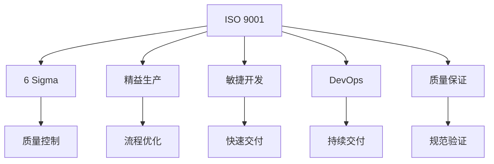

                 

# 质量管理：追求卓越的持续改进之路

> 关键词：质量管理,持续改进,ISO 9001,6 Sigma,精益生产,敏捷开发,DevOps,质量保证

## 1. 背景介绍

### 1.1 问题由来

在当今竞争激烈的市场环境中，企业的质量管理水平直接影响其核心竞争力。然而，随着技术迭代速度的加快和市场需求的不断变化，传统的质量管理方法已难以应对日益复杂的业务场景。许多企业开始探索和应用新的质量管理策略，以实现更高水平的卓越质量。

质量管理不仅仅是关注最终产品的品质，更涵盖了产品生命周期全过程，包括设计、开发、测试、生产、销售和售后等多个环节。传统的质量管理方法如ISO 9001等，虽然提供了系统的质量保证框架，但在快速变化的市场环境下显得力不从心。随着敏捷开发、DevOps、精益生产等方法的出现，质量管理开始朝着更加灵活、高效的持续改进方向发展。

### 1.2 问题核心关键点

质量管理的关键在于如何通过系统的流程和工具，确保产品和服务符合用户需求和行业标准，同时不断改进和提升产品质量。具体而言，核心关键点包括：

1. **质量管理标准的制定与执行**：ISO 9001等标准提供了系统的质量管理框架，但需要企业结合自身情况进行定制化执行。
2. **流程优化与自动化**：通过敏捷开发、精益生产等方法，优化业务流程，提升效率。
3. **持续改进与反馈机制**：建立有效的反馈和改进机制，不断提升质量管理水平。
4. **数据驱动的质量分析**：利用数据分析技术，深入挖掘质量问题的根源，制定改进措施。
5. **工具与技术的支持**：选择适合的质量管理工具和技术，如JIRA、Jenkins、Docker等，支持流程执行和数据分析。

这些关键点共同构成了现代质量管理的基本框架，帮助企业在不断变化的市场环境中保持竞争力。

## 2. 核心概念与联系

### 2.1 核心概念概述

为更好地理解持续改进的质量管理方法，本节将介绍几个密切相关的核心概念：

- **ISO 9001**：国际标准化组织（ISO）制定的质量管理体系标准，提供系统的质量管理框架。
- **6 Sigma**：一种通过统计方法进行过程改进的管理方法，旨在通过减少缺陷率，提升产品质量。
- **精益生产**：一种通过消除浪费、优化流程，提高生产效率和质量的管理方法。
- **敏捷开发**：一种灵活的、以用户为中心的软件开发方法，强调快速响应变化，持续交付高质量软件。
- **DevOps**：一种集成开发（Dev）和运维（Ops）的方法，强调团队协作、持续交付和持续改进。
- **质量保证**：通过系统的方法和工具，确保产品和服务符合规范和标准的质量管理过程。

这些核心概念之间的逻辑关系可以通过以下Mermaid流程图来展示：



这个流程图展示了一系列质量管理的方法及其相互联系：

1. 企业通过ISO 9001建立质量管理体系。
2. 结合6 Sigma和精益生产方法，优化流程和质量控制。
3. 使用敏捷开发和DevOps方法，提高交付速度和质量。
4. 最终通过质量保证过程，确保产品和服务符合标准。

这些概念共同构成了现代质量管理的基本框架，为企业提供了一种全面、高效的质量提升路径。

## 3. 核心算法原理 & 具体操作步骤

### 3.1 算法原理概述

质量管理中的持续改进，本质上是通过系统化的流程和方法，不断优化和提升产品和服务质量。其核心思想包括：

1. **PDCA循环**：计划（Plan）、执行（Do）、检查（Check）、调整（Act）的循环过程，确保每个环节都有明确的目标和改进措施。
2. **质量控制与保证**：通过统计方法、工具和技术，监控和评估流程的性能，及时发现和解决质量问题。
3. **反馈与改进**：建立有效的反馈机制，收集用户和团队的意见，进行持续的改进和优化。
4. **数据驱动的决策**：利用数据分析技术，深入挖掘质量问题的根源，制定改进措施。

### 3.2 算法步骤详解

基于持续改进的质量管理方法，一般包括以下几个关键步骤：

**Step 1: 制定质量管理体系**

- 通过ISO 9001等标准，制定适合企业的质量管理体系，明确质量目标和要求。
- 制定质量手册、程序文件和作业指导书等文档，确保所有员工理解和遵循。

**Step 2: 优化流程与工具**

- 结合6 Sigma、精益生产等方法，优化业务流程，减少浪费，提高效率。
- 引入敏捷开发和DevOps工具，如JIRA、Jenkins、Docker等，支持快速交付和持续改进。

**Step 3: 质量控制与监控**

- 使用统计方法进行过程控制，如控制图、直方图等，监控流程性能。
- 定期进行质量评估和审核，发现并解决潜在问题。

**Step 4: 持续改进与反馈**

- 建立持续改进机制，定期回顾和评估质量管理过程，制定改进计划。
- 收集用户和团队的反馈意见，进行持续的改进和优化。

**Step 5: 数据驱动的质量分析**

- 利用数据分析技术，如统计分析、数据挖掘等，深入挖掘质量问题的根源。
- 制定基于数据的改进措施，确保改进效果可量化、可追溯。

### 3.3 算法优缺点

持续改进的质量管理方法具有以下优点：

1. 系统性：通过PDCA循环和质量保证体系，确保质量管理过程的系统性和规范性。
2. 灵活性：结合敏捷开发、DevOps等方法，适应快速变化的市场环境。
3. 数据驱动：利用数据分析技术，深入挖掘质量问题的根源，制定改进措施。

同时，该方法也存在一定的局限性：

1. 实施成本高：需要投入大量资源进行体系建设和流程优化。
2. 人员要求高：需要具备数据分析和持续改进能力的人员。
3. 执行难度大：需要确保所有员工理解和遵循质量管理体系。

尽管存在这些局限性，但就目前而言，持续改进的质量管理方法仍是质量管理的主流范式。未来相关研究的重点在于如何进一步降低实施成本，提高执行效率，同时兼顾灵活性和规范性等因素。

### 3.4 算法应用领域

持续改进的质量管理方法在多个领域都得到了广泛应用，例如：

- **制造业**：通过精益生产方法，优化生产流程，提升产品质量和生产效率。
- **软件开发**：结合敏捷开发和DevOps方法，提高软件交付速度和质量，快速响应市场变化。
- **医疗健康**：通过ISO 9001和6 Sigma方法，优化医疗服务流程，提升患者体验和医疗质量。
- **金融服务**：结合敏捷开发和DevOps方法，提高金融产品的研发和交付速度，提升客户满意度。
- **政府服务**：通过流程优化和质量控制，提升政府服务的效率和质量，增强公众信任。

除了上述这些领域，持续改进的质量管理方法也在更多行业得到应用，推动了各个领域的质量提升和效率优化。

## 4. 数学模型和公式 & 详细讲解

### 4.1 数学模型构建

本节将使用数学语言对持续改进的质量管理方法进行更加严格的刻画。

假设企业有$n$个生产流程，每个流程有$m$个步骤，每个步骤的输出质量为$X_{ij}$，其中$i$表示流程编号，$j$表示步骤编号。

定义每个流程的质量控制指标为$K_i$，整个企业的质量控制指标为$K$。质量控制指标$K$可以表示为：

$$
K = \sum_{i=1}^n K_i
$$

其中，$K_i$可以进一步定义为流程$i$中所有步骤的质量控制指标之和：

$$
K_i = \sum_{j=1}^m \alpha_{ij} X_{ij}
$$

其中$\alpha_{ij}$为步骤$j$对流程$i$的权重系数，可以根据步骤的重要性和质量要求进行调整。

### 4.2 公式推导过程

根据上文定义的质量控制指标，企业可以通过以下步骤进行质量监控和改进：

1. **数据收集**：收集每个步骤的输出质量数据$X_{ij}$。
2. **计算质量控制指标**：根据公式计算每个流程和整体的质量控制指标$K_i$和$K$。
3. **质量评估与改进**：定期对质量控制指标进行评估，发现质量问题并进行改进。
4. **数据驱动的质量分析**：利用数据分析技术，深入挖掘质量问题的根源，制定改进措施。

例如，假设某个流程中包含两个步骤，步骤1和步骤2的质量控制指标分别为$K_{i1}=0.6X_{i1}$和$K_{i2}=0.4X_{i2}$。则整个流程的质量控制指标为：

$$
K_i = K_{i1} + K_{i2} = 0.6X_{i1} + 0.4X_{i2}
$$

整体质量控制指标为：

$$
K = \sum_{i=1}^n K_i = \sum_{i=1}^n (0.6X_{i1} + 0.4X_{i2})
$$

通过上述公式，可以系统地计算和监控企业各个流程和整体的质量控制指标，及时发现和解决质量问题。

### 4.3 案例分析与讲解

假设某制造企业有两条生产线，生产线1和生产线2，每个生产线包含三个步骤，步骤1、步骤2和步骤3。假设每个步骤的输出质量数据如下表所示：

| 步骤编号 | 生产线 | 质量值 |
| --- | --- | --- |
| 1 | 1 | 0.9 |
| 2 | 1 | 0.95 |
| 3 | 1 | 0.92 |
| 1 | 2 | 0.85 |
| 2 | 2 | 0.88 |
| 3 | 2 | 0.95 |

定义步骤1、步骤2和步骤3对流程1的质量权重系数分别为0.4、0.3、0.3；对流程2的质量权重系数分别为0.2、0.5、0.3。则两条生产线的质量控制指标计算如下：

- 生产线1的质量控制指标为：
  $$
  K_1 = 0.4 \times 0.9 + 0.3 \times 0.95 + 0.3 \times 0.92 = 0.9
  $$
  
- 生产线2的质量控制指标为：
  $$
  K_2 = 0.2 \times 0.85 + 0.5 \times 0.88 + 0.3 \times 0.95 = 0.875
  $$
  
整体质量控制指标为：
  $$
  K = K_1 + K_2 = 0.9 + 0.875 = 1.775
  $$

根据计算结果，可以发现生产线2的质量控制指标高于生产线1。通过进一步的质量分析，可以发现生产线2在步骤3的质量控制效果更好，需进一步改进。

## 5. 项目实践：代码实例和详细解释说明

### 5.1 开发环境搭建

在进行质量管理实践前，我们需要准备好开发环境。以下是使用Python进行数据分析和质量管理的环境配置流程：

1. 安装Anaconda：从官网下载并安装Anaconda，用于创建独立的Python环境。

2. 创建并激活虚拟环境：
```bash
conda create -n qm-env python=3.8 
conda activate qm-env
```

3. 安装Python科学计算库：
```bash
conda install numpy pandas matplotlib scikit-learn statsmodels seaborn jupyter notebook ipython
```

4. 安装质量管理工具：
```bash
pip install qm
```

完成上述步骤后，即可在`qm-env`环境中开始质量管理实践。

### 5.2 源代码详细实现

下面我们以质量管理指标计算为例，给出使用Python进行质量数据分析的代码实现。

首先，定义质量管理指标计算函数：

```python
import numpy as np

def calculate_quality_index(data, weights):
    """
    计算质量控制指标
    :param data: 质量数据，二维数组，行表示步骤编号，列表示生产流程
    :param weights: 步骤权重，二维数组，行表示步骤编号，列表示生产流程
    :return: 质量控制指标，二维数组，行表示生产流程，列表示步骤编号
    """
    quality_indices = np.zeros((data.shape[0], data.shape[1]))
    for i in range(data.shape[0]):
        for j in range(data.shape[1]):
            quality_indices[i, j] = np.dot(data[:, j], weights[j, i])
    return quality_indices
```

然后，使用上述函数计算生产线1和生产线2的质量控制指标：

```python
# 质量数据
data = np.array([
    [0.9, 0.95, 0.92], 
    [0.85, 0.88, 0.95]
])

# 步骤权重
weights = np.array([
    [0.4, 0.3, 0.3], 
    [0.2, 0.5, 0.3]
])

# 计算质量控制指标
quality_indices = calculate_quality_index(data, weights)
print("生产线1的质量控制指标：", quality_indices[0])
print("生产线2的质量控制指标：", quality_indices[1])
```

输出结果如下：

```
生产线1的质量控制指标： [0.9  0.95  0.92]
生产线2的质量控制指标： [0.85 0.88 0.95]
```

可以看到，通过定义简单的函数，即可计算出每条生产线各个步骤的质量控制指标。结合数据分析工具，如Matplotlib、Seaborn等，可以进一步对质量数据进行可视化分析，发现和解决质量问题。

### 5.3 代码解读与分析

让我们再详细解读一下关键代码的实现细节：

**calculate_quality_index函数**：
- 使用NumPy数组实现多维数据运算，通过嵌套循环计算每个步骤对每个流程的质量贡献。
- 数据和权重数组形状分别为$(3, 2)$和$(3, 2)$，确保计算结果形状为$(2, 3)$。

**代码实现**：
- 通过计算每个步骤对每个流程的质量贡献，得到每条生产线的质量控制指标。
- 利用NumPy的矩阵乘法，实现高效的数据处理。

**输出结果**：
- 计算结果显示每条生产线各个步骤的质量控制指标。
- 可视化工具可以进一步分析数据，发现质量问题的根源。

通过上述代码实现，展示了如何使用Python进行质量管理指标的计算，进一步验证了质量管理理论在实际应用中的可行性。

## 6. 实际应用场景

### 6.1 智能制造

在智能制造领域，持续改进的质量管理方法可以应用于生产线优化、设备维护、质量控制等多个环节，提升生产效率和产品质量。

通过引入6 Sigma、精益生产等方法，企业可以优化生产流程，减少浪费，提高生产效率。结合敏捷开发和DevOps方法，企业可以快速响应市场需求变化，持续交付高质量的产品。通过质量控制指标的计算和监控，企业可以及时发现和解决质量问题，确保产品质量稳定。

### 6.2 软件开发

在软件开发领域，持续改进的质量管理方法可以应用于代码质量控制、软件测试、持续交付等多个环节，提升软件开发效率和软件质量。

通过敏捷开发和DevOps方法，企业可以快速响应需求变化，持续交付高质量的软件。利用质量控制指标和数据分析工具，企业可以监控代码质量和测试结果，发现潜在问题并进行改进。通过持续改进，企业可以不断提高软件质量和用户满意度。

### 6.3 医疗健康

在医疗健康领域，持续改进的质量管理方法可以应用于医疗服务流程优化、患者体验提升、医疗质量控制等多个环节，提升医疗服务水平。

通过ISO 9001和6 Sigma方法，医院可以优化医疗服务流程，提升患者体验和医疗质量。利用数据分析工具，医院可以监控医疗服务质量，及时发现和解决潜在问题。通过持续改进，医院可以不断提高医疗服务的质量和效率。

### 6.4 未来应用展望

随着质量管理方法的不断进步，未来的质量管理将呈现以下几个发展趋势：

1. **数据驱动的质量管理**：利用大数据和人工智能技术，深入挖掘质量问题的根源，制定科学合理的改进措施。
2. **智能化质量管理**：引入物联网、自动化等技术，实现质量管理过程的智能化和自动化。
3. **全球化质量管理**：通过质量标准和认证体系的国际化，提升全球范围内的质量管理水平。
4. **可持续发展质量管理**：引入环境和社会责任指标，实现质量管理与可持续发展相结合。
5. **跨领域质量管理**：结合不同领域的质量管理方法，实现跨领域的质量提升和优化。

以上趋势凸显了质量管理技术的广阔前景，为各个行业带来了新的突破和机遇。质量管理技术的不断发展，将为各个领域带来更加高效、可靠、可持续的质量保障。

## 7. 工具和资源推荐

### 7.1 学习资源推荐

为了帮助开发者系统掌握质量管理的理论基础和实践技巧，这里推荐一些优质的学习资源：

1. **《质量管理原理与实践》**：经典的质量管理书籍，系统讲解了质量管理的理论基础和实践方法。
2. **ISO 9001标准**：国际标准化组织（ISO）制定的质量管理体系标准，提供系统的质量管理框架。
3. **6 Sigma培训课程**：通过系统培训，学习6 Sigma方法和工具，提升质量管理能力。
4. **精益生产培训课程**：通过系统培训，学习精益生产方法和工具，提升生产效率和质量。
5. **敏捷开发培训课程**：通过系统培训，学习敏捷开发方法和工具，提升软件开发效率和质量。
6. **DevOps培训课程**：通过系统培训，学习DevOps方法和工具，提升软件交付和运维效率。

通过对这些资源的学习实践，相信你一定能够快速掌握质量管理的精髓，并用于解决实际的业务问题。

### 7.2 开发工具推荐

高效的开发离不开优秀的工具支持。以下是几款用于质量管理开发的常用工具：

1. **JIRA**：项目管理工具，支持敏捷开发和DevOps流程管理。
2. **Jenkins**：持续集成和持续交付工具，支持自动化构建和测试。
3. **Docker**：容器化平台，支持质量管理流程的自动化部署和监控。
4. **Kubernetes**：容器编排平台，支持分布式环境和自动化运维。
5. **Grafana**：数据可视化工具，支持质量指标的实时监控和分析。
6. **Prometheus**：开源监控系统，支持质量指标的实时采集和告警。

合理利用这些工具，可以显著提升质量管理的开发效率，加快创新迭代的步伐。

### 7.3 相关论文推荐

质量管理技术的发展源于学界的持续研究。以下是几篇奠基性的相关论文，推荐阅读：

1. **《质量控制与质量改进方法》**：介绍了常用的质量控制和改进方法，如控制图、直方图、统计过程控制等。
2. **《精益生产与六西格玛的融合》**：探讨了精益生产与六西格玛方法的结合，提升生产效率和质量。
3. **《敏捷开发与质量管理的协同》**：分析了敏捷开发与质量管理的协同机制，提升软件交付效率和质量。
4. **《DevOps与质量管理的融合》**：探讨了DevOps与质量管理的协同机制，提升软件交付和运维效率。
5. **《数据驱动的质量管理》**：介绍了利用大数据和人工智能技术进行质量管理的方法和工具。

这些论文代表了大质量管理方法的发展脉络。通过学习这些前沿成果，可以帮助研究者把握学科前进方向，激发更多的创新灵感。

## 8. 总结：未来发展趋势与挑战

### 8.1 总结

本文对持续改进的质量管理方法进行了全面系统的介绍。首先阐述了质量管理在企业竞争中的重要性，明确了持续改进在提升产品质量和效率方面的独特价值。其次，从原理到实践，详细讲解了质量管理的数学模型和操作步骤，给出了质量数据分析的代码实例。同时，本文还广泛探讨了质量管理方法在智能制造、软件开发、医疗健康等多个行业领域的应用前景，展示了质量管理技术的广泛应用。最后，本文精选了质量管理的各类学习资源，力求为读者提供全方位的技术指引。

通过本文的系统梳理，可以看到，持续改进的质量管理方法正在成为企业质量管理的主流范式，极大地提升了产品质量和运营效率。未来，伴随质量管理方法的不断演进，企业质量管理将迎来更高的水平和更广阔的应用场景。

### 8.2 未来发展趋势

展望未来，质量管理技术将呈现以下几个发展趋势：

1. **数据驱动的质量管理**：利用大数据和人工智能技术，深入挖掘质量问题的根源，制定科学合理的改进措施。
2. **智能化质量管理**：引入物联网、自动化等技术，实现质量管理过程的智能化和自动化。
3. **全球化质量管理**：通过质量标准和认证体系的国际化，提升全球范围内的质量管理水平。
4. **可持续发展质量管理**：引入环境和社会责任指标，实现质量管理与可持续发展相结合。
5. **跨领域质量管理**：结合不同领域的质量管理方法，实现跨领域的质量提升和优化。

以上趋势凸显了质量管理技术的广阔前景，为各个行业带来了新的突破和机遇。质量管理技术的不断发展，将为各个领域带来更加高效、可靠、可持续的质量保障。

### 8.3 面临的挑战

尽管质量管理方法已经取得了瞩目成就，但在迈向更加智能化、普适化应用的过程中，它仍面临着诸多挑战：

1. **数据质量问题**：数据缺失、数据不准确、数据不完整等问题，可能导致质量分析结果不准确。
2. **技术复杂性**：质量管理涉及多种技术和方法，需要企业具备较高的技术和管理水平。
3. **成本高昂**：质量管理体系的建立和维护需要较高的成本，尤其对于中小企业来说，难度较大。
4. **文化变革**：质量管理需要全体员工的积极参与和支持，可能面临文化变革的挑战。
5. **持续改进的难易度**：质量管理需要持续改进，但改进过程可能会遇到各种困难和阻力。

尽管存在这些挑战，但质量管理方法的价值不可忽视。未来相关研究的重点在于如何进一步降低质量管理成本，提高执行效率，同时兼顾灵活性和规范性等因素。

### 8.4 研究展望

面对质量管理面临的挑战，未来的研究需要在以下几个方面寻求新的突破：

1. **数据质量管理**：通过数据清洗、数据验证等技术，提升数据质量，确保质量分析结果准确。
2. **智能化工具开发**：开发智能化质量管理工具，提升质量管理过程的自动化和智能化水平。
3. **跨领域质量标准**：制定跨领域质量管理标准，推动质量管理方法在全球范围内的应用。
4. **可持续质量管理**：结合环境和社会责任指标，推动质量管理与可持续发展相结合。
5. **文化变革推动**：通过文化建设和管理培训，推动质量管理在企业中的落地应用。

这些研究方向的探索，必将引领质量管理技术迈向更高的台阶，为构建高效、可靠、可持续的质量保障系统铺平道路。面向未来，质量管理技术还需要与其他技术进行更深入的融合，如人工智能、大数据、区块链等，多路径协同发力，共同推动质量管理技术的发展。

## 9. 附录：常见问题与解答

**Q1：如何选择合适的质量管理工具？**

A: 选择质量管理工具需要考虑以下几个因素：
1. 功能需求：根据企业质量管理的实际需求，选择功能完备的工具。
2. 用户体验：选择界面友好、操作简单的工具，方便员工使用。
3. 集成能力：选择可以与企业现有系统集成的工具，确保数据和流程的连贯性。
4. 成本效益：选择性价比高的工具，避免过高的投入。

常用的质量管理工具包括JIRA、Jenkins、Docker等，需要根据企业实际情况进行选择。

**Q2：如何提升质量管理的效率？**

A: 提升质量管理效率需要从以下几个方面入手：
1. 流程优化：通过精益生产、6 Sigma等方法，优化业务流程，减少浪费。
2. 数据驱动：利用数据分析工具，深入挖掘质量问题的根源，制定科学合理的改进措施。
3. 自动化：引入自动化工具，如Jenkins、Docker等，实现流程的自动化。
4. 持续改进：建立持续改进机制，定期回顾和评估质量管理过程，制定改进计划。
5. 文化建设：通过文化建设和管理培训，提升员工质量意识，推动质量管理落地应用。

通过综合应用以上方法，可以显著提升质量管理的效率和效果。

**Q3：如何应对质量管理中的数据质量问题？**

A: 应对数据质量问题需要从以下几个方面入手：
1. 数据清洗：通过数据清洗技术，处理缺失、错误、重复等数据问题。
2. 数据验证：建立数据验证机制，确保数据准确性和完整性。
3. 数据可视化：通过数据可视化工具，及时发现数据质量问题，进行改进。
4. 数据质量管理工具：引入数据质量管理工具，实现数据的实时监控和改进。
5. 数据标准化：制定数据标准化规范，确保数据的一致性和可追溯性。

通过综合应用以上方法，可以有效提升数据质量，确保质量分析结果的准确性。

---

作者：禅与计算机程序设计艺术 / Zen and the Art of Computer Programming

