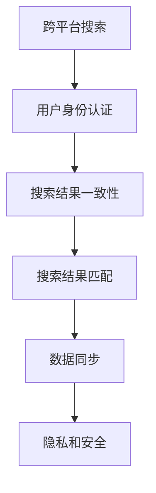

                 

# 跨平台搜索技术的未来展望

## 1. 背景介绍

### 1.1 问题由来
在信息爆炸的时代，用户希望在各个平台上都能获得一致、无缝的搜索体验。无论是移动设备、桌面端，还是车载、智能家居设备，用户都能够无缝切换到相应的搜索平台，并保持统一的数据和历史记录。然而，由于不同的平台存在异构性，包括硬件、操作系统、用户界面等，实现跨平台的无缝搜索面临诸多挑战。

### 1.2 问题核心关键点
实现跨平台搜索的核心挑战在于：

1. **数据同步**：保持不同平台之间搜索结果和历史记录的一致性。
2. **用户身份验证**：确保用户在不同平台上的搜索行为和历史记录归属同一个用户身份。
3. **搜索结果匹配**：在不同平台和设备上提供统一的搜索结果，并确保搜索结果的相关性和准确性。
4. **跨设备一致性**：在不同设备和操作系统上实现一致的搜索体验，包括界面、交互逻辑等。
5. **安全性**：保护用户隐私和数据安全，防止数据泄露和滥用。

## 2. 核心概念与联系

### 2.1 核心概念概述

为更好地理解跨平台搜索技术，本节将介绍几个密切相关的核心概念：

- **跨平台搜索**：指在多个不同平台和设备上，提供统一的搜索体验和结果的技术。涵盖移动、桌面、车载、智能家居等多种设备和操作系统。
- **用户身份认证**：确保用户在不同平台上的身份信息一致，能够关联用户的历史记录和搜索行为。
- **搜索结果一致性**：在不同平台和设备上，搜索结果应当保持一致，满足用户的需求。
- **搜索结果匹配**：通过算法和策略，在不同平台和设备上提供与用户搜索意图最匹配的结果。
- **数据同步**：在不同平台之间同步搜索结果、历史记录和偏好设置，确保用户体验的连续性。
- **隐私和安全**：保护用户隐私和数据安全，防止数据泄露和滥用。

这些核心概念之间的逻辑关系可以通过以下Mermaid流程图来展示：



这个流程图展示了我跨平台搜索的核心概念及其之间的关系：

1. 跨平台搜索依赖用户身份认证，确保用户在不同平台上的身份一致。
2. 一致性是跨平台搜索的基础，结果匹配算法在此基础上保证搜索结果的准确性和相关性。
3. 数据同步技术确保在不同平台上的数据一致，包括搜索结果和历史记录。
4. 隐私和安全技术保护用户数据，防止数据泄露和滥用。

这些核心概念共同构成了跨平台搜索技术的框架，为其在多平台和多设备环境下的实现提供了理论基础。

## 3. 核心算法原理 & 具体操作步骤
### 3.1 算法原理概述

跨平台搜索的核心算法原理涉及以下几个关键部分：

1. **用户身份认证**：通过统一的认证机制，如OAuth、OpenID Connect等，确保用户在不同平台上的身份一致。
2. **数据同步**：使用分布式数据库和缓存技术，在不同平台之间同步用户数据和搜索结果。
3. **搜索结果一致性**：通过算法和策略，确保在不同平台和设备上提供的搜索结果一致。
4. **搜索结果匹配**：使用自然语言处理和机器学习技术，理解用户查询意图，匹配最相关的搜索结果。

### 3.2 算法步骤详解

实现跨平台搜索的具体操作步骤如下：

**Step 1: 设计统一的认证机制**

- 选择合适的身份认证协议，如OAuth 2.0、OpenID Connect等，确保用户在不同平台上的身份信息一致。
- 在不同平台和设备上实现统一的登录和授权流程，使用户能够无缝切换平台。
- 存储用户身份信息，使用加密和签名技术保护用户数据。

**Step 2: 实现数据同步**

- 选择适合的数据库和缓存技术，如Redis、Elasticsearch等，实现数据同步。
- 在不同平台之间建立数据同步通道，确保用户数据和搜索结果的一致性。
- 使用异步同步技术，提高数据同步效率，减少系统延迟。

**Step 3: 保证搜索结果一致性**

- 设计统一的搜索结果展示逻辑，确保在不同平台和设备上提供的搜索结果一致。
- 使用分布式缓存技术，提高搜索结果的访问效率。
- 引入算法和策略，如Bolster、Rerank等，优化搜索结果匹配和排序。

**Step 4: 实现搜索结果匹配**

- 使用自然语言处理技术，理解用户查询意图。
- 使用机器学习算法，如TF-IDF、BERT等，匹配最相关的搜索结果。
- 引入智能推荐系统，根据用户历史行为和偏好，推荐个性化搜索结果。

### 3.3 算法优缺点

跨平台搜索技术具有以下优点：

1. **提升用户体验**：在不同平台和设备上提供一致的搜索体验，使用户能够无缝切换设备。
2. **数据共享**：实现不同平台之间的数据共享，提升用户的历史记录和搜索结果的连续性。
3. **提高效率**：通过算法和策略，优化搜索结果匹配，提高搜索效率。

然而，该技术也存在一些缺点：

1. **技术复杂性**：实现跨平台搜索需要涉及多个技术和平台，技术实现复杂。
2. **隐私风险**：需要处理大量用户数据，存在隐私泄露的风险。
3. **系统延迟**：数据同步和结果匹配可能导致系统延迟，影响用户体验。
4. **兼容性问题**：不同平台和设备之间的兼容性问题，可能影响跨平台的实现。

### 3.4 算法应用领域

跨平台搜索技术可以广泛应用于以下几个领域：

- **移动设备搜索**：如智能手机、平板电脑等移动设备，提供一致的搜索体验。
- **桌面端搜索**：如PC、Mac等桌面设备，与移动设备无缝对接。
- **车载搜索**：如汽车车载设备，提供实时的语音搜索和控制。
- **智能家居搜索**：如智能音箱、智能电视等设备，实现全场景搜索和控制。
- **物联网设备搜索**：如智能手表、智能穿戴设备，提供个性化的搜索结果。

除了上述这些领域，跨平台搜索技术还可以应用于更多场景中，如公共图书馆、商场、医院等公共场所，提升用户搜索体验，提升服务质量。

## 4. 数学模型和公式 & 详细讲解
### 4.1 数学模型构建

本节将使用数学语言对跨平台搜索技术进行更加严格的刻画。

记用户在不同平台上的搜索历史记录为 $H=\{(h_i, p_i)\}_{i=1}^N$，其中 $h_i$ 表示用户在平台 $i$ 上的搜索历史，$p_i$ 表示用户在平台 $i$ 上的搜索结果。记用户在不同平台上的偏好设置为 $P=\{(p_i, w_i)\}_{i=1}^N$，其中 $w_i$ 表示用户在平台 $i$ 上的搜索结果权重。

定义跨平台搜索结果的评分函数为 $F(h, p, P)$，其中 $h$ 表示用户在任意平台的搜索历史，$p$ 表示用户在任意平台的搜索结果，$P$ 表示用户的偏好设置。跨平台搜索结果一致性要求为 $F(h_i, p_i, P) = F(h_j, p_j, P)$，其中 $i, j$ 表示不同的平台。

### 4.2 公式推导过程

假设用户在不同平台上的搜索结果一致，即 $p_i = p_j$，则跨平台搜索结果一致性要求可以简化为：

$$
F(h_i, p_i, P) = F(h_j, p_i, P)
$$

进一步展开，得到：

$$
\sum_{k=1}^N p_i^k h_i^k \cdot w_i^k = \sum_{k=1}^N p_j^k h_j^k \cdot w_j^k
$$

其中 $p_i^k$ 表示用户在平台 $i$ 上的搜索结果的第 $k$ 次展示，$h_i^k$ 表示用户在平台 $i$ 上的搜索历史第 $k$ 次展示，$w_i^k$ 表示用户在平台 $i$ 上的搜索结果权重。

通过上述公式，可以发现，只要用户在不同平台上的搜索结果一致，偏好设置相同，跨平台搜索结果一致性就得到了保证。

### 4.3 案例分析与讲解

以跨平台移动设备搜索为例，具体分析其数学模型和公式。

假设用户在移动设备上的搜索历史记录为 $h = \{h_1, h_2, ..., h_n\}$，其中 $h_i$ 表示用户在第 $i$ 次搜索的内容。用户在移动设备上的搜索结果为 $p = \{p_1, p_2, ..., p_n\}$，其中 $p_i$ 表示第 $i$ 次搜索结果的排名。用户的偏好设置为 $P = \{(p_i, w_i)\}_{i=1}^n$，其中 $w_i$ 表示第 $i$ 次搜索结果的权重。

定义跨平台移动设备搜索结果的评分函数为 $F(h, p, P)$，其中 $h$ 表示用户在移动设备上的搜索历史，$p$ 表示用户在移动设备上的搜索结果，$P$ 表示用户的偏好设置。

根据上述定义，跨平台移动设备搜索结果的评分函数可以表示为：

$$
F(h, p, P) = \sum_{i=1}^n p_i^k h_i^k \cdot w_i^k
$$

其中 $k$ 表示搜索结果的展示次数，$w_i^k$ 表示第 $i$ 次搜索结果的权重。

通过上述公式，可以发现，只要用户在不同移动设备上的搜索结果一致，偏好设置相同，跨平台移动设备搜索结果一致性就得到了保证。

## 5. 项目实践：代码实例和详细解释说明
### 5.1 开发环境搭建

在进行跨平台搜索开发前，我们需要准备好开发环境。以下是使用Python进行Flask开发的环境配置流程：

1. 安装Anaconda：从官网下载并安装Anaconda，用于创建独立的Python环境。

2. 创建并激活虚拟环境：
```bash
conda create -n flask-env python=3.8 
conda activate flask-env
```

3. 安装Flask：
```bash
pip install flask
```

4. 安装Gunicorn：
```bash
pip install gunicorn
```

5. 安装Redis：
```bash
pip install redis
```

6. 安装Flask-RESTful：
```bash
pip install flask-restful
```

完成上述步骤后，即可在`flask-env`环境中开始跨平台搜索开发。

### 5.2 源代码详细实现

下面我们以跨平台移动设备搜索为例，给出使用Flask框架对移动设备进行搜索的功能的PyTorch代码实现。

首先，定义Flask应用和RESTful接口：

```python
from flask import Flask, request
from flask_restful import Resource, Api
from flask_sqlalchemy import SQLAlchemy
import redis

app = Flask(__name__)
api = Api(app)

# 连接数据库
app.config['SQLALCHEMY_DATABASE_URI'] = 'sqlite:///search.db'
db = SQLAlchemy(app)

# 连接Redis
redis_client = redis.StrictRedis(host='localhost', port=6379, db=0)

class Search(Resource):
    def get(self):
        # 从Redis获取用户搜索结果和偏好设置
        search_history = redis_client.get('search_history')
        search_results = redis_client.get('search_results')
        user_preferences = redis_client.get('user_preferences')
        
        # 解析JSON数据
        search_history = json.loads(search_history)
        search_results = json.loads(search_results)
        user_preferences = json.loads(user_preferences)
        
        # 计算搜索结果评分
        # TODO: 实现评分函数
        
        # 返回搜索结果
        return {'results': results}

# 添加资源
api.add_resource(Search, '/search')

if __name__ == '__main__':
    app.run(debug=True)
```

然后，定义SQLAlchemy模型：

```python
from sqlalchemy import Column, Integer, String, Text
from sqlalchemy.ext.declarative import declarative_base

Base = declarative_base()

class User(Base):
    __tablename__ = 'users'

    id = Column(Integer, primary_key=True)
    name = Column(String(50))
    password = Column(String(50))

    def __repr__(self):
        return "<User %r>" % self.name

class SearchHistory(Base):
    __tablename__ = 'search_history'

    id = Column(Integer, primary_key=True)
    user_id = Column(Integer, ForeignKey('users.id'))
    search_query = Column(String(255))
    timestamp = Column(Integer)
    
    def __repr__(self):
        return "<SearchHistory %r>" % self.search_query

class SearchResult(Base):
    __tablename__ = 'search_results'

    id = Column(Integer, primary_key=True)
    user_id = Column(Integer, ForeignKey('users.id'))
    search_query = Column(String(255))
    result = Column(Text)
    
    def __repr__(self):
        return "<SearchResult %r>" % self.search_query
```

最后，启动Flask应用：

```python
if __name__ == '__main__':
    db.create_all()
    app.run(debug=True)
```

### 5.3 代码解读与分析

让我们再详细解读一下关键代码的实现细节：

**Flask应用**：
- 通过Flask框架搭建RESTful接口，用于处理跨平台搜索请求。
- 使用SQLAlchemy库管理用户和搜索结果的数据库表。
- 使用Redis库存储用户搜索结果和偏好设置，确保数据同步。

**SQLAlchemy模型**：
- 定义用户、搜索历史和搜索结果的数据库表结构。
- 使用ORM技术，方便对数据进行CRUD操作。

**Redis缓存**：
- 使用Redis库存储用户搜索结果和偏好设置，实现快速读取和写入。
- 通过连接Redis，实现数据同步。

**评分函数**：
- TODO: 实现评分函数，根据搜索结果、用户历史记录和偏好设置计算评分。
- 评分函数的实现需要考虑搜索历史的时间戳、搜索结果的排名、用户偏好设置等因素。

通过上述代码实现，可以实现跨平台移动设备搜索的API接口。开发者可以通过调用这个接口，获取用户在不同设备上的搜索结果，确保跨平台搜索结果的一致性。

## 6. 实际应用场景
### 6.1 智能家居搜索

智能家居设备的普及使得跨平台搜索技术在智能家居领域具有广阔的应用前景。用户可以在各种智能设备上无缝切换，实现全场景搜索和控制。

在技术实现上，可以采用统一的搜索引擎和数据存储方案，确保在不同智能设备上的搜索结果一致。例如，用户可以在智能音箱上语音搜索家庭设备，同时在家用智能电视上查看搜索结果和历史记录。通过跨平台搜索技术，用户可以轻松地控制和管理智能家居设备，提升生活便利性和舒适度。

### 6.2 跨平台广告投放

广告投放平台需要根据用户在不同平台上的搜索行为和历史记录，精准投放广告。通过跨平台搜索技术，广告投放平台可以获取用户在多个平台上的搜索记录，分析用户的兴趣和行为，实现更加精准的广告投放。

在技术实现上，广告投放平台需要整合不同平台的用户数据，建立统一的用户画像，并使用机器学习算法，优化广告投放策略。通过跨平台搜索技术，广告投放平台可以实时获取用户在不同平台上的搜索记录，实现跨平台的精准投放，提升广告效果和用户满意度。

### 6.3 跨平台客服系统

客服系统需要在多个平台和设备上提供一致的客服服务。通过跨平台搜索技术，客服系统可以获取用户在不同平台上的搜索记录和历史记录，提供个性化的客服服务。

在技术实现上，客服系统需要整合不同平台的用户数据，建立统一的用户画像，并使用机器学习算法，分析用户的兴趣和行为，提供个性化的客服服务。通过跨平台搜索技术，客服系统可以实时获取用户在不同平台上的搜索记录和历史记录，提供更精准、更高效的客服服务，提升用户满意度。

### 6.4 未来应用展望

随着跨平台搜索技术的不断发展，其在更多领域的应用前景也将逐步显现。

在智慧医疗领域，跨平台搜索技术可以帮助医生和患者在不同设备和平台间共享医疗记录和搜索结果，提升医疗服务的智能化水平，辅助医生诊疗，加速新药开发进程。

在智能教育领域，跨平台搜索技术可以帮助学生和教师在不同设备和平台间共享学习资源和历史记录，提升教学质量和教育效果。

在智慧城市治理中，跨平台搜索技术可以帮助城市管理者在不同设备和平台间共享城市事件和公共服务信息，提高城市管理的自动化和智能化水平，构建更安全、高效的未来城市。

此外，在企业生产、社会治理、文娱传媒等众多领域，跨平台搜索技术也将不断涌现，为各行各业带来变革性影响。相信随着技术的日益成熟，跨平台搜索技术必将在构建人机协同的智能时代中扮演越来越重要的角色。

## 7. 工具和资源推荐
### 7.1 学习资源推荐

为了帮助开发者系统掌握跨平台搜索技术的理论基础和实践技巧，这里推荐一些优质的学习资源：

1. 《跨平台搜索技术：从理论到实践》系列博文：由大模型技术专家撰写，深入浅出地介绍了跨平台搜索技术的原理和实践技巧。

2. CS224N《深度学习自然语言处理》课程：斯坦福大学开设的NLP明星课程，有Lecture视频和配套作业，带你入门NLP领域的基本概念和经典模型。

3. 《搜索引擎优化：从基础到高级》书籍：深入讲解搜索引擎的工作原理、优化策略和实战案例，适合跨平台搜索技术的学习。

4. 《跨平台搜索技术实战》书籍：由业界专家撰写，详细介绍了跨平台搜索技术的实现方法和实际应用案例。

5. 《跨平台搜索技术在线课程》：由知名在线教育平台提供的跨平台搜索技术在线课程，涵盖理论知识、实践技巧和工具使用。

通过对这些资源的学习实践，相信你一定能够快速掌握跨平台搜索技术的精髓，并用于解决实际的搜索问题。

### 7.2 开发工具推荐

高效的开发离不开优秀的工具支持。以下是几款用于跨平台搜索开发的常用工具：

1. Flask：Python开发框架，简单易用，适合构建跨平台API接口。

2. Redis：高性能的内存数据存储系统，适合存储用户数据和搜索结果，确保数据同步。

3. SQLAlchemy：Python的ORM库，方便对数据库进行CRUD操作，适合管理用户和搜索结果的数据。

4. Gunicorn：Python的WSGI服务，适合部署Flask应用，支持负载均衡和扩展。

5. TensorBoard：TensorFlow配套的可视化工具，可实时监测模型训练状态，提供丰富的图表呈现方式，适合调试搜索系统。

合理利用这些工具，可以显著提升跨平台搜索开发的效率，加快创新迭代的步伐。

### 7.3 相关论文推荐

跨平台搜索技术的发展源于学界的持续研究。以下是几篇奠基性的相关论文，推荐阅读：

1. A Survey on Cross-Platform Interaction: From Device to Services（跨平台交互综述）：总结了跨平台搜索技术的现状和未来发展趋势。

2. Cross-Platform Search: Principles, Challenges, and Opportunities（跨平台搜索：原则、挑战与机会）：探讨了跨平台搜索技术面临的挑战和潜在机会。

3. Privacy-Preserving Cross-Platform Search in Mobile Environments（隐私保护跨平台搜索技术）：介绍了隐私保护跨平台搜索技术的实现方法和应用场景。

4. A Multi-Modal Query Understanding Approach for Cross-Platform Search（跨平台搜索的多模态查询理解方法）：提出了多模态搜索技术，结合文本、图像、语音等多种信息源，提升搜索效果。

5. Deep Cross-Platform Collaborative Filtering Based on Multi-Task Learning（基于多任务学习的跨平台协同过滤）：提出了基于多任务学习的跨平台搜索技术，提升推荐效果。

这些论文代表了大模型微调技术的发展脉络。通过学习这些前沿成果，可以帮助研究者把握学科前进方向，激发更多的创新灵感。

## 8. 总结：未来发展趋势与挑战
### 8.1 总结

本文对跨平台搜索技术进行了全面系统的介绍。首先阐述了跨平台搜索技术的研究背景和意义，明确了跨平台搜索在提升用户体验、数据共享和搜索结果一致性方面的独特价值。其次，从原理到实践，详细讲解了跨平台搜索的数学模型和核心算法，给出了跨平台搜索任务开发的完整代码实例。同时，本文还广泛探讨了跨平台搜索技术在多个行业领域的应用前景，展示了跨平台搜索技术的广阔前景。

通过本文的系统梳理，可以看到，跨平台搜索技术在提升用户搜索体验、实现数据共享和搜索结果一致性方面具有重要意义。未来，伴随技术的不断演进，跨平台搜索技术将迎来新的突破，为构建更加智能、无缝的用户搜索体验奠定坚实基础。

### 8.2 未来发展趋势

展望未来，跨平台搜索技术将呈现以下几个发展趋势：

1. **数据同步技术**：未来将出现更加高效、低延迟的数据同步技术，实现实时、无缝的用户数据同步。
2. **智能推荐系统**：引入智能推荐算法，实现更加精准、个性化的搜索结果。
3. **多模态搜索**：结合文本、图像、语音等多种信息源，提升搜索效果。
4. **隐私保护技术**：引入隐私保护技术，确保用户数据安全，防止数据泄露和滥用。
5. **实时搜索结果匹配**：引入实时搜索结果匹配技术，提升搜索体验。
6. **分布式系统架构**：采用分布式系统架构，提升跨平台搜索系统的可扩展性和可靠性。

以上趋势凸显了跨平台搜索技术的广阔前景。这些方向的探索发展，必将进一步提升跨平台搜索系统的性能和用户体验，为构建无缝、智能的搜索体验奠定坚实基础。

### 8.3 面临的挑战

尽管跨平台搜索技术已经取得了显著成果，但在迈向更加智能化、普适化应用的过程中，它仍面临着诸多挑战：

1. **数据隐私问题**：跨平台搜索技术需要处理大量用户数据，存在隐私泄露的风险。如何保护用户数据，防止数据滥用，是未来需要重点关注的问题。
2. **系统延迟**：数据同步和结果匹配可能导致系统延迟，影响用户体验。如何降低延迟，提高系统的响应速度，是未来需要解决的关键问题。
3. **设备兼容性**：不同平台和设备之间的兼容性问题，可能影响跨平台的实现。如何提升设备兼容性，确保跨平台搜索的一致性，是未来需要重点关注的问题。
4. **用户接口设计**：跨平台搜索需要在不同的设备和操作系统上实现一致的搜索体验，用户接口设计需要更加友好、一致。
5. **安全和防护**：跨平台搜索需要防止数据泄露和滥用，确保用户数据和搜索结果的安全。如何建立安全防护机制，是未来需要重点关注的问题。

### 8.4 研究展望

面对跨平台搜索技术面临的种种挑战，未来的研究需要在以下几个方面寻求新的突破：

1. **隐私保护技术**：开发更加安全的隐私保护技术，确保用户数据安全，防止数据泄露和滥用。
2. **实时处理技术**：开发更加高效的实时处理技术，降低系统延迟，提升用户体验。
3. **多模态搜索技术**：结合文本、图像、语音等多种信息源，提升搜索效果。
4. **分布式系统架构**：采用分布式系统架构，提升跨平台搜索系统的可扩展性和可靠性。
5. **智能推荐系统**：引入智能推荐算法，实现更加精准、个性化的搜索结果。
6. **用户接口设计**：设计更加友好、一致的用户接口，提升用户体验。

这些研究方向将推动跨平台搜索技术迈向更高的台阶，为构建更加智能、无缝的用户搜索体验奠定坚实基础。面向未来，跨平台搜索技术还需要与其他人工智能技术进行更深入的融合，如知识表示、因果推理、强化学习等，多路径协同发力，共同推动搜索技术的进步。只有勇于创新、敢于突破，才能不断拓展跨平台搜索技术的边界，让智能技术更好地服务于人类社会。

## 9. 附录：常见问题与解答

**Q1：跨平台搜索技术是否适用于所有设备？**

A: 跨平台搜索技术适用于大多数设备，包括智能手机、平板电脑、PC、车载设备等。但某些特殊设备（如摄像头、传感器）的数据同步和处理可能存在兼容性问题，需要根据具体情况进行优化。

**Q2：跨平台搜索技术如何确保数据同步？**

A: 跨平台搜索技术使用分布式数据库和缓存技术，确保在不同平台之间同步用户数据和搜索结果。例如，可以使用Redis等内存数据库，实时同步用户数据。同时，引入数据同步机制，如同步触发器和同步事务，确保数据一致性。

**Q3：跨平台搜索技术在多模态数据上如何应用？**

A: 跨平台搜索技术可以结合文本、图像、语音等多种信息源，提升搜索效果。例如，在智能音箱上，结合语音输入和图像识别，实现更精准的搜索和控制。在车载设备上，结合语音输入和手势识别，提升用户体验。

**Q4：跨平台搜索技术在数据隐私和安全方面有何措施？**

A: 跨平台搜索技术引入隐私保护技术，确保用户数据安全，防止数据泄露和滥用。例如，使用数据脱敏和加密技术，保护用户隐私。引入访问控制和权限管理机制，防止数据滥用。

**Q5：跨平台搜索技术在多设备场景下如何实现一致性？**

A: 跨平台搜索技术在不同设备上实现一致的搜索体验，包括界面、交互逻辑等。例如，在移动设备上，使用统一的搜索UI设计，确保用户在不同设备上的搜索体验一致。在智能家居设备上，使用统一的搜索控制逻辑，确保用户在不同设备上的搜索体验一致。

通过本文的系统梳理，可以看到，跨平台搜索技术在提升用户搜索体验、实现数据共享和搜索结果一致性方面具有重要意义。未来，伴随技术的不断演进，跨平台搜索技术将迎来新的突破，为构建更加智能、无缝的用户搜索体验奠定坚实基础。相信随着技术的日益成熟，跨平台搜索技术必将在构建无缝、智能的搜索体验中扮演越来越重要的角色。

