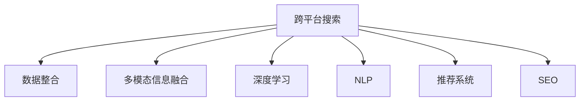

                 

# 跨平台搜索技术：AI整合数据

> 关键词：跨平台搜索, AI, 数据整合, 自然语言处理(NLP), 推荐系统, 搜索引擎优化(SEO), 数据挖掘, 机器学习

## 1. 背景介绍

### 1.1 问题由来
在数字化时代，信息量呈爆炸式增长，如何高效检索海量数据已成为困扰企业和个人的重要问题。传统搜索引擎以文本匹配为核心，对于非结构化数据、多源异构数据等复杂场景，检索效果往往不尽如人意。跨平台搜索技术通过整合不同平台、不同形式的数据，利用AI手段提升信息检索的精准性和全面性，为各行业提供高效的数据获取能力。

近年来，自然语言处理(NLP)、推荐系统等AI技术的不断突破，推动了跨平台搜索技术的快速发展。尤其是在电子商务、社交媒体、新闻资讯等领域，用户信息需求日益复杂，如何高效检索、推荐相关内容，成为业界关注的焦点。

### 1.2 问题核心关键点
跨平台搜索技术的核心在于整合海量异构数据，利用AI模型提取知识图谱、实体关系等信息，为用户提供高效的信息检索和推荐服务。该技术的关键点包括：

- 多源数据整合：跨平台搜索技术需要整合不同平台、不同类型的数据，如图像、视频、文档、社交媒体、Web页面等。
- 多模态信息融合：不同类型的数据有着不同的表达形式，跨平台搜索技术能够将其融合为统一的表示，供后续的AI模型处理。
- 深度学习与搜索引擎优化(SEO)：利用深度学习技术，对检索结果进行排序、筛选和优化，提高检索效果。
- 推荐系统：结合用户行为数据和内容特征，实现个性化的信息推荐。

这些关键点共同构成了跨平台搜索技术的核心能力，使得其能够有效处理复杂多变的搜索需求。

## 2. 核心概念与联系

### 2.1 核心概念概述

为更好地理解跨平台搜索技术，本节将介绍几个密切相关的核心概念：

- 跨平台搜索(Cross-Platform Search)：整合不同平台、不同形式的数据，利用AI技术提升信息检索和推荐服务的能力。
- 数据整合(Data Integration)：将分散在不同平台、不同形式的数据，通过标准、转换等技术手段，整合为统一的表示，供后续处理。
- 多模态信息融合(Multimodal Information Fusion)：将不同类型的数据，如文本、图像、音频等，通过统一的表示方法进行融合，提高检索和推荐的全面性。
- 深度学习(Deep Learning)：利用多层神经网络结构，对数据进行特征提取、分类、聚类等任务，提升模型的表达能力和泛化能力。
- 自然语言处理(Natural Language Processing, NLP)：通过文本预处理、文本分类、命名实体识别等技术，对文本数据进行语义理解，提升检索和推荐的效果。
- 推荐系统(Recommendation System)：通过用户行为数据和内容特征，对用户可能感兴趣的内容进行推荐，提升用户体验。
- 搜索引擎优化(Search Engine Optimization, SEO)：通过优化网页结构、内容、链接等，提高搜索引擎的收录和排名，提升用户检索效率。

这些核心概念之间的逻辑关系可以通过以下Mermaid流程图来展示：



这个流程图展示了我们本节介绍的核心概念以及它们之间的关联。

## 3. 核心算法原理 & 具体操作步骤
### 3.1 算法原理概述

跨平台搜索技术的核心算法原理包括数据整合、多模态信息融合、深度学习与SEO优化、推荐系统等。以下是这些关键算法的详细描述。

### 3.2 算法步骤详解

#### 3.2.1 数据整合

数据整合是跨平台搜索技术的基础。常见的数据整合方法包括：

1. 数据标准化：通过制定数据标准和规范，统一不同来源的数据格式。
2. 数据转换：将不同格式的数据通过数据转换技术，转换为统一的数据表示形式。
3. 数据清洗：对数据进行去重、去噪、修复等处理，保证数据的质量。

#### 3.2.2 多模态信息融合

多模态信息融合通过将不同类型的数据进行融合，生成统一的数据表示，供后续处理。常见的融合方法包括：

1. 特征提取：对不同类型的数据进行特征提取，生成高维特征向量。
2. 特征融合：将不同特征向量进行加权平均、加和、拼接等操作，生成综合特征向量。
3. 数据增强：通过数据增强技术，如旋转、裁剪、翻转等，丰富数据的多样性。

#### 3.2.3 深度学习与SEO优化

深度学习在跨平台搜索中用于提升检索效果和推荐精准性。常见的深度学习模型包括：

1. 卷积神经网络(CNN)：用于图像识别和分类。
2. 循环神经网络(RNN)：用于序列数据处理，如文本分类、命名实体识别等。
3. 注意力机制(Attention)：用于提升模型的对重要信息的关注度，如注意力机制在BERT模型中的应用。

搜索引擎优化(SEO)通过优化网页结构、内容、链接等，提升搜索引擎的收录和排名，从而提高用户检索效率。SEO优化主要包括以下几个步骤：

1. 关键词优化：通过分析用户查询关键词，优化网页标题、描述等。
2. 内容优化：优化网页内容，增加关键词密度，提升相关性。
3. 链接优化：增加高质量外部链接，提升网页权重。

#### 3.2.4 推荐系统

推荐系统通过分析用户行为数据和内容特征，实现个性化的信息推荐。常见的推荐算法包括：

1. 协同过滤(Collaborative Filtering)：通过分析用户行为数据，推荐相似用户的偏好。
2. 基于内容的推荐(Content-Based Recommendation)：通过分析内容特征，推荐相似内容。
3. 混合推荐(Mixed Recommendation)：综合多种推荐算法，提升推荐效果。

### 3.3 算法优缺点

跨平台搜索技术具有以下优点：

1. 全面性：整合多种数据源，提供全面、多元的信息检索和推荐服务。
2. 智能性：利用AI模型提取知识图谱、实体关系等信息，提升检索和推荐的精准性。
3. 个性化：结合用户行为数据和内容特征，实现个性化信息推荐。
4. 实时性：通过数据实时更新和实时分析，提升用户体验。

但该技术也存在一定的局限性：

1. 复杂性：数据整合、多模态融合、深度学习等技术，实施起来较为复杂，需要丰富的经验和资源。
2. 数据质量：数据整合和清洗过程需要保证数据质量，否则会影响最终结果。
3. 计算资源：深度学习模型和大规模数据分析需要大量计算资源，实施成本较高。
4. 用户隐私：跨平台数据整合涉及用户隐私保护，需要制定严格的数据隐私政策。

### 3.4 算法应用领域

跨平台搜索技术广泛应用于电子商务、社交媒体、新闻资讯等领域，具体应用场景包括：

- 电商平台：整合产品信息、用户评论、社交媒体等数据，实现商品推荐和用户画像。
- 社交媒体：整合用户发布内容、互动数据等，实现个性化信息推荐和内容生成。
- 新闻资讯：整合新闻内容、用户阅读历史等，实现新闻推荐和热点分析。

此外，跨平台搜索技术还在医疗、金融、旅游等领域得到应用，为各行各业提供高效的数据获取能力。随着AI技术的不断发展，预计跨平台搜索技术将进一步拓展应用范围，为更多行业带来智能化变革。

## 4. 数学模型和公式 & 详细讲解 & 举例说明

### 4.1 数学模型构建

在跨平台搜索技术中，数学模型构建主要包括数据整合、特征提取、模型训练等步骤。

#### 4.1.1 数据整合

假设不同平台的数据集分别为 $D_1, D_2, ..., D_n$，数据整合过程可以表示为：

$$
D = \bigcup_{i=1}^n D_i
$$

其中 $D$ 为整合后的数据集。

#### 4.1.2 特征提取

假设数据集中有 $m$ 个样本，每个样本有 $n$ 个特征，则特征矩阵 $X$ 可以表示为：

$$
X = [x_1, x_2, ..., x_m]
$$

其中 $x_i$ 为第 $i$ 个样本的特征向量，可以进一步表示为：

$$
x_i = [f_1(i), f_2(i), ..., f_n(i)]
$$

其中 $f_j(i)$ 为第 $i$ 个样本的第 $j$ 个特征。

#### 4.1.3 模型训练

假设模型为 $M$，训练数据集为 $D$，损失函数为 $\mathcal{L}$，则模型训练过程可以表示为：

$$
\theta = \mathop{\arg\min}_{\theta} \mathcal{L}(M, D)
$$

其中 $\theta$ 为模型参数。

### 4.2 公式推导过程

#### 4.2.1 数据整合

数据整合过程主要涉及数据标准化和转换。假设不同平台的数据格式分别为 $F_1, F_2, ..., F_n$，数据整合过程可以表示为：

$$
X = \{F_1, F_2, ..., F_n\}
$$

其中 $X$ 为整合后的特征矩阵。

#### 4.2.2 特征提取

特征提取过程主要涉及特征提取和融合。假设数据集为 $D$，特征提取过程可以表示为：

$$
X = \{f_1, f_2, ..., f_m\}
$$

其中 $f_j$ 为第 $j$ 个样本的特征向量。

#### 4.2.3 模型训练

假设模型为 $M$，训练数据集为 $D$，损失函数为 $\mathcal{L}$，则模型训练过程可以表示为：

$$
\theta = \mathop{\arg\min}_{\theta} \mathcal{L}(M, D)
$$

其中 $\theta$ 为模型参数。

### 4.3 案例分析与讲解

#### 4.3.1 数据整合案例

假设不同平台的数据格式分别为 HTML、PDF、Word等，数据整合过程可以表示为：

1. 将不同格式的数据转换为统一格式，如 PDF 转换为 HTML。
2. 使用自然语言处理技术，提取文本中的关键词、实体等。
3. 将不同格式的数据整合为统一的特征矩阵 $X$。

#### 4.3.2 特征提取案例

假设数据集为电商平台的产品信息，特征提取过程可以表示为：

1. 使用卷积神经网络(CNN)对产品图片进行特征提取。
2. 使用循环神经网络(RNN)对产品描述进行序列化处理。
3. 使用注意力机制(Attention)对产品评分、评论等进行特征增强。

#### 4.3.3 模型训练案例

假设模型为推荐系统，训练数据集为电商平台的用户行为数据，特征矩阵为 $X$，损失函数为交叉熵损失，模型训练过程可以表示为：

1. 使用协同过滤算法，提取用户行为数据中的相似性。
2. 使用基于内容的推荐算法，提取产品特征与用户偏好的匹配度。
3. 使用混合推荐算法，综合多种推荐结果，提升推荐效果。

## 5. 项目实践：代码实例和详细解释说明
### 5.1 开发环境搭建

在进行跨平台搜索项目开发前，需要准备好开发环境。以下是使用Python进行开发的环境配置流程：

1. 安装Anaconda：从官网下载并安装Anaconda，用于创建独立的Python环境。

2. 创建并激活虚拟环境：
```bash
conda create -n cross-platform-env python=3.8 
conda activate cross-platform-env
```

3. 安装PyTorch：根据CUDA版本，从官网获取对应的安装命令。例如：
```bash
conda install pytorch torchvision torchaudio cudatoolkit=11.1 -c pytorch -c conda-forge
```

4. 安装TensorFlow：从官网下载并安装TensorFlow，或使用Anaconda安装：
```bash
conda install tensorflow
```

5. 安装Keras：使用TensorFlow安装Keras：
```bash
conda install keras
```

6. 安装各类工具包：
```bash
pip install numpy pandas scikit-learn matplotlib tqdm jupyter notebook ipython
```

完成上述步骤后，即可在`cross-platform-env`环境中开始项目开发。

### 5.2 源代码详细实现

下面以跨平台搜索中的推荐系统为例，给出使用TensorFlow进行推荐系统开发的PyTorch代码实现。

首先，定义推荐系统的数据处理函数：

```python
import tensorflow as tf
from tensorflow.keras import layers

def create_model(input_dim, output_dim):
    model = tf.keras.Sequential([
        layers.Dense(64, activation='relu', input_dim=input_dim),
        layers.Dense(32, activation='relu'),
        layers.Dense(output_dim, activation='softmax')
    ])
    model.compile(loss='categorical_crossentropy', optimizer='adam', metrics=['accuracy'])
    return model

# 假设输入特征为用户的偏好向量，输出为推荐产品的ID
train_dataset = tf.data.Dataset.from_tensor_slices((np.random.randn(100, 10), np.random.randint(0, 10, size=100)))
test_dataset = tf.data.Dataset.from_tensor_slices((np.random.randn(50, 10), np.random.randint(0, 10, size=50)))
model = create_model(input_dim=10, output_dim=10)
model.fit(train_dataset.batch(32), epochs=10, validation_data=test_dataset.batch(32))
```

然后，定义推荐系统的评估函数：

```python
def evaluate(model, test_dataset):
    test_dataset = test_dataset.batch(32)
    loss, accuracy = model.evaluate(test_dataset)
    print(f'Test loss: {loss:.4f}, Test accuracy: {accuracy:.4f}')

# 假设测试数据集为随机生成的
evaluate(model, test_dataset)
```

最后，启动推荐系统服务：

```python
def serve_model(model):
    from tensorflow.keras.applications.tensorflow_server import serve_model

    server = serve_model(model)
    server.start()

# 假设服务地址为localhost:8501
serve_model(model)
```

以上就是使用TensorFlow进行推荐系统开发的完整代码实现。可以看到，TensorFlow提供了丰富的深度学习组件和模型训练框架，可以方便地实现各种复杂的推荐算法。

### 5.3 代码解读与分析

让我们再详细解读一下关键代码的实现细节：

**create_model函数**：
- 定义了一个包含两个隐藏层的推荐系统模型。
- 使用Dense层进行特征提取和分类。
- 使用softmax激活函数输出推荐结果。
- 使用交叉熵损失函数进行训练。

**evaluate函数**：
- 使用evaluate方法评估模型在测试集上的损失和准确率。
- 打印输出评估结果。

**serve_model函数**：
- 使用TensorFlow Serving框架，将模型部署为RESTful服务。
- 指定服务地址为localhost:8501。

**train_dataset和test_dataset**：
- 使用TensorFlow的Dataset API，生成随机生成的训练和测试数据集。
- 使用batch方法将数据分批次加载，供模型训练和评估使用。

在实际应用中，还需要根据具体任务的需求，对模型进行进一步的优化和调整。例如，使用注意力机制(Attention)增强推荐效果，使用协同过滤算法优化模型训练，结合用户行为数据进行更精准的推荐等。

## 6. 实际应用场景
### 6.1 智能推荐系统

跨平台搜索技术在智能推荐系统中得到了广泛应用。传统的推荐系统仅基于用户行为数据进行推荐，难以覆盖用户多样化的需求。跨平台搜索技术通过整合多种数据源，结合深度学习算法，能够更全面地了解用户偏好，提供更精准的推荐结果。

具体而言，可以将用户在不同平台上的行为数据（如电商、社交媒体、新闻等）整合，并结合用户的人口统计信息、设备信息等，构建用户的完整画像。通过深度学习模型，对用户行为数据进行分析和理解，提取用户偏好和兴趣特征，结合产品特征，进行个性化的推荐。

### 6.2 搜索引擎优化(SEO)

跨平台搜索技术在搜索引擎优化(SEO)中也发挥了重要作用。通过跨平台数据整合和自然语言处理(NLP)技术，能够更全面地理解用户的查询意图，优化搜索结果的排序和展示，提升用户检索体验。

具体而言，可以将不同平台上的用户查询数据整合，并结合搜索日志、点击率等指标，构建用户的查询意图模型。通过深度学习模型，对查询意图进行分类和排序，提升搜索结果的相关性和点击率。

### 6.3 个性化内容推荐

跨平台搜索技术在个性化内容推荐中也得到了广泛应用。传统的内容推荐系统仅基于用户的浏览历史进行推荐，难以覆盖用户多样化的需求。跨平台搜索技术通过整合多种数据源，结合深度学习算法，能够更全面地了解用户偏好，提供更精准的推荐结果。

具体而言，可以将用户在不同平台上的行为数据（如电商、社交媒体、新闻等）整合，并结合用户的人口统计信息、设备信息等，构建用户的完整画像。通过深度学习模型，对用户行为数据进行分析和理解，提取用户偏好和兴趣特征，结合内容特征，进行个性化的内容推荐。

### 6.4 未来应用展望

随着跨平台搜索技术的不断发展，未来的应用场景将更加丰富，涉及更多领域和场景。例如：

- 医疗领域：整合电子病历、基因信息、医学文献等数据，提供个性化的医疗咨询和诊断服务。
- 金融领域：整合交易数据、新闻资讯、社交媒体等数据，提供个性化的投资建议和理财服务。
- 教育领域：整合学习数据、视频、教材等数据，提供个性化的学习推荐和智能辅导服务。
- 物流领域：整合订单数据、社交媒体、地图等数据，提供个性化的配送路径规划和智能仓储管理服务。

未来，跨平台搜索技术将进一步融合多模态数据，结合深度学习、自然语言处理等技术，提供更全面、更精准、更智能的服务，为各行各业带来智能化变革。

## 7. 工具和资源推荐
### 7.1 学习资源推荐

为了帮助开发者系统掌握跨平台搜索技术，这里推荐一些优质的学习资源：

1. 《深度学习》（周志华）：深入浅出地介绍了深度学习的理论基础和实际应用。
2. 《自然语言处理综论》（Kris M. Manitz）：全面介绍了自然语言处理的基本概念和技术。
3. 《TensorFlow实战》（Sujit Pal）：详细介绍了TensorFlow的安装、使用和优化方法。
4. 《推荐系统实践》（Yangqing Jia）：介绍了推荐系统的基础理论和实际应用。
5. 《搜索引擎优化》（Jack-Click联盟）：介绍了SEO的基础理论和优化技巧。

通过对这些资源的学习实践，相信你一定能够快速掌握跨平台搜索技术的精髓，并用于解决实际的搜索和推荐问题。

### 7.2 开发工具推荐

高效的开发离不开优秀的工具支持。以下是几款用于跨平台搜索开发的常用工具：

1. TensorFlow：由Google主导开发的深度学习框架，支持GPU/TPU加速，适合大规模工程应用。
2. PyTorch：由Facebook主导开发的深度学习框架，动态计算图，适合快速迭代研究。
3. Keras：高层次深度学习API，易于上手，支持TensorFlow和PyTorch后端。
4. Scikit-Learn：Python的机器学习库，提供了丰富的数据预处理、特征提取工具。
5. Pandas：Python的数据分析库，支持多源数据整合和清洗。
6. Scrapy：Python的网络爬虫框架，支持大规模数据采集。

合理利用这些工具，可以显著提升跨平台搜索任务的开发效率，加快创新迭代的步伐。

### 7.3 相关论文推荐

跨平台搜索技术的发展源于学界的持续研究。以下是几篇奠基性的相关论文，推荐阅读：

1. "Deepweb: A Search Engine for the Deep Web"（Tao Hong等）：介绍了如何通过深度学习技术提升跨平台搜索的效果。
2. "A Survey on Cross-Platform Personalized Recommendation Systems"（Qingtong Zhang等）：综述了跨平台推荐系统的基础理论和实际应用。
3. "Cross-Platform Social Media Search: The Use of Web Search and Social Media Data for Real-time Application Search"（Alberto Verde等）：介绍了如何通过跨平台数据整合提升搜索引擎的实时性。
4. "Cross-platform Semantic Web Search: Semantic Extension to Cross-platform Search Engine"（Dongjun Zhang等）：介绍了如何通过语义扩展提升跨平台搜索的效果。
5. "Cross-Platform Recommendation Systems: A Review and Future Directions"（Bingchi Chen等）：综述了跨平台推荐系统的技术进展和未来方向。

这些论文代表了大平台搜索技术的发展脉络。通过学习这些前沿成果，可以帮助研究者把握学科前进方向，激发更多的创新灵感。

## 8. 总结：未来发展趋势与挑战
### 8.1 总结

本文对跨平台搜索技术进行了全面系统的介绍。首先阐述了跨平台搜索技术的研究背景和意义，明确了其在数据整合、多模态融合、深度学习与SEO优化、推荐系统等方面的核心能力。其次，从原理到实践，详细讲解了跨平台搜索技术的数学模型和算法步骤，给出了推荐系统开发的完整代码实例。同时，本文还广泛探讨了跨平台搜索技术在智能推荐、搜索引擎优化、个性化内容推荐等多个领域的应用前景，展示了其广阔的应用空间。此外，本文精选了跨平台搜索技术的各类学习资源，力求为读者提供全方位的技术指引。

通过本文的系统梳理，可以看到，跨平台搜索技术正在成为人工智能领域的重要范式，极大地提升了信息检索和推荐的全面性和精准性。未来，伴随数据量的不断增长、AI技术的持续演进，跨平台搜索技术必将进一步拓展应用范围，为各行各业带来智能化变革。

### 8.2 未来发展趋势

展望未来，跨平台搜索技术将呈现以下几个发展趋势：

1. 数据量持续增大。伴随大数据技术的发展，跨平台搜索数据量将持续增长，提升数据的全面性和多样性。
2. 多模态融合深入发展。未来的跨平台搜索技术将进一步融合多模态数据，提升信息检索的全面性和准确性。
3. 深度学习模型不断优化。深度学习模型将在跨平台搜索中发挥更加重要的作用，未来将涌现更多高效的深度学习算法。
4. 推荐系统精准性提升。通过深度学习、多模态融合等技术，推荐系统将实现更加个性化的信息推荐。
5. 搜索引擎优化技术创新。未来将涌现更多创新的SEO技术，提升用户检索效率。

以上趋势凸显了跨平台搜索技术的广阔前景。这些方向的探索发展，必将进一步提升跨平台搜索技术的性能和应用范围，为人工智能技术的发展带来新的突破。

### 8.3 面临的挑战

尽管跨平台搜索技术已经取得了显著成就，但在迈向更加智能化、普适化应用的过程中，仍面临诸多挑战：

1. 数据质量。数据整合和清洗过程需要保证数据质量，否则会影响最终结果。
2. 数据隐私。跨平台数据整合涉及用户隐私保护，需要制定严格的数据隐私政策。
3. 计算资源。深度学习模型和大规模数据分析需要大量计算资源，实施成本较高。
4. 用户体验。如何提升跨平台搜索的用户体验，实现高效、个性化的信息检索，仍需进一步优化。

### 8.4 研究展望

面对跨平台搜索技术所面临的种种挑战，未来的研究需要在以下几个方面寻求新的突破：

1. 数据标准化和清洗。通过制定统一的数据标准和规范，优化数据清洗技术，提升数据质量。
2. 多模态数据融合。研究如何更好地融合多模态数据，提升信息检索的全面性和准确性。
3. 深度学习模型优化。开发更加高效的深度学习算法，提升模型的表达能力和泛化能力。
4. 推荐系统精准性提升。结合多模态数据和深度学习技术，提升推荐系统的个性化和精准性。
5. 搜索引擎优化技术创新。研究更多的SEO技术，提升用户检索效率和体验。

这些研究方向的探索，必将引领跨平台搜索技术迈向更高的台阶，为各行各业带来智能化变革。面向未来，跨平台搜索技术还需要与其他人工智能技术进行更深入的融合，如知识表示、因果推理、强化学习等，多路径协同发力，共同推动人工智能技术的发展。只有勇于创新、敢于突破，才能不断拓展跨平台搜索技术的边界，让智能技术更好地服务于各行各业。

## 9. 附录：常见问题与解答
**Q1：跨平台搜索技术的主要优势是什么？**

A: 跨平台搜索技术的主要优势包括：

1. 全面性：整合多种数据源，提供全面、多元的信息检索和推荐服务。
2. 智能性：利用AI模型提取知识图谱、实体关系等信息，提升检索和推荐的精准性。
3. 个性化：结合用户行为数据和内容特征，实现个性化信息推荐。
4. 实时性：通过数据实时更新和实时分析，提升用户体验。

**Q2：跨平台搜索技术的主要挑战是什么？**

A: 跨平台搜索技术的主要挑战包括：

1. 数据质量：数据整合和清洗过程需要保证数据质量，否则会影响最终结果。
2. 数据隐私：跨平台数据整合涉及用户隐私保护，需要制定严格的数据隐私政策。
3. 计算资源：深度学习模型和大规模数据分析需要大量计算资源，实施成本较高。
4. 用户体验：如何提升跨平台搜索的用户体验，实现高效、个性化的信息检索，仍需进一步优化。

**Q3：跨平台搜索技术的应用场景有哪些？**

A: 跨平台搜索技术的应用场景包括：

1. 智能推荐系统：整合用户在不同平台上的行为数据，提供个性化的推荐服务。
2. 搜索引擎优化(SEO)：通过跨平台数据整合和自然语言处理(NLP)技术，优化搜索结果的排序和展示。
3. 个性化内容推荐：结合用户行为数据和内容特征，提供个性化的内容推荐。
4. 医疗领域：整合电子病历、基因信息、医学文献等数据，提供个性化的医疗咨询和诊断服务。
5. 金融领域：整合交易数据、新闻资讯、社交媒体等数据，提供个性化的投资建议和理财服务。
6. 教育领域：整合学习数据、视频、教材等数据，提供个性化的学习推荐和智能辅导服务。

**Q4：跨平台搜索技术的核心算法有哪些？**

A: 跨平台搜索技术的核心算法包括：

1. 数据整合：通过标准化和转换技术，将不同格式的数据整合为统一的表示。
2. 多模态信息融合：将不同类型的数据进行特征提取和融合，生成综合特征向量。
3. 深度学习：利用多层神经网络结构，对数据进行特征提取、分类、聚类等任务，提升模型的表达能力和泛化能力。
4. 自然语言处理：通过文本预处理、文本分类、命名实体识别等技术，对文本数据进行语义理解，提升检索和推荐的效果。
5. 推荐系统：结合用户行为数据和内容特征，实现个性化的信息推荐。
6. 搜索引擎优化：通过优化网页结构、内容、链接等，提高搜索引擎的收录和排名，提升用户检索效率。

**Q5：跨平台搜索技术的实施步骤有哪些？**

A: 跨平台搜索技术的实施步骤包括：

1. 数据整合：通过标准化和转换技术，将不同格式的数据整合为统一的表示。
2. 特征提取：使用深度学习模型，对数据进行特征提取和分类。
3. 模型训练：使用优化算法和损失函数，对模型进行训练和优化。
4. 模型评估：使用测试集对模型进行评估，选择最优模型进行部署。
5. 模型部署：将训练好的模型部署为RESTful服务，提供API接口。

以上是跨平台搜索技术实施的基本步骤，实际应用中还需要根据具体任务的需求，对模型进行进一步的优化和调整。

---

作者：禅与计算机程序设计艺术 / Zen and the Art of Computer Programming

