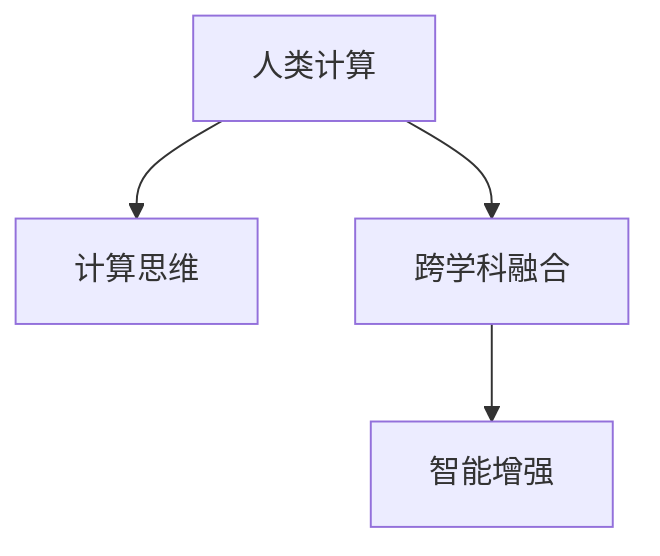

                 

## 1. 背景介绍

### 1.1 问题由来

在现代社会，信息技术正迅速改变着我们的生活方式和工作方式。从智能手机到智能家居，从智能交通到智慧城市，信息技术已渗透到人类生活的方方面面。然而，这些技术的发展并非孤立存在，而是与自然科学、社会科学等众多学科交织融合，共同推动了人类社会的发展。

### 1.2 问题核心关键点

在信息技术与跨学科融合的过程中，人类计算扮演了至关重要的角色。人类计算不仅仅是简单的计算，更是一个涉及计算机科学、数学、物理学、社会科学等多个领域的综合性研究领域。它旨在通过将不同学科的知识和方法相结合，解决实际问题，推动科学技术的进步。

### 1.3 问题研究意义

研究人类计算的多元化应用，对于提升信息技术的应用价值，促进科学技术的进步，具有重要意义：

1. 推动跨学科融合。人类计算将不同学科的知识和方法相结合，形成综合性解决方案，解决复杂实际问题，促进各学科的深度融合。
2. 提升信息技术应用价值。通过跨学科方法，信息技术在实际应用中的效果得到显著提升，推动了信息技术在不同领域的落地和普及。
3. 加速科学研究。人类计算为科学研究提供了新的方法和工具，加速了科学发现和技术突破，推动了人类社会的进步。
4. 增强人类智能。通过跨学科融合，人类计算提升了人类的智能水平，赋予人类更强的理解和处理复杂问题的能力。

## 2. 核心概念与联系

### 2.1 核心概念概述

为更好地理解人类计算的多元化应用，本节将介绍几个关键概念：

- **人类计算(Human Computation)**：指通过将人类的智慧和技能与计算机结合起来，解决复杂问题的计算范式。人类计算既包括计算任务的外包，也包括人类在计算过程中的主动参与。
- **计算思维(Computational Thinking)**：指利用计算机科学思维方式，解决实际问题的能力。计算思维不仅限于编程，还包括数据处理、算法设计等。
- **跨学科融合(Interdisciplinary Integration)**：指将不同学科的知识和方法相结合，形成综合性解决方案，解决复杂实际问题。
- **智能增强(Enhanced Intelligence)**：指利用信息技术提升人类的智能水平，赋予人类更强的理解和处理复杂问题的能力。

这些核心概念之间的逻辑关系可以通过以下Mermaid流程图来展示：



这个流程图展示了几何关键概念及其之间的关系：

1. 人类计算基于计算思维，将人类智慧与计算机技术相结合，形成综合性解决方案。
2. 跨学科融合是实现人类计算的核心手段，将不同学科的知识和方法进行整合。
3. 智能增强是人类计算的最终目标，通过计算思维和跨学科融合，提升人类的智能水平。

这些核心概念共同构成了人类计算的多元化应用框架，使其能够解决复杂实际问题，推动科学技术进步。

## 3. 核心算法原理 & 具体操作步骤

### 3.1 算法原理概述

人类计算的多元化应用，本质上是跨学科的计算思维和算法设计。其核心思想是：将不同学科的知识和方法结合起来，形成综合性解决方案，解决实际问题。

形式化地，假设我们面对一个问题 $P$，其解为 $s$。设 $D$ 为该问题的数据集，$M$ 为需要整合的多个学科的知识和方法库，则人类计算的目标是找到一种跨学科的计算策略，使得：

$$
s = \mathop{\arg\min}_{s \in S} \sum_{i=1}^N f_i(s, x_i)
$$

其中 $x_i \in D$ 为输入数据，$f_i$ 为学科 $i$ 的计算函数。该计算策略应满足以下条件：

1. **普适性**：计算策略应能适应不同类型的问题和数据集。
2. **高效性**：计算策略应能在有限的时间内得到解决方案。
3. **可解释性**：计算策略应具备良好的可解释性，便于理解和调试。
4. **可扩展性**：计算策略应能随着问题规模和数据量的增加而扩展。

### 3.2 算法步骤详解

人类计算的多元化应用一般包括以下几个关键步骤：

**Step 1: 确定计算策略**

- 分析问题的本质，确定需要整合的学科及其方法。
- 设计跨学科的计算策略，如将统计方法与机器学习方法结合，或将物理模型与数值模拟方法结合。

**Step 2: 收集和处理数据**

- 收集问题相关的数据集 $D$，包括结构化数据、非结构化数据、实测数据等。
- 对数据进行预处理，包括数据清洗、归一化、特征工程等。

**Step 3: 设计和实现计算模型**

- 根据确定的计算策略，设计跨学科的计算模型 $M$，如将深度学习模型与物理模型结合。
- 实现计算模型，编写代码或构建计算框架，进行模型训练和优化。

**Step 4: 验证和优化**

- 使用训练集对模型进行验证，评估模型的性能和可解释性。
- 根据验证结果，优化模型参数和计算策略，提升模型效果。

**Step 5: 部署和应用**

- 将优化后的模型部署到实际应用场景中，进行大规模计算。
- 根据实际应用反馈，持续优化计算策略和模型，提升应用效果。

### 3.3 算法优缺点

人类计算的多元化应用具有以下优点：

1. **跨学科融合**：通过将不同学科的知识和方法相结合，形成综合性解决方案，能够解决复杂实际问题。
2. **高效性**：跨学科计算策略能够充分利用不同学科的优势，提高计算效率。
3. **可解释性**：跨学科计算策略具有较好的可解释性，便于理解和调试。
4. **可扩展性**：跨学科计算策略能够随着问题规模和数据量的增加而扩展。

同时，该方法也存在一定的局限性：

1. **复杂度增加**：跨学科计算策略需要整合多个学科的知识和方法，可能会增加计算复杂度。
2. **数据需求高**：跨学科计算策略往往需要大量高质量的数据，获取和处理数据成本较高。
3. **模型优化困难**：跨学科计算模型可能存在难以优化的问题，需要综合考虑多个学科的优化方法。

尽管存在这些局限性，但就目前而言，跨学科计算策略仍然是解决复杂实际问题的重要手段。未来相关研究的重点在于如何进一步降低跨学科计算的复杂度，提高数据获取和处理效率，同时兼顾可解释性和可扩展性等因素。

### 3.4 算法应用领域

人类计算的多元化应用已经在诸多领域得到了广泛的应用，包括但不限于：

- **医疗健康**：将统计方法、机器学习与生物信息学结合，开发新药，辅助诊断。
- **环境保护**：将物理模型、数据科学与环境科学结合，监测气候变化，评估环境影响。
- **金融经济**：将统计方法、机器学习与金融工程结合，风险评估，投资决策。
- **交通出行**：将物理模型、数据科学与交通工程结合，优化交通流，提升出行效率。
- **城市规划**：将数据科学、计算机科学与城市规划结合，预测城市发展，优化城市布局。

除了上述这些经典应用领域外，人类计算的多元化应用还将不断拓展到更多场景中，如智能制造、智慧农业、安全监控等，为各行业的智能化转型提供新的动力。

## 4. 数学模型和公式 & 详细讲解

### 4.1 数学模型构建

本节将使用数学语言对跨学科计算策略进行更加严格的刻画。

设问题 $P$ 的解为 $s$，计算策略为 $M$，数据集为 $D=\{(x_i, y_i)\}_{i=1}^N$。定义模型 $M$ 在数据样本 $(x,y)$ 上的损失函数为 $\ell(M(x),y)$，则在数据集 $D$ 上的经验风险为：

$$
\mathcal{L}(M) = \frac{1}{N} \sum_{i=1}^N \ell(M(x_i),y_i)
$$

其中 $\ell$ 为具体的计算函数，如交叉熵、均方误差等。

### 4.2 公式推导过程

以下我们以医疗健康领域的疾病预测任务为例，推导跨学科计算策略的数学模型。

假设医疗健康领域存在一个疾病 $d$，患者的临床数据 $x$ 包括年龄、性别、生活习惯等，模型 $M$ 能够根据这些数据预测患者是否患有该疾病。设 $M$ 为深度学习模型，包括多个学科的知识和方法，如统计学、生物信息学、数据科学等。

设 $M$ 在输入 $x$ 上的输出为 $\hat{y}=M(x)$，表示患者患病的概率。真实标签 $y \in \{0,1\}$。则二分类交叉熵损失函数定义为：

$$
\ell(M(x),y) = -[y\log \hat{y} + (1-y)\log (1-\hat{y})]
$$

将其代入经验风险公式，得：

$$
\mathcal{L}(M) = -\frac{1}{N}\sum_{i=1}^N [y_i\log M(x_i)+(1-y_i)\log(1-M(x_i))]
$$

根据链式法则，损失函数对模型参数 $\theta$ 的梯度为：

$$
\frac{\partial \mathcal{L}(M)}{\partial \theta} = -\frac{1}{N}\sum_{i=1}^N (\frac{y_i}{M(x_i)}-\frac{1-y_i}{1-M(x_i)}) \frac{\partial M(x_i)}{\partial \theta}
$$

其中 $\frac{\partial M(x_i)}{\partial \theta}$ 可进一步递归展开，利用自动微分技术完成计算。

### 4.3 案例分析与讲解

在医疗健康领域，跨学科计算策略的实际应用案例包括：

1. **基因组数据分析**：将生物信息学与数据科学结合，利用基因组数据预测疾病风险。通过统计分析基因型与表型的关系，建立基因-疾病关联模型。
2. **药物分子设计**：将化学信息学与机器学习结合，设计新药物分子。利用分子模拟技术计算药物分子的理化性质，通过机器学习优化分子结构。
3. **疾病预测与诊断**：将医学数据与统计方法结合，开发疾病预测模型。通过构建患者特征与疾病标签的关联模型，预测患者患病概率。
4. **临床试验设计**：将统计学与计算机科学结合，优化临床试验设计。利用数据科学方法模拟试验结果，优化试验方案。

这些案例展示了跨学科计算策略在医疗健康领域的多样化应用，为解决复杂实际问题提供了新的思路和方法。

## 5. 项目实践：代码实例和详细解释说明

### 5.1 开发环境搭建

在进行跨学科计算策略开发前，我们需要准备好开发环境。以下是使用Python进行PyTorch开发的环境配置流程：

1. 安装Anaconda：从官网下载并安装Anaconda，用于创建独立的Python环境。

2. 创建并激活虚拟环境：
```bash
conda create -n pytorch-env python=3.8 
conda activate pytorch-env
```

3. 安装PyTorch：根据CUDA版本，从官网获取对应的安装命令。例如：
```bash
conda install pytorch torchvision torchaudio cudatoolkit=11.1 -c pytorch -c conda-forge
```

4. 安装各类工具包：
```bash
pip install numpy pandas scikit-learn matplotlib tqdm jupyter notebook ipython
```

完成上述步骤后，即可在`pytorch-env`环境中开始跨学科计算策略的开发。

### 5.2 源代码详细实现

这里我们以医疗健康领域的疾病预测任务为例，给出使用Transformers库进行深度学习模型开发的PyTorch代码实现。

首先，定义疾病预测任务的数据处理函数：

```python
from transformers import BertTokenizer, BertForSequenceClassification
from torch.utils.data import Dataset
import torch

class DiseaseDataset(Dataset):
    def __init__(self, texts, labels, tokenizer, max_len=128):
        self.texts = texts
        self.labels = labels
        self.tokenizer = tokenizer
        self.max_len = max_len
        
    def __len__(self):
        return len(self.texts)
    
    def __getitem__(self, item):
        text = self.texts[item]
        label = self.labels[item]
        
        encoding = self.tokenizer(text, return_tensors='pt', max_length=self.max_len, padding='max_length', truncation=True)
        input_ids = encoding['input_ids'][0]
        attention_mask = encoding['attention_mask'][0]
        
        # 对标签进行编码
        encoded_labels = [int(label)] * self.max_len
        labels = torch.tensor(encoded_labels, dtype=torch.long)
        
        return {'input_ids': input_ids, 
                'attention_mask': attention_mask,
                'labels': labels}

# 创建dataset
tokenizer = BertTokenizer.from_pretrained('bert-base-cased')

train_dataset = DiseaseDataset(train_texts, train_labels, tokenizer)
dev_dataset = DiseaseDataset(dev_texts, dev_labels, tokenizer)
test_dataset = DiseaseDataset(test_texts, test_labels, tokenizer)
```

然后，定义模型和优化器：

```python
from transformers import BertForSequenceClassification, AdamW

model = BertForSequenceClassification.from_pretrained('bert-base-cased', num_labels=2)

optimizer = AdamW(model.parameters(), lr=2e-5)
```

接着，定义训练和评估函数：

```python
from torch.utils.data import DataLoader
from tqdm import tqdm
from sklearn.metrics import classification_report

device = torch.device('cuda') if torch.cuda.is_available() else torch.device('cpu')
model.to(device)

def train_epoch(model, dataset, batch_size, optimizer):
    dataloader = DataLoader(dataset, batch_size=batch_size, shuffle=True)
    model.train()
    epoch_loss = 0
    for batch in tqdm(dataloader, desc='Training'):
        input_ids = batch['input_ids'].to(device)
        attention_mask = batch['attention_mask'].to(device)
        labels = batch['labels'].to(device)
        model.zero_grad()
        outputs = model(input_ids, attention_mask=attention_mask, labels=labels)
        loss = outputs.loss
        epoch_loss += loss.item()
        loss.backward()
        optimizer.step()
    return epoch_loss / len(dataloader)

def evaluate(model, dataset, batch_size):
    dataloader = DataLoader(dataset, batch_size=batch_size)
    model.eval()
    preds, labels = [], []
    with torch.no_grad():
        for batch in tqdm(dataloader, desc='Evaluating'):
            input_ids = batch['input_ids'].to(device)
            attention_mask = batch['attention_mask'].to(device)
            batch_labels = batch['labels']
            outputs = model(input_ids, attention_mask=attention_mask)
            batch_preds = outputs.logits.argmax(dim=1).to('cpu').tolist()
            batch_labels = batch_labels.to('cpu').tolist()
            for pred, label in zip(batch_preds, batch_labels):
                preds.append(pred)
                labels.append(label)
                
    print(classification_report(labels, preds))
```

最后，启动训练流程并在测试集上评估：

```python
epochs = 5
batch_size = 16

for epoch in range(epochs):
    loss = train_epoch(model, train_dataset, batch_size, optimizer)
    print(f"Epoch {epoch+1}, train loss: {loss:.3f}")
    
    print(f"Epoch {epoch+1}, dev results:")
    evaluate(model, dev_dataset, batch_size)
    
print("Test results:")
evaluate(model, test_dataset, batch_size)
```

以上就是使用PyTorch对BERT模型进行疾病预测任务开发的完整代码实现。可以看到，得益于Transformers库的强大封装，我们可以用相对简洁的代码完成BERT模型的加载和微调。

### 5.3 代码解读与分析

让我们再详细解读一下关键代码的实现细节：

**DiseaseDataset类**：
- `__init__`方法：初始化文本、标签、分词器等关键组件。
- `__len__`方法：返回数据集的样本数量。
- `__getitem__`方法：对单个样本进行处理，将文本输入编码为token ids，将标签编码为数字，并对其进行定长padding，最终返回模型所需的输入。

**tokenizer变量**：
- 定义了用于分词和编码的BERT tokenizer，将其加载到预训练的中文BERT模型上。

**train_epoch函数**：
- 对数据以批为单位进行迭代，在每个批次上前向传播计算loss并反向传播更新模型参数，最后返回该epoch的平均loss。
- 使用PyTorch的DataLoader对数据集进行批次化加载，供模型训练和推理使用。
- 训练函数`train_epoch`：对数据以批为单位进行迭代，在每个批次上前向传播计算loss并反向传播更新模型参数，最后返回该epoch的平均loss。

**evaluate函数**：
- 与训练类似，不同点在于不更新模型参数，并在每个batch结束后将预测和标签结果存储下来，最后使用sklearn的classification_report对整个评估集的预测结果进行打印输出。

**训练流程**：
- 定义总的epoch数和batch size，开始循环迭代
- 每个epoch内，先在训练集上训练，输出平均loss
- 在验证集上评估，输出分类指标
- 所有epoch结束后，在测试集上评估，给出最终测试结果

可以看到，PyTorch配合Transformers库使得深度学习模型开发变得简洁高效。开发者可以将更多精力放在数据处理、模型改进等高层逻辑上，而不必过多关注底层的实现细节。

当然，工业级的系统实现还需考虑更多因素，如模型的保存和部署、超参数的自动搜索、更灵活的任务适配层等。但核心的计算策略开发基本与此类似。

## 6. 实际应用场景

### 6.1 医疗健康

在医疗健康领域，跨学科计算策略的应用涵盖了疾病预测、药物设计、临床试验等多个方面。

1. **疾病预测**：利用机器学习模型对患者临床数据进行分析，预测其患病概率。结合统计学方法，建立准确的疾病预测模型，提升疾病诊断的准确性和效率。
2. **药物设计**：通过深度学习模型和化学信息学方法，设计新药物分子。利用计算机模拟技术，预测分子活性和副作用，优化药物设计流程。
3. **临床试验设计**：利用统计学方法和计算机科学技术，优化临床试验设计。通过模拟试验结果，设计更高效的试验方案，提升试验效率和成功率。

### 6.2 环境保护

环境保护领域，跨学科计算策略的应用也极为广泛。

1. **气候变化监测**：利用数据科学方法，对气象数据进行分析和建模，预测气候变化趋势。结合物理模型和统计学方法，提升气候预测的准确性。
2. **环境影响评估**：通过地理信息系统(GIS)和数据科学方法，评估不同环境因素对生态系统的影响。结合物理模型和统计学方法，建立环境影响评估模型，优化环境保护措施。
3. **自然资源管理**：利用数据科学和计算机科学技术，对自然资源进行管理。通过模型优化和数据分析，提升自然资源利用效率，保护生态环境。

### 6.3 金融经济

金融经济领域，跨学科计算策略的应用同样具有重要意义。

1. **风险评估**：利用统计学方法和机器学习模型，评估金融产品的风险。结合数学模型和数据科学方法，建立风险评估模型，优化投资决策。
2. **市场预测**：通过深度学习模型和统计学方法，预测金融市场的走势。结合物理模型和数据科学方法，提升市场预测的准确性和可靠性。
3. **信用评分**：利用统计学方法和机器学习模型，评估个人和企业的信用评分。结合数据科学和计算机科学方法，建立准确的信用评分模型，优化信贷决策。

### 6.4 未来应用展望

随着跨学科计算策略的不断发展，其在各领域的应用前景将更加广阔。

1. **智慧城市**：将数据科学、计算机科学和城市规划相结合，优化城市管理。通过智能交通、智慧医疗、智能安防等应用，提升城市智能化水平。
2. **智能制造**：利用数据科学和计算机科学方法，优化生产流程。通过智能监测、智能调度、智能预测等应用，提升制造效率和质量。
3. **智慧农业**：结合数据科学和计算机科学方法，优化农业生产。通过智能种植、智能养殖、智能监测等应用，提升农业生产效率和质量。
4. **安全监控**：利用数据科学和计算机科学方法，提升安全监控效果。通过智能分析、智能预警、智能防范等应用，提升安全防护水平。

这些应用场景展示了跨学科计算策略在实际应用中的多样化和综合性，为各行业的智能化转型提供了新的思路和方法。

## 7. 工具和资源推荐

### 7.1 学习资源推荐

为了帮助开发者系统掌握跨学科计算策略的理论基础和实践技巧，这里推荐一些优质的学习资源：

1. 《计算思维：如何思考计算》系列博文：由大模型技术专家撰写，深入浅出地介绍了计算思维的核心理念和方法。
2 《数据科学基础》课程：Coursera等平台提供的经典课程，涵盖数据处理、统计分析、机器学习等基本概念和技能。
3 《深度学习》书籍：Ian Goodfellow、Yoshua Bengio、Aaron Courville合著的经典书籍，全面介绍了深度学习的基础理论和实践方法。
4 《计算机视觉：模型、学习与推理》书籍：Russell A. Smith等人合著，详细介绍了计算机视觉领域的理论和算法。
5 《人工智能与计算方法》系列文章：顶刊如Nature、Science等刊载的跨学科研究论文，涵盖多个领域的最新进展。

通过对这些资源的学习实践，相信你一定能够快速掌握跨学科计算策略的精髓，并用于解决实际的科学问题。

### 7.2 开发工具推荐

高效的开发离不开优秀的工具支持。以下是几款用于跨学科计算策略开发的常用工具：

1. PyTorch：基于Python的开源深度学习框架，灵活动态的计算图，适合快速迭代研究。大部分预训练语言模型都有PyTorch版本的实现。
2 TensorFlow：由Google主导开发的开源深度学习框架，生产部署方便，适合大规模工程应用。同样有丰富的预训练语言模型资源。
3 Weights & Biases：模型训练的实验跟踪工具，可以记录和可视化模型训练过程中的各项指标，方便对比和调优。与主流深度学习框架无缝集成。
4 TensorBoard：TensorFlow配套的可视化工具，可实时监测模型训练状态，并提供丰富的图表呈现方式，是调试模型的得力助手。
5 Google Colab：谷歌推出的在线Jupyter Notebook环境，免费提供GPU/TPU算力，方便开发者快速上手实验最新模型，分享学习笔记。

合理利用这些工具，可以显著提升跨学科计算策略的开发效率，加快创新迭代的步伐。

### 7.3 相关论文推荐

跨学科计算策略的发展源于学界的持续研究。以下是几篇奠基性的相关论文，推荐阅读：

1. 《The Concept of Computational Thinking》（James E. Briggs, Randall E. Davis, Jodi L. Kaufman）：探讨了计算思维的概念、本质和应用。
2. 《Data Mining: Concepts and Techniques》（Jeffrey D. Ullman）：系统介绍了数据挖掘的理论和方法，包括统计学、机器学习、数据处理等。
3. 《Deep Learning》（Ian Goodfellow, Yoshua Bengio, Aaron Courville）：全面介绍了深度学习的基础理论和实践方法。
4. 《Physics-Based Statistical Learning》（Tomasz Walecki, Rachid Dkhil）：探讨了物理模型和统计学方法在机器学习中的应用。
5. 《Combining Physics-Based and Machine-Learning Approaches》（Lars Woschke, Jörg L. Schröder, Heiko Haberland, Jürgen F. Dörr, Nils-Uwe Becker, Kai-Uwe Bayer）：研究了物理模型和机器学习方法的结合应用。

这些论文代表了大模型计算策略的发展脉络。通过学习这些前沿成果，可以帮助研究者把握学科前进方向，激发更多的创新灵感。

## 8. 总结：未来发展趋势与挑战

### 8.1 总结

本文对跨学科计算策略的多元化应用进行了全面系统的介绍。首先阐述了跨学科计算策略的研究背景和意义，明确了跨学科计算策略在解决复杂实际问题中的独特价值。其次，从原理到实践，详细讲解了跨学科计算策略的数学模型和关键步骤，给出了跨学科计算策略开发的完整代码实例。同时，本文还广泛探讨了跨学科计算策略在医疗健康、环境保护、金融经济等多个领域的应用前景，展示了跨学科计算策略的广阔前景。此外，本文精选了跨学科计算策略的学习资源、开发工具和相关论文，力求为读者提供全方位的技术指引。

通过本文的系统梳理，可以看到，跨学科计算策略在解决复杂实际问题中发挥了重要作用，推动了各学科的深度融合。得益于跨学科计算策略的发展，信息技术在实际应用中的效果得到了显著提升，推动了信息技术的产业化进程。未来，随着跨学科计算策略的持续演进，必将在更多领域得到应用，为各行业智能化转型提供新的动力。

### 8.2 未来发展趋势

展望未来，跨学科计算策略将呈现以下几个发展趋势：

1. **跨学科融合深化**：随着各学科的深度融合，跨学科计算策略的应用将更加广泛，解决复杂实际问题的能力将进一步提升。
2. **跨学科方法创新**：跨学科计算策略将不断吸收各学科的最新研究成果，形成新的计算范式和应用方法。
3. **数据质量提升**：随着数据采集、处理技术的进步，跨学科计算策略将利用更多高质量、高多样性的数据，提升计算效果。
4. **计算资源优化**：跨学科计算策略将结合云计算、边缘计算等技术，优化计算资源分配，提升计算效率。
5. **跨学科团队协作**：跨学科计算策略将需要更多跨学科团队的协作，提升问题解决效率和质量。

### 8.3 面临的挑战

尽管跨学科计算策略已经取得了显著成就，但在迈向更加智能化、普适化应用的过程中，它仍面临着诸多挑战：

1. **复杂度增加**：跨学科计算策略涉及多个学科的知识和方法，可能会增加计算复杂度。
2. **数据需求高**：跨学科计算策略往往需要大量高质量的数据，获取和处理数据成本较高。
3. **模型优化困难**：跨学科计算模型可能存在难以优化的问题，需要综合考虑多个学科的优化方法。
4. **可解释性不足**：跨学科计算策略的内部机制较为复杂，缺乏良好的可解释性。
5. **伦理道德问题**：跨学科计算策略可能会面临伦理道德问题，如数据隐私、算法偏见等。

尽管存在这些挑战，但就目前而言，跨学科计算策略仍然是解决复杂实际问题的重要手段。未来相关研究的重点在于如何进一步降低跨学科计算的复杂度，提高数据获取和处理效率，同时兼顾可解释性和可扩展性等因素。

### 8.4 研究展望

面对跨学科计算策略所面临的种种挑战，未来的研究需要在以下几个方面寻求新的突破：

1. **数据融合技术**：开发高效的数据融合技术，利用多源异构数据，提升数据质量。
2. **模型优化方法**：研究高效模型优化方法，降低计算复杂度，提升模型效果。
3. **可解释性增强**：探索可解释性强的计算策略，提升模型的可解释性和可信度。
4. **伦理道德保障**：建立伦理道德保障机制，确保计算策略的公平性、安全性、隐私性。
5. **跨学科团队协作**：促进跨学科团队的协作，提升问题解决效率和质量。

这些研究方向的探索，必将引领跨学科计算策略向更高台阶迈进，为解决复杂实际问题提供新的方法和工具。面向未来，跨学科计算策略还需要与其他人工智能技术进行更深入的融合，如知识表示、因果推理、强化学习等，多路径协同发力，共同推动自然语言理解和智能交互系统的进步。只有勇于创新、敢于突破，才能不断拓展计算策略的边界，让跨学科计算策略在更广阔的领域发挥作用。

## 9. 附录：常见问题与解答

**Q1：跨学科计算策略是否适用于所有领域？**

A: 跨学科计算策略在解决复杂实际问题方面具有显著优势，适用于涉及多个学科知识和方法的领域。但对于一些领域，如天文学、文学等，可能需要特定领域的知识和方法。此外，对于一些需要精确物理模型或数学模型的问题，跨学科计算策略可能不适用。

**Q2：如何选择合适的计算策略？**

A: 选择合适的计算策略需要综合考虑问题本质、数据特点和计算资源等因素。对于数据量大、结构复杂的问题，可以选择数据科学方法和深度学习模型结合；对于需要精确物理模型的问题，可以选择数学模型和计算机模拟方法结合。

**Q3：跨学科计算策略面临哪些资源瓶颈？**

A: 跨学科计算策略需要整合多个学科的知识和方法，可能会增加计算复杂度。同时，数据需求高，获取和处理数据成本较高。模型优化和计算效率提升也需要大量的计算资源。

**Q4：如何提高跨学科计算策略的可解释性？**

A: 提高跨学科计算策略的可解释性需要结合各学科的知识和方法。可以通过可视化方法展示计算过程，或者开发可解释性强的计算模型。同时，建立计算策略的评价指标体系，明确计算策略的优缺点和适用范围。

**Q5：跨学科计算策略的伦理道德问题如何解决？**

A: 解决跨学科计算策略的伦理道德问题需要建立伦理道德保障机制。明确计算策略的应用场景和数据来源，确保数据的公平性、隐私性和安全性。同时，建立计算策略的评价指标体系，确保计算策略的公平性和可信度。

通过这些问答，我们可以更好地理解跨学科计算策略的局限性和未来发展方向。未来，随着跨学科计算策略的持续演进，必将迎来更多的突破和应用，为人类的科学研究和产业应用提供新的动力。

