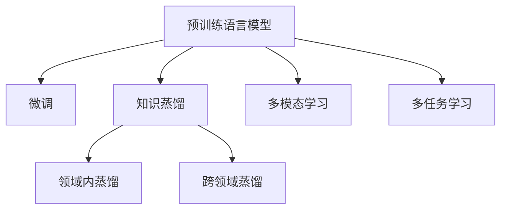

                 

# 跨领域知识蒸馏：突破单一任务的局限

## 1. 背景介绍

### 1.1 问题由来

在当今信息爆炸的时代，知识获取渠道日渐多样化，但不同来源的知识具有独特的表达方式和领域特性。如何有效整合和利用跨领域知识，成为一个关键的技术挑战。以自然语言处理（NLP）为例，预训练语言模型（Large Language Model, LLM）虽然在其自身的领域内表现出强大的泛化能力，但面对不同领域的特定任务时，往往难以有效应对。因此，跨领域知识蒸馏（Knowledge Distillation, KD）技术应运而生，通过将单一任务的知识提炼并迁移到另一领域，来突破预训练语言模型的局限，增强其在特定领域下的性能。

### 1.2 问题核心关键点

跨领域知识蒸馏的核心思想是，将一个领域的高性能模型（teacher）的知识蒸馏到另一个领域的低性能模型（student）上，以提升其在特定任务上的表现。这种技术通常分为两类：领域内蒸馏和跨领域蒸馏。领域内蒸馏指的是在一个特定领域内部，将复杂模型蒸馏到简单模型上，以提升模型效率；跨领域蒸馏则是指将某个领域的知识迁移到另一个领域，解决特定领域的任务。本文主要探讨跨领域知识蒸馏在自然语言处理中的应用。

跨领域知识蒸馏的关键在于教师和学生模型的设计。教师模型应具备较强的泛化能力，学生模型则应具有较好的迁移学习能力。此外，如何高效地将教师的知识迁移到学生模型中，也是一个重要的研究方向。

## 2. 核心概念与联系

### 2.1 核心概念概述

为更好地理解跨领域知识蒸馏技术，本节将介绍几个密切相关的核心概念：

- 知识蒸馏（Knowledge Distillation, KD）：通过教师模型对学生模型的指导，提升学生模型的性能。通常教师模型是较为复杂的深度神经网络，学生模型是简单的线性模型或非深度学习模型。
- 预训练语言模型（Large Language Model, LLM）：如BERT、GPT等，通过大规模无标签文本数据进行预训练，学习通用的语言表示。
- 微调（Fine-Tuning）：通过下游任务的少量标注数据，对预训练语言模型进行优化，以适应特定任务。
- 跨领域知识蒸馏：将一个领域的知识迁移到另一个领域，以提升特定领域模型的性能。
- 多模态学习（Multimodal Learning）：将多种数据源（如文本、图像、语音等）结合，以提升模型的理解能力。
- 多任务学习（Multi-task Learning）：通过同时训练多个相关任务，共享模型参数，提升模型在多个任务上的性能。

这些核心概念之间的逻辑关系可以通过以下Mermaid流程图来展示：



这个流程图展示了预训练语言模型与其他核心概念的联系：

1. 预训练语言模型通过预训练获得通用语言表示。
2. 微调过程将模型适配到特定任务。
3. 知识蒸馏将一个模型的知识迁移到另一个模型上。
4. 领域内蒸馏和跨领域蒸馏是知识蒸馏的两种形式。
5. 多模态学习和多任务学习扩展了模型的数据源和任务种类，提升了模型的理解能力和泛化能力。

## 3. 核心算法原理 & 具体操作步骤
### 3.1 算法原理概述

跨领域知识蒸馏的过程分为两个步骤：首先训练一个高性能的教师模型，然后通过蒸馏过程，将其知识迁移到学生模型上。具体步骤如下：

1. **训练教师模型**：选择适合特定领域的预训练语言模型，并使用该领域的大量标注数据进行微调，以获得高性能的教师模型。
2. **蒸馏知识到学生模型**：设计一个简单的学生模型，使用教师模型对学生模型进行指导，以提高其在特定领域下的性能。

### 3.2 算法步骤详解

以下是跨领域知识蒸馏的详细步骤：

**Step 1: 准备教师和学生模型**
- 选择适合特定领域的预训练语言模型作为教师模型。
- 设计一个简单或浅层的神经网络作为学生模型。

**Step 2: 训练教师模型**
- 收集该领域的标注数据集，将数据划分为训练集、验证集和测试集。
- 使用微调方法对教师模型进行训练，使其能够高效地完成特定领域的任务。

**Step 3: 设计蒸馏任务**
- 定义蒸馏任务，通常使用分类或生成任务。
- 设计蒸馏目标函数，如教师模型的预测输出和学生模型的输出之间的交叉熵损失。

**Step 4: 知识蒸馏**
- 将教师模型和学生模型同时输入到蒸馏任务中，计算蒸馏损失。
- 根据蒸馏损失更新学生模型的参数，使得学生模型的输出尽可能接近教师模型的输出。

**Step 5: 评估和调整**
- 在验证集上评估蒸馏后的学生模型，并根据性能调整蒸馏参数。
- 在测试集上最终评估蒸馏后的学生模型，评估其在特定领域下的性能。

### 3.3 算法优缺点

跨领域知识蒸馏方法具有以下优点：
1. 高效提升模型性能。蒸馏过程可以显著提升学生模型在特定领域下的性能。
2. 节省标注数据。由于教师模型已经具备较强的泛化能力，学生模型在蒸馏过程中能够从少量标注数据中学习。
3. 模型迁移性强。蒸馏后的学生模型具备较好的迁移学习能力，能够在多个领域中进行微调。

同时，该方法也存在一些局限性：
1. 依赖教师模型。教师模型的质量直接影响蒸馏的效果，如果教师模型在特定领域内表现不佳，蒸馏效果也会受到影响。
2. 参数数量限制。教师模型的参数量通常较多，蒸馏过程可能带来额外的计算和存储负担。
3. 难以处理复杂任务。蒸馏过程通常只适用于相对简单的任务，对于复杂的多模态或多任务任务，蒸馏效果有限。
4. 需要重新训练。蒸馏过程需要重新训练学生模型，时间成本较高。

尽管存在这些局限性，跨领域知识蒸馏仍然是大语言模型提升特定领域性能的重要手段，特别是在数据量较少的领域。

### 3.4 算法应用领域

跨领域知识蒸馏技术已经在自然语言处理中得到了广泛应用，覆盖了多种场景，例如：

- 医学信息提取：将病历数据蒸馏到医学实体识别模型中，提高模型在医疗领域的准确性。
- 法律文书分析：将法律文本数据蒸馏到命名实体识别模型中，提升模型在法律领域的性能。
- 科技新闻生成：将新闻数据蒸馏到文本生成模型中，提高生成文本的准确性和相关性。
- 金融市场分析：将金融数据蒸馏到情感分析模型中，提升模型对金融市场的理解能力。
- 教育领域应用：将教育数据蒸馏到问答系统或情感分析模型中，提升其在教育领域的性能。

这些应用场景展示了跨领域知识蒸馏技术的多样性和实用性，可以显著提升特定领域模型的性能，拓展其应用边界。

## 4. 数学模型和公式 & 详细讲解 & 举例说明
### 4.1 数学模型构建

跨领域知识蒸馏的数学模型主要由教师模型、学生模型和蒸馏目标函数组成。

记教师模型为 $M_{\theta_T}$，学生模型为 $M_{\theta_S}$，其中 $\theta_T$ 和 $\theta_S$ 分别为教师和学生模型的参数。假设蒸馏任务为分类任务，教师模型在输入 $x$ 上的预测为 $y_T=M_{\theta_T}(x)$，学生模型在输入 $x$ 上的预测为 $y_S=M_{\theta_S}(x)$。

定义蒸馏目标函数为 $L_D(y_T,y_S)$，表示教师模型的预测输出和学生模型的输出之间的差距。常见的蒸馏目标函数包括交叉熵损失、均方误差损失等。

### 4.2 公式推导过程

以下以二分类任务为例，推导交叉熵蒸馏目标函数及其梯度的计算公式。

假设教师模型在输入 $x$ 上的预测概率为 $p_T=M_{\theta_T}(x)$，学生模型在输入 $x$ 上的预测概率为 $p_S=M_{\theta_S}(x)$。则蒸馏目标函数可以表示为：

$$
L_D(p_T,p_S) = -\sum_{i=1}^N \log p_S(x_i)
$$

其中 $N$ 为训练样本数量。

根据链式法则，蒸馏目标函数对学生模型的参数 $\theta_S$ 的梯度为：

$$
\frac{\partial L_D}{\partial \theta_S} = \frac{\partial L_D}{\partial p_S} \frac{\partial p_S}{\partial \theta_S}
$$

其中 $\frac{\partial p_S}{\partial \theta_S}$ 为学生模型的梯度，可以通过反向传播算法计算。

### 4.3 案例分析与讲解

假设我们有一个基于BERT的教师模型，用于分类文本数据中的情感极性。通过微调，该模型在特定领域内的情感分类任务上表现优异。现在，我们希望将该模型知识蒸馏到一个轻量级的学生模型上，用于处理多模态数据，如文本和图像。

首先，我们选择一个简单的线性分类器作为学生模型，并将图像数据转换为文本描述，作为输入。然后，将教师模型的预测概率作为蒸馏目标，计算交叉熵损失，并反向传播更新学生模型的参数。

通过这种方式，学生模型能够学习到教师模型的知识，提高其在特定领域下的性能。最终，学生模型在处理多模态数据时，能够兼顾文本和图像的特征，提升模型的泛化能力。

## 5. 项目实践：代码实例和详细解释说明
### 5.1 开发环境搭建

在进行知识蒸馏实践前，我们需要准备好开发环境。以下是使用Python进行PyTorch开发的环境配置流程：

1. 安装Anaconda：从官网下载并安装Anaconda，用于创建独立的Python环境。

2. 创建并激活虚拟环境：
```bash
conda create -n pytorch-env python=3.8 
conda activate pytorch-env
```

3. 安装PyTorch：根据CUDA版本，从官网获取对应的安装命令。例如：
```bash
conda install pytorch torchvision torchaudio cudatoolkit=11.1 -c pytorch -c conda-forge
```

4. 安装Transformers库：
```bash
pip install transformers
```

5. 安装各类工具包：
```bash
pip install numpy pandas scikit-learn matplotlib tqdm jupyter notebook ipython
```

完成上述步骤后，即可在`pytorch-env`环境中开始蒸馏实践。

### 5.2 源代码详细实现

下面我以情感极性分类任务为例，给出使用Transformers库对BERT模型进行知识蒸馏的PyTorch代码实现。

首先，定义蒸馏任务的数据处理函数：

```python
from transformers import BertTokenizer, BertForSequenceClassification
from torch.utils.data import Dataset
import torch

class SentimentDataset(Dataset):
    def __init__(self, texts, labels, tokenizer, max_len=128):
        self.texts = texts
        self.labels = labels
        self.tokenizer = tokenizer
        self.max_len = max_len
        
    def __len__(self):
        return len(self.texts)
    
    def __getitem__(self, item):
        text = self.texts[item]
        label = self.labels[item]
        
        encoding = self.tokenizer(text, return_tensors='pt', max_length=self.max_len, padding='max_length', truncation=True)
        input_ids = encoding['input_ids'][0]
        attention_mask = encoding['attention_mask'][0]
        
        # 将标签转换为概率分布
        label_prob = torch.tensor([label] * len(input_ids), dtype=torch.float)
        label_prob = label_prob / label_prob.sum()
        
        return {'input_ids': input_ids, 
                'attention_mask': attention_mask,
                'labels_prob': label_prob}
```

然后，定义教师和学生模型：

```python
from transformers import BertForSequenceClassification, BertModel, BertConfig

# 教师模型
teacher_model = BertForSequenceClassification.from_pretrained('bert-base-cased', num_labels=2)
teacher_model.eval()

# 学生模型
student_model = BertForSequenceClassification.from_pretrained('bert-base-cased', num_labels=2)
student_model.train()
```

接着，定义蒸馏过程：

```python
from torch import nn

# 蒸馏任务
device = torch.device('cuda') if torch.cuda.is_available() else torch.device('cpu')
teacher_model.to(device)
student_model.to(device)

# 蒸馏目标函数
loss_fn = nn.CrossEntropyLoss()

# 蒸馏参数
alpha = 1.0

def distillation_step(teacher_model, student_model, data_loader):
    teacher_outputs = []
    student_outputs = []
    with torch.no_grad():
        for batch in data_loader:
            input_ids = batch['input_ids'].to(device)
            attention_mask = batch['attention_mask'].to(device)
            labels_prob = batch['labels_prob'].to(device)
            
            teacher_model.eval()
            teacher_output = teacher_model(input_ids, attention_mask=attention_mask)[0]
            
            teacher_model.train()
            student_output = student_model(input_ids, attention_mask=attention_mask)[0]
            
            teacher_outputs.append(teacher_output)
            student_outputs.append(student_output)
            
    # 计算蒸馏损失
    distillation_loss = 0
    for teacher_output, student_output in zip(teacher_outputs, student_outputs):
        distillation_loss += loss_fn(teacher_output, student_output)
        
    # 更新学生模型
    student_loss = alpha * distillation_loss
    student_loss.backward()
    optimizer.step()

# 训练循环
epochs = 5
batch_size = 16

for epoch in range(epochs):
    train_distillation_step(teacher_model, student_model, train_loader)
    print(f"Epoch {epoch+1}, distillation loss: {distillation_loss:.3f}")
    
print("Distillation done.")
```

### 5.3 代码解读与分析

让我们再详细解读一下关键代码的实现细节：

**SentimentDataset类**：
- `__init__`方法：初始化文本、标签、分词器等关键组件，并将标签转换为概率分布。
- `__len__`方法：返回数据集的样本数量。
- `__getitem__`方法：对单个样本进行处理，将文本输入编码为token ids，并将标签转换为概率分布。

**教师和学生模型**：
- 教师模型使用预训练的BERT模型，并在情感分类任务上进行微调。
- 学生模型也使用预训练的BERT模型，但初始化时使用相同的配置。

**蒸馏过程**：
- 定义蒸馏目标函数为交叉熵损失。
- 在每个epoch内，将教师模型和学生模型同时输入蒸馏任务，计算蒸馏损失。
- 根据蒸馏损失更新学生模型的参数。

**训练循环**：
- 在多个epoch内重复蒸馏过程，输出每个epoch的蒸馏损失。

可以看到，蒸馏过程通过教师模型的输出作为蒸馏目标，逐步更新学生模型的参数，最终使得学生模型的输出逼近教师模型。这正是知识蒸馏的核心思想。

## 6. 实际应用场景
### 6.1 多模态信息融合

跨领域知识蒸馏技术能够将不同模态的数据融合，提升模型对复杂场景的理解能力。例如，在智能医疗领域，医生需要同时考虑病人的文字记录、语音记录和图像数据。通过知识蒸馏，可以将预训练语言模型和图像识别模型的知识融合，提升医生对病人的综合理解能力。

具体而言，可以收集医生的病历记录、语音记录和病人的CT图像数据，分别使用BERT和图像识别模型进行处理。然后，将图像识别模型的输出作为蒸馏目标，通过知识蒸馏将语言模型的知识迁移到图像识别模型中。最终，医生可以使用综合多模态信息的系统，更全面地了解病人的病情，制定更精准的治疗方案。

### 6.2 多任务学习

跨领域知识蒸馏技术也可以应用于多任务学习，提升模型在多个相关任务上的性能。例如，在金融领域，模型需要同时进行股票价格预测、风险评估和情感分析。通过知识蒸馏，可以将预训练语言模型和预测模型的知识融合，提升模型在多个任务上的泛化能力。

具体而言，可以收集金融领域的股票数据、新闻报道和社交媒体评论，分别使用预训练语言模型和预测模型进行处理。然后，将预测模型的输出作为蒸馏目标，通过知识蒸馏将语言模型的知识迁移到预测模型中。最终，模型可以同时完成股票价格预测、风险评估和情感分析，帮助投资者做出更明智的投资决策。

### 6.3 领域内知识蒸馏

跨领域知识蒸馏不仅适用于不同领域的知识迁移，也可以在同一领域内进行知识蒸馏。例如，在金融领域，模型需要同时进行股票价格预测和风险评估。通过领域内知识蒸馏，可以将复杂模型蒸馏到简单模型上，提升模型的效率和可解释性。

具体而言，可以收集金融领域的股票数据和新闻报道，使用复杂的深度神经网络进行处理。然后，将深度神经网络的输出作为蒸馏目标，通过知识蒸馏将复杂模型的知识迁移到简单模型中。最终，模型可以同时完成股票价格预测和风险评估，帮助投资者做出更明智的投资决策。

### 6.4 未来应用展望

随着知识蒸馏技术的不断发展，跨领域知识蒸馏的应用场景将进一步扩展，为各个领域带来新的突破：

- 在智慧医疗领域，通过知识蒸馏将多模态数据融合，提升医生对病人的综合理解能力。
- 在智能教育领域，通过知识蒸馏提升问答系统在多领域下的性能，帮助学生更好地理解知识。
- 在智能客服领域，通过知识蒸馏提升对话系统在多领域下的性能，提供更高效、更个性化的服务。
- 在金融领域，通过知识蒸馏将复杂模型蒸馏到简单模型上，提升模型的效率和可解释性。
- 在广告领域，通过知识蒸馏提升推荐系统的性能，提升广告投放的效果。

总之，跨领域知识蒸馏技术将在各行各业中发挥重要作用，推动人工智能技术的广泛应用。

## 7. 工具和资源推荐
### 7.1 学习资源推荐

为了帮助开发者系统掌握跨领域知识蒸馏的理论基础和实践技巧，这里推荐一些优质的学习资源：

1. 《Knowledge Distillation for Deep Learning》：该书由知乎“深度学习与智能医疗”专栏作者撰写，系统介绍了知识蒸馏的理论基础和实践方法，适合初学者阅读。

2. 《深度学习与人工智能》课程：由斯坦福大学开设的深度学习课程，详细讲解了知识蒸馏等深度学习技术，适合进阶学习。

3. HuggingFace官方博客：HuggingFace博客上有很多关于知识蒸馏的优秀文章，包括理论解释和实践指南，适合深入学习。

4. arXiv论文《Knowledge Distillation with Fewer Labels》：该论文提出了利用少量标签进行知识蒸馏的方法，适合研究论文阅读。

5. GitHub代码库：GitHub上有很多开源的知识蒸馏代码库，适合实践学习。

通过对这些资源的学习实践，相信你一定能够快速掌握跨领域知识蒸馏的精髓，并用于解决实际的NLP问题。

### 7.2 开发工具推荐

高效的开发离不开优秀的工具支持。以下是几款用于跨领域知识蒸馏开发的常用工具：

1. PyTorch：基于Python的开源深度学习框架，灵活动态的计算图，适合快速迭代研究。大部分预训练语言模型都有PyTorch版本的实现。

2. TensorFlow：由Google主导开发的开源深度学习框架，生产部署方便，适合大规模工程应用。同样有丰富的预训练语言模型资源。

3. Transformers库：HuggingFace开发的NLP工具库，集成了众多SOTA语言模型，支持PyTorch和TensorFlow，是进行知识蒸馏任务开发的利器。

4. Weights & Biases：模型训练的实验跟踪工具，可以记录和可视化模型训练过程中的各项指标，方便对比和调优。与主流深度学习框架无缝集成。

5. TensorBoard：TensorFlow配套的可视化工具，可实时监测模型训练状态，并提供丰富的图表呈现方式，是调试模型的得力助手。

6. Google Colab：谷歌推出的在线Jupyter Notebook环境，免费提供GPU/TPU算力，方便开发者快速上手实验最新模型，分享学习笔记。

合理利用这些工具，可以显著提升跨领域知识蒸馏任务的开发效率，加快创新迭代的步伐。

### 7.3 相关论文推荐

跨领域知识蒸馏技术的发展源于学界的持续研究。以下是几篇奠基性的相关论文，推荐阅读：

1. Distilling the Knowledge in a Neural Network（即Knowledge Distillation原论文）：提出了知识蒸馏的基本框架，奠定了知识蒸馏的理论基础。

2. A Survey on Knowledge Distillation（知识蒸馏综述）：全面总结了知识蒸馏的发展历程和应用场景，适合系统了解知识蒸馏的现状和未来发展方向。

3. Learning to Distill（蒸馏学习）：提出通过优化蒸馏过程，提升学生模型的性能，适合研究论文阅读。

4. Knowledge Distillation for Short-Text Sentiment Classification（短文本情感分类知识蒸馏）：研究了如何在小样本条件下进行知识蒸馏，适合实际应用研究。

5. Neural Architecture Search with Knowledge Distillation（知识蒸馏神经网络架构搜索）：研究了如何通过知识蒸馏优化神经网络架构搜索，适合研究和应用。

这些论文代表了大语言模型知识蒸馏技术的发展脉络。通过学习这些前沿成果，可以帮助研究者把握学科前进方向，激发更多的创新灵感。

## 8. 总结：未来发展趋势与挑战

### 8.1 总结

本文对跨领域知识蒸馏技术进行了全面系统的介绍。首先阐述了知识蒸馏在自然语言处理中的应用背景和重要性，明确了知识蒸馏在提升特定领域模型性能方面的独特价值。其次，从原理到实践，详细讲解了知识蒸馏的数学模型和关键步骤，给出了知识蒸馏任务开发的完整代码实例。同时，本文还广泛探讨了知识蒸馏技术在多个领域的应用前景，展示了其广阔的发展潜力。此外，本文精选了知识蒸馏技术的各类学习资源，力求为读者提供全方位的技术指引。

通过本文的系统梳理，可以看到，跨领域知识蒸馏技术已经在大语言模型微调中得到了广泛应用，显著提升了特定领域模型的性能。未来，伴随知识蒸馏技术的不断发展，其在多模态融合、多任务学习等领域的探索，必将为自然语言处理技术带来新的突破。

### 8.2 未来发展趋势

展望未来，跨领域知识蒸馏技术将呈现以下几个发展趋势：

1. 多模态知识蒸馏：将跨领域知识蒸馏扩展到多模态数据融合，提升模型对复杂场景的理解能力。
2. 多任务蒸馏：将跨领域知识蒸馏扩展到多任务学习，提升模型在多个相关任务上的性能。
3. 参数高效蒸馏：开发更加参数高效的蒸馏方法，减少蒸馏过程的计算和存储负担。
4. 模型压缩与优化：研究如何压缩蒸馏后的模型，提升推理速度和资源利用效率。
5. 蒸馏过程优化：优化蒸馏过程的各项参数，提升蒸馏效果和泛化能力。
6. 跨领域知识迁移：研究如何通过知识蒸馏，实现领域间的知识迁移，提升模型的迁移学习能力。

以上趋势凸显了跨领域知识蒸馏技术的广阔前景。这些方向的探索发展，必将进一步提升跨领域知识蒸馏技术的实用性和普适性，为各个领域带来新的突破。

### 8.3 面临的挑战

尽管跨领域知识蒸馏技术已经取得了一定的成果，但在实现多模态融合、多任务学习等方面，仍然面临诸多挑战：

1. 数据获取难度。不同模态的数据获取难度和质量差异较大，难以构建统一的多模态数据集。
2. 数据融合方法。如何有效地将不同模态的数据融合，提升模型对复杂场景的理解能力，是一个关键问题。
3. 模型复杂度。多任务学习和多模态融合会引入更多的模型参数，增加模型的复杂度，带来计算和存储的负担。
4. 模型泛化能力。如何提高模型的泛化能力，使得蒸馏后的模型能够在不同场景下表现稳定，是一个重要研究方向。
5. 知识迁移效率。如何高效地将一个领域的知识迁移到另一个领域，是一个需要进一步研究的问题。
6. 系统集成难度。如何将知识蒸馏技术与其他技术（如多任务学习、多模态学习）进行协同优化，是一个具有挑战性的任务。

尽管存在这些挑战，但随着技术的发展和研究的深入，跨领域知识蒸馏技术将在各个领域中发挥越来越重要的作用，推动人工智能技术的广泛应用。

### 8.4 研究展望

面向未来，跨领域知识蒸馏技术需要在以下几个方面寻求新的突破：

1. 探索新的数据融合方法。如何有效地将不同模态的数据融合，提升模型对复杂场景的理解能力，是未来的重要研究方向。
2. 开发高效的蒸馏算法。研究如何通过优化蒸馏过程，提升模型的泛化能力和迁移学习能力，是未来的关键任务。
3. 研究新的模型压缩方法。如何压缩蒸馏后的模型，提升推理速度和资源利用效率，是未来的重要方向。
4. 探索多任务学习和多模态学习的结合。研究如何通过知识蒸馏，将多任务学习和多模态学习进行优化，提升模型的性能，是未来的重要任务。
5. 研究跨领域知识迁移的机制。研究如何高效地将一个领域的知识迁移到另一个领域，是未来的重要研究方向。
6. 探索模型集成方法。研究如何将知识蒸馏技术与其他技术进行协同优化，提升系统的性能，是未来的重要方向。

这些研究方向的探索，必将引领跨领域知识蒸馏技术迈向更高的台阶，为构建安全、可靠、可解释、可控的智能系统铺平道路。面向未来，跨领域知识蒸馏技术还需要与其他人工智能技术进行更深入的融合，如知识表示、因果推理、强化学习等，多路径协同发力，共同推动自然语言理解和智能交互系统的进步。只有勇于创新、敢于突破，才能不断拓展语言模型的边界，让智能技术更好地造福人类社会。

## 9. 附录：常见问题与解答

**Q1：知识蒸馏是否适用于所有NLP任务？**

A: 知识蒸馏在大多数NLP任务上都能取得不错的效果，特别是对于数据量较小的任务。但对于一些特定领域的任务，如医学、法律等，仅仅依靠通用语料预训练的模型可能难以很好地适应。此时需要在特定领域语料上进一步预训练，再进行蒸馏，才能获得理想效果。此外，对于一些需要时效性、个性化很强的任务，如对话、推荐等，知识蒸馏方法也需要针对性的改进优化。

**Q2：知识蒸馏过程中如何选择合适的蒸馏目标？**

A: 蒸馏目标的选择应基于任务的性质。对于分类任务，通常使用交叉熵损失；对于生成任务，可以使用语言模型的生成概率作为蒸馏目标。此外，蒸馏目标的选择还应考虑教师模型的表现和学生模型的特征，进行适当的调整。

**Q3：知识蒸馏过程中如何缓解过拟合问题？**

A: 过拟合是知识蒸馏面临的主要挑战，尤其是在标注数据不足的情况下。常见的缓解策略包括：
1. 数据增强：通过回译、近义替换等方式扩充训练集
2. 正则化：使用L2正则、Dropout、Early Stopping等避免过拟合
3. 对抗训练：引入对抗样本，提高模型鲁棒性
4. 参数高效蒸馏：只调整少量参数(如Adapter、Prefix等)，减小过拟合风险
5. 多模型集成：训练多个蒸馏模型，取平均输出，抑制过拟合

这些策略往往需要根据具体任务和数据特点进行灵活组合。只有在数据、模型、训练、推理等各环节进行全面优化，才能最大限度地发挥知识蒸馏的优势。

**Q4：知识蒸馏模型在落地部署时需要注意哪些问题？**

A: 将知识蒸馏模型转化为实际应用，还需要考虑以下因素：
1. 模型裁剪：去除不必要的层和参数，减小模型尺寸，加快推理速度
2. 量化加速：将浮点模型转为定点模型，压缩存储空间，提高计算效率
3. 服务化封装：将模型封装为标准化服务接口，便于集成调用
4. 弹性伸缩：根据请求流量动态调整资源配置，平衡服务质量和成本
5. 监控告警：实时采集系统指标，设置异常告警阈值，确保服务稳定性
6. 安全防护：采用访问鉴权、数据脱敏等措施，保障数据和模型安全

知识蒸馏模型在实际部署时，需要综合考虑模型的推理效率、资源利用、系统稳定性等问题，确保模型能够在生产环境中稳定运行。

**Q5：知识蒸馏过程如何提高学生模型的泛化能力？**

A: 提高学生模型的泛化能力，可以通过以下几个方面：
1. 选择合适的蒸馏目标。选择能够涵盖学生模型特征的蒸馏目标，使得学生模型能够充分学习教师模型的知识。
2. 合理设计蒸馏过程。在蒸馏过程中，逐步增加蒸馏的强度，使得学生模型能够逐步适应教师模型的输出。
3. 引入正则化技术。在蒸馏过程中，使用正则化技术，如L2正则、Dropout等，防止过拟合。
4. 优化模型架构。在蒸馏过程中，优化学生模型的架构，使得模型能够更好地学习教师模型的知识。
5. 使用多任务蒸馏。在蒸馏过程中，同时训练多个相关任务，提升学生模型在不同任务上的泛化能力。

这些方法可以综合应用，提升知识蒸馏模型的泛化能力和迁移学习能力。

---

作者：禅与计算机程序设计艺术 / Zen and the Art of Computer Programming

