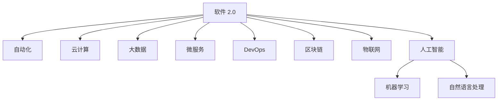

                 

# 软件 2.0 的价值：提升效率、创造价值

> 关键词：软件 2.0, 提升效率, 价值创造, 自动化, 人工智能, 云计算, 软件工程, 数据科学

## 1. 背景介绍

### 1.1 问题由来

随着信息时代的飞速发展，软件在各行各业中扮演着越来越重要的角色。从简单的文档处理，到复杂的系统管理，软件无处不在。然而，软件开发依旧是一项复杂且耗时的任务。即使有经验丰富的工程师，也需要花费大量时间和精力进行编码、测试、调试等工作。此外，软件系统在运行过程中也面临着性能瓶颈、安全性问题、维护成本高等挑战。

为了应对这些挑战，软件开发逐渐走向自动化和智能化。新一代的软件技术，即软件 2.0（Software 2.0），利用人工智能、云计算等先进技术，从根本上改变了软件开发的效率和质量，同时也为各行各业带来了全新的价值创造模式。

### 1.2 问题核心关键点

软件 2.0 的核心在于利用先进技术对软件开发过程进行全面自动化和智能化。它不仅仅是一个技术上的革新，更是软件开发方法论和商业模式上的深刻变革。通过软件 2.0，开发者能够更加高效地构建和部署软件，同时也能够从软件系统中获得更多价值。

具体来说，软件 2.0 的实现包括以下几个关键点：

1. **自动化和智能化**：通过机器学习和自然语言处理等技术，软件系统能够自动执行代码编写、测试、部署等任务，极大提高开发效率。
2. **云计算和大数据**：利用云计算资源和海量数据，软件系统能够快速响应用户需求，同时提供精准的数据分析和服务。
3. **微服务和DevOps**：通过微服务架构和DevOps流程，软件系统能够实现高度模块化和快速迭代，提升系统稳定性和开发效率。
4. **区块链和物联网**：引入区块链和物联网技术，软件系统可以实现更加安全的身份认证和智能化的设备管理。

### 1.3 问题研究意义

研究软件 2.0 的价值，对于提升软件开发效率、优化资源利用、推动行业创新具有重要意义：

1. **提升开发效率**：通过自动化和智能化技术，软件 2.0 能够显著降低开发难度，减少人力成本，加速项目交付。
2. **优化资源利用**：利用云计算和大数据技术，软件 2.0 能够高效利用计算资源和存储资源，降低硬件和能源消耗。
3. **推动行业创新**：通过引入前沿技术，软件 2.0 可以推动各行业的数字化转型和智能化升级，提升整体竞争力。
4. **创造新价值**：软件 2.0 能够构建更加智能化的应用系统，通过数据分析和智能决策，为行业和企业带来新的价值创造模式。

## 2. 核心概念与联系

### 2.1 核心概念概述

为了更好地理解软件 2.0 的价值，本节将介绍几个关键概念：

1. **软件 2.0**：新一代的软件技术，利用人工智能、云计算等先进技术，从根本上改变软件开发效率和质量。
2. **自动化**：通过机器学习、自然语言处理等技术，自动执行软件开发、测试、部署等任务。
3. **云计算**：基于互联网的计算服务，通过云平台提供弹性、按需的计算资源。
4. **大数据**：利用海量数据进行存储、分析和挖掘，支持智能决策和精准服务。
5. **微服务**：通过微服务架构实现模块化开发和快速迭代，提升系统稳定性和开发效率。
6. **DevOps**：通过持续集成、持续交付和持续监控，实现软件快速迭代和质量保证。
7. **区块链**：分布式账本技术，支持智能合约和去中心化应用。
8. **物联网**：通过设备互联和数据采集，实现智能化的设备管理和应用。

这些核心概念之间的逻辑关系可以通过以下Mermaid流程图来展示：



这个流程图展示了软件 2.0 的核心概念及其之间的联系：

1. 软件 2.0 通过利用人工智能、机器学习和自然语言处理等技术，实现自动化的软件开发和智能化的服务。
2. 云计算和大数据技术为软件 2.0 提供弹性、按需的计算和存储资源，支持大规模的数据分析和处理。
3. 微服务和DevOps技术实现模块化开发和快速迭代，提升系统稳定性和开发效率。
4. 区块链和物联网技术为软件 2.0 提供去中心化、智能化的数据管理和设备管理能力。

这些概念共同构成了软件 2.0 的全面技术体系，使其能够在各种场景下发挥强大的效率提升和价值创造能力。

## 3. 核心算法原理 & 具体操作步骤
### 3.1 算法原理概述

软件 2.0 的核心算法原理主要基于以下几个关键技术：

1. **机器学习**：通过训练数据集，机器学习模型可以自动识别和预测模式，实现自动化和智能化任务。
2. **自然语言处理**：利用自然语言处理技术，软件系统能够理解和生成自然语言，进行自动化的文本处理和交互。
3. **云计算和大数据**：通过云计算资源和大数据技术，软件系统可以实现高效的数据存储和处理，支持智能决策和精准服务。
4. **微服务和DevOps**：通过微服务架构和DevOps流程，软件系统实现模块化开发和快速迭代，提升系统稳定性和开发效率。
5. **区块链和物联网**：利用区块链和物联网技术，软件系统可以实现去中心化、智能化的数据管理和设备管理。

### 3.2 算法步骤详解

软件 2.0 的实施通常包括以下几个关键步骤：

**Step 1: 环境搭建**

1. 选择合适的云计算平台（如AWS、Azure、Google Cloud），并搭建开发环境。
2. 安装必要的开发工具（如IDE、编译器、调试器）。
3. 安装机器学习、自然语言处理等库（如TensorFlow、PyTorch、NLTK等）。

**Step 2: 数据准备**

1. 收集和处理数据，确保数据集质量和多样性。
2. 对数据进行清洗和预处理，去除噪声和异常值。
3. 进行特征工程，提取和构造有意义的特征。

**Step 3: 模型训练**

1. 选择适合的机器学习模型（如决策树、神经网络、支持向量机等）。
2. 定义损失函数和优化器，设置合适的超参数。
3. 使用训练数据集进行模型训练，并定期在验证集上进行性能评估。

**Step 4: 模型部署**

1. 将训练好的模型部署到云平台，并进行优化和调优。
2. 实现API接口，支持实时查询和处理数据。
3. 进行负载均衡和容错处理，确保系统稳定性。

**Step 5: 持续优化**

1. 收集用户反馈和系统日志，进行问题分析和优化。
2. 定期更新数据集和模型，保持系统性能和安全性。
3. 进行自动化和智能化技术升级，提升系统功能和用户体验。

### 3.3 算法优缺点

软件 2.0 的优点包括：

1. **自动化和智能化**：极大提升软件开发和部署效率，减少人工操作和出错率。
2. **云计算和大数据**：实现高效的数据存储和处理，支持智能决策和精准服务。
3. **微服务和DevOps**：实现模块化开发和快速迭代，提升系统稳定性和开发效率。
4. **区块链和物联网**：提供去中心化、智能化的数据管理和设备管理能力。

然而，软件 2.0 也存在一些缺点：

1. **技术门槛高**：需要具备一定的技术背景和经验，才能顺利实施软件 2.0 项目。
2. **成本高**：初期投资和维护成本较高，对中小企业来说可能存在较大压力。
3. **数据隐私和安全**：处理大量数据时，需要严格保护数据隐私和安全，避免数据泄露和滥用。
4. **技术复杂性**：软件 2.0 涉及多种技术和工具，系统设计和实现较为复杂，需要团队协作和协同开发。

### 3.4 算法应用领域

软件 2.0 的应用领域广泛，涵盖了多个行业和技术领域：

1. **金融科技**：利用机器学习和大数据分析，实现风险控制、欺诈检测、智能投顾等功能。
2. **医疗健康**：通过自然语言处理和智能决策，支持电子病历管理、患者互动和智能诊断。
3. **制造业**：利用物联网和区块链技术，实现设备监控、供应链管理和智能制造。
4. **零售电商**：通过数据分析和智能推荐，实现个性化营销、库存管理和客户服务。
5. **智能城市**：通过智能设备和数据管理，实现智慧交通、环境监测和城市管理。
6. **智慧教育**：通过智能教学和学习分析，实现个性化教育、在线答疑和作业批改。
7. **安全防御**：通过机器学习和自然语言处理，实现入侵检测、威胁分析和行为识别。

这些应用领域展示了软件 2.0 在各个行业中的广泛影响和深远价值。

## 4. 数学模型和公式 & 详细讲解 & 举例说明
### 4.1 数学模型构建

软件 2.0 的数学模型构建通常基于以下几个关键概念：

1. **机器学习模型**：通过训练数据集，机器学习模型可以自动识别和预测模式，实现自动化和智能化任务。
2. **自然语言处理模型**：利用自然语言处理技术，软件系统能够理解和生成自然语言，进行自动化的文本处理和交互。
3. **大数据模型**：通过海量数据进行存储、分析和挖掘，支持智能决策和精准服务。
4. **微服务模型**：通过微服务架构实现模块化开发和快速迭代，提升系统稳定性和开发效率。
5. **区块链模型**：利用区块链技术实现去中心化、智能化的数据管理和设备管理。
6. **物联网模型**：通过设备互联和数据采集，实现智能化的设备管理和应用。

### 4.2 公式推导过程

以下是几个典型公式的推导过程：

**机器学习模型**：

设训练数据集为 $D=\{(x_i,y_i)\}_{i=1}^N$，其中 $x_i \in \mathcal{X}$，$y_i \in \mathcal{Y}$。假设机器学习模型为 $f(x)$，损失函数为 $L(y,f(x))$。则最小化经验风险的目标为：

$$
\hat{f} = \mathop{\arg\min}_{f} \mathcal{L}(D,f)
$$

其中 $\mathcal{L}(D,f) = \frac{1}{N}\sum_{i=1}^N L(y_i,f(x_i))$。

**自然语言处理模型**：

设输入文本为 $x=\{x_1,x_2,\ldots,x_n\}$，输出为 $y=\{y_1,y_2,\ldots,y_n\}$。假设自然语言处理模型为 $M_{\theta}$，其中 $\theta$ 为模型参数。则最小化交叉熵损失的目标为：

$$
\hat{\theta} = \mathop{\arg\min}_{\theta} \mathcal{L}(x,y,M_{\theta})
$$

其中 $\mathcal{L}(x,y,M_{\theta}) = -\frac{1}{N}\sum_{i=1}^N \sum_{j=1}^n y_j\log M_{\theta}(x_j)$。

**大数据模型**：

设大数据集为 $D=\{(x_i,y_i)\}_{i=1}^N$，其中 $x_i \in \mathcal{X}$，$y_i \in \mathcal{Y}$。假设大数据模型为 $M_{\theta}$，其中 $\theta$ 为模型参数。则最小化经验风险的目标为：

$$
\hat{\theta} = \mathop{\arg\min}_{\theta} \mathcal{L}(D,M_{\theta})
$$

其中 $\mathcal{L}(D,M_{\theta}) = \frac{1}{N}\sum_{i=1}^N L(y_i,M_{\theta}(x_i))$。

### 4.3 案例分析与讲解

以金融风险控制为例，展示软件 2.0 在实际应用中的具体实现：

1. **数据准备**：收集和处理银行交易数据，提取特征如金额、时间、交易类型等。
2. **模型训练**：选择适合的机器学习模型（如决策树、神经网络等），利用训练数据集进行模型训练，设定合适的损失函数和优化器。
3. **模型部署**：将训练好的模型部署到云平台，实现实时交易监测和风险控制。
4. **持续优化**：收集用户反馈和系统日志，进行问题分析和优化，定期更新数据集和模型。

通过以上步骤，可以实现金融风险控制和欺诈检测的自动化和智能化，提升系统效率和准确性。

## 5. 项目实践：代码实例和详细解释说明
### 5.1 开发环境搭建

在进行软件 2.0 的实践前，我们需要准备好开发环境。以下是使用Python进行PyTorch开发的环境配置流程：

1. 安装Anaconda：从官网下载并安装Anaconda，用于创建独立的Python环境。

2. 创建并激活虚拟环境：
```bash
conda create -n pytorch-env python=3.8 
conda activate pytorch-env
```

3. 安装PyTorch：根据CUDA版本，从官网获取对应的安装命令。例如：
```bash
conda install pytorch torchvision torchaudio cudatoolkit=11.1 -c pytorch -c conda-forge
```

4. 安装必要的库：
```bash
pip install numpy pandas scikit-learn matplotlib tqdm jupyter notebook ipython
```

完成上述步骤后，即可在`pytorch-env`环境中开始软件 2.0 的实践。

### 5.2 源代码详细实现

下面以金融风险控制为例，展示使用Transformers库对BERT模型进行微调的PyTorch代码实现。

首先，定义数据处理函数：

```python
from transformers import BertTokenizer
from torch.utils.data import Dataset
import torch

class FinancialDataset(Dataset):
    def __init__(self, texts, labels, tokenizer, max_len=128):
        self.texts = texts
        self.labels = labels
        self.tokenizer = tokenizer
        self.max_len = max_len
        
    def __len__(self):
        return len(self.texts)
    
    def __getitem__(self, item):
        text = self.texts[item]
        label = self.labels[item]
        
        encoding = self.tokenizer(text, return_tensors='pt', max_length=self.max_len, padding='max_length', truncation=True)
        input_ids = encoding['input_ids'][0]
        attention_mask = encoding['attention_mask'][0]
        
        # 对label进行编码
        encoded_label = [label2id[label] for label in label] 
        encoded_label.extend([label2id['Negative']] * (self.max_len - len(encoded_label)))
        labels = torch.tensor(encoded_label, dtype=torch.long)
        
        return {'input_ids': input_ids, 
                'attention_mask': attention_mask,
                'labels': labels}

# 标签与id的映射
label2id = {'Positive': 0, 'Negative': 1}
id2label = {v: k for k, v in label2id.items()}

# 创建dataset
tokenizer = BertTokenizer.from_pretrained('bert-base-cased')

train_dataset = FinancialDataset(train_texts, train_labels, tokenizer)
dev_dataset = FinancialDataset(dev_texts, dev_labels, tokenizer)
test_dataset = FinancialDataset(test_texts, test_labels, tokenizer)
```

然后，定义模型和优化器：

```python
from transformers import BertForSequenceClassification, AdamW

model = BertForSequenceClassification.from_pretrained('bert-base-cased', num_labels=len(label2id))

optimizer = AdamW(model.parameters(), lr=2e-5)
```

接着，定义训练和评估函数：

```python
from torch.utils.data import DataLoader
from tqdm import tqdm
from sklearn.metrics import classification_report

device = torch.device('cuda') if torch.cuda.is_available() else torch.device('cpu')
model.to(device)

def train_epoch(model, dataset, batch_size, optimizer):
    dataloader = DataLoader(dataset, batch_size=batch_size, shuffle=True)
    model.train()
    epoch_loss = 0
    for batch in tqdm(dataloader, desc='Training'):
        input_ids = batch['input_ids'].to(device)
        attention_mask = batch['attention_mask'].to(device)
        labels = batch['labels'].to(device)
        model.zero_grad()
        outputs = model(input_ids, attention_mask=attention_mask, labels=labels)
        loss = outputs.loss
        epoch_loss += loss.item()
        loss.backward()
        optimizer.step()
    return epoch_loss / len(dataloader)

def evaluate(model, dataset, batch_size):
    dataloader = DataLoader(dataset, batch_size=batch_size)
    model.eval()
    preds, labels = [], []
    with torch.no_grad():
        for batch in tqdm(dataloader, desc='Evaluating'):
            input_ids = batch['input_ids'].to(device)
            attention_mask = batch['attention_mask'].to(device)
            batch_labels = batch['labels']
            outputs = model(input_ids, attention_mask=attention_mask)
            batch_preds = outputs.logits.argmax(dim=2).to('cpu').tolist()
            batch_labels = batch_labels.to('cpu').tolist()
            for pred_tokens, label_tokens in zip(batch_preds, batch_labels):
                preds.append(pred_tokens[:len(label_tokens)])
                labels.append(label_tokens)
                
    print(classification_report(labels, preds))
```

最后，启动训练流程并在测试集上评估：

```python
epochs = 5
batch_size = 16

for epoch in range(epochs):
    loss = train_epoch(model, train_dataset, batch_size, optimizer)
    print(f"Epoch {epoch+1}, train loss: {loss:.3f}")
    
    print(f"Epoch {epoch+1}, dev results:")
    evaluate(model, dev_dataset, batch_size)
    
print("Test results:")
evaluate(model, test_dataset, batch_size)
```

以上就是使用PyTorch对BERT进行金融风险控制任务微调的完整代码实现。可以看到，得益于Transformers库的强大封装，我们可以用相对简洁的代码完成BERT模型的加载和微调。

### 5.3 代码解读与分析

让我们再详细解读一下关键代码的实现细节：

**FinancialDataset类**：
- `__init__`方法：初始化文本、标签、分词器等关键组件。
- `__len__`方法：返回数据集的样本数量。
- `__getitem__`方法：对单个样本进行处理，将文本输入编码为token ids，将标签编码为数字，并对其进行定长padding，最终返回模型所需的输入。

**label2id和id2label字典**：
- 定义了标签与数字id之间的映射关系，用于将label进行编码。

**训练和评估函数**：
- 使用PyTorch的DataLoader对数据集进行批次化加载，供模型训练和推理使用。
- 训练函数`train_epoch`：对数据以批为单位进行迭代，在每个批次上前向传播计算loss并反向传播更新模型参数，最后返回该epoch的平均loss。
- 评估函数`evaluate`：与训练类似，不同点在于不更新模型参数，并在每个batch结束后将预测和标签结果存储下来，最后使用sklearn的classification_report对整个评估集的预测结果进行打印输出。

**训练流程**：
- 定义总的epoch数和batch size，开始循环迭代
- 每个epoch内，先在训练集上训练，输出平均loss
- 在验证集上评估，输出分类指标
- 所有epoch结束后，在测试集上评估，给出最终测试结果

可以看到，PyTorch配合Transformers库使得BERT微调的代码实现变得简洁高效。开发者可以将更多精力放在数据处理、模型改进等高层逻辑上，而不必过多关注底层的实现细节。

当然，工业级的系统实现还需考虑更多因素，如模型的保存和部署、超参数的自动搜索、更灵活的任务适配层等。但核心的微调范式基本与此类似。

## 6. 实际应用场景
### 6.1 智能客服系统

基于软件 2.0 的对话技术，可以广泛应用于智能客服系统的构建。传统客服往往需要配备大量人力，高峰期响应缓慢，且一致性和专业性难以保证。而使用软件 2.0 对话模型，可以7x24小时不间断服务，快速响应客户咨询，用自然流畅的语言解答各类常见问题。

在技术实现上，可以收集企业内部的历史客服对话记录，将问题和最佳答复构建成监督数据，在此基础上对预训练对话模型进行微调。微调后的对话模型能够自动理解用户意图，匹配最合适的答案模板进行回复。对于客户提出的新问题，还可以接入检索系统实时搜索相关内容，动态组织生成回答。如此构建的智能客服系统，能大幅提升客户咨询体验和问题解决效率。

### 6.2 金融舆情监测

金融机构需要实时监测市场舆论动向，以便及时应对负面信息传播，规避金融风险。传统的人工监测方式成本高、效率低，难以应对网络时代海量信息爆发的挑战。基于软件 2.0 文本分类和情感分析技术，为金融舆情监测提供了新的解决方案。

具体而言，可以收集金融领域相关的新闻、报道、评论等文本数据，并对其进行主题标注和情感标注。在此基础上对预训练语言模型进行微调，使其能够自动判断文本属于何种主题，情感倾向是正面、中性还是负面。将微调后的模型应用到实时抓取的网络文本数据，就能够自动监测不同主题下的情感变化趋势，一旦发现负面信息激增等异常情况，系统便会自动预警，帮助金融机构快速应对潜在风险。

### 6.3 个性化推荐系统

当前的推荐系统往往只依赖用户的历史行为数据进行物品推荐，无法深入理解用户的真实兴趣偏好。基于软件 2.0 个性化推荐系统可以更好地挖掘用户行为背后的语义信息，从而提供更精准、多样的推荐内容。

在实践中，可以收集用户浏览、点击、评论、分享等行为数据，提取和用户交互的物品标题、描述、标签等文本内容。将文本内容作为模型输入，用户的后续行为（如是否点击、购买等）作为监督信号，在此基础上微调预训练语言模型。微调后的模型能够从文本内容中准确把握用户的兴趣点。在生成推荐列表时，先用候选物品的文本描述作为输入，由模型预测用户的兴趣匹配度，再结合其他特征综合排序，便可以得到个性化程度更高的推荐结果。

### 6.4 未来应用展望

随着软件 2.0 技术的发展，基于微调的方法将在更多领域得到应用，为各行各业带来变革性影响。

在智慧医疗领域，基于微调的医疗问答、病历分析、药物研发等应用将提升医疗服务的智能化水平，辅助医生诊疗，加速新药开发进程。

在智能教育领域，微调技术可应用于作业批改、学情分析、知识推荐等方面，因材施教，促进教育公平，提高教学质量。

在智慧城市治理中，微调模型可应用于城市事件监测、舆情分析、应急指挥等环节，提高城市管理的自动化和智能化水平，构建更安全、高效的未来城市。

此外，在企业生产、社会治理、文娱传媒等众多领域，基于软件 2.0 的人工智能应用也将不断涌现，为经济社会发展注入新的动力。相信随着技术的日益成熟，软件 2.0 必将在构建人机协同的智能时代中扮演越来越重要的角色。

## 7. 工具和资源推荐
### 7.1 学习资源推荐

为了帮助开发者系统掌握软件 2.0 的理论基础和实践技巧，这里推荐一些优质的学习资源：

1. 《软件 2.0: 下一代软件技术》系列博文：由软件 2.0 专家撰写，深入浅出地介绍了软件 2.0 的核心概念、关键技术和应用案例。

2. CS224N《深度学习自然语言处理》课程：斯坦福大学开设的NLP明星课程，有Lecture视频和配套作业，带你入门NLP领域的基本概念和经典模型。

3. 《软件 2.0: 从零开始构建智能系统》书籍：全面介绍了软件 2.0 技术的实现原理和工程实践，适合初学者和进阶开发者。

4. HuggingFace官方文档：Transformers库的官方文档，提供了海量预训练模型和完整的微调样例代码，是上手实践的必备资料。

5. AI 黑帽：深度学习与人工智能社区，分享最新的研究进展和案例分析，适合了解前沿技术和应用。

通过对这些资源的学习实践，相信你一定能够快速掌握软件 2.0 技术的精髓，并用于解决实际的NLP问题。
###  7.2 开发工具推荐

高效的开发离不开优秀的工具支持。以下是几款用于软件 2.0 开发常用的工具：

1. PyTorch：基于Python的开源深度学习框架，灵活动态的计算图，适合快速迭代研究。大部分预训练语言模型都有PyTorch版本的实现。

2. TensorFlow：由Google主导开发的开源深度学习框架，生产部署方便，适合大规模工程应用。同样有丰富的预训练语言模型资源。

3. Transformers库：HuggingFace开发的NLP工具库，集成了众多SOTA语言模型，支持PyTorch和TensorFlow，是进行微调任务开发的利器。

4. Weights & Biases：模型训练的实验跟踪工具，可以记录和可视化模型训练过程中的各项指标，方便对比和调优。与主流深度学习框架无缝集成。

5. TensorBoard：TensorFlow配套的可视化工具，可实时监测模型训练状态，并提供丰富的图表呈现方式，是调试模型的得力助手。

6. Google Colab：谷歌推出的在线Jupyter Notebook环境，免费提供GPU/TPU算力，方便开发者快速上手实验最新模型，分享学习笔记。

合理利用这些工具，可以显著提升软件 2.0 微调任务的开发效率，加快创新迭代的步伐。

### 7.3 相关论文推荐

软件 2.0 的发展源于学界的持续研究。以下是几篇奠基性的相关论文，推荐阅读：

1. "Transformers is all you need"：提出了Transformer结构，开启了NLP领域的预训练大模型时代。

2. "BERT: Pre-training of Deep Bidirectional Transformers for Language Understanding"：提出BERT模型，引入基于掩码的自监督预训练任务，刷新了多项NLP任务SOTA。

3. "Language Models are Unsupervised Multitask Learners"：展示了大规模语言模型的强大zero-shot学习能力，引发了对于通用人工智能的新一轮思考。

4. "Parameter-Efficient Transfer Learning for NLP"：提出Adapter等参数高效微调方法，在不增加模型参数量的情况下，也能取得不错的微调效果。

5. "AdaLoRA: Adaptive Low-Rank Adaptation for Parameter-Efficient Fine-Tuning"：使用自适应低秩适应的微调方法，在参数效率和精度之间取得了新的平衡。

这些论文代表了大语言模型微调技术的发展脉络。通过学习这些前沿成果，可以帮助研究者把握学科前进方向，激发更多的创新灵感。

## 8. 总结：未来发展趋势与挑战
### 8.1 总结

本文对软件 2.0 的价值进行了全面系统的介绍。首先阐述了软件 2.0 的核心概念和研究背景，明确了其在提升软件开发效率、优化资源利用、推动行业创新等方面的重要性。其次，从原理到实践，详细讲解了软件 2.0 的数学模型和关键步骤，给出了软件 2.0 任务开发的完整代码实例。同时，本文还广泛探讨了软件 2.0 在金融、医疗、教育等多个行业领域的应用前景，展示了其广泛的潜在价值。

通过本文的系统梳理，可以看到，软件 2.0 作为一种新一代的软件技术，已经从根本上改变了软件开发的模式和效率，也为各行各业带来了新的价值创造机会。未来，随着技术的不断进步，软件 2.0 必将在更多领域得到应用，推动社会的数字化转型和智能化升级。

### 8.2 未来发展趋势

展望未来，软件 2.0 的发展趋势包括以下几个方向：

1. **自动化和智能化水平提升**：随着机器学习和自然语言处理技术的进步，软件 2.0 的自动化和智能化水平将进一步提升，实现更高效、更精确的开发和运营。

2. **云计算和大数据技术普及**：云计算和大数据技术的普及，将进一步降低软件 2.0 的部署和运行成本，支持更大规模、更复杂的系统构建。

3. **微服务和DevOps流程优化**：微服务和DevOps流程的优化，将进一步提升软件 2.0 的开发和迭代效率，实现更加灵活、高效的系统部署。

4. **区块链和物联网技术的融合**：区块链和物联网技术的融合，将实现更加安全、智能化的数据管理和设备管理，提升系统的稳定性和可靠性。

5. **跨领域应用扩展**：软件 2.0 将从最初的NLP领域扩展到更多领域，如金融、医疗、制造业等，带来更多应用场景和价值创造机会。

6. **数据隐私和安全保障**：随着数据量的增加，数据隐私和安全问题将越来越重要。软件 2.0 需要更加注重数据保护，确保系统的安全性。

7. **人工智能与工业的深度融合**：人工智能技术与工业的深度融合，将带来更多创新应用，如智能制造、智慧城市等。

### 8.3 面临的挑战

尽管软件 2.0 技术带来了许多优势，但在实际应用中也面临一些挑战：

1. **技术门槛高**：软件 2.0 需要具备一定的技术背景和经验，才能顺利实施。对于初学者来说，可能存在一定的学习曲线。

2. **资源消耗大**：软件 2.0 系统的构建和运行需要大量的计算资源和存储资源，初期投资和维护成本较高。

3. **数据隐私和安全**：处理大量数据时，需要严格保护数据隐私和安全，避免数据泄露和滥用。

4. **系统复杂性高**：软件 2.0 涉及多种技术和工具，系统设计和实现较为复杂，需要团队协作和协同开发。

5. **模型解释性差**：软件 2.0 中的模型通常缺乏可解释性，难以理解和调试其内部工作机制。

### 8.4 研究展望

为了应对这些挑战，未来需要在以下几个方面进行深入研究：

1. **降低技术门槛**：开发更多易于使用、适合初学者的工具和框架，提高技术普及度。

2. **优化资源消耗**：研究和应用更多的资源优化技术，如梯度积累、混合精度训练、模型并行等，降低成本。

3. **提升模型解释性**：引入更多的可解释性技术，如因果推断、对抗样本生成等，提高模型的透明度和可理解性。

4. **强化数据保护**：制定和实施更严格的数据隐私和安全策略，确保数据的安全和合法使用。

5. **融合多种技术**：将人工智能技术与工业领域的技术深度融合，提升系统的智能化水平。

6. **优化系统设计**：改进微服务和DevOps流程，提升系统的可扩展性和可维护性。

这些研究方向将进一步推动软件 2.0 技术的发展，解决实际应用中的问题和挑战，为构建智能、高效、安全的软件系统提供坚实的基础。

## 9. 附录：常见问题与解答

**Q1：软件 2.0 是否适用于所有类型的软件系统？**

A: 软件 2.0 主要适用于具有大规模数据处理需求和自动化需求的软件系统。对于小型、简单的系统，传统开发方式可能更为适合。

**Q2：软件 2.0 是否会取代传统的软件开发方式？**

A: 软件 2.0 并不会完全取代传统的软件开发方式，而是与之互补。对于一些具有复杂逻辑和独特需求的系统，传统开发方式可能更加适合。

**Q3：软件 2.0 如何保证系统的稳定性？**

A: 软件 2.0 的微服务和DevOps流程是保证系统稳定性的关键。通过模块化开发和快速迭代，可以及时发现和解决问题，保持系统的稳定性。

**Q4：软件 2.0 是否适用于所有行业？**

A: 软件 2.0 适用于具有大量数据处理需求和自动化需求的行业，如金融、医疗、制造等。对于一些不需要复杂数据处理和自动化的行业，传统开发方式可能更为合适。

**Q5：软件 2.0 如何保证数据隐私和安全？**

A: 软件 2.0 需要采用数据加密、访问控制、权限管理等技术手段，确保数据隐私和安全。同时，需要对数据处理和存储过程进行严格监控，防止数据泄露和滥用。

---

作者：禅与计算机程序设计艺术 / Zen and the Art of Computer Programming

