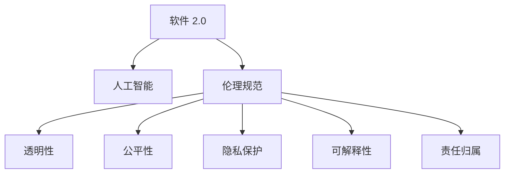

                 

# 软件 2.0 的伦理规范：人工智能的责任

> 关键词：软件2.0, 人工智能, 伦理规范, 责任, 道德, 公平, 透明度, 隐私保护, 可解释性

## 1. 背景介绍

### 1.1 问题由来
随着人工智能(AI)技术的快速发展，尤其是深度学习和大数据技术的崛起，人工智能正在从传统的基于规则的专家系统，向基于数据驱动的自我学习系统转变。这种转变被称为"软件 2.0"（Software 2.0），其核心在于利用机器学习模型对海量数据进行高效建模和预测。然而，随着软件 2.0 技术的广泛应用，其在伦理、责任、公平、隐私保护等方面的问题也日益凸显。如何构建一个既高效又负责任的人工智能系统，成为了亟待解决的重要问题。

### 1.2 问题核心关键点
当前，软件 2.0 系统主要面临以下几个核心问题：

- **决策透明性**：软件 2.0 系统通常是一个"黑箱"，难以解释其内部的决策逻辑，这对于金融、医疗等高风险领域尤为关键。
- **数据隐私**：软件 2.0 系统通常需要大量数据进行训练和优化，如何保护用户数据隐私成为一大挑战。
- **公平性**：软件 2.0 系统可能会由于数据偏差而对某些群体产生歧视，如何保证系统的公平性是一个重要问题。
- **责任归属**：当软件 2.0 系统出现错误时，如何界定责任，是开发方还是使用方？
- **伦理规范**：如何制定一套合理的伦理规范，确保软件 2.0 系统的应用符合社会价值观和道德准则？

这些问题不仅影响到技术的发展，还关系到社会的公平与和谐。因此，制定一套明确的伦理规范，确保软件 2.0 技术的健康发展，成为了当前研究的热点问题。

### 1.3 问题研究意义
构建软件 2.0 系统的伦理规范，对于推动人工智能技术的公平、透明、安全和可持续发展，具有重要意义：

1. **保障用户权益**：通过规范数据使用和决策透明性，确保用户隐私和权益得到保护。
2. **提升社会信任**：明确的伦理规范可以增强公众对人工智能系统的信任，促进其在各行各业的应用。
3. **避免伦理风险**：防止人工智能系统被用于有害目的，如偏见、歧视等，确保其在社会上的正面影响。
4. **推动行业标准**：制定行业标准和规范，为各行业的AI应用提供指导和参考。
5. **促进技术进步**：伦理规范有助于引导技术创新，提升AI系统的整体性能和应用效果。

## 2. 核心概念与联系

### 2.1 核心概念概述

为了更好地理解软件 2.0 系统的伦理规范，本节将介绍几个关键概念：

- **软件 2.0**：基于数据驱动的自我学习系统，主要通过机器学习算法对海量数据进行建模和预测。
- **人工智能(AI)**：利用计算机算法，模拟人类智能进行推理、决策和学习的技术。
- **伦理规范**：指导人工智能系统开发和应用的一系列道德和法律准则。
- **透明性(Transparency)**：指系统的工作原理和决策过程，对外公开透明。
- **公平性(Fairness)**：指系统在处理不同用户时，避免偏见和歧视，确保对所有用户公正对待。
- **隐私保护(Privacy Protection)**：指保护用户数据隐私，确保数据不被滥用。
- **可解释性(Explainability)**：指系统输出的决策逻辑和依据，应可被理解和解释。
- **责任归属(Liability)**：指当系统出现错误或有害结果时，如何界定责任。

这些核心概念之间的逻辑关系可以通过以下Mermaid流程图来展示：



这个流程图展示了大语言模型的核心概念及其之间的关系：

1. 软件 2.0 系统通过人工智能技术实现自我学习。
2. 伦理规范指导和约束系统开发和应用，确保其符合道德和法律要求。
3. 透明性、公平性、隐私保护、可解释性和责任归属等，是构建伦理规范的重要组成部分。

## 3. 核心算法原理 & 具体操作步骤
### 3.1 算法原理概述

软件 2.0 系统的伦理规范，本质上是对系统开发、使用和管理的道德和法律准则的制定和实施。其核心在于确保系统在各个环节中，能够公平、透明、负责任地处理数据和进行决策。

软件 2.0 系统的伦理规范，包括以下几个关键方面：

1. **数据收集与处理**：确保数据收集和使用符合法律规定，不侵犯用户隐私。
2. **模型训练与优化**：确保模型训练过程公平、透明，避免偏见和歧视。
3. **系统部署与应用**：确保系统部署和使用符合伦理规范，不产生有害影响。
4. **用户反馈与改进**：建立用户反馈机制，持续改进系统性能和伦理表现。

### 3.2 算法步骤详解

软件 2.0 系统的伦理规范，主要包括以下几个步骤：

**Step 1: 数据收集与处理**
- 确保数据收集过程透明，不侵犯用户隐私。
- 数据处理过程中，应避免数据偏差，确保数据的多样性和代表性。
- 对敏感数据进行脱敏处理，防止数据泄露。

**Step 2: 模型训练与优化**
- 选择公平、透明的算法和模型，避免偏见和歧视。
- 使用公开数据集进行模型训练，确保训练过程透明。
- 对模型进行公平性评估，检测是否存在偏见和歧视。

**Step 3: 系统部署与应用**
- 在模型部署前，进行全面的伦理审查，确保符合规范。
- 明确系统的使用范围和限制，确保不产生有害影响。
- 建立用户反馈机制，及时处理用户投诉和建议。

**Step 4: 用户反馈与改进**
- 建立用户反馈渠道，收集用户意见和建议。
- 对用户反馈进行分析，优化系统性能和伦理表现。
- 持续改进系统，确保其符合伦理规范。

### 3.3 算法优缺点

软件 2.0 系统的伦理规范，具有以下优点：

1. **提升系统公平性**：通过规范数据收集和模型训练，确保系统对所有用户公平对待。
2. **增强系统透明性**：通过公开透明的数据处理和决策过程，提升用户信任。
3. **保障用户隐私**：通过严格的数据处理和隐私保护措施，确保用户数据安全。
4. **提升可解释性**：通过规范决策过程和输出结果的解释，提升系统的可解释性。
5. **明确责任归属**：通过明确系统责任，确保各方在出现问题时能够合理分担责任。

同时，该方法也存在一定的局限性：

1. **执行难度较大**：制定和实施伦理规范，需要大量资源和时间。
2. **难以全面覆盖**：伦理规范可能难以覆盖所有场景和问题。
3. **与业务冲突**：伦理规范可能与业务目标产生冲突，需要平衡伦理与业务需求。
4. **用户感知有限**：用户对伦理规范的感知和理解可能有限，难以形成广泛共识。

尽管存在这些局限性，但就目前而言，伦理规范仍是对软件 2.0 系统进行有效管理和控制的必要手段。未来相关研究的重点在于如何进一步降低伦理规范的执行难度，提高其全面覆盖能力，同时兼顾业务目标和用户感知。

### 3.4 算法应用领域

软件 2.0 系统的伦理规范，在多个领域中具有广泛的应用，例如：

- **金融领域**：金融交易和贷款审批系统，需要确保模型公平，避免歧视和偏见。
- **医疗领域**：医疗诊断和治疗推荐系统，需要确保模型透明和可解释，保障患者隐私。
- **教育领域**：学生评估和推荐系统，需要确保公平性和透明度，避免对特定群体产生偏见。
- **司法领域**：法律判例和案件分析系统，需要确保模型公正和可解释，避免产生歧视性结果。
- **公共服务领域**：政府决策和公共资源分配系统，需要确保模型透明和公平，提升社会公信力。

除了上述这些领域，伦理规范还将在更多领域中得到应用，为社会治理提供新的解决方案，确保AI技术在各领域的应用符合伦理和道德要求。

## 4. 数学模型和公式 & 详细讲解 & 举例说明

### 4.1 数学模型构建

为了更严谨地描述软件 2.0 系统的伦理规范，我们可以使用数学语言进行建模。假设有一个基于数据驱动的机器学习模型 $M$，其输入为数据 $D$，输出为预测结果 $Y$。系统的伦理规范可以通过以下几个方面进行数学建模：

1. **公平性**：假设系统对不同群体的预测结果为 $Y_{group} = (Y_{group1}, Y_{group2}, ..., Y_{groupk})$，其中 $group$ 表示不同群体。系统的公平性可以通过统计均值和标准差来衡量，即：

   $$
   \mu_{group} = \frac{1}{n_{group}} \sum_{i=1}^{n_{group}} Y_{group_i}
   $$

   $$
   \sigma_{group} = \sqrt{\frac{1}{n_{group}} \sum_{i=1}^{n_{group}} (Y_{group_i} - \mu_{group})^2}
   $$

2. **透明性**：假设模型的决策过程为 $F_{model}$，其输入为 $D$，输出为 $Y$。模型的透明性可以通过模型的内部参数和决策过程来衡量，即：

   $$
   F_{model}(D) = M(D; \theta)
   $$

   其中 $\theta$ 为模型的内部参数。模型的透明性可以通过对 $\theta$ 的解释性分析，以及决策过程的可解释性来衡量。

3. **隐私保护**：假设系统的数据集为 $D$，其中包含敏感信息 $S$。隐私保护可以通过数据脱敏和加密技术来实现，即：

   $$
   D_{sensitive} = D_{sensitive} + N
   $$

   其中 $N$ 为随机噪声，用于对敏感信息进行脱敏。

4. **可解释性**：假设系统的预测结果为 $Y$，其输出为 $Y_{pred}$。系统的可解释性可以通过对 $Y_{pred}$ 的解释性分析来实现，即：

   $$
   Y_{pred} = M(Y_{real}; \theta)
   $$

   其中 $Y_{real}$ 为真实结果，$\theta$ 为模型参数。

5. **责任归属**：假设系统的错误结果为 $Y_{error}$，其归因结果为 $C$。系统的责任归属可以通过模型归因技术和因果分析来实现，即：

   $$
   C = F_{cause}(D, Y_{error})
   $$

   其中 $F_{cause}$ 为因果分析模型，用于分析错误结果的因果关系。

### 4.2 公式推导过程

以下我们将以公平性为例，进行详细推导。

假设系统对不同群体的预测结果为 $Y_{group} = (Y_{group1}, Y_{group2}, ..., Y_{groupk})$，其中 $group$ 表示不同群体。为了衡量系统的公平性，我们可以计算不同群体之间的均值差距：

$$
\Delta = \frac{1}{k} \sum_{i=1}^{k} |\mu_{group_i} - \mu_{group}|
$$

其中 $\mu_{group}$ 为所有群体的均值。

如果 $\Delta$ 较小，则说明系统的公平性较高；如果 $\Delta$ 较大，则说明系统存在明显的偏见和歧视。

### 4.3 案例分析与讲解

假设有一个基于机器学习模型的信用评分系统，其输入为用户的财务数据，输出为信用评分。为了确保系统的公平性，需要进行以下步骤：

1. 收集不同种族、性别、收入水平等群体的财务数据。
2. 对数据进行预处理，去除敏感信息。
3. 使用公开数据集进行模型训练，确保训练过程透明。
4. 对训练后的模型进行公平性评估，检测是否存在偏见和歧视。
5. 根据公平性评估结果，对模型进行调整和优化。

## 5. 项目实践：代码实例和详细解释说明

### 5.1 开发环境搭建

在进行伦理规范实践前，我们需要准备好开发环境。以下是使用Python进行Scikit-learn开发的环境配置流程：

1. 安装Anaconda：从官网下载并安装Anaconda，用于创建独立的Python环境。

2. 创建并激活虚拟环境：
```bash
conda create -n sklearn-env python=3.8 
conda activate sklearn-env
```

3. 安装Scikit-learn：
```bash
pip install scikit-learn
```

4. 安装numpy、pandas、matplotlib等各类工具包：
```bash
pip install numpy pandas matplotlib scikit-learn tqdm jupyter notebook ipython
```

完成上述步骤后，即可在`sklearn-env`环境中开始伦理规范实践。

### 5.2 源代码详细实现

这里我们以公平性评估为例，给出使用Scikit-learn库对信用评分模型进行公平性评估的Python代码实现。

首先，定义公平性评估函数：

```python
from sklearn.metrics import mean_absolute_error

def fairness_metric(y_true, y_pred, groups):
    y_pred_group = y_pred.groupby(groups).mean()
    y_true_group = y_true.groupby(groups).mean()
    delta = (y_true_group - y_pred_group).abs().mean()
    return delta
```

然后，定义数据集和模型：

```python
from sklearn.datasets import fetch_california_housing
from sklearn.linear_model import LinearRegression
from sklearn.model_selection import train_test_split

data = fetch_california_housing()
X, y = data.data, data.target
groups = data.target_names
X_train, X_test, y_train, y_test = train_test_split(X, y, test_size=0.2, random_state=42)

model = LinearRegression()
model.fit(X_train, y_train)
y_pred = model.predict(X_test)

delta = fairness_metric(y_test, y_pred, groups)
print(f"Fairness metric: {delta:.2f}")
```

以上代码展示了使用Scikit-learn库进行公平性评估的过程。可以看到，通过定义公平性评估函数，我们可以对机器学习模型的预测结果进行公平性分析，检测模型是否存在偏见和歧视。

### 5.3 代码解读与分析

让我们再详细解读一下关键代码的实现细节：

**定义公平性评估函数**：
- 输入为真实结果 $y_{true}$、预测结果 $y_{pred}$ 和分组变量 $groups$。
- 使用`groupby`方法对预测结果和真实结果进行分组，计算每组的均值。
- 计算不同组之间的均值差距，并求绝对值和平均，得到公平性度量 $\Delta$。

**定义数据集和模型**：
- 使用`fetch_california_housing`方法获取加州房价数据集。
- 将数据集划分为训练集和测试集。
- 使用`LinearRegression`模型进行训练和预测。

**计算公平性度量**：
- 使用公平性评估函数对测试集的预测结果进行公平性分析。
- 输出公平性度量 $\Delta$，用于评估模型的公平性表现。

通过代码实践，我们可以更加直观地理解如何构建和评估机器学习模型的公平性。这为我们进一步探讨软件 2.0 系统的伦理规范提供了基础。

## 6. 实际应用场景

### 6.1 智能医疗

在智能医疗领域，伦理规范的应用尤为重要。医疗数据通常包含大量的敏感信息，如病历、基因数据等，如何保护这些数据隐私，同时确保医疗决策的公平性和透明性，是一个重要的伦理问题。

智能医疗系统可以通过伦理规范，对数据收集和处理进行严格控制，确保患者隐私和数据安全。同时，通过对医疗决策模型的公平性评估，确保对不同病种和患者的公平对待。例如，在癌症治疗推荐系统中，可以通过伦理规范，避免对某些罕见病患者的歧视性待遇，确保每个患者都能得到公平的治疗建议。

### 6.2 金融风控

在金融领域，智能风控系统需要确保模型的公平性，避免对特定群体的歧视性对待。例如，贷款审批系统在处理不同收入水平、性别、种族等群体的贷款申请时，需要确保决策的公平性和透明性。

通过伦理规范，金融风控系统可以对数据进行严格的预处理和公平性评估，确保模型不会产生歧视性结果。例如，在信用评分模型中，可以使用伦理规范指导数据收集和模型训练过程，避免对低收入群体的偏见，确保模型对所有用户公平对待。

### 6.3 教育推荐

在教育领域，智能推荐系统需要确保对不同学生群体的公平对待。例如，在在线教育平台中，推荐系统需要根据学生的兴趣和知识水平，推荐适合的课程和学习资源。

通过伦理规范，智能推荐系统可以对学生数据进行严格的预处理和公平性评估，确保对所有学生公平对待。例如，在学生评估系统中，可以通过伦理规范，避免对某些学生的偏见，确保评估结果的公平性和透明性。

### 6.4 未来应用展望

随着软件 2.0 技术的不断发展，伦理规范将在更多领域得到应用，为社会治理提供新的解决方案，确保AI技术在各领域的应用符合伦理和道德要求。

在智慧城市治理中，智能交通系统、智能安防系统等，需要通过伦理规范，确保系统在处理交通流量、人员流动等数据时，能够公平、透明、负责地处理数据和进行决策。

在智能制造领域，通过伦理规范，智能生产系统需要确保在处理生产数据时，能够避免偏见和歧视，保障员工和客户的安全和权益。

此外，在能源管理、环境保护、公共卫生等领域，伦理规范也将发挥重要作用，确保系统在处理数据时，能够公平、透明、负责地进行决策，提升社会公信力和治理效率。

## 7. 工具和资源推荐

### 7.1 学习资源推荐

为了帮助开发者系统掌握软件 2.0 系统的伦理规范，这里推荐一些优质的学习资源：

1. **《软件 2.0 伦理规范》系列博文**：由伦理专家撰写，深入浅出地介绍了软件 2.0 系统的伦理规范，涵盖数据收集、模型训练、系统部署等多个方面。

2. **《人工智能伦理》课程**：斯坦福大学开设的伦理课程，涵盖人工智能技术的伦理问题，包括数据隐私、公平性、可解释性等。

3. **《伦理与机器学习》书籍**：介绍机器学习中伦理问题的经典著作，包含数据处理、模型训练、用户隐私等多个方面的详细论述。

4. **IEEE计算机协会伦理规范**：国际电工电子工程师学会（IEEE）的计算机伦理规范，为AI系统开发和应用提供指导和参考。

5. **Google AI伦理指南**：谷歌发布的AI伦理指南，为AI系统开发和应用提供全面的伦理指导和实践建议。

通过对这些资源的学习实践，相信你一定能够快速掌握软件 2.0 系统的伦理规范，并用于解决实际的AI问题。

### 7.2 开发工具推荐

高效的开发离不开优秀的工具支持。以下是几款用于伦理规范开发的常用工具：

1. **Scikit-learn**：基于Python的机器学习库，提供了丰富的公平性评估和模型训练工具。

2. **TensorFlow**：谷歌开发的深度学习框架，支持多种伦理规范相关的工具和库。

3. **Weights & Biases**：模型训练的实验跟踪工具，可以记录和可视化模型训练过程中的各项指标，方便对比和调优。

4. **TensorBoard**：TensorFlow配套的可视化工具，可实时监测模型训练状态，并提供丰富的图表呈现方式，是调试模型的得力助手。

5. **Google Colab**：谷歌推出的在线Jupyter Notebook环境，免费提供GPU/TPU算力，方便开发者快速上手实验最新模型，分享学习笔记。

合理利用这些工具，可以显著提升伦理规范的开发效率，加快创新迭代的步伐。

### 7.3 相关论文推荐

伦理规范的研究源于学界的持续研究。以下是几篇奠基性的相关论文，推荐阅读：

1. **《软件 2.0 伦理规范》论文**：提出一套全面、系统的软件 2.0 伦理规范框架，涵盖数据收集、模型训练、系统部署等多个方面。

2. **《AI伦理》论文**：探讨人工智能技术的伦理问题，包括数据隐私、公平性、可解释性等，提出相应的解决策略。

3. **《机器学习中的公平性》论文**：深入研究机器学习模型中的公平性问题，提出多种公平性评估和改进方法。

4. **《数据隐私保护》论文**：详细介绍数据隐私保护技术，包括数据脱敏、加密、匿名化等。

5. **《可解释AI》论文**：探讨如何提高AI系统的可解释性，使其输出结果可被理解和解释。

这些论文代表了大语言模型微调技术的发展脉络。通过学习这些前沿成果，可以帮助研究者把握学科前进方向，激发更多的创新灵感。

## 8. 总结：未来发展趋势与挑战

### 8.1 总结

本文对软件 2.0 系统的伦理规范进行了全面系统的介绍。首先阐述了软件 2.0 技术的发展背景和伦理规范的重要性，明确了伦理规范在确保系统公平、透明、负责任方面的核心价值。其次，从原理到实践，详细讲解了伦理规范的数学模型和关键步骤，给出了伦理规范任务开发的完整代码实例。同时，本文还广泛探讨了伦理规范在智能医疗、金融风控、教育推荐等多个领域的应用前景，展示了伦理规范的广泛应用。此外，本文精选了伦理规范的相关学习资源，力求为读者提供全方位的技术指引。

通过本文的系统梳理，可以看到，软件 2.0 系统的伦理规范正在成为人工智能技术的重要组成部分，极大地提升系统在各领域的公平性、透明性和负责任性。伦理规范不仅有助于保护用户权益，提升公众信任，还能引导技术创新，推动AI技术在各个领域的健康发展。未来，随着伦理规范的研究和应用的不断深入，相信软件 2.0 技术必将在更广泛的领域发挥重要作用，为构建公平、透明、负责任的AI系统做出更大的贡献。

### 8.2 未来发展趋势

展望未来，软件 2.0 系统的伦理规范将呈现以下几个发展趋势：

1. **伦理规范体系的完善**：伦理规范将逐步形成一套系统完整的体系，涵盖数据收集、模型训练、系统部署等多个环节。

2. **伦理工具的普及**：伦理规范相关的工具和库将更加丰富和易用，开发者可以更方便地进行伦理分析和评估。

3. **多领域应用的推广**：伦理规范将在更多领域得到广泛应用，如智慧医疗、金融风控、智能制造等，为社会治理提供新的解决方案。

4. **跨领域协同**：伦理规范的研究将与数据隐私、人工智能安全、社会治理等领域协同推进，共同提升AI系统的整体性能和应用效果。

5. **国际标准的制定**：伦理规范将成为国际标准，为全球AI系统的开发和应用提供指导和参考。

以上趋势凸显了伦理规范在AI技术中的重要性和发展前景。这些方向的探索发展，必将进一步提升AI系统的性能和应用范围，为构建公平、透明、负责任的智能系统铺平道路。

### 8.3 面临的挑战

尽管软件 2.0 系统的伦理规范已经取得了一定的进展，但在迈向更加智能化、普适化应用的过程中，它仍面临诸多挑战：

1. **执行难度较大**：伦理规范的制定和实施需要大量资源和时间，如何降低执行难度是关键问题。
2. **跨领域协同**：伦理规范的制定和应用需要与多个领域协同推进，需要更多的跨学科合作。
3. **用户感知有限**：用户对伦理规范的感知和理解可能有限，难以形成广泛共识。
4. **伦理规范与业务冲突**：伦理规范可能与业务目标产生冲突，需要平衡伦理与业务需求。

尽管存在这些挑战，但随着学界和产业界的共同努力，伦理规范必将成为AI技术的重要组成部分，确保系统在各个环节中能够公平、透明、负责任地处理数据和进行决策。

### 8.4 研究展望

未来的研究需要在以下几个方面寻求新的突破：

1. **伦理规范的自动化**：开发伦理规范的自动化工具，提升伦理分析和评估的效率和准确性。
2. **伦理规范的可解释性**：研究如何提高伦理规范的可解释性，使其更易于理解和应用。
3. **跨领域伦理协同**：推动跨领域伦理规范的协同制定，确保伦理规范在各个领域的统一性和可行性。
4. **用户参与机制**：建立用户参与机制，增强用户对伦理规范的感知和理解，形成广泛共识。
5. **伦理规范的动态更新**：随着数据和技术的不断发展，伦理规范也需要动态更新，确保其适应新的应用场景。

这些研究方向的探索，必将引领伦理规范技术迈向更高的台阶，为构建公平、透明、负责任的AI系统铺平道路。面向未来，伦理规范的研究还需要与其他人工智能技术进行更深入的融合，如知识表示、因果推理、强化学习等，多路径协同发力，共同推动自然语言理解和智能交互系统的进步。只有勇于创新、敢于突破，才能不断拓展语言模型的边界，让智能技术更好地造福人类社会。

## 9. 附录：常见问题与解答

**Q1：软件 2.0 系统的伦理规范是否适用于所有AI系统？**

A: 软件 2.0 系统的伦理规范主要适用于基于数据驱动的机器学习系统，适用于大部分AI系统。但对于一些特殊的AI系统，如专家系统、基于规则的系统，其伦理规范可能会有所不同。

**Q2：如何确保软件 2.0 系统的公平性？**

A: 确保软件 2.0 系统的公平性，需要从数据收集、模型训练和系统部署等多个环节进行严格控制：
1. 数据收集环节，确保数据收集过程透明，不侵犯用户隐私。
2. 模型训练环节，选择公平、透明的算法和模型，避免偏见和歧视。
3. 系统部署环节，明确系统的使用范围和限制，确保不产生有害影响。

**Q3：软件 2.0 系统的伦理规范执行难度较大，如何解决？**

A: 降低伦理规范的执行难度，可以通过以下几个方法：
1. 开发自动化工具，提高伦理分析和评估的效率和准确性。
2. 引入伦理专家，参与系统设计、开发和部署，确保伦理规范的有效实施。
3. 建立用户反馈机制，及时收集用户意见和建议，持续改进系统性能和伦理表现。

**Q4：软件 2.0 系统的伦理规范与业务目标产生冲突，如何解决？**

A: 平衡伦理规范与业务目标，需要多方协同努力：
1. 在系统设计阶段，明确伦理规范的重要性，确保伦理规范与业务目标的统一。
2. 在模型训练环节，通过公平性评估，确保模型不会产生偏见和歧视。
3. 在系统部署环节，进行全面的伦理审查，确保符合规范。

通过多方协同努力，可以最大限度地平衡伦理规范与业务目标，确保系统的公平性和透明性。

**Q5：软件 2.0 系统的伦理规范与技术创新之间的关系是什么？**

A: 伦理规范与技术创新之间具有互补关系：
1. 伦理规范为技术创新提供指导和约束，确保技术应用符合道德和法律要求。
2. 技术创新为伦理规范的实施提供更多可能性，提升伦理规范的执行效果。

通过伦理规范和技术的协同发展，可以推动AI技术在各个领域的健康发展，确保其公平、透明、负责任地应用。

---

作者：禅与计算机程序设计艺术 / Zen and the Art of Computer Programming

