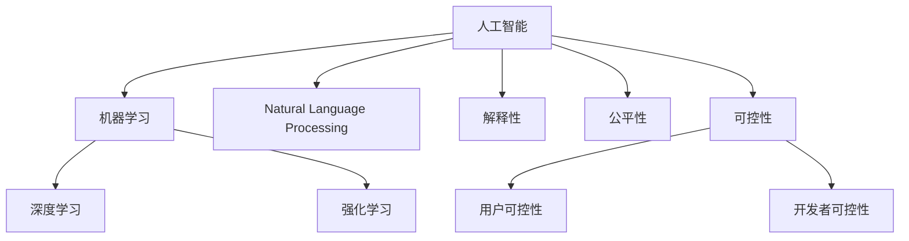

                 

# 软件 2.0 的伦理问题：公平性和可控性

## 1. 背景介绍

随着人工智能和软件技术的飞速发展，我们迎来了软件2.0的新时代。人工智能和大数据技术的应用正在深刻改变社会的各个层面，从医疗健康到金融服务，从教育培训到娱乐传媒，AI技术已经渗透到各行各业。然而，在享受AI带来的便利和效率的同时，我们也需要关注其潜在的伦理问题，特别是公平性和可控性问题。

## 2. 核心概念与联系

### 2.1 核心概念概述

**公平性 (Fairness)** ：软件系统的公平性指的是在所有用户中，系统对每个人都应平等对待，不因个人背景、种族、性别、年龄等因素产生偏见。公平性是评估AI系统是否具备道德伦理的重要指标。

**可控性 (Controllability)** ：软件的可控性指的是用户或开发者对系统行为的可预测性和控制能力。在AI驱动的软件系统中，可控性意味着用户可以理解和干预系统的决策过程，而非“黑箱”操作。

为更好地理解软件2.0时代中公平性和可控性的关键问题，本节将介绍几个密切相关的核心概念：

- **人工智能 (Artificial Intelligence, AI)** ：通过计算机模拟人类智能行为的技术，包括学习、推理、感知、决策等能力。
- **机器学习 (Machine Learning, ML)** ：利用数据和算法，让计算机具备从数据中学习和预测的能力。
- **深度学习 (Deep Learning, DL)** ：一种特殊类型的机器学习，利用神经网络模拟人脑结构，进行复杂任务处理。
- **强化学习 (Reinforcement Learning, RL)** ：通过与环境的交互，通过奖励和惩罚机制，使模型学会最优策略。
- **自然语言处理 (Natural Language Processing, NLP)** ：处理和理解人类语言的AI技术，广泛应用于聊天机器人、语音识别、翻译等领域。
- **解释性 (Explainability)** ：指AI模型的决策过程可以被理解和解释，有助于提升系统的可控性和可信度。

这些核心概念之间的逻辑关系可以通过以下Mermaid流程图来展示：



这个流程图展示了一些关键概念之间的联系，包括AI如何在不同技术分支中的应用，以及解释性、公平性和可控性在AI系统中的重要性。

## 3. 核心算法原理 & 具体操作步骤

### 3.1 算法原理概述

软件2.0时代的算法原理，以机器学习和深度学习为核心。在实现公平性和可控性的过程中，我们需要借助这些技术，进行模型训练、优化和应用。

- **监督学习 (Supervised Learning)** ：通过标注好的数据集，训练模型进行分类或回归任务。监督学习可以用来训练公平的预测模型，但需要注意训练数据的质量和多样性。

- **无监督学习 (Unsupervised Learning)** ：不需要标注数据，通过数据的内在关系进行聚类、降维等任务。无监督学习可以用来发现数据中的潜在公平性问题，但需要谨慎处理数据分布不均的情况。

- **强化学习 (Reinforcement Learning)** ：通过与环境的交互，优化策略。强化学习可以用来训练可控的智能系统，但需要确保环境的稳定性和策略的鲁棒性。

- **深度学习 (Deep Learning)** ：通过多层神经网络进行特征提取和任务学习。深度学习可以用来构建解释性良好的模型，但需要控制模型的复杂度，避免过拟合。

### 3.2 算法步骤详解

基于公平性和可控性的软件系统开发，一般包括以下几个关键步骤：

**Step 1: 数据收集与处理**
- 收集具有代表性的数据集，确保数据的多样性和平衡性。
- 对数据进行清洗、标注和归一化处理。

**Step 2: 模型选择与训练**
- 选择合适的机器学习或深度学习模型，如线性回归、支持向量机、卷积神经网络等。
- 在标注数据上训练模型，优化模型参数，确保模型性能。

**Step 3: 模型评估与调整**
- 使用测试集对模型进行评估，计算准确率、召回率、F1值等指标。
- 根据评估结果，调整模型参数或训练策略，提升模型性能。

**Step 4: 模型部署与应用**
- 将训练好的模型部署到生产环境中，集成到软件系统中。
- 监控模型性能，定期重新训练模型，适应数据分布的变化。

**Step 5: 伦理审查与优化**
- 定期进行伦理审查，评估系统公平性和可控性。
- 根据审查结果，优化模型，提升系统的公平性和可控性。

### 3.3 算法优缺点

软件2.0时代中，基于公平性和可控性的算法具有以下优点：

- **高效性**：使用机器学习和深度学习技术，可以快速构建高性能的预测和决策模型。
- **灵活性**：模型可以适应不同的数据分布和任务需求，灵活性较高。
- **可解释性**：部分模型（如决策树、线性回归）具有较好的可解释性，便于用户理解和干预。

同时，这些算法也存在一定的局限性：

- **数据依赖性**：模型性能依赖于标注数据的数量和质量，数据获取成本较高。
- **模型复杂度**：深度学习模型参数量大，训练和推理资源消耗高。
- **公平性挑战**：模型可能存在数据偏差，导致预测结果不公平。
- **可控性不足**：部分模型（如黑盒模型）难以解释其内部工作机制，用户难以理解和干预。

尽管存在这些局限性，但就目前而言，基于公平性和可控性的算法仍是构建软件2.0时代软件系统的核心技术手段。未来相关研究的方向在于如何进一步降低数据依赖，提高模型的解释性，以及提升系统的公平性和可控性。

### 3.4 算法应用领域

基于公平性和可控性的软件算法，已经在许多领域得到了广泛的应用：

- **金融风控**：通过监督学习训练模型，对客户信用进行评估，确保金融产品的公平分配。
- **医疗诊断**：使用无监督学习分析病历数据，发现潜在的健康风险，提升诊断准确性。
- **教育评估**：构建深度学习模型，对学生的学习效果进行预测，帮助教师个性化教学。
- **智能客服**：强化学习应用于对话系统，提升用户体验，确保客服服务公平和可控。
- **自动驾驶**：通过强化学习优化自动驾驶策略，确保行车安全，提升系统可控性。
- **智能推荐**：利用无监督学习和深度学习，推荐个性化的产品和服务，增强用户满意度和公平性。

除了上述这些经典应用外，基于公平性和可控性的算法也被创新性地应用到更多场景中，如自动生成文本、智能合约、隐私保护等，为软件2.0时代的技术发展提供了新的方向。

## 4. 数学模型和公式 & 详细讲解 & 举例说明

### 4.1 数学模型构建

本节将使用数学语言对基于公平性和可控性的软件系统开发进行更加严格的刻画。

假设软件系统中的决策函数为 $f(x)$，其中 $x$ 为输入特征向量，$f(x)$ 为输出结果。在基于监督学习的公平性评估中，我们通常使用以下模型：

$$
f(x; \theta) = \phi(x)^\top W\phi(x) + b
$$

其中 $\phi(x)$ 为特征映射函数，$W$ 和 $b$ 为模型参数。

### 4.2 公式推导过程

在公平性评估中，我们通常使用组内平方误差 (Group Intra-Class Error, GI) 作为评估指标。组内平方误差定义为模型在每个组内（即每个类别）的平方误差之和：

$$
GI = \sum_{g=1}^G \frac{1}{|C_g|} \sum_{x \in C_g} (y - f(x))^2
$$

其中 $G$ 为组数（即类别数），$C_g$ 为第 $g$ 个组（即第 $g$ 个类别），$y$ 为真实标签，$f(x)$ 为模型预测结果。

根据组内平方误差，我们可以进一步计算公平性指标。例如，使用等效误差 (Equivalent Error, E) 作为评估指标，其定义为模型在每个组内的预测误差之和：

$$
E = \sum_{g=1}^G \frac{1}{|C_g|} \sum_{x \in C_g} (y - f(x))
$$

### 4.3 案例分析与讲解

考虑一个医疗诊断系统，使用监督学习训练模型，对患者的病情进行分类预测。假设模型训练数据集包含两个组：健康组和患病组。模型在健康组的预测误差为 $0.2$，在患病组的预测误差为 $0.5$。

我们可以计算组内平方误差和等效误差：

$$
GI = \frac{0.2^2 + 0.5^2}{2}
$$

$$
E = \frac{0.2 + 0.5}{2}
$$

从结果可以看出，患病组的预测误差显著高于健康组，表明模型在处理不同组别时存在不公平性。

## 5. 项目实践：代码实例和详细解释说明

### 5.1 开发环境搭建

在进行软件系统开发前，我们需要准备好开发环境。以下是使用Python进行TensorFlow开发的环境配置流程：

1. 安装Anaconda：从官网下载并安装Anaconda，用于创建独立的Python环境。

2. 创建并激活虚拟环境：
```bash
conda create -n tf-env python=3.8 
conda activate tf-env
```

3. 安装TensorFlow：根据CUDA版本，从官网获取对应的安装命令。例如：
```bash
conda install tensorflow-gpu=2.4 -c conda-forge -c pytorch
```

4. 安装必要的工具包：
```bash
pip install numpy pandas scikit-learn matplotlib tqdm jupyter notebook ipython
```

完成上述步骤后，即可在`tf-env`环境中开始软件系统开发。

### 5.2 源代码详细实现

以下是一个基于TensorFlow实现公平性评估的示例代码：

```python
import tensorflow as tf
from tensorflow.keras.datasets import boston_housing
from sklearn.metrics import mean_squared_error

# 加载波士顿房价数据集
(x_train, y_train), (x_test, y_test) = boston_housing.load_data()

# 定义模型
model = tf.keras.Sequential([
    tf.keras.layers.Dense(64, activation='relu', input_shape=(13,)),
    tf.keras.layers.Dense(64, activation='relu'),
    tf.keras.layers.Dense(1)
])

# 编译模型
model.compile(optimizer='adam', loss='mse')

# 训练模型
model.fit(x_train, y_train, epochs=10, batch_size=32)

# 评估模型
mse_train = mean_squared_error(y_train, model.predict(x_train))
mse_test = mean_squared_error(y_test, model.predict(x_test))

print(f'训练集均方误差：{mse_train:.4f}')
print(f'测试集均方误差：{mse_test:.4f}')
```

在这个示例中，我们使用TensorFlow构建了一个简单的线性回归模型，对波士顿房价数据集进行训练和评估。通过计算均方误差，可以评估模型在训练集和测试集上的性能。

### 5.3 代码解读与分析

让我们再详细解读一下关键代码的实现细节：

**数据加载**：使用TensorFlow的内置数据集加载器，加载波士顿房价数据集。

**模型定义**：定义了一个包含两个全连接层的神经网络模型，输出层为线性回归模型。

**模型编译**：使用Adam优化器，设置均方误差作为损失函数。

**模型训练**：对模型进行10轮训练，每轮训练使用32个样本。

**模型评估**：使用均方误差评估模型在训练集和测试集上的性能。

可以看到，TensorFlow的API非常简洁高效，使得模型训练和评估变得非常方便。

## 6. 实际应用场景

### 6.1 医疗诊断系统

基于软件2.0技术的医疗诊断系统，可以帮助医生快速、准确地诊断疾病。在实现过程中，公平性和可控性是不可或缺的考量因素。

在医疗数据中，可能存在性别、年龄、种族等敏感因素。为了避免模型对这些因素产生偏见，需要在使用数据进行模型训练时，进行数据平衡处理，确保不同组别在数据集中均衡分布。同时，确保模型的解释性和可控性，医生可以理解和干预模型的诊断过程，避免“黑箱”操作。

### 6.2 智能推荐系统

智能推荐系统通过分析用户的历史行为和兴趣，推荐个性化的产品和服务。公平性和可控性决定了系统推荐的公平性和可信度。

在推荐算法中，公平性需要确保推荐结果不受用户性别、年龄、地域等个体差异的影响。为了提升系统的公平性，可以使用多种数据集和特征进行模型训练，避免单一数据源带来的偏见。可控性则需要确保推荐过程透明、可解释，用户可以理解推荐依据和策略。

### 6.3 自动驾驶系统

自动驾驶系统通过感知和决策技术，实现车辆自主驾驶。公平性和可控性对于确保行车安全、提升用户体验至关重要。

在自动驾驶中，公平性需要确保系统在各种路况下表现一致，不因车辆品牌、车型等因素产生偏见。可控性则需要确保系统决策透明、可解释，用户可以理解和干预系统的决策过程，避免误判和错误。

### 6.4 未来应用展望

随着软件2.0技术的不断发展，基于公平性和可控性的软件系统将在更多领域得到应用，为社会带来深远影响。

在智慧城市管理中，基于公平性和可控性的智能监控系统，可以实时监测城市运行状态，提升城市治理效率和公平性。在金融服务中，基于公平性和可控性的风险评估系统，可以确保金融产品公平分配，提升客户满意度。

## 7. 工具和资源推荐

### 7.1 学习资源推荐

为了帮助开发者系统掌握软件2.0时代公平性和可控性的理论基础和实践技巧，这里推荐一些优质的学习资源：

1. 《机器学习实战》书籍：介绍机器学习的基本概念和实现方法，涵盖监督学习、无监督学习、强化学习等核心内容。

2. 《深度学习》课程：斯坦福大学提供的深度学习课程，深入讲解深度学习的基本原理和应用，包括TensorFlow和PyTorch等框架的使用。

3. 《强化学习》书籍：由Richard Sutton和Andrew Barto合著，系统介绍强化学习的理论和应用，涵盖Q-learning、SARSA等核心算法。

4. 《NLP理论与实践》课程：由清华大学开设的NLP课程，涵盖自然语言处理的基本概念和实现方法，包括情感分析、文本分类等任务。

5. Kaggle平台：数据科学和机器学习竞赛平台，提供丰富的数据集和算法竞赛，有助于学习者在实践中提升技能。

通过对这些资源的学习实践，相信你一定能够快速掌握软件2.0时代公平性和可控性的精髓，并用于解决实际的系统问题。

### 7.2 开发工具推荐

高效的开发离不开优秀的工具支持。以下是几款用于软件2.0系统开发的常用工具：

1. TensorFlow：由Google主导开发的开源深度学习框架，生产部署方便，适合大规模工程应用。

2. PyTorch：基于Python的开源深度学习框架，灵活动态的计算图，适合快速迭代研究。

3. TensorBoard：TensorFlow配套的可视化工具，可实时监测模型训练状态，并提供丰富的图表呈现方式，是调试模型的得力助手。

4. Kaggle平台：数据科学和机器学习竞赛平台，提供丰富的数据集和算法竞赛，有助于学习者在实践中提升技能。

5. Weights & Biases：模型训练的实验跟踪工具，可以记录和可视化模型训练过程中的各项指标，方便对比和调优。

6. Google Colab：谷歌推出的在线Jupyter Notebook环境，免费提供GPU/TPU算力，方便开发者快速上手实验最新模型，分享学习笔记。

合理利用这些工具，可以显著提升软件2.0系统开发的效率，加快创新迭代的步伐。

### 7.3 相关论文推荐

软件2.0时代中，公平性和可控性的研究源于学界的持续研究。以下是几篇奠基性的相关论文，推荐阅读：

1. "The Fairness of Machine Learning Algorithms"：探讨机器学习模型中的公平性问题，提出了一系列公平性评估指标和改进方法。

2. "A Survey on Fairness in Machine Learning"：综述了机器学习领域中的公平性问题，包括公平性定义、评估指标和改进策略。

3. "Controllability of Deep Neural Networks"：研究深度神经网络的可控性问题，提出了一系列可控性评估方法和改进策略。

4. "Explainable AI: Interpreting and Explaining Machine Learning Models and Predictions"：探讨深度学习模型的可解释性问题，提出了一系列解释性方法和工具。

5. "Fairness and Accountability for Machines"：探讨AI系统的公平性和责任问题，提出了一系列公平性评估方法和改进策略。

这些论文代表了大语言模型微调技术的发展脉络。通过学习这些前沿成果，可以帮助研究者把握学科前进方向，激发更多的创新灵感。

## 8. 总结：未来发展趋势与挑战

### 8.1 总结

本文对基于公平性和可控性的软件系统开发进行了全面系统的介绍。首先阐述了软件2.0时代中公平性和可控性的关键问题，明确了这些问题是评估AI系统是否具备道德伦理的重要指标。其次，从原理到实践，详细讲解了软件系统开发过程中的关键步骤，给出了实现公平性和可控性的具体方法。同时，本文还广泛探讨了公平性和可控性在医疗、金融、自动驾驶等领域的实际应用，展示了其在软件2.0时代的重要性。此外，本文精选了相关学习资源和开发工具，力求为开发者提供全方位的技术指引。

通过本文的系统梳理，可以看到，基于公平性和可控性的软件系统开发在软件2.0时代具有广阔的前景，为构建可信、透明、公平的AI系统奠定了基础。未来，伴随软件技术的不断演进，公平性和可控性也将成为AI系统开发和应用的重要考量因素。

### 8.2 未来发展趋势

展望未来，软件2.0时代中公平性和可控性的发展趋势如下：

1. **技术进步**：随着深度学习、强化学习等技术的发展，软件系统的公平性和可控性将得到进一步提升。复杂模型和高维数据的处理能力，将使得系统更加准确、透明。

2. **政策法规**：随着AI技术的普及，各国政府将出台更多政策和法规，确保AI系统的公平性和可控性。政策导向将推动企业在设计和开发中更加注重这些关键问题。

3. **数据管理**：数据隐私和安全将成为AI系统开发的重要课题。数据管理技术的发展，将帮助企业在数据收集和处理中遵循数据保护原则，保障用户隐私。

4. **可解释性增强**：模型解释性技术将进一步发展，使得AI系统的决策过程更加透明，便于用户理解和干预。

5. **伦理监督**：AI系统开发和应用过程中，将需要引入伦理监督机制，确保系统公平性和可控性符合伦理标准。

6. **普适性提升**：AI系统将更加关注普适性问题，确保在各种环境、人群中表现一致，避免偏见和歧视。

以上趋势凸显了软件2.0时代中公平性和可控性的广阔前景。这些方向的探索发展，将使得AI系统更加可信、透明、公平，为用户提供更加优质的服务体验。

### 8.3 面临的挑战

尽管软件2.0技术在公平性和可控性方面取得了一定的进展，但在迈向更加智能化、普适化应用的过程中，它仍面临着诸多挑战：

1. **数据获取难度**：高质量数据集是公平性和可控性评估的基础，但获取难度较大，数据分布不均。

2. **模型复杂度**：深度学习模型的参数量和计算量较大，资源消耗高。

3. **解释性不足**：部分模型（如黑盒模型）难以解释其内部工作机制，用户难以理解和干预。

4. **偏见与歧视**：模型可能存在数据偏差，导致预测结果不公平。

5. **可控性问题**：部分模型难以解释其决策依据，用户难以理解和干预。

6. **法律法规**：AI系统在数据保护、隐私安全等方面需要遵守法律法规，但相关法规尚不完善。

正视这些挑战，积极应对并寻求突破，将是未来软件2.0技术发展的重要方向。只有从数据、算法、工程、法律等多个维度协同发力，才能真正实现软件系统的公平性和可控性，为用户提供更加可信、透明、公平的AI服务。

### 8.4 研究展望

面向未来，软件2.0技术在公平性和可控性方面的研究可以关注以下几个方向：

1. **无监督学习**：探索无监督学习方法，降低对标注数据的需求，提高模型的泛化能力。

2. **公平性算法**：开发更加公平的算法，确保模型在各种人群中表现一致。

3. **可解释性技术**：提升模型的解释性，使得用户可以理解和干预模型的决策过程。

4. **伦理监督机制**：引入伦理监督机制，确保系统公平性和可控性符合伦理标准。

5. **普适性设计**：设计普适性强的系统，确保在各种环境、人群中表现一致。

6. **法律法规研究**：研究AI系统的法律法规，确保系统符合政策导向和社会伦理。

这些研究方向的探索，将进一步推动软件2.0技术的发展，使得AI系统更加可信、透明、公平，为用户带来更好的服务体验。

## 9. 附录：常见问题与解答

**Q1: 什么是公平性 (Fairness)?**

A: 公平性指的是软件系统对所有用户平等对待，不因个人背景、种族、性别、年龄等因素产生偏见。公平性是评估AI系统是否具备道德伦理的重要指标。

**Q2: 什么是可控性 (Controllability)?**

A: 可控性指的是用户或开发者对系统行为的可预测性和控制能力。在AI驱动的软件系统中，可控性意味着用户可以理解和干预系统的决策过程，而非“黑箱”操作。

**Q3: 如何评估公平性 (Fairness) 和可控性 (Controllability)?**

A: 公平性可以通过组内平方误差 (Group Intra-Class Error, GI) 等指标进行评估。可控性可以通过系统的透明性和解释性进行评估，确保用户可以理解和干预模型的决策过程。

**Q4: 如何在开发过程中保证公平性和可控性 (Fairness and Controllability)?**

A: 在数据收集和处理过程中，需要确保数据的多样性和平衡性。在模型训练和部署过程中，需要确保模型的透明性和可解释性。同时，需要引入伦理监督机制，确保系统符合伦理标准。

**Q5: 未来软件2.0技术在公平性和可控性方面将面临哪些挑战?**

A: 数据获取难度、模型复杂度、解释性不足、偏见与歧视、可控性问题、法律法规等，将是未来软件2.0技术在公平性和可控性方面面临的主要挑战。

---

作者：禅与计算机程序设计艺术 / Zen and the Art of Computer Programming

