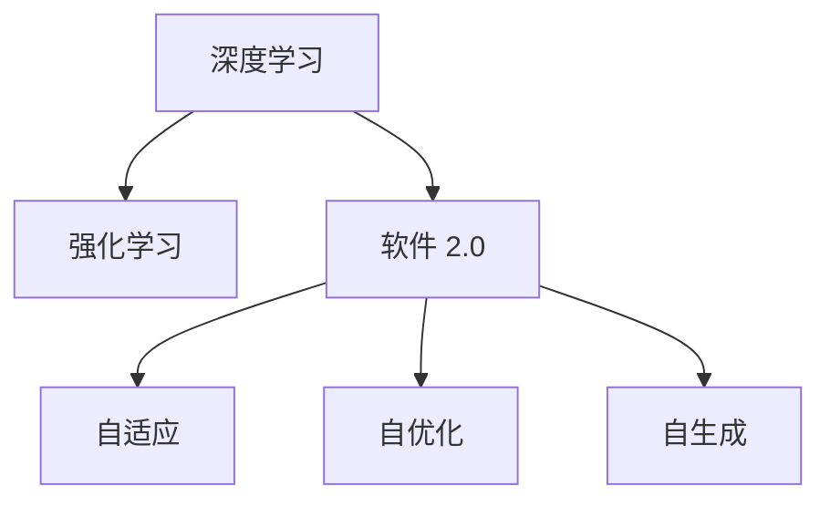

                 

# 软件 2.0 的发展趋势：深度学习、强化学习

## 1. 背景介绍

随着科技的迅猛发展，软件开发范式也经历了从传统编程到面向服务的演变，再到目前以数据和模型为中心的软件 2.0 阶段。深度学习和强化学习作为新一代人工智能技术，正在引领软件 2.0 的发展潮流，将软件系统推向更加智能、自适应和自动化的未来。

### 1.1 问题由来

在过去几十年里，软件开发范式经历了显著的变化。早期，软件主要以功能为主导，程序员手工编写代码实现功能模块。后来，随着互联网和 Web 技术的发展，面向服务的架构(SOA)逐渐成为主流，系统通过标准化的 API 进行通信和服务集成。但这些范式仍然存在一定局限性，如人工调优困难、系统复杂度高、扩展性差等。

为了解决这些问题，研究者提出了基于深度学习和强化学习的新型软件开发范式，即软件 2.0。通过构建数据驱动和模型驱动的系统，软件 2.0 能够自动地从数据中学习并优化，显著提升系统的性能、可靠性和适应性。深度学习和强化学习作为核心技术，正在推动这一范式的普及和应用。

### 1.2 问题核心关键点

软件 2.0 的核心在于通过深度学习和强化学习技术，使软件系统具备以下能力：
- **自适应**：能够根据环境变化动态调整内部策略和参数。
- **自优化**：能够自动从数据中学习最优解，持续改进系统性能。
- **自生成**：能够自动生成新的代码、数据流等，以应对不断变化的需求。

这些能力使得软件系统能够更加灵活、高效地应对复杂多变的现实问题，进一步提升软件开发效率和用户体验。

### 1.3 问题研究意义

研究软件 2.0 的发展趋势，对于推动新一代软件技术的迭代、促进人工智能技术的广泛应用、加速软件系统智能化转型，具有重要意义：

1. **提升开发效率**：通过自动化和智能化工具，显著降低软件开发和维护的复杂度和成本。
2. **增强系统性能**：深度学习和强化学习技术能够在海量数据上自学习和自优化，大幅提升系统的精度和响应速度。
3. **扩展应用场景**：软件 2.0 技术可以应用于各个领域，如自动驾驶、金融分析、医疗诊断等，推动人工智能在垂直行业的落地应用。
4. **促进技术创新**：软件 2.0 框架下的技术和工具不断演进，催生了新的算法和模型，推动了人工智能技术的研究和应用。
5. **提升用户体验**：自适应的系统和自优化的算法，能够实时响应用户需求，提供个性化、高效的用户体验。

## 2. 核心概念与联系

### 2.1 核心概念概述

为了更好地理解软件 2.0 的发展趋势，本节将介绍几个关键概念及其相互联系：

- **深度学习**：基于神经网络架构，通过多层非线性变换，学习输入数据的复杂特征和规律。深度学习在大规模数据分析和复杂任务建模中表现出卓越的性能。
- **强化学习**：通过智能体与环境的交互，通过试错学习最优策略的过程。强化学习在动态复杂环境中能够自适应地优化决策。
- **软件 2.0**：以数据和模型为中心，通过深度学习和强化学习技术，实现软件系统的自动化、智能化和自适应性。

这些概念之间的逻辑关系可以通过以下 Mermaid 流程图来展示：



这个流程图展示了深度学习和强化学习在软件 2.0 中的作用，以及软件 2.0 系统具备的核心能力。

## 3. 核心算法原理 & 具体操作步骤

### 3.1 算法原理概述

深度学习和强化学习在软件 2.0 中分别扮演着重要的角色。深度学习主要应用于模型驱动的系统和结构化数据分析，强化学习则用于自适应的决策和优化过程。

**深度学习算法**：
- 输入：原始数据或特征表示
- 模型：多层神经网络结构
- 输出：复杂特征和模式学习
- 目标：最小化损失函数，优化模型参数

**强化学习算法**：
- 输入：环境状态和策略
- 模型：智能体和环境交互
- 输出：最优策略
- 目标：最大化累计回报

结合深度学习和强化学习，软件 2.0 系统能够从数据中自动学习最优决策和优化算法，提升系统的性能和自适应能力。

### 3.2 算法步骤详解

#### 3.2.1 深度学习算法步骤

1. **数据准备**：收集和预处理数据，确保数据质量和多样性。
2. **模型选择**：选择合适的神经网络结构和算法，如卷积神经网络(CNN)、循环神经网络(RNN)等。
3. **特征工程**：设计有效的特征提取和表示方法，如嵌入层、池化层等。
4. **模型训练**：使用反向传播算法训练模型，最小化损失函数，优化模型参数。
5. **模型评估**：在验证集和测试集上评估模型性能，调整参数。

#### 3.2.2 强化学习算法步骤

1. **环境建模**：定义环境的状态空间和动作空间，设计状态转换规则。
2. **智能体设计**：选择合适的智能体模型，如 Q-Learning、策略梯度等。
3. **策略选择**：根据当前状态选择动作策略。
4. **状态更新**：根据动作和环境反馈更新状态。
5. **策略优化**：使用 Q-Learning 等方法优化策略，最大化累计回报。

### 3.3 算法优缺点

深度学习和强化学习在软件 2.0 中各具优势：

#### 深度学习优点：
- **可解释性差**：深层神经网络具有黑盒特性，难以解释模型的内部工作机制。
- **高泛化能力**：能够处理复杂非线性关系，适用于多种任务。
- **可扩展性高**：在大规模数据上训练深度学习模型，能够提升系统的复杂度和精度。

#### 强化学习优点：
- **自适应性强**：能够在动态环境中自动调整策略，提升决策效果。
- **样本效率高**：通过试错学习，能够在短时间内找到最优策略。
- **鲁棒性好**：能够处理部分观察和噪声干扰，适应复杂环境。

#### 深度学习缺点：
- **计算资源需求高**：深度学习模型需要大量计算资源进行训练和推理。
- **模型过拟合风险高**：在有限数据下容易出现过拟合，导致模型泛化能力下降。
- **训练时间长**：深度学习模型通常需要较长的训练时间才能收敛。

#### 强化学习缺点：
- **环境建模困难**：需要精确建模环境状态和动作空间，对环境和策略设计要求高。
- **探索与利用冲突**：在实际应用中，需要平衡探索未知领域和利用已有经验，避免策略不稳定。
- **局部最优风险高**：强化学习容易陷入局部最优，难以全局优化。

### 3.4 算法应用领域

深度学习和强化学习在软件 2.0 中的应用领域广泛，涵盖以下几个方面：

1. **自动驾驶**：通过深度学习模型处理传感器数据，使用强化学习优化驾驶策略，提升车辆行驶安全和效率。
2. **金融分析**：使用深度学习模型进行量化交易和风险管理，使用强化学习优化投资组合和策略调整。
3. **医疗诊断**：使用深度学习模型进行图像和文本分析，使用强化学习优化治疗方案和手术策略。
4. **智能客服**：通过深度学习模型处理用户请求，使用强化学习优化对话策略，提升客户满意度。
5. **智能推荐**：使用深度学习模型提取用户偏好，使用强化学习优化推荐算法，提升推荐准确性和用户体验。
6. **智能制造**：使用深度学习模型进行质量检测和过程优化，使用强化学习优化生产调度和资源分配。

以上应用领域展示了深度学习和强化学习在软件 2.0 中的巨大潜力和广泛应用前景。

## 4. 数学模型和公式 & 详细讲解 & 举例说明

### 4.1 数学模型构建

#### 4.1.1 深度学习模型构建

深度学习模型通常基于多层神经网络，其数学模型可以表示为：

$$
f(x) = W_n f_{n-1}(x) + b_n
$$

其中，$x$ 为输入，$W_n$ 和 $b_n$ 为第 $n$ 层的权重和偏置，$f_{n-1}$ 为前一层的输出。最终输出 $y$ 表示为：

$$
y = f_n(x) = W_n f_{n-1}(x) + b_n
$$

深度学习模型通过反向传播算法，最小化损失函数 $\mathcal{L}$，优化权重和偏置：

$$
\mathcal{L} = \sum_i \frac{1}{N} (y_i - \hat{y}_i)^2
$$

其中，$y_i$ 为真实标签，$\hat{y}_i$ 为模型预测。

#### 4.1.2 强化学习模型构建

强化学习模型通常基于 Q-Learning 算法，其数学模型可以表示为：

$$
Q(s,a) = r + \gamma \max_a Q(s',a')
$$

其中，$s$ 为当前状态，$a$ 为动作，$r$ 为即时奖励，$s'$ 为下一个状态，$a'$ 为下一个动作。

强化学习模型通过迭代优化策略 $\pi(a|s)$，最大化累计回报 $R$：

$$
R = \sum_i r_i + \gamma \sum_i \max_a Q(s_i, a)
$$

其中，$\gamma$ 为折扣因子，$R$ 为累计回报。

### 4.2 公式推导过程

#### 4.2.1 深度学习公式推导

深度学习模型的反向传播算法基于链式法则，其推导过程如下：

1. **前向传播**：将输入 $x$ 依次通过多层神经网络，计算输出 $y$。
2. **误差计算**：计算预测值 $y$ 与真实值 $y'$ 的误差 $\Delta y$。
3. **反向传播**：从输出层到输入层反向传播误差，计算各层权重和偏置的梯度。
4. **参数更新**：使用梯度下降算法更新权重和偏置，最小化损失函数。

#### 4.2.2 强化学习公式推导

Q-Learning 算法的推导过程如下：

1. **状态选择**：根据当前状态 $s$ 选择动作 $a$，计算即时奖励 $r$ 和下一个状态 $s'$。
2. **Q值更新**：更新当前状态 $s$ 的动作 $a$ 的 Q 值，使用贝尔曼方程。
3. **策略优化**：选择使累计回报最大的动作，更新策略 $\pi(a|s)$。

### 4.3 案例分析与讲解

#### 4.3.1 深度学习案例：图像分类

假设有一个图像分类任务，使用深度学习模型进行训练和推理：

1. **数据准备**：收集大量图像数据，进行预处理和划分训练集、验证集和测试集。
2. **模型选择**：使用卷积神经网络模型，包括卷积层、池化层和全连接层。
3. **特征工程**：设计有效的卷积核和池化层，提取图像特征。
4. **模型训练**：使用反向传播算法训练模型，优化权重和偏置。
5. **模型评估**：在验证集和测试集上评估模型性能，调整超参数。

#### 4.3.2 强化学习案例：机器人路径规划

假设有一个机器人路径规划任务，使用强化学习模型进行训练和优化：

1. **环境建模**：定义环境状态空间和动作空间，设计状态转换规则。
2. **智能体设计**：使用 Q-Learning 算法，设计机器人路径规划模型。
3. **状态更新**：根据机器人动作和环境反馈，更新状态。
4. **策略优化**：优化路径规划策略，最大化机器人到达目标点的累计奖励。
5. **策略应用**：在实际环境中测试优化后的策略，评估路径规划效果。

## 5. 项目实践：代码实例和详细解释说明

### 5.1 开发环境搭建

进行深度学习和强化学习项目实践，需要以下开发环境：

1. **Python 环境**：安装 Python 3.7 或更高版本，使用 Anaconda 或 Miniconda 创建虚拟环境。
2. **深度学习库**：安装 TensorFlow、PyTorch、Keras 等深度学习库。
3. **强化学习库**：安装 OpenAI Gym、Stable Baselines 等强化学习库。
4. **其他工具**：安装 NumPy、Pandas、Matplotlib 等数据处理和可视化工具。

### 5.2 源代码详细实现

#### 5.2.1 深度学习示例：图像分类

```python
import tensorflow as tf
from tensorflow.keras import layers

# 定义模型结构
model = tf.keras.Sequential([
    layers.Conv2D(32, (3, 3), activation='relu', input_shape=(32, 32, 3)),
    layers.MaxPooling2D((2, 2)),
    layers.Conv2D(64, (3, 3), activation='relu'),
    layers.MaxPooling2D((2, 2)),
    layers.Flatten(),
    layers.Dense(64, activation='relu'),
    layers.Dense(10)
])

# 编译模型
model.compile(optimizer='adam', loss=tf.keras.losses.SparseCategoricalCrossentropy(from_logits=True), metrics=['accuracy'])

# 训练模型
model.fit(train_images, train_labels, epochs=10, validation_data=(val_images, val_labels))

# 评估模型
test_loss, test_acc = model.evaluate(test_images, test_labels)
print('Test accuracy:', test_acc)
```

#### 5.2.2 强化学习示例：机器人路径规划

```python
import gym
from stable_baselines3 import PPO
from stable_baselines3.common.vec_env import DummyVecEnv

# 定义环境
env = DummyVecEnv([lambda: gym.make('CartPole-v1')])

# 定义模型
model = PPO.load('path/to/trained/model')

# 测试模型
obs = env.reset()
for t in range(1000):
    action, _states = model.predict(obs)
    obs, rewards, done, info = env.step(action)
    print('Episode:', t+1, 'Rewards:', rewards)
    if done:
        obs = env.reset()
```

### 5.3 代码解读与分析

#### 5.3.1 深度学习代码解读

```python
# 定义模型结构
model = tf.keras.Sequential([
    layers.Conv2D(32, (3, 3), activation='relu', input_shape=(32, 32, 3)),
    layers.MaxPooling2D((2, 2)),
    layers.Conv2D(64, (3, 3), activation='relu'),
    layers.MaxPooling2D((2, 2)),
    layers.Flatten(),
    layers.Dense(64, activation='relu'),
    layers.Dense(10)
])

# 编译模型
model.compile(optimizer='adam', loss=tf.keras.losses.SparseCategoricalCrossentropy(from_logits=True), metrics=['accuracy'])

# 训练模型
model.fit(train_images, train_labels, epochs=10, validation_data=(val_images, val_labels))

# 评估模型
test_loss, test_acc = model.evaluate(test_images, test_labels)
print('Test accuracy:', test_acc)
```

- **模型结构**：使用卷积神经网络，包括卷积层、池化层和全连接层。
- **模型编译**：选择 Adam 优化器和交叉熵损失函数，评估指标为准确率。
- **模型训练**：使用训练数据集进行训练，验证集进行验证，迭代 10 次。
- **模型评估**：在测试集上评估模型性能，输出测试准确率。

#### 5.3.2 强化学习代码解读

```python
import gym
from stable_baselines3 import PPO
from stable_baselines3.common.vec_env import DummyVecEnv

# 定义环境
env = DummyVecEnv([lambda: gym.make('CartPole-v1')])

# 定义模型
model = PPO.load('path/to/trained/model')

# 测试模型
obs = env.reset()
for t in range(1000):
    action, _states = model.predict(obs)
    obs, rewards, done, info = env.step(action)
    print('Episode:', t+1, 'Rewards:', rewards)
    if done:
        obs = env.reset()
```

- **环境定义**：使用 OpenAI Gym 环境，定义状态空间和动作空间。
- **模型加载**：加载预训练的 PPO 模型。
- **模型测试**：在环境中进行模拟测试，输出每个 episode 的奖励。

## 6. 实际应用场景

### 6.1 智能推荐系统

智能推荐系统是深度学习和强化学习的典型应用场景之一。通过深度学习模型提取用户行为数据和物品特征，使用强化学习优化推荐策略，提升推荐准确性和用户满意度。

#### 6.1.1 应用实例

- **电商平台**：使用深度学习模型分析用户浏览、点击、购买等行为数据，使用强化学习优化推荐策略，提升销售额和用户留存率。
- **视频平台**：使用深度学习模型分析用户观看行为和偏好，使用强化学习优化视频推荐算法，提升用户粘性和内容点击率。

#### 6.1.2 未来展望

随着深度学习和强化学习技术的进步，智能推荐系统将更加智能化、个性化和实时化。未来有望实现跨设备、跨平台的用户协同推荐，提升推荐系统的综合效果。

### 6.2 自动驾驶

自动驾驶系统是深度学习和强化学习的另一大应用场景。通过深度学习模型处理传感器数据，使用强化学习优化驾驶策略，提升车辆行驶安全和效率。

#### 6.2.1 应用实例

- **LIDAR 感知**：使用深度学习模型处理 LIDAR 数据，提取道路、车辆等关键信息，使用强化学习优化路径规划和避障策略。
- **行为决策**：使用深度学习模型分析交通信号、行人等信息，使用强化学习优化行驶策略，保证行车安全和效率。

#### 6.2.2 未来展望

随着深度学习和强化学习技术的进步，自动驾驶系统将更加智能化、可靠化和普及化。未来有望实现全无人驾驶，提升交通出行效率和安全性。

### 6.3 智能客服

智能客服系统是深度学习和强化学习的典型应用场景之一。通过深度学习模型处理用户请求，使用强化学习优化对话策略，提升客户满意度和系统响应速度。

#### 6.3.1 应用实例

- **客户咨询**：使用深度学习模型分析用户查询意图，使用强化学习优化对话策略，提升客户解答效率和满意度。
- **自动化客服**：使用深度学习模型处理多轮对话数据，使用强化学习优化对话策略，实现自动化客服机器人。

#### 6.3.2 未来展望

随着深度学习和强化学习技术的进步，智能客服系统将更加智能化、人性化和高效率。未来有望实现全天候、多语言支持，提升客户体验和运营效率。

## 7. 工具和资源推荐

### 7.1 学习资源推荐

为了帮助开发者系统掌握深度学习和强化学习的理论基础和实践技巧，这里推荐一些优质的学习资源：

1. **《深度学习》书籍**：Ian Goodfellow、Yoshua Bengio 和 Aaron Courville 的《深度学习》经典教材，全面介绍深度学习的基本概念和算法。
2. **《强化学习》书籍**：Richard S. Sutton 和 Andrew G. Barto 的《强化学习》，系统讲解强化学习的原理和算法。
3. **Coursera 深度学习课程**：由深度学习领域的专家讲授，涵盖深度学习的基本理论和实践技巧。
4. **DeepLearning.ai 深度学习专业课程**：由 Andrew Ng 创办的在线课程，涵盖深度学习的基本理论和实践技巧。
5. **OpenAI Gym 教程**：提供丰富的强化学习环境和示例，帮助开发者快速上手强化学习。

通过对这些资源的学习实践，相信你一定能够快速掌握深度学习和强化学习的精髓，并用于解决实际的 NLP 问题。

### 7.2 开发工具推荐

高效的开发离不开优秀的工具支持。以下是几款用于深度学习和强化学习开发的常用工具：

1. **TensorFlow**：由 Google 开发的开源深度学习框架，支持 GPU 和分布式计算，适合大规模工程应用。
2. **PyTorch**：由 Facebook 开发的开源深度学习框架，支持动态计算图和 JIT 编译，适合研究和原型开发。
3. **OpenAI Gym**：由 OpenAI 提供的强化学习环境，支持多种环境和算法，方便开发者进行实验和调试。
4. **Ray**：由 Reddit 开源的分布式计算框架，支持多种任务和算法，适合大规模分布式训练和推理。
5. **JAX**：由 Google 开发的开源深度学习框架，支持 GPU 和分布式计算，适合高性能计算和深度学习。

合理利用这些工具，可以显著提升深度学习和强化学习任务的开发效率，加快创新迭代的步伐。

### 7.3 相关论文推荐

深度学习和强化学习的发展源于学界的持续研究。以下是几篇奠基性的相关论文，推荐阅读：

1. **ImageNet Classification with Deep Convolutional Neural Networks**：Alex Krizhevsky、Ilya Sutskever 和 Geoffrey Hinton 的 ImageNet 图像分类论文，展示了深度学习在计算机视觉领域的强大能力。
2. **Playing Atari with Deep Reinforcement Learning**：Volodymyr Mnih 等人发表的 Atari 游戏强化学习论文，展示了强化学习在游戏领域的应用潜力。
3. **AlphaGo Zero**：David Silver 等人发表的 AlphaGo Zero 论文，展示了强化学习在复杂博弈问题中的应用。
4. **Deep Learning**：Ian Goodfellow、Yoshua Bengio 和 Aaron Courville 的《深度学习》教材，全面介绍深度学习的基本概念和算法。
5. **GANS vs. variational autoencoders: A brief comparison**：Ian Goodfellow 等人发表的 GANs 和变分自编码器对比论文，展示了深度学习在生成对抗网络中的应用。

这些论文代表了大深度学习和强化学习的发展脉络。通过学习这些前沿成果，可以帮助研究者把握学科前进方向，激发更多的创新灵感。

## 8. 总结：未来发展趋势与挑战

### 8.1 总结

本文对深度学习和强化学习在软件 2.0 中的应用进行了全面系统的介绍。首先阐述了深度学习和强化学习的基本概念和理论基础，明确了软件 2.0 框架下的软件系统具备的自适应、自优化和自生成能力。其次，从原理到实践，详细讲解了深度学习和强化学习在实际应用中的操作步骤，给出了深度学习和强化学习的代码实例。最后，广泛探讨了深度学习和强化学习在智能推荐、自动驾驶、智能客服等多个领域的应用前景，展示了软件 2.0 技术的巨大潜力和广泛应用前景。

通过本文的系统梳理，可以看到，深度学习和强化学习在软件 2.0 中的强大作用和广阔前景。这些技术正在推动新一代软件技术的迭代，促进人工智能技术的广泛应用，加速软件系统智能化转型。

### 8.2 未来发展趋势

展望未来，深度学习和强化学习在软件 2.0 中将呈现以下几个发展趋势：

1. **深度学习与强化学习融合**：深度学习和强化学习将更加紧密结合，形成深度强化学习模型，提升系统的复杂度和智能性。
2. **模型自适应能力增强**：深度学习和强化学习模型将具备更强的自适应能力，能够动态调整参数和策略，适应复杂的现实环境。
3. **多模态融合**：深度学习和强化学习将进一步融合多模态信息，如文本、图像、语音等，实现更全面、准确的信息建模和处理。
4. **自监督学习兴起**：深度学习和强化学习将更多应用自监督学习范式，从大规模非标注数据中学习知识，提高模型的泛化能力和鲁棒性。
5. **联邦学习普及**：深度学习和强化学习模型将更多应用联邦学习范式，在分布式环境中共享知识，提高模型性能和隐私保护。
6. **边缘计算集成**：深度学习和强化学习模型将更多集成到边缘计算环境中，提升系统的实时性和计算效率。

以上趋势展示了深度学习和强化学习在软件 2.0 中的广阔前景。这些方向的探索发展，必将进一步提升系统性能和自适应能力，推动软件技术的创新和应用。

### 8.3 面临的挑战

尽管深度学习和强化学习在软件 2.0 中展现了巨大的潜力，但在迈向更加智能化、普适化应用的过程中，它仍面临着诸多挑战：

1. **计算资源瓶颈**：深度学习和强化学习模型需要大量计算资源进行训练和推理，硬件资源不足将成为制约因素。
2. **模型泛化能力不足**：模型容易在有限数据下过拟合，泛化能力不足，难以应对复杂多变的环境。
3. **数据隐私和安全**：深度学习和强化学习模型需要大量数据进行训练，数据隐私和安全问题成为重要挑战。
4. **算法复杂度高**：深度学习和强化学习模型的设计和实现复杂度高，难以在实际应用中灵活应用。
5. **模型可解释性差**：深度学习和强化学习模型具有黑盒特性，难以解释内部工作机制和决策逻辑。
6. **鲁棒性和可靠性**：深度学习和强化学习模型在面对噪声、干扰等情况下，鲁棒性和可靠性有待提高。

正视深度学习和强化学习面临的这些挑战，积极应对并寻求突破，将是大深度学习和强化学习走向成熟的必由之路。相信随着学界和产业界的共同努力，这些挑战终将一一被克服，深度学习和强化学习必将在构建智能系统、优化业务决策、提升用户体验等方面发挥更大作用。

### 8.4 研究展望

面对深度学习和强化学习所面临的种种挑战，未来的研究需要在以下几个方面寻求新的突破：

1. **多模态深度学习**：将文本、图像、语音等多模态数据融合，构建多模态深度学习模型，提升模型的泛化能力和鲁棒性。
2. **自适应深度学习**：研究自适应深度学习算法，使模型能够在动态环境中自动调整参数和策略，提升自适应能力。
3. **联邦深度学习**：研究联邦深度学习算法，使模型能够在分布式环境中共享知识，提高模型性能和隐私保护。
4. **自监督学习范式**：研究自监督学习算法，使模型能够从大规模非标注数据中学习知识，提高模型的泛化能力和鲁棒性。
5. **可解释深度学习**：研究可解释深度学习算法，使模型具备更好的可解释性和可理解性，提升算法的透明度和可信度。
6. **强化学习优化**：研究强化学习优化算法，提升算法的稳定性和可靠性，避免陷入局部最优。

这些研究方向的探索，必将引领深度学习和强化学习技术的进一步演进，推动软件 2.0 技术的发展和应用。

## 9. 附录：常见问题与解答

**Q1: 深度学习和强化学习有哪些区别和联系？**

A: 深度学习和强化学习是两种不同的机器学习范式，但它们在应用中常常互相结合。

**区别**：
- **深度学习**：基于神经网络结构，通过多层非线性变换，学习输入数据的复杂特征和规律。主要用于监督学习和无监督学习。
- **强化学习**：通过智能体与环境的交互，通过试错学习最优策略的过程。主要用于无监督学习和自监督学习。

**联系**：
- **融合**：深度学习和强化学习可以相互融合，构建深度强化学习模型，提升系统的复杂度和智能性。
- **应用场景**：深度学习主要用于图像识别、自然语言处理等任务，强化学习主要用于游戏、机器人等任务。

**Q2: 深度学习和强化学习在软件 2.0 中各有什么应用？**

A: 深度学习和强化学习在软件 2.0 中各具优势和应用场景。

**深度学习**：
- **应用场景**：图像分类、文本生成、推荐系统等。
- **优势**：处理复杂非线性关系，适用于大规模数据。

**强化学习**：
- **应用场景**：游戏、机器人、自动驾驶等。
- **优势**：自适应性强，能够在动态环境中自动调整策略。

**Q3: 深度学习和强化学习在软件 2.0 中面临哪些挑战？**

A: 深度学习和强化学习在软件 2.0 中面临以下挑战：

- **计算资源瓶颈**：模型需要大量计算资源进行训练和推理。
- **模型泛化能力不足**：模型容易在有限数据下过拟合，泛化能力不足。
- **数据隐私和安全**：需要大量数据进行训练，数据隐私和安全问题成为重要挑战。
- **算法复杂度高**：模型设计和实现复杂度高，难以在实际应用中灵活应用。
- **模型可解释性差**：模型具有黑盒特性，难以解释内部工作机制和决策逻辑。
- **鲁棒性和可靠性**：模型在面对噪声、干扰等情况下，鲁棒性和可靠性有待提高。

**Q4: 如何克服深度学习和强化学习在软件 2.0 中面临的挑战？**

A: 克服深度学习和强化学习在软件 2.0 中面临的挑战，需要在以下几个方面寻求突破：

- **多模态深度学习**：将文本、图像、语音等多模态数据融合，构建多模态深度学习模型，提升模型的泛化能力和鲁棒性。
- **自适应深度学习**：研究自适应深度学习算法，使模型能够在动态环境中自动调整参数和策略，提升自适应能力。
- **联邦深度学习**：研究联邦深度学习算法，使模型能够在分布式环境中共享知识，提高模型性能和隐私保护。
- **自监督学习范式**：研究自监督学习算法，使模型能够从大规模非标注数据中学习知识，提高模型的泛化能力和鲁棒性。
- **可解释深度学习**：研究可解释深度学习算法，使模型具备更好的可解释性和可理解性，提升算法的透明度和可信度。
- **强化学习优化**：研究强化学习优化算法，提升算法的稳定性和可靠性，避免陷入局部最优。

**Q5: 深度学习和强化学习在软件 2.0 中有什么未来展望？**

A: 深度学习和强化学习在软件 2.0 中的未来展望：

- **深度学习与强化学习融合**：构建深度强化学习模型，提升系统的复杂度和智能性。
- **模型自适应能力增强**：深度学习和强化学习模型将具备更强的自适应能力，能够动态调整参数和策略，适应复杂的现实环境。
- **多模态融合**：融合多模态信息，如文本、图像、语音等，实现更全面、准确的信息建模和处理。
- **自监督学习兴起**：从大规模非标注数据中学习知识，提高模型的泛化能力和鲁棒性。
- **联邦学习普及**：在分布式环境中共享知识，提高模型性能和隐私保护。
- **边缘计算集成**：集成到边缘计算环境中，提升系统的实时性和计算效率。

---

作者：禅与计算机程序设计艺术 / Zen and the Art of Computer Programming

