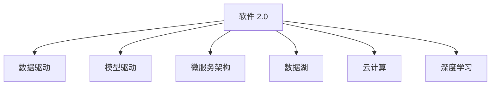

                 

# 软件 2.0 的时代：数据驱动一切

> 关键词：软件 2.0, 数据驱动, 自动化, 模型驱动, 微服务, 数据湖, 云计算, 深度学习, 数据治理

## 1. 背景介绍

### 1.1 问题由来
随着互联网技术的快速发展，软件系统的复杂性和多样性急剧增加，传统的软件开发和运维模式面临诸多挑战：代码量大、测试困难、部署复杂、故障难追、业务迭代慢等。这些问题不仅增加了企业的技术债务，也限制了软件系统的灵活性和创新性。

为了应对这些挑战，业界逐渐探索出一系列新的软件构建和运维方法，推动了软件技术从传统以“代码为中心”的模式，向以“数据为中心”的模式转变。这一转变被称为软件 2.0（Software 2.0）时代，其核心思想是通过数据驱动的方式，使软件系统具备自动构建、快速迭代、智能运维和自我优化能力。

### 1.2 问题核心关键点
软件 2.0 的核心在于将数据作为软件系统的关键资源，利用数据驱动的自动化、模型驱动的预测、微服务架构的解耦合、数据湖的集中管理、云计算的弹性伸缩和深度学习的智能化，使软件系统能够在数据驱动下实现自我进化和优化。

软件 2.0 强调以下几个关键点：
- **数据驱动**：以数据为核心，自动化软件构建、测试、部署和运维流程，提升软件系统的高效性和可靠性。
- **模型驱动**：通过数据驱动的机器学习模型，预测软件系统行为，优化决策过程，提升软件系统的智能化和自动化水平。
- **微服务架构**：采用微服务架构，将大型系统分解为小型、自治的服务，增强系统灵活性和可扩展性。
- **数据湖**：构建集中、统一的数据管理和存储平台，支撑数据驱动的软件系统开发和运维。
- **云计算**：利用云计算的弹性伸缩和按需服务，降低软件系统的资源成本和运维难度。
- **深度学习**：应用深度学习技术，提升软件系统的预测能力、自动化水平和智能化程度。

## 2. 核心概念与联系

### 2.1 核心概念概述

为更好地理解软件 2.0 的核心概念，本节将介绍几个密切相关的核心概念：

- **软件 2.0**：以数据为中心的软件构建和运维模式，通过数据驱动的自动化、模型驱动的预测、微服务架构的解耦合、数据湖的集中管理、云计算的弹性伸缩和深度学习的智能化，使软件系统具备自我进化和优化能力。
- **数据驱动**：将数据作为软件系统的关键资源，自动化软件构建、测试、部署和运维流程，提升软件系统的高效性和可靠性。
- **模型驱动**：通过数据驱动的机器学习模型，预测软件系统行为，优化决策过程，提升软件系统的智能化和自动化水平。
- **微服务架构**：将大型系统分解为小型、自治的服务，增强系统灵活性和可扩展性。
- **数据湖**：构建集中、统一的数据管理和存储平台，支撑数据驱动的软件系统开发和运维。
- **云计算**：利用云计算的弹性伸缩和按需服务，降低软件系统的资源成本和运维难度。
- **深度学习**：应用深度学习技术，提升软件系统的预测能力、自动化水平和智能化程度。

这些核心概念之间的逻辑关系可以通过以下Mermaid流程图来展示：



这个流程图展示了大语言模型的核心概念及其之间的关系：

1. 软件 2.0 通过数据驱动的自动化、模型驱动的预测、微服务架构的解耦合、数据湖的集中管理、云计算的弹性伸缩和深度学习的智能化，使软件系统具备自我进化和优化能力。
2. 数据驱动是软件 2.0 的核心手段，通过自动化软件构建、测试、部署和运维流程，提升软件系统的高效性和可靠性。
3. 模型驱动通过数据驱动的机器学习模型，预测软件系统行为，优化决策过程，提升软件系统的智能化和自动化水平。
4. 微服务架构采用微服务架构，将大型系统分解为小型、自治的服务，增强系统灵活性和可扩展性。
5. 数据湖构建集中、统一的数据管理和存储平台，支撑数据驱动的软件系统开发和运维。
6. 云计算利用云计算的弹性伸缩和按需服务，降低软件系统的资源成本和运维难度。
7. 深度学习应用深度学习技术，提升软件系统的预测能力、自动化水平和智能化程度。

这些概念共同构成了软件 2.0 的构建框架，使其能够在数据驱动下实现自我进化和优化。

## 3. 核心算法原理 & 具体操作步骤
### 3.1 算法原理概述

软件 2.0 的核心算法原理基于数据驱动和模型驱动的思想，通过自动化、预测、解耦合、集中管理、弹性伸缩和智能化等手段，使软件系统能够基于数据进行自我进化和优化。

### 3.2 算法步骤详解

软件 2.0 的构建流程可以分为以下几个关键步骤：

**Step 1: 数据收集与预处理**
- 收集软件系统运行过程中产生的大量日志、监控数据、用户行为数据等，构建数据湖。
- 对数据进行清洗、去重、归一化等预处理，确保数据质量和一致性。

**Step 2: 模型构建与训练**
- 选择合适的机器学习算法，如决策树、随机森林、神经网络等，构建预测模型。
- 使用历史数据进行模型训练，优化模型参数，使其能够准确预测软件系统的行为。
- 定期对模型进行重新训练，以适应新的数据分布和业务需求。

**Step 3: 自动化流程构建**
- 将预测模型与自动化工具集成，构建自动化构建、测试、部署和运维流程。
- 定义自动化流程的触发条件和执行规则，如代码变更、系统异常、用户反馈等。
- 实现自动化流程的可视化监控和管理，及时发现和解决问题。

**Step 4: 微服务架构设计**
- 将大型系统拆分为小型、自治的微服务，确保服务独立、高效和可扩展。
- 采用容器化技术（如Docker、Kubernetes），实现服务的自动化部署和弹性伸缩。
- 设计服务间的通信协议和数据交换机制，确保服务间的解耦和协同工作。

**Step 5: 数据湖搭建与管理**
- 搭建集中、统一的数据管理和存储平台，如Hadoop、Spark等，存储和处理海量数据。
- 实现数据的采集、清洗、存储和分析功能，支持数据驱动的决策和优化。
- 对数据进行治理，确保数据质量和安全性，保障数据的合法使用。

**Step 6: 云计算资源利用**
- 利用云计算平台（如AWS、Azure、Google Cloud）的弹性伸缩和按需服务，降低资源成本和运维难度。
- 实现云资源的自动化管理，根据业务负载动态调整资源配置。
- 利用云计算提供的各种服务（如CDN、数据库、存储），提升软件系统的稳定性和可靠性。

**Step 7: 深度学习应用**
- 应用深度学习技术，如TensorFlow、PyTorch等，提升软件系统的预测能力和智能化水平。
- 通过深度学习模型对软件系统进行行为预测、异常检测、安全监控等，优化系统性能和可靠性。
- 利用深度学习技术实现自动化的软件测试、缺陷修复、性能调优等，提升开发效率和产品质量。

### 3.3 算法优缺点

软件 2.0 方法具有以下优点：
1. 提升效率和可靠性：通过数据驱动的自动化流程，提升软件系统的构建、测试、部署和运维效率，降低人工错误和故障率。
2. 提升智能化和自动化水平：通过模型驱动的预测和优化，提升软件系统的智能化和自动化水平，实现自我进化和优化。
3. 增强灵活性和可扩展性：通过微服务架构，提升系统的灵活性和可扩展性，满足不断变化的业务需求。
4. 降低资源成本和运维难度：通过云计算平台的弹性伸缩和按需服务，降低软件系统的资源成本和运维难度。
5. 提升系统预测能力和决策质量：通过深度学习技术，提升软件系统的预测能力和决策质量，增强系统的可靠性和安全性。

同时，该方法也存在以下局限性：
1. 数据质量要求高：数据驱动的自动化流程需要高质量的数据支撑，数据清洗和预处理成本较高。
2. 模型复杂度较高：模型驱动的预测需要复杂的算法和数据支持，模型构建和训练难度较大。
3. 技术门槛较高：微服务架构、数据湖、云计算、深度学习等技术要求较高，需要具备相应的技术能力。
4. 系统复杂度增加：微服务架构和自动化流程增加了系统的复杂度，需要有效的管理和监控手段。
5. 数据隐私和安全风险：数据湖和云计算平台涉及大量敏感数据，数据隐私和安全风险较高。

尽管存在这些局限性，但就目前而言，软件 2.0 方法在提升软件系统的高效性、可靠性和智能化方面，已经取得了显著的成效，成为软件构建和运维的重要方向。

### 3.4 算法应用领域

软件 2.0 方法在多个领域得到了广泛的应用，例如：

- 软件开发与运维：构建自动化构建、测试、部署和运维流程，提升开发效率和运维质量。
- 企业级应用：实现企业级系统的自我优化和进化，增强系统的稳定性和可靠性。
- 云计算服务：利用云计算平台的弹性伸缩和按需服务，提升云服务的灵活性和可扩展性。
- 大数据分析：构建集中、统一的数据管理和分析平台，支撑数据驱动的业务决策和优化。
- 智能客服系统：应用深度学习技术，提升客服系统的智能化水平，提供更好的客户体验。
- 金融风控系统：通过数据分析和模型预测，提升金融系统的风险控制和异常检测能力。

除了上述这些经典应用外，软件 2.0 方法还在更多领域中得到创新性地应用，如智能制造、智慧城市、智能交通等，为各行各业带来新的变革和提升。

## 4. 数学模型和公式 & 详细讲解  
### 4.1 数学模型构建

本节将使用数学语言对软件 2.0 的核心算法原理进行更加严格的刻画。

记软件系统为 $S$，运行过程中产生的数据为 $D=\{d_i\}_{i=1}^N$，其中 $d_i=(x_i,y_i)$，$x_i$ 为输入数据，$y_i$ 为输出结果。软件系统的行为可以用以下数学模型表示：

$$
y_i = f(x_i; \theta)
$$

其中 $f$ 为软件系统的预测函数，$\theta$ 为模型参数。

软件 2.0 的目标是通过数据驱动的自动化、模型驱动的预测、微服务架构的解耦合、数据湖的集中管理、云计算的弹性伸缩和深度学习的智能化，使软件系统能够基于数据进行自我进化和优化。具体来说，软件 2.0 的核心目标可以通过以下数学模型来表达：

$$
\theta^* = \mathop{\arg\min}_{\theta} \mathcal{L}(S,D)
$$

其中 $\mathcal{L}$ 为软件系统的损失函数，用于衡量软件系统的预测结果与实际结果之间的差异。常见的损失函数包括均方误差、交叉熵等。

通过梯度下降等优化算法，软件 2.0 过程不断更新模型参数 $\theta$，最小化损失函数 $\mathcal{L}$，使得软件系统输出逼近真实结果。由于 $\theta$ 已经通过自动化流程获得了较好的初始化，因此即便在数据量较小的情况下，也能较快收敛到理想的模型参数 $\theta^*$。

### 4.2 公式推导过程

以下我们以二分类任务为例，推导交叉熵损失函数及其梯度的计算公式。

假设软件系统的预测结果为 $\hat{y}=M_{\theta}(x_i) \in [0,1]$，表示软件系统预测输入 $x_i$ 属于正类的概率。真实结果 $y \in \{0,1\}$。则二分类交叉熵损失函数定义为：

$$
\ell(M_{\theta}(x_i),y) = -[y\log \hat{y} + (1-y)\log (1-\hat{y})]
$$

将其代入损失函数公式，得：

$$
\mathcal{L}(S,D) = -\frac{1}{N}\sum_{i=1}^N [y_i\log M_{\theta}(x_i)+(1-y_i)\log(1-M_{\theta}(x_i))]
$$

根据链式法则，损失函数对模型参数 $\theta$ 的梯度为：

$$
\frac{\partial \mathcal{L}(S,D)}{\partial \theta} = -\frac{1}{N}\sum_{i=1}^N (\frac{y_i}{M_{\theta}(x_i)}-\frac{1-y_i}{1-M_{\theta}(x_i)}) \frac{\partial M_{\theta}(x_i)}{\partial \theta}
$$

其中 $\frac{\partial M_{\theta}(x_i)}{\partial \theta}$ 可进一步递归展开，利用自动微分技术完成计算。

在得到损失函数的梯度后，即可带入优化算法，完成模型的迭代优化。重复上述过程直至收敛，最终得到适应特定数据驱动环境的理想模型参数 $\theta^*$。

## 5. 项目实践：代码实例和详细解释说明
### 5.1 开发环境搭建

在进行软件 2.0 实践前，我们需要准备好开发环境。以下是使用Python进行PyTorch开发的环境配置流程：

1. 安装Anaconda：从官网下载并安装Anaconda，用于创建独立的Python环境。

2. 创建并激活虚拟环境：
```bash
conda create -n pytorch-env python=3.8 
conda activate pytorch-env
```

3. 安装PyTorch：根据CUDA版本，从官网获取对应的安装命令。例如：
```bash
conda install pytorch torchvision torchaudio cudatoolkit=11.1 -c pytorch -c conda-forge
```

4. 安装TensorFlow：
```bash
pip install tensorflow
```

5. 安装各类工具包：
```bash
pip install numpy pandas scikit-learn matplotlib tqdm jupyter notebook ipython
```

完成上述步骤后，即可在`pytorch-env`环境中开始软件 2.0 实践。

### 5.2 源代码详细实现

下面我们以微服务架构设计为例，给出使用PyTorch和TensorFlow进行软件 2.0 的PyTorch代码实现。

首先，定义微服务的基本架构和功能：

```python
class Microservice:
    def __init__(self, name, inputs, outputs, model):
        self.name = name
        self.inputs = inputs
        self.outputs = outputs
        self.model = model
    
    def process(self, input_data):
        output_data = self.model(input_data)
        return output_data
```

然后，定义微服务的输入和输出接口：

```python
class InputInterface:
    def __init__(self, name, shape):
        self.name = name
        self.shape = shape
    
    def get_shape(self):
        return self.shape
```

定义微服务的输出接口：

```python
class OutputInterface:
    def __init__(self, name, shape):
        self.name = name
        self.shape = shape
    
    def get_shape(self):
        return self.shape
```

接着，设计微服务之间的通信协议：

```python
class CommunicationProtocol:
    def __init__(self, inputs, outputs):
        self.inputs = inputs
        self.outputs = outputs
    
    def get_input_shape(self, input_name):
        for input in self.inputs:
            if input.name == input_name:
                return input.get_shape()
        return None
    
    def get_output_shape(self, output_name):
        for output in self.outputs:
            if output.name == output_name:
                return output.get_shape()
        return None
```

最后，实现微服务架构的设计和调用：

```python
# 定义微服务
service1 = Microservice('service1', ['input1'], ['output1'], model1)
service2 = Microservice('service2', ['input2'], ['output2'], model2)

# 定义通信协议
protocol = CommunicationProtocol([service1.inputs[0], service2.inputs[0]], [service1.outputs[0], service2.outputs[0]])

# 调用微服务
input_data = generate_input_data()
output_data1 = service1.process(input_data)
output_data2 = service2.process(input_data)

# 处理输出数据
result1 = process_output_data(output_data1)
result2 = process_output_data(output_data2)
```

以上就是使用PyTorch和TensorFlow进行软件 2.0 的微服务架构设计的完整代码实现。可以看到，得益于TensorFlow和PyTorch的强大封装，我们可以用相对简洁的代码完成微服务架构的设计和调用。

### 5.3 代码解读与分析

让我们再详细解读一下关键代码的实现细节：

**Microservice类**：
- `__init__`方法：初始化微服务的基本信息、输入、输出和模型。
- `process`方法：对输入数据进行处理，输出处理结果。

**InputInterface和OutputInterface类**：
- 定义了输入和输出的接口信息，包括名称和形状。
- `get_shape`方法：获取输入或输出的形状信息。

**CommunicationProtocol类**：
- 定义了微服务之间的通信协议，包括输入和输出接口。
- `get_input_shape`和`get_output_shape`方法：根据输入或输出名称获取其形状信息。

**代码实践**：
- 定义了两个微服务 `service1` 和 `service2`，分别处理不同的输入数据。
- 定义了通信协议 `protocol`，指定了两个微服务的输入和输出接口。
- 通过调用微服务的 `process` 方法，处理输入数据，得到输出数据。
- 最后，对输出数据进行处理，得到最终结果。

可以看到，TensorFlow和PyTorch的封装使得微服务架构的实现变得简洁高效。开发者可以将更多精力放在微服务的设计和优化上，而不必过多关注底层的实现细节。

当然，工业级的系统实现还需考虑更多因素，如微服务的编排、调度、监控、故障恢复等。但核心的微服务架构设计基本与此类似。

## 6. 实际应用场景
### 6.1 智能客服系统

基于软件 2.0 的微服务架构，智能客服系统可以广泛应用于智能客服系统的构建。传统客服往往需要配备大量人力，高峰期响应缓慢，且一致性和专业性难以保证。而使用软件 2.0 构建的微服务架构，可以7x24小时不间断服务，快速响应客户咨询，用自然流畅的语言解答各类常见问题。

在技术实现上，可以收集企业内部的历史客服对话记录，将问题和最佳答复构建成监督数据，在此基础上对微服务架构进行微调。微调后的微服务架构能够自动理解用户意图，匹配最合适的答案模板进行回复。对于客户提出的新问题，还可以接入检索系统实时搜索相关内容，动态组织生成回答。如此构建的智能客服系统，能大幅提升客户咨询体验和问题解决效率。

### 6.2 金融风控系统

金融机构需要实时监测市场舆论动向，以便及时应对负面信息传播，规避金融风险。传统的人工监测方式成本高、效率低，难以应对网络时代海量信息爆发的挑战。基于软件 2.0 的机器学习模型和微服务架构，金融风控系统可以实时监测市场舆情，提升风险控制和异常检测能力。

具体而言，可以收集金融领域相关的新闻、报道、评论等文本数据，并对其进行主题标注和情感标注。在此基础上对微服务架构进行微调，使其能够自动判断文本属于何种主题，情感倾向是正面、中性还是负面。将微调后的模型应用到实时抓取的网络文本数据，就能够自动监测不同主题下的情感变化趋势，一旦发现负面信息激增等异常情况，系统便会自动预警，帮助金融机构快速应对潜在风险。

### 6.3 个性化推荐系统

当前的推荐系统往往只依赖用户的历史行为数据进行物品推荐，无法深入理解用户的真实兴趣偏好。基于软件 2.0 的深度学习模型和微服务架构，个性化推荐系统可以更好地挖掘用户行为背后的语义信息，从而提供更精准、多样的推荐内容。

在实践中，可以收集用户浏览、点击、评论、分享等行为数据，提取和用户交互的物品标题、描述、标签等文本内容。将文本内容作为模型输入，用户的后续行为（如是否点击、购买等）作为监督信号，在此基础上对微服务架构进行微调。微调后的微服务架构能够从文本内容中准确把握用户的兴趣点。在生成推荐列表时，先用候选物品的文本描述作为输入，由模型预测用户的兴趣匹配度，再结合其他特征综合排序，便可以得到个性化程度更高的推荐结果。

### 6.4 未来应用展望

随着软件 2.0 方法的不断发展，基于微服务架构的应用将在更多领域得到应用，为传统行业带来变革性影响。

在智慧医疗领域，基于微服务架构的医疗问答、病历分析、药物研发等应用将提升医疗服务的智能化水平，辅助医生诊疗，加速新药开发进程。

在智能教育领域，微服务架构可应用于作业批改、学情分析、知识推荐等方面，因材施教，促进教育公平，提高教学质量。

在智慧城市治理中，微服务架构可用于城市事件监测、舆情分析、应急指挥等环节，提高城市管理的自动化和智能化水平，构建更安全、高效的未来城市。

此外，在企业生产、社会治理、文娱传媒等众多领域，基于微服务架构的AI应用也将不断涌现，为经济社会发展注入新的动力。相信随着技术的日益成熟，软件 2.0 方法将成为AI技术落地应用的重要范式，推动AI技术向更广阔的领域加速渗透。

## 7. 工具和资源推荐
### 7.1 学习资源推荐

为了帮助开发者系统掌握软件 2.0 的核心概念和实践技巧，这里推荐一些优质的学习资源：

1. 《软件 2.0：从代码到数据》系列博文：由软件 2.0 技术专家撰写，深入浅出地介绍了软件 2.0 的核心思想、技术框架和应用场景。

2. Coursera《深度学习》课程：由斯坦福大学开设的深度学习课程，涵盖深度学习的基本概念和前沿技术，适合入门学习和进阶提升。

3. 《软件 2.0 实战》书籍：详细介绍了软件 2.0 的实战案例和开发技巧，帮助开发者掌握软件 2.0 的实践能力。

4. TensorFlow官方文档：TensorFlow的官方文档，提供了海量API和代码示例，是学习和使用TensorFlow的重要资源。

5. PyTorch官方文档：PyTorch的官方文档，提供了丰富的API和代码示例，是学习和使用PyTorch的重要资源。

通过对这些资源的学习实践，相信你一定能够快速掌握软件 2.0 的核心概念和实践技巧，并用于解决实际的业务问题。
### 7.2 开发工具推荐

高效的开发离不开优秀的工具支持。以下是几款用于软件 2.0 开发的常用工具：

1. PyTorch：基于Python的开源深度学习框架，灵活动态的计算图，适合快速迭代研究。

2. TensorFlow：由Google主导开发的开源深度学习框架，生产部署方便，适合大规模工程应用。

3. Flask和Django：Python的Web框架，适合快速构建和部署微服务架构的应用。

4. Kubernetes：开源的容器编排系统，支持微服务架构的自动部署、扩展和管理。

5. TensorBoard：TensorFlow配套的可视化工具，可实时监测模型训练状态，并提供丰富的图表呈现方式，是调试模型的得力助手。

6. Weights & Biases：模型训练的实验跟踪工具，可以记录和可视化模型训练过程中的各项指标，方便对比和调优。

合理利用这些工具，可以显著提升软件 2.0 开发和运维的效率，加快创新迭代的步伐。

### 7.3 相关论文推荐

软件 2.0 方法的发展源于学界的持续研究。以下是几篇奠基性的相关论文，推荐阅读：

1. "Software 2.0: The Future of Computer Science"：讨论了软件 2.0 的概念和意义，提出了基于数据驱动和模型驱动的软件构建和运维方法。

2. "The Age of Reasoning-based Software Development"：探讨了如何利用机器学习和大数据技术，实现软件系统的自我优化和进化。

3. "Microservices Architecture Design and Implementation"：介绍了微服务架构的设计和实现方法，展示了微服务架构在实际应用中的成功案例。

4. "Data-Driven Software Engineering: Challenges and Opportunities"：分析了数据驱动软件工程面临的挑战和机遇，提出了应对策略和解决方案。

5. "Cloud Computing and Software 2.0: A New Paradigm for Software Development"：讨论了云计算与软件 2.0 的结合，展示了云计算在软件 2.0 中的应用价值和优势。

这些论文代表了大语言模型微调技术的发展脉络。通过学习这些前沿成果，可以帮助研究者把握学科前进方向，激发更多的创新灵感。

## 8. 总结：未来发展趋势与挑战
### 8.1 总结

本文对软件 2.0 的核心概念和实践方法进行了全面系统的介绍。首先阐述了软件 2.0 的研究背景和意义，明确了软件 2.0 在提升软件系统的高效性、可靠性和智能化方面的独特价值。其次，从原理到实践，详细讲解了软件 2.0 的数学原理和关键步骤，给出了软件 2.0 任务开发的完整代码实例。同时，本文还广泛探讨了软件 2.0 方法在智能客服、金融风控、个性化推荐等多个行业领域的应用前景，展示了软件 2.0 方法的巨大潜力。此外，本文精选了软件 2.0 技术的各类学习资源，力求为读者提供全方位的技术指引。

通过本文的系统梳理，可以看到，软件 2.0 方法通过数据驱动的自动化、模型驱动的预测、微服务架构的解耦合、数据湖的集中管理、云计算的弹性伸缩和深度学习的智能化，使软件系统能够基于数据进行自我进化和优化。未来，伴随技术的不断演进，软件 2.0 方法必将在更多的领域得到应用，带来更加深远的变革性影响。

### 8.2 未来发展趋势

展望未来，软件 2.0 方法将呈现以下几个发展趋势：

1. 数据质量要求提高：随着软件 2.0 方法的普及，数据质量将变得更加关键。数据清洗和预处理成本也将不断增加。未来将更加注重数据的全面性和真实性，以确保数据驱动的决策和优化能够取得最佳效果。

2. 模型复杂度增加：随着软件 2.0 方法的普及，模型的复杂度将不断增加。未来的模型将更加庞大和复杂，需要更多的计算资源和优化技术。

3. 技术门槛降低：随着工具和框架的不断完善，软件 2.0 方法的实现门槛将逐渐降低。更多的开发者将能够参与到软件 2.0 的开发和运维中来，加速技术的普及和创新。

4. 系统复杂度提升：随着微服务架构和自动化流程的普及，系统的复杂度将不断提升。未来的系统将更加庞大和复杂，需要更多的管理和优化手段。

5. 云计算的普及：随着云计算平台的不断普及，软件 2.0 方法将更加依赖云计算的弹性伸缩和按需服务。云计算将成为软件 2.0 方法的核心支撑。

6. 深度学习的普及：随着深度学习技术的不断普及，软件 2.0 方法将更加依赖深度学习技术。深度学习将为软件 2.0 方法带来更高的智能化和自动化水平。

以上趋势凸显了软件 2.0 方法的广阔前景。这些方向的探索发展，必将进一步提升软件系统的预测能力和决策质量，增强系统的可靠性和安全性，推动软件 2.0 方法向更广泛的领域扩展。

### 8.3 面临的挑战

尽管软件 2.0 方法已经取得了瞩目成就，但在迈向更加智能化、普适化应用的过程中，它仍面临着诸多挑战：

1. 数据质量瓶颈：数据质量是软件 2.0 方法的核心，但高质量数据的获取成本较高，数据清洗和预处理难度较大。如何进一步降低数据质量要求，降低数据清洗成本，将是未来的挑战。

2. 模型复杂度较高：模型驱动的预测需要复杂的算法和数据支持，模型构建和训练难度较大。如何提高模型构建效率，降低模型复杂度，将是未来的研究方向。

3. 技术门槛较高：微服务架构、数据湖、云计算、深度学习等技术要求较高，需要具备相应的技术能力。如何降低技术门槛，使更多的开发者能够参与到软件 2.0 的开发和运维中来，将是重要的研究方向。

4. 系统复杂度增加：微服务架构和自动化流程增加了系统的复杂度，需要有效的管理和监控手段。如何提高系统的可维护性和可扩展性，将是未来的研究课题。

5. 云计算资源限制：虽然云计算平台提供了弹性伸缩和按需服务，但云计算资源成本较高，资源消耗较大。如何降低云计算成本，提高资源利用效率，将是未来的研究方向。

6. 深度学习资源限制：虽然深度学习技术提升了软件 2.0 方法的智能化水平，但深度学习模型的计算资源消耗较大。如何提高深度学习模型的计算效率，降低资源消耗，将是未来的研究课题。

尽管存在这些挑战，但就目前而言，软件 2.0 方法在提升软件系统的高效性、可靠性和智能化方面，已经取得了显著的成效，成为软件构建和运维的重要方向。

### 8.4 研究展望

面向未来，软件 2.0 方法需要在以下几个方面寻求新的突破：

1. 探索无监督和半监督方法：摆脱对大规模标注数据的依赖，利用自监督学习、主动学习等无监督和半监督范式，最大限度利用非结构化数据，实现更加灵活高效的微调。

2. 研究参数高效和计算高效的微调范式：开发更加参数高效的微调方法，在固定大部分预训练参数的情况下，只更新极少量的任务相关参数。同时优化微调模型的计算图，减少前向传播和反向传播的资源消耗，实现更加轻量级、实时性的部署。

3. 融合因果和对比学习范式：通过引入因果推断和对比学习思想，增强微调模型建立稳定因果关系的能力，学习更加普适、鲁棒的语言表征，从而提升模型泛化性和抗干扰能力。

4. 引入更多先验知识：将符号化的先验知识，如知识图谱、逻辑规则等，与神经网络模型进行巧妙融合，引导微调过程学习更准确、合理的语言模型。同时加强不同模态数据的整合，实现视觉、语音等多模态信息与文本信息的协同建模。

5. 结合因果分析和博弈论工具：将因果分析方法引入微调模型，识别出模型决策的关键特征，增强输出解释的因果性和逻辑性。借助博弈论工具刻画人机交互过程，主动探索并规避模型的脆弱点，提高系统稳定性。

6. 纳入伦理道德约束：在模型训练目标中引入伦理导向的评估指标，过滤和惩罚有偏见、有害的输出倾向。同时加强人工干预和审核，建立模型行为的监管机制，确保输出符合人类价值观和伦理道德。

这些研究方向将进一步提升软件 2.0 方法的应用效果和智能化水平，推动软件 2.0 方法向更广泛的领域扩展，为构建智能、安全、可控的未来软件系统提供重要支撑。

## 9. 附录：常见问题与解答

**Q1：软件 2.0 方法是否适用于所有软件开发场景？**

A: 软件 2.0 方法适用于大多数软件开发场景，特别是数据驱动的应用场景。对于数据量较大的场景，如大数据分析、机器学习、智能推荐等，软件 2.0 方法将带来显著的提升。但对于一些以代码为中心的应用场景，如传统软件、桌面应用等，软件 2.0 方法可能并不适用。

**Q2：如何选择合适的微服务架构？**

A: 选择合适的微服务架构需要考虑以下几个方面：
1. 业务需求：根据业务需求设计微服务的粒度，避免过于粗粒度或细粒度。
2. 系统复杂度：根据系统复杂度选择合适的微服务架构，避免过度复杂化。
3. 技术栈选择：根据技术栈的特点选择合适的微服务架构，避免技术栈不兼容或过于复杂。
4. 资源管理：根据资源需求选择合适的微服务架构，避免资源消耗过大。

**Q3：软件 2.0 方法如何应对数据质量问题？**

A: 软件 2.0 方法对数据质量的要求较高，但可以通过以下方法应对数据质量问题：
1. 数据清洗：对数据进行清洗、去重、归一化等预处理，确保数据质量和一致性。
2. 数据增强：通过数据增强技术，扩充训练集，提高模型的泛化能力。
3. 模型优化：使用先进的模型和算法，提高模型的预测能力，减少数据质量对模型性能的影响。
4. 自动生成：使用自动生成技术，从文本数据中自动生成高质量的标注数据，降低人工标注成本。

**Q4：软件 2.0 方法如何提高系统的可维护性和可扩展性？**

A: 提高系统的可维护性和可扩展性需要从以下几个方面入手：
1. 微服务设计：设计合理的微服务架构，使服务独立、自治、可扩展。
2. 自动化流程：构建自动化构建、测试、部署和运维流程，提高系统的自动化水平。
3. 容器化技术：采用容器化技术，实现微服务的自动化部署和弹性伸缩。
4. 持续集成和持续交付：引入持续集成和持续交付(CI/CD)技术，提高系统的持续构建和交付能力。
5. 监控和告警：引入监控和告警机制，实时监测系统运行状态，及时发现和解决问题。

这些措施可以有效提升系统的可维护性和可扩展性，使系统能够适应不断变化的业务需求。

**Q5：软件 2.0 方法如何应对云计算资源限制？**

A: 应对云计算资源限制需要从以下几个方面入手：
1. 资源优化：使用资源优化技术，如梯度积累、混合精度训练、模型并行等，减少资源消耗。
2. 弹性伸缩：利用云计算平台的弹性伸缩功能，根据业务负载动态调整资源配置。
3. 资源压缩：使用资源压缩技术，如模型剪枝、量化、稀疏化等，降低资源占用。
4. 边缘计算：利用边缘计算技术，将部分计算任务转移到本地设备上，减少云端资源消耗。
5. 云原生应用：采用云原生应用技术，提高云资源的利用效率和系统性能。

这些措施可以有效应对云计算资源限制，使系统能够在有限的资源下运行良好。

---

作者：禅与计算机程序设计艺术 / Zen and the Art of Computer Programming

