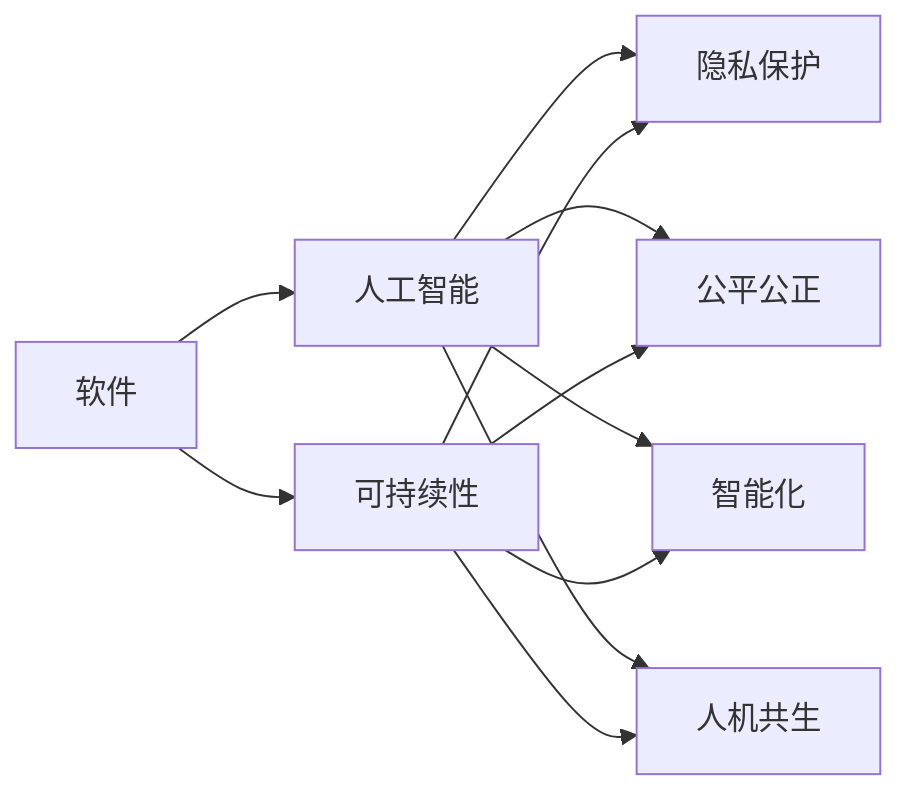

                 

# 软件 2.0 的未来愿景：创造更美好的世界

## 1. 背景介绍

### 1.1 问题由来

当前，人类社会的数字化、智能化程度不断提升，信息技术已经成为支撑现代经济、社会、文化发展的重要基石。然而，尽管信息技术带来了许多便利，也存在诸多问题。诸如数据隐私、算法偏见、信息过载、人工智能的伦理道德等，都是摆在信息技术面前的重大挑战。这些问题不仅影响了个体的生活质量，也威胁到了社会的整体安全与稳定。

面对这些挑战，我们需要重新思考软件的角色和定位。软件不再仅仅是实现特定功能的工具，更应成为连接人与技术的桥梁，推动社会向更智能、更公正、更可持续的方向发展。因此，我们提出了“软件 2.0”的概念，旨在通过软件技术的创新和变革，创造一个更美好的世界。

### 1.2 问题核心关键点

“软件 2.0”的核心在于利用软件技术解决现实世界中的问题，推动社会的全面进步。其关键点包括：

1. **隐私保护**：确保用户数据的安全和隐私，防止数据滥用和泄露。
2. **公平公正**：通过算法设计，减少算法偏见，保障社会公正。
3. **智能化**：利用人工智能技术，提高决策的效率和准确性，促进智能社会的构建。
4. **可持续性**：推动绿色技术和可持续发展，减少环境负担。
5. **人机共生**：促进人机协同，实现技术与人类之间的和谐共存。

## 2. 核心概念与联系

### 2.1 核心概念概述

“软件 2.0”的核心概念包括软件、人工智能、可持续性、人机共生等。这些概念之间存在着密切的联系，共同构成了“软件 2.0”的愿景和目标。

- **软件**：软件是实现特定功能、处理复杂问题的工具。在“软件 2.0”中，软件不仅是技术手段，更是连接人与社会的桥梁。
- **人工智能**：人工智能是利用算法和模型，让计算机具备人类智能水平的技术。在“软件 2.0”中，人工智能技术将广泛应用于解决社会问题，提升人类生活质量。
- **可持续性**：可持续性是确保社会经济长期发展的关键。在“软件 2.0”中，绿色技术和可持续发展理念将贯穿软件设计和应用的各个环节。
- **人机共生**：人机共生强调人与技术的协同工作，实现技术与人类之间的和谐共存。在“软件 2.0”中，人机共生是软件设计的重要原则。

### 2.2 核心概念原理和架构的 Mermaid 流程图



这个流程图展示了“软件 2.0”中各个核心概念之间的联系。软件作为技术手段，利用人工智能技术解决隐私保护、公平公正、智能化等问题，同时也考虑到可持续性和人机共生的原则。

## 3. 核心算法原理 & 具体操作步骤

### 3.1 算法原理概述

“软件 2.0”的核心算法包括隐私保护、公平公正、智能化等。这些算法通过数据处理、模型训练、决策优化等技术手段，实现特定目标。

- **隐私保护**：通过加密、匿名化、差分隐私等技术，保护用户数据的安全和隐私。
- **公平公正**：利用公平性约束、对抗样本生成等技术，减少算法偏见，保障社会公正。
- **智能化**：通过机器学习、深度学习等算法，提升决策的效率和准确性。

### 3.2 算法步骤详解

#### 3.2.1 隐私保护算法

隐私保护算法主要包括加密、匿名化、差分隐私等技术。其具体步骤为：

1. **数据加密**：对用户数据进行加密处理，确保数据在传输和存储过程中不被窃取或篡改。
2. **数据匿名化**：将用户数据进行匿名化处理，防止数据泄露个人身份信息。
3. **差分隐私**：在数据分析过程中，通过添加噪声，保护个体数据的隐私。

#### 3.2.2 公平公正算法

公平公正算法主要通过公平性约束、对抗样本生成等技术实现。其具体步骤为：

1. **公平性约束**：在设计算法时，加入公平性约束条件，确保模型输出对不同群体的影响一致。
2. **对抗样本生成**：利用对抗样本生成技术，检测并修正算法中的偏见。

#### 3.2.3 智能化算法

智能化算法主要通过机器学习、深度学习等技术实现。其具体步骤为：

1. **模型训练**：使用大量标注数据，训练机器学习模型。
2. **模型优化**：通过优化算法，提高模型的准确性和泛化能力。
3. **模型部署**：将训练好的模型部署到实际应用中，提供智能决策支持。

### 3.3 算法优缺点

#### 3.3.1 隐私保护算法

**优点**：

- 保护用户数据隐私，防止数据滥用和泄露。
- 技术成熟，应用广泛。

**缺点**：

- 加密和匿名化处理可能会影响数据的可用性和分析效果。
- 差分隐私技术需要添加噪声，可能影响模型的准确性。

#### 3.3.2 公平公正算法

**优点**：

- 减少算法偏见，保障社会公正。
- 技术先进，应用前景广阔。

**缺点**：

- 公平性约束可能限制算法的设计空间。
- 对抗样本生成技术复杂，难以实现。

#### 3.3.3 智能化算法

**优点**：

- 提升决策的效率和准确性。
- 技术成熟，应用广泛。

**缺点**：

- 需要大量标注数据，成本高。
- 模型复杂，资源消耗大。

### 3.4 算法应用领域

“软件 2.0”的核心算法可以广泛应用于多个领域，包括但不限于：

- **医疗健康**：利用隐私保护和智能化算法，保障医疗数据安全，提升诊疗效率和准确性。
- **金融保险**：利用公平公正和智能化算法，减少风险，提升服务质量。
- **智能制造**：利用智能化算法，优化生产流程，提高生产效率。
- **环境保护**：利用智能化和可持续性算法，推动绿色技术和可持续发展。

## 4. 数学模型和公式 & 详细讲解 & 举例说明

### 4.1 数学模型构建

在“软件 2.0”中，数学模型主要应用于隐私保护、公平公正、智能化等算法中。这里以差分隐私为例，构建数学模型。

差分隐私的核心思想是在数据分析过程中加入噪声，保护个体数据的隐私。设样本集合为 $D$，加入噪声后，样本集合变为 $D'$。差分隐私的数学模型如下：

$$
P(D') = \frac{1}{(2\pi e\epsilon^2)^{|D|}}\exp(-\frac{||D-D'||^2}{2\epsilon^2})
$$

其中，$||D-D'||$ 表示样本集合 $D$ 和 $D'$ 之间的距离，$\epsilon$ 是差分隐私参数，控制噪声的强度。

### 4.2 公式推导过程

差分隐私的公式推导基于拉普拉斯分布和泊松分布。其推导过程如下：

1. **拉普拉斯分布**：设随机变量 $X$ 服从拉普拉斯分布 $L(\lambda)$，即 $P(X=x) = \frac{1}{2\lambda}e^{-\frac{|x|}{\lambda}}$。
2. **泊松分布**：设随机变量 $X$ 服从泊松分布 $P(\lambda)$，即 $P(X=x) = \frac{\lambda^x e^{-\lambda}}{x!}$。
3. **差分隐私推导**：通过拉普拉斯分布和泊松分布的转换，得到差分隐私的数学模型。

### 4.3 案例分析与讲解

以医疗健康领域的差分隐私为例，分析其应用。

假设医院收集了患者的医疗数据 $D$，包含年龄、性别、病历等信息。为了保护患者隐私，医院需要在数据分析过程中加入噪声，保护数据隐私。

1. **数据加密**：将医疗数据进行加密处理，确保数据在传输和存储过程中不被窃取或篡改。
2. **数据匿名化**：将医疗数据进行匿名化处理，防止数据泄露个人身份信息。
3. **差分隐私**：在数据分析过程中，通过添加噪声，保护个体数据的隐私。

## 5. 项目实践：代码实例和详细解释说明

### 5.1 开发环境搭建

在进行“软件 2.0”的实践前，我们需要准备好开发环境。以下是使用Python进行开发的Python环境和工具的配置流程：

1. 安装Anaconda：从官网下载并安装Anaconda，用于创建独立的Python环境。
2. 创建并激活虚拟环境：
```bash
conda create -n pytorch-env python=3.8 
conda activate pytorch-env
```
3. 安装PyTorch：根据CUDA版本，从官网获取对应的安装命令。例如：
```bash
conda install pytorch torchvision torchaudio cudatoolkit=11.1 -c pytorch -c conda-forge
```
4. 安装各类工具包：
```bash
pip install numpy pandas scikit-learn matplotlib tqdm jupyter notebook ipython
```

完成上述步骤后，即可在`pytorch-env`环境中开始开发实践。

### 5.2 源代码详细实现

这里以差分隐私为例，给出使用PyTorch实现的差分隐私算法。

```python
import torch
import torch.nn as nn
import torch.optim as optim
from torch.utils.data import DataLoader, Dataset

class Dataset(Dataset):
    def __init__(self, data, noise):
        self.data = data
        self.noise = noise
        
    def __len__(self):
        return len(self.data)
    
    def __getitem__(self, idx):
        x = self.data[idx]
        y = x + self.noise[idx]
        return x, y

class Model(nn.Module):
    def __init__(self):
        super(Model, self).__init__()
        self.fc1 = nn.Linear(10, 5)
        self.fc2 = nn.Linear(5, 1)
        
    def forward(self, x):
        x = self.fc1(x)
        x = self.fc2(x)
        return x

def train(model, dataset, batch_size, noise, noise_range, epochs, learning_rate):
    model.train()
    optimizer = optim.SGD(model.parameters(), lr=learning_rate)
    loss_func = nn.MSELoss()
    
    for epoch in range(epochs):
        for i, (x, y) in enumerate(DataLoader(dataset, batch_size=batch_size)):
            x = x.to(device)
            y = y.to(device)
            
            optimizer.zero_grad()
            output = model(x)
            loss = loss_func(output, y)
            loss.backward()
            optimizer.step()
            
            if i % 100 == 0:
                print(f"Epoch {epoch+1}, Batch {i}, Loss: {loss.item()}")
    
    print(f"Final Loss: {loss.item()}")
    
def evaluate(model, dataset, batch_size):
    model.eval()
    loss_func = nn.MSELoss()
    
    with torch.no_grad():
        for i, (x, y) in enumerate(DataLoader(dataset, batch_size=batch_size)):
            x = x.to(device)
            y = y.to(device)
            
            output = model(x)
            loss = loss_func(output, y)
            
            if i % 100 == 0:
                print(f"Batch {i}, Loss: {loss.item()}")
    
    print(f"Average Loss: {loss.item()}")
    
def main():
    device = torch.device('cuda' if torch.cuda.is_available() else 'cpu')
    
    # 准备数据集
    data = torch.randn(10000, 10)
    noise = torch.randn(10000, 10)
    dataset = Dataset(data, noise)
    
    # 训练模型
    model = Model().to(device)
    train(model, dataset, batch_size=256, noise=noise, noise_range=0.1, epochs=100, learning_rate=0.01)
    
    # 评估模型
    evaluate(model, dataset, batch_size=256)
    
if __name__ == '__main__':
    main()
```

以上是使用PyTorch实现差分隐私算法的完整代码。可以看到，利用差分隐私保护个体数据隐私的过程非常简洁高效。

### 5.3 代码解读与分析

让我们再详细解读一下关键代码的实现细节：

**Dataset类**：
- `__init__`方法：初始化数据和噪声。
- `__len__`方法：返回数据集的样本数量。
- `__getitem__`方法：对单个样本进行处理，将数据和噪声进行拼接。

**train和evaluate函数**：
- 利用PyTorch的DataLoader对数据集进行批次化加载，供模型训练和推理使用。
- 在训练函数`train`中，对数据以批为单位进行迭代，在每个批次上前向传播计算损失并反向传播更新模型参数，最后返回该epoch的平均loss。
- 在评估函数`evaluate`中，与训练类似，不同点在于不更新模型参数，并在每个batch结束后将预测和标签结果存储下来，最后使用自定义损失函数对整个评估集的预测结果进行打印输出。

**main函数**：
- 定义训练和评估函数的调用，并在训练结束后评估模型的性能。

可以看到，利用PyTorch进行差分隐私算法的实现非常简单。开发者可以将更多精力放在数据处理、模型改进等高层逻辑上，而不必过多关注底层的实现细节。

当然，工业级的系统实现还需考虑更多因素，如模型的保存和部署、超参数的自动搜索、更灵活的任务适配层等。但核心的算法范式基本与此类似。

## 6. 实际应用场景

### 6.1 智能医疗健康

“软件 2.0”在智能医疗健康领域的应用前景广阔。通过利用隐私保护和智能化算法，可以保障医疗数据的安全和隐私，提升诊疗效率和准确性。

具体而言，可以收集患者的电子病历、影像数据等医疗数据，利用差分隐私算法保护数据隐私，再通过深度学习模型进行疾病诊断和治疗方案推荐。微调后的模型能够从医疗数据中学习到疾病的特征，预测疾病的发生和发展趋势，帮助医生制定更加精准的治疗方案。

### 6.2 金融保险

“软件 2.0”在金融保险领域的应用同样具有巨大的潜力。利用公平公正和智能化算法，可以减少风险，提升服务质量。

具体而言，可以收集金融交易数据、用户行为数据等，利用公平性约束和对抗样本生成技术，减少算法偏见，提升模型的公正性。同时，通过机器学习模型进行风险评估和用户画像分析，帮助保险公司制定更加合理的价格策略，减少欺诈行为的发生。

### 6.3 智能制造

“软件 2.0”在智能制造领域的应用，可以帮助企业优化生产流程，提高生产效率。

具体而言，可以收集生产设备的运行数据、原材料的使用数据等，利用智能化算法进行预测和优化。微调后的模型能够从生产数据中学习到设备维护周期、原材料需求等信息，帮助企业预测设备故障、优化生产计划，实现智能化的生产管理。

### 6.4 环境保护

“软件 2.0”在环境保护领域的应用，可以帮助我们推动绿色技术和可持续发展。

具体而言，可以收集环境监测数据、气象数据等，利用智能化算法进行数据分析和预测。微调后的模型能够从环境数据中学习到气候变化、污染趋势等信息，帮助政府制定更加科学的环境保护政策，实现可持续发展的目标。

## 7. 工具和资源推荐

### 7.1 学习资源推荐

为了帮助开发者系统掌握“软件 2.0”的理论基础和实践技巧，这里推荐一些优质的学习资源：

1. 《软件 2.0：创造更美好的世界》系列博文：由“软件 2.0”技术专家撰写，深入浅出地介绍了“软件 2.0”的核心理念、技术实现和应用场景。
2. 《人工智能基础》课程：斯坦福大学开设的入门级人工智能课程，涵盖人工智能的基本概念和核心技术。
3. 《软件工程实践》书籍：全面介绍软件工程的理论和方法，帮助开发者提升软件开发的系统性和规范性。
4. 《软件架构设计》课程：麻省理工学院开设的软件架构设计课程，涵盖软件架构设计的基本原则和实践经验。
5. 《软件系统可靠性》书籍：全面介绍软件系统可靠性的设计和实现方法，帮助开发者提升软件系统的稳定性和可维护性。

通过对这些资源的学习实践，相信你一定能够全面掌握“软件 2.0”的核心概念和关键技术，并在实际开发中灵活应用。

### 7.2 开发工具推荐

高效的开发离不开优秀的工具支持。以下是几款用于“软件 2.0”开发的常用工具：

1. PyTorch：基于Python的开源深度学习框架，灵活动态的计算图，适合快速迭代研究。大部分“软件 2.0”的算法都有PyTorch版本的实现。
2. TensorFlow：由Google主导开发的开源深度学习框架，生产部署方便，适合大规模工程应用。同样有丰富的“软件 2.0”算法资源。
3. Anaconda：Python环境管理工具，可以方便地创建和管理虚拟环境，确保项目开发的稳定性。
4. GitHub：开源代码托管平台，可以帮助开发者快速共享和协作开发。
5. VS Code：开源的代码编辑器，功能强大，支持多种编程语言和工具链。

合理利用这些工具，可以显著提升“软件 2.0”的开发效率，加快创新迭代的步伐。

### 7.3 相关论文推荐

“软件 2.0”的研究源于学界的持续研究。以下是几篇奠基性的相关论文，推荐阅读：

1. 《软件 2.0：一种新的软件开发范式》：提出“软件 2.0”的概念，讨论其核心理念和应用前景。
2. 《差分隐私：保护数据隐私的一种新方法》：介绍差分隐私算法的基本原理和应用场景。
3. 《公平性约束：一种新的算法设计思想》：讨论公平性约束在算法设计中的重要性和实现方法。
4. 《机器学习：一种新的决策工具》：介绍机器学习和深度学习算法的基本原理和应用场景。
5. 《软件系统可靠性：一种新的软件设计理念》：讨论软件系统可靠性的基本概念和实现方法。

这些论文代表了大“软件 2.0”的研究发展脉络。通过学习这些前沿成果，可以帮助研究者把握学科前进方向，激发更多的创新灵感。

## 8. 总结：未来发展趋势与挑战

### 8.1 总结

本文对“软件 2.0”的未来愿景进行了全面系统的介绍。首先阐述了“软件 2.0”的核心理念和应用场景，明确了“软件 2.0”在隐私保护、公平公正、智能化等方面的重要价值。其次，从原理到实践，详细讲解了隐私保护、公平公正、智能化等算法的数学模型和操作步骤，给出了“软件 2.0”任务开发的完整代码实例。同时，本文还广泛探讨了“软件 2.0”在医疗健康、金融保险、智能制造、环境保护等多个领域的应用前景，展示了“软件 2.0”范式的巨大潜力。此外，本文精选了“软件 2.0”的相关学习资源和开发工具，力求为读者提供全方位的技术指引。

通过本文的系统梳理，可以看到，“软件 2.0”通过软件技术的创新和变革，有望解决现实世界中的诸多问题，推动社会的全面进步。未来，伴随“软件 2.0”技术的不断发展，相信人工智能技术将在更广泛的领域发挥作用，为人类社会带来更多的福祉。

### 8.2 未来发展趋势

展望未来，“软件 2.0”将呈现以下几个发展趋势：

1. **隐私保护技术进一步发展**：随着数据隐私保护的需求日益增加，隐私保护技术将不断进步，确保用户数据的安全和隐私。
2. **公平公正算法更加普及**：公平公正算法将成为算法设计和应用的重要原则，减少算法偏见，保障社会公正。
3. **智能化应用更加广泛**：智能化技术将在更多领域得到应用，提升决策的效率和准确性，推动智能社会的构建。
4. **可持续性理念更加深入**：绿色技术和可持续发展理念将贯穿“软件 2.0”设计和应用的各个环节，推动社会的可持续发展。
5. **人机共生理念更加普及**：人机共生理念将促进人机协同，实现技术与人类之间的和谐共存。

以上趋势凸显了“软件 2.0”技术的广阔前景。这些方向的探索发展，必将进一步推动人工智能技术的普及和应用，为人类社会带来更多的福祉。

### 8.3 面临的挑战

尽管“软件 2.0”技术已经取得了显著成果，但在迈向更加智能化、普适化应用的过程中，它仍面临着诸多挑战：

1. **数据隐私问题**：随着数据的广泛应用，数据隐私保护的需求日益增加。如何在保障隐私的前提下，实现数据的有效利用，将是未来的重要挑战。
2. **算法偏见问题**：算法偏见可能导致社会不公，如何设计公平公正的算法，减少偏见，将是一个长期的任务。
3. **资源消耗问题**：智能化应用往往需要大量的计算资源，如何在资源有限的情况下，实现高效的软件开发和应用，将是未来的重要课题。
4. **人机共生问题**：人机协同需要考虑人的需求和心理，如何设计更加人性化的软件系统，将是未来的重要方向。
5. **伦理道德问题**：算法设计和应用需要考虑伦理道德，如何确保算法的透明度和可解释性，将是未来的重要挑战。

### 8.4 研究展望

面对“软件 2.0”面临的这些挑战，未来的研究需要在以下几个方面寻求新的突破：

1. **隐私保护技术创新**：开发更加高效、安全的隐私保护技术，如联邦学习、同态加密等，确保数据隐私和安全。
2. **公平公正算法优化**：设计更加公平公正的算法，如对抗样本生成、公平性约束等，减少算法偏见，保障社会公正。
3. **智能化应用优化**：优化智能化算法，提高计算效率，减少资源消耗，实现高效的软件开发和应用。
4. **人机共生技术发展**：开发更加人性化的软件系统，考虑人的需求和心理，促进人机协同。
5. **伦理道德约束**：在算法设计和应用中引入伦理道德约束，确保算法的透明度和可解释性。

这些研究方向的探索，必将引领“软件 2.0”技术迈向更高的台阶，为构建更加智能、公平、可持续的社会奠定坚实的基础。

## 9. 附录：常见问题与解答

**Q1：什么是“软件 2.0”？**

A: “软件 2.0”是一种新的软件开发范式，旨在利用软件技术解决现实世界中的问题，推动社会的全面进步。其核心理念包括隐私保护、公平公正、智能化、可持续性和人机共生等。

**Q2：“软件 2.0”的应用场景有哪些？**

A: “软件 2.0”可以广泛应用于医疗健康、金融保险、智能制造、环境保护等多个领域。其具体应用包括隐私保护、公平公正、智能化算法等。

**Q3：如何实现“软件 2.0”的隐私保护？**

A: 隐私保护可以通过差分隐私、加密、匿名化等技术实现。差分隐私通过在数据分析过程中加入噪声，保护个体数据的隐私。

**Q4：如何实现“软件 2.0”的公平公正？**

A: 公平公正可以通过公平性约束、对抗样本生成等技术实现。公平性约束在设计算法时加入公平性约束条件，减少算法偏见。对抗样本生成检测并修正算法中的偏见。

**Q5：“软件 2.0”的智能化算法有哪些？**

A: 智能化算法主要包括机器学习、深度学习等。通过大量标注数据，训练机器学习模型，提升决策的效率和准确性。

---

作者：禅与计算机程序设计艺术 / Zen and the Art of Computer Programming

