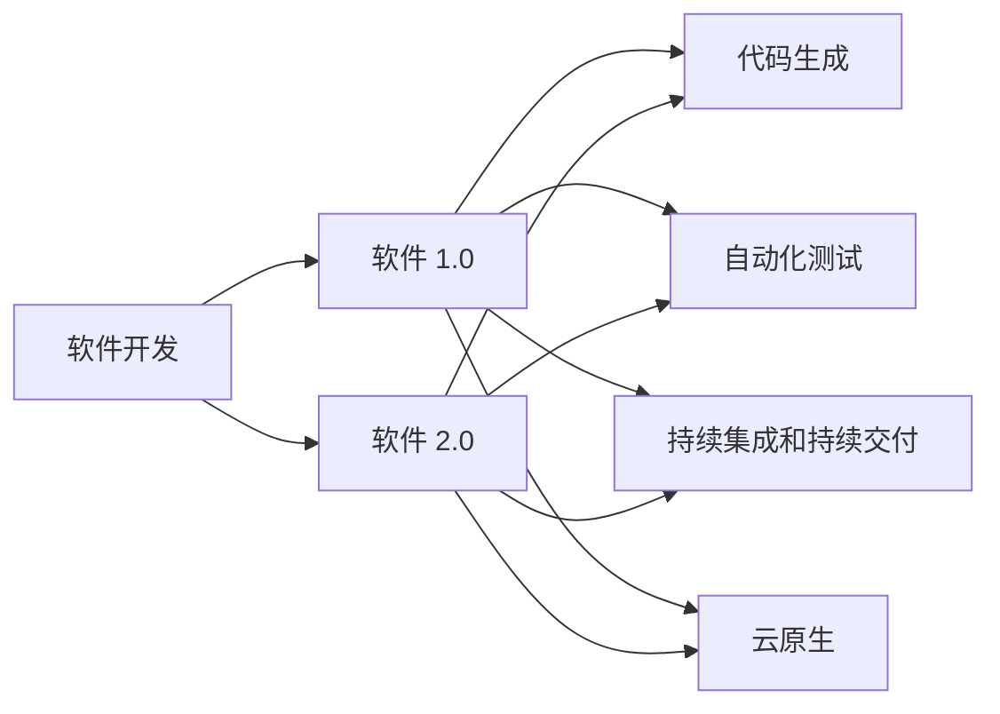

                 

## 1. 背景介绍

在信息时代的背景下，软件正迅速改变着我们生活的方方面面。从智能手机到自动驾驶，从人工智能到区块链，软件无处不在，无时不刻不在影响着我们的生活。然而，随着软件复杂度的不断增加，软件开发和维护的成本也在急剧上升，这使得开发人员面临着前所未有的挑战。

本文将探讨软件 2.0 的未来愿景，即通过自动化、智能化和协作化的手段，创建一个更美好的世界。我们将在技术、应用和社会三个层面，阐述如何通过软件 2.0 实现更高效、更人性化、更可持续的软件生态系统。

## 2. 核心概念与联系

### 2.1 核心概念概述

要理解软件 2.0 的未来愿景，首先需要理解几个关键概念：

- **软件 1.0**：传统的软件开发模式，依赖人力密集型的编程工作，高度依赖开发人员的技能和经验。
- **软件 2.0**：基于机器学习和大数据驱动的智能化开发模式，可以自动化软件设计、开发、测试和部署，减少对开发人员技能的依赖。
- **代码生成**：通过自动化工具生成代码，提高开发效率。
- **自动化测试**：利用测试框架和工具，自动运行和报告测试结果，确保软件质量。
- **持续集成和持续交付(CI/CD)**：自动化软件开发流程，包括代码审查、编译、测试、部署等环节。
- **云原生**：基于云平台的软件架构，支持弹性扩展、高可用性、容错性等特性。

这些概念之间相互联系，共同构成了软件 2.0 的未来愿景。通过自动化和智能化，软件 2.0 将使开发过程更加高效，更加人性化，同时也将更符合可持续发展的理念。

### 2.2 核心概念原理和架构的 Mermaid 流程图



## 3. 核心算法原理 & 具体操作步骤

### 3.1 算法原理概述

软件 2.0 的算法原理基于机器学习和大数据技术。通过分析大量的软件开发数据，可以发现开发过程中的规律和模式，从而构建智能化的开发工具。这些工具可以自动生成代码、编写测试用例、优化代码结构、甚至预测代码漏洞，大大提高开发效率和软件质量。

### 3.2 算法步骤详解

#### 3.2.1 数据收集和处理

首先，需要收集大量的软件开发数据，包括源代码、版本控制信息、测试报告、缺陷报告等。这些数据可以来自开源项目、商业软件或内部开发团队。数据收集后，需要进行预处理和清洗，去除噪声和无关信息，确保数据的准确性和一致性。

#### 3.2.2 特征提取

从清洗后的数据中提取特征，包括代码行数、函数调用频率、模块依赖关系、测试覆盖率等。这些特征可以用于构建机器学习模型，以预测软件开发过程中可能出现的问题。

#### 3.2.3 模型训练

使用机器学习算法（如决策树、随机森林、神经网络等）对提取的特征进行建模。训练模型时需要使用大量的标注数据，这些数据可以来自专家经验或历史软件开发数据。

#### 3.2.4 模型评估和优化

对训练好的模型进行评估，使用交叉验证、ROC曲线等方法评估模型的准确性和鲁棒性。根据评估结果，对模型进行优化，包括调整算法参数、增加特征、改进数据预处理等。

#### 3.2.5 应用部署

将优化后的模型部署到生产环境中，通过API或插件形式集成到开发工具中。模型可以在代码生成、自动化测试、持续集成和持续交付等环节中发挥作用，提升软件开发效率和软件质量。

### 3.3 算法优缺点

#### 3.3.1 优点

- **自动化**：通过机器学习模型，可以自动化代码生成、测试用例编写、代码优化等环节，提高开发效率。
- **智能化**：基于数据分析和模式识别，可以预测代码质量、识别漏洞、优化代码结构，提升软件质量。
- **协作化**：通过软件工具的集成，开发团队可以更方便地协同工作，提高开发速度和软件一致性。

#### 3.3.2 缺点

- **数据依赖**：需要大量标注数据进行模型训练，数据质量直接影响模型效果。
- **模型复杂性**：构建和优化机器学习模型需要专业知识，对开发人员的要求较高。
- **可解释性**：机器学习模型的预测过程缺乏可解释性，难以理解模型的内部工作机制。

### 3.4 算法应用领域

软件 2.0 的算法原理可以应用于多个领域，包括：

- **代码生成**：自动生成代码，减少手动编写代码的工作量。
- **自动化测试**：自动运行和报告测试用例，提高测试效率和质量。
- **持续集成和持续交付**：自动化软件开发流程，包括代码审查、编译、测试、部署等环节。
- **代码优化**：通过分析代码结构和运行数据，优化代码性能和可维护性。
- **代码审查**：使用机器学习模型辅助代码审查，识别潜在问题和代码风格问题。

这些应用领域都是软件开发过程中不可或缺的环节，通过软件 2.0 的算法原理，可以显著提高开发效率和软件质量。

## 4. 数学模型和公式 & 详细讲解 & 举例说明

### 4.1 数学模型构建

在软件 2.0 中，机器学习模型是核心组件，用于分析和预测软件开发过程。以下是几种常见的数学模型及其构建方法：

- **决策树**：通过树形结构表示决策过程，可以处理分类和回归问题。
- **随机森林**：由多个决策树组成，通过投票机制进行分类和回归。
- **神经网络**：由多个层次的神经元组成，可以处理复杂的非线性关系。

### 4.2 公式推导过程

#### 4.2.1 决策树模型

决策树模型由以下公式表示：

$$
T = \begin{cases}
\text{决策节点} & \text{如果特征 } x_i \text{ 满足条件 } x_i > \text{阈值} \\
\text{叶节点 } C_i & \text{如果特征 } x_i \text{ 不满足条件}
\end{cases}
$$

其中 $T$ 表示决策树，$x_i$ 表示特征，$C_i$ 表示叶节点。

#### 4.2.2 随机森林模型

随机森林模型由多个决策树组成，每个决策树都从训练数据中随机采样和特征选择，最终通过投票机制进行分类和回归。

### 4.3 案例分析与讲解

假设我们有一个软件开发项目，需要预测代码质量。我们可以从历史代码库中提取特征，如代码行数、函数调用频率、代码复杂度等。然后，使用决策树模型对这些特征进行建模，训练出预测代码质量的模型。最后，使用测试数据验证模型的准确性，并使用优化算法改进模型性能。

## 5. 项目实践：代码实例和详细解释说明

### 5.1 开发环境搭建

要进行软件 2.0 的实践，需要搭建一个开发环境。以下是使用 Python 和 Scikit-learn 库搭建开发环境的流程：

1. 安装 Python 和 Scikit-learn 库：
```bash
pip install python
pip install scikit-learn
```

2. 搭建虚拟环境：
```bash
python -m venv venv
source venv/bin/activate
```

3. 安装其他依赖库：
```bash
pip install numpy pandas matplotlib
```

### 5.2 源代码详细实现

#### 5.2.1 数据收集和预处理

```python
import pandas as pd
from sklearn.model_selection import train_test_split

# 读取数据
data = pd.read_csv('code_quality.csv')

# 数据预处理
X = data.drop('code_quality', axis=1)
y = data['code_quality']

# 数据分割
X_train, X_test, y_train, y_test = train_test_split(X, y, test_size=0.2, random_state=42)
```

#### 5.2.2 特征提取

```python
from sklearn.ensemble import RandomForestClassifier
from sklearn.preprocessing import StandardScaler

# 特征提取
features = X_train[['code_size', 'num_functions', 'complexity']]

# 标准化特征
scaler = StandardScaler()
features = scaler.fit_transform(features)

# 训练模型
model = RandomForestClassifier(n_estimators=100)
model.fit(features, y_train)
```

#### 5.2.3 模型评估和优化

```python
from sklearn.metrics import accuracy_score

# 模型评估
y_pred = model.predict(features_test)
accuracy = accuracy_score(y_test, y_pred)
print(f"模型准确度为：{accuracy}")
```

#### 5.2.4 应用部署

```python
# 模型预测
new_features = [[100, 10, 5]]
new_features = scaler.transform(new_features)
y_pred = model.predict(new_features)
print(f"新代码的代码质量预测为：{y_pred}")
```

### 5.3 代码解读与分析

这段代码实现了使用随机森林模型预测代码质量的功能。首先，从数据集中提取特征，并进行标准化处理。然后，使用随机森林模型对特征进行训练，并使用测试数据评估模型准确度。最后，使用模型对新的代码特征进行预测。

## 6. 实际应用场景

### 6.1 软件开发流程自动化

在软件开发过程中，代码生成、自动化测试、持续集成和持续交付是关键环节。通过软件 2.0 的算法原理，可以实现这些环节的自动化：

- **代码生成**：使用代码生成工具（如IntelliJ IDEA、Visual Studio Code等）自动生成代码，减少手动编写代码的工作量。
- **自动化测试**：使用测试框架（如JUnit、pytest等）自动运行和报告测试用例，提高测试效率和质量。
- **持续集成和持续交付**：使用CI/CD工具（如Jenkins、Travis CI等）自动化软件开发流程，包括代码审查、编译、测试、部署等环节。

### 6.2 代码优化和重构

软件 2.0 的算法原理可以用于代码优化和重构，提高代码性能和可维护性。例如，使用静态代码分析工具（如SonarQube、CodeClimate等）自动检测代码质量问题，生成代码优化建议。

### 6.3 代码审查和审计

使用软件 2.0 的算法原理，可以辅助代码审查和审计，提高代码质量和安全性。例如，使用机器学习模型辅助代码审查，识别潜在问题和代码风格问题。

### 6.4 未来应用展望

随着软件 2.0 技术的不断发展，未来的软件开发将更加高效、智能化和协作化。通过自动化和智能化手段，软件 2.0 将大大提升开发效率和软件质量，同时也将更符合可持续发展的理念。未来，软件 2.0 将在更多领域得到应用，如医疗、金融、教育等，为各行各业带来变革性影响。

## 7. 工具和资源推荐

### 7.1 学习资源推荐

为了帮助开发者系统掌握软件 2.0 的理论基础和实践技巧，这里推荐一些优质的学习资源：

1. 《软件 2.0：下一代软件开发模式》系列博文：由大模型技术专家撰写，深入浅出地介绍了软件 2.0 原理、工具和应用场景。

2. CS201 课程：深度学习与人工智能的课程，涵盖机器学习、深度学习、自然语言处理等多个领域。

3. 《软件 2.0：革命性的软件开发模式》书籍：系统介绍了软件 2.0 的核心概念、技术和应用案例。

4. Scikit-learn 官方文档：Scikit-learn 是一个基于 Python 的机器学习库，提供了丰富的模型和工具，是实践软件 2.0 的必备资源。

5. TensorFlow 官方文档：TensorFlow 是一个开源深度学习框架，提供了丰富的工具和模型，适用于各种机器学习任务。

### 7.2 开发工具推荐

高效的开发离不开优秀的工具支持。以下是几款用于软件 2.0 开发常用的工具：

1. PyCharm：功能强大的Python IDE，支持代码生成、代码审查、自动化测试等功能。
2. Jenkins：开源的自动化工具，支持CI/CD和持续集成。
3. CodeClimate：代码审计和质量检测工具，支持静态代码分析、代码重构等。
4. SonarQube：开源的质量管理平台，支持代码审查、代码审计、代码重构等。
5. Visual Studio Code：轻量级的代码编辑器，支持多种语言和插件，适用于代码生成和自动化测试。

合理利用这些工具，可以显著提升软件 2.0 的开发效率，加快创新迭代的步伐。

### 7.3 相关论文推荐

软件 2.0 的发展源于学界的持续研究。以下是几篇奠基性的相关论文，推荐阅读：

1. Software 2.0: A New Hope for Software Development（软件 2.0：软件开发的新希望）：描述了软件 2.0 的原理、技术和应用场景。
2. The Software 2.0 Revolution（软件 2.0 革命）：介绍了软件 2.0 的革命性变化和未来趋势。
3. Automating Software Engineering with Deep Learning（使用深度学习自动化软件工程）：讨论了使用深度学习自动化软件工程的可行性。
4. Cloud-Native Microservices（云原生微服务）：描述了云原生微服务架构的设计和实现。
5. Generating Code Automatically（自动生成代码）：介绍了自动生成代码的技术和应用场景。

这些论文代表了大模型技术的发展脉络。通过学习这些前沿成果，可以帮助研究者把握学科前进方向，激发更多的创新灵感。

## 8. 总结：未来发展趋势与挑战

### 8.1 研究成果总结

本文对软件 2.0 的未来愿景进行了全面系统的介绍。首先阐述了软件 2.0 在技术、应用和社会三个层面带来的变革，明确了软件 2.0 在提高开发效率、提升软件质量、促进协作化发展等方面的独特价值。其次，从原理到实践，详细讲解了软件 2.0 的算法原理和关键步骤，给出了软件 2.0 任务开发的完整代码实例。同时，本文还广泛探讨了软件 2.0 技术在软件开发、代码优化、代码审查等多个领域的应用前景，展示了软件 2.0 技术的广泛应用潜力。

通过本文的系统梳理，可以看到，软件 2.0 技术正在改变软件开发的面貌，极大地提高了开发效率和软件质量，同时也为社会带来了巨大的效益。未来，随着软件 2.0 技术的不断演进，必将进一步推动软件产业的升级和发展，为构建更加智能、高效、可持续的软件生态系统铺平道路。

### 8.2 未来发展趋势

展望未来，软件 2.0 将呈现以下几个发展趋势：

1. **自动化程度不断提高**：随着机器学习和大数据技术的不断发展，软件的自动化程度将不断提高，开发过程将更加高效和协作化。
2. **智能化水平不断提升**：通过深度学习和自然语言处理技术，软件将具备更强的智能化能力，能够自动生成代码、编写测试用例、优化代码结构等。
3. **云计算与软件 2.0 的融合**：云计算平台将为软件 2.0 提供更强大的计算和存储能力，支持弹性扩展、高可用性、容错性等特性。
4. **跨领域应用不断扩展**：软件 2.0 技术将广泛应用于医疗、金融、教育、物流等多个领域，推动各行各业的数字化转型升级。
5. **知识图谱与软件 2.0 的结合**：通过知识图谱与软件 2.0 技术的结合，软件将具备更强的知识整合能力，提高系统性能和鲁棒性。
6. **人工智能与软件 2.0 的协同发展**：人工智能技术与软件 2.0 的协同发展，将推动更智能、更高效的软件生态系统，提升人类生活的智能化水平。

这些趋势凸显了软件 2.0 技术的广阔前景。这些方向的探索发展，必将进一步提升软件开发效率和软件质量，推动社会的可持续发展。

### 8.3 面临的挑战

尽管软件 2.0 技术已经取得了显著成果，但在迈向更加智能化、普适化应用的过程中，它仍面临诸多挑战：

1. **数据质量瓶颈**：软件 2.0 依赖大量的高质量数据进行模型训练，数据质量直接影响模型效果。如何获取高质量数据，降低数据标注成本，是关键挑战之一。
2. **模型复杂性**：构建和优化机器学习模型需要专业知识，对开发人员的要求较高。如何降低模型复杂性，提高模型可解释性，是另一大挑战。
3. **系统安全性**：软件 2.0 系统面临的安全威胁不断增加，如何保证系统安全性，防止恶意攻击和数据泄露，是重要的研究课题。
4. **知识整合能力不足**：现有的软件 2.0 系统往往局限于任务内数据，难以灵活吸收和运用更广泛的先验知识。如何让系统更好地与外部知识库、规则库等专家知识结合，提高系统的全面性，是未来的研究方向。
5. **伦理和法律问题**：软件 2.0 系统可能涉及用户隐私、数据保护等问题，如何保证系统的合规性，避免伦理和法律问题，是重要的社会责任。

这些挑战需要学界和业界共同努力，积极应对并寻求突破，才能使软件 2.0 技术在实际应用中发挥更大的价值。

### 8.4 研究展望

面向未来，软件 2.0 技术的研究方向可以从以下几个方面进行探索：

1. **跨领域知识整合**：将符号化的先验知识与软件 2.0 系统进行融合，提高系统的全面性和智能性。
2. **深度学习与自然语言处理的结合**：通过深度学习和自然语言处理技术的结合，提高软件 2.0 系统的智能化水平。
3. **自动化与人工智能的协同发展**：通过自动化和人工智能技术的协同发展，提高软件系统的智能性和可解释性。
4. **系统安全性与隐私保护**：研究如何保证软件 2.0 系统的安全性，防止恶意攻击和数据泄露，保护用户隐私。
5. **跨学科研究**：软件 2.0 技术涉及多个学科领域，需要进行跨学科研究，推动技术的全面发展。

这些研究方向的探索，必将引领软件 2.0 技术迈向更高的台阶，为构建更智能、更高效、更安全的软件生态系统铺平道路。面向未来，软件 2.0 技术还需要与其他人工智能技术进行更深入的融合，多路径协同发力，共同推动软件开发和应用的发展。只有勇于创新、敢于突破，才能不断拓展软件 2.0 技术的边界，让智能技术更好地造福人类社会。

## 9. 附录：常见问题与解答

### 9.1 Q1：什么是软件 2.0？

A：软件 2.0 是基于机器学习和大数据技术的智能化软件开发模式。它通过自动化、智能化和协作化的手段，大大提高了软件开发效率和软件质量，同时也更符合可持续发展的理念。

### 9.2 Q2：软件 2.0 的算法原理是什么？

A：软件 2.0 的算法原理基于机器学习和大数据技术。通过分析大量的软件开发数据，可以发现开发过程中的规律和模式，从而构建智能化的开发工具。这些工具可以自动生成代码、编写测试用例、优化代码结构、甚至预测代码漏洞，大大提高开发效率和软件质量。

### 9.3 Q3：如何使用软件 2.0 自动化软件开发流程？

A：使用软件 2.0 的算法原理，可以自动化软件开发流程。例如，使用代码生成工具自动生成代码，使用测试框架自动运行和报告测试用例，使用CI/CD工具自动化软件开发流程，包括代码审查、编译、测试、部署等环节。

### 9.4 Q4：软件 2.0 面临的主要挑战有哪些？

A：软件 2.0 面临的主要挑战包括数据质量瓶颈、模型复杂性、系统安全性、知识整合能力不足和伦理法律问题等。需要学界和业界共同努力，积极应对并寻求突破。

### 9.5 Q5：未来软件 2.0 的发展趋势有哪些？

A：未来软件 2.0 的发展趋势包括自动化程度不断提高、智能化水平不断提升、云计算与软件 2.0 的融合、跨领域应用不断扩展、知识图谱与软件 2.0 的结合、人工智能与软件 2.0 的协同发展等。

作者：禅与计算机程序设计艺术 / Zen and the Art of Computer Programming

