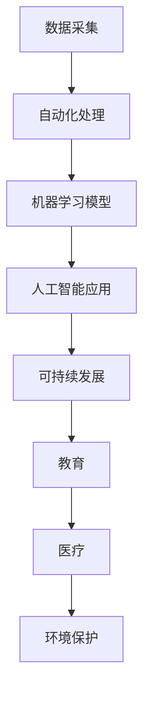

                 

# 软件 2.0 的未来愿景：创造更美好的世界

> 关键词：软件 2.0, 自动化, 机器学习, 人工智能, 未来科技, 可持续发展, 教育, 医疗, 环境保护

## 1. 背景介绍

在过去的几十年里，我们见证了信息技术的飞速发展，从个人计算机到互联网，再到移动设备，科技的进步让我们的生活变得更加便捷和丰富。但是，随着科技的不断进步，我们也不得不面对一系列新的挑战，如环境污染、资源短缺、社会不平等、信息过载等问题。这些问题迫使我们重新思考科技与人类社会的关系，并寻求更可持续、更公平的解决方案。

软件 2.0 的概念正是在这样的背景下应运而生。它不仅仅是指新一代的软件系统，更是一种全新的软件开发理念，旨在通过自动化、机器学习、人工智能等技术，使软件能够自我更新、自我优化，从而实现更高效、更智能的开发和应用。本文将探讨软件 2.0 的核心概念、技术原理及其在未来科技、教育、医疗、环境保护等领域的应用潜力。

## 2. 核心概念与联系

### 2.1 核心概念概述

软件 2.0 是相对于软件 1.0（传统的、以手动编码为主的开发方式）的一个概念。它强调的是通过自动化和智能化手段，让软件能够自我演化、自我学习，从而提升开发效率、减少人为错误，并使软件更加智能和灵活。

以下是几个与软件 2.0 密切相关的核心概念：

- **自动化**：自动化是指通过预设规则和算法，让软件能够自动执行一些重复性、低价值的任务，如代码生成、测试、部署等。自动化能够显著提高软件开发和维护的效率。

- **机器学习**：机器学习是指让软件通过大量数据的学习，自动优化其性能和功能。机器学习可以应用于模型训练、算法优化、资源管理等各个环节，使软件系统变得更加智能。

- **人工智能**：人工智能是指让软件具备类人智能，能够进行复杂的推理、决策、感知等任务。人工智能技术可以应用于自然语言处理、图像识别、语音识别等领域，使软件系统更加智能和高效。

- **可持续性**：软件 2.0 不仅关注技术本身的发展，更关注其对环境、社会的影响。通过优化资源使用、减少能源消耗、促进可持续发展，软件 2.0 可以为我们创造更美好的未来。

- **教育**：软件 2.0 可以用于教育领域的自动化和智能化，帮助学生和教师更高效地学习、教学，提升教育质量。

- **医疗**：通过智能诊断、个性化治疗、远程医疗等应用，软件 2.0 可以为医疗健康领域带来革命性的变革。

- **环境保护**：软件 2.0 可以用于监测和管理环境数据，帮助人类更好地保护地球家园。

这些概念之间通过数据驱动、自动化、智能化的方式相互联系，形成了一个完整的软件 2.0 生态系统。

### 2.2 核心概念原理和架构的 Mermaid 流程图



## 3. 核心算法原理 & 具体操作步骤

### 3.1 算法原理概述

软件 2.0 的核心算法原理主要包括以下几个方面：

- **自动化算法**：自动化算法通过预设规则和算法，自动执行一些重复性、低价值的任务。常用的自动化算法包括流水线、作业调度、容器化、持续集成等。

- **机器学习算法**：机器学习算法通过大量数据的学习，自动优化软件系统的性能和功能。常用的机器学习算法包括回归、分类、聚类、强化学习等。

- **深度学习算法**：深度学习算法通过多层神经网络的训练，使软件系统具备类人智能。常用的深度学习算法包括卷积神经网络、循环神经网络、生成对抗网络等。

- **智能优化算法**：智能优化算法通过优化模型的参数，提升软件系统的效率和性能。常用的智能优化算法包括遗传算法、粒子群算法、蚁群算法等。

### 3.2 算法步骤详解

软件 2.0 的开发和应用主要包括以下几个步骤：

1. **需求分析**：确定软件系统的需求和目标，包括功能、性能、安全性等方面的要求。

2. **数据准备**：收集和清洗数据，准备用于模型训练的数据集。

3. **模型训练**：选择合适的算法和模型，对数据集进行训练，优化模型的参数。

4. **自动化开发**：将训练好的模型应用到软件开发过程中，实现自动化代码生成、测试、部署等任务。

5. **持续优化**：通过持续收集用户反馈和环境数据，优化模型和软件系统的性能和功能。

6. **部署和监控**：将软件系统部署到生产环境，并进行实时监控和维护，确保系统稳定运行。

### 3.3 算法优缺点

软件 2.0 的优势在于其高效、智能、可持续的特点：

- **高效性**：自动化和智能化手段能够显著提高开发和维护的效率，减少人为错误。

- **智能性**：通过机器学习和深度学习算法，软件系统具备类人智能，能够进行复杂的推理、决策、感知等任务。

- **可持续性**：通过优化资源使用、减少能源消耗，软件 2.0 可以为我们创造更美好的未来。

但是，软件 2.0 也存在一些缺点：

- **依赖数据质量**：机器学习算法和深度学习算法需要大量高质量的数据进行训练，数据质量直接影响系统的性能。

- **资源消耗大**：深度学习模型通常需要大量的计算资源和存储空间，对硬件设备的要求较高。

- **模型复杂性**：复杂的模型需要更多的计算资源和时间进行训练和优化，增加了开发和维护的难度。

### 3.4 算法应用领域

软件 2.0 在多个领域都有广泛的应用：

- **软件开发**：通过自动化和智能化的开发工具，提升开发效率和代码质量。

- **云计算**：通过自动化和智能化的云计算平台，提升资源利用率和运维效率。

- **智能制造**：通过自动化和智能化的生产管理系统，提升生产效率和产品质量。

- **智慧城市**：通过自动化和智能化的城市管理系统，提升城市运行效率和管理水平。

- **金融科技**：通过自动化和智能化的金融系统，提升金融服务的效率和安全性。

## 4. 数学模型和公式 & 详细讲解 & 举例说明

### 4.1 数学模型构建

软件 2.0 的数学模型主要包括以下几个方面：

- **线性回归模型**：用于预测连续变量的值，如房价、气温等。

- **逻辑回归模型**：用于分类任务，如用户行为预测、故障诊断等。

- **卷积神经网络模型**：用于图像识别和处理，如图像分类、物体检测等。

- **循环神经网络模型**：用于序列数据处理，如文本生成、语音识别等。

- **生成对抗网络模型**：用于生成高质量的伪数据，如图像生成、文本生成等。

### 4.2 公式推导过程

以卷积神经网络模型为例，推导其核心公式。

卷积神经网络（Convolutional Neural Network，CNN）是深度学习中的一种常用模型。其核心公式包括卷积、池化、激活函数等操作。以二维卷积操作为例，其公式为：

$$y_{ij} = \sum_{k=1}^{K} w_k * x_{ij}$$

其中，$w_k$ 为卷积核，$x_{ij}$ 为输入数据，$y_{ij}$ 为卷积输出。

### 4.3 案例分析与讲解

以智能推荐系统为例，探讨软件 2.0 的应用。

智能推荐系统通过分析用户的行为数据和兴趣标签，使用机器学习算法和深度学习算法进行模型训练，自动生成个性化的推荐内容。例如，电商平台通过分析用户的浏览、购买记录，使用协同过滤算法和深度学习模型进行训练，自动生成个性化的商品推荐，提升用户的购物体验。

## 5. 项目实践：代码实例和详细解释说明

### 5.1 开发环境搭建

软件 2.0 的开发环境搭建需要以下工具：

1. **Python**：主流的数据科学和机器学习工具。

2. **TensorFlow**：深度学习框架，支持分布式计算和自动微分。

3. **PyTorch**：深度学习框架，支持动态计算图和GPU加速。

4. **Jupyter Notebook**：交互式数据科学工具，支持Python代码的编写、执行和展示。

5. **Git**：版本控制工具，支持代码的协作和共享。

### 5.2 源代码详细实现

以智能推荐系统为例，展示Python代码的实现。

```python
import pandas as pd
import tensorflow as tf
from tensorflow.keras.layers import Input, Dense, Embedding, Flatten
from tensorflow.keras.models import Model

# 读取数据集
data = pd.read_csv('user_data.csv')

# 定义模型结构
input_layer = Input(shape=(num_users,), name='input_layer')
user_embedding = Embedding(num_users, embedding_dim)(input_layer)
user_flatten = Flatten()(user_embedding)
user_dense = Dense(128, activation='relu')(user_flatten)
user_output = Dense(1, activation='sigmoid')(user_dense)

# 定义模型
model = Model(inputs=input_layer, outputs=user_output)

# 编译模型
model.compile(optimizer='adam', loss='binary_crossentropy', metrics=['accuracy'])

# 训练模型
model.fit(train_data, train_labels, epochs=num_epochs, batch_size=batch_size)

# 使用模型进行预测
predictions = model.predict(test_data)
```

### 5.3 代码解读与分析

上述代码实现了基于TensorFlow的智能推荐系统，其核心在于使用Embedding层将用户ID转换为向量表示，然后通过多层Dense层进行特征提取和分类。模型训练时使用Adam优化器，损失函数为二元交叉熵，评价指标为准确率。

## 6. 实际应用场景

### 6.1 软件开发

软件 2.0 在软件开发中的应用主要体现在以下几个方面：

- **自动化测试**：使用机器学习算法分析测试数据，自动生成测试用例和测试报告。

- **代码生成**：使用自然语言处理技术，自动生成代码模板和注释。

- **版本控制**：使用机器学习算法分析代码变更历史，自动生成补丁和变更日志。

### 6.2 云计算

软件 2.0 在云计算中的应用主要体现在以下几个方面：

- **资源管理**：使用机器学习算法预测资源使用情况，自动调整资源分配。

- **服务自动化**：使用自动化算法管理云服务实例的生命周期，实现自动扩缩容和故障处理。

- **用户行为分析**：使用机器学习算法分析用户行为数据，自动生成推荐和优化策略。

### 6.3 智能制造

软件 2.0 在智能制造中的应用主要体现在以下几个方面：

- **设备监控**：使用机器学习算法分析设备运行数据，自动预测设备故障和维护需求。

- **生产调度**：使用自动化算法优化生产流程和资源分配，提升生产效率。

- **质量控制**：使用深度学习算法分析生产数据，自动生成质量检测和控制策略。

### 6.4 未来应用展望

软件 2.0 的未来应用展望主要包括以下几个方面：

- **自动化工具**：更多的自动化工具和算法将被开发出来，帮助开发者更高效地开发和维护软件系统。

- **智能算法**：更多的智能算法将被应用于软件系统，提升其自适应和自优化能力。

- **可持续性**：更多的可持续性解决方案将被应用于软件系统的开发和应用中，减少资源消耗和环境影响。

- **跨领域融合**：软件 2.0 将被应用于更多领域，如教育、医疗、环境保护等，推动各领域的智能化和可持续发展。

## 7. 工具和资源推荐

### 7.1 学习资源推荐

为了帮助开发者系统掌握软件 2.0 的理论基础和实践技巧，这里推荐一些优质的学习资源：

1. **《深度学习》（Ian Goodfellow）**：全面介绍了深度学习的基本概念和算法，适合初学者和进阶学习者。

2. **《TensorFlow 2.0实战》（Shie Zhou）**：详细讲解了TensorFlow 2.0的使用方法和最佳实践，适合TensorFlow初学者。

3. **《Python机器学习》（Sebastian Raschka）**：介绍了Python在机器学习中的应用，适合Python初学者。

4. **《软件 2.0: 新时代的软件开发》（Andrew Ng）**：讲解了软件 2.0 的基本概念和应用，适合软件开发者和架构师。

5. **Kaggle**：提供海量数据集和机器学习竞赛，适合数据科学爱好者和竞赛选手。

### 7.2 开发工具推荐

为了更高效地开发软件 2.0 系统，以下是一些推荐的开发工具：

1. **TensorFlow**：谷歌开源的深度学习框架，支持分布式计算和GPU加速。

2. **PyTorch**：Facebook开源的深度学习框架，支持动态计算图和GPU加速。

3. **Jupyter Notebook**：交互式数据科学工具，支持Python代码的编写、执行和展示。

4. **Git**：版本控制工具，支持代码的协作和共享。

5. **Docker**：容器化技术，支持应用的无缝部署和迁移。

6. **Kubernetes**：容器编排工具，支持分布式应用的高可用性和扩展性。

### 7.3 相关论文推荐

为了深入了解软件 2.0 的最新研究进展，以下是一些推荐的论文：

1. **《TensorFlow: A System for Large-Scale Machine Learning》**：谷歌发表的TensorFlow论文，介绍了TensorFlow的核心算法和架构。

2. **《Deep Learning with Python》**：Sebastian Raschka和Vahid Mirjalili合著的深度学习入门书籍，讲解了深度学习的基本概念和算法。

3. **《Automatic Differentiation》**：Avigdor Singer和Gideon Wasserman合著的自动微分书籍，讲解了自动微分的基本原理和实现方法。

4. **《Deep Reinforcement Learning with TensorFlow 2.0》**：Ian Goodfellow等合著的深度强化学习书籍，讲解了深度强化学习的基本概念和算法。

5. **《Python Data Science Handbook》**：Jake VanderPlas合著的数据科学入门书籍，讲解了Python在数据科学中的应用。

## 8. 总结：未来发展趋势与挑战

### 8.1 研究成果总结

软件 2.0 的研究成果主要包括以下几个方面：

- **自动化工具**：大量的自动化工具和算法被开发出来，帮助开发者更高效地开发和维护软件系统。

- **智能算法**：更多的智能算法被应用于软件系统，提升其自适应和自优化能力。

- **可持续性解决方案**：更多的可持续性解决方案被应用于软件系统的开发和应用中，减少资源消耗和环境影响。

- **跨领域融合**：软件 2.0 将被应用于更多领域，如教育、医疗、环境保护等，推动各领域的智能化和可持续发展。

### 8.2 未来发展趋势

软件 2.0 的未来发展趋势主要包括以下几个方面：

- **自动化技术**：更多的自动化技术将被应用于软件开发和维护中，提升开发效率和代码质量。

- **智能算法**：更多的智能算法将被应用于软件系统，提升其自适应和自优化能力。

- **跨领域应用**：软件 2.0 将被应用于更多领域，如教育、医疗、环境保护等，推动各领域的智能化和可持续发展。

- **可持续发展**：更多的可持续性解决方案将被应用于软件系统的开发和应用中，减少资源消耗和环境影响。

- **人机协同**：软件 2.0 将与人工智能、机器学习等技术深度融合，实现人机协同的智能系统。

### 8.3 面临的挑战

软件 2.0 在发展过程中也面临一些挑战：

- **数据质量**：机器学习算法和深度学习算法需要大量高质量的数据进行训练，数据质量直接影响系统的性能。

- **资源消耗**：深度学习模型通常需要大量的计算资源和存储空间，对硬件设备的要求较高。

- **模型复杂性**：复杂的模型需要更多的计算资源和时间进行训练和优化，增加了开发和维护的难度。

- **算法鲁棒性**：软件 2.0 系统需要具备高度的鲁棒性，能够适应各种数据和环境变化，避免算法失效和错误。

### 8.4 研究展望

软件 2.0 的研究展望主要包括以下几个方面：

- **自动化技术**：开发更多的自动化工具和算法，提升开发效率和代码质量。

- **智能算法**：开发更多的智能算法，提升软件系统的自适应和自优化能力。

- **跨领域应用**：将软件 2.0 应用于更多领域，推动各领域的智能化和可持续发展。

- **可持续性解决方案**：开发更多的可持续性解决方案，减少资源消耗和环境影响。

- **人机协同**：将软件 2.0 与人工智能、机器学习等技术深度融合，实现人机协同的智能系统。

## 9. 附录：常见问题与解答

**Q1：软件 2.0 的优势是什么？**

A: 软件 2.0 的优势主要体现在以下几个方面：

- **高效性**：通过自动化和智能化的手段，显著提高开发和维护的效率，减少人为错误。

- **智能性**：通过机器学习和深度学习算法，使软件系统具备类人智能，能够进行复杂的推理、决策、感知等任务。

- **可持续性**：通过优化资源使用、减少能源消耗，软件 2.0 可以为我们创造更美好的未来。

**Q2：软件 2.0 的缺点是什么？**

A: 软件 2.0 的缺点主要体现在以下几个方面：

- **依赖数据质量**：机器学习算法和深度学习算法需要大量高质量的数据进行训练，数据质量直接影响系统的性能。

- **资源消耗大**：深度学习模型通常需要大量的计算资源和存储空间，对硬件设备的要求较高。

- **模型复杂性**：复杂的模型需要更多的计算资源和时间进行训练和优化，增加了开发和维护的难度。

**Q3：软件 2.0 的应用场景有哪些？**

A: 软件 2.0 在多个领域都有广泛的应用，主要包括：

- **软件开发**：通过自动化和智能化的开发工具，提升开发效率和代码质量。

- **云计算**：通过自动化和智能化的云计算平台，提升资源利用率和运维效率。

- **智能制造**：通过自动化和智能化的生产管理系统，提升生产效率和产品质量。

- **智慧城市**：通过自动化和智能化的城市管理系统，提升城市运行效率和管理水平。

- **金融科技**：通过自动化和智能化的金融系统，提升金融服务的效率和安全性。

**Q4：如何优化软件 2.0 系统的性能？**

A: 优化软件 2.0 系统的性能主要包括以下几个方面：

- **数据预处理**：对输入数据进行清洗、归一化、特征提取等预处理操作，提升模型的训练效果。

- **模型选择**：根据任务需求和数据特点，选择合适的模型和算法，提升系统的性能和效率。

- **参数调优**：通过网格搜索、随机搜索、贝叶斯优化等方法，优化模型的参数，提升模型的性能和鲁棒性。

- **模型集成**：通过集成多个模型，提升系统的泛化能力和鲁棒性。

- **硬件加速**：通过使用GPU、TPU等高性能设备，加速模型的训练和推理。

通过以上措施，可以显著提升软件 2.0 系统的性能和效率。

---

作者：禅与计算机程序设计艺术 / Zen and the Art of Computer Programming

