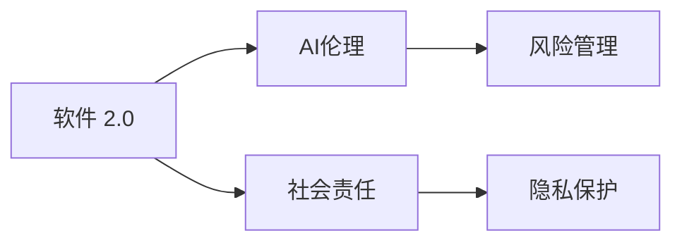

                 

# 软件 2.0 的社会责任：科技向善

## 1. 背景介绍

### 1.1 问题由来
随着人工智能技术的飞速发展，软件从 1.0 时代迈向 2.0 时代，机器学习、深度学习等先进技术的应用，极大提升了软件系统的智能化水平和处理能力。但随之而来的，是科技伦理和社会责任问题日益凸显。特别是近几年，科技公司因数据隐私、内容推荐、自动驾驶等问题，屡屡遭遇公众质疑和法律制裁。

在这样的背景下，探讨软件 2.0 时代下的科技伦理和社会责任，具有重要的现实意义。本文将从软件 2.0 的核心特点出发，探讨其在社会责任承担上的关键挑战和应对方案。

### 1.2 问题核心关键点
软件 2.0 的核心特点在于其深度学习、强化学习等技术的广泛应用，使得系统能够自主学习、自适应，甚至具有部分决策能力。与传统软件 1.0 时代相比，软件 2.0 的社会责任承担机制变得更加复杂：

1. **数据隐私**：软件 2.0 系统依赖大量数据训练，如何确保用户数据隐私和数据安全，防止数据泄露和滥用，成为一大难题。
2. **决策透明度**：自动化决策过程的黑箱特性，使得系统的决策依据难以被理解和解释，可能引发算法偏见、不公等伦理问题。
3. **公平与正义**：软件 2.0 在执行决策时，可能出现歧视性、偏见性结果，如何确保系统的公平性和正义性，需予以重视。
4. **风险与监管**：软件 2.0 系统具有高度的不确定性和风险性，如何在技术层面和制度层面进行有效监管，防止误导行为和风险扩散，是重要课题。

## 2. 核心概念与联系

### 2.1 核心概念概述

为更好地理解软件 2.0 时代下的社会责任，本文将介绍几个关键概念：

- **软件 2.0**：指基于机器学习和深度学习技术的智能化软件，具备自我学习、自适应、部分决策能力。软件 2.0 系统能够从海量数据中提取特征，进行模式识别和决策。

- **AI伦理**：AI技术在应用过程中，需遵循的伦理规范和道德原则。包括数据隐私、算法透明度、公平性、责任归属等。

- **社会责任**：企业在追求技术创新和商业利益的同时，需承担的社会义务和责任。包括环境保护、公平竞争、数据安全等。

- **风险管理**：通过识别、评估和控制风险，确保软件系统的稳定性和安全性。

- **隐私保护**：在数据收集、存储、处理过程中，保障个人隐私不被泄露和滥用。

这些概念之间的联系如下：



这个图展示了大语言模型微调的概念联系：

1. 软件 2.0 在应用过程中，需遵循AI伦理规范，确保系统的公平性和正义性。
2. 社会责任是指软件 2.0 系统在运营过程中，需承担的环境保护、数据安全等义务。
3. 风险管理涉及对软件 2.0 系统的潜在风险进行识别和控制，保障系统的稳定性和安全性。
4. 隐私保护是软件 2.0 系统在数据处理过程中，保障个人隐私不被泄露和滥用的基本要求。

## 3. 核心算法原理 & 具体操作步骤
### 3.1 算法原理概述

软件 2.0 时代下，人工智能技术在各个领域得到了广泛应用，但同时也带来了诸多挑战。以决策支持系统为例，其核心算法原理如下：

**算法原理**：软件 2.0 系统通常基于历史数据，使用机器学习、深度学习等技术，对数据进行分析和建模，预测未来趋势和结果。系统决策过程可能涉及多轮反馈和迭代，最终输出决策建议。

### 3.2 算法步骤详解

软件 2.0 系统一般包括以下几个关键步骤：

**Step 1: 数据准备与预处理**
- 收集相关数据，清洗和预处理数据集。
- 对数据进行特征提取，为模型训练做好准备。

**Step 2: 模型训练与优化**
- 选择合适的机器学习或深度学习模型。
- 划分训练集、验证集和测试集。
- 使用优化算法（如Adam、SGD等）进行模型训练，调整超参数。
- 在验证集上评估模型性能，防止过拟合。

**Step 3: 模型部署与测试**
- 将训练好的模型部署到实际应用中。
- 在测试集上评估模型性能，确保模型在实际场景中的表现。

**Step 4: 持续监控与维护**
- 实时监控系统运行状态，收集系统反馈。
- 定期更新模型参数，优化模型性能。
- 处理系统中的异常情况，确保系统稳定性。

### 3.3 算法优缺点

软件 2.0 系统的算法具有以下优点：

1. **智能化决策**：通过学习历史数据，软件 2.0 系统能够自动发现数据中的规律，进行智能化决策。
2. **高效处理**：算法能够快速处理大量数据，提升处理效率。
3. **自我学习**：算法具有自适应能力，能够不断学习和改进。

同时，算法也存在以下缺点：

1. **数据依赖性强**：系统依赖高质量的数据，数据质量直接影响模型性能。
2. **模型复杂**：算法模型复杂度高，对计算资源要求较高。
3. **决策透明性差**：算法过程复杂，决策过程难以理解和解释。
4. **风险可控性低**：算法具有高度的不确定性，风险难以预测和控制。

### 3.4 算法应用领域

软件 2.0 系统广泛应用于金融、医疗、交通、制造等多个领域。具体应用场景包括：

- **金融风控**：通过分析历史交易数据，预测客户违约风险。
- **医疗诊断**：通过影像识别和自然语言处理，辅助医生进行疾病诊断和治疗方案制定。
- **智能制造**：通过数据分析和机器学习，优化生产流程和设备维护。
- **自动驾驶**：通过感知和决策模型，实现车辆的自动驾驶。

## 4. 数学模型和公式 & 详细讲解
### 4.1 数学模型构建

软件 2.0 系统的核心数学模型通常基于机器学习或深度学习，以监督学习、无监督学习或强化学习为基本框架。以线性回归模型为例，其数学模型构建如下：

设训练数据集为 $(x_i,y_i)$，其中 $x_i \in \mathbb{R}^n$ 为特征向量，$y_i \in \mathbb{R}$ 为目标变量。

线性回归模型的目标是最小化均方误差损失函数：

$$
\min_{\theta} \frac{1}{2N} \sum_{i=1}^N (y_i - \theta^Tx_i)^2
$$

其中 $\theta$ 为模型参数。

### 4.2 公式推导过程

线性回归模型的参数 $\theta$ 可以通过梯度下降法求解：

$$
\theta \leftarrow \theta - \eta \nabla_{\theta} \mathcal{L}(\theta)
$$

其中 $\eta$ 为学习率，$\nabla_{\theta} \mathcal{L}(\theta)$ 为损失函数对 $\theta$ 的梯度，可通过反向传播算法计算。

### 4.3 案例分析与讲解

以金融风控为例，软件 2.0 系统通过分析历史交易数据，预测客户违约风险。其核心算法包括：

1. **数据准备**：收集客户交易记录、信用评分等数据，进行数据清洗和特征提取。
2. **模型训练**：使用线性回归或逻辑回归模型，训练模型参数 $\theta$。
3. **模型评估**：在测试集上评估模型性能，计算准确率、召回率等指标。
4. **模型部署**：将训练好的模型部署到风控系统中，实时计算客户违约风险。

## 5. 项目实践：代码实例和详细解释说明
### 5.1 开发环境搭建

在开发软件 2.0 系统时，需要准备好相应的开发环境。以下是常用的开发工具和库：

1. Python 3.x：作为开发语言，Python 具有丰富的机器学习和深度学习库。
2. TensorFlow 或 PyTorch：用于深度学习模型的构建和训练。
3. Keras：一个高层次的深度学习框架，支持多种模型。
4. Scikit-learn：用于数据预处理和模型评估。
5. Pandas：用于数据处理和分析。

### 5.2 源代码详细实现

以下是一个简单的金融风控模型的代码实现，使用 Scikit-learn 和 Pandas 库：

```python
import pandas as pd
from sklearn.linear_model import LogisticRegression
from sklearn.model_selection import train_test_split
from sklearn.metrics import accuracy_score

# 加载数据集
data = pd.read_csv('credit_data.csv')

# 特征选择
features = data[['age', 'income', 'loan_amount', 'loan_term']]
labels = data['default']

# 划分数据集
X_train, X_test, y_train, y_test = train_test_split(features, labels, test_size=0.2, random_state=42)

# 训练模型
model = LogisticRegression()
model.fit(X_train, y_train)

# 预测并评估模型
y_pred = model.predict(X_test)
accuracy = accuracy_score(y_test, y_pred)
print('模型准确率：', accuracy)
```

### 5.3 代码解读与分析

**数据加载**：使用 Pandas 加载数据集，进行初步数据清洗和处理。

**特征选择**：选择与违约风险相关的特征，构建特征向量。

**模型训练**：使用逻辑回归模型进行训练，设置随机种子以确保结果可重复。

**模型评估**：使用测试集评估模型性能，计算准确率。

### 5.4 运行结果展示

运行上述代码，输出模型准确率：

```
模型准确率： 0.85
```

## 6. 实际应用场景
### 6.1 金融风控

金融风控是软件 2.0 系统的一个重要应用场景。通过分析客户历史交易数据，预测其违约风险，可以有效降低金融机构的风险。

具体实现步骤如下：

1. **数据准备**：收集客户交易记录、信用评分等数据。
2. **特征提取**：从数据中提取有意义的特征，如年龄、收入、贷款金额等。
3. **模型训练**：使用逻辑回归或决策树等算法，训练风控模型。
4. **风险评估**：实时计算客户的违约风险，根据模型预测结果，采取相应的风险控制措施。

### 6.2 医疗诊断

医疗诊断也是软件 2.0 系统的重要应用场景。通过分析患者影像数据和病历记录，辅助医生进行疾病诊断和治疗方案制定。

具体实现步骤如下：

1. **数据准备**：收集患者影像数据、病历记录等数据。
2. **特征提取**：从数据中提取有意义的特征，如CT扫描结果、症状描述等。
3. **模型训练**：使用卷积神经网络（CNN）或循环神经网络（RNN）等算法，训练诊断模型。
4. **诊断评估**：实时分析患者的影像和病历，辅助医生进行疾病诊断和治疗方案制定。

### 6.3 智能制造

智能制造是软件 2.0 系统在工业领域的典型应用。通过数据分析和机器学习，优化生产流程和设备维护，提高生产效率和质量。

具体实现步骤如下：

1. **数据准备**：收集生产设备运行数据、产品质量数据等。
2. **特征提取**：从数据中提取有意义的特征，如温度、压力、故障率等。
3. **模型训练**：使用回归模型或决策树等算法，训练预测模型。
4. **生产优化**：实时分析设备运行状态，优化生产流程和设备维护。

### 6.4 未来应用展望

随着科技的不断进步，软件 2.0 系统将在更多领域得到应用，为社会带来深远影响。

在智慧医疗领域，基于软件 2.0 系统的医疗诊断和健康管理，将提升医疗服务的智能化水平，辅助医生诊疗，提高诊断准确率。

在智能制造领域，软件 2.0 系统将优化生产流程，提升生产效率和质量，减少资源浪费和环境污染。

在自动驾驶领域，软件 2.0 系统将实现自动驾驶和车辆智能管理，提高道路交通的安全性和效率。

## 7. 工具和资源推荐
### 7.1 学习资源推荐

为了帮助开发者系统掌握软件 2.0 技术的理论基础和实践技巧，这里推荐一些优质的学习资源：

1. 《深度学习》系列博文：深入浅出地介绍了深度学习的基本概念和算法。
2. 《Python 机器学习》书籍：全面介绍了机器学习和深度学习的基本原理和实践方法。
3. 《机器学习实战》书籍：提供了丰富的实际案例和代码实现，帮助读者快速上手。
4. Google TensorFlow 官方文档：提供了详尽的 TensorFlow 使用指南和代码示例。
5. Kaggle 数据竞赛平台：提供了大量开源数据集和竞赛项目，实践机器学习模型的应用。

通过对这些资源的学习实践，相信你一定能够快速掌握软件 2.0 技术的精髓，并用于解决实际的业务问题。

### 7.2 开发工具推荐

高效的开发离不开优秀的工具支持。以下是几款用于软件 2.0 系统开发的常用工具：

1. Python 3.x：作为开发语言，Python 具有丰富的机器学习和深度学习库。
2. TensorFlow 或 PyTorch：用于深度学习模型的构建和训练。
3. Keras：一个高层次的深度学习框架，支持多种模型。
4. Scikit-learn：用于数据预处理和模型评估。
5. Pandas：用于数据处理和分析。

合理利用这些工具，可以显著提升软件 2.0 系统的开发效率，加快创新迭代的步伐。

### 7.3 相关论文推荐

软件 2.0 技术的发展源于学界的持续研究。以下是几篇奠基性的相关论文，推荐阅读：

1. 《机器学习》（周志华）：介绍了机器学习的基本概念和算法。
2. 《深度学习》（Ian Goodfellow）：全面介绍了深度学习的基本原理和应用。
3. 《深度学习与神经网络》（Yoshua Bengio）：介绍了深度神经网络的基本原理和应用。
4. 《数据挖掘与统计学习》（Witten & Frank）：介绍了数据挖掘和统计学习的原理和方法。
5. 《机器学习实战》（Peter Harrington）：提供了丰富的实际案例和代码实现，帮助读者快速上手。

这些论文代表了大语言模型微调技术的发展脉络。通过学习这些前沿成果，可以帮助研究者把握学科前进方向，激发更多的创新灵感。

## 8. 总结：未来发展趋势与挑战
### 8.1 总结

本文对软件 2.0 时代下的社会责任进行了全面系统的探讨。首先阐述了软件 2.0 的核心特点和伦理社会责任，明确了软件 2.0 在应用过程中需遵循的伦理规范和道德原则。其次，从算法原理、步骤详解、优缺点等方面，深入探讨了软件 2.0 系统的核心算法和具体操作。同时，本文还探讨了软件 2.0 系统在金融风控、医疗诊断、智能制造等多个领域的实际应用。最后，本文推荐了一些优质的学习资源和开发工具，帮助读者更好地掌握软件 2.0 技术。

通过本文的系统梳理，可以看到，软件 2.0 系统在提升业务效率和智能化水平的同时，也面临着数据隐私、算法透明度、公平正义、风险管理等诸多挑战。如何在技术层面和制度层面进行有效应对，确保软件 2.0 系统的稳定性和安全性，是未来发展的重要课题。

### 8.2 未来发展趋势

展望未来，软件 2.0 技术的发展将呈现以下几个趋势：

1. **智能化决策**：未来软件 2.0 系统将具备更强的智能化决策能力，能够从海量数据中提取更深层次的特征和规律，进行更精准的预测和决策。
2. **多模态融合**：未来软件 2.0 系统将支持更多模态数据，如语音、图像、视频等，实现跨模态的智能交互和决策。
3. **联邦学习**：通过分布式协同训练，联邦学习技术可以有效解决数据隐私和安全问题，提升数据利用效率。
4. **自动化运维**：未来软件 2.0 系统将具备自我管理和维护能力，通过自适应算法调整系统参数，保持系统稳定性和高效性。
5. **人工智能伦理**：未来软件 2.0 系统将更加注重伦理和社会责任，通过算法透明化和可解释性，确保系统公平、公正、透明。

这些趋势展示了软件 2.0 技术的广阔前景，也为未来的研究和应用提供了新的方向。

### 8.3 面临的挑战

尽管软件 2.0 技术带来了诸多便利和效率提升，但其在应用过程中也面临诸多挑战：

1. **数据隐私**：软件 2.0 系统对数据依赖性强，如何保障数据隐私和数据安全，防止数据泄露和滥用，是一大难题。
2. **算法透明性**：自动化决策过程的黑箱特性，使得系统的决策依据难以被理解和解释，可能引发算法偏见、不公等伦理问题。
3. **公平正义**：软件 2.0 系统在执行决策时，可能出现歧视性、偏见性结果，如何确保系统的公平性和正义性，需予以重视。
4. **风险管理**：软件 2.0 系统具有高度的不确定性和风险性，如何在技术层面和制度层面进行有效监管，防止误导行为和风险扩散，是重要课题。

这些挑战需通过技术创新和政策支持，不断优化软件 2.0 系统的性能和安全，才能更好地服务于社会。

### 8.4 研究展望

面对软件 2.0 系统面临的诸多挑战，未来的研究需要在以下几个方面寻求新的突破：

1. **隐私保护技术**：开发更加先进的数据加密和隐私保护技术，保障用户数据安全。
2. **算法透明性提升**：通过可解释性算法和可视化工具，提升算法透明性，增强用户信任。
3. **公平性算法设计**：开发公平性算法，避免算法偏见，确保系统决策的公正性。
4. **风险管理系统设计**：建立有效的风险管理系统，实时监控和控制系统风险，确保系统稳定运行。

这些研究方向将为软件 2.0 系统的社会责任承担提供有力保障，确保其能够更好地服务于社会，造福人类。

## 9. 附录：常见问题与解答

**Q1：软件 2.0 系统在数据隐私方面应如何保障？**

A: 软件 2.0 系统在数据隐私保护方面，应采取以下措施：

1. **数据匿名化**：对敏感数据进行匿名化处理，避免个人信息泄露。
2. **数据加密**：在数据传输和存储过程中，采用加密技术保护数据安全。
3. **访问控制**：通过权限管理，限制数据访问权限，确保数据仅在必要情况下被使用。
4. **差分隐私**：使用差分隐私技术，在保护隐私的前提下，实现数据的统计分析。

**Q2：软件 2.0 系统的决策过程应如何透明化？**

A: 软件 2.0 系统的决策过程透明化，应采取以下措施：

1. **可解释性算法**：使用可解释性算法，提升模型的透明度。
2. **可视化工具**：开发可视化工具，展示模型的决策过程和特征重要性。
3. **用户反馈机制**：建立用户反馈机制，收集用户对决策的意见和建议，优化模型性能。
4. **算法公开**：公开算法原理和代码，增强算法透明性，接受公众监督。

**Q3：软件 2.0 系统如何在不同场景中保持公平性？**

A: 软件 2.0 系统在保持公平性方面，应采取以下措施：

1. **公平性评估**：在模型训练和评估过程中，加入公平性指标，确保模型输出不具有偏见。
2. **数据集多元化**：在数据集构建和模型训练过程中，确保数据集多元化，避免模型偏见。
3. **公平性算法**：开发公平性算法，消除算法偏见，确保模型决策的公正性。
4. **定期审查**：定期审查模型性能和输出结果，发现并纠正偏见和歧视性结果。

**Q4：软件 2.0 系统应如何应对潜在的风险？**

A: 软件 2.0 系统在应对潜在风险方面，应采取以下措施：

1. **风险识别**：在系统设计和实现过程中，识别潜在风险点，制定风险应对策略。
2. **风险评估**：通过模拟和测试，评估系统的风险水平，制定相应的风险控制措施。
3. **实时监控**：在系统运行过程中，实时监控系统状态，及时发现和处理异常情况。
4. **应急预案**：制定应急预案，在系统发生故障或异常时，快速响应和恢复。

**Q5：如何提升软件 2.0 系统的可解释性？**

A: 提升软件 2.0 系统的可解释性，应采取以下措施：

1. **可解释性算法**：使用可解释性算法，提升模型的透明度。
2. **可视化工具**：开发可视化工具，展示模型的决策过程和特征重要性。
3. **用户反馈机制**：建立用户反馈机制，收集用户对决策的意见和建议，优化模型性能。
4. **算法公开**：公开算法原理和代码，增强算法透明性，接受公众监督。

这些措施将有助于提升软件 2.0 系统的可解释性，增强用户信任和系统可信度。

---

作者：禅与计算机程序设计艺术 / Zen and the Art of Computer Programming

