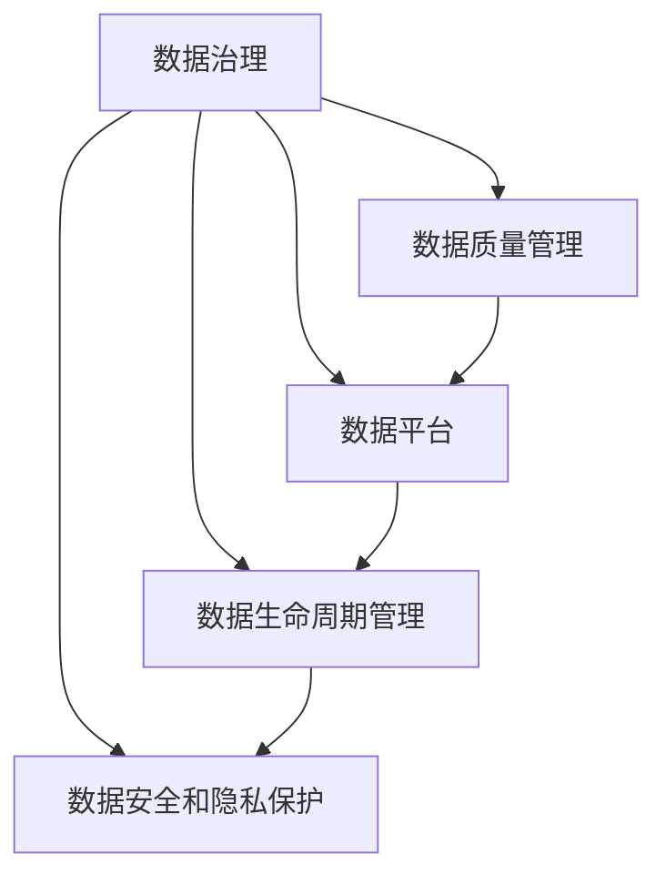

                 

# 软件2.0中的数据管理与治理

> 关键词：软件2.0, 数据管理, 数据治理, 数据平台, 数据质量, 数据安全

## 1. 背景介绍

### 1.1 问题由来

随着软件2.0时代的到来，数据已经成为企业的核心资产之一。在软件2.0的推动下，数据被广泛应用于决策、运营、创新等多个环节，对企业竞争力和创新力产生了深远影响。然而，数据的管理和治理仍然是一个复杂而艰难的挑战。数据分散在不同的系统、部门和业务流程中，数据的采集、存储、整合、分析和应用过程复杂，数据质量和数据安全问题频发。这些问题严重制约了数据价值的释放，影响了企业的决策支持和创新能力的提升。因此，如何有效地进行数据管理与治理，已经成为企业转型升级的关键。

### 1.2 问题核心关键点

软件2.0时代的数据管理与治理面临以下几个核心问题：

1. **数据分散与孤岛问题**：数据分散在不同的系统、部门和业务流程中，形成数据孤岛，难以进行集中管理和应用。
2. **数据质量问题**：数据的不完整性、不一致性、冗余性等问题普遍存在，影响了数据的可靠性和可用性。
3. **数据安全和隐私保护**：数据泄露、滥用和误用等问题频发，数据安全和隐私保护成为亟待解决的问题。
4. **数据共享与协作问题**：跨部门、跨业务的数据共享和协作困难，阻碍了数据的充分应用。
5. **数据管理和治理工具不足**：现有的数据管理和治理工具功能单一，难以满足复杂的数据治理需求。

解决这些问题，需要构建一个集中的、规范化的、自动化的数据管理与治理体系，以确保数据的完整性、一致性、可靠性和安全性。

## 2. 核心概念与联系

### 2.1 核心概念概述

数据管理与治理是企业数据战略的重要组成部分，旨在通过规范化的流程、技术和工具，实现数据的全面管理、分析和应用。其核心概念包括：

- **数据治理**：通过制定数据政策和规范，确保数据的安全性、完整性和一致性，促进数据的共享和利用。
- **数据质量管理**：通过数据清洗、校验和监控，确保数据的质量，提升数据的可靠性和可用性。
- **数据平台**：构建集中式的数据存储和处理平台，实现数据的集中管理和分析。
- **数据生命周期管理**：通过定义数据生命周期，确保数据的采集、存储、处理和应用的规范化和自动化。
- **数据安全和隐私保护**：通过技术手段和政策规范，保障数据的安全性和隐私保护，防止数据泄露和滥用。

### 2.2 核心概念原理和架构的 Mermaid 流程图



这个流程图展示了数据治理的五个核心概念及其之间的关系。数据治理通过制定政策和规范，确保数据的质量、安全性和生命周期管理，同时支持数据的共享和利用。数据质量管理通过清洗和校验，提升数据的可靠性。数据平台作为数据的集中存储和处理中心，支持数据的治理和分析。数据生命周期管理定义数据从采集到应用的完整流程，确保数据的规范化和自动化。数据安全和隐私保护通过技术手段和政策规范，保障数据的安全和隐私。

## 3. 核心算法原理 & 具体操作步骤

### 3.1 算法原理概述

数据管理与治理的算法原理主要基于数据挖掘、机器学习和人工智能等技术，通过对数据的分析和处理，实现数据的治理和应用。其核心算法包括：

- **数据清洗算法**：通过数据清洗算法，识别和修复数据中的错误和不完整性，提升数据的质量。
- **数据校验算法**：通过数据校验算法，确保数据的完整性和一致性，防止数据的不一致性和冗余性。
- **数据质量评估算法**：通过数据质量评估算法，量化数据的质量，识别和解决数据质量问题。
- **数据集成算法**：通过数据集成算法，将分散在不同系统中的数据进行整合，构建统一的数据视图。
- **数据分类和聚类算法**：通过数据分类和聚类算法，发现数据中的模式和规律，提升数据的可解释性和应用价值。
- **数据安全和隐私保护算法**：通过数据安全和隐私保护算法，保障数据的安全性和隐私保护，防止数据泄露和滥用。

### 3.2 算法步骤详解

数据管理与治理的具体操作步骤包括以下几个步骤：

1. **数据收集和存储**：从不同系统、部门和业务流程中收集数据，存储到集中式的数据平台中。
2. **数据清洗和校验**：使用数据清洗和校验算法，识别和修复数据中的错误和不完整性，确保数据的质量和一致性。
3. **数据集成和整合**：通过数据集成算法，将分散的数据进行整合，构建统一的数据视图。
4. **数据分类和聚类**：使用数据分类和聚类算法，发现数据中的模式和规律，提升数据的可解释性和应用价值。
5. **数据治理和应用**：通过数据治理政策和技术手段，保障数据的安全性和隐私保护，促进数据的共享和利用。

### 3.3 算法优缺点

数据管理与治理的算法具有以下优点：

1. **提升数据质量**：通过数据清洗和校验算法，提升数据的可靠性和可用性，确保数据的完整性和一致性。
2. **促进数据共享和利用**：通过数据集成和治理，促进数据的共享和利用，提升数据的价值。
3. **保障数据安全性和隐私保护**：通过数据安全和隐私保护算法，保障数据的安全性和隐私保护，防止数据泄露和滥用。

同时，数据管理与治理的算法也存在一些缺点：

1. **算法复杂度高**：数据管理与治理的算法涉及数据挖掘、机器学习和人工智能等技术，算法复杂度高，实现难度大。
2. **数据质量和一致性难以保障**：数据分散在不同系统、部门和业务流程中，难以确保数据的完整性和一致性。
3. **成本高**：数据管理和治理的算法需要大量的计算资源和人力成本，实施成本高。

### 3.4 算法应用领域

数据管理与治理的算法广泛应用于以下几个领域：

1. **金融行业**：在金融行业，数据管理与治理的算法用于风险管理、合规监控、客户分析等领域，提升金融服务的风险控制和客户服务能力。
2. **医疗行业**：在医疗行业，数据管理与治理的算法用于病历管理、药物研发、医疗资源优化等领域，提升医疗服务的质量和服务效率。
3. **制造业**：在制造业，数据管理与治理的算法用于设备监控、生产调度、质量控制等领域，提升制造业的生产效率和产品质量。
4. **零售行业**：在零售行业，数据管理与治理的算法用于客户分析、库存管理、销售预测等领域，提升零售行业的客户体验和销售效率。
5. **政府行业**：在政府行业，数据管理与治理的算法用于公共服务、社会治理、环境监测等领域，提升政府的管理效率和服务水平。

## 4. 数学模型和公式 & 详细讲解 & 举例说明

### 4.1 数学模型构建

数据管理与治理的数学模型主要包括数据质量评估模型、数据集成模型和数据安全与隐私保护模型。

- **数据质量评估模型**：用于量化数据的质量，识别和解决数据质量问题。常用的数据质量评估模型包括数据完整性评估模型、数据一致性评估模型和数据冗余性评估模型。
- **数据集成模型**：用于将分散的数据进行整合，构建统一的数据视图。常用的数据集成模型包括数据合并模型、数据融合模型和数据聚合模型。
- **数据安全与隐私保护模型**：用于保障数据的安全性和隐私保护，防止数据泄露和滥用。常用的数据安全与隐私保护模型包括数据加密模型、数据匿名化模型和数据访问控制模型。

### 4.2 公式推导过程

以下我们以数据质量评估模型为例，推导数据完整性评估模型的计算公式。

假设数据集中包含 $n$ 条记录，每条记录包含 $m$ 个字段，用 $\mathbf{x}_i = [x_{i1}, x_{i2}, ..., x_{im}]$ 表示第 $i$ 条记录的特征向量。设每个字段的缺失概率为 $p_j$，则完整性评估函数 $f(\mathbf{x}_i)$ 可以表示为：

$$
f(\mathbf{x}_i) = \prod_{j=1}^m (1-p_j) + \sum_{j=1}^m p_j x_{ij}
$$

其中，$\prod_{j=1}^m (1-p_j)$ 表示记录 $i$ 包含所有字段的概率，$\sum_{j=1}^m p_j x_{ij}$ 表示记录 $i$ 缺失字段 $j$ 的概率和相应的取值。

### 4.3 案例分析与讲解

以下我们以金融行业为例，介绍数据管理与治理在金融行业中的应用。

在金融行业，数据管理与治理的应用主要包括风险管理、合规监控和客户分析等方面。例如，在风险管理方面，数据管理与治理的算法可以用于信用评估、风险预测和违约预警等领域，提升风险控制的效率和准确性。在合规监控方面，数据管理与治理的算法可以用于交易监控、合规审计和法规遵守等领域，提升合规监控的全面性和及时性。在客户分析方面，数据管理与治理的算法可以用于客户细分、客户流失预测和客户满意度分析等领域，提升客户服务的质量和客户满意度。

## 5. 项目实践：代码实例和详细解释说明

### 5.1 开发环境搭建

在进行数据管理与治理的实践前，我们需要准备好开发环境。以下是使用Python进行Pandas和SQLAlchemy开发的环境配置流程：

1. 安装Anaconda：从官网下载并安装Anaconda，用于创建独立的Python环境。

2. 创建并激活虚拟环境：
```bash
conda create -n data-governance python=3.8 
conda activate data-governance
```

3. 安装Pandas和SQLAlchemy：
```bash
pip install pandas sqlalchemy
```

4. 安装各类工具包：
```bash
pip install numpy matplotlib tqdm scikit-learn jupyter notebook ipython
```

完成上述步骤后，即可在`data-governance`环境中开始数据管理与治理的实践。

### 5.2 源代码详细实现

下面我们以金融行业为例，给出使用Pandas和SQLAlchemy进行数据清洗和校验的PyTorch代码实现。

首先，定义数据清洗函数：

```python
import pandas as pd
import sqlalchemy

def data_cleaning(data_path, output_path):
    # 读取数据集
    df = pd.read_csv(data_path)
    
    # 数据清洗
    df = df.dropna(thresh=0.9)  # 删除缺失率大于90%的记录
    df = df.drop_duplicates()  # 删除重复记录
    df = df.fillna(method='ffill')  # 前向填充缺失值
    
    # 数据校验
    df['balance'] = df['balance'].abs()  # 取绝对值
    
    # 保存数据
    df.to_csv(output_path, index=False)
```

然后，定义数据集成函数：

```python
from sqlalchemy import create_engine

def data_integration(data_paths, output_path):
    # 创建数据库连接
    engine = create_engine('sqlite:///data.db')
    
    # 读取数据集
    dfs = [pd.read_csv(path) for path in data_paths]
    
    # 数据集成
    merged_df = pd.concat(dfs, ignore_index=True)
    
    # 保存数据
    merged_df.to_csv(output_path, index=False)
```

最后，启动数据清洗和集成流程：

```python
data_cleaning('financial_data.csv', 'cleaned_data.csv')
data_integration(['cleaned_data.csv', 'additional_data.csv'], 'integrated_data.csv')
```

以上就是使用Pandas和SQLAlchemy进行数据清洗和校验的完整代码实现。可以看到，Pandas和SQLAlchemy提供了强大的数据处理和集成功能，可以轻松完成数据清洗和校验的任务。

### 5.3 代码解读与分析

让我们再详细解读一下关键代码的实现细节：

**data_cleaning函数**：
- 使用Pandas的`read_csv`方法读取数据集。
- 使用Pandas的`dropna`方法删除缺失率大于90%的记录，使用`drop_duplicates`方法删除重复记录，使用`fillna`方法前向填充缺失值。
- 使用Pandas的`abs`方法取`balance`字段的绝对值。
- 使用Pandas的`to_csv`方法将清洗后的数据保存为CSV文件。

**data_integration函数**：
- 使用SQLAlchemy的`create_engine`方法创建数据库连接。
- 使用Pandas的`read_csv`方法读取多个数据集。
- 使用Pandas的`concat`方法将数据集进行合并，使用`ignore_index`参数重置索引。
- 使用Pandas的`to_csv`方法将合并后的数据保存为CSV文件。

**启动数据清洗和集成流程**：
- 调用`data_cleaning`函数对金融数据进行清洗。
- 调用`data_integration`函数将清洗后的金融数据和附加数据进行集成。

可以看到，Pandas和SQLAlchemy在数据清洗和集成过程中扮演了重要角色，提供了高效、灵活的数据处理和集成功能。合理利用这些工具，可以显著提升数据管理与治理任务的开发效率，加快创新迭代的步伐。

当然，工业级的系统实现还需考虑更多因素，如数据安全和隐私保护、数据质量监控、数据版本控制等。但核心的数据清洗和集成任务基本与此类似。

## 6. 实际应用场景

### 6.1 金融行业

在金融行业，数据管理与治理的应用主要包括风险管理、合规监控和客户分析等方面。例如，在风险管理方面，数据管理与治理的算法可以用于信用评估、风险预测和违约预警等领域，提升风险控制的效率和准确性。在合规监控方面，数据管理与治理的算法可以用于交易监控、合规审计和法规遵守等领域，提升合规监控的全面性和及时性。在客户分析方面，数据管理与治理的算法可以用于客户细分、客户流失预测和客户满意度分析等领域，提升客户服务的质量和客户满意度。

### 6.2 医疗行业

在医疗行业，数据管理与治理的应用主要包括病历管理、药物研发和医疗资源优化等方面。例如，在病历管理方面，数据管理与治理的算法可以用于病历清洗、病历整合和病历共享等领域，提升病历管理的效率和质量。在药物研发方面，数据管理与治理的算法可以用于药物筛选、药物测试和药物评估等领域，提升药物研发的效率和成功率。在医疗资源优化方面，数据管理与治理的算法可以用于医院资源调度、医生排班和患者分诊等领域，提升医疗服务的效率和质量。

### 6.3 制造业

在制造业，数据管理与治理的应用主要包括设备监控、生产调度和质量控制等方面。例如，在设备监控方面，数据管理与治理的算法可以用于设备状态监控、设备故障预测和设备维护等领域，提升设备监控的效率和准确性。在生产调度方面，数据管理与治理的算法可以用于生产计划优化、生产调度优化和生产流程改进等领域，提升生产调度的效率和准确性。在质量控制方面，数据管理与治理的算法可以用于质量数据采集、质量数据分析和质量数据监控等领域，提升质量控制的效率和准确性。

### 6.4 未来应用展望

随着数据管理和治理技术的不断发展，未来的数据管理与治理将呈现以下几个发展趋势：

1. **数据智能分析**：通过引入人工智能和机器学习技术，实现数据智能分析和预测，提升数据的利用效率和决策支持能力。
2. **数据自动化治理**：通过自动化数据治理技术，实现数据的自动清洗、自动校验和自动集成，提升数据治理的效率和准确性。
3. **数据治理平台化**：通过构建数据治理平台，实现数据的集中管理和统一治理，提升数据治理的规范化和标准化。
4. **数据安全和隐私保护**：通过数据安全和隐私保护技术，保障数据的安全性和隐私保护，防止数据泄露和滥用。
5. **数据共享和协作**：通过数据共享和协作技术，实现数据的跨部门、跨业务共享和利用，提升数据治理的协同性和应用价值。

这些趋势凸显了数据管理和治理技术的广阔前景。这些方向的探索发展，必将进一步提升数据治理的水平，为企业的决策支持和创新能力提升提供坚实的保障。

## 7. 工具和资源推荐

### 7.1 学习资源推荐

为了帮助开发者系统掌握数据管理和治理的理论基础和实践技巧，这里推荐一些优质的学习资源：

1. 《数据治理与治理技术》系列博文：由数据治理专家撰写，深入浅出地介绍了数据治理的理论基础和实践技巧。

2. 《数据管理与治理》课程：由Coursera平台开设的课程，涵盖了数据治理的各个方面，包括数据质量管理、数据安全与隐私保护等。

3. 《数据治理最佳实践》书籍：数据治理领域的权威书籍，提供了大量数据治理的实践案例和最佳实践。

4. 《数据治理工具和技术》书籍：介绍了数据治理工具和技术的全面知识，帮助开发者选择和使用合适的工具。

5. 《数据治理平台构建》课程：介绍了数据治理平台构建的详细过程，包括数据清洗、数据集成和数据治理等环节。

通过对这些资源的学习实践，相信你一定能够快速掌握数据管理和治理的精髓，并用于解决实际的数据治理问题。

### 7.2 开发工具推荐

高效的开发离不开优秀的工具支持。以下是几款用于数据管理和治理开发的常用工具：

1. Pandas：Python的强大数据处理库，支持数据的清洗、校验和整合，是数据管理与治理的重要工具。

2. SQLAlchemy：Python的强大数据库操作库，支持多种数据库的连接和操作，是数据集成和治理的重要工具。

3. Apache Airflow：企业级的数据集成和任务调度平台，支持数据的ETL和任务调度，是数据管理与治理的重要工具。

4. Apache Kafka：分布式流处理平台，支持数据的实时采集和处理，是数据管理与治理的重要工具。

5. Apache Hadoop：分布式数据存储和处理平台，支持大规模数据的存储和处理，是数据管理与治理的重要工具。

合理利用这些工具，可以显著提升数据管理和治理任务的开发效率，加快创新迭代的步伐。

### 7.3 相关论文推荐

数据管理和治理的研究源于学界的持续研究。以下是几篇奠基性的相关论文，推荐阅读：

1. "Data Governance Framework for Big Data Analytics"：提出数据治理框架，用于大数据分析中的数据管理和治理。

2. "Data Quality Management in Big Data: A Survey"：综述了大数据环境下的数据质量管理技术，提供了全面的数据质量管理解决方案。

3. "Data Governance and Quality Management: A Literature Review"：综述了数据治理和质量管理的研究进展，提供了丰富的数据治理案例和实践经验。

4. "Data Privacy and Security in Big Data Analytics"：研究了大数据分析中的数据隐私和安全问题，提供了数据安全和隐私保护的解决方案。

5. "Data Governance and Management in Healthcare"：介绍了医疗行业的数据治理和管理系统，提供了医疗行业的数据治理实践案例。

这些论文代表了大数据管理和治理的研究进展，通过学习这些前沿成果，可以帮助研究者把握学科前进方向，激发更多的创新灵感。

## 8. 总结：未来发展趋势与挑战

### 8.1 总结

本文对软件2.0中的数据管理与治理方法进行了全面系统的介绍。首先阐述了数据管理与治理的研究背景和意义，明确了数据管理和治理在企业数据战略中的重要性。其次，从原理到实践，详细讲解了数据治理的数学模型和关键步骤，给出了数据治理任务开发的完整代码实例。同时，本文还广泛探讨了数据管理和治理在金融、医疗、制造业等多个行业领域的应用前景，展示了数据管理和治理技术的广阔应用空间。此外，本文精选了数据管理和治理的各类学习资源，力求为读者提供全方位的技术指引。

通过本文的系统梳理，可以看到，数据管理与治理技术在软件2.0时代具有重要意义。其核心算法包括数据清洗、数据校验、数据集成和数据治理等，能够有效提升数据的可靠性和可用性，促进数据的共享和利用。数据管理和治理的应用涵盖了金融、医疗、制造业等多个领域，具有广泛的实际应用前景。未来，随着数据管理和治理技术的持续演进，数据治理将变得更加自动化、智能化，为企业的决策支持和创新能力提升提供坚实保障。

### 8.2 未来发展趋势

展望未来，数据管理与治理技术将呈现以下几个发展趋势：

1. **数据智能分析**：通过引入人工智能和机器学习技术，实现数据智能分析和预测，提升数据的利用效率和决策支持能力。
2. **数据自动化治理**：通过自动化数据治理技术，实现数据的自动清洗、自动校验和自动集成，提升数据治理的效率和准确性。
3. **数据治理平台化**：通过构建数据治理平台，实现数据的集中管理和统一治理，提升数据治理的规范化和标准化。
4. **数据安全和隐私保护**：通过数据安全和隐私保护技术，保障数据的安全性和隐私保护，防止数据泄露和滥用。
5. **数据共享和协作**：通过数据共享和协作技术，实现数据的跨部门、跨业务共享和利用，提升数据治理的协同性和应用价值。

这些趋势凸显了数据管理和治理技术的广阔前景。这些方向的探索发展，必将进一步提升数据治理的水平，为企业的决策支持和创新能力提升提供坚实的保障。

### 8.3 面临的挑战

尽管数据管理和治理技术已经取得了瞩目成就，但在迈向更加智能化、普适化应用的过程中，它仍面临诸多挑战：

1. **数据分散与孤岛问题**：数据分散在不同的系统、部门和业务流程中，形成数据孤岛，难以进行集中管理和应用。
2. **数据质量和一致性难以保障**：数据的质量和一致性问题频发，数据治理的效果难以保证。
3. **数据安全和隐私保护**：数据泄露、滥用和误用等问题频发，数据安全和隐私保护成为亟待解决的问题。
4. **数据治理工具不足**：现有的数据治理工具功能单一，难以满足复杂的数据治理需求。
5. **数据治理成本高**：数据管理和治理的实施成本高，需要大量的计算资源和人力成本。

这些挑战需要我们从数据治理的各个环节入手，不断优化和改进数据治理工具和方法，才能确保数据治理的效果和数据的可靠性和安全性。

### 8.4 研究展望

未来的研究需要在以下几个方面寻求新的突破：

1. **数据治理工具的全面性**：开发功能更全面的数据治理工具，支持数据的全面管理和治理，提升数据治理的效率和准确性。
2. **数据治理的自动化**：引入自动化技术，实现数据治理的自动化，减少人工干预，提升数据治理的效率和准确性。
3. **数据治理的智能化**：引入人工智能和机器学习技术，实现数据治理的智能化，提升数据治理的效果和效率。
4. **数据治理的标准化**：制定数据治理的标准和规范，提升数据治理的规范化和标准化，确保数据治理的一致性和可靠性。
5. **数据治理的安全性**：引入数据安全和隐私保护技术，保障数据的安全性和隐私保护，防止数据泄露和滥用。

这些研究方向的探索，必将引领数据管理和治理技术迈向更高的台阶，为企业的决策支持和创新能力提升提供坚实的保障。总之，数据管理和治理技术需要从数据治理的各个环节入手，不断优化和改进数据治理工具和方法，才能确保数据治理的效果和数据的可靠性和安全性。只有勇于创新、敢于突破，才能不断拓展数据治理的边界，让数据治理技术更好地造福企业和社会。

## 9. 附录：常见问题与解答

**Q1：数据管理与治理的实施难点在哪里？**

A: 数据管理与治理的实施难点在于数据的分散和孤岛问题，以及数据质量和一致性难以保障。数据分散在不同的系统、部门和业务流程中，形成数据孤岛，难以进行集中管理和应用。同时，数据的质量和一致性问题频发，数据治理的效果难以保证。

**Q2：如何提高数据管理的效率？**

A: 提高数据管理效率的方法包括：
1. **自动化工具**：引入自动化工具，如数据清洗工具、数据集成工具等，减少人工干预，提升数据治理的效率。
2. **数据治理平台**：构建数据治理平台，实现数据的集中管理和统一治理，提升数据治理的规范化和标准化。
3. **数据智能分析**：引入人工智能和机器学习技术，实现数据智能分析和预测，提升数据的利用效率和决策支持能力。
4. **数据治理政策**：制定数据治理政策，明确数据治理的流程和规范，提升数据治理的规范化和标准化。

**Q3：数据安全和隐私保护有哪些措施？**

A: 数据安全和隐私保护措施包括：
1. **数据加密**：对数据进行加密，防止数据泄露。
2. **数据匿名化**：对数据进行匿名化处理，防止数据滥用。
3. **数据访问控制**：对数据进行访问控制，防止未授权的数据访问。
4. **数据监控和审计**：对数据的访问和使用进行监控和审计，防止数据泄露和滥用。
5. **数据合规性**：确保数据治理符合相关法规和规范，防止数据滥用和误用。

**Q4：如何应对数据分散与孤岛问题？**

A: 应对数据分散与孤岛问题的方法包括：
1. **数据集成**：通过数据集成技术，将分散的数据进行整合，构建统一的数据视图。
2. **数据平台**：构建集中式的数据存储和处理平台，实现数据的集中管理和分析。
3. **数据共享**：通过数据共享和协作技术，实现数据的跨部门、跨业务共享和利用，提升数据治理的协同性和应用价值。
4. **数据标准化**：制定数据标准化规范，确保数据的一致性和规范性，减少数据孤岛问题。

**Q5：如何应对数据质量和一致性问题？**

A: 应对数据质量和一致性问题的方法包括：
1. **数据清洗和校验**：通过数据清洗和校验算法，识别和修复数据中的错误和不完整性，确保数据的质量和一致性。
2. **数据监控和告警**：对数据进行实时监控和告警，及时发现和修复数据质量问题。
3. **数据质量管理工具**：使用数据质量管理工具，对数据进行全面监控和管理，提升数据治理的效率和效果。
4. **数据质量政策**：制定数据质量政策，明确数据质量的要求和规范，提升数据质量管理的规范化和标准化。

这些研究方向的探索，必将引领数据管理和治理技术迈向更高的台阶，为企业的决策支持和创新能力提升提供坚实的保障。总之，数据管理和治理技术需要从数据治理的各个环节入手，不断优化和改进数据治理工具和方法，才能确保数据治理的效果和数据的可靠性和安全性。只有勇于创新、敢于突破，才能不断拓展数据治理的边界，让数据治理技术更好地造福企业和社会。

---

作者：禅与计算机程序设计艺术 / Zen and the Art of Computer Programming

