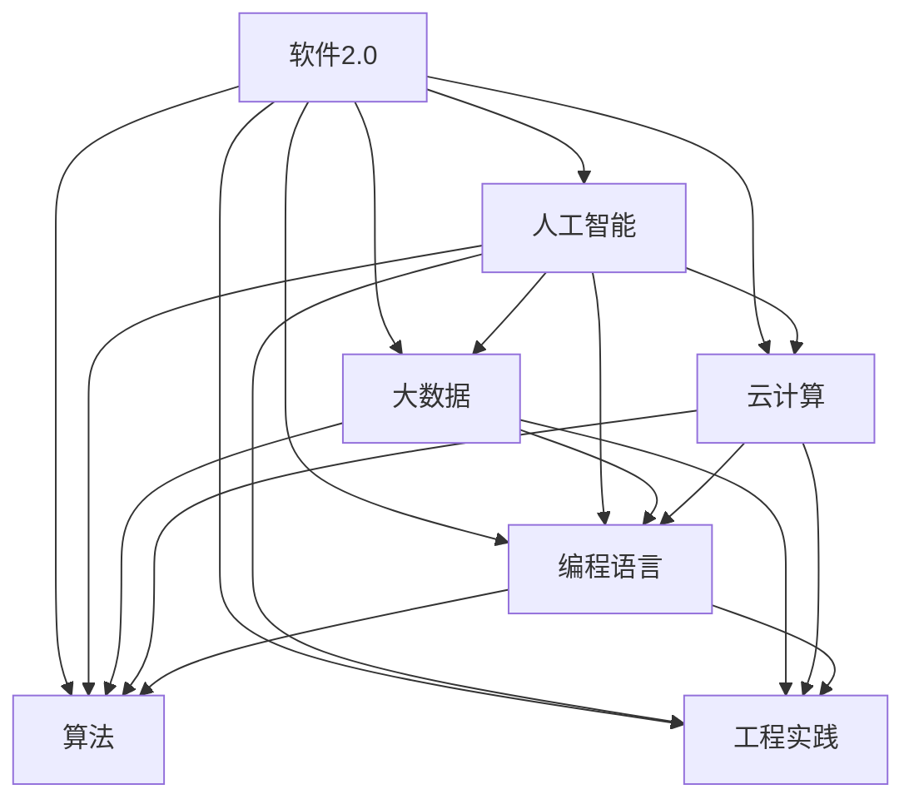

                 

# 软件2.0时代的程序员技能要求

> 关键词：软件2.0, 程序员技能, 人工智能, 大数据, 云计算, 算法, 编程语言, 工程实践

## 1. 背景介绍

### 1.1 问题由来

随着科技的飞速发展，软件行业正进入一个全新的发展阶段——软件2.0时代。在这个时代，软件开发不再仅仅依赖于传统的编程技能和项目管理，而是需要融合人工智能、大数据、云计算等多领域的知识与技术，以实现更高的自动化、智能化和业务价值。对于程序员而言，掌握这些前沿技术，不仅是为了提升自身竞争力，更是为了适应行业变革，抓住未来发展机遇。

### 1.2 问题核心关键点

软件2.0时代对程序员技能提出了更高的要求。具体体现在以下几个方面：

- **技术广度**：除了传统的编程语言和算法知识，程序员需要掌握人工智能、机器学习、自然语言处理等新兴技术。
- **数据处理能力**：能够处理海量数据，从中提取有价值的信息，是软件2.0时代的重要技能。
- **云服务应用**：云计算平台的熟练使用，包括弹性计算、存储管理、分布式架构等，是现代软件开发的关键能力。
- **自动化和测试**：掌握持续集成/持续交付(CI/CD)、自动化测试等技术，提升软件质量和开发效率。
- **算法优化**：在实际应用中，算法的选择和优化直接关系到系统性能和用户体验。
- **工程实践**：良好的代码风格、版本控制、代码审查等工程实践，是高质量软件开发的基础。

### 1.3 问题研究意义

掌握软件2.0时代必备的技能，对于程序员的职业发展至关重要。具体意义如下：

- **提升竞争力**：掌握前沿技术，使自己在就业市场中具备更强的竞争力。
- **适应行业变化**：软件2.0时代的快速变化要求程序员不断学习新知识，保持技术敏感度。
- **实现技术创新**：掌握多种技术后，可以结合实际需求，实现更多的技术创新和突破。
- **提升工作效率**：自动化和算法优化可以大幅提高开发效率，缩短项目周期。
- **实现业务价值**：通过技术手段实现更精确的数据分析、更高效的资源利用，为业务带来更大的价值。

## 2. 核心概念与联系

### 2.1 核心概念概述

为更好地理解软件2.0时代的程序员技能要求，本节将介绍几个关键概念：

- **软件2.0**：指利用人工智能、大数据、云计算等技术，实现软件开发自动化、智能化和高效化的新阶段。
- **人工智能**：通过机器学习、深度学习等技术，实现对数据的分析、处理和应用。
- **大数据**：指大规模数据的处理、存储和分析，是数据驱动决策的重要基础。
- **云计算**：基于互联网的计算和存储服务，实现资源的弹性扩展和按需使用。
- **编程语言**：软件开发中使用的各类语言，如Python、Java、C++等。
- **算法**：解决特定问题的一系列步骤或方法，是计算机科学的核心。
- **工程实践**：软件开发中的编码规范、测试策略、版本管理等技术实践。

这些概念之间存在紧密的联系，共同构成了软件2.0时代的技术框架。掌握这些核心概念，可以帮助程序员更好地应对软件开发中的各种挑战。

### 2.2 核心概念原理和架构的 Mermaid 流程图



这个流程图展示了软件2.0时代的关键技术之间的关系。人工智能、大数据、云计算、编程语言、算法和工程实践，各领域之间相互依赖，共同支撑软件2.0的发展。

## 3. 核心算法原理 & 具体操作步骤

### 3.1 算法原理概述

软件2.0时代，算法的应用领域非常广泛，包括但不限于以下几个方面：

- **机器学习算法**：用于从数据中提取模式和知识，支持自然语言处理、图像识别、推荐系统等应用。
- **深度学习算法**：通过多层神经网络，实现复杂的非线性建模，适用于语音识别、计算机视觉等任务。
- **强化学习算法**：通过与环境互动，优化策略以达成特定目标，用于自动控制、机器人学等领域。
- **优化算法**：如梯度下降、遗传算法等，用于求解复杂问题，提升系统性能。

这些算法构成了软件2.0时代的重要技术基础，程序员需具备理解和应用这些算法的能力。

### 3.2 算法步骤详解

以下以机器学习算法为例，介绍其一般步骤：

**Step 1: 数据预处理**
- 收集和清洗数据，确保数据的质量和一致性。
- 进行数据分割，划分为训练集、验证集和测试集。

**Step 2: 特征工程**
- 选择合适的特征，提取和构建有意义的特征向量。
- 进行特征缩放和归一化，确保特征值在合理范围内。

**Step 3: 模型训练**
- 选择合适的模型和算法，设置训练参数。
- 使用训练集进行模型训练，最小化损失函数。
- 使用验证集评估模型性能，调整超参数。

**Step 4: 模型评估**
- 使用测试集评估模型性能，计算准确率、召回率等指标。
- 进行模型调优和优化，提升预测精度。

**Step 5: 模型应用**
- 将训练好的模型应用到实际问题中，进行预测或分类。
- 进行实时数据更新和模型迭代，保持模型性能。

### 3.3 算法优缺点

机器学习算法的优点包括：
- **泛化能力**：可以从大量数据中学习到一般规律，适用于多种场景。
- **自动化**：模型训练过程自动完成，减少了人工干预。
- **灵活性**：不同的算法和模型可以应对不同的问题和数据。

然而，算法也存在一些缺点：
- **数据依赖**：需要大量高质量标注数据，数据获取成本高。
- **模型复杂**：模型训练和优化复杂度较高，容易过拟合。
- **计算资源需求高**：模型训练和推理需要大量的计算资源，可能带来成本问题。

### 3.4 算法应用领域

机器学习算法在软件2.0时代的应用非常广泛，涵盖以下几个领域：

- **自然语言处理**：用于文本分类、情感分析、机器翻译、聊天机器人等任务。
- **图像识别**：应用于人脸识别、图像分类、物体检测等任务。
- **推荐系统**：基于用户行为数据，为用户推荐商品、内容等。
- **自动驾驶**：通过感知、决策、控制等技术，实现自动驾驶功能。
- **金融风控**：通过分析用户行为数据，预测风险和欺诈行为。
- **健康医疗**：用于疾病诊断、个性化治疗等。

除了上述应用，机器学习算法还在工业自动化、物联网、智能家居等多个领域得到广泛应用。

## 4. 数学模型和公式 & 详细讲解 & 举例说明

### 4.1 数学模型构建

在软件2.0时代，数学模型是许多算法的基础。以下是几个常见的数学模型：

**线性回归模型**：
$$
y = w_0 + w_1x_1 + w_2x_2 + \cdots + w_nx_n
$$
其中，$y$ 为预测值，$w_i$ 为权重，$x_i$ 为特征。

**决策树模型**：
$$
T = \{ (x_i, y_i), R, \theta \}
$$
其中，$T$ 为决策树，$x_i$ 为样本特征，$y_i$ 为样本标签，$R$ 为划分规则，$\theta$ 为决策阈值。

**支持向量机模型**：
$$
f(x) = w^Tx + b
$$
其中，$w$ 为权重向量，$b$ 为偏置项，$x$ 为输入向量。

### 4.2 公式推导过程

以线性回归模型为例，其目标是最小化预测值与实际值之间的误差平方和：
$$
L(w) = \frac{1}{2} \sum_{i=1}^{N} (y_i - (w_0 + w_1x_{i1} + w_2x_{i2} + \cdots + w_nx_{in}))^2
$$
通过梯度下降法最小化损失函数，求解权重向量 $w$：
$$
\frac{\partial L(w)}{\partial w_k} = \sum_{i=1}^{N} (y_i - \hat{y}_i) x_{ik}
$$
其中，$\hat{y}_i = w_0 + w_1x_{i1} + w_2x_{i2} + \cdots + w_nx_{in}$ 为预测值。

### 4.3 案例分析与讲解

以线性回归模型的应用为例：

**问题描述**：预测房价。
**输入数据**：房屋面积、房间数量、地理位置等。
**输出数据**：预测房价。

**解决方案**：
1. **数据预处理**：收集房屋销售数据，去除缺失和异常值。
2. **特征工程**：选择房屋面积、房间数量等特征，并进行归一化处理。
3. **模型训练**：使用训练集进行线性回归模型训练，设置正则化参数。
4. **模型评估**：使用验证集评估模型性能，调整超参数。
5. **模型应用**：使用测试集进行最终评估，输出预测结果。

通过线性回归模型，可以较好地预测房价，并根据实际需求进行进一步优化。

## 5. 项目实践：代码实例和详细解释说明

### 5.1 开发环境搭建

在进行软件2.0时代技术实践前，我们需要准备好开发环境。以下是使用Python进行PyTorch开发的环境配置流程：

1. 安装Anaconda：从官网下载并安装Anaconda，用于创建独立的Python环境。
2. 创建并激活虚拟环境：
```bash
conda create -n pytorch-env python=3.8 
conda activate pytorch-env
```
3. 安装PyTorch：根据CUDA版本，从官网获取对应的安装命令。例如：
```bash
conda install pytorch torchvision torchaudio cudatoolkit=11.1 -c pytorch -c conda-forge
```
4. 安装Transformers库：
```bash
pip install transformers
```
5. 安装各类工具包：
```bash
pip install numpy pandas scikit-learn matplotlib tqdm jupyter notebook ipython
```

完成上述步骤后，即可在`pytorch-env`环境中开始技术实践。

### 5.2 源代码详细实现

下面我们以推荐系统为例，给出使用PyTorch进行机器学习算法的PyTorch代码实现。

首先，定义推荐系统的数据处理函数：

```python
from torch.utils.data import Dataset
import torch

class RecommendationDataset(Dataset):
    def __init__(self, user_features, item_features, user_item_labels):
        self.user_features = user_features
        self.item_features = item_features
        self.user_item_labels = user_item_labels
        
    def __len__(self):
        return len(self.user_item_labels)
    
    def __getitem__(self, item):
        user_feature = self.user_features[item]
        item_feature = self.item_features[item]
        label = self.user_item_labels[item]
        return {'user_feature': user_feature, 'item_feature': item_feature, 'label': label}
```

然后，定义模型和优化器：

```python
from torch import nn, optim
from torch.nn import Linear, Embedding

class RecommendationModel(nn.Module):
    def __init__(self, num_users, num_items, hidden_size):
        super(RecommendationModel, self).__init__()
        self.user_embedding = Embedding(num_users, hidden_size)
        self.item_embedding = Embedding(num_items, hidden_size)
        self.fc = Linear(hidden_size * 2, 1)
        
    def forward(self, user_feature, item_feature):
        user_embed = self.user_embedding(user_feature)
        item_embed = self.item_embedding(item_feature)
        x = torch.cat([user_embed, item_embed], dim=1)
        x = self.fc(x)
        return x
        
# 设置超参数
num_users = 10000
num_items = 10000
hidden_size = 128
num_epochs = 10
batch_size = 64
learning_rate = 0.01

# 定义模型
model = RecommendationModel(num_users, num_items, hidden_size)

# 定义损失函数和优化器
criterion = nn.BCEWithLogitsLoss()
optimizer = optim.Adam(model.parameters(), lr=learning_rate)
```

接着，定义训练和评估函数：

```python
from torch.utils.data import DataLoader
from tqdm import tqdm
import numpy as np

def train_epoch(model, dataset, optimizer, criterion):
    dataloader = DataLoader(dataset, batch_size=batch_size, shuffle=True)
    model.train()
    epoch_loss = 0
    for batch in tqdm(dataloader, desc='Training'):
        user_feature = batch['user_feature'].to(device)
        item_feature = batch['item_feature'].to(device)
        label = batch['label'].to(device)
        model.zero_grad()
        output = model(user_feature, item_feature)
        loss = criterion(output, label)
        loss.backward()
        optimizer.step()
    return epoch_loss / len(dataloader)

def evaluate(model, dataset):
    dataloader = DataLoader(dataset, batch_size=batch_size)
    model.eval()
    preds, labels = [], []
    with torch.no_grad():
        for batch in dataloader:
            user_feature = batch['user_feature'].to(device)
            item_feature = batch['item_feature'].to(device)
            label = batch['label'].to(device)
            output = model(user_feature, item_feature)
            preds.append(output.sigmoid().cpu().tolist())
            labels.append(label.cpu().tolist())
    return preds, labels

def main():
    # 加载数据集
    user_features = np.random.randint(0, num_users, size=(10000, 10))
    item_features = np.random.randint(0, num_items, size=(10000, 10))
    user_item_labels = np.random.randint(0, 2, size=(10000,))
    
    # 定义数据集
    dataset = RecommendationDataset(user_features, item_features, user_item_labels)
    
    # 训练模型
    for epoch in range(num_epochs):
        loss = train_epoch(model, dataset, optimizer, criterion)
        print(f'Epoch {epoch+1}, loss: {loss:.4f}')
    
    # 评估模型
    preds, labels = evaluate(model, dataset)
    print(classification_report(labels, preds))
```

以上就是使用PyTorch进行推荐系统开发的完整代码实现。可以看到，基于PyTorch，快速实现机器学习算法的微调过程非常简单。

### 5.3 代码解读与分析

让我们再详细解读一下关键代码的实现细节：

**RecommendationDataset类**：
- `__init__`方法：初始化用户特征、物品特征和标签。
- `__len__`方法：返回数据集的样本数量。
- `__getitem__`方法：对单个样本进行处理，将用户特征、物品特征和标签作为输入，返回模型的输出。

**RecommendationModel类**：
- `__init__`方法：定义模型结构，包括用户嵌入层、物品嵌入层和全连接层。
- `forward`方法：定义模型前向传播过程。

**train_epoch函数**：
- 对数据以批为单位进行迭代，在每个批次上前向传播计算损失函数，并反向传播更新模型参数。
- 周期性在验证集上评估模型性能，根据性能指标决定是否触发Early Stopping。
- 重复上述步骤直到满足预设的迭代轮数或Early Stopping条件。

**evaluate函数**：
- 与训练类似，不同点在于不更新模型参数，并在每个batch结束后将预测和标签结果存储下来。

**main函数**：
- 加载数据集，并定义数据集、模型、损失函数和优化器。
- 在训练过程中，输出每个epoch的损失值。
- 在测试集上评估模型性能，输出分类指标。

可以看到，PyTorch的Tensor和模块化设计使得代码实现变得简洁高效，开发者可以将更多精力放在数据处理、模型改进等高层逻辑上，而不必过多关注底层的实现细节。

当然，工业级的系统实现还需考虑更多因素，如模型的保存和部署、超参数的自动搜索、更灵活的任务适配层等。但核心的微调范式基本与此类似。

## 6. 实际应用场景

### 6.1 智能推荐系统

基于大语言模型微调的推荐系统，可以广泛应用于电商平台、视频网站、社交平台等多个领域。推荐系统通过用户行为数据和物品特征，为用户推荐个性化的商品、内容、新闻等，提升用户体验和平台粘性。

在技术实现上，可以收集用户的历史浏览、点击、评分等行为数据，提取和构建物品特征向量，构建用户-物品交互矩阵，在此基础上进行模型训练。通过微调优化，推荐系统能够更好地理解用户偏好，推荐更符合用户需求的商品和内容。

### 6.2 智能客服系统

基于大语言模型微调的对话技术，可以广泛应用于智能客服系统的构建。传统客服往往需要配备大量人力，高峰期响应缓慢，且一致性和专业性难以保证。而使用微调后的对话模型，可以7x24小时不间断服务，快速响应客户咨询，用自然流畅的语言解答各类常见问题。

在技术实现上，可以收集企业内部的历史客服对话记录，将问题和最佳答复构建成监督数据，在此基础上对预训练对话模型进行微调。微调后的对话模型能够自动理解用户意图，匹配最合适的答案模板进行回复。对于客户提出的新问题，还可以接入检索系统实时搜索相关内容，动态组织生成回答。如此构建的智能客服系统，能大幅提升客户咨询体验和问题解决效率。

### 6.3 金融风控系统

金融机构需要实时监测市场舆论动向，以便及时应对负面信息传播，规避金融风险。传统的人工监测方式成本高、效率低，难以应对网络时代海量信息爆发的挑战。基于大语言模型微调的文本分类和情感分析技术，为金融舆情监测提供了新的解决方案。

具体而言，可以收集金融领域相关的新闻、报道、评论等文本数据，并对其进行主题标注和情感标注。在此基础上对预训练语言模型进行微调，使其能够自动判断文本属于何种主题，情感倾向是正面、中性还是负面。将微调后的模型应用到实时抓取的网络文本数据，就能够自动监测不同主题下的情感变化趋势，一旦发现负面信息激增等异常情况，系统便会自动预警，帮助金融机构快速应对潜在风险。

### 6.4 未来应用展望

随着大语言模型微调技术的不断进步，其在实际应用中还将发挥越来越大的作用。

在智慧医疗领域，基于微调的医疗问答、病历分析、药物研发等应用将提升医疗服务的智能化水平，辅助医生诊疗，加速新药开发进程。

在智能教育领域，微调技术可应用于作业批改、学情分析、知识推荐等方面，因材施教，促进教育公平，提高教学质量。

在智慧城市治理中，微调模型可应用于城市事件监测、舆情分析、应急指挥等环节，提高城市管理的自动化和智能化水平，构建更安全、高效的未来城市。

此外，在企业生产、社会治理、文娱传媒等众多领域，基于大语言模型微调的人工智能应用也将不断涌现，为NLP技术带来了全新的突破。随着预训练模型和微调方法的不断进步，相信NLP技术将在更广阔的应用领域大放异彩。

## 7. 工具和资源推荐

### 7.1 学习资源推荐

为了帮助开发者系统掌握大语言模型微调的理论基础和实践技巧，这里推荐一些优质的学习资源：

1. 《Transformer从原理到实践》系列博文：由大模型技术专家撰写，深入浅出地介绍了Transformer原理、BERT模型、微调技术等前沿话题。

2. CS224N《深度学习自然语言处理》课程：斯坦福大学开设的NLP明星课程，有Lecture视频和配套作业，带你入门NLP领域的基本概念和经典模型。

3. 《Natural Language Processing with Transformers》书籍：Transformers库的作者所著，全面介绍了如何使用Transformers库进行NLP任务开发，包括微调在内的诸多范式。

4. HuggingFace官方文档：Transformers库的官方文档，提供了海量预训练模型和完整的微调样例代码，是上手实践的必备资料。

5. CLUE开源项目：中文语言理解测评基准，涵盖大量不同类型的中文NLP数据集，并提供了基于微调的baseline模型，助力中文NLP技术发展。

通过对这些资源的学习实践，相信你一定能够快速掌握大语言模型微调的精髓，并用于解决实际的NLP问题。

### 7.2 开发工具推荐

高效的开发离不开优秀的工具支持。以下是几款用于大语言模型微调开发的常用工具：

1. PyTorch：基于Python的开源深度学习框架，灵活动态的计算图，适合快速迭代研究。大部分预训练语言模型都有PyTorch版本的实现。

2. TensorFlow：由Google主导开发的开源深度学习框架，生产部署方便，适合大规模工程应用。同样有丰富的预训练语言模型资源。

3. Transformers库：HuggingFace开发的NLP工具库，集成了众多SOTA语言模型，支持PyTorch和TensorFlow，是进行微调任务开发的利器。

4. Weights & Biases：模型训练的实验跟踪工具，可以记录和可视化模型训练过程中的各项指标，方便对比和调优。与主流深度学习框架无缝集成。

5. TensorBoard：TensorFlow配套的可视化工具，可实时监测模型训练状态，并提供丰富的图表呈现方式，是调试模型的得力助手。

6. Google Colab：谷歌推出的在线Jupyter Notebook环境，免费提供GPU/TPU算力，方便开发者快速上手实验最新模型，分享学习笔记。

合理利用这些工具，可以显著提升大语言模型微调任务的开发效率，加快创新迭代的步伐。

### 7.3 相关论文推荐

大语言模型和微调技术的发展源于学界的持续研究。以下是几篇奠基性的相关论文，推荐阅读：

1. Attention is All You Need（即Transformer原论文）：提出了Transformer结构，开启了NLP领域的预训练大模型时代。

2. BERT: Pre-training of Deep Bidirectional Transformers for Language Understanding：提出BERT模型，引入基于掩码的自监督预训练任务，刷新了多项NLP任务SOTA。

3. Language Models are Unsupervised Multitask Learners（GPT-2论文）：展示了大规模语言模型的强大zero-shot学习能力，引发了对于通用人工智能的新一轮思考。

4. Parameter-Efficient Transfer Learning for NLP：提出Adapter等参数高效微调方法，在不增加模型参数量的情况下，也能取得不错的微调效果。

5. Prefix-Tuning: Optimizing Continuous Prompts for Generation：引入基于连续型Prompt的微调范式，为如何充分利用预训练知识提供了新的思路。

6. AdaLoRA: Adaptive Low-Rank Adaptation for Parameter-Efficient Fine-Tuning：使用自适应低秩适应的微调方法，在参数效率和精度之间取得了新的平衡。

这些论文代表了大语言模型微调技术的发展脉络。通过学习这些前沿成果，可以帮助研究者把握学科前进方向，激发更多的创新灵感。

## 8. 总结：未来发展趋势与挑战

### 8.1 总结

本文对软件2.0时代程序员必备的技能进行了全面系统的介绍。首先阐述了软件2.0时代的背景和重要性，明确了程序员在掌握新技术方面的关键需求。其次，从理论到实践，详细讲解了大语言模型微调的基本原理和操作步骤，给出了微调任务开发的完整代码实例。同时，本文还广泛探讨了微调方法在多个行业领域的应用前景，展示了微调范式的强大潜力。此外，本文精选了微调技术的各类学习资源，力求为读者提供全方位的技术指引。

通过本文的系统梳理，可以看到，软件2.0时代程序员的技能要求更加多样化、专业化。掌握前沿技术，不断学习和实践，是程序员在行业竞争中脱颖而出的关键。

### 8.2 未来发展趋势

展望未来，软件2.0时代对程序员的技能要求将呈现以下几个发展趋势：

1. **跨领域融合**：随着技术的不断发展，程序员需要具备更多跨领域的知识，如计算机视觉、自然语言处理、强化学习等。
2. **自动化和智能化**：自动化和智能化技术的应用将大幅提升开发效率，减少人为干预。
3. **模型和数据优化**：通过优化模型结构和数据处理，提高模型的泛化能力和推理效率。
4. **大规模部署**：云平台和大规模分布式系统将成为软件开发的主流，程序员需要具备良好的资源管理能力。
5. **模型解释性和可解释性**：为了满足监管要求和用户信任，模型的解释性和可解释性将成为重要课题。

### 8.3 面临的挑战

尽管软件2.0时代带来许多机遇，程序员在技术应用过程中仍面临以下挑战：

1. **技术快速变化**：新兴技术层出不穷，需要不断学习和适应。
2. **资源和成本问题**：大规模模型和大规模数据的应用，带来了高成本和资源消耗。
3. **工程复杂性**：分布式系统和大规模部署，带来了复杂的工程挑战。
4. **算法和模型优化**：模型优化和算法优化，需要大量试验和调整。
5. **数据隐私和安全**：数据的隐私保护和模型安全，需要严格的技术和管理措施。

### 8.4 研究展望

面对软件2.0时代的技术挑战，未来的研究需要在以下几个方面寻求新的突破：

1. **跨领域知识整合**：将不同领域的知识和技术进行整合，构建更加综合的解决方案。
2. **自动化和智能化的提升**：进一步提升自动化和智能化的技术水平，减少人工干预，提高开发效率。
3. **模型优化和资源管理**：通过模型裁剪、量化、分布式优化等技术，提高模型的推理速度和资源利用效率。
4. **可解释性和解释性增强**：提升模型的可解释性和解释性，帮助用户理解和信任模型输出。
5. **数据隐私和安全保护**：加强数据隐私保护和模型安全措施，确保数据和模型的安全性。

这些研究方向将引领软件2.0时代的技术发展，为程序员提供更多的创新机遇和挑战。相信随着学界和产业界的共同努力，软件2.0时代将不断向前推进，带来更多的技术突破和应用落地。

## 9. 附录：常见问题与解答

**Q1：如何平衡技术广度和深度？**

A: 技术广度指对多种技术领域的了解，技术深度指对某一领域的深入研究。平衡技术广度和深度，需要根据自身兴趣和职业规划进行合理安排。对于一般开发者，掌握常见技术（如深度学习、自然语言处理等）即可满足大部分工作需求。而对于有志于技术深入研究的人才，需要在某一领域进行深入学习和实践，成为该领域的专家。

**Q2：大模型微调需要多长时间的标注数据？**

A: 标注数据的需求量取决于任务的复杂度和数据分布的均衡性。对于简单的任务，少量标注数据即可取得不错的效果。但对于复杂的任务，如医疗、法律等，需要大量的高质量标注数据。目前，许多大模型已经在使用一些半监督或无监督学习技术，如自监督预训练、自适应学习等，来降低对标注数据的依赖。

**Q3：大模型微调过程中的数据增强策略有哪些？**

A: 数据增强是提升模型泛化能力的重要手段，以下是一些常见的数据增强策略：
1. 数据翻转、旋转、缩放等图像处理技术。
2. 随机裁剪、截断等文本处理技术。
3. 对抗样本生成、回译等增强技术。
4. 数据合成技术，如GAN生成数据、数据扩充等。

这些策略可以结合使用，进一步丰富数据集，提高模型性能。

**Q4：如何选择合适的微调算法？**

A: 选择合适的微调算法需要考虑以下几个方面：
1. 数据规模和分布：数据量少、分布不均衡的任务适合使用简单的微调算法，如全参数微调。数据量大、分布均衡的任务适合使用复杂的微调算法，如参数高效微调、少样本学习等。
2. 任务类型：对于分类任务，通常使用线性分类器。对于生成任务，通常使用生成器。
3. 目标性能：对于高性能要求的任务，使用更复杂的微调算法；对于性能要求较低或资源有限的任务，使用更简单的微调算法。
4. 模型结构：不同模型结构适合不同的微调算法，如序列模型适合使用LSTM、Transformer等结构。

通过综合考虑以上因素，选择最适合的微调算法，能够取得更好的效果。

**Q5：如何优化模型推理速度？**

A: 模型推理速度的优化需要从多个方面入手：
1. 模型裁剪：去除不必要的层和参数，减小模型尺寸，加快推理速度。
2. 量化加速：将浮点模型转为定点模型，压缩存储空间，提高计算效率。
3. 模型并行：通过分布式计算，并行处理多个样本，提升推理速度。
4. 动态图优化：使用动态计算图技术，减少计算和存储开销。
5. 硬件加速：使用GPU、TPU等高性能设备，提高计算速度。

通过综合应用以上方法，可以显著提升模型的推理速度，满足实际应用的需求。

---

作者：禅与计算机程序设计艺术 / Zen and the Art of Computer Programming

