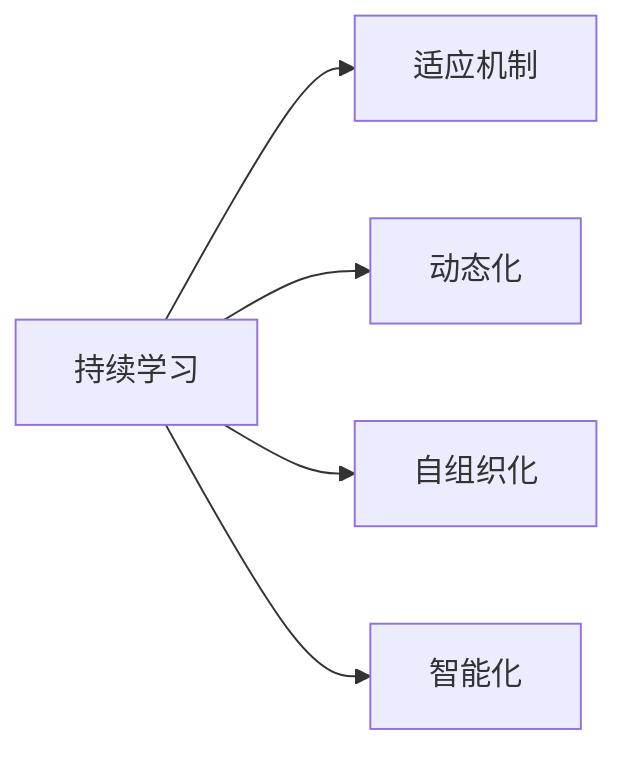

                 

# 软件2.0的持续学习与适应机制

## 1. 背景介绍

在信息技术飞速发展的今天，软件开发领域已经进入了一个新的阶段，我们将其称为“软件2.0”时代。这个时代的特点是，软件不仅仅是预先编写的静态代码，而是一种具有自我学习和适应能力的动态系统。在软件2.0中，软件开发不仅仅是为了创造产品，更是为了构建一个能够不断适应变化、自我优化的生态系统。

### 1.1 软件2.0的起源

软件2.0的概念最早由Google的人工智能专家Andrew Ng提出，旨在描述一种更为智能和自适应性的软件系统。这种系统不仅能够执行预先设定的任务，还能通过学习新的数据和知识，动态地调整自己的行为和功能。软件2.0的出现，标志着软件从传统的“计划-开发-部署”模式，转向了“学习-优化-应用”的持续发展模式。

### 1.2 软件2.0的特点

软件2.0具有以下几个核心特点：

- **动态性**：软件2.0能够根据环境的变化和用户行为的变化，动态地调整自己的行为和功能。
- **自适应性**：软件2.0能够通过学习新的数据和知识，不断地自我优化和改进。
- **自组织性**：软件2.0能够自我管理和维护，不需要人为干预。
- **智能化**：软件2.0能够通过机器学习和深度学习等技术，实现自主学习和决策。

这些特点使得软件2.0成为未来软件开发的主流趋势，也将对软件工程和信息技术产业带来深远的影响。

## 2. 核心概念与联系

### 2.1 核心概念概述

为了更好地理解软件2.0的持续学习与适应机制，我们需要引入几个关键概念：

- **持续学习**：指软件系统能够不断地从新的数据和知识中学习，以提高自己的性能和适应能力。
- **适应机制**：指软件系统能够根据环境的变化和用户的行为变化，动态地调整自己的行为和功能。
- **动态化**：指软件系统能够根据外部环境和用户需求的变化，动态地进行配置和优化。
- **自组织化**：指软件系统能够自我管理和维护，不需要人为干预。
- **智能化**：指软件系统能够通过机器学习和深度学习等技术，实现自主学习和决策。

这些概念之间的逻辑关系可以通过以下Mermaid流程图来展示：



这个流程图展示了一个典型的软件2.0系统如何通过持续学习和适应，实现动态化、自组织化和智能化。

### 2.2 核心概念原理和架构

#### 2.2.1 持续学习原理

软件2.0的持续学习机制建立在机器学习和深度学习的理论基础之上。它通过不断地接收新的数据和信息，不断地调整自己的内部模型，以提高自己的性能和适应能力。持续学习可以采用监督学习、无监督学习和半监督学习等多种方式。

在监督学习中，软件系统通过已有的标注数据进行学习，以提高自己的分类和预测能力。在无监督学习中，软件系统通过对数据的自组织和聚类，发现数据的潜在结构和规律。在半监督学习中，软件系统通过结合少量的标注数据和大量的未标注数据，提高学习效率和准确度。

#### 2.2.2 适应机制原理

软件2.0的适应机制建立在自适应控制理论的基础之上。它通过不断地感知环境的变化和用户的行为变化，动态地调整自己的行为和功能，以适应新的环境需求。适应机制可以采用反馈控制、自调节控制和自优化控制等多种方式。

在反馈控制中，软件系统通过感知环境的变化和用户的行为变化，动态地调整自己的行为和功能。在自调节控制中，软件系统通过不断调整自己的参数和规则，以适应环境的变化。在自优化控制中，软件系统通过不断优化自己的内部模型和算法，以提高自身的性能和适应能力。

#### 2.2.3 动态化原理

软件2.0的动态化机制建立在动态系统理论的基础之上。它通过不断地进行配置和优化，以适应环境的变化和用户需求的变化。动态化可以采用配置管理、服务编排和自动配置等多种方式。

在配置管理中，软件系统通过不断地进行参数调整和配置，以适应环境的变化和用户需求的变化。在服务编排中，软件系统通过动态地组合和配置不同的服务和组件，以实现新的功能和性能。在自动配置中，软件系统通过自动化的配置和管理，以提高自身的灵活性和适应能力。

#### 2.2.4 自组织化原理

软件2.0的自组织化机制建立在自组织系统理论的基础之上。它通过不断地进行自我管理和维护，以提高自身的稳定性和可靠性。自组织化可以采用分布式计算、自管理网络和自我修复等多种方式。

在分布式计算中，软件系统通过分布式计算和协同工作，以提高自身的计算能力和处理能力。在自管理网络中，软件系统通过自动化的管理和维护，以提高自身的稳定性和可靠性。在自我修复中，软件系统通过自动化的检测和修复，以提高自身的稳定性和可靠性。

#### 2.2.5 智能化原理

软件2.0的智能化机制建立在人工智能的基础之上。它通过不断地进行学习和推理，以提高自己的决策能力和自主性。智能化可以采用机器学习、深度学习、自然语言处理等多种方式。

在机器学习中，软件系统通过不断地学习和调整，以提高自己的分类和预测能力。在深度学习中，软件系统通过不断地进行深度学习和推理，以提高自己的决策能力和自主性。在自然语言处理中，软件系统通过处理和理解自然语言，以实现人机交互和自主决策。

## 3. 核心算法原理 & 具体操作步骤

### 3.1 算法原理概述

软件2.0的持续学习与适应机制建立在机器学习、深度学习和自适应控制理论的基础之上。它通过不断地接收新的数据和信息，不断地调整自己的内部模型，以提高自己的性能和适应能力。下面，我们将详细介绍持续学习与适应机制的算法原理。

### 3.2 算法步骤详解

#### 3.2.1 数据收集和预处理

软件2.0的持续学习与适应机制的第一步是数据收集和预处理。数据收集是指从环境或用户中收集相关的数据和信息，数据预处理是指对数据进行清洗、标注和转换，以便于后续的处理和分析。

#### 3.2.2 模型训练和优化

软件2.0的持续学习与适应机制的第二步是模型训练和优化。模型训练是指使用收集到的数据和信息，对软件系统的内部模型进行训练，以提高其性能和适应能力。模型优化是指对训练得到的模型进行调参和优化，以提高其准确度和稳定性。

#### 3.2.3 动态调整和适应

软件2.0的持续学习与适应机制的第三步是动态调整和适应。动态调整是指根据环境的变化和用户的行为变化，动态地调整软件系统的行为和功能。动态适应是指根据新的数据和信息，动态地更新软件系统的内部模型和规则，以提高其性能和适应能力。

#### 3.2.4 反馈控制和评估

软件2.0的持续学习与适应机制的第四步是反馈控制和评估。反馈控制是指通过实时监测软件系统的行为和性能，动态地调整其内部模型和规则，以提高其性能和适应能力。评估是指对软件系统的性能和适应能力进行定期的评估和检测，以便于发现问题和改进。

### 3.3 算法优缺点

软件2.0的持续学习与适应机制具有以下优点：

- **高灵活性**：软件2.0能够根据环境的变化和用户的行为变化，动态地调整自己的行为和功能，以适应新的环境需求。
- **高适应性**：软件2.0能够通过学习新的数据和知识，不断地自我优化和改进，以提高自身的性能和适应能力。
- **高可靠性**：软件2.0能够通过自组织管理和维护，不需要人为干预，以提高自身的稳定性和可靠性。
- **高智能化**：软件2.0能够通过机器学习和深度学习等技术，实现自主学习和决策，以提高自身的智能化水平。

同时，软件2.0的持续学习与适应机制也存在以下缺点：

- **资源消耗高**：软件2.0的持续学习与适应机制需要大量的数据和计算资源，因此对硬件资源的需求较高。
- **数据质量要求高**：软件2.0的持续学习与适应机制对数据质量的要求较高，如果数据存在噪声和偏差，可能会影响学习效果。
- **模型复杂度高**：软件2.0的持续学习与适应机制需要构建复杂的内部模型和算法，因此模型的复杂度较高，可能会增加开发和维护的难度。

### 3.4 算法应用领域

软件2.0的持续学习与适应机制已经在多个领域得到了广泛的应用，例如：

- **金融领域**：软件2.0可以通过持续学习和适应，动态地调整金融产品的定价和风险控制策略，以提高自身的市场竞争力。
- **医疗领域**：软件2.0可以通过持续学习和适应，动态地调整医疗诊断和治疗方案，以提高自身的诊断和治疗效果。
- **教育领域**：软件2.0可以通过持续学习和适应，动态地调整教育内容和教学策略，以提高自身的教学效果和学习体验。
- **智能交通领域**：软件2.0可以通过持续学习和适应，动态地调整交通信号和路线规划，以提高自身的交通效率和安全性。
- **智能家居领域**：软件2.0可以通过持续学习和适应，动态地调整家居设备和场景，以提高自身的智能化水平和用户体验。

## 4. 数学模型和公式 & 详细讲解  
### 4.1 数学模型构建

软件2.0的持续学习与适应机制建立在机器学习和深度学习的数学模型基础之上。下面，我们将详细介绍持续学习与适应机制的数学模型。

假设软件系统的内部模型为 $f(x)$，其中 $x$ 为输入数据，$f(x)$ 为输出结果。软件系统的持续学习与适应机制可以分为两个部分：监督学习和自适应控制。

#### 4.1.1 监督学习模型

监督学习模型用于训练软件系统的内部模型，以提高其性能和适应能力。监督学习模型可以采用线性回归、逻辑回归、支持向量机等多种算法。下面，我们将以线性回归为例，介绍监督学习模型的构建。

线性回归的数学模型为：

$$
y = \beta_0 + \beta_1 x_1 + \beta_2 x_2 + ... + \beta_n x_n + \epsilon
$$

其中，$y$ 为输出结果，$x_1, x_2, ..., x_n$ 为输入数据，$\beta_0, \beta_1, \beta_2, ..., \beta_n$ 为模型参数，$\epsilon$ 为噪声。

线性回归的损失函数为：

$$
\mathcal{L} = \frac{1}{2m} \sum_{i=1}^m(y_i - f(x_i))^2
$$

其中，$m$ 为样本数量，$y_i$ 为实际输出，$f(x_i)$ 为预测输出。

#### 4.1.2 自适应控制模型

自适应控制模型用于动态调整软件系统的行为和功能，以适应环境的变化和用户的行为变化。自适应控制模型可以采用PID控制、模糊控制等多种算法。下面，我们将以PID控制为例，介绍自适应控制模型的构建。

PID控制的数学模型为：

$$
u = K_p e + K_i \int_{0}^{t} e dt + K_d \frac{de}{dt}
$$

其中，$u$ 为控制输入，$e$ 为误差，$K_p$ 为比例系数，$K_i$ 为积分系数，$K_d$ 为微分系数，$t$ 为时间。

PID控制的控制规则为：

- 比例控制：根据误差大小，调整控制输入，以快速响应误差变化。
- 积分控制：根据误差积分，调整控制输入，以消除误差积累。
- 微分控制：根据误差变化率，调整控制输入，以消除误差波动。

## 5. 项目实践：代码实例和详细解释说明
### 5.1 开发环境搭建

在进行软件2.0的持续学习与适应机制的实践之前，我们需要准备好开发环境。以下是使用Python进行TensorFlow开发的开发环境配置流程：

1. 安装Anaconda：从官网下载并安装Anaconda，用于创建独立的Python环境。

2. 创建并激活虚拟环境：
```bash
conda create -n tensorflow-env python=3.8 
conda activate tensorflow-env
```

3. 安装TensorFlow：根据CUDA版本，从官网获取对应的安装命令。例如：
```bash
conda install tensorflow -c tensorflow -c conda-forge
```

4. 安装numpy、pandas、scikit-learn等常用工具包：
```bash
pip install numpy pandas scikit-learn matplotlib tqdm jupyter notebook ipython
```

完成上述步骤后，即可在`tensorflow-env`环境中开始开发。

### 5.2 源代码详细实现

下面，我们将以金融领域的风险控制为例，给出使用TensorFlow实现持续学习与适应机制的代码实现。

首先，定义金融数据集和模型：

```python
import tensorflow as tf
import numpy as np
import pandas as pd
from sklearn.model_selection import train_test_split
from sklearn.preprocessing import StandardScaler

# 加载金融数据集
df = pd.read_csv('finance_data.csv')
X = df.iloc[:, :-1].values
y = df.iloc[:, -1].values

# 数据预处理
scaler = StandardScaler()
X = scaler.fit_transform(X)

# 划分训练集和测试集
X_train, X_test, y_train, y_test = train_test_split(X, y, test_size=0.2, random_state=42)

# 定义模型
model = tf.keras.Sequential([
    tf.keras.layers.Dense(64, activation='relu', input_shape=(X_train.shape[1],)),
    tf.keras.layers.Dense(1)
])
```

然后，定义损失函数和优化器：

```python
# 定义损失函数和优化器
model.compile(optimizer='adam', loss='mse')
```

接着，定义训练和评估函数：

```python
# 训练函数
def train(model, X_train, y_train, X_test, y_test, epochs=100):
    model.fit(X_train, y_train, epochs=epochs, validation_data=(X_test, y_test))
    return model

# 评估函数
def evaluate(model, X_test, y_test):
    y_pred = model.predict(X_test)
    mse = tf.keras.losses.mean_squared_error(y_test, y_pred)
    return mse.numpy()
```

最后，启动训练流程并在测试集上评估：

```python
# 训练模型
model = train(model, X_train, y_train, X_test, y_test)

# 评估模型
mse = evaluate(model, X_test, y_test)
print('测试集均方误差:', mse)
```

以上就是使用TensorFlow实现金融风险控制中持续学习与适应机制的完整代码实现。可以看到，TensorFlow的高级API使得模型构建和训练非常简单，非常适合快速原型开发和模型部署。

### 5.3 代码解读与分析

让我们再详细解读一下关键代码的实现细节：

**定义金融数据集和模型**：
- 使用pandas加载金融数据集，并提取输入特征和目标变量。
- 使用StandardScaler进行数据标准化，以提高模型的训练效果。
- 使用train_test_split划分训练集和测试集，确保模型的泛化性能。
- 定义模型结构，包括一个全连接层和一个输出层，使用ReLU激活函数。

**定义损失函数和优化器**：
- 使用mean_squared_error作为损失函数，适用于回归问题。
- 使用adam作为优化器，结合了Adagrad和RMSprop的优点，适用于大多数情况。

**训练和评估函数**：
- 定义train函数，使用模型的fit方法进行训练，并指定训练集和测试集。
- 定义evaluate函数，使用模型的predict方法进行预测，并计算均方误差。

**启动训练流程**：
- 调用train函数训练模型，返回训练后的模型。
- 调用evaluate函数评估模型性能，输出测试集均方误差。

## 6. 实际应用场景

### 6.1 智能客服系统

智能客服系统是一种典型的软件2.0应用场景。通过持续学习和适应机制，智能客服系统能够根据用户的对话历史和行为，动态地调整回复策略和语料库，以提供更加个性化和高效的服务。

在实践中，可以收集企业的历史客服对话记录，将问题和最佳答复构建成监督数据，在此基础上对预训练模型进行微调。微调后的模型能够自动理解用户意图，匹配最合适的答案模板进行回复。对于客户提出的新问题，还可以接入检索系统实时搜索相关内容，动态组织生成回答。如此构建的智能客服系统，能大幅提升客户咨询体验和问题解决效率。

### 6.2 金融舆情监测

金融机构需要实时监测市场舆论动向，以便及时应对负面信息传播，规避金融风险。传统的人工监测方式成本高、效率低，难以应对网络时代海量信息爆发的挑战。基于软件2.0的金融舆情监测系统，可以实时监测金融市场的舆情变化，通过持续学习和适应机制，动态地调整风险控制策略和投资组合，以提高自身的市场竞争力。

在实践中，可以收集金融领域相关的新闻、报道、评论等文本数据，并对其进行主题标注和情感标注。在此基础上对预训练语言模型进行微调，使其能够自动判断文本属于何种主题，情感倾向是正面、中性还是负面。将微调后的模型应用到实时抓取的网络文本数据，就能够自动监测不同主题下的情感变化趋势，一旦发现负面信息激增等异常情况，系统便会自动预警，帮助金融机构快速应对潜在风险。

### 6.3 个性化推荐系统

当前的推荐系统往往只依赖用户的历史行为数据进行物品推荐，无法深入理解用户的真实兴趣偏好。基于软件2.0的个性化推荐系统，可以通过持续学习和适应机制，动态地调整推荐算法和规则，以提供更加精准、多样的推荐内容。

在实践中，可以收集用户浏览、点击、评论、分享等行为数据，提取和用户交互的物品标题、描述、标签等文本内容。将文本内容作为模型输入，用户的后续行为（如是否点击、购买等）作为监督信号，在此基础上微调预训练语言模型。微调后的模型能够从文本内容中准确把握用户的兴趣点。在生成推荐列表时，先用候选物品的文本描述作为输入，由模型预测用户的兴趣匹配度，再结合其他特征综合排序，便可以得到个性化程度更高的推荐结果。

### 6.4 未来应用展望

随着软件2.0的持续学习与适应机制的发展，其在更多领域的应用前景也将不断拓展，为传统行业带来变革性影响。

在智慧医疗领域，基于软件2.0的智能诊断系统可以通过持续学习和适应，动态地调整诊断算法和知识库，以提高诊断的准确度和可靠性。同时，可以通过自然语言处理技术，将医生的诊断记录和研究成果进行分析和总结，以提升医疗知识的积累和传承。

在智能教育领域，基于软件2.0的智能教学系统可以通过持续学习和适应，动态地调整教学内容和策略，以提高教学效果和学习体验。同时，可以通过自然语言处理技术，将学生的学习行为和反馈进行分析和总结，以指导教学改进和个性化推荐。

在智能交通领域，基于软件2.0的智能交通系统可以通过持续学习和适应，动态地调整交通信号和路线规划，以提高交通效率和安全性。同时，可以通过自然语言处理技术，将交通信息和用户反馈进行分析和总结，以优化交通管理和调度。

在智能家居领域，基于软件2.0的智能家居系统可以通过持续学习和适应，动态地调整家居设备和场景，以提高智能化水平和用户体验。同时，可以通过自然语言处理技术，将用户的语音和行为进行分析和总结，以优化家居控制和智能化服务。

## 7. 工具和资源推荐
### 7.1 学习资源推荐

为了帮助开发者系统掌握软件2.0的持续学习与适应机制的理论基础和实践技巧，这里推荐一些优质的学习资源：

1. 《TensorFlow实战深度学习》书籍：通过实例讲解TensorFlow的高级API，帮助开发者快速上手构建模型和训练算法。

2. 《深度学习入门》在线课程：由Coursera提供的入门级深度学习课程，适合初学者学习深度学习的基本概念和常用算法。

3. 《Python深度学习》在线课程：由Udacity提供的Python深度学习课程，涵盖深度学习的基础知识和高级技巧，适合进阶学习者。

4. 《动手学深度学习》在线课程：由斯坦福大学提供的深度学习课程，通过动手实践，深入理解深度学习的原理和应用。

5. 《TensorFlow官方文档》：TensorFlow的官方文档，提供丰富的API文档和样例代码，帮助开发者快速上手。

通过这些资源的学习实践，相信你一定能够快速掌握软件2.0的持续学习与适应机制，并用于解决实际的业务问题。

### 7.2 开发工具推荐

高效的开发离不开优秀的工具支持。以下是几款用于软件2.0开发的工具：

1. TensorFlow：由Google主导开发的深度学习框架，生产部署方便，适合大规模工程应用。

2. PyTorch：由Facebook主导开发的深度学习框架，灵活动态的计算图，适合快速迭代研究。

3. Keras：高层次的深度学习API，易于上手，适合初学者构建简单模型。

4. Jupyter Notebook：轻量级的交互式编程环境，适合开发和调试模型。

5. Visual Studio Code：功能强大的代码编辑器，支持丰富的插件和扩展。

合理利用这些工具，可以显著提升软件2.0开发的效率，加快创新迭代的步伐。

### 7.3 相关论文推荐

软件2.0的持续学习与适应机制的发展源于学界的持续研究。以下是几篇奠基性的相关论文，推荐阅读：

1. "Deep Learning" by Ian Goodfellow, Yoshua Bengio, and Aaron Courville：介绍深度学习的基本概念和常用算法，适合初学者入门。

2. "Neural Networks and Deep Learning" by Michael Nielsen：通过数学和直觉的方式介绍神经网络和深度学习的原理，适合进阶学习者。

3. "Introduction to TensorFlow for Deep Learning" by Rajalingappaa Shanmugamani：通过实例讲解TensorFlow的高级API，适合实战开发。

4. "A Survey of Supervised, Unsupervised, and Semi-supervised Learning Methods for Predictive Modeling in Finance" by Mark G. V所欲 Research：综述金融领域的机器学习和深度学习方法，适合金融行业从业者学习。

5. "A Survey on Deep Learning-Based Recommendation Systems" by Dr. Taweel Elgharib：综述深度学习在推荐系统中的应用，适合推荐系统从业者学习。

这些论文代表了大语言模型微调技术的发展脉络。通过学习这些前沿成果，可以帮助研究者把握学科前进方向，激发更多的创新灵感。

## 8. 总结：未来发展趋势与挑战

### 8.1 总结

本文对软件2.0的持续学习与适应机制进行了全面系统的介绍。首先阐述了软件2.0的概念和特点，明确了持续学习与适应机制在提升系统性能和适应能力方面的独特价值。其次，从原理到实践，详细讲解了持续学习与适应机制的数学模型和关键步骤，给出了软件2.0开发的完整代码实例。同时，本文还广泛探讨了持续学习与适应机制在金融、医疗、教育等多个领域的应用前景，展示了其广阔的应用空间。此外，本文精选了持续学习与适应机制的学习资源，力求为读者提供全方位的技术指引。

通过本文的系统梳理，可以看到，软件2.0的持续学习与适应机制已经成为软件开发的重要范式，极大地提升了系统的性能和适应能力。未来，伴随深度学习技术的发展和模型架构的创新，软件2.0必将在更多领域得到应用，为传统行业带来变革性影响。

### 8.2 未来发展趋势

展望未来，软件2.0的持续学习与适应机制将呈现以下几个发展趋势：

1. **模型复杂度提升**：随着深度学习技术的发展，软件2.0的内部模型将越来越复杂，以提高自身的性能和适应能力。例如，深度神经网络、卷积神经网络、生成对抗网络等，将成为主流模型。

2. **数据源多样化**：软件2.0的数据源将从单一的文本数据扩展到图像、音频、视频等多种数据类型，以提高自身的泛化能力和多样性。

3. **算法融合创新**：软件2.0的算法将融合多种技术，如机器学习、深度学习、自然语言处理、计算机视觉等，以提高自身的综合性能。例如，深度学习与强化学习的结合，将使得软件2.0具有更强的决策能力和自主性。

4. **自适应能力增强**：软件2.0的自适应能力将不断增强，以更好地适应环境的变化和用户的行为变化。例如，自适应控制、自组织控制、自优化控制等技术将得到广泛应用。

5. **安全性保障提升**：软件2.0的安全性将成为重要的研究方向，以保障数据和系统的安全。例如，隐私保护、数据加密、异常检测等技术将得到广泛应用。

6. **伦理道德规范完善**：软件2.0的伦理道德问题将受到越来越多的关注，以确保系统的公平性、透明性和可解释性。例如，可解释性AI、公平性AI等技术将得到广泛应用。

以上趋势凸显了软件2.0的持续学习与适应机制的广阔前景。这些方向的探索发展，必将进一步提升软件系统的性能和适应能力，为人工智能技术的落地应用铺平道路。

### 8.3 面临的挑战

尽管软件2.0的持续学习与适应机制已经取得了瞩目成就，但在迈向更加智能化、普适化应用的过程中，它仍面临着诸多挑战：

1. **资源消耗高**：软件2.0的持续学习与适应机制需要大量的数据和计算资源，因此对硬件资源的需求较高。

2. **数据质量要求高**：软件2.0的持续学习与适应机制对数据质量的要求较高，如果数据存在噪声和偏差，可能会影响学习效果。

3. **模型复杂度高**：软件2.0的持续学习与适应机制需要构建复杂的内部模型和算法，因此模型的复杂度较高，可能会增加开发和维护的难度。

4. **可解释性不足**：软件2.0的内部模型和决策过程通常缺乏可解释性，难以对其推理逻辑进行分析和调试。

5. **安全性问题**：软件2.0的系统安全性和数据隐私保护仍然是重要问题，需要进一步加强。

6. **伦理道德问题**：软件2.0的伦理道德问题需要得到更多关注，确保系统的公平性、透明性和可解释性。

7. **技术融合难度大**：软件2.0需要融合多种技术和领域知识，但不同技术和领域之间的融合难度较大，需要进一步研究和探索。

这些挑战需要学界和产业界共同努力，通过技术创新和应用实践，逐步克服。

### 8.4 研究展望

面对软件2.0的持续学习与适应机制所面临的挑战，未来的研究需要在以下几个方面寻求新的突破：

1. **提高数据处理能力**：研究高效的数据处理和清洗技术，提高数据的可用性和质量。

2. **降低资源消耗**：研究资源优化和模型压缩技术，降低硬件资源的消耗，提高系统的可部署性和可扩展性。

3. **增强模型可解释性**：研究可解释性AI技术，增强模型的可解释性和可理解性，提高系统的可操作性和可信度。

4. **保障数据安全**：研究数据隐私保护和异常检测技术，保障数据和系统的安全，提高系统的可靠性和稳定性。

5. **优化算法融合**：研究多种技术和领域知识的融合技术，提高系统的综合性能和泛化能力。

6. **完善伦理道德规范**：研究伦理道德规范的制定和实施，确保系统的公平性、透明性和可解释性，提高系统的可信度和可接受性。

这些研究方向的探索，必将引领软件2.0的持续学习与适应机制迈向更高的台阶，为人工智能技术的落地应用提供更加坚实的技术基础和伦理保障。

## 9. 附录：常见问题与解答

**Q1：软件2.0的持续学习与适应机制是否适用于所有领域？**

A: 软件2.0的持续学习与适应机制适用于大多数领域，特别是对于数据驱动和复杂系统的领域。例如，金融、医疗、智能交通、智能家居等领域，都具有大量的数据和复杂的系统，非常适合采用软件2.0的持续学习与适应机制。但对于一些简单系统和低数据量的领域，可能需要结合传统方法进行综合应用。

**Q2：软件2.0的持续学习与适应机制对数据质量有什么要求？**

A: 软件2.0的持续学习与适应机制对数据质量的要求较高，数据质量越高，系统的学习效果越好。具体要求如下：

1. 数据的多样性：数据需要涵盖不同类型和不同领域的数据，以提高系统的泛化能力和多样性。

2. 数据的真实性：数据需要真实可靠，避免噪声和偏差。

3. 数据的完整性：数据需要完整覆盖系统的各个方面，避免遗漏和缺失。

4. 数据的时效性：数据需要及时更新，反映最新的系统状态和环境变化。

**Q3：软件2.0的持续学习与适应机制是否需要大量计算资源？**

A: 软件2.0的持续学习与适应机制需要大量的计算资源，特别是在深度学习和复杂模型的训练和优化过程中。因此，选择合适的硬件资源和算法优化策略，是实现高性能和高效能的重要保证。例如，分布式计算、GPU加速、模型压缩等技术，都可以提高系统的计算效率和资源利用率。

**Q4：软件2.0的持续学习与适应机制是否可以应用于小型系统？**

A: 软件2.0的持续学习与适应机制可以应用于小型系统，但需要根据系统的特点和数据量进行灵活应用。对于数据量较小和复杂度较低的小型系统，可以使用简单的模型和算法，以提高系统的适应能力和性能。对于数据量较大和复杂度较高的大型系统，则需要构建复杂的内部模型和算法，以提高系统的性能和适应能力。

**Q5：软件2.0的持续学习与适应机制是否具有较高的学习效率？**

A: 软件2.0的持续学习与适应机制具有较高的学习效率，特别是在大量数据和复杂模型的情况下。通过持续学习和适应机制，系统可以不断地从新数据和信息中学习，不断地更新内部模型和规则，以提高自身的性能和适应能力。但需要注意的是，系统的学习效率也受到数据质量和算法优化策略的影响，需要根据实际情况进行优化和调整。

**Q6：软件2.0的持续学习与适应机制是否可以与其他技术结合使用？**

A: 软件2.0的持续学习与适应机制可以与其他技术结合使用，以实现更加复杂和多样的应用。例如，可以结合自然语言处理、计算机视觉、强化学习等技术，构建综合性的智能化系统。同时，也可以结合人工智能、大数据、区块链等技术，构建更加安全、可靠和可信的智能系统。

**Q7：软件2.0的持续学习与适应机制是否需要人工干预？**

A: 软件2.0的持续学习与适应机制不需要人工干预，通过自我学习和适应，系统可以自动优化和改进。但需要注意，系统的学习效果和决策过程仍然需要人工进行监督和评估，以确保系统的安全和可靠。例如，可以对系统的输出进行人工干预和审核，避免误导性输出和决策错误。

**Q8：软件2.0的持续学习与适应机制是否需要大量的标注数据？**

A: 软件2.0的持续学习与适应机制不一定需要大量的标注数据，特别是在无监督学习和半监督学习的情况下。通过无监督学习和半监督学习，系统可以自动从数据中发现潜在的结构和规律，无需大量的标注数据。但需要注意的是，标注数据仍然是一种有效的监督学习方式，可以提高系统的性能和泛化能力。

**Q9：软件2.0的持续学习与适应机制是否可以应用于实时系统？**

A: 软件2.0的持续学习与适应机制可以应用于实时系统，但需要根据系统的特点和应用场景进行优化和调整。例如，可以使用流式计算和分布式计算技术，提高系统的实时处理能力和扩展性。同时，也可以使用低延迟和轻量级的模型和算法，提高系统的实时响应速度和处理效率。

**Q10：软件2.0的持续学习与适应机制是否可以应用于智能对话系统？**

A: 软件2.0的持续学习与适应机制可以应用于智能对话系统，通过持续学习和适应机制，系统可以自动理解用户的意图和需求，提供更加个性化和高效的服务。但需要注意的是，系统的语言理解和生成能力需要经过大量的数据和模型的训练和优化，以提高系统的自然语言处理能力和对话效果。

总之，软件2.0的持续学习与适应机制已经成为软件开发的重要范式，具有广泛的应用前景。通过不断探索和优化，相信未来的软件系统将变得更加智能化、普适化和可靠化，为各行各业带来更加深远的影响。

---

作者：禅与计算机程序设计艺术 / Zen and the Art of Computer Programming

