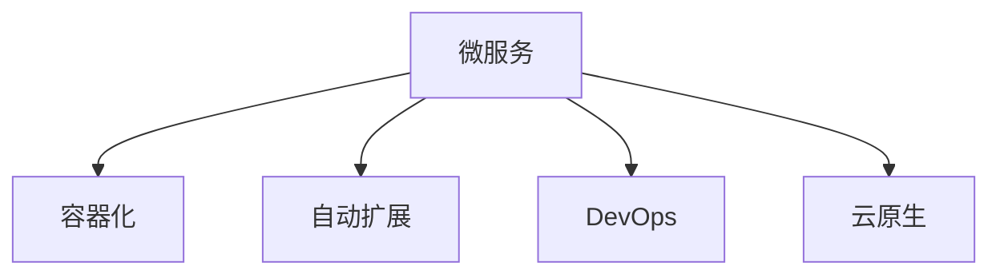

                 

# 软件2.0的无服务器计算架构

> 关键词：无服务器计算,Serverless,微服务架构,容器化,DevOps,云原生,DevOps,软件定义基础设施

## 1. 背景介绍

### 1.1 问题由来

随着云计算和互联网应用的蓬勃发展，无服务器计算（Serverless Computing）逐渐成为云计算架构的重要趋势。其核心理念是将计算资源的分配和管理完全交由云服务商负责，开发者只需关注应用程序的业务逻辑，无需关心底层计算资源的具体实现。这种架构可以大幅降低资源管理成本，提升开发效率，加速应用部署和扩展。

然而，无服务器计算仍存在一些挑战。例如，如何更高效地利用资源，避免冷启动延迟，实现应用的弹性伸缩，如何在复杂的云环境中部署和运维，如何确保应用的安全性和稳定性等。这些问题的解决需要一种更具弹性和可扩展性的计算架构。

### 1.2 问题核心关键点

软件2.0（Software 2.0）的概念由Google的首席架构师Kelsey J. Waters提出，旨在强调云计算架构的核心转变：从数据中心驱动的计算资源分配（以IaaS为代表的1.0时代），到应用驱动的资源管理和调度（以Serverless和微服务为代表的2.0时代）。软件2.0的无服务器计算架构，融合了微服务、容器化、DevOps、云原生等前沿技术，构建了一种更加灵活、可扩展、高效的应用架构。

软件2.0的核心特点包括：

1. **微服务化**：将大型应用程序拆分为多个独立运行的微服务，每个微服务负责单一职责，并通过轻量级通信机制实现协同工作。
2. **容器化**：使用容器技术（如Docker）对微服务进行打包和部署，确保环境一致性，提高应用的部署效率和可移植性。
3. **自动扩展**：利用云服务商的自动扩展能力，根据负载动态调整计算资源，实现应用的弹性伸缩。
4. **DevOps文化**：构建CI/CD流水线，实现快速构建、测试和发布，通过自动化提升开发效率和质量。
5. **云原生**：遵循12要素原则，采用云原生架构和技术栈，如Kubernetes、Istio等，提高应用的稳定性和可管理性。

### 1.3 问题研究意义

软件2.0的无服务器计算架构，为传统Web应用和微服务的迁移提供了新的路径，显著降低了开发和运维成本，提升了应用的可用性和可扩展性。其应用场景包括但不限于：

1. **Web应用**：如在线教育、电商、金融等互联网业务，需要应对用户流量波动和业务增长。
2. **云服务**：如API Gateway、负载均衡、缓存服务等，需要提供高性能和低延迟的计算资源。
3. **物联网**：如智能设备、传感器数据处理等，需要高效管理大量并发连接和数据处理。
4. **大数据**：如数据流处理、批处理等，需要实现弹性计算资源的灵活调度。

通过软件2.0的无服务器计算架构，企业可以更高效地利用云计算资源，构建更加稳定、可扩展的应用系统，从而在快速变化的互联网环境中保持竞争优势。

## 2. 核心概念与联系

### 2.1 核心概念概述

软件2.0的无服务器计算架构，融合了微服务、容器化、自动扩展、DevOps、云原生等核心概念。这些概念之间相互关联，共同构建了一种全新的应用架构和开发模式。

- **微服务（Microservices）**：将大型应用拆分为独立运行的微服务，每个微服务负责单一职责，并通过轻量级通信机制实现协同工作。
- **容器化（Containerization）**：使用容器技术（如Docker）对微服务进行打包和部署，确保环境一致性，提高应用的部署效率和可移植性。
- **自动扩展（Auto Scaling）**：利用云服务商的自动扩展能力，根据负载动态调整计算资源，实现应用的弹性伸缩。
- **DevOps文化**：构建CI/CD流水线，实现快速构建、测试和发布，通过自动化提升开发效率和质量。
- **云原生（Cloud Native）**：遵循12要素原则，采用云原生架构和技术栈，如Kubernetes、Istio等，提高应用的稳定性和可管理性。

这些概念的结合，使得软件2.0的无服务器计算架构具有更高的灵活性、可扩展性和效率，能够更好地应对互联网业务的复杂性和动态性。

### 2.2 核心概念原理和架构的 Mermaid 流程图



这个流程图展示了软件2.0无服务器计算架构的主要组件及其相互关系：

1. **微服务**：作为架构的基本单元，负责具体的业务逻辑。
2. **容器化**：对微服务进行打包和部署，确保环境一致性。
3. **自动扩展**：根据负载动态调整计算资源，实现弹性伸缩。
4. **DevOps**：通过自动化提升开发效率和质量。
5. **云原生**：采用云原生架构和技术栈，提升应用的稳定性和可管理性。

这些组件相互协作，共同构建了一种灵活、高效、稳定的应用架构。

## 3. 核心算法原理 & 具体操作步骤

### 3.1 算法原理概述

软件2.0的无服务器计算架构，融合了微服务、容器化、自动扩展、DevOps、云原生等核心概念，旨在构建一种灵活、高效、稳定的应用架构。其核心原理包括以下几个方面：

1. **微服务架构**：将大型应用拆分为独立运行的微服务，每个微服务负责单一职责，并通过轻量级通信机制实现协同工作。
2. **容器化技术**：使用容器技术（如Docker）对微服务进行打包和部署，确保环境一致性，提高应用的部署效率和可移植性。
3. **自动扩展机制**：利用云服务商的自动扩展能力，根据负载动态调整计算资源，实现应用的弹性伸缩。
4. **DevOps文化**：构建CI/CD流水线，实现快速构建、测试和发布，通过自动化提升开发效率和质量。
5. **云原生架构**：遵循12要素原则，采用云原生架构和技术栈，如Kubernetes、Istio等，提高应用的稳定性和可管理性。

### 3.2 算法步骤详解

软件2.0的无服务器计算架构的实施步骤可以分为以下几个阶段：

1. **架构设计**：根据业务需求，设计微服务架构，定义服务间的通信协议和数据流。
2. **容器化部署**：将微服务打包为容器镜像，使用容器编排工具（如Kubernetes）进行部署和管理。
3. **自动扩展配置**：根据负载监控数据，配置自动扩展策略，实现弹性伸缩。
4. **CI/CD流水线构建**：建立CI/CD流水线，实现自动化构建、测试和发布。
5. **云原生基础设施建设**：采用云原生架构和技术栈，如Kubernetes、Istio等，提升应用的稳定性和可管理性。

### 3.3 算法优缺点

软件2.0的无服务器计算架构具有以下优点：

1. **高效资源利用**：通过微服务化，资源利用率大幅提升，避免了资源浪费。
2. **弹性扩展**：自动扩展机制确保应用能够根据负载动态调整资源，提升应用的可伸缩性。
3. **环境一致性**：容器化技术确保应用在不同环境中的表现一致，降低了部署难度。
4. **快速部署和发布**：CI/CD流水线自动化构建和发布，缩短了开发周期，提高了开发效率。
5. **稳定性和可管理性**：云原生架构提升了应用的稳定性和可管理性，减少了运维复杂度。

然而，该架构也存在一些缺点：

1. **学习曲线陡峭**：微服务、容器化、DevOps、云原生等新技术的学习门槛较高。
2. **资源管理复杂**：虽然资源由云服务商管理，但设计和管理架构仍需一定的专业知识。
3. **安全性风险**：微服务架构的复杂性增加了攻击面，需要采取更多的安全措施。
4. **成本问题**：尽管减少了资源管理成本，但在设计和运维方面仍需投入较多资源。

### 3.4 算法应用领域

软件2.0的无服务器计算架构适用于各种类型的应用场景，包括但不限于：

1. **Web应用**：如在线教育、电商、金融等互联网业务，需要应对用户流量波动和业务增长。
2. **云服务**：如API Gateway、负载均衡、缓存服务等，需要提供高性能和低延迟的计算资源。
3. **物联网**：如智能设备、传感器数据处理等，需要高效管理大量并发连接和数据处理。
4. **大数据**：如数据流处理、批处理等，需要实现弹性计算资源的灵活调度。

## 4. 数学模型和公式 & 详细讲解 & 举例说明

### 4.1 数学模型构建

软件2.0的无服务器计算架构的数学模型主要涉及微服务的设计和部署、自动扩展的策略、CI/CD流水线的构建等方面。以下以自动扩展策略为例，构建其数学模型。

假设应用在时间t的负载为L(t)，其扩展因子为N，即每次扩展需要增加的资源数量。设当前实际使用的资源为R(t)，目标资源为R^*(t)，则自动扩展策略可以表示为：

$$
R(t+\Delta t) = \begin{cases}
R(t) \times (1 + \frac{L(t)}{R^*(t) - R(t)} \times N, & R(t) < R^*(t) \\
R^*(t), & R(t) \geq R^*(t)
\end{cases}
$$

其中，$\Delta t$ 表示时间间隔。

### 4.2 公式推导过程

自动扩展策略的数学模型可以进一步推导为：

$$
R(t+\Delta t) = R(t) + \frac{L(t)}{R^*(t) - R(t)} \times N \times R(t)
$$

该公式表示在时间t内，如果实际使用的资源R(t)小于目标资源R^*(t)，则根据负载L(t)和扩展因子N，增加资源，直到资源R(t)等于或大于目标资源R^*(t)。

### 4.3 案例分析与讲解

假设某个Web应用当前的实际使用资源为R(t) = 100个实例，目标资源为R^*(t) = 200个实例，每次扩展需要增加10个实例。在时间t内，负载L(t)增加了20%，即L(t+Δt) = 1.2L(t)。根据上述自动扩展策略，可以得到如下计算过程：

1. 当前负载L(t) = 1.2L(t-Δt)，因此R(t+Δt) = R(t) + 0.2N \times R(t) = 100 + 0.2 \times 10 \times 100 = 120个实例。
2. 负载继续增加，L(t+2Δt) = 1.44L(t-2Δt)，因此R(t+2Δt) = R(t) + 0.44N \times R(t) = 120 + 0.44 \times 10 \times 120 = 154个实例。
3. 负载保持稳定，L(t+3Δt) = 1.2L(t-3Δt)，因此R(t+3Δt) = R(t) + 0.2N \times R(t) = 154 + 0.2 \times 10 \times 154 = 178个实例。
4. 负载再次增加，L(t+4Δt) = 1.2L(t-4Δt)，因此R(t+4Δt) = R(t) + 0.2N \times R(t) = 178 + 0.2 \times 10 \times 178 = 214个实例。

根据上述计算，我们可以看到，自动扩展策略能够根据负载动态调整资源，确保应用在高负载情况下仍然能够高效运行。

## 5. 项目实践：代码实例和详细解释说明

### 5.1 开发环境搭建

要实践软件2.0的无服务器计算架构，首先需要搭建一个适合的环境。以下是一个基于Kubernetes和Docker的实践环境搭建步骤：

1. 安装Kubernetes集群：可以使用Minikube、Kubernetes on Azure、Google Kubernetes Engine等云平台服务。
2. 安装Docker：在Kubernetes集群中安装Docker，用于容器化微服务。
3. 配置CI/CD流水线：使用Jenkins、GitLab CI/CD等工具，实现自动化构建和发布。

### 5.2 源代码详细实现

以下是一个简单的微服务架构实现示例，包括一个Web应用和后台服务：

**Web应用**

```python
from flask import Flask, request, jsonify

app = Flask(__name__)

@app.route('/api/data', methods=['GET'])
def get_data():
    data = request.args.get('data')
    return jsonify(data)

if __name__ == '__main__':
    app.run(debug=True)
```

**后台服务**

```python
from flask import Flask, request, jsonify

app = Flask(__name__)

@app.route('/api/data', methods=['POST'])
def post_data():
    data = request.json.get('data')
    # 处理数据逻辑
    return jsonify({'success': True})

if __name__ == '__main__':
    app.run(debug=True)
```

### 5.3 代码解读与分析

在这个示例中，Web应用和后台服务分别使用了Flask框架，通过RESTful API进行通信。Web应用通过GET请求获取数据，后台服务通过POST请求处理数据并返回响应。

**Web应用**

- `@app.route`：定义了Web应用的路由，`/api/data`为API接口。
- `request.args.get`：获取GET请求中的参数。
- `jsonify`：将数据转换为JSON格式返回。

**后台服务**

- `@app.route`：定义了后台服务的路由，`/api/data`为API接口。
- `request.json.get`：获取POST请求中的JSON数据。
- `jsonify`：将处理结果转换为JSON格式返回。

### 5.4 运行结果展示

通过在Kubernetes集群中部署这两个微服务，并使用Kubernetes的Service和Ingress进行负载均衡和访问控制，可以构建一个完整的应用系统。使用cURL工具访问Web应用和后台服务，能够验证其正常工作。

```
$ curl http://<minikube-host>:<minikube-port>/api/data?data=hello
{"data": "hello"}
$ curl -X POST -H "Content-Type: application/json" -d '{"data": "world"}' http://<minikube-host>:<minikube-port>/api/data
{"success": true}
```

## 6. 实际应用场景

### 6.1 智能客服系统

软件2.0的无服务器计算架构，可以用于构建智能客服系统。传统客服系统需要大量人力，高峰期响应速度慢，且难以保证一致性和专业性。通过微服务架构和容器化技术，可以将客服系统的各个组件独立运行，提高系统的稳定性和可扩展性。

### 6.2 金融舆情监测

在金融领域，实时监测舆情动向，及时应对负面信息传播，是防范金融风险的重要手段。通过微服务架构和自动扩展机制，可以快速构建高性能的舆情监测系统，实时采集和分析海量数据，及时预警和处理异常情况。

### 6.3 个性化推荐系统

推荐系统需要实时处理用户行为数据，并动态更新推荐结果。通过微服务架构和容器化技术，可以构建一个高可用、高可扩展的推荐系统，实时处理用户数据，快速生成个性化推荐。

### 6.4 未来应用展望

未来，软件2.0的无服务器计算架构将在更多领域得到应用，为传统行业带来变革性影响。在智慧医疗、智能教育、智慧城市等领域，通过微服务架构和容器化技术，可以构建更加灵活、高效、稳定的应用系统，提升业务处理的效率和质量。

## 7. 工具和资源推荐

### 7.1 学习资源推荐

为了帮助开发者系统掌握软件2.0的无服务器计算架构，这里推荐一些优质的学习资源：

1. **《Serverless: Design Patterns for Cloud Native Applications》**：Amazon的官方书籍，介绍了无服务器架构的设计模式和最佳实践。
2. **Kubernetes官方文档**：详细的Kubernetes文档和示例，帮助你深入理解Kubernetes的部署和管理。
3. **Google Cloud的Serverless技术文档**：Google Cloud的官方文档，介绍了Google Cloud的无服务器计算服务。
4. **Istio官方文档**：Istio的官方文档和示例，帮助你深入理解Istio的服务治理和网络管理。
5. **DevOps实践指南**：《DevOps实践指南》和《The Phoenix Project》等书籍，帮助你理解DevOps文化和技术栈。

### 7.2 开发工具推荐

以下是几款用于软件2.0无服务器计算架构开发的常用工具：

1. **Kubernetes**：开源的容器编排工具，支持自动扩展、资源管理、服务发现等功能。
2. **Docker**：开源的容器化工具，支持应用打包、部署和管理。
3. **Jenkins**：开源的自动化构建和发布工具，支持CI/CD流水线。
4. **Istio**：开源的服务治理平台，支持服务发现、负载均衡、流量控制等功能。
5. **Prometheus**：开源的监控工具，支持应用性能监控和告警。

### 7.3 相关论文推荐

软件2.0的无服务器计算架构，得益于学术界的持续研究。以下是几篇奠基性的相关论文，推荐阅读：

1. **《12-Factor App: Just Build It》**：马丁·弗勒德·萨瑟兰（Martin Fowler）的论文，介绍了微服务架构的12要素原则。
2. **《Cloud-Native Computing Foundation》**：云原生计算基金会（CNCF）发布的云原生技术文档，介绍了云原生架构和最佳实践。
3. **《Microservices Architecture Patterns》**：帕特·帕特森（Patrick Patterson）的论文，介绍了微服务架构的设计模式和最佳实践。

这些论文代表了大规模软件架构的研究进展，通过学习这些前沿成果，可以帮助研究者把握学科前进方向，激发更多的创新灵感。

## 8. 总结：未来发展趋势与挑战

### 8.1 研究成果总结

软件2.0的无服务器计算架构，融合了微服务、容器化、自动扩展、DevOps、云原生等前沿技术，构建了一种灵活、高效、稳定的应用架构。该架构已经在多个实际应用场景中得到了验证，证明了其可行性和有效性。

### 8.2 未来发展趋势

展望未来，软件2.0的无服务器计算架构将继续发展，呈现以下几个趋势：

1. **自动化和智能化**：未来的无服务器计算架构将更加自动化和智能化，利用AI技术进行资源优化和预测，提升系统的自我管理和自适应能力。
2. **多云和混合云**：无服务器计算架构将支持多云和混合云环境，提供跨云资源管理和调度能力。
3. **边缘计算和物联网**：无服务器计算架构将拓展到边缘计算和物联网领域，支持设备端的轻量级应用和数据处理。
4. **安全性和隐私保护**：未来的无服务器计算架构将更加注重安全性和隐私保护，引入区块链、加密等技术，确保数据和应用的可靠性和安全性。

### 8.3 面临的挑战

尽管软件2.0的无服务器计算架构已经取得了一定的进展，但在迈向更加智能化、普适化应用的过程中，仍面临以下挑战：

1. **学习曲线陡峭**：微服务、容器化、DevOps、云原生等新技术的学习门槛较高，需要投入大量时间和精力。
2. **资源管理复杂**：虽然资源由云服务商管理，但设计和管理架构仍需一定的专业知识。
3. **安全性风险**：微服务架构的复杂性增加了攻击面，需要采取更多的安全措施。
4. **成本问题**：尽管减少了资源管理成本，但在设计和运维方面仍需投入较多资源。

### 8.4 研究展望

面对软件2.0的无服务器计算架构所面临的挑战，未来的研究需要在以下几个方面寻求新的突破：

1. **自动化和智能化**：利用AI技术进行资源优化和预测，提升系统的自我管理和自适应能力。
2. **多云和混合云**：支持多云和混合云环境，提供跨云资源管理和调度能力。
3. **边缘计算和物联网**：拓展到边缘计算和物联网领域，支持设备端的轻量级应用和数据处理。
4. **安全性和隐私保护**：引入区块链、加密等技术，确保数据和应用的可靠性和安全性。

这些研究方向的探索，将进一步推动软件2.0的无服务器计算架构的发展，为构建更加灵活、高效、安全的云计算系统铺平道路。

## 9. 附录：常见问题与解答

**Q1：如何选择合适的微服务架构？**

A: 选择微服务架构需要考虑业务场景、系统复杂度、开发团队能力等因素。一般而言，适合采用微服务架构的业务场景包括：

1. **高并发**：需要处理大量并发请求的系统，如电商平台、金融交易等。
2. **高扩展性**：需要根据负载动态调整资源的系统，如在线视频、大数据处理等。
3. **高可用性**：需要保证高可用和容错性的系统，如云服务、企业级应用等。

在选择微服务架构时，还需要注意以下几点：

1. **服务粒度**：服务粒度应该适中，过小会导致服务过多，增加管理复杂度；过大会降低系统的可扩展性和灵活性。
2. **通信方式**：选择轻量级通信方式，如RESTful API、gRPC等，以提高系统性能和可扩展性。
3. **服务编排**：使用容器编排工具（如Kubernetes）进行服务管理，提高系统可靠性和可扩展性。

**Q2：如何实现微服务的负载均衡？**

A: 微服务的负载均衡可以通过多种方式实现，如DNS负载均衡、Nginx负载均衡、Kubernetes Service等。其中，Kubernetes Service是最常用的负载均衡方式，支持自动扩展、健康检查等功能。

在Kubernetes中，可以使用Service资源定义微服务的负载均衡策略，通过标签选择器选择对应的Pod，并将请求分发到这些Pod上。例如：

```yaml
apiVersion: v1
kind: Service
metadata:
  name: my-service
spec:
  selector:
    app: my-app
  ports:
    - protocol: TCP
      port: 80
      targetPort: 8080
```

**Q3：什么是容器化？**

A: 容器化是一种软件打包和部署方式，将应用及其依赖打包到一个可移植、独立运行的环境中。容器化技术（如Docker）可以将应用程序、运行时环境和依赖打包到容器镜像中，确保应用在不同环境中的表现一致。

容器化技术的主要优势包括：

1. **环境一致性**：容器化技术确保应用在不同环境中的表现一致，降低了部署难度。
2. **快速部署**：容器化技术支持快速构建和部署，缩短了开发周期。
3. **资源优化**：容器化技术支持资源隔离和优化，提高资源利用率。

容器化技术的实现方式包括Docker、Rkt等，其中Docker是最常用的容器化工具。

**Q4：什么是Kubernetes？**

A: Kubernetes是一个开源的容器编排工具，支持自动扩展、资源管理、服务发现等功能。Kubernetes能够对容器化的微服务进行管理和调度，确保应用的高可用性和可扩展性。

Kubernetes的主要功能包括：

1. **部署和管理**：支持应用的快速部署和自动化管理。
2. **自动扩展**：根据负载动态调整计算资源，实现应用的弹性伸缩。
3. **服务发现**：支持服务发现和负载均衡，确保服务的可访问性。
4. **资源管理**：支持资源隔离和优化，提高资源利用率。

Kubernetes的部署方式包括集群部署和云平台部署，其中云平台部署（如Google Kubernetes Engine）更加便捷，能够快速搭建和管理集群。

**Q5：什么是DevOps？**

A: DevOps是一种软件开发生命周期管理方式，强调自动化和持续交付，提升开发效率和质量。DevOps文化包括持续集成（CI）、持续交付（CD）、自动化测试、自动化部署等技术手段。

DevOps的主要优势包括：

1. **自动化**：通过自动化工具和流程，提升开发效率和质量。
2. **持续交付**：通过持续集成和持续交付，实现快速构建、测试和发布。
3. **协作**：通过团队协作和沟通，提高开发效率和产品质量。

DevOps的实现方式包括Jenkins、GitLab CI/CD等自动化工具，以及敏捷开发、持续集成等技术手段。

通过以上的学习资源、开发工具和研究展望，相信你一定能够深入理解软件2.0的无服务器计算架构，并应用于实际开发中。未来，让我们一起探索无服务器计算的更多可能性，构建更加智能、高效、稳定的云计算系统。

---

作者：禅与计算机程序设计艺术 / Zen and the Art of Computer Programming

