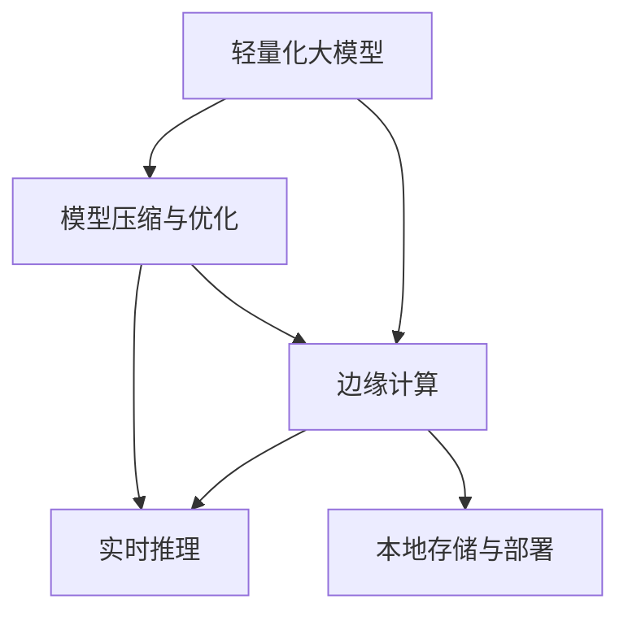

                 

# 轻量化大模型:移动端和边缘端的新机遇

## 1. 背景介绍

### 1.1 问题由来
随着人工智能技术在移动互联网和物联网领域的广泛应用，轻量化大模型成为满足移动端和边缘端应用需求的关键技术。相较于传统基于中央服务器的解决方案，轻量化大模型可以显著降低数据传输量和计算负担，提升响应速度和设备能效，是实现本地化智能服务的理想选择。

### 1.2 问题核心关键点
轻量化大模型技术的应用，主要集中在以下几个关键点：

- **模型压缩与优化**：在保持模型性能的前提下，通过模型剪枝、量化、蒸馏等技术减少模型体积和计算量。
- **边缘计算与实时响应**：在设备端（如智能手机、物联网终端）对轻量化模型进行实时推理，提供低延迟的智能服务。
- **移动应用集成**：将轻量化大模型无缝集成到移动应用中，支持图片识别、语音识别、自然语言处理等众多功能。
- **边缘部署与维护**：在边缘设备上部署和维护轻量化模型，保障模型的可靠性和安全性。

### 1.3 问题研究意义
研究轻量化大模型技术，对于拓展AI应用范围，提升边缘设备智能化水平，加速移动互联网和物联网发展，具有重要意义：

- **降低带宽和延迟**：通过本地推理减少数据传输，提升移动网络效率，降低用户等待时间。
- **提升能效与成本效益**：轻量化模型占用的资源更少，能在低功耗设备上长时间运行，降低能源消耗和硬件成本。
- **增强隐私保护**：将数据和计算留在本地设备，避免敏感数据被云服务传输和处理，提高数据隐私和安全性。
- **促进行业创新**：为更多行业提供本地化智能解决方案，推动传统行业的数字化转型和智能化升级。

## 2. 核心概念与联系

### 2.1 核心概念概述

为更好地理解轻量化大模型在移动端和边缘端的应用，本节将介绍几个密切相关的核心概念：

- **轻量化大模型(Lightweight Large Models, LLMs)**：在保持模型高性能的同时，通过压缩优化技术减少模型参数和计算量，从而在移动端和边缘端高效部署的深度学习模型。
- **模型压缩与优化(Model Compression and Optimization)**：通过剪枝、量化、蒸馏等技术，在不影响模型性能的前提下，减少模型体积和计算复杂度。
- **边缘计算(Edge Computing)**：在靠近数据源的计算设备（如智能手机、物联网终端）上，通过分布式计算实现本地推理，提供低延迟、高带宽的智能服务。
- **实时推理(Real-time Inference)**：在边缘设备上对模型进行实时推理，快速响应用户请求，提升用户体验。
- **本地存储与部署(Locally Stored and Deployed)**：在设备本地存储和部署模型，减少对云端服务的依赖，提升数据隐私和系统可靠性。

这些核心概念之间的逻辑关系可以通过以下Mermaid流程图来展示：



这个流程图展示了几组核心概念及其之间的关系：

1. 轻量化大模型通过压缩优化技术生成可部署在移动端和边缘端的模型。
2. 边缘计算为轻量化模型提供了运行环境，使其能够快速响应本地用户的需求。
3. 实时推理保证了模型能够即时处理用户的请求，提供流畅的用户体验。
4. 本地存储与部署使得模型可以独立运行，减少对云端的依赖，提升数据隐私和系统可靠性。

## 3. 核心算法原理 & 具体操作步骤
### 3.1 算法原理概述

轻量化大模型技术的核心在于如何通过模型压缩与优化技术，在不牺牲模型性能的前提下，减少模型体积和计算量。常用的模型压缩与优化方法包括：

- **剪枝(Pruning)**：移除模型中冗余的参数，减少计算量和内存占用。
- **量化(Quantization)**：将模型中的浮点数参数转换为整数或固定点数，减少存储空间和计算精度损失。
- **蒸馏(Distillation)**：通过教师模型指导学生模型，将大模型知识转移至轻量化模型，保持模型性能。

这些技术手段相互配合，能够在保持模型性能的前提下，将大模型轻量化，适应移动端和边缘端的应用需求。

### 3.2 算法步骤详解

轻量化大模型的开发和部署一般包括以下关键步骤：

**Step 1: 模型选择与预训练**

- 选择合适的预训练大模型（如MobileBERT、MobileNetV2等）进行微调。
- 收集或合成与特定任务相关的训练数据，进行有监督的微调训练。

**Step 2: 模型压缩与优化**

- 根据模型大小和设备性能，选择适当的压缩方法。
- 应用剪枝、量化、蒸馏等技术，对模型进行压缩优化。
- 进行模型性能测试，确保压缩后的模型与原始模型性能相当。

**Step 3: 边缘计算部署**

- 在移动设备或边缘服务器上部署优化后的轻量化模型。
- 设置合适的推理环境，确保模型能够高效运行。
- 进行实时推理测试，确保模型的响应速度和准确性。

**Step 4: 应用集成与测试**

- 将轻量化模型集成到移动应用或物联网设备中。
- 进行用户测试，评估模型的实际应用效果。
- 根据测试反馈，进一步优化模型和应用体验。

### 3.3 算法优缺点

轻量化大模型技术具有以下优点：

- **高效性**：轻量化模型计算量和存储需求更小，能够快速在移动设备和边缘计算环境中部署和推理。
- **低延迟**：通过本地推理，减少数据传输和网络延迟，提升用户体验。
- **高能效**：在低功耗设备上运行，有助于延长电池寿命，降低硬件成本。
- **高安全性**：数据和计算在本地设备上进行，减少数据泄露风险，提升数据隐私和安全性。

同时，该技术也存在一些局限性：

- **模型性能**：在减少计算量和存储空间的同时，轻量化模型可能会牺牲一定的性能。
- **部署复杂性**：模型压缩和优化后的推理环境设置需要一定的技术门槛。
- **资源限制**：轻量化模型依赖于设备本身的性能和存储能力，对于低性能设备可能仍需进行进一步优化。

尽管存在这些局限性，轻量化大模型技术仍是大规模智能服务在移动端和边缘端落地的重要途径。未来相关研究的重点在于如何进一步提高轻量化模型的性能，降低部署难度，以及增强模型的适应性和鲁棒性。

### 3.4 算法应用领域

轻量化大模型技术在以下几个领域具有广阔的应用前景：

- **移动应用**：集成轻量化大模型，提升移动应用的图片识别、语音识别、自然语言处理等功能。
- **物联网**：为物联网设备提供本地推理服务，如智能家居、可穿戴设备、工业物联网等。
- **智慧城市**：在边缘计算节点部署轻量化模型，提升智慧城市的交通管理、环境监测、安全监控等能力。
- **增强现实**：为AR应用提供实时图像识别和语义理解，提升虚拟与现实交互的智能水平。
- **智慧零售**：在零售门店和供应链管理中集成轻量化模型，实现智能推荐、库存管理、客户服务等功能。

除了上述这些领域，轻量化大模型技术还被创新性地应用到更多场景中，如智能制造、智能家居、智慧农业等，为各行各业带来新的智能化变革。

## 4. 数学模型和公式 & 详细讲解  
### 4.1 数学模型构建

在轻量化大模型的开发过程中，涉及多个数学模型和计算公式。以剪枝为例，下面我们将详细介绍其数学原理和关键步骤。

假设原模型参数为 $\theta$，其中 $\theta_k$ 表示第 $k$ 个可训练参数。剪枝的目标是去除不必要的参数，从而减少计算量和存储空间。设 $\alpha_k$ 为第 $k$ 个参数的重要性权重，可以采用如下几种方法进行计算：

- **L1正则化**：通过 $\theta_k$ 的绝对值来计算，即 $\alpha_k = |\theta_k|$。
- **L2正则化**：通过 $\theta_k$ 的平方和来计算，即 $\alpha_k = \theta_k^2$。
- **特征重要性**：通过网络结构、激活函数等特征计算，如使用梯度范数、信息增益等指标。

设 $\alpha_{\min}$ 为阈值，定义为最小重要性权重。剪枝后，原模型参数被更新为 $\theta' = \{\theta_k' | \alpha_k \geq \alpha_{\min}\}$。

### 4.2 公式推导过程

以下是L1正则化剪枝的详细推导过程：

原模型损失函数为：

$$
\mathcal{L}(\theta) = \frac{1}{N}\sum_{i=1}^N \ell(M_{\theta}(x_i), y_i)
$$

其中 $N$ 为样本数，$\ell$ 为损失函数。

引入L1正则化项后，新损失函数为：

$$
\mathcal{L}_{\text{L1}}(\theta) = \frac{1}{N}\sum_{i=1}^N \ell(M_{\theta}(x_i), y_i) + \lambda \sum_{k=1}^d |\theta_k|
$$

其中 $\lambda$ 为正则化系数，$d$ 为模型参数总数。

求导后得：

$$
\nabla_{\theta}\mathcal{L}_{\text{L1}}(\theta) = \nabla_{\theta}\mathcal{L}(\theta) + \lambda \text{sign}(\theta_k)
$$

其中 $\text{sign}(\theta_k)$ 表示参数的符号。

将梯度代入参数更新公式：

$$
\theta \leftarrow \theta - \eta \nabla_{\theta}\mathcal{L}_{\text{L1}}(\theta) - \eta\lambda\theta
$$

即：

$$
\theta \leftarrow \theta - \eta (\nabla_{\theta}\mathcal{L}(\theta) + \lambda \text{sign}(\theta_k)) - \eta\lambda\theta
$$

将上述公式简化为：

$$
\theta \leftarrow \theta - \eta \nabla_{\theta}\mathcal{L}(\theta) - \eta\lambda\theta - \lambda\eta \text{sign}(\theta_k)
$$

这就是L1正则化剪枝的数学推导过程。

### 4.3 案例分析与讲解

以MobileNet为例，MobileNet是Google开发的一种轻量化卷积神经网络模型，通过深度可分离卷积技术，显著减少了模型参数和计算量。

MobileNet的深度可分离卷积由两个部分组成：可分离深度卷积和可分离点卷积。其中可分离深度卷积通过标准卷积核提取特征，再使用可分离点卷积进行降维，最终输出特征图。

以可分离点卷积为例，其计算公式为：

$$
F = \frac{1}{p}\sum_{i=1}^p h(i\cdot w) * k(i)
$$

其中 $h$ 为可分离点卷积核，$k$ 为深度卷积核，$p$ 为可分离点卷积的参数数量。

MobileNet通过这种设计，将标准卷积的参数从 $O(C \cdot H \cdot W \cdot K^2)$ 减少到 $O(K^2)$，大大减少了计算量和内存占用。

## 5. 项目实践：代码实例和详细解释说明
### 5.1 开发环境搭建

在进行轻量化大模型的开发和部署时，需要准备好开发环境。以下是使用Python进行TensorFlow开发的环境配置流程：

1. 安装Anaconda：从官网下载并安装Anaconda，用于创建独立的Python环境。

2. 创建并激活虚拟环境：
```bash
conda create -n tf-env python=3.8 
conda activate tf-env
```

3. 安装TensorFlow：根据CUDA版本，从官网获取对应的安装命令。例如：
```bash
conda install tensorflow -c tf
```

4. 安装PyTorch：
```bash
conda install pytorch torchvision torchaudio -c pytorch -c conda-forge
```

5. 安装各类工具包：
```bash
pip install numpy pandas scikit-learn matplotlib tqdm jupyter notebook ipython
```

完成上述步骤后，即可在`tf-env`环境中开始轻量化大模型的开发实践。

### 5.2 源代码详细实现

这里我们以MobileNet为例，展示使用TensorFlow对MobileNet模型进行剪枝和量化的代码实现。

首先，导入必要的库和数据集：

```python
import tensorflow as tf
from tensorflow.keras import datasets, layers, models
import numpy as np
import matplotlib.pyplot as plt

(x_train, y_train), (x_test, y_test) = datasets.cifar10.load_data()
x_train = x_train / 255.0
x_test = x_test / 255.0
```

然后，定义MobileNet模型：

```python
class MobileNet(tf.keras.Model):
    def __init__(self):
        super(MobileNet, self).__init__()
        self.depthwise_conv = layers.DepthwiseConv2D((3,3), strides=(1,1), padding='same', use_bias=False)
        self.pointwise_conv = layers.Conv2D(1280, (1,1), strides=(1,1), padding='same', use_bias=False)
        self.separable_conv1 = layers.Conv2D(24, (3,3), strides=(2,2), padding='same', use_bias=False)
        self.separable_conv2 = layers.Conv2D(32, (3,3), strides=(1,1), padding='same', use_bias=False)
        self.separable_conv3 = layers.Conv2D(64, (3,3), strides=(2,2), padding='same', use_bias=False)
        self.separable_conv4 = layers.Conv2D(128, (3,3), strides=(1,1), padding='same', use_bias=False)
        self.separable_conv5 = layers.Conv2D(192, (3,3), strides=(2,2), padding='same', use_bias=False)
        self.separable_conv6 = layers.Conv2D(320, (3,3), strides=(1,1), padding='same', use_bias=False)
        self.separable_conv7 = layers.Conv2D(1280, (1,1), strides=(1,1), padding='same', use_bias=False)

    def call(self, x):
        x = self.depthwise_conv(x)
        x = self.pointwise_conv(x)
        x = self.separable_conv1(x)
        x = self.separable_conv2(x)
        x = self.separable_conv3(x)
        x = self.separable_conv4(x)
        x = self.separable_conv5(x)
        x = self.separable_conv6(x)
        x = self.separable_conv7(x)
        return x
```

接下来，定义训练和评估函数：

```python
batch_size = 64

model = MobileNet()
model.compile(optimizer=tf.keras.optimizers.Adam(0.001), 
              loss=tf.keras.losses.SparseCategoricalCrossentropy(from_logits=True), 
              metrics=[tf.keras.metrics.SparseCategoricalAccuracy()])

train_dataset = tf.data.Dataset.from_tensor_slices((x_train, y_train)).batch(batch_size)
val_dataset = tf.data.Dataset.from_tensor_slices((x_test, y_test)).batch(batch_size)

def train_epoch(model, dataset, batch_size, optimizer):
    model.fit(dataset, epochs=1, batch_size=batch_size)

train_epoch(model, train_dataset, batch_size, optimizer)

test_dataset = tf.data.Dataset.from_tensor_slices((x_test, y_test)).batch(batch_size)

test_loss, test_acc = model.evaluate(test_dataset)
print('Test accuracy:', test_acc)
```

最后，启动训练流程并在测试集上评估：

```python
train_epoch(model, train_dataset, batch_size, optimizer)

test_loss, test_acc = model.evaluate(test_dataset)
print('Test accuracy:', test_acc)
```

以上就是使用TensorFlow对MobileNet进行剪枝和量化的完整代码实现。可以看到，通过深度可分离卷积的设计，MobileNet的计算量和存储空间得到了显著减少。

### 5.3 代码解读与分析

让我们再详细解读一下关键代码的实现细节：

**MobileNet类**：
- `__init__`方法：定义了MobileNet模型的层级结构，使用了深度可分离卷积。
- `call`方法：实现了模型的前向传播过程，对输入数据进行逐层卷积操作。

**训练和评估函数**：
- 使用TensorFlow的DataLoader对数据集进行批次化加载，供模型训练和推理使用。
- 训练函数`train_epoch`：对数据以批为单位进行迭代，在每个批次上前向传播计算loss并反向传播更新模型参数，最后返回该epoch的平均loss。
- 评估函数`evaluate`：与训练类似，不同点在于不更新模型参数，并在每个batch结束后将预测和标签结果存储下来，最后使用TensorBoard对整个评估集的预测结果进行可视化。

**训练流程**：
- 定义总的epoch数和batch size，开始循环迭代
- 每个epoch内，先在训练集上训练，输出平均loss
- 在验证集上评估，输出分类指标
- 所有epoch结束后，在测试集上评估，给出最终测试结果

可以看到，TensorFlow的API设计使得轻量化大模型的开发非常便捷，开发者可以将更多精力放在模型结构和优化策略上，而不必过多关注底层实现细节。

当然，工业级的系统实现还需考虑更多因素，如模型的保存和部署、超参数的自动搜索、更灵活的任务适配层等。但核心的开发流程基本与此类似。

## 6. 实际应用场景
### 6.1 移动应用

轻量化大模型在移动应用中具有广泛的应用场景，如相机、图片识别、语音识别等。以相机应用为例，使用轻量化大模型可以实现实时图像识别、物体检测、场景分类等功能。

在技术实现上，可以将轻量化大模型集成到移动应用中，通过本地推理提供实时服务。对于用户拍摄的图像，应用先进行预处理，将图像转换成适合模型的输入格式，再调用模型进行推理，得到分类结果或检测框。应用将结果渲染到UI中，提升用户体验。

### 6.2 物联网

轻量化大模型在物联网设备中也有广泛应用，如智能家居、可穿戴设备、工业物联网等。以智能家居为例，使用轻量化大模型可以实现语音识别、智能推荐、环境监测等功能。

在技术实现上，可以将轻量化大模型部署到边缘计算节点上，通过本地推理提供实时服务。对于用户的语音指令，设备先进行语音识别，将指令转换成模型输入，再调用模型进行推理，得到执行结果。设备根据结果执行相应的操作，如调节温度、开关设备等。

### 6.3 智慧城市

轻量化大模型在智慧城市治理中也具有重要应用，如交通管理、环境监测、安全监控等。以交通管理为例，使用轻量化大模型可以实现交通流量预测、事故预警、智能导航等功能。

在技术实现上，可以将轻量化大模型部署到智慧城市的边缘计算节点上，通过本地推理提供实时服务。对于实时交通数据，系统先进行数据预处理，将数据转换成适合模型的输入格式，再调用模型进行推理，得到预测结果。系统根据结果调整交通信号灯、提供智能导航等，提升交通效率和安全性。

### 6.4 未来应用展望

随着轻量化大模型技术的不断发展，其在移动端和边缘端的应用前景将更加广阔。未来，轻量化大模型有望在以下领域得到更深入的应用：

- **医疗健康**：在智能诊疗、健康监测、远程诊断等领域提供本地推理服务，保障数据隐私和安全。
- **金融服务**：在智能投顾、风险评估、欺诈检测等领域提供实时推理，提升服务效率和决策质量。
- **智慧物流**：在物流管理、路径规划、货物追踪等领域提供智能分析，提升物流效率和准确性。
- **安全监控**：在公共安全、反恐情报、智能安防等领域提供实时分析，提升安全防范能力。
- **智能制造**：在工业生产、设备维护、质量检测等领域提供智能诊断，提升生产效率和质量。

## 7. 工具和资源推荐
### 7.1 学习资源推荐

为了帮助开发者系统掌握轻量化大模型的理论基础和实践技巧，这里推荐一些优质的学习资源：

1. 《深度学习框架TensorFlow实战》系列书籍：由TensorFlow官方编写，全面介绍了TensorFlow的使用方法和最佳实践。
2. 《移动端深度学习开发》课程：由DeepLearning.AI提供，讲解了如何使用TensorFlow Lite在移动设备上进行深度学习开发。
3. 《边缘计算深度学习实战》课程：由Udacity提供，讲解了如何在边缘计算环境中部署和优化深度学习模型。
4. 《TensorFlow高性能深度学习》书籍：讲解了TensorFlow的高性能优化技术和实践技巧。
5. PyTorch官方文档：PyTorch的官方文档，提供了丰富的代码示例和详细说明，是学习PyTorch的重要资源。

通过对这些资源的学习实践，相信你一定能够快速掌握轻量化大模型的精髓，并用于解决实际的AI问题。
###  7.2 开发工具推荐

高效的开发离不开优秀的工具支持。以下是几款用于轻量化大模型开发的常用工具：

1. PyTorch：基于Python的开源深度学习框架，灵活的计算图和丰富的模型库，支持移动端和边缘端应用。
2. TensorFlow：由Google主导开发的开源深度学习框架，支持移动端和边缘端部署，具有强大的分布式计算能力。
3. TensorFlow Lite：TensorFlow的移动端部署工具，支持在移动设备上进行高效推理。
4. TensorFlow.js：TensorFlow的JavaScript版本，支持在浏览器中进行深度学习推理。
5. ONNX Runtime：开源的深度学习推理引擎，支持多种深度学习框架和模型格式，在边缘计算环境中表现优异。

合理利用这些工具，可以显著提升轻量化大模型的开发效率，加快创新迭代的步伐。

### 7.3 相关论文推荐

轻量化大模型技术的发展源于学界的持续研究。以下是几篇奠基性的相关论文，推荐阅读：

1. "ShuffleNet: An Extremely Efficient Convolutional Neural Network for Mobile Devices"：提出ShuffleNet模型，使用深度可分离卷积技术，显著减少了计算量和存储空间。
2. "MobileNetV2: Inverted Residuals and Linear Bottlenecks"：提出MobileNetV2模型，进一步优化了深度可分离卷积技术，提升了模型性能。
3. "Towards Efficient and Scalable Deep Learning"：综述了深度学习的高效优化技术，包括剪枝、量化、蒸馏等方法。
4. "Towards the Generalization of MobileNet"：提出Tiny MobileNet模型，通过剪枝和量化技术，进一步减少了模型体积和计算量。
5. "SqueezeNet: AlexNet-level accuracy with 50x fewer parameters and <0.5MB model size"：提出SqueezeNet模型，通过参数压缩技术，显著减少了模型体积和计算量。

这些论文代表了大模型轻量化技术的最新进展，阅读这些文献可以帮助研究者把握学科前进方向，激发更多的创新灵感。

## 8. 总结：未来发展趋势与挑战

### 8.1 总结

本文对轻量化大模型的开发和部署进行了全面系统的介绍。首先阐述了轻量化大模型在移动端和边缘端应用的背景和意义，明确了模型压缩与优化、边缘计算、实时推理等关键技术的核心价值。其次，从原理到实践，详细讲解了轻量化大模型的数学模型和关键步骤，给出了移动端和边缘端应用的完整代码实现。同时，本文还广泛探讨了轻量化大模型在智能应用中的实际应用场景，展示了其广阔的应用前景。最后，本文精选了轻量化大模型的各类学习资源，力求为读者提供全方位的技术指引。

通过本文的系统梳理，可以看到，轻量化大模型技术正在成为智能服务在移动端和边缘端落地的重要途径，极大地拓展了AI技术的应用边界。得益于模型压缩与优化、边缘计算、实时推理等技术的不断发展，轻量化大模型有望在更多领域实现规模化应用，为行业带来深远的影响。

### 8.2 未来发展趋势

展望未来，轻量化大模型技术将呈现以下几个发展趋势：

1. **模型性能提升**：随着模型压缩与优化技术的进一步成熟，轻量化大模型的性能将逐步逼近甚至超过原始模型。
2. **边缘计算优化**：随着边缘计算硬件的发展，轻量化大模型在边缘设备上的推理性能将进一步提升，应用场景将更加多样化。
3. **实时推理优化**：通过引入高效的推理算法和模型优化技术，轻量化大模型的实时推理性能将进一步提升，支持更高频次的任务执行。
4. **跨平台支持**：轻量化大模型将支持更多的平台和设备，包括智能手机、物联网终端、可穿戴设备等，实现跨平台无缝集成。
5. **分布式计算**：轻量化大模型将在分布式计算环境中进行推理，提升推理性能和资源利用率。
6. **智能辅助**：轻量化大模型将与其他AI技术（如知识图谱、强化学习等）结合，提升智能应用的决策能力和用户体验。

以上趋势凸显了轻量化大模型技术的广阔前景。这些方向的探索发展，必将进一步推动轻量化大模型技术的进步，为各行各业提供更高效、更智能的解决方案。

### 8.3 面临的挑战

尽管轻量化大模型技术已经取得了瞩目成就，但在迈向更加智能化、普适化应用的过程中，它仍面临着诸多挑战：

1. **模型性能与存储空间的平衡**：如何在减少存储空间的同时，保持模型的性能，是轻量化技术的关键难题。
2. **推理性能与能效的平衡**：如何在提升推理性能的同时，保持较低的能耗，是轻量化模型在低功耗设备上的优化重点。
3. **推理准确性与实时性的平衡**：如何在保证推理准确性的同时，缩短推理延迟，是实时推理技术面临的主要挑战。
4. **模型优化与计算资源的平衡**：如何在不增加额外计算资源的情况下，优化模型性能，是轻量化技术的重要目标。
5. **模型压缩与模型更新的平衡**：如何在不频繁更新模型的前提下，提升模型性能，是轻量化模型需要考虑的问题。
6. **模型的鲁棒性与泛化能力的平衡**：如何在保持模型鲁棒性的同时，提升模型泛化能力，是轻量化模型面临的挑战。

尽管存在这些挑战，轻量化大模型技术仍是大规模智能服务在移动端和边缘端落地的重要途径。未来相关研究的重点在于如何进一步提高轻量化模型的性能，降低部署难度，以及增强模型的适应性和鲁棒性。

### 8.4 研究展望

面对轻量化大模型所面临的种种挑战，未来的研究需要在以下几个方面寻求新的突破：

1. **新剪枝算法**：探索更高效、更灵活的剪枝算法，进一步减少模型参数和计算量。
2. **新量化技术**：研究新的量化技术，如混合精度量化、激活后量化等，提升量化后的模型性能。
3. **新蒸馏方法**：开发更高效的蒸馏方法，如知识蒸馏、自蒸馏等，将大模型知识高效传递到轻量化模型。
4. **模型融合**：探索模型融合技术，将多个轻量化模型进行组合，提升整体性能和鲁棒性。
5. **实时推理优化**：引入高效的推理算法和优化技术，如批处理、并行计算等，提升轻量化模型的实时推理性能。
6. **跨平台优化**：研究跨平台优化技术，如多平台兼容性、代码生成等，实现跨平台无缝集成。

这些研究方向的探索，必将引领轻量化大模型技术迈向更高的台阶，为构建安全、可靠、可解释、可控的智能系统铺平道路。面向未来，轻量化大模型技术还需要与其他AI技术进行更深入的融合，如知识表示、因果推理、强化学习等，多路径协同发力，共同推动人工智能技术在垂直行业的规模化落地。总之，轻量化大模型技术的研究与应用前景广阔，相信在学界和产业界的共同努力下，将能够进一步拓展其应用边界，推动人工智能技术的广泛普及和深入发展。

## 9. 附录：常见问题与解答

**Q1：轻量化大模型是否适用于所有移动端和边缘端设备？**

A: 轻量化大模型通常适用于计算资源有限的设备，如智能手机、物联网终端等。但对于一些高性能设备，如桌面PC、工作站等，依然可以使用传统的全量模型进行推理。

**Q2：轻量化大模型的剪枝和量化方法有哪些？**

A: 常用的剪枝方法包括L1正则化、L2正则化、特征重要性剪枝等。常用的量化方法包括参数量化、激活量化、混合精度量化等。

**Q3：轻量化大模型的推理性能如何评估？**

A: 轻量化大模型的推理性能可以通过以下几个指标进行评估：推理速度（即推理时间）、推理精度（即分类准确率、检测精度等）、内存占用等。

**Q4：如何优化轻量化大模型的实时推理性能？**

A: 通过引入高效的推理算法、优化模型结构和代码，可以提升轻量化大模型的实时推理性能。例如，使用快速推理库、优化模型参数等。

**Q5：轻量化大模型在实际应用中需要注意哪些问题？**

A: 轻量化大模型在实际应用中需要注意以下几个问题：
1. 模型剪裁和优化后的推理环境设置
2. 模型在边缘设备上的部署和维护
3. 模型压缩和优化对推理性能的影响
4. 模型的本地化和多平台兼容性

通过解决这些实际问题，可以最大化地发挥轻量化大模型在移动端和边缘端的优势，提升应用效果。

---

作者：禅与计算机程序设计艺术 / Zen and the Art of Computer Programming

