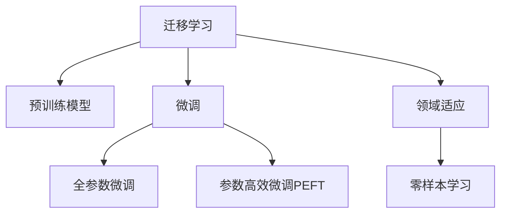

                 

## 1. 背景介绍

### 1.1 问题由来

在深度学习快速发展的大背景下，迁移学习（Transfer Learning）逐渐成为重要的研究课题。相较于从头训练模型，迁移学习利用已训练模型的知识，能够快速、高效地实现模型在不同任务之间的知识迁移，达到省时间、省数据、省计算资源的目的。迁移学习广泛应用于计算机视觉、自然语言处理（NLP）、语音识别等诸多领域，为人工智能技术的应用提供了新思路。

### 1.2 问题核心关键点

迁移学习的核心在于如何将预训练模型的知识迁移到新任务上。具体而言，需要满足以下几个条件：

- 源任务与目标任务需具有一定程度的相似性。
- 预训练模型的知识应该具有通用性，能够在新任务中得到良好的泛化。
- 新任务应具备较少的标注数据，利用迁移学习的优势。

迁移学习广泛应用于以下场景：
- 目标任务数据稀疏。
- 训练大规模深度模型成本高昂。
- 目标任务数据复杂，需要领域知识。

### 1.3 问题研究意义

迁移学习的核心在于将已有知识进行迁移应用，既能提升模型在新任务上的性能，又能缩短模型训练周期，降低训练成本。迁移学习能够帮助模型更快适应新环境，加速AI技术在各领域的落地。

迁移学习的应用场景包括：
- 计算机视觉中的图像分类、目标检测、人脸识别。
- 自然语言处理中的文本分类、语言建模、问答系统。
- 语音识别中的语音转文字、语音情感分析、语音识别。

通过迁移学习，可以大大提升模型在新任务上的性能，缩短模型训练周期，降低训练成本。因此，迁移学习在实际应用中具有重要的意义。

## 2. 核心概念与联系

### 2.1 核心概念概述

为了更好地理解迁移学习，本节将介绍几个密切相关的核心概念：

- 迁移学习（Transfer Learning）：利用已有模型的知识，在新任务上快速训练的策略，旨在提升模型性能，降低训练成本。
- 预训练模型（Pre-trained Model）：在大规模无标注数据上训练得到的模型，能够捕捉到通用特征，在新任务上具有较好的泛化能力。
- 微调（Fine-tuning）：在预训练模型的基础上，使用少量标注数据对模型进行调整，使模型在新任务上表现更优。
- 领域适应（Domain Adaptation）：在源域和目标域之间进行知识迁移，使模型在新环境下仍能保持高性能。
- 零样本学习（Zero-shot Learning）：在未见过的任务中，利用已有的知识进行推理和预测。

这些核心概念之间的逻辑关系可以通过以下Mermaid流程图来展示：



这个流程图展示迁移学习的核心概念及其之间的关系：

1. 迁移学习通过预训练模型获得通用特征。
2. 微调在预训练模型的基础上进行，提升模型在新任务上的性能。
3. 参数高效微调减少参数更新，提高微调效率。
4. 领域适应在源域和目标域之间进行知识迁移。
5. 零样本学习在未见过的任务中利用已有知识进行推理。

这些核心概念共同构成了迁移学习的学习和应用框架，使其能够在新任务上快速高效地提升模型性能。通过理解这些核心概念，我们可以更好地把握迁移学习的精髓。

## 3. 核心算法原理 & 具体操作步骤
### 3.1 算法原理概述

迁移学习的核心思想是利用已有模型的知识，在新任务上快速训练。具体来说，迁移学习通常包含以下几个步骤：

1. 预训练阶段：在大规模无标注数据上训练预训练模型，学习通用特征。
2. 微调阶段：使用少量标注数据对预训练模型进行调整，适应新任务。
3. 参数高效微调：减少参数更新，提高微调效率。
4. 领域适应：在源域和目标域之间进行知识迁移。
5. 零样本学习：利用已有知识进行推理。

迁移学习在计算机视觉、自然语言处理等领域的成功应用，得益于预训练模型的通用特征和高泛化能力。预训练模型通常在图像、文本等大规模无标注数据上进行训练，学习到通用的特征表示。这些特征表示能够在新任务上得到良好的泛化。

### 3.2 算法步骤详解

以下是对迁移学习各个步骤的详细介绍：

#### 步骤1: 准备预训练模型和数据集

1. 选择适合的预训练模型。常用的预训练模型包括VGG、ResNet、BERT等。
2. 准备目标任务的标注数据集。标注数据集应包含目标任务的类别及其对应的标签。
3. 数据集划分：将数据集划分为训练集、验证集和测试集。

#### 步骤2: 微调模型

1. 加载预训练模型。
2. 冻结预训练模型的部分或全部参数。
3. 在训练集上使用少量标注数据进行微调。
4. 在验证集上评估微调后的模型性能。
5. 在测试集上测试微调后的模型性能。

#### 步骤3: 参数高效微调

1. 仅微调预训练模型的顶层。
2. 使用 Adapter 等参数高效微调技术，只更新部分参数。
3. 使用 Online-to-Offline (O2O) 技术，训练过程中冻结底层参数，仅微调顶层参数。

#### 步骤4: 领域适应

1. 收集源域和目标域的标注数据。
2. 在源域数据上训练预训练模型。
3. 在目标域数据上微调预训练模型。
4. 评估领域适应后的模型性能。

#### 步骤5: 零样本学习

1. 收集目标任务的少量示例。
2. 利用已有知识进行推理。
3. 评估零样本学习的准确率。

### 3.3 算法优缺点

迁移学习具有以下优点：

1. 减少数据需求：利用已有模型的知识，在少量标注数据上进行微调。
2. 缩短训练周期：已有模型作为初始化参数，加快模型收敛速度。
3. 提高泛化能力：预训练模型的通用特征，使得模型在新任务上具有较好的泛化能力。
4. 降低成本：减少从头训练模型的时间和计算资源消耗。

同时，迁移学习也存在一些缺点：

1. 模型微调效果受源任务与目标任务相似性影响。
2. 预训练模型可能存在领域偏见，影响迁移效果。
3. 零样本学习效果有限，依赖于已有知识的质量。
4. 领域适应可能存在数据不平衡问题，影响模型泛化能力。

尽管存在这些缺点，迁移学习在实际应用中依然具有重要的意义。通过合理选择预训练模型和微调策略，可以最大化迁移学习的效果。

### 3.4 算法应用领域

迁移学习在以下几个领域得到了广泛应用：

#### 计算机视觉

- 图像分类：将预训练的卷积神经网络模型迁移到新的图像分类任务上。
- 目标检测：在目标检测任务上进行微调，提高目标检测的准确率。
- 人脸识别：利用已有知识进行人脸识别，提高识别准确率。

#### 自然语言处理

- 文本分类：利用BERT等预训练模型进行文本分类，提升分类效果。
- 语言建模：将预训练模型应用于新的语言建模任务。
- 问答系统：将预训练模型应用于问答系统，提高问答效果。

#### 语音识别

- 语音转文字：利用预训练模型进行语音转文字，提升转换准确率。
- 语音情感分析：将预训练模型应用于语音情感分析任务。

除了以上领域外，迁移学习还在信息检索、推荐系统、医学图像处理等领域得到了应用。

## 4. 数学模型和公式 & 详细讲解  
### 4.1 数学模型构建

在迁移学习中，通常采用以下模型：

设 $M_{\theta}$ 为预训练模型，$N$ 为源域的标注数据，$T$ 为目标域的标注数据。假设源域的标注数据 $N=\{(x_i,y_i)\}_{i=1}^N$，目标域的标注数据 $T=\{(x_i',y_i')\}_{i=1}^T$。迁移学习的目标是最小化目标任务上的损失函数：

$$
\min_{\theta} \mathcal{L}_T(M_{\theta},T)
$$

其中 $\mathcal{L}_T$ 为目标任务上的损失函数，$M_{\theta}$ 为微调后的模型。

### 4.2 公式推导过程

以下以图像分类为例，推导迁移学习中的分类损失函数：

假设 $M_{\theta}$ 为卷积神经网络，$\text{softmax}(\cdot)$ 为softmax函数，$y_i$ 为样本的真实标签，$\hat{y}_i$ 为模型对样本 $x_i$ 的分类结果。则目标任务上的损失函数可以表示为：

$$
\mathcal{L}_T(M_{\theta},T) = \frac{1}{T} \sum_{i=1}^T \sum_{j=1}^C -y_i \log \hat{y}_{i,j}
$$

其中 $C$ 为分类数。

### 4.3 案例分析与讲解

在图像分类任务中，可以利用迁移学习将预训练的卷积神经网络模型迁移到新的图像分类任务上。具体步骤如下：

1. 加载预训练模型 $M_{\theta}$。
2. 冻结预训练模型的部分参数。
3. 在目标任务的数据集 $T$ 上进行微调，更新未冻结参数。
4. 在验证集上评估微调后的模型性能。
5. 在测试集上测试微调后的模型性能。

以利用VGG模型进行迁移学习为例，步骤如下：

1. 加载VGG模型，保留卷积层和池化层，只微调全连接层。
2. 在目标任务的数据集上，利用交叉熵损失函数进行微调。
3. 在验证集上评估微调后的模型性能，避免过拟合。
4. 在测试集上测试微调后的模型性能。

## 5. 项目实践：代码实例和详细解释说明
### 5.1 开发环境搭建

在进行迁移学习实践前，我们需要准备好开发环境。以下是使用Python进行TensorFlow开发的环境配置流程：

1. 安装Anaconda：从官网下载并安装Anaconda，用于创建独立的Python环境。

2. 创建并激活虚拟环境：
```bash
conda create -n tf-env python=3.8 
conda activate tf-env
```

3. 安装TensorFlow：根据CUDA版本，从官网获取对应的安装命令。例如：
```bash
conda install tensorflow -c conda-forge -c pytorch -c pypi
```

4. 安装各类工具包：
```bash
pip install numpy pandas scikit-learn matplotlib tqdm jupyter notebook ipython
```

完成上述步骤后，即可在`tf-env`环境中开始迁移学习实践。

### 5.2 源代码详细实现

这里我们以迁移学习进行图像分类为例，给出使用TensorFlow实现迁移学习的代码实现。

首先，定义图像分类任务的数据处理函数：

```python
import tensorflow as tf
from tensorflow.keras.preprocessing.image import ImageDataGenerator
from tensorflow.keras.applications.vgg16 import VGG16
from tensorflow.keras.layers import Dense, Flatten
from tensorflow.keras.models import Model

def load_data():
    train_datagen = ImageDataGenerator(rescale=1./255)
    test_datagen = ImageDataGenerator(rescale=1./255)

    train_generator = train_datagen.flow_from_directory(
        train_data_dir,
        target_size=(224, 224),
        batch_size=32,
        class_mode='categorical')
    
    test_generator = test_datagen.flow_from_directory(
        test_data_dir,
        target_size=(224, 224),
        batch_size=32,
        class_mode='categorical')

    return train_generator, test_generator
```

然后，定义迁移学习的模型：

```python
base_model = VGG16(weights='imagenet', include_top=False, input_shape=(224, 224, 3))
x = base_model.output
x = Flatten()(x)
x = Dense(256, activation='relu')(x)
predictions = Dense(10, activation='softmax')(x)
model = Model(inputs=base_model.input, outputs=predictions)
```

接着，定义迁移学习的训练函数：

```python
def train(model, train_generator, test_generator, epochs):
    model.compile(optimizer='adam', loss='categorical_crossentropy', metrics=['accuracy'])
    model.fit(train_generator, epochs=epochs, validation_data=test_generator)
```

最后，启动训练流程并在测试集上评估：

```python
train_generator, test_generator = load_data()
epochs = 10
train(model, train_generator, test_generator, epochs)
```

以上就是使用TensorFlow进行迁移学习的完整代码实现。可以看到，TensorFlow的高级API使得迁移学习的代码实现变得简洁高效。

### 5.3 代码解读与分析

让我们再详细解读一下关键代码的实现细节：

**load_data函数**：
- 定义训练和测试数据集的生成器，利用ImageDataGenerator进行数据增强。
- 加载VGG16模型，只保留卷积层和池化层，只微调全连接层。

**train函数**：
- 定义模型的优化器、损失函数和评估指标。
- 使用fit函数进行模型训练，并在测试集上进行评估。

**训练流程**：
- 加载数据集，定义模型，进行训练。
- 在每个epoch结束时，输出训练集和验证集上的损失和准确率。
- 训练完成后，输出测试集上的准确率。

可以看到，TensorFlow的高级API使得迁移学习的代码实现变得简洁高效。开发者可以将更多精力放在数据处理、模型改进等高层逻辑上，而不必过多关注底层的实现细节。

当然，工业级的系统实现还需考虑更多因素，如模型的保存和部署、超参数的自动搜索、更灵活的任务适配层等。但核心的迁移学习范式基本与此类似。

## 6. 实际应用场景
### 6.1 智能推荐系统

迁移学习在推荐系统中的应用非常广泛。推荐系统通常面临数据稀疏和模型复杂度高的问题。利用迁移学习，可以先将已有模型迁移到新的推荐任务上，然后在新任务上进行微调，提高模型的推荐效果。

在推荐系统中，可以利用迁移学习将预训练的神经网络模型迁移到新的推荐任务上。具体步骤如下：

1. 加载预训练模型，保留卷积层和全连接层。
2. 在推荐数据集上微调模型，更新未冻结参数。
3. 在验证集上评估微调后的模型性能。
4. 在测试集上测试微调后的模型性能。

以利用预训练的神经网络模型进行推荐系统为例，步骤如下：

1. 加载预训练的神经网络模型，保留卷积层和全连接层。
2. 在推荐数据集上，利用交叉熵损失函数进行微调。
3. 在验证集上评估微调后的模型性能，避免过拟合。
4. 在测试集上测试微调后的模型性能。

迁移学习能够利用已有模型的知识，提高推荐系统的性能和效率，解决数据稀疏问题。

### 6.2 医学影像分析

医学影像分析是医疗领域的重要应用场景。医学影像数据的标注通常需要大量专家时间，成本较高。利用迁移学习，可以先将已有模型迁移到新的医学影像任务上，然后在新任务上进行微调，提高模型的诊断效果。

在医学影像分析中，可以利用迁移学习将预训练的卷积神经网络模型迁移到新的医学影像任务上。具体步骤如下：

1. 加载预训练的卷积神经网络模型，保留卷积层和池化层。
2. 在医学影像数据集上微调模型，更新未冻结参数。
3. 在验证集上评估微调后的模型性能。
4. 在测试集上测试微调后的模型性能。

以利用预训练的卷积神经网络模型进行医学影像分析为例，步骤如下：

1. 加载预训练的卷积神经网络模型，保留卷积层和池化层。
2. 在医学影像数据集上，利用交叉熵损失函数进行微调。
3. 在验证集上评估微调后的模型性能，避免过拟合。
4. 在测试集上测试微调后的模型性能。

迁移学习能够利用已有模型的知识，提高医学影像分析的诊断效果，解决标注成本高的问题。

### 6.3 自动驾驶

自动驾驶系统需要处理复杂的视觉信息，利用迁移学习，可以先将已有模型迁移到新的视觉识别任务上，然后在新任务上进行微调，提高系统的识别效果。

在自动驾驶中，可以利用迁移学习将预训练的卷积神经网络模型迁移到新的视觉识别任务上。具体步骤如下：

1. 加载预训练的卷积神经网络模型，保留卷积层和池化层。
2. 在自动驾驶数据集上微调模型，更新未冻结参数。
3. 在验证集上评估微调后的模型性能。
4. 在测试集上测试微调后的模型性能。

以利用预训练的卷积神经网络模型进行自动驾驶为例，步骤如下：

1. 加载预训练的卷积神经网络模型，保留卷积层和池化层。
2. 在自动驾驶数据集上，利用交叉熵损失函数进行微调。
3. 在验证集上评估微调后的模型性能，避免过拟合。
4. 在测试集上测试微调后的模型性能。

迁移学习能够利用已有模型的知识，提高自动驾驶系统的识别效果，解决数据复杂度高的问题。

### 6.4 未来应用展望

随着迁移学习技术的发展，其在以下几个领域将有更广泛的应用：

1. 自然语言处理：迁移学习在文本分类、情感分析、机器翻译等领域的应用越来越广泛。利用迁移学习，可以在少量标注数据上进行微调，提高模型的性能。

2. 计算机视觉：迁移学习在图像分类、目标检测、人脸识别等领域的应用越来越广泛。利用迁移学习，可以在少量标注数据上进行微调，提高模型的性能。

3. 语音识别：迁移学习在语音转文字、语音情感分析、语音识别等领域的应用越来越广泛。利用迁移学习，可以在少量标注数据上进行微调，提高模型的性能。

4. 医疗领域：迁移学习在医学影像分析、疾病诊断等领域的应用越来越广泛。利用迁移学习，可以在少量标注数据上进行微调，提高模型的性能。

5. 推荐系统：迁移学习在推荐系统中的应用越来越广泛。利用迁移学习，可以在少量标注数据上进行微调，提高推荐系统的推荐效果。

未来，迁移学习将在更多领域得到应用，为人工智能技术的发展提供新思路。随着预训练模型的不断发展，迁移学习的性能也将不断提升，推动AI技术在更多领域落地应用。

## 7. 工具和资源推荐
### 7.1 学习资源推荐

为了帮助开发者系统掌握迁移学习的理论基础和实践技巧，这里推荐一些优质的学习资源：

1. 《深度学习》（Deep Learning）书籍：Ian Goodfellow等人著作，全面介绍了深度学习的理论基础和实践技巧。
2. CS231n《卷积神经网络》课程：斯坦福大学开设的计算机视觉课程，内容涵盖深度学习、卷积神经网络、迁移学习等主题。
3. CS224N《自然语言处理》课程：斯坦福大学开设的自然语言处理课程，内容涵盖深度学习、迁移学习、预训练模型等主题。
4. 《迁移学习》（Transfer Learning）书籍：Alexey Kurakin等人著作，全面介绍了迁移学习的理论和实践。
5. 《TensorFlow官方文档》：TensorFlow官方文档，提供了丰富的迁移学习样例代码和教程，是学习迁移学习的必备资料。

通过对这些资源的学习实践，相信你一定能够快速掌握迁移学习的精髓，并用于解决实际的AI问题。
###  7.2 开发工具推荐

高效的开发离不开优秀的工具支持。以下是几款用于迁移学习开发的常用工具：

1. TensorFlow：由Google主导开发的开源深度学习框架，生产部署方便，适合大规模工程应用。提供了丰富的预训练模型和迁移学习样例。
2. PyTorch：基于Python的开源深度学习框架，灵活动态的计算图，适合快速迭代研究。提供了丰富的迁移学习样例和工具。
3. Fast.ai：由Jeremy Howard等人主导开发的深度学习框架，适合快速搭建和调试深度学习模型。提供了丰富的迁移学习样例和教程。
4. Weights & Biases：模型训练的实验跟踪工具，可以记录和可视化模型训练过程中的各项指标，方便对比和调优。与主流深度学习框架无缝集成。
5. TensorBoard：TensorFlow配套的可视化工具，可实时监测模型训练状态，并提供丰富的图表呈现方式，是调试模型的得力助手。

合理利用这些工具，可以显著提升迁移学习的开发效率，加快创新迭代的步伐。

### 7.3 相关论文推荐

迁移学习的研究源于学界的持续研究。以下是几篇奠基性的相关论文，推荐阅读：

1. Transfer Learning using Multiple Transfer Tasks with Feedback Networks：提出了多任务迁移学习的方法，利用反馈网络提高迁移效果。
2. Knowledge Transfer for Visual Object Classification：提出了知识转移的方法，利用预训练模型进行迁移学习。
3. Fine-tuning Pretrained Models for Zero-shot Image Classification：提出了零样本迁移学习的方法，利用预训练模型进行推理。
4. Attention is All You Need：提出了Transformer模型，引入了自注意力机制，极大提升了模型的表现。
5. Semantic Image Synthesis with Adversarial Networks：提出了生成对抗网络，利用迁移学习生成高质量的图像数据。

这些论文代表了大迁移学习技术的发展脉络。通过学习这些前沿成果，可以帮助研究者把握学科前进方向，激发更多的创新灵感。

## 8. 总结：未来发展趋势与挑战

### 8.1 总结

本文对迁移学习进行了全面系统的介绍。首先阐述了迁移学习的背景和意义，明确了迁移学习在提高模型性能、降低训练成本方面的独特价值。其次，从原理到实践，详细讲解了迁移学习的数学原理和关键步骤，给出了迁移学习任务开发的完整代码实例。同时，本文还广泛探讨了迁移学习在智能推荐系统、医学影像分析、自动驾驶等多个行业领域的应用前景，展示了迁移学习范式的巨大潜力。此外，本文精选了迁移学习的各类学习资源，力求为读者提供全方位的技术指引。

通过本文的系统梳理，可以看到，迁移学习技术正在成为AI领域的重要范式，极大地拓展了深度学习的应用边界，催生了更多的落地场景。迁移学习能够利用已有模型的知识，提高模型在新任务上的性能，降低训练成本。因此，迁移学习在实际应用中具有重要的意义。

### 8.2 未来发展趋势

展望未来，迁移学习的趋势将呈现以下几个方向：

1. 迁移学习范式的进一步拓展：迁移学习将在更多领域得到应用，如自然语言处理、计算机视觉、语音识别等。
2. 迁移学习模型的通用性增强：预训练模型将在更多领域进行迁移，提高模型的泛化能力。
3. 迁移学习模型的深度化：迁移学习模型将变得更加深度化，具备更强的表示能力和推理能力。
4. 迁移学习模型的自监督化：迁移学习模型将更多地利用自监督学习方法，提高迁移效果。
5. 迁移学习模型的可解释性增强：迁移学习模型将具备更强的可解释性，帮助开发者理解模型的决策过程。
6. 迁移学习模型的跨域性增强：迁移学习模型将在更多领域进行迁移，提高模型的泛化能力。

这些趋势展示了迁移学习技术的广阔前景。随着迁移学习技术的不断发展，将在更多领域得到应用，推动AI技术的发展。

### 8.3 面临的挑战

尽管迁移学习技术已经取得了不少进展，但在迈向更加智能化、普适化应用的过程中，它仍面临诸多挑战：

1. 迁移学习模型的泛化能力不足：迁移学习模型在特定领域上的泛化能力有限，需要更多的标注数据。
2. 迁移学习模型的计算成本高：迁移学习模型通常需要大量的计算资源，如何降低计算成本是未来研究的重点。
3. 迁移学习模型的可解释性不足：迁移学习模型的决策过程难以解释，如何提高模型的可解释性是未来研究的重点。
4. 迁移学习模型的鲁棒性不足：迁移学习模型在新环境下可能出现泛化能力下降的问题，如何提高模型的鲁棒性是未来研究的重点。
5. 迁移学习模型的隐私问题：迁移学习模型在数据迁移过程中可能存在隐私泄露问题，如何保护用户隐私是未来研究的重点。

尽管存在这些挑战，未来可以通过不断改进模型、算法和数据集等措施，逐步克服这些问题，推动迁移学习技术的进一步发展。

### 8.4 研究展望

未来迁移学习研究的方向将更加多样化，主要包括以下几个方面：

1. 自监督学习与迁移学习的结合：利用自监督学习方法提高迁移学习模型的泛化能力和鲁棒性。
2. 多任务迁移学习：通过多任务迁移学习，提高迁移学习模型的泛化能力和迁移效果。
3. 迁移学习模型的深度化：提高迁移学习模型的深度，增强模型的表示能力和推理能力。
4. 迁移学习模型的可解释性增强：利用可解释性方法，提高迁移学习模型的可解释性。
5. 迁移学习模型的跨域性增强：提高迁移学习模型的跨域迁移能力，拓展应用场景。

这些研究方向将推动迁移学习技术的进一步发展，为AI技术在更多领域的应用提供新思路。

## 9. 附录：常见问题与解答

**Q1：迁移学习是否适用于所有NLP任务？**

A: 迁移学习在大多数NLP任务上都能取得不错的效果，特别是对于数据量较小的任务。但对于一些特定领域的任务，如医学、法律等，仅仅依靠通用语料预训练的模型可能难以很好地适应。此时需要在特定领域语料上进一步预训练，再进行迁移学习，才能获得理想效果。

**Q2：迁移学习过程中如何选择合适的预训练模型？**

A: 选择合适的预训练模型是迁移学习成功的关键。常用的预训练模型包括BERT、GPT等。需要根据任务特点选择合适的预训练模型，并进行微调。例如，对于文本分类任务，可以选择BERT模型进行微调。

**Q3：迁移学习模型在新任务上的性能如何评估？**

A: 迁移学习模型在新任务上的性能通常通过验证集和测试集上的评估指标进行评估。常用的评估指标包括准确率、精确率、召回率、F1值等。可以通过在验证集上评估模型性能，避免过拟合。

**Q4：迁移学习模型在实际应用中需要注意哪些问题？**

A: 迁移学习模型在实际应用中需要注意以下几个问题：
1. 数据预处理：数据预处理是迁移学习的重要环节，需要根据任务特点进行数据增强、数据清洗等操作。
2. 超参数调优：需要根据任务特点进行超参数调优，如学习率、批量大小等。
3. 模型裁剪：需要根据任务特点进行模型裁剪，减小模型尺寸，提高推理速度。
4. 模型评估：需要根据任务特点进行模型评估，避免过拟合。

通过合理选择预训练模型和微调策略，可以最大化迁移学习的效果，解决数据稀疏、计算资源高等问题，提高模型在新任务上的性能。

---

作者：禅与计算机程序设计艺术 / Zen and the Art of Computer Programming

