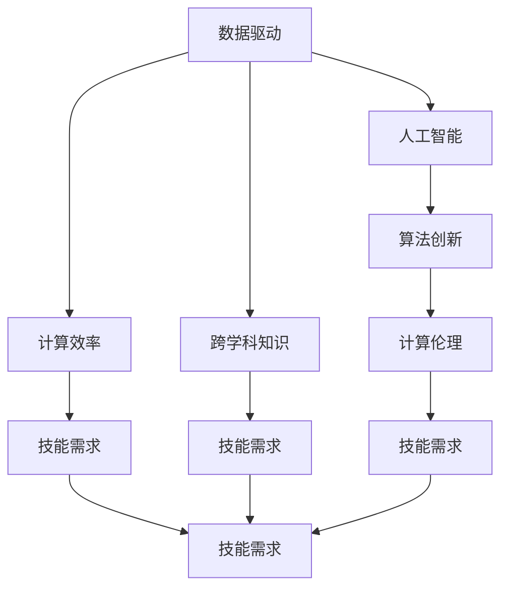

                 

# 迎接未来挑战：人类计算时代的技能需求

> 关键词：未来计算,人类计算,技能需求,数据驱动,人工智能,计算效率,人才培养,跨学科融合

## 1. 背景介绍

### 1.1 问题由来
随着科技的快速发展和社会的持续进步，计算已经成为人类生活和工作中不可或缺的重要部分。从传统的电子计算到新兴的量子计算，人类在探索计算的边界和潜力上迈出了坚实的步伐。然而，随着计算任务复杂性的提升，对于人类计算时代技能的需求也随之发生了巨大转变。如何在未来计算浪潮中保持竞争力，成为了当前教育、科技和产业界亟待解决的问题。

### 1.2 问题核心关键点
未来计算时代对人类技能需求的核心关键点主要体现在以下几个方面：
1. **数据驱动的决策制定**：现代社会的决策越发依赖于数据，如何在海量数据中提取有用的信息，并据此进行科学决策，成为未来技能的关键。
2. **人工智能与机器学习**：随着AI技术的日益成熟，机器学习算法在自动分析、预测、推荐等方面的能力不断增强，如何理解和应用这些技术，成为新技能的重要组成部分。
3. **计算效率的提升**：面对大数据和复杂系统，计算效率的提升成为了提高生产力、优化资源配置的关键。
4. **跨学科知识的融合**：未来计算任务往往涉及多个学科领域，如何有效融合不同领域的知识，构建综合性的解决方案，成为新的技能需求。
5. **算法的创新与优化**：随着计算任务的不断变化，创新和优化算法的能力成为推动技术进步的重要驱动力。
6. **计算伦理与安全**：随着计算技术的广泛应用，如何确保计算过程中的伦理和安全性，成为新的技能要求。

## 2. 核心概念与联系

### 2.1 核心概念概述

为了更好地理解未来计算时代技能需求的内涵，本文将介绍几个核心概念及其相互联系：

- **数据驱动的决策制定**：利用数据科学方法，通过数据收集、清洗、分析，支持决策制定。包括数据挖掘、统计分析、预测建模等技术。
- **人工智能与机器学习**：利用算法构建智能系统，通过学习数据规律，实现自动推理、决策和预测。包括监督学习、无监督学习、强化学习等方法。
- **计算效率的提升**：通过算法优化、硬件升级、并行计算等手段，提高计算速度和资源利用率。包括优化算法、并行计算框架、混合精度计算等技术。
- **跨学科知识的融合**：将不同学科的知识、方法和工具进行综合应用，构建综合性解决方案。包括系统设计、领域知识应用等技术。
- **算法的创新与优化**：通过新的算法设计、模型改进和并行计算等手段，提升计算性能和效果。包括算法设计、模型优化、并行计算等技术。
- **计算伦理与安全**：在计算过程中，确保数据隐私、保护个人隐私、确保计算结果的公正性和安全性。包括隐私保护、安全计算、伦理分析等技术。

这些核心概念之间的逻辑关系可以通过以下Mermaid流程图来展示：



这个流程图展示了大语言模型微调的关键技能需求及其相互关系：

1. **数据驱动**为决策提供了坚实基础，是人工智能和机器学习应用的前提。
2. **人工智能**和**机器学习**则是对数据的进一步处理和应用，提升决策的智能化水平。
3. **计算效率**是提升整体计算能力的关键，通过优化算法和硬件配置，加速计算任务。
4. **跨学科知识**的应用则拓展了技能边界，构建更全面的解决方案。
5. **算法创新**和**优化**是技术进步的驱动力，不断提升计算性能和效果。
6. **计算伦理与安全**是技术应用的必要保障，确保计算过程的公正性和安全性。

这些概念共同构成了未来计算时代技能需求的框架，指导着技能的发展方向和技术路径的选择。

## 3. 核心算法原理 & 具体操作步骤
### 3.1 算法原理概述

未来计算时代的技能需求，从根本上来说，是实现数据驱动、智能决策、高效计算、跨学科融合、算法创新与优化以及计算伦理与安全的系统解决方案。这些需求催生了对各类算法的深刻理解和应用。

- **数据驱动**：通过数据收集、清洗、分析和建模，支持决策制定。算法如数据挖掘、回归分析、分类算法等。
- **人工智能与机器学习**：利用算法构建智能系统，通过学习数据规律，实现自动推理、决策和预测。算法如监督学习、无监督学习、强化学习等。
- **计算效率**：通过算法优化、硬件升级、并行计算等手段，提高计算速度和资源利用率。算法如优化算法、并行计算框架、混合精度计算等。
- **跨学科知识融合**：将不同学科的知识、方法和工具进行综合应用，构建综合性解决方案。算法如系统设计、领域知识应用等。
- **算法创新与优化**：通过新的算法设计、模型改进和并行计算等手段，提升计算性能和效果。算法如神经网络、深度学习、优化算法等。
- **计算伦理与安全**：在计算过程中，确保数据隐私、保护个人隐私、确保计算结果的公正性和安全性。算法如隐私保护、安全计算、伦理分析等。

### 3.2 算法步骤详解

未来计算时代技能需求的核心算法步骤可以概括为以下几个主要阶段：

1. **数据准备与预处理**：收集、清洗和标注数据，为后续的算法应用打下基础。
2. **算法选择与模型训练**：根据任务需求，选择合适的算法和模型，使用训练数据进行模型训练。
3. **性能评估与优化**：对训练好的模型进行性能评估，根据评估结果进行模型优化。
4. **系统集成与部署**：将优化后的模型集成到实际系统中，并进行部署和维护。
5. **监控与迭代**：实时监控系统性能，根据反馈数据不断迭代和优化模型。

### 3.3 算法优缺点

未来计算时代技能需求的算法具有以下优点：
1. **数据驱动**：提高决策的科学性和精准性。
2. **人工智能与机器学习**：增强系统的智能化和自动化水平。
3. **计算效率**：提升计算速度和资源利用率，加速决策过程。
4. **跨学科知识融合**：构建更全面的解决方案，提高问题解决的广度和深度。
5. **算法创新与优化**：推动技术进步，提升计算性能和效果。
6. **计算伦理与安全**：确保计算过程的公正性和安全性。

同时，这些算法也存在一定的局限性：
1. **数据驱动**：依赖高质量的数据，数据获取和清洗过程复杂。
2. **人工智能与机器学习**：模型复杂，训练过程耗时，对计算资源要求高。
3. **计算效率**：算法优化和硬件升级成本高，需要持续的研发投入。
4. **跨学科知识融合**：不同学科的知识和方法可能存在冲突，需要综合协调。
5. **算法创新与优化**：新技术的引入和应用需要较高的技术储备和研发能力。
6. **计算伦理与安全**：技术复杂，需要专业的伦理和安全知识。

尽管存在这些局限性，但就目前而言，这些算法仍是实现未来计算时代技能需求的主要手段。未来相关研究的重点在于如何进一步降低算法的成本，提高算法的效率，同时兼顾算法的可解释性和伦理安全性等因素。

### 3.4 算法应用领域

未来计算时代技能需求的算法广泛应用于多个领域，包括但不限于：

- **智能决策支持**：在金融、医疗、城市管理等应用中，利用数据和算法进行智能决策，提高决策效率和准确性。
- **智能制造**：在工业生产中，通过数据分析和机器学习，优化生产流程，提高生产效率和产品质量。
- **智慧医疗**：在医疗健康领域，利用人工智能和机器学习技术，辅助医生诊断和治疗，提升医疗服务质量。
- **智能交通**：在交通管理中，通过数据分析和机器学习，优化交通流量，提升交通效率和安全。
- **智能推荐**：在电商、新闻、娱乐等领域，通过数据分析和机器学习，提供个性化推荐，提升用户体验。
- **环境监测与保护**：在环境保护中，通过数据分析和机器学习，监测环境变化，预测和防范环境风险。

## 4. 数学模型和公式 & 详细讲解
### 4.1 数学模型构建

未来计算时代技能需求的数学模型构建通常包括以下几个关键步骤：

1. **数据收集与预处理**：收集相关数据，进行清洗、标注和预处理，为数学模型构建提供数据基础。
2. **模型选择与设计**：根据任务需求，选择合适的数学模型，并进行模型设计和构建。
3. **参数估计与训练**：利用训练数据对模型参数进行估计和训练。
4. **性能评估与验证**：使用测试数据对训练好的模型进行性能评估和验证。
5. **模型优化与调整**：根据评估结果，对模型进行优化和调整，以提高模型的性能和泛化能力。

### 4.2 公式推导过程

以**线性回归**模型为例，介绍未来计算时代技能需求的数学模型构建和公式推导过程。

设训练数据集为 $(x_i,y_i)$，其中 $x_i \in \mathbb{R}^n$ 为特征向量，$y_i \in \mathbb{R}$ 为标签。目标为构建一个线性回归模型，使得模型输出尽可能接近真实标签。

定义线性回归模型的参数为 $\theta = (w,b)$，其中 $w \in \mathbb{R}^n$ 为权重向量，$b \in \mathbb{R}$ 为偏置。线性回归模型的预测公式为：

$$
\hat{y}_i = \theta^T x_i = w^T x_i + b
$$

目标是最小化预测误差，即均方误差（Mean Squared Error, MSE）损失函数：

$$
\mathcal{L}(\theta) = \frac{1}{2m} \sum_{i=1}^m (\hat{y}_i - y_i)^2
$$

其中 $m$ 为样本数量。

通过梯度下降算法，最小化损失函数：

$$
\theta \leftarrow \theta - \eta \nabla_{\theta} \mathcal{L}(\theta)
$$

其中 $\eta$ 为学习率。

最终，通过迭代优化，求解最优的 $\theta$，使得模型预测尽可能接近真实标签。

### 4.3 案例分析与讲解

考虑一个简单的电商推荐系统，通过用户行为数据进行个性化推荐。设训练数据集为 $(x_i,y_i)$，其中 $x_i$ 为用户的行为序列，$y_i$ 为用户对商品的评分。目标为构建一个线性回归模型，预测用户对新商品的评分。

首先，进行数据预处理，将行为序列转化为特征向量 $x_i$，将评分 $y_i$ 作为标签。然后，选择线性回归模型进行建模，使用梯度下降算法进行模型训练。

训练过程中，选择合适的损失函数和优化算法，如均方误差损失和Adam优化器，设置合适的学习率和迭代次数。在训练过程中，实时监控模型性能，根据验证集上的性能指标，进行模型参数的调整。最终，得到训练好的模型，可以用于新商品的评分预测。

## 5. 项目实践：代码实例和详细解释说明
### 5.1 开发环境搭建

在进行未来计算时代技能需求的算法实践前，我们需要准备好开发环境。以下是使用Python进行PyTorch开发的环境配置流程：

1. 安装Anaconda：从官网下载并安装Anaconda，用于创建独立的Python环境。

2. 创建并激活虚拟环境：
```bash
conda create -n pytorch-env python=3.8 
conda activate pytorch-env
```

3. 安装PyTorch：根据CUDA版本，从官网获取对应的安装命令。例如：
```bash
conda install pytorch torchvision torchaudio cudatoolkit=11.1 -c pytorch -c conda-forge
```

4. 安装各类工具包：
```bash
pip install numpy pandas scikit-learn matplotlib tqdm jupyter notebook ipython
```

完成上述步骤后，即可在`pytorch-env`环境中开始算法实践。

### 5.2 源代码详细实现

下面我们以线性回归模型为例，给出使用PyTorch进行算法实现的完整代码。

首先，定义线性回归模型的类：

```python
import torch
import torch.nn as nn
import torch.optim as optim

class LinearRegression(nn.Module):
    def __init__(self, input_dim):
        super(LinearRegression, self).__init__()
        self.linear = nn.Linear(input_dim, 1)

    def forward(self, x):
        return self.linear(x)

# 设置超参数
input_dim = 1
learning_rate = 0.01
epochs = 1000
batch_size = 16
```

然后，定义数据处理函数：

```python
import numpy as np
from sklearn.model_selection import train_test_split
from sklearn.datasets import make_regression

def generate_data():
    x, y = make_regression(n_samples=1000, n_features=1, noise=0.5, random_state=42)
    x = np.reshape(x, (-1, 1))
    return x, y

x, y = generate_data()
x_train, x_val, y_train, y_val = train_test_split(x, y, test_size=0.2, random_state=42)
```

接着，进行模型训练和评估：

```python
# 定义模型
model = LinearRegression(input_dim)

# 定义优化器和损失函数
optimizer = optim.SGD(model.parameters(), lr=learning_rate)
criterion = nn.MSELoss()

# 训练模型
for epoch in range(epochs):
    loss = 0
    for i in range(0, len(x_train), batch_size):
        x_batch = x_train[i:i+batch_size]
        y_batch = y_train[i:i+batch_size]
        optimizer.zero_grad()
        outputs = model(x_batch)
        loss += criterion(outputs, y_batch).item()
        loss.backward()
        optimizer.step()
    if (epoch + 1) % 100 == 0:
        print(f'Epoch {epoch + 1}, loss: {loss / len(x_train)}')

# 评估模型
model.eval()
with torch.no_grad():
    y_pred = model(x_val)
    loss = criterion(y_pred, y_val).item()
    print(f'Validation loss: {loss}')
```

以上就是使用PyTorch进行线性回归模型训练的完整代码实现。可以看到，通过PyTorch，我们可以方便地构建和训练线性回归模型，并对模型进行评估和调整。

### 5.3 代码解读与分析

让我们再详细解读一下关键代码的实现细节：

**LinearRegression类**：
- `__init__`方法：初始化权重向量 $w$ 和偏置 $b$。
- `forward`方法：定义模型前向传播过程，输出预测值。

**数据生成函数generate_data**：
- 使用scikit-learn生成一个线性回归数据集。
- 将特征 $x$ 和标签 $y$ 划分为训练集和验证集。

**模型训练和评估**：
- 在每个epoch中，对训练集进行迭代训练，更新模型参数。
- 使用验证集评估模型性能，输出每个epoch的损失值。

在实际应用中，这些代码仅为线性回归模型的简单示例。实际应用中，可能需要更复杂的模型和更高级的优化算法，但基本的思路和方法与本文介绍的类似。

## 6. 实际应用场景
### 6.1 智能决策支持

在金融领域，利用数据分析和机器学习技术，构建智能决策支持系统，可以大幅提升决策效率和准确性。例如，通过分析历史交易数据，构建市场预测模型，辅助投资决策。

在医疗领域，利用电子病历数据，构建疾病预测和诊断模型，提高诊疗水平和医疗服务质量。例如，通过分析患者的历史病历和遗传信息，预测疾病的发生风险，指导个性化治疗方案。

### 6.2 智能制造

在工业生产中，通过数据分析和机器学习，优化生产流程，提高生产效率和产品质量。例如，通过分析生产设备的运行数据，预测设备故障，优化维护计划。

在物流管理中，利用数据分析和机器学习，优化货物运输路线，减少运输成本和提高物流效率。例如，通过分析历史运输数据，构建路线优化模型，生成最优运输方案。

### 6.3 智慧医疗

在医疗健康领域，利用人工智能和机器学习技术，辅助医生诊断和治疗，提升医疗服务质量。例如，通过分析医学影像数据，构建疾病诊断模型，提高诊断准确率和效率。

在健康管理中，利用数据分析和机器学习，监测患者健康状况，预测疾病发展趋势，指导个性化健康管理。例如，通过分析患者的生理指标和行为数据，预测健康风险，制定健康管理方案。

### 6.4 智能推荐

在电商领域，通过数据分析和机器学习，提供个性化推荐，提升用户体验。例如，通过分析用户的浏览和购买历史，构建推荐模型，生成个性化商品推荐。

在内容推荐中，利用数据分析和机器学习，推荐新闻、视频、音乐等娱乐内容，提高用户粘性和平台活跃度。例如，通过分析用户的行为数据，构建推荐模型，生成个性化内容推荐。

### 6.5 智能交通

在交通管理中，通过数据分析和机器学习，优化交通流量，提升交通效率和安全。例如，通过分析交通数据，构建交通流量预测模型，优化信号灯控制策略。

在智能驾驶中，利用数据分析和机器学习，辅助车辆导航和驾驶决策，提高行车安全。例如，通过分析路况和车辆行为数据，构建智能驾驶模型，生成最优驾驶策略。

## 7. 工具和资源推荐
### 7.1 学习资源推荐

为了帮助开发者系统掌握未来计算时代技能需求的技能，这里推荐一些优质的学习资源：

1. 《深度学习》系列书籍：由Ian Goodfellow等作者撰写，全面介绍了深度学习的基本概念和应用。
2. 《数据科学导论》课程：Coursera开设的入门级数据科学课程，涵盖数据预处理、机器学习、统计分析等内容。
3. 《机器学习实战》书籍：Peter Harrington等作者撰写，通过实战项目讲解机器学习算法。
4. Kaggle竞赛平台：一个数据科学竞赛平台，通过参与竞赛，提升数据科学和机器学习技能。
5. Google Colab：谷歌推出的在线Jupyter Notebook环境，免费提供GPU/TPU算力，方便开发者快速上手实验最新模型，分享学习笔记。

通过对这些资源的学习实践，相信你一定能够快速掌握未来计算时代技能需求的精髓，并用于解决实际的计算问题。

### 7.2 开发工具推荐

高效的开发离不开优秀的工具支持。以下是几款用于未来计算时代技能需求的算法开发常用的工具：

1. PyTorch：基于Python的开源深度学习框架，灵活动态的计算图，适合快速迭代研究。大部分未来计算时代技能需求的算法都有PyTorch版本的实现。
2. TensorFlow：由Google主导开发的开源深度学习框架，生产部署方便，适合大规模工程应用。同样有丰富的未来计算时代技能需求的算法资源。
3. Jupyter Notebook：一个交互式编程环境，支持Python、R等多种编程语言，适合数据分析和算法开发。
4. Weights & Biases：模型训练的实验跟踪工具，可以记录和可视化模型训练过程中的各项指标，方便对比和调优。与主流深度学习框架无缝集成。
5. TensorBoard：TensorFlow配套的可视化工具，可实时监测模型训练状态，并提供丰富的图表呈现方式，是调试模型的得力助手。

合理利用这些工具，可以显著提升未来计算时代技能需求的算法开发效率，加快创新迭代的步伐。

### 7.3 相关论文推荐

未来计算时代技能需求的算法发展源于学界的持续研究。以下是几篇奠基性的相关论文，推荐阅读：

1. "A Survey on Deep Learning in Industry"：一篇综述论文，介绍了深度学习在多个行业的应用。
2. "Machine Learning Yearning"：Andrew Ng撰写的关于机器学习工程实践的书籍，涵盖数据预处理、模型训练、性能评估等内容。
3. "Introduction to Statistical Learning"：Gareth James等作者撰写，全面介绍了统计学习方法，包括回归、分类、聚类等。
4. "Deep Reinforcement Learning for Robotic Base Localization"：一篇深度强化学习论文，展示了强化学习在机器人定位中的应用。
5. "An Overview of Deep Learning-based Biomedical Image Analysis"：一篇综述论文，介绍了深度学习在医学影像分析中的应用。

这些论文代表了大计算时代技能需求的发展脉络。通过学习这些前沿成果，可以帮助研究者把握学科前进方向，激发更多的创新灵感。

## 8. 总结：未来发展趋势与挑战
### 8.1 总结

本文对未来计算时代技能需求的算法进行了全面系统的介绍。首先阐述了未来计算时代技能需求的背景和意义，明确了技能需求的核心目标和实现途径。其次，从原理到实践，详细讲解了未来计算时代技能需求的算法构建和实现步骤，给出了算法开发的具体代码实例。同时，本文还广泛探讨了未来计算时代技能需求在智能决策支持、智能制造、智慧医疗、智能推荐、智能交通等领域的实际应用，展示了未来计算时代技能需求的广泛前景。此外，本文精选了未来计算时代技能需求的各类学习资源，力求为开发者提供全方位的技术指引。

通过本文的系统梳理，可以看到，未来计算时代技能需求的算法在数据驱动、智能决策、高效计算、跨学科融合、算法创新与优化以及计算伦理与安全等方面展现了巨大的潜力。这些算法的应用不仅能够提升各行各业的效率和效果，还能够推动技术的持续进步和创新。

### 8.2 未来发展趋势

展望未来，未来计算时代技能需求的算法将呈现以下几个发展趋势：

1. **数据驱动决策的普及**：随着数据收集和处理技术的进步，数据驱动决策将在更多领域得到应用，成为解决复杂问题的核心手段。
2. **人工智能与机器学习的深入发展**：人工智能和机器学习算法将不断进步，提升决策的智能化水平，实现更加精准和自动化的决策。
3. **计算效率的提升**：算法优化、硬件升级和并行计算技术将进一步提升计算效率，推动计算任务的快速处理。
4. **跨学科知识融合的加强**：跨学科知识的应用将更加广泛，构建综合性的解决方案，提高问题解决的广度和深度。
5. **算法创新与优化的持续推进**：新技术的不断涌现和应用，将持续推动算法创新和优化，提升计算性能和效果。
6. **计算伦理与安全的重视**：计算伦理与安全将得到更多重视，确保计算过程的公正性和安全性，保护个人隐私和数据安全。

以上趋势凸显了未来计算时代技能需求的算法的广阔前景。这些方向的探索发展，必将进一步提升计算能力，推动计算任务的智能化、自动化和协同化。

### 8.3 面临的挑战

尽管未来计算时代技能需求的算法已经取得了显著进展，但在实现过程中仍面临诸多挑战：

1. **数据质量问题**：高质量的数据获取和处理是未来计算时代技能需求的算法实现的前提。如何保证数据的完整性、准确性和代表性，是一个重要挑战。
2. **计算资源瓶颈**：未来计算时代技能需求的算法往往需要大量的计算资源，如何高效利用计算资源，是一个技术难题。
3. **算法复杂性**：未来计算时代技能需求的算法通常比较复杂，需要专业的知识和技能，如何降低算法的复杂性，是一个重要的研究方向。
4. **模型可解释性**：未来计算时代技能需求的算法往往被视为"黑盒"系统，如何提高模型的可解释性，是一个亟待解决的问题。
5. **隐私保护与安全**：未来计算时代技能需求的算法涉及大量敏感数据，如何保护数据隐私和安全，是一个重要的伦理问题。
6. **跨学科融合难度**：不同学科的知识和方法可能存在冲突，如何有效融合不同学科的知识，是一个技术难题。

这些挑战需要我们持续探索和突破，才能实现未来计算时代技能需求的算法的广泛应用和高效实现。

### 8.4 研究展望

面向未来，未来计算时代技能需求的算法研究需要在以下几个方面寻求新的突破：

1. **数据预处理与清洗技术**：开发更高效的数据预处理与清洗技术，保证数据质量，降低数据处理成本。
2. **高效计算框架**：开发更高效、更灵活的计算框架，提升计算效率，降低计算成本。
3. **模型可解释性提升**：研究更易解释的模型和算法，提高模型的可解释性和可理解性。
4. **隐私保护与安全技术**：开发更强大的隐私保护和安全技术，保护数据隐私和安全。
5. **跨学科知识融合方法**：研究更有效的跨学科知识融合方法，构建综合性解决方案。
6. **算法创新与优化**：开发更高效、更通用的算法，提升算法的性能和效果。

这些研究方向的探索，必将引领未来计算时代技能需求的算法的技术进步和应用拓展，为构建智能、高效、安全的计算系统铺平道路。面向未来，只有勇于创新、敢于突破，才能实现计算技术的持续进步和广泛应用。

## 9. 附录：常见问题与解答

**Q1：未来计算时代技能需求的核心关键点是什么？**

A: 未来计算时代技能需求的核心关键点主要包括数据驱动决策、人工智能与机器学习、计算效率提升、跨学科知识融合、算法创新与优化以及计算伦理与安全。这些关键点共同构成了未来计算时代技能需求的框架，指导着技能的发展方向和技术路径的选择。

**Q2：未来计算时代技能需求的算法优缺点是什么？**

A: 未来计算时代技能需求的算法具有数据驱动决策科学性强、人工智能与机器学习智能化高、计算效率提升显著、跨学科知识融合广泛、算法创新与优化持续推进以及计算伦理与安全重视等优点。同时，算法也存在数据质量问题、计算资源瓶颈、算法复杂性高、模型可解释性差、隐私保护与安全风险以及跨学科融合难度等缺点。

**Q3：未来计算时代技能需求的算法应用领域有哪些？**

A: 未来计算时代技能需求的算法广泛应用于智能决策支持、智能制造、智慧医疗、智能推荐、智能交通等多个领域。这些算法在提升效率、优化决策、提高服务质量等方面展现了巨大的潜力。

**Q4：未来计算时代技能需求的算法面临哪些挑战？**

A: 未来计算时代技能需求的算法面临数据质量问题、计算资源瓶颈、算法复杂性高、模型可解释性差、隐私保护与安全风险以及跨学科融合难度等挑战。这些挑战需要我们持续探索和突破，才能实现算法的广泛应用和高效实现。

**Q5：未来计算时代技能需求的算法未来发展趋势是什么？**

A: 未来计算时代技能需求的算法将呈现数据驱动决策普及、人工智能与机器学习深入发展、计算效率提升、跨学科知识融合加强、算法创新与优化持续推进以及计算伦理与安全重视等发展趋势。这些趋势将推动未来计算时代技能需求的算法在更多领域得到应用，提升计算任务的智能化、自动化和协同化水平。

---

作者：禅与计算机程序设计艺术 / Zen and the Art of Computer Programming

