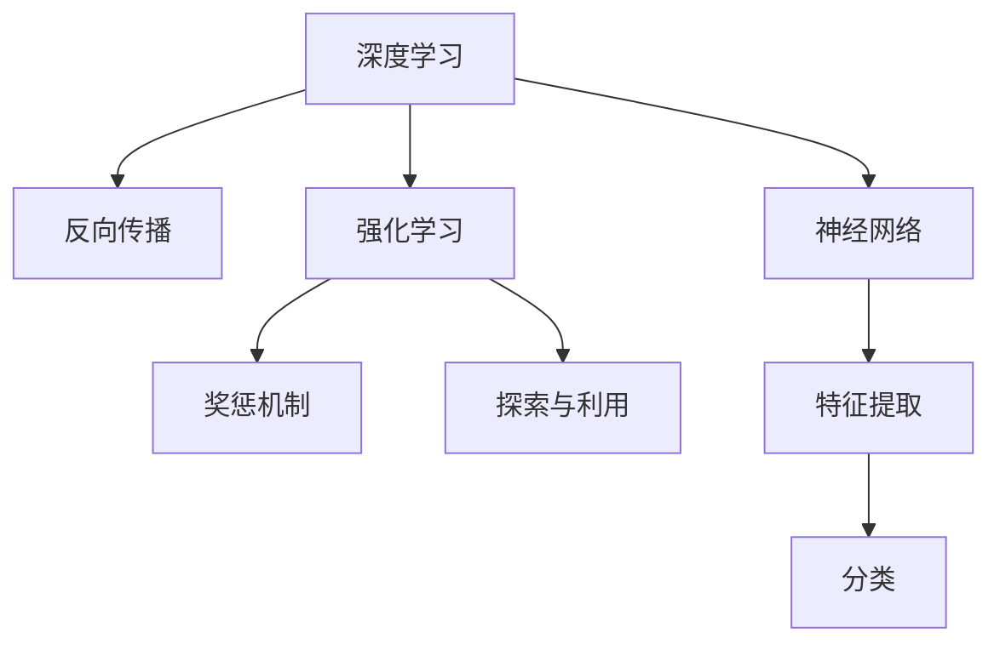

                 

## 1. 背景介绍

### 1.1 问题由来

在人工智能领域，连接主义（Connectionism）与行为主义（Behaviorism）是两大基本学派。连接主义主张通过模拟神经网络来实现机器学习，强调神经元之间的连接权重学习；行为主义则注重通过外部刺激与响应之间的关系来训练模型，强调奖惩机制。两者在方法论上存在显著差异，但都致力于实现智能机器的构建。

当前，深度学习技术迅猛发展，基于连接主义的神经网络方法已成为主流。然而，行为主义的相关技术同样具有重要意义，特别是在强化学习和决策理论等方向。本文将探讨连接主义与行为主义之间的挑战，希望通过理解两者的优劣，找到可能的融合途径。

### 1.2 问题核心关键点

1. **深度学习与强化学习**：两者虽然在底层机制上有所不同，但在目标上均旨在使机器学习到复杂的决策和行为策略。
2. **神经网络与行为模型**：两者均需要设计复杂的网络结构和训练算法，但侧重点和实现方式不同。
3. **模型训练与行为模拟**：深度学习模型通过反向传播算法进行训练，而行为主义模型则通过行为模拟与奖惩反馈来优化策略。
4. **数据依赖与模拟真实世界**：深度学习模型需要大量标注数据，而行为主义模型更强调模拟真实世界的复杂互动。

## 2. 核心概念与联系

### 2.1 核心概念概述

为更好地理解连接主义与行为主义之间的挑战，本节将介绍几个密切相关的核心概念：

- **深度学习（Deep Learning）**：一种基于神经网络结构的机器学习方法，通过多层非线性变换对输入数据进行特征提取和分类。
- **强化学习（Reinforcement Learning）**：通过试错学习，在特定环境中通过与环境的互动，学习最优策略以实现特定目标。
- **反向传播算法（Backpropagation）**：一种用于神经网络训练的算法，通过链式法则反向传播误差信号，更新模型参数。
- **奖惩机制（Reward Mechanism）**：在强化学习中，通过设计奖惩规则，引导模型学习到正确的决策策略。
- **探索与利用（Exploitation vs. Exploration）**：在强化学习中，如何在已有知识与新知识之间找到平衡，是一个关键问题。

- **连接主义与行为主义**：连接主义强调通过模拟神经网络来实现机器学习，行为主义则注重通过外部刺激与响应之间的关系来训练模型。

这些核心概念之间的逻辑关系可以通过以下Mermaid流程图来展示：



这个流程图展示了两大学派的基本框架及其相互联系：

1. 深度学习通过神经网络结构进行特征提取和分类，利用反向传播算法进行训练。
2. 强化学习通过试错学习与环境互动，设计奖惩机制来引导策略优化。
3. 在实际应用中，两者常需要相互借鉴，实现协同工作。

## 3. 核心算法原理 & 具体操作步骤
### 3.1 算法原理概述

连接主义与行为主义方法在算法原理上有显著差异，但也存在一定的重叠。以下将分别介绍两者的核心算法原理。

**深度学习**：

深度学习的核心在于通过多层神经网络对输入数据进行特征提取和分类。典型算法包括卷积神经网络（CNN）、循环神经网络（RNN）、长短期记忆网络（LSTM）等。

- **前向传播**：将输入数据通过网络层级进行变换，得到最终输出。
- **反向传播**：通过计算输出误差，反向传播误差信号，更新网络权重。

**强化学习**：

强化学习的核心在于通过试错学习，在特定环境中通过与环境的互动，学习最优策略以实现特定目标。典型算法包括Q-learning、SARSA、Deep Q-Network（DQN）等。

- **状态-动作-奖励（SAR）**：环境由当前状态决定可能的动作，动作会影响环境状态，产生奖励。
- **策略优化**：通过与环境的互动，不断调整策略，最大化累积奖励。

### 3.2 算法步骤详解

**深度学习步骤**：

1. 数据准备：收集并预处理训练数据。
2. 模型定义：设计神经网络结构，选择合适的损失函数。
3. 训练过程：前向传播计算损失，反向传播更新权重。
4. 验证与调参：在验证集上评估模型性能，调整超参数。
5. 测试与部署：在测试集上评估模型，部署到实际应用中。

**强化学习步骤**：

1. 环境定义：定义环境状态和动作空间。
2. 策略定义：设计策略函数，选择合适的算法。
3. 试错学习：通过与环境互动，收集经验和数据。
4. 策略优化：根据累积奖励，更新策略参数。
5. 策略评估：在测试环境中评估策略性能。

### 3.3 算法优缺点

**深度学习的优缺点**：

- **优点**：
  - **表达能力强**：多层非线性变换可处理复杂的数据结构。
  - **自动特征提取**：通过训练学习到数据的高级特征。
  - **泛化能力强**：在大量标注数据上训练得到良好的泛化性能。

- **缺点**：
  - **数据依赖**：需要大量标注数据，难以处理小样本和低频数据。
  - **黑盒模型**：难以解释模型的内部决策过程。
  - **过拟合风险**：在大规模数据上训练时容易过拟合。

**强化学习的优缺点**：

- **优点**：
  - **适应性强**：可在复杂和不确定环境中学习策略。
  - **实时性高**：可实时调整策略，优化决策。
  - **鲁棒性好**：对环境变化的适应能力强。

- **缺点**：
  - **策略学习慢**：需要大量的试错和经验积累。
  - **样本效率低**：在每个环境中需要大量样本才能学习到最优策略。
  - **策略泛化难**：难以泛化到未见过的环境中。

### 3.4 算法应用领域

**深度学习应用**：

深度学习在图像识别、语音识别、自然语言处理等领域广泛应用。典型案例包括：

- 图像分类：使用CNN对图像进行分类。
- 语音识别：使用RNN进行语音转文字。
- 机器翻译：使用LSTM进行文本翻译。

**强化学习应用**：

强化学习在游戏、机器人控制、自动驾驶等领域取得成功。典型案例包括：

- 自动驾驶：通过强化学习实现车辆避障和路径规划。
- 机器人控制：通过强化学习优化机器人动作策略。
- 游戏AI：通过强化学习使游戏AI更智能。

## 4. 数学模型和公式 & 详细讲解
### 4.1 数学模型构建

以下是深度学习和强化学习的数学模型构建。

**深度学习模型**：

- **输入层**：输入向量 $x \in \mathbb{R}^n$。
- **隐藏层**：由 $L$ 个全连接层构成，每个层输出维度为 $d_1, d_2, ..., d_L$。
- **输出层**：输出向量 $y \in \mathbb{R}^m$。

模型参数包括所有权重和偏置，记为 $\theta$。

**强化学习模型**：

- **状态**：环境状态 $s \in \mathcal{S}$。
- **动作**：可采取的行动 $a \in \mathcal{A}$。
- **奖励**：采取行动后获得的奖励 $r \in \mathbb{R}$。

策略 $\pi(a|s)$ 表示在状态 $s$ 下采取动作 $a$ 的概率分布。

### 4.2 公式推导过程

**深度学习公式推导**：

1. **前向传播**：
   $$
   h_1 = f(W_1 x + b_1)
   $$
   $$
   h_i = f(W_i h_{i-1} + b_i)
   $$
   $$
   y = W_L h_L + b_L
   $$

2. **损失函数**：
   $$
   L(y, \hat{y}) = \frac{1}{2} ||y - \hat{y}||^2
   $$

3. **反向传播**：
   $$
   \frac{\partial L}{\partial W_L} = \frac{\partial L}{\partial y} \frac{\partial y}{\partial h_L} \frac{\partial h_L}{\partial W_L}
   $$
   $$
   \frac{\partial L}{\partial W_i} = \frac{\partial L}{\partial h_i} \frac{\partial h_i}{\partial h_{i-1}} \frac{\partial h_{i-1}}{\partial W_i}
   $$

4. **参数更新**：
   $$
   \theta_{i-1} \leftarrow \theta_{i-1} - \eta \frac{\partial L}{\partial \theta_{i-1}}
   $$

**强化学习公式推导**：

1. **策略梯度**：
   $$
   \nabla_{\theta} \mathbb{E}_{s \sim P}[Q_{\theta}(s, \pi_{\theta}(s))] = \mathbb{E}_{s \sim P}[\pi_{\theta}(a|s) \nabla_{\theta}Q_{\theta}(s, a)]
   $$

2. **Q-learning**：
   $$
   Q(s, a) \leftarrow Q(s, a) + \alpha (r + \gamma \max_{a'} Q(s', a') - Q(s, a))
   $$

3. **策略优化**：
   $$
   \pi_{\theta}(a|s) \propto \exp(Q_{\theta}(s, a))
   $$

### 4.3 案例分析与讲解

**案例1：图像分类**

假设有一个简单的二分类问题，输入为图像 $x \in \mathbb{R}^{28 \times 28}$，输出为类别 $y \in \{0, 1\}$。

- **深度学习**：使用CNN提取图像特征，通过Softmax层进行分类。损失函数为交叉熵，反向传播更新权重。
- **强化学习**：将图像处理为状态，动作为选择类别，奖励为正确分类得分。通过Q-learning优化策略。

**案例2：自动驾驶**

假设自动驾驶系统在城市道路上行驶，环境状态包括当前位置、车速、周围车辆信息等。

- **深度学习**：使用CNN对道路图像进行特征提取，通过LSTM处理时间序列数据，输出驾驶策略。
- **强化学习**：定义状态、动作和奖励，通过DQN优化策略，实现避障和路径规划。

## 5. 项目实践：代码实例和详细解释说明
### 5.1 开发环境搭建

在进行深度学习和强化学习项目实践前，我们需要准备好开发环境。以下是使用Python进行TensorFlow和PyTorch开发的环境配置流程：

1. 安装Anaconda：从官网下载并安装Anaconda，用于创建独立的Python环境。

2. 创建并激活虚拟环境：
```bash
conda create -n tf-env python=3.8
conda activate tf-env
```

3. 安装TensorFlow和PyTorch：
```bash
pip install tensorflow torch torchvision torchaudio
```

4. 安装TensorBoard和Weights & Biases：
```bash
pip install tensorboard wandb
```

完成上述步骤后，即可在`tf-env`环境中开始项目实践。

### 5.2 源代码详细实现

下面我们以深度学习图像分类和强化学习自动驾驶为例，给出TensorFlow和PyTorch的代码实现。

**深度学习图像分类**：

```python
import tensorflow as tf
from tensorflow.keras import layers

# 定义模型
model = tf.keras.Sequential([
    layers.Conv2D(32, (3, 3), activation='relu', input_shape=(28, 28, 1)),
    layers.MaxPooling2D((2, 2)),
    layers.Flatten(),
    layers.Dense(10, activation='softmax')
])

# 编译模型
model.compile(optimizer='adam', loss='sparse_categorical_crossentropy', metrics=['accuracy'])

# 训练模型
model.fit(train_images, train_labels, epochs=10, validation_data=(test_images, test_labels))

# 评估模型
test_loss, test_acc = model.evaluate(test_images, test_labels)
print('Test accuracy:', test_acc)
```

**强化学习自动驾驶**：

```python
import gym
import numpy as np

# 定义环境
env = gym.make('CartPole-v0')

# 定义策略
def strategy(s):
    if np.abs(s[1]) < 0.2:
        return 0  # 向左
    else:
        return 1  # 向右

# 运行策略
for episode in range(100):
    state = env.reset()
    done = False
    while not done:
        action = strategy(state)
        next_state, reward, done, info = env.step(action)
        state = next_state
        env.render()
```

### 5.3 代码解读与分析

让我们再详细解读一下关键代码的实现细节：

**深度学习图像分类**：

1. 使用`tf.keras.Sequential`定义模型，包含卷积层、池化层和全连接层。
2. 编译模型，指定优化器和损失函数。
3. 使用`fit`函数训练模型，指定训练集和验证集。
4. 使用`evaluate`函数评估模型，输出测试集上的准确率。

**强化学习自动驾驶**：

1. 使用`gym.make`创建环境，这里以CartPole-v0作为示例。
2. 定义策略函数`strategy`，根据当前状态决定向左或向右动作。
3. 在每个回合中，使用策略函数选择动作，与环境互动，直到回合结束。
4. 使用`env.render`展示每个回合的进展。

## 6. 实际应用场景
### 6.1 智能推荐系统

智能推荐系统需要处理海量的用户行为数据，预测用户的兴趣和偏好。传统的协同过滤方法依赖于用户-物品矩阵，难以处理稀疏数据和高维特征。深度学习方法和强化学习算法可以提供更好的解决方案。

**深度学习应用**：

- 使用神经网络对用户历史行为进行特征提取，通过Softmax分类器预测用户对物品的兴趣。
- 使用CNN和LSTM处理高维图像和文本数据，进行物品分类和推荐。

**强化学习应用**：

- 使用DQN优化推荐策略，根据用户反馈调整推荐物品。
- 使用多臂老虎机策略，同时探索多个推荐物品，找到最优组合。

### 6.2 智能客服系统

智能客服系统需要实时处理用户咨询，提供准确的回答和建议。传统的规则匹配方法难以处理复杂和多样化的用户问题。深度学习方法和强化学习算法可以提供更好的解决方案。

**深度学习应用**：

- 使用RNN或Transformer处理用户咨询文本，进行意图识别和实体抽取。
- 使用Attention机制处理多轮对话，提供上下文相关的回答。

**强化学习应用**：

- 使用Q-learning优化客服策略，根据用户行为和反馈调整回答策略。
- 使用多智能体系统，协同处理多个用户咨询，提高系统响应速度和准确性。

### 6.3 智能交通系统

智能交通系统需要处理复杂的城市交通环境，优化交通流和信号灯控制。传统的PID控制方法难以应对复杂和多变的环境。深度学习方法和强化学习算法可以提供更好的解决方案。

**深度学习应用**：

- 使用CNN处理城市道路图像，提取交通状态特征。
- 使用LSTM处理时间序列数据，预测交通流量和拥堵情况。

**强化学习应用**：

- 使用DQN优化交通信号控制策略，根据实时交通状态调整信号灯。
- 使用Q-learning优化车流预测和路径规划，提高交通效率。

### 6.4 未来应用展望

随着深度学习和强化学习技术的不断发展，基于两者的应用场景将不断拓展。

**无人驾驶**：

无人驾驶系统需要处理复杂的道路环境，优化驾驶策略。使用深度学习提取道路特征，强化学习优化驾驶策略，实现自动驾驶。

**医疗诊断**：

医疗诊断需要处理复杂的医学数据，优化诊断策略。使用深度学习提取医学图像特征，强化学习优化诊断策略，提高诊断准确性。

**金融交易**：

金融交易需要处理海量的市场数据，优化交易策略。使用深度学习提取市场特征，强化学习优化交易策略，实现自动化交易。

## 7. 工具和资源推荐
### 7.1 学习资源推荐

为了帮助开发者系统掌握深度学习和强化学习的理论基础和实践技巧，这里推荐一些优质的学习资源：

1. **深度学习入门**：《深度学习》，Ian Goodfellow著。
2. **强化学习入门**：《强化学习》，Richard S. Sutton和Andrew G. Barto著。
3. **TensorFlow官方文档**：TensorFlow的官方文档，提供了丰富的教程和示例代码。
4. **PyTorch官方文档**：PyTorch的官方文档，提供了丰富的教程和示例代码。
5. **Kaggle竞赛**：Kaggle提供了大量的数据集和竞赛，帮助开发者练习和提升深度学习和强化学习技能。

通过对这些资源的学习实践，相信你一定能够快速掌握深度学习和强化学习的精髓，并用于解决实际的AI问题。

### 7.2 开发工具推荐

高效的开发离不开优秀的工具支持。以下是几款用于深度学习和强化学习开发的常用工具：

1. **TensorFlow**：由Google主导开发的深度学习框架，生产部署方便，适合大规模工程应用。
2. **PyTorch**：由Facebook主导开发的深度学习框架，灵活度较高，适合研究型任务。
3. **Jupyter Notebook**：免费的交互式编程环境，适合快速迭代和实验。
4. **Weights & Biases**：模型训练的实验跟踪工具，可以记录和可视化模型训练过程中的各项指标，方便对比和调优。
5. **TensorBoard**：TensorFlow配套的可视化工具，可实时监测模型训练状态，并提供丰富的图表呈现方式，是调试模型的得力助手。

合理利用这些工具，可以显著提升深度学习和强化学习任务的开发效率，加快创新迭代的步伐。

### 7.3 相关论文推荐

深度学习和强化学习的发展源于学界的持续研究。以下是几篇奠基性的相关论文，推荐阅读：

1. **深度学习**：
   - **ImageNet Large Scale Visual Recognition Challenge**：Alex Krizhevsky等，ICCV 2012。
   - **AlexNet**：A. Krizhevsky等，NIPS 2012。

2. **强化学习**：
   - **Q-learning**：T. Sutton和R. S. Barto，Machine Learning 1998。
   - **Deep Q-Network**：V. Mnih等，Nature 2013。

这些论文代表了大深度学习和强化学习的发展脉络。通过学习这些前沿成果，可以帮助研究者把握学科前进方向，激发更多的创新灵感。

## 8. 总结：未来发展趋势与挑战

### 8.1 总结

本文对基于连接主义和行为主义的深度学习和强化学习方法进行了全面系统的介绍。首先阐述了连接主义与行为主义的基本原理和相互联系，明确了两者在算法和应用上的差异和优势。其次，从原理到实践，详细讲解了深度学习和强化学习的数学模型和关键算法。同时，本文还广泛探讨了深度学习和强化学习在智能推荐、智能客服、智能交通等多个行业领域的应用前景，展示了两种方法在AI技术中的强大应用潜力。此外，本文精选了深度学习和强化学习的各类学习资源，力求为读者提供全方位的技术指引。

通过本文的系统梳理，可以看到，深度学习和强化学习作为人工智能的两大基石，正共同推动着智能技术的进步。尽管两者在方法论上存在显著差异，但在实际应用中，两者的优势互补，将为人工智能技术的发展提供更强大的动力。未来，随着两种技术的不断融合，将带来更多突破性的应用。

### 8.2 未来发展趋势

展望未来，深度学习和强化学习技术将呈现以下几个发展趋势：

1. **多模态学习**：将深度学习和强化学习应用于多模态数据，如视觉、语音、文本等，实现更全面的信息整合。
2. **迁移学习**：将深度学习和强化学习模型在不同任务和领域中进行迁移，提升模型的泛化能力和效率。
3. **自适应学习**：开发自适应学习算法，使模型能够根据环境变化自动调整策略，提高系统的鲁棒性和适应性。
4. **实时学习**：实现实时数据驱动的学习，使系统能够动态调整模型参数，提高决策效率和准确性。
5. **可解释性**：开发可解释性强的深度学习和强化学习模型，使模型决策过程透明化，增强系统的可信度。

以上趋势凸显了深度学习和强化学习技术的广阔前景。这些方向的探索发展，必将进一步提升智能系统的性能和应用范围，为人工智能技术的发展带来新的突破。

### 8.3 面临的挑战

尽管深度学习和强化学习技术已经取得了瞩目成就，但在迈向更加智能化、普适化应用的过程中，仍面临诸多挑战：

1. **数据依赖**：深度学习需要大量标注数据，强化学习需要大量试错经验，数据获取成本高。
2. **模型复杂性**：深度学习模型参数量庞大，强化学习策略优化复杂，模型训练和调参困难。
3. **鲁棒性问题**：深度学习模型对数据分布变化敏感，强化学习模型对环境变化适应性不足。
4. **安全性问题**：深度学习和强化学习模型可能存在安全隐患，如对抗攻击、模型误用等。
5. **资源消耗**：深度学习和强化学习模型需要高性能计算资源，计算成本高。

这些挑战需要研究者不断探索和优化，才能使深度学习和强化学习技术得到更广泛的应用。

### 8.4 研究展望

面对深度学习和强化学习技术面临的挑战，未来的研究需要在以下几个方面寻求新的突破：

1. **自监督学习**：开发自监督学习方法，减少对标注数据的依赖，提高模型的泛化能力。
2. **模型压缩**：优化深度学习和强化学习模型的结构，减少参数量和计算资源消耗。
3. **鲁棒性优化**：开发鲁棒性强的模型和算法，提高模型对数据和环境变化的适应能力。
4. **安全性增强**：研究安全性算法，增强深度学习和强化学习模型的鲁棒性和安全性。
5. **跨领域融合**：将深度学习和强化学习与其他AI技术进行融合，实现协同工作，提升整体性能。

这些研究方向将为深度学习和强化学习技术的进一步发展提供新的动力，推动人工智能技术向更广泛的应用领域扩展。

## 9. 附录：常见问题与解答

**Q1：深度学习与强化学习有什么区别？**

A: 深度学习通过神经网络进行特征提取和分类，适合处理复杂的结构化数据。强化学习通过与环境的互动，学习最优策略以实现特定目标，适合处理不确定和动态的环境。

**Q2：如何选择合适的深度学习模型？**

A: 深度学习模型选择应根据具体任务和数据特点进行选择。一般而言，CNN适用于图像处理任务，RNN和LSTM适用于时间序列和序列数据处理任务，Transformer适用于自然语言处理任务。

**Q3：强化学习中如何设计奖励机制？**

A: 奖励机制应根据具体任务和目标设计，奖励应具有明确性和可行性。奖励设计应考虑即时奖励和长期奖励，避免短期行为导致的长期不良结果。

**Q4：如何优化强化学习策略？**

A: 强化学习策略优化可以通过Q-learning、SARSA、Deep Q-Network等算法实现。同时，可以通过多臂老虎机策略、探索与利用平衡等方法优化策略。

**Q5：深度学习模型如何防止过拟合？**

A: 防止深度学习模型过拟合的方法包括正则化、Dropout、Early Stopping等。同时，通过数据增强、迁移学习等方法提升模型的泛化能力。

---

作者：禅与计算机程序设计艺术 / Zen and the Art of Computer Programming

