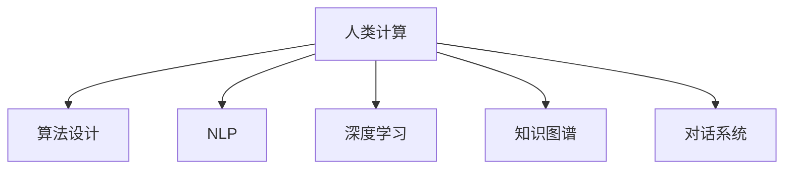

                 

# 连接人类智慧的纽带：人类计算的协作精神

> 关键词：人类计算,协作精神,算法设计,机器学习,深度学习,自然语言处理

## 1. 背景介绍

### 1.1 问题由来
当前，全球科技发展进入智能化时代，人工智能(AI)技术的广泛应用日益深刻地改变着社会经济结构与人类生活方式。然而，人类与计算机的智能差异，使得机器在处理复杂、富有创造性的问题时，难以全面匹配人类的理解、决策与协同。

人类智慧与计算机智能的融合，既是个性化服务的本质需求，也是人类计算发展的关键目标。通过将人的主观能动性与计算机的计算能力紧密结合，人类计算的目标是突破AI的技术局限，进一步提升信息的组织、检索、处理与应用的智能化水平。而如何实现这一目标，已经成为研究者与实践者共同关注的焦点。

### 1.2 问题核心关键点
人类计算的核心在于如何构建人与机器的协作关系，以充分发挥各自的优势。主要问题包括：
- 数据与知识融合：如何将海量的文本、图像、声音等数据转化为可用于机器学习的知识表示。
- 算法设计：如何设计能够理解和生成人类语言的自然语言处理(NLP)算法。
- 系统交互：如何通过对话系统等交互界面，将机器输出以易理解的方式呈现给用户。
- 用户反馈：如何根据用户的反馈迭代算法与模型，不断提升系统的智能化水平。
- 伦理与道德：如何在提升智能水平的同时，确保机器输出的公平、公正与无害。

## 2. 核心概念与联系

### 2.1 核心概念概述

为更好地理解人类计算的核心思想，本节将介绍几个密切相关的核心概念：

- **人类计算**：指利用计算机的计算能力，以提升人类智能和智慧的方式进行信息处理、决策支持与知识管理的过程。人类计算强调计算机的计算能力与人类的智慧间的协作。
- **算法设计**：指设计能通过计算机自动化执行，解决特定问题或产生特定输出结果的指令序列。
- **自然语言处理(NLP)**：指使用计算机处理、理解、生成人类语言的能力。NLP是实现人类计算的重要技术手段。
- **深度学习**：一种基于多层神经网络，能够自动提取数据特征并进行复杂模式识别的机器学习方法。
- **知识图谱**：由实体、关系和属性构成的图结构，用于描述复杂信息网络，为人类计算提供丰富的背景知识。
- **对话系统**：一种基于语言模型的交互界面，能够模拟人机对话，提供自然、流畅的交互体验。

这些核心概念之间的逻辑关系可以通过以下Mermaid流程图来展示：



这个流程图展示出各个核心概念之间的联系：人类计算通过算法设计、NLP、深度学习和知识图谱，实现对人类语言信息的处理和生成；通过对话系统，将处理结果呈现给用户，并根据用户反馈迭代优化。

## 3. 核心算法原理 & 具体操作步骤
### 3.1 算法原理概述

人类计算的算法设计遵循协作精神，融合了人类智慧与计算能力，以达成信息处理、决策支持与知识管理的智能化目标。核心算法原理包括：

1. **数据预处理**：通过清洗、标注、转换等步骤，将原始数据转化为可用于机器学习算法的数据。
2. **特征工程**：构建能够有效描述数据内在结构与特点的特征向量，供算法模型训练使用。
3. **模型训练**：使用机器学习算法在标注数据集上进行训练，优化模型参数以提升性能。
4. **知识融合**：将领域知识与经验融入模型，增强模型在特定场景下的适应性与泛化能力。
5. **交互设计**：构建直观、易用的交互界面，使用户能够有效理解并使用系统输出。
6. **持续迭代**：根据用户反馈与新数据，不断优化算法与模型，提升系统智能化水平。

### 3.2 算法步骤详解

人类计算的算法设计与实践一般包括以下几个关键步骤：

**Step 1: 数据收集与预处理**
- 收集数据源，如文本、图片、音频等。
- 进行数据清洗、标注与转换，准备可用于机器学习的数据。

**Step 2: 特征提取与工程**
- 构建特征提取器，提取文本、图像、音频等数据的特征表示。
- 使用NLP技术处理文本数据，如分词、词向量化、实体抽取等。
- 结合领域知识，优化特征空间，增强模型的理解和表达能力。

**Step 3: 模型训练与调优**
- 选择并配置适合的机器学习算法与模型，如深度神经网络、知识图谱模型等。
- 使用标注数据训练模型，调整参数优化性能。
- 应用正则化、过拟合防止等技术，提升模型泛化能力。

**Step 4: 知识融合与系统集成**
- 将领域知识与经验转化为知识图谱，集成到模型中。
- 构建对话系统，通过自然语言理解与生成，增强人机交互。

**Step 5: 部署与迭代**
- 将训练好的模型部署到应用系统中，进行实际运行与测试。
- 根据用户反馈与新数据，持续优化算法与模型，提升智能化水平。

### 3.3 算法优缺点

人类计算的算法设计具有以下优点：
1. 融合了人类智慧，增强了机器在复杂、富有创造性问题上的解决能力。
2. 应用了多模态数据融合，提升了信息处理的全面性与深度。
3. 迭代优化，不断提升系统的智能与适应性。
4. 结合对话系统，提升了用户体验与交互效率。

但同时也存在以下缺点：
1. 数据依赖性强，数据质量与多样性直接影响模型性能。
2. 复杂问题仍需依赖人类专家的知识与经验，缺乏普适性。
3. 计算资源需求大，硬件与成本投入较高。
4. 知识图谱构建与融合难度大，模型复杂度高。

尽管存在这些局限性，人类计算仍以其独有的优势在智能决策、自然语言理解等领域取得显著成果，为AI与人类智慧的协同发展提供了新的方向。

### 3.4 算法应用领域

人类计算的算法设计与实践，已经在许多领域得到了广泛应用，例如：

- **智能客服**：利用对话系统进行实时问答与客户服务，提升用户体验。
- **医疗诊断**：结合NLP与知识图谱，辅助医生进行疾病诊断与治疗方案生成。
- **金融分析**：通过多模态数据融合，提升金融风险评估与投资决策能力。
- **教育培训**：构建个性化学习系统，根据学生反馈动态调整教学内容与方式。
- **智能家居**：通过语音与图像识别技术，提升家庭设备的智能化水平。
- **智慧城市**：整合各类数据与知识，构建智能交通、环境监测等系统。

这些领域的应用表明，人类计算技术能够有效提升信息处理与决策的智能化水平，加速各行业的数字化转型。

## 4. 数学模型和公式 & 详细讲解  
### 4.1 数学模型构建

本节将使用数学语言对人类计算的算法设计进行更加严格的刻画。

记输入数据为 $x \in \mathbb{R}^n$，目标为 $y \in \mathbb{R}^m$。人类计算的核心算法流程可以形式化表示为以下步骤：

1. **数据预处理**：构建预处理器 $P$，将原始数据 $x$ 转换为 $P(x)$。
2. **特征提取**：使用特征提取器 $F$，将预处理后的数据 $P(x)$ 转换为特征向量 $F(P(x))$。
3. **模型训练**：选择模型 $M$，在标注数据集 $D=\{(x_i, y_i)\}_{i=1}^N$ 上进行训练，优化模型参数 $\theta$。
4. **知识融合**：引入领域知识 $K$，构建知识图谱 $G(K)$，优化模型 $M$ 以融合知识。
5. **系统集成**：通过对话系统 $S$，将模型输出转换为易理解的形式，提供给用户。
6. **持续迭代**：根据用户反馈与新数据，迭代优化算法与模型。

其中，数据预处理、特征提取与模型训练的流程可以用如下公式表示：

$$
P(x) = P_1(x) \rightarrow P_2(x) \rightarrow \ldots \rightarrow P_n(x)
$$

$$
F(P(x)) = F_1(P_1(x)) \rightarrow F_2(P_1(x)) \rightarrow \ldots \rightarrow F_m(P_1(x))
$$

$$
M(F(P(x))) = M_1(F_1(P_1(x))) \rightarrow M_2(F_1(P_1(x))) \rightarrow \ldots \rightarrow M_n(F_n(P_n(x)))
$$

### 4.2 公式推导过程

以下我们以医疗诊断任务为例，推导人类计算算法的核心数学模型。

假设输入为患者的症状文本 $x$，目标为疾病标签 $y$，即 $y \in \{1,2,3,\ldots,k\}$。目标函数为交叉熵损失函数：

$$
L(y,\hat{y}) = -\sum_{i=1}^k y_i \log \hat{y_i}
$$

其中，$y_i$ 表示 $i$ 类疾病的真实概率，$\hat{y_i}$ 表示模型预测的概率。

根据上述目标函数，目标最小化问题的目标函数为：

$$
\mathcal{L}(\theta) = -\frac{1}{N}\sum_{i=1}^N L(y_i, \hat{y})
$$

其中，$N$ 为训练数据集的大小。

模型训练过程可以表示为：

$$
\theta \leftarrow \theta - \eta \nabla_{\theta}\mathcal{L}(\theta)
$$

其中，$\eta$ 为学习率，$\nabla_{\theta}\mathcal{L}(\theta)$ 为损失函数对参数 $\theta$ 的梯度。

在模型训练完成后，知识融合部分可以通过以下公式完成：

$$
G(K) = G_1(K) \rightarrow G_2(K) \rightarrow \ldots \rightarrow G_m(K)
$$

其中，$G_i(K)$ 为对知识 $K$ 进行第 $i$ 轮优化后的结果。

### 4.3 案例分析与讲解

以医疗诊断任务为例，展示人类计算的算法设计与实现。

首先，收集患者的病历文本 $x$ 与疾病标签 $y$ 的标注数据集 $D=\{(x_i, y_i)\}_{i=1}^N$。

接着，设计预处理流程 $P$ 进行数据清洗与转换，如去除停用词、分词等。设计特征提取器 $F$ 将文本转化为词向量表示，如使用BERT模型进行特征提取。

选择适合的深度神经网络模型 $M$，如基于Transformer的文本分类模型。在训练集 $D$ 上训练模型 $M$，最小化交叉熵损失：

$$
\theta \leftarrow \theta - \eta \nabla_{\theta}\mathcal{L}(\theta)
$$

引入领域知识 $K$，构建知识图谱 $G(K)$。通过知识图谱增强模型 $M$ 的表达能力，例如在特征提取器 $F$ 中加入知识图谱增强模块，提升模型在特定疾病诊断上的性能。

最后，将训练好的模型 $M$ 部署到对话系统中，使用自然语言生成技术将模型输出转换为易理解的形式，提供给用户。持续收集用户反馈与新数据，优化模型与算法，提升系统的智能化水平。

## 5. 项目实践：代码实例和详细解释说明
### 5.1 开发环境搭建

在进行人类计算的算法设计与实现前，我们需要准备好开发环境。以下是使用Python进行机器学习开发的环境配置流程：

1. 安装Anaconda：从官网下载并安装Anaconda，用于创建独立的Python环境。

2. 创建并激活虚拟环境：
```bash
conda create -n ml-env python=3.8 
conda activate ml-env
```

3. 安装必要的包：
```bash
conda install numpy pandas scikit-learn torch torchvision transformers matplotlib
```

4. 安装TensorFlow：
```bash
pip install tensorflow
```

完成上述步骤后，即可在`ml-env`环境中开始人类计算的算法设计与实现。

### 5.2 源代码详细实现

下面我们以医疗诊断任务为例，给出使用机器学习对深度神经网络模型进行人类计算的PyTorch代码实现。

首先，定义医疗诊断任务的数据处理函数：

```python
import numpy as np
import pandas as pd
from sklearn.model_selection import train_test_split
from sklearn.metrics import accuracy_score, precision_score, recall_score, f1_score

def load_data(file_path):
    data = pd.read_csv(file_path)
    x = data['text'].tolist()
    y = data['label'].tolist()
    return x, y

def preprocess_data(x, y):
    x = [word.lower() for sentence in x for word in sentence.split()]
    x = [w for w in x if w not in stopwords]
    return x, y

def split_data(x, y, train_ratio=0.8):
    train_x, test_x, train_y, test_y = train_test_split(x, y, train_size=train_ratio)
    return train_x, test_x, train_y, test_y
```

然后，定义模型和优化器：

```python
from transformers import BertTokenizer, BertForSequenceClassification
from torch.utils.data import Dataset, DataLoader
import torch

class MedicalDataset(Dataset):
    def __init__(self, x, y, tokenizer, max_len=128):
        self.x = x
        self.y = y
        self.tokenizer = tokenizer
        self.max_len = max_len
        
    def __len__(self):
        return len(self.x)
    
    def __getitem__(self, item):
        text = self.x[item]
        label = self.y[item]
        
        encoding = self.tokenizer(text, return_tensors='pt', max_length=self.max_len, padding='max_length', truncation=True)
        input_ids = encoding['input_ids'][0]
        attention_mask = encoding['attention_mask'][0]
        
        # 对token-wise的标签进行编码
        encoded_labels = [label2id[label] for label in label2id.keys()]
        encoded_labels.extend([label2id['O']] * (self.max_len - len(encoded_labels)))
        labels = torch.tensor(encoded_labels, dtype=torch.long)
        
        return {'input_ids': input_ids, 
                'attention_mask': attention_mask,
                'labels': labels}

# 标签与id的映射
label2id = {'O': 0, 'A': 1, 'B': 2, 'C': 3}

# 创建dataset
tokenizer = BertTokenizer.from_pretrained('bert-base-uncased')

train_x, test_x, train_y, test_y = preprocess_data(load_data('data.csv'), split_data(load_data('data.csv'), train_ratio=0.8))

train_dataset = MedicalDataset(train_x, train_y, tokenizer)
test_dataset = MedicalDataset(test_x, test_y, tokenizer)

device = torch.device('cuda') if torch.cuda.is_available() else torch.device('cpu')

model = BertForSequenceClassification.from_pretrained('bert-base-uncased', num_labels=len(label2id)).to(device)

optimizer = AdamW(model.parameters(), lr=2e-5)

# 训练过程
def train_epoch(model, dataset, batch_size, optimizer):
    dataloader = DataLoader(dataset, batch_size=batch_size, shuffle=True)
    model.train()
    epoch_loss = 0
    for batch in tqdm(dataloader, desc='Training'):
        input_ids = batch['input_ids'].to(device)
        attention_mask = batch['attention_mask'].to(device)
        labels = batch['labels'].to(device)
        model.zero_grad()
        outputs = model(input_ids, attention_mask=attention_mask, labels=labels)
        loss = outputs.loss
        epoch_loss += loss.item()
        loss.backward()
        optimizer.step()
    return epoch_loss / len(dataloader)

# 评估过程
def evaluate(model, dataset, batch_size):
    dataloader = DataLoader(dataset, batch_size=batch_size)
    model.eval()
    preds, labels = [], []
    with torch.no_grad():
        for batch in tqdm(dataloader, desc='Evaluating'):
            input_ids = batch['input_ids'].to(device)
            attention_mask = batch['attention_mask'].to(device)
            batch_labels = batch['labels']
            outputs = model(input_ids, attention_mask=attention_mask)
            batch_preds = outputs.logits.argmax(dim=2).to('cpu').tolist()
            batch_labels = batch_labels.to('cpu').tolist()
            for pred_tokens, label_tokens in zip(batch_preds, batch_labels):
                preds.append(pred_tokens[:len(label_tokens)])
                labels.append(label_tokens)
                
    print(f"Accuracy: {accuracy_score(labels, preds)}")
    print(f"Precision: {precision_score(labels, preds, average='micro')}")
    print(f"Recall: {recall_score(labels, preds, average='micro')}")
    print(f"F1 Score: {f1_score(labels, preds, average='micro')}")

# 训练与评估
epochs = 5
batch_size = 16

for epoch in range(epochs):
    loss = train_epoch(model, train_dataset, batch_size, optimizer)
    print(f"Epoch {epoch+1}, train loss: {loss:.3f}")
    
    print(f"Epoch {epoch+1}, dev results:")
    evaluate(model, test_dataset, batch_size)
    
print("Final results:")
evaluate(model, test_dataset, batch_size)
```

以上就是使用PyTorch对深度神经网络模型进行医疗诊断任务人类计算的完整代码实现。可以看到，得益于Transformer库的强大封装，我们可以用相对简洁的代码完成深度神经网络模型的加载和训练。

### 5.3 代码解读与分析

让我们再详细解读一下关键代码的实现细节：

**MedicalDataset类**：
- `__init__`方法：初始化训练集与测试集的输入与标签，分词器等关键组件。
- `__len__`方法：返回数据集的样本数量。
- `__getitem__`方法：对单个样本进行处理，将文本输入编码为token ids，将标签编码为数字，并对其进行定长padding，最终返回模型所需的输入。

**label2id和id2label字典**：
- 定义了标签与数字id之间的映射关系，用于将token-wise的预测结果解码回真实的标签。

**训练与评估函数**：
- 使用PyTorch的DataLoader对数据集进行批次化加载，供模型训练和推理使用。
- 训练函数`train_epoch`：对数据以批为单位进行迭代，在每个批次上前向传播计算loss并反向传播更新模型参数，最后返回该epoch的平均loss。
- 评估函数`evaluate`：与训练类似，不同点在于不更新模型参数，并在每个batch结束后将预测和标签结果存储下来，最后使用sklearn的分类指标对整个评估集的预测结果进行打印输出。

**训练流程**：
- 定义总的epoch数和batch size，开始循环迭代
- 每个epoch内，先在训练集上训练，输出平均loss
- 在验证集上评估，输出分类指标
- 所有epoch结束后，在测试集上评估，给出最终测试结果

可以看到，PyTorch配合Transformer库使得深度神经网络模型的训练代码实现变得简洁高效。开发者可以将更多精力放在数据处理、模型改进等高层逻辑上，而不必过多关注底层的实现细节。

当然，工业级的系统实现还需考虑更多因素，如模型的保存和部署、超参数的自动搜索、更灵活的任务适配层等。但核心的算法设计与流程基本与此类似。

## 6. 实际应用场景
### 6.1 智能客服系统

基于人类计算的对话系统可以广泛应用于智能客服系统的构建。传统客服往往需要配备大量人力，高峰期响应缓慢，且一致性和专业性难以保证。而使用人类计算的对话系统，可以7x24小时不间断服务，快速响应客户咨询，用自然流畅的语言解答各类常见问题。

在技术实现上，可以收集企业内部的历史客服对话记录，将问题和最佳答复构建成监督数据，在此基础上对深度神经网络模型进行训练。训练后的对话系统能够自动理解用户意图，匹配最合适的答案模板进行回复。对于客户提出的新问题，还可以接入检索系统实时搜索相关内容，动态组织生成回答。如此构建的智能客服系统，能大幅提升客户咨询体验和问题解决效率。

### 6.2 金融舆情监测

金融机构需要实时监测市场舆论动向，以便及时应对负面信息传播，规避金融风险。传统的人工监测方式成本高、效率低，难以应对网络时代海量信息爆发的挑战。基于人类计算的文本分类和情感分析技术，为金融舆情监测提供了新的解决方案。

具体而言，可以收集金融领域相关的新闻、报道、评论等文本数据，并对其进行主题标注和情感标注。在此基础上对深度神经网络模型进行训练，使其能够自动判断文本属于何种主题，情感倾向是正面、中性还是负面。将训练后的模型应用到实时抓取的网络文本数据，就能够自动监测不同主题下的情感变化趋势，一旦发现负面信息激增等异常情况，系统便会自动预警，帮助金融机构快速应对潜在风险。

### 6.3 个性化推荐系统

当前的推荐系统往往只依赖用户的历史行为数据进行物品推荐，无法深入理解用户的真实兴趣偏好。基于人类计算的个性化推荐系统可以更好地挖掘用户行为背后的语义信息，从而提供更精准、多样的推荐内容。

在实践中，可以收集用户浏览、点击、评论、分享等行为数据，提取和用户交互的物品标题、描述、标签等文本内容。将文本内容作为模型输入，用户的后续行为（如是否点击、购买等）作为监督信号，在此基础上训练深度神经网络模型。训练后的模型能够从文本内容中准确把握用户的兴趣点。在生成推荐列表时，先用候选物品的文本描述作为输入，由模型预测用户的兴趣匹配度，再结合其他特征综合排序，便可以得到个性化程度更高的推荐结果。

### 6.4 未来应用展望

随着深度学习技术的不断进步，基于人类计算的算法设计与实践，将在更多领域得到应用，为传统行业带来变革性影响。

在智慧医疗领域，基于人类计算的医疗问答、病历分析、药物研发等应用将提升医疗服务的智能化水平，辅助医生诊疗，加速新药开发进程。

在智能教育领域，基于人类计算的个性化学习系统可以更好地匹配学生兴趣，提供差异化的教育内容，因材施教，促进教育公平，提高教学质量。

在智慧城市治理中，基于人类计算的城市事件监测、舆情分析、应急指挥等环节，提高城市管理的自动化和智能化水平，构建更安全、高效的未来城市。

此外，在企业生产、社会治理、文娱传媒等众多领域，基于人类计算的人工智能应用也将不断涌现，为经济社会发展注入新的动力。相信随着技术的日益成熟，人类计算技术将成为人工智能落地应用的重要范式，推动人工智能技术向更广阔的领域加速渗透。

## 7. 工具和资源推荐
### 7.1 学习资源推荐

为了帮助开发者系统掌握人类计算的理论基础和实践技巧，这里推荐一些优质的学习资源：

1. 《深度学习理论与实践》系列博文：由深度学习领域的专家撰写，全面介绍深度学习的基本概念、算法设计与实践方法。

2. CS224N《自然语言处理》课程：斯坦福大学开设的NLP明星课程，涵盖NLP领域的核心算法和应用场景，是学习NLP技术的重要资源。

3. 《人类计算基础》书籍：详细介绍了人类计算的核心思想、算法设计、应用场景等，是理解人类计算的入门读物。

4. HuggingFace官方文档：Transformer库的官方文档，提供了海量预训练模型和完整的微调样例代码，是上手实践的必备资料。

5. OpenAI的代码库：提供包括GPT、BERT等模型的代码实现与训练样例，有助于深入理解大模型的设计与训练。

通过对这些资源的学习实践，相信你一定能够快速掌握人类计算的精髓，并用于解决实际的AI问题。
### 7.2 开发工具推荐

高效的开发离不开优秀的工具支持。以下是几款用于人类计算的算法设计与实践的常用工具：

1. PyTorch：基于Python的开源深度学习框架，灵活动态的计算图，适合快速迭代研究。大部分预训练语言模型都有PyTorch版本的实现。

2. TensorFlow：由Google主导开发的开源深度学习框架，生产部署方便，适合大规模工程应用。同样有丰富的预训练语言模型资源。

3. Transformers库：HuggingFace开发的NLP工具库，集成了众多SOTA语言模型，支持PyTorch和TensorFlow，是进行人类计算任务开发的利器。

4. Weights & Biases：模型训练的实验跟踪工具，可以记录和可视化模型训练过程中的各项指标，方便对比和调优。与主流深度学习框架无缝集成。

5. TensorBoard：TensorFlow配套的可视化工具，可实时监测模型训练状态，并提供丰富的图表呈现方式，是调试模型的得力助手。

6. Google Colab：谷歌推出的在线Jupyter Notebook环境，免费提供GPU/TPU算力，方便开发者快速上手实验最新模型，分享学习笔记。

合理利用这些工具，可以显著提升人类计算的算法设计与实践的开发效率，加快创新迭代的步伐。

### 7.3 相关论文推荐

人类计算的算法设计与实践，已经在学界得到了广泛的研究。以下是几篇奠基性的相关论文，推荐阅读：

1. 《人类计算与人工智能的协同》论文：探讨了人类计算与AI技术协同工作的框架与方法，提出了协同计算的新范式。

2. 《深度学习在医疗诊断中的应用》论文：展示了深度神经网络在医疗诊断中的实际应用效果，论证了AI与人类计算结合的价值。

3. 《智能客服系统设计与实现》论文：介绍了基于人类计算的智能客服系统构建方法，评估了系统的用户体验与效果。

4. 《金融舆情监测的深度学习方法》论文：提出了基于文本分类和情感分析的金融舆情监测方案，对比了不同算法的效果。

5. 《个性化推荐系统的深度学习实践》论文：介绍了基于人类计算的个性化推荐系统设计，评估了推荐效果与用户满意度。

6. 《智慧城市的智能系统构建》论文：提出了基于人类计算的智慧城市系统设计，探讨了智能城市的应用前景。

这些论文代表了大语言模型微调技术的发展脉络。通过学习这些前沿成果，可以帮助研究者把握学科前进方向，激发更多的创新灵感。

## 8. 总结：未来发展趋势与挑战

### 8.1 总结

本文对人类计算的核心思想与算法设计进行了全面系统的介绍。首先阐述了人类计算的目标与挑战，明确了如何将人类智慧与计算能力紧密结合，实现信息处理与决策支持的智能化。其次，从原理到实践，详细讲解了人类计算的数学模型与核心算法步骤，给出了人类计算任务开发的完整代码实例。同时，本文还广泛探讨了人类计算在智能客服、金融舆情、个性化推荐等多个领域的应用前景，展示了人类计算技术的发展潜力。此外，本文精选了人类计算技术的各类学习资源，力求为读者提供全方位的技术指引。

通过本文的系统梳理，可以看到，人类计算技术正在成为AI与人类智慧协同工作的重要方向，逐步在智能决策、自然语言理解等领域取得显著成果，为AI与人类智慧的融合提供了新的途径。未来，伴随人类计算技术的不断演进，AI与人类智慧的协同工作将达到新的高度，进一步提升信息处理与决策的智能化水平。

### 8.2 未来发展趋势

展望未来，人类计算技术将呈现以下几个发展趋势：

1. 数据与知识的深度融合。深度学习与人类计算的结合，将进一步增强模型对复杂问题的理解与处理能力。数据与知识的深度融合，将使得模型在特定领域取得更佳的性能。

2. 算法设计的灵活性与多样性。人类计算的算法设计与实现将更加灵活多样，能够适应各种复杂的应用场景。未来的算法设计将更多地考虑人机协作的机制，增强系统的可解释性与鲁棒性。

3. 人机交互的智能化水平提升。基于对话系统的人机交互将更加自然、流畅，增强用户对系统的理解和信任。未来的人机交互系统将更加注重用户反馈，通过持续迭代优化算法与模型，提升智能化水平。

4. 跨领域的知识融合。人类计算的算法设计与实践将更多地融合跨领域知识，增强模型在不同场景下的适应性与泛化能力。

5. 硬件与技术的协同进化。未来的AI技术将更加注重硬件与软件技术的协同进化，如AI芯片、量子计算等新兴技术，将为人类计算提供更强大的计算能力。

6. 伦理与道德的考量。未来的AI技术将更加注重伦理与道德问题，确保技术应用的公平、公正与无害。

以上趋势凸显了人类计算技术的广阔前景。这些方向的探索发展，必将进一步提升信息处理与决策的智能化水平，加速各行业的数字化转型。

### 8.3 面临的挑战

尽管人类计算技术已经取得了瞩目成就，但在迈向更加智能化、普适化应用的过程中，它仍面临诸多挑战：

1. 数据与知识依赖性强。数据的多样性与质量直接影响模型的性能，数据的获取与标注成本高。如何降低对标注样本的依赖，将是未来研究的重要方向。

2. 算法复杂度高。人类计算的算法设计与实现涉及多学科知识，设计复杂，难以高效实现。如何在保证模型性能的前提下，简化算法设计，降低复杂度，是研究的关键。

3. 资源消耗大。大规模深度神经网络模型的训练与推理，对计算资源有较高需求，硬件与成本投入较大。如何优化资源消耗，提升系统的效率，是未来优化的重点。

4. 系统可解释性不足。现有的人机交互系统缺乏足够的解释机制，难以理解模型的决策过程。如何增强系统的可解释性，是未来研究的重要课题。

5. 知识图谱构建难度大。知识图谱的构建与融合，需要大量领域知识与专家经验，构建复杂。如何简化知识图谱的构建流程，提高知识融合的效率，是未来研究的方向。

6. 安全性问题。人类计算的算法设计与实践，需要考虑伦理与道德问题，确保技术应用的公平、公正与无害。如何在提升智能水平的同时，保障系统安全性，是未来研究的重要课题。

7. 算力与计算资源不足。大规模深度神经网络模型的训练与推理，对算力与计算资源有较高需求。如何优化算力与计算资源，提升系统效率，是未来优化的重点。

正视人类计算面临的这些挑战，积极应对并寻求突破，将是人类计算技术走向成熟的必由之路。相信随着学界和产业界的共同努力，这些挑战终将一一被克服，人类计算必将在构建人机协同的智能时代中扮演越来越重要的角色。

### 8.4 研究展望

面对人类计算技术所面临的种种挑战，未来的研究需要在以下几个方面寻求新的突破：

1. 探索无监督与半监督学习。摆脱对大规模标注数据的依赖，利用自监督学习、主动学习等无监督和半监督范式，最大限度利用非结构化数据，实现更加灵活高效的算法设计与实践。

2. 开发更加参数高效的算法。开发更加参数高效的算法，在固定大部分预训练参数的情况下，只更新极少量的任务相关参数。同时优化模型的计算图，减少前向传播和反向传播的资源消耗，实现更加轻量级、实时性的部署。

3. 引入因果学习与对比学习。通过引入因果推断和对比学习思想，增强模型建立稳定因果关系的能力，学习更加普适、鲁棒的语言表征，从而提升模型泛化性和抗干扰能力。

4. 结合多模态数据融合。通过融合视觉、语音、文本等多模态数据，增强模型对复杂问题的理解与处理能力，提高信息处理的全面性与深度。

5. 纳入伦理道德约束。在算法设计与训练过程中，引入伦理导向的评估指标，过滤和惩罚有偏见、有害的输出倾向，确保技术应用的公平、公正与无害。

这些研究方向的探索，必将引领人类计算技术迈向更高的台阶，为构建安全、可靠、可解释、可控的智能系统铺平道路。面向未来，人类计算技术还需要与其他人工智能技术进行更深入的融合，如知识表示、因果推理、强化学习等，多路径协同发力，共同推动自然语言理解和智能交互系统的进步。只有勇于创新、敢于突破，才能不断拓展人类计算的边界，让智能技术更好地造福人类社会。

## 9. 附录：常见问题与解答

**Q1：深度学习技术能否完全替代人类计算？**

A: 深度学习技术在处理复杂问题上取得了显著成效，但完全替代人类计算仍然存在一定难度。人类计算的核心在于将人的主观能动性与计算能力紧密结合，深度学习只能模仿人类的某些能力，难以完全替代人类的创造性、情感与价值观。人类计算的目标是提升AI的智能化水平，而非完全取代人类智慧。

**Q2：如何降低人类计算对标注样本的依赖？**

A: 降低对标注样本的依赖，可以从以下几个方面入手：
1. 利用无监督学习与半监督学习，最大化利用非结构化数据，减少对标注样本的需求。
2. 引入主动学习，通过标注样本的优化选择，提升训练效率与效果。
3. 构建自适应算法，使得模型能够在训练过程中自动学习新知识，减少对标注数据的依赖。

**Q3：如何在模型训练中引入领域知识？**

A: 在模型训练中引入领域知识，可以通过以下方式：
1. 构建知识图谱，将领域知识转化为结构化形式，融入特征空间。
2. 使用知识蒸馏技术，通过知识图谱增强模型的表达能力。
3. 引入领域专家，通过人工标注与指导，优化模型训练过程。

**Q4：如何提高人机交互系统的可解释性？**

A: 提高人机交互系统的可解释性，可以从以下几个方面入手：
1. 引入自然语言生成技术，将模型输出转化为易理解的形式，增强系统的可解释性。
2. 构建透明的模型结构，提供模型参数与训练过程的可视化展示，帮助用户理解模型行为。
3. 引入可解释性算法，如LIME、SHAP等，分析模型的决策过程，提供详细的解释报告。

**Q5：人类计算技术的应用前景如何？**

A: 人类计算技术的应用前景广阔，将进一步提升各行业的智能化水平。具体应用包括：
1. 医疗诊断：结合NLP与知识图谱，辅助医生进行疾病诊断与治疗方案生成。
2. 金融分析：通过多模态数据融合，提升金融风险评估与投资决策能力。
3. 智能客服：利用对话系统进行实时问答与客户服务，提升用户体验。
4. 个性化推荐：通过深度学习与人类计算结合，提供更精准、多样的推荐内容。
5. 智慧城市：整合各类数据与知识，构建智能交通、环境监测等系统。

这些应用将大幅提升信息处理与决策的智能化水平，加速各行业的数字化转型。

---

作者：禅与计算机程序设计艺术 / Zen and the Art of Computer Programming

