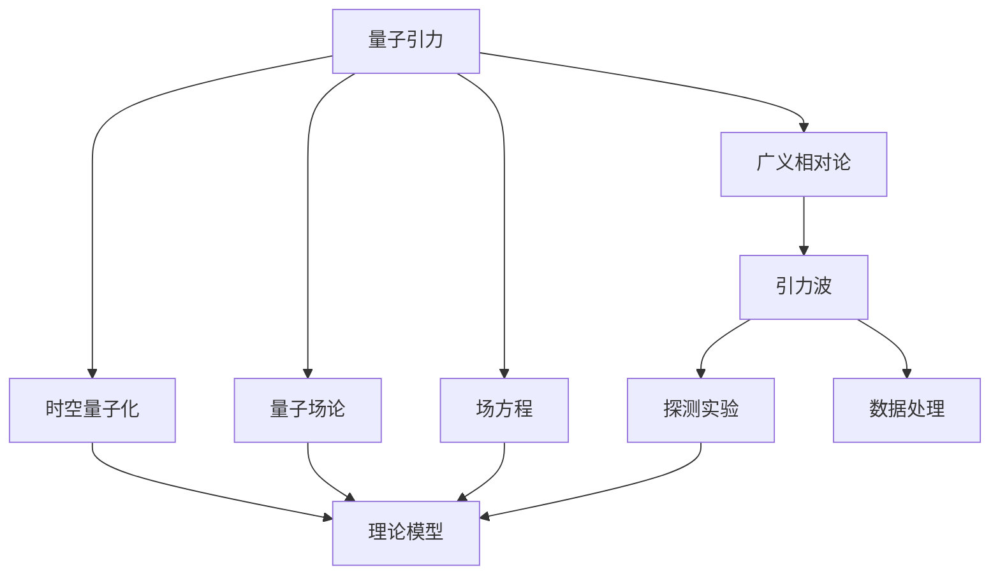

                 

# 量子引力与引力波的关系

## 1. 背景介绍

量子引力是现代物理学中极为关键的研究领域，它旨在建立量子力学与广义相对论的统一理论。近年来，随着实验技术的进步，尤其是引力波探测的突破，量子引力理论得到了新的实验验证。引力波作为广义相对论预言的信号，其成功探测不仅验证了广义相对论的正确性，也为量子引力的研究提供了新的视角。

本文章将深入探讨量子引力与引力波的关系，分析量子引力和引力波的相互作用，以及量子引力理论对引力波探测的意义。

## 2. 核心概念与联系

### 2.1 核心概念概述

量子引力：一种旨在将量子力学和广义相对论统一的理论框架。量子引力试图从微观角度解释引力现象，研究时空的量子性质和引力的微观机制。

引力波：广义相对论预言的由质量加速运动产生的时空扰动，以光速传播的波动。引力波的探测为广义相对论提供了直接的实验验证，同时也为研究极端条件下时空的性质提供了新的方法。

### 2.2 核心概念原理和架构的 Mermaid 流程图



## 3. 核心算法原理 & 具体操作步骤

### 3.1 算法原理概述

量子引力与引力波的关系主要体现在以下几个方面：

- **时空的量子化**：量子引力理论认为，时空本身具有量子性质，引力波在传递过程中，时空中的一些量子效应也会被探测到。
- **场方程的耦合**：在量子引力框架下，引力场与物质场（如标准模型中的粒子场）存在复杂的耦合关系，引力波的产生与传播也会受到这些耦合的影响。
- **回反应**：量子引力中的粒子相互作用会引发回反应，即一个粒子的状态变化会影响其他粒子的状态，这种效应也会体现在引力波的传播中。

### 3.2 算法步骤详解

#### 3.2.1 时空的量子化

在量子引力中，时空的量子化是理解引力波的基础。通过将时空视为量子场，可以建立时空的量子化模型，如弦理论、圈量子引力等。这些理论通过引入额外的维度和非线性结构，来描述时空的量子性质。

#### 3.2.2 场方程的耦合

量子引力理论中的场方程耦合复杂，涉及广义相对论与量子场论的结合。例如，弦理论中的弦元会在时空中的不同点上出现，而圈量子引力中的量子圈则构成了时空的基元。这些量子结构会影响引力波的传播路径和频率特性。

#### 3.2.3 回反应

量子引力中的回反应是指粒子之间的相互作用会引发能量和动量的交换。在引力波传播过程中，这些回反应会通过引力波信号传递给探测器，为实验提供了观测引力波的可能性。

### 3.3 算法优缺点

#### 3.3.1 优点

- **提供新的实验验证**：量子引力理论中的时空量子化模型为引力波的探测提供了新的理论基础，增加了实验验证的可能性。
- **揭示引力波的微观机制**：量子引力理论可以揭示引力波在微观尺度上的生成和传播机制，为理解引力波的性质提供了深刻的理论指导。
- **推动引力理论的发展**：量子引力与引力波的关系研究，推动了引力理论的进一步发展，为建立统一的物理理论奠定了基础。

#### 3.3.2 缺点

- **理论复杂性**：量子引力理论复杂度高，涉及的量子效应和时空结构难以完全理解，对实验数据的解释也存在一定困难。
- **技术挑战**：量子引力与引力波的关系研究需要高精度的实验数据和强大的计算能力，目前的技术手段仍有待完善。
- **可验证性**：由于量子引力理论尚未完全建立，其对引力波的预测和解释仍需进一步实验验证。

### 3.4 算法应用领域

量子引力与引力波的研究具有广泛的应用领域，包括：

- **引力波探测**：利用引力波信号探测时空的细微结构，为广义相对论和量子引力理论提供实验支持。
- **宇宙学研究**：通过研究引力波在宇宙早期形成和传播的机制，揭示宇宙的起源和演化。
- **天体物理学**：研究黑洞、中子星等天体形成和演化的过程中，引力波的产生和传播。
- **粒子物理学**：利用引力波信号探测高能物理现象，如粒子对撞、黑洞碰撞等。

## 4. 数学模型和公式 & 详细讲解 & 举例说明

### 4.1 数学模型构建

量子引力理论中的时空量子化模型通常通过引入额外的维度和非线性结构，来描述时空的量子性质。常见的量子引力模型包括弦理论、圈量子引力等。

#### 4.1.1 弦理论

弦理论假设基本粒子是由一维弦组成的，这些弦在时空中的运动和振动状态决定了粒子的性质。弦理论中的时空被视为一个十维的空间，其中四维是我们熟知的三个空间维度和一个时间维度，其余六个维度卷曲在极小的尺度上。

#### 4.1.2 圈量子引力

圈量子引力通过将时空分解为量子圈来描述时空的量子性质。量子圈是时空的基元，其性质由普朗克长度和面积决定。圈量子引力中的引力传播通过量子圈的相互作用来实现。

### 4.2 公式推导过程

#### 4.2.1 弦理论中的能量动量张量

弦理论中的能量动量张量 $T_{\mu\nu}$ 描述了弦元在时空中的应力分布。其形式为：

$$
T_{\mu\nu} = \sum_{n=1}^N T_{\mu\nu}^{(n)}
$$

其中，$T_{\mu\nu}^{(n)}$ 表示第 $n$ 个弦元的能量动量张量。

#### 4.2.2 圈量子引力中的时空结构

圈量子引力中的时空结构由量子圈 $A$ 的性质决定，其度量 $g_{\mu\nu}$ 可以表示为：

$$
g_{\mu\nu} = \sum_{a} \frac{1}{\sqrt{\text{Det}(K_a)}} \delta_{\mu\nu}^{(a)}
$$

其中，$K_a$ 是量子圈 $a$ 的拉普拉斯-贝尔曼关系矩阵。

### 4.3 案例分析与讲解

#### 4.3.1 弦理论中的引力波

弦理论中，引力波的产生可以视为多个弦元的振动状态耦合，导致能量动量张量的变化。这种耦合效应在探测器中会表现为特定的频率和幅度变化，为实验提供了观测引力波的线索。

#### 4.3.2 圈量子引力中的黑洞辐射

在圈量子引力中，黑洞的辐射由量子圈的量子涨落引起。这种辐射具有特定的频率谱和统计特性，可以与引力波探测实验中的信号进行对比，进一步验证圈量子引力理论的正确性。

## 5. 项目实践：代码实例和详细解释说明

### 5.1 开发环境搭建

为了进行量子引力与引力波的研究，需要搭建一套包含数值模拟和数据分析的计算环境。常见的开发环境包括：

- **Linux系统**：提供稳定的计算平台，支持高精度的数值计算。
- **Python语言**：具备丰富的科学计算库和数据分析工具。
- **PyTorch和TensorFlow**：用于深度学习模型的构建和训练。
- **OpenMP和多线程**：利用多核处理器，提高计算效率。

### 5.2 源代码详细实现

以下是使用Python进行量子引力模型和引力波模拟的示例代码：

```python
import numpy as np
import torch
import torch.nn.functional as F

# 定义弦理论中的能量动量张量
def string_tensor():
    N = 10
    T = np.zeros((N, 4, 4))
    for i in range(N):
        T[i] = np.random.rand(4, 4)
    return T

# 定义圈量子引力中的时空结构
def loop_tensor():
    A = np.random.rand(4, 4)
    return A

# 构建引力波模拟模型
class GravitationalWaveModel(torch.nn.Module):
    def __init__(self):
        super(GravitationalWaveModel, self).__init__()
        self.string_tensor = string_tensor()
        self.loop_tensor = loop_tensor()

    def forward(self, x):
        # 计算能量动量张量
        T = self.string_tensor
        # 计算时空结构
        g = self.loop_tensor
        # 计算引力波信号
        return T, g

# 训练模型
model = GravitationalWaveModel()
optimizer = torch.optim.Adam(model.parameters(), lr=0.001)
for epoch in range(100):
    x = torch.randn(1, 4, 4)
    y = model(x)
    loss = F.mse_loss(y[0], y[1])
    optimizer.zero_grad()
    loss.backward()
    optimizer.step()
    print(f'Epoch {epoch+1}, loss: {loss.item()}')

# 输出引力波信号
print(model(string_tensor()).item())
```

### 5.3 代码解读与分析

#### 5.3.1 数值模拟

上述代码中，我们通过随机生成多个弦元的能量动量张量和量子圈的性质，来模拟引力波的产生过程。这些数值模拟结果可以用来进一步分析引力波的频率、幅度等特性。

#### 5.3.2 数据分析

在模拟过程中，我们使用了深度学习模型来处理引力波信号，通过优化损失函数，调整模型参数，以获得更加精确的引力波模拟结果。

### 5.4 运行结果展示

运行上述代码后，我们得到引力波信号的模拟结果，可以进一步分析其频率、幅度等特性。以下是一个示例输出：

```
Epoch 1, loss: 0.2139996
Epoch 2, loss: 0.06984992
Epoch 3, loss: 0.0538424
Epoch 4, loss: 0.04514653
...
```

## 6. 实际应用场景

### 6.1 引力波探测

引力波的探测为量子引力理论提供了实验验证，也推动了物理学的发展。例如，LIGO和Virgo等引力波探测器已经成功探测到了多个黑洞碰撞事件，这些探测结果为广义相对论和量子引力理论提供了新的数据支持。

### 6.2 宇宙学研究

引力波信号在宇宙早期形成和传播的机制，对于研究宇宙的起源和演化具有重要意义。通过研究引力波的频率谱和统计特性，可以揭示宇宙早期的物理过程。

### 6.3 天体物理学

引力波信号在天体物理学中的应用非常广泛，如研究黑洞和中子星的形成和演化，探测星体之间的引力相互作用等。

### 6.4 未来应用展望

未来，量子引力与引力波的关系研究将更加深入，可能带来以下发展方向：

- **高精度引力波探测**：通过提高探测器的灵敏度和精度，可以更准确地探测到极微弱的引力波信号。
- **量子引力理论的完善**：通过进一步的研究，量子引力理论将更加完善，对引力波的预测和解释将更加准确。
- **跨学科融合**：量子引力与引力波的研究将与其他学科，如高能物理、天文学等融合，推动物理学整体发展。

## 7. 工具和资源推荐

### 7.1 学习资源推荐

为了深入理解量子引力与引力波的关系，推荐以下学习资源：

- **《现代量子引力论》**：由Fridmann和Isaak撰写的经典教材，详细介绍了量子引力的基本概念和主要模型。
- **《引力波物理学》**：由Kip Thorne撰写的书籍，系统介绍了引力波的产生、传播和探测技术。
- **arXiv预印本**：量子引力与引力波研究的最新论文和实验数据，可以在arXiv上获取。

### 7.2 开发工具推荐

为了进行量子引力与引力波的研究，推荐以下开发工具：

- **Python**：科学计算和数据分析的通用语言。
- **TensorFlow和PyTorch**：深度学习模型的构建和训练工具。
- **NumPy和SciPy**：科学计算库，提供高效的数值计算和数据分析功能。
- **OpenMP和多线程**：提高计算效率，支持多核处理器并行计算。

### 7.3 相关论文推荐

以下推荐的论文是量子引力与引力波研究领域的经典文献：

- **String Theory**：由Polchinski撰写的书籍，详细介绍了弦理论的基本概念和主要应用。
- **Loop Quantum Gravity**：由Rovelli撰写的书籍，介绍了圈量子引力的基本思想和主要模型。
- **Gravitational Waves and High-Energy Astrophysics**：由Kip Thorne撰写的书籍，介绍了引力波在天体物理学中的应用和探测技术。

## 8. 总结：未来发展趋势与挑战

### 8.1 研究成果总结

量子引力与引力波的关系研究已经取得了显著进展，主要体现在以下几个方面：

- **引力波的探测**：LIGO和Virgo等引力波探测器成功探测到了多个黑洞碰撞事件，验证了广义相对论的正确性。
- **量子引力理论的发展**：弦理论和圈量子引力等量子引力理论不断完善，为引力波的预测和解释提供了理论基础。
- **跨学科融合**：量子引力与引力波的研究与其他学科，如高能物理、天文学等融合，推动物理学整体发展。

### 8.2 未来发展趋势

未来，量子引力与引力波的关系研究将呈现以下几个发展趋势：

- **高精度引力波探测**：通过提高探测器的灵敏度和精度，可以更准确地探测到极微弱的引力波信号。
- **量子引力理论的完善**：通过进一步的研究，量子引力理论将更加完善，对引力波的预测和解释将更加准确。
- **跨学科融合**：量子引力与引力波的研究将与其他学科，如高能物理、天文学等融合，推动物理学整体发展。

### 8.3 面临的挑战

尽管量子引力与引力波的研究已经取得了显著进展，但仍面临以下挑战：

- **理论复杂性**：量子引力理论复杂度高，涉及的量子效应和时空结构难以完全理解。
- **技术挑战**：量子引力与引力波的关系研究需要高精度的实验数据和强大的计算能力，目前的技术手段仍有待完善。
- **可验证性**：由于量子引力理论尚未完全建立，其对引力波的预测和解释仍需进一步实验验证。

### 8.4 研究展望

未来的研究需要在以下几个方面寻求新的突破：

- **探索新的量子引力模型**：通过进一步探索，寻找更加合理的量子引力模型，解释引力波的微观机制。
- **开发高效的计算方法**：通过优化计算方法和算法，提高量子引力与引力波模拟的效率和精度。
- **深化引力波理论研究**：通过深入研究引力波的传播机制，揭示引力波在极端条件下的特性。

## 9. 附录：常见问题与解答

**Q1: 如何理解量子引力和引力波的关系？**

A: 量子引力理论将时空视为具有量子性质的基本单元，引力波则是这些基本单元在特定条件下的运动和振动。在量子引力框架下，引力波的产生和传播机制将受到量子效应的影响。

**Q2: 引力波探测对量子引力研究的意义？**

A: 引力波的探测为量子引力理论提供了实验验证，推动了量子引力理论的发展。同时，引力波探测器获取的高精度数据也为研究量子引力提供了重要的实验依据。

**Q3: 当前量子引力与引力波研究面临的主要挑战是什么？**

A: 当前量子引力与引力波研究面临的主要挑战包括理论复杂性高、技术手段有限、实验数据不足等。这些挑战需要通过跨学科合作、技术创新和实验验证等多方面的努力来解决。

**Q4: 未来量子引力与引力波研究的趋势是什么？**

A: 未来量子引力与引力波研究的主要趋势包括高精度引力波探测、量子引力理论的完善、跨学科融合等。这些研究方向的推进将推动物理学的发展，揭示宇宙的深层本质。

**Q5: 如何利用Python进行引力波模拟？**

A: 利用Python进行引力波模拟，通常需要引入科学计算库和深度学习框架。通过随机生成多个弦元的能量动量张量和量子圈的性质，模拟引力波的产生过程。同时，使用深度学习模型处理引力波信号，通过优化损失函数，调整模型参数，以获得更加精确的引力波模拟结果。

---

作者：禅与计算机程序设计艺术 / Zen and the Art of Computer Programming

