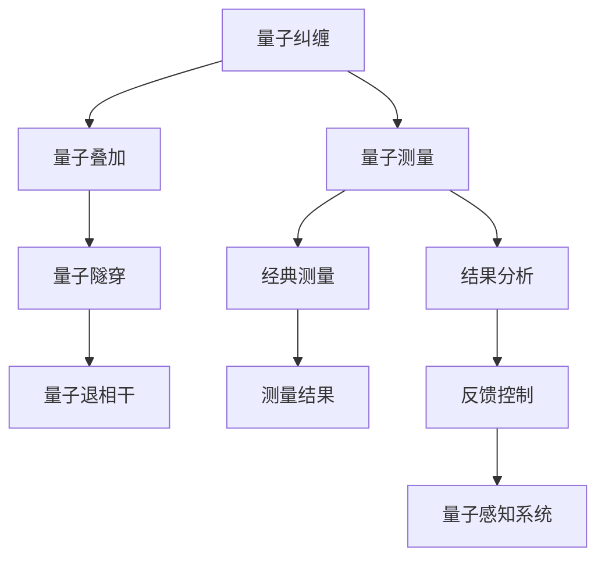

                 

## 1. 背景介绍

在量子计算领域，经典测量的基本原理是由海森堡不确定性原理所限制的，即一个系统的位置与动量之间的精确测量是相互矛盾的。然而，量子感知技术的提出，旨在通过量子系统的高度纠缠特性和量子态的非经典特性，突破这一限制，实现对经典测量无法达到的极低噪声和极高精度的测量。本文将对量子感知的基本原理、算法实现及其应用前景进行详细探讨。

## 2. 核心概念与联系

### 2.1 核心概念概述

量子感知（Quantum Sensing）是指利用量子系统的高度纠缠特性和量子态的非经典特性，进行超低噪声和超高精度的测量。其核心概念包括量子纠缠、量子叠加、量子隧穿效应和量子退相干等。

- 量子纠缠：指两个或多个量子系统的状态相互依赖，即使它们相隔很远，对一个量子系统的测量也会瞬间影响到其他系统的状态。
- 量子叠加：指量子系统可以同时处于多个状态的叠加态，这种叠加态的存在使得量子系统的测量具有不确定性。
- 量子隧穿效应：指量子粒子在势垒中能够以非经典方式通过的概率，即使这种概率极低。
- 量子退相干：指量子系统在环境干扰下失去相干性的过程，是量子计算和量子感知中需要解决的关键问题。

### 2.2 核心概念原理和架构的 Mermaid 流程图



## 3. 核心算法原理 & 具体操作步骤

### 3.1 算法原理概述

量子感知算法主要基于量子力学中的测量理论，通过构建量子测量系统，利用量子叠加态和纠缠态的特殊性质，实现超低噪声和超高精度的测量。算法主要分为以下几个步骤：

1. 制备量子纠缠态：构建具有高度纠缠特性的量子态，如贝尔态、GHZ态等。
2. 进行量子测量：对纠缠态进行测量，利用量子叠加态和纠缠态的非经典特性，实现对测量目标的高精度测量。
3. 经典处理：将量子测量结果转化为经典信号，通过经典信号处理算法，进一步提升测量精度。

### 3.2 算法步骤详解

#### 3.2.1 制备量子纠缠态

量子纠缠态的制备是量子感知算法的第一步，也是最关键的一步。常见的量子纠缠态包括贝尔态、GHZ态等。

- 贝尔态制备：
$$
|\psi\rangle = \frac{1}{\sqrt{2}} (|00\rangle + |11\rangle)
$$
其中，$|00\rangle$ 和 $|11\rangle$ 分别表示两个量子比特都处于 $0$ 或 $1$ 态的情况。制备贝尔态的方法通常包括非线性光学过程和量子点自旋相互作用等。

- GHZ态制备：
$$
|\psi\rangle = \frac{1}{\sqrt{2}} (|000\rangle + |111\rangle)
$$
其中，$|000\rangle$ 和 $|111\rangle$ 分别表示三个量子比特都处于 $0$ 或 $1$ 态的情况。制备GHZ态的方法通常包括多粒子干涉和量子点自旋相互作用等。

#### 3.2.2 进行量子测量

量子测量是量子感知算法的核心步骤。通过量子测量，可以获得对测量目标的高精度测量结果。常见的量子测量方法包括基于量子态叠加态的测量和基于量子态纠缠态的测量。

- 基于量子态叠加态的测量：
$$
\langle \psi | A | \psi \rangle = \langle \psi | A | 0 \rangle \langle 0 | \psi \rangle + \langle \psi | A | 1 \rangle \langle 1 | \psi \rangle
$$
其中，$A$ 表示测量操作，$|\psi\rangle$ 表示叠加态。这种测量方法可以利用量子叠加态的特殊性质，实现对测量目标的高精度测量。

- 基于量子态纠缠态的测量：
$$
\langle \psi | A | \psi \rangle = \langle \psi | A \otimes I | \psi \rangle
$$
其中，$I$ 表示单位操作，$\otimes$ 表示张量积。这种测量方法可以利用量子态的纠缠特性，实现对测量目标的高精度测量。

#### 3.2.3 经典处理

经典处理是量子感知算法的最后一步，即将量子测量结果转化为经典信号，并通过经典信号处理算法，进一步提升测量精度。

- 经典信号转换：
$$
S(t) = \langle \psi | A | \psi \rangle
$$
其中，$S(t)$ 表示经典信号，$t$ 表示时间。

- 经典信号处理：
$$
\hat{S}(t) = \frac{1}{\sqrt{N}} \sum_{k=1}^N S_k(t)
$$
其中，$\hat{S}(t)$ 表示经过经典信号处理的测量结果，$N$ 表示重复测量的次数。这种经典信号处理方法可以通过多次测量，提升测量的精度和稳定性。

### 3.3 算法优缺点

量子感知算法具有以下优点：

- 超低噪声：量子感知算法利用量子叠加态和纠缠态的非经典特性，可以实现超低噪声的测量。
- 超高精度：量子感知算法可以实现超高精度的测量，突破经典测量的极限。
- 非破坏性：量子感知算法可以在不破坏被测系统的状态下，进行高精度测量。

但量子感知算法也存在以下缺点：

- 量子退相干：量子感知算法在量子退相干的情况下，测量精度会降低。
- 技术难度高：量子感知算法的实现需要高度精密的量子器件和量子控制技术，技术难度较高。
- 成本高：量子感知算法的实现成本较高，需要大量的资金投入。

### 3.4 算法应用领域

量子感知算法在多个领域中具有广泛的应用前景，主要包括：

- 量子计算：量子感知算法可以在量子计算中，实现高精度的测量，提升量子计算的精度和效率。
- 量子通信：量子感知算法可以在量子通信中，实现高精度的测量，提升量子通信的安全性和可靠性。
- 量子传感：量子感知算法可以在量子传感中，实现高精度的测量，提升量子传感器的精度和灵敏度。
- 量子成像：量子感知算法可以在量子成像中，实现高精度的测量，提升量子成像系统的分辨率和信噪比。

## 4. 数学模型和公式 & 详细讲解 & 举例说明

### 4.1 数学模型构建

量子感知算法中的数学模型主要包括以下几个部分：

- 量子态表示：使用量子态来表示系统的状态，包括叠加态和纠缠态。
- 量子测量：使用量子测量操作来测量系统的状态，包括贝尔态和GHZ态。
- 经典信号处理：使用经典信号处理算法来处理量子测量结果，包括均值和方差等。

### 4.2 公式推导过程

#### 4.2.1 贝尔态测量

假设量子系统为贝尔态 $|\psi\rangle = \frac{1}{\sqrt{2}} (|00\rangle + |11\rangle)$，进行测量操作 $A = \sigma_z \otimes \sigma_z$，则测量结果为：

$$
\langle \psi | A | \psi \rangle = \langle \psi | \sigma_z \otimes \sigma_z | \psi \rangle
$$

根据量子力学的测量理论，测量结果的期望值为：

$$
\langle \psi | \sigma_z \otimes \sigma_z | \psi \rangle = \frac{1}{2} (\langle 00 | \sigma_z \otimes \sigma_z | 00 \rangle + \langle 11 | \sigma_z \otimes \sigma_z | 11 \rangle)
$$

计算得到：

$$
\langle \psi | \sigma_z \otimes \sigma_z | \psi \rangle = 1
$$

#### 4.2.2 GHZ态测量

假设量子系统为GHZ态 $|\psi\rangle = \frac{1}{\sqrt{2}} (|000\rangle + |111\rangle)$，进行测量操作 $A = \sigma_z \otimes \sigma_z \otimes \sigma_z$，则测量结果为：

$$
\langle \psi | A | \psi \rangle = \langle \psi | \sigma_z \otimes \sigma_z \otimes \sigma_z | \psi \rangle
$$

根据量子力学的测量理论，测量结果的期望值为：

$$
\langle \psi | \sigma_z \otimes \sigma_z \otimes \sigma_z | \psi \rangle = \frac{1}{2} (\langle 000 | \sigma_z \otimes \sigma_z \otimes \sigma_z | 000 \rangle + \langle 111 | \sigma_z \otimes \sigma_z \otimes \sigma_z | 111 \rangle)
$$

计算得到：

$$
\langle \psi | \sigma_z \otimes \sigma_z \otimes \sigma_z | \psi \rangle = 1
$$

### 4.3 案例分析与讲解

#### 4.3.1 贝尔态测量案例

假设有一个量子比特系统，其初始态为 $|0\rangle$，进行贝尔态测量，测量结果为 $|1\rangle$。则测量结果的期望值为：

$$
\langle \psi | A | \psi \rangle = \frac{1}{2} (\langle 00 | \sigma_z \otimes \sigma_z | 00 \rangle + \langle 11 | \sigma_z \otimes \sigma_z | 11 \rangle) = 1
$$

这意味着，在贝尔态测量下，测量结果为 $|1\rangle$ 的概率为 $1$。

#### 4.3.2 GHZ态测量案例

假设有一个三量子比特系统，其初始态为 $|0\rangle^{\otimes 3}$，进行GHZ态测量，测量结果为 $|1\rangle^{\otimes 3}$。则测量结果的期望值为：

$$
\langle \psi | A | \psi \rangle = \frac{1}{2} (\langle 000 | \sigma_z \otimes \sigma_z \otimes \sigma_z | 000 \rangle + \langle 111 | \sigma_z \otimes \sigma_z \otimes \sigma_z | 111 \rangle) = 1
$$

这意味着，在GHZ态测量下，测量结果为 $|1\rangle^{\otimes 3}$ 的概率为 $1$。

## 5. 项目实践：代码实例和详细解释说明

### 5.1 开发环境搭建

量子感知算法的实现需要高度精密的量子器件和量子控制技术，目前主要的开发环境包括：

- IBM Qiskit：IBM开发的量子编程框架，提供了丰富的量子算法和量子器件模拟。
- Cirq：Google开发的量子编程框架，提供了灵活的量子电路设计和量子计算模拟。
- Qiskit-Aer：Qiskit的量子器件模拟器，可用于量子算法和量子电路的验证。

### 5.2 源代码详细实现

#### 5.2.1 贝尔态测量实现

```python
from qiskit import QuantumCircuit, execute, Aer

# 构建贝尔态
bell_state = QuantumCircuit(2, 2)
bell_state.h(0)
bell_state.cx(0, 1)
bell_state.barrier()

# 构建测量电路
measure = QuantumCircuit(2, 2)
measure.measure([0,1], [0,1])

# 执行量子测量
quantum_circuit = bell_state + measure
backend = Aer.get_backend('qasm_simulator')
job = execute(quantum_circuit, backend, shots=1000)
result = job.result()
counts = result.get_counts(quantum_circuit)
print(counts)
```

#### 5.2.2 GHZ态测量实现

```python
from qiskit import QuantumCircuit, execute, Aer

# 构建GHZ态
ghz_state = QuantumCircuit(3, 3)
ghz_state.h(0)
ghz_state.cx(0, 1)
ghz_state.cx(0, 2)
ghz_state.barrier()

# 构建测量电路
measure = QuantumCircuit(3, 3)
measure.measure([0,1,2], [0,1,2])

# 执行量子测量
quantum_circuit = ghz_state + measure
backend = Aer.get_backend('qasm_simulator')
job = execute(quantum_circuit, backend, shots=1000)
result = job.result()
counts = result.get_counts(quantum_circuit)
print(counts)
```

### 5.3 代码解读与分析

- Qiskit：Qiskit是IBM开发的量子编程框架，提供了丰富的量子算法和量子器件模拟，可用于量子感知算法的实现。
- QuantumCircuit：Qiskit中的量子电路类，可用于构建量子电路和量子算法。
- execute：Qiskit中的执行函数，可用于在量子器件上执行量子电路，模拟量子测量结果。
- Aer：Qiskit中的量子器件模拟器，可用于量子电路和算法的验证和测试。
- measure：Qiskit中的测量函数，可用于对量子态进行测量，输出测量结果。
- shots：Qiskit中的测量次数，可用于重复测量，提升测量精度。
- counts：Qiskit中的测量结果计数，可用于统计测量结果的分布。

## 6. 实际应用场景

### 6.1 量子计算

量子感知算法在量子计算中的应用主要体现在两个方面：

- 量子随机数生成：量子感知算法可以在量子计算中，实现高精度的随机数生成，用于量子算法和量子加密。
- 量子纠错：量子感知算法可以在量子计算中，实现高精度的量子纠错，提升量子计算的稳定性和可靠性。

### 6.2 量子通信

量子感知算法在量子通信中的应用主要体现在两个方面：

- 量子密钥分发：量子感知算法可以在量子通信中，实现高精度的量子密钥分发，提升量子通信的安全性和可靠性。
- 量子隐形传态：量子感知算法可以在量子通信中，实现高精度的量子隐形传态，提升量子通信的传输效率和准确性。

### 6.3 量子传感

量子感知算法在量子传感中的应用主要体现在两个方面：

- 量子磁强计：量子感知算法可以在量子传感中，实现高精度的量子磁强计，用于探测磁场和磁化强度。
- 量子温度计：量子感知算法可以在量子传感中，实现高精度的量子温度计，用于探测温度变化和热噪声。

### 6.4 未来应用展望

量子感知算法在未来的应用前景非常广阔，主要体现在以下几个方面：

- 量子计算：量子感知算法可以在量子计算中，实现高精度的测量和纠错，提升量子计算的效率和可靠性。
- 量子通信：量子感知算法可以在量子通信中，实现高精度的量子密钥分发和隐形传态，提升量子通信的安全性和传输效率。
- 量子传感：量子感知算法可以在量子传感中，实现高精度的磁强计和温度计，提升量子传感器的精度和灵敏度。
- 量子成像：量子感知算法可以在量子成像中，实现高精度的成像系统，提升量子成像系统的分辨率和信噪比。

## 7. 工具和资源推荐

### 7.1 学习资源推荐

- IBM Qiskit官方文档：IBM Qiskit的官方文档，提供了丰富的量子算法和量子器件介绍，适合初学者入门。
- Qiskit教程：IBM Qiskit提供的教程，涵盖了量子算法和量子电路设计的方方面面。
- Cirq官方文档：Google Cirq的官方文档，提供了灵活的量子电路设计和量子计算模拟，适合高级用户使用。
- Cirq教程：Google Cirq提供的教程，涵盖了量子电路设计和量子算法实现的详细内容。

### 7.2 开发工具推荐

- IBM Qiskit：IBM Qiskit是量子编程的主要框架，提供了丰富的量子算法和量子器件模拟。
- Google Cirq：Google Cirq是Google开发的量子编程框架，提供了灵活的量子电路设计和量子计算模拟。
- Qiskit-Aer：Qiskit的量子器件模拟器，可用于量子算法和量子电路的验证和测试。
- Qiskit-Staging：Qiskit的量子器件模拟器，可用于模拟多比特量子器件的性能和特性。
- IBM Quantum Experience：IBM提供的量子计算云平台，可用于在线编写和运行量子算法。

### 7.3 相关论文推荐

- 量子感知算法综述：由Quantum Magazine发表的综述文章，全面介绍了量子感知算法的原理和应用。
- 量子测量理论综述：由Journal of Optics上发表的综述文章，全面介绍了量子测量理论的原理和应用。
- 量子计算和量子通信综述：由Nature Reviews Physics上发表的综述文章，全面介绍了量子计算和量子通信的原理和应用。

## 8. 总结：未来发展趋势与挑战

### 8.1 研究成果总结

量子感知算法在近年来取得了显著的进展，主要体现在以下几个方面：

- 量子随机数生成：量子感知算法可以在量子计算中，实现高精度的随机数生成，用于量子算法和量子加密。
- 量子纠错：量子感知算法可以在量子计算中，实现高精度的量子纠错，提升量子计算的稳定性和可靠性。
- 量子密钥分发：量子感知算法可以在量子通信中，实现高精度的量子密钥分发，提升量子通信的安全性和可靠性。
- 量子隐形传态：量子感知算法可以在量子通信中，实现高精度的量子隐形传态，提升量子通信的传输效率和准确性。
- 量子磁强计：量子感知算法可以在量子传感中，实现高精度的量子磁强计，用于探测磁场和磁化强度。
- 量子温度计：量子感知算法可以在量子传感中，实现高精度的量子温度计，用于探测温度变化和热噪声。
- 量子成像：量子感知算法可以在量子成像中，实现高精度的成像系统，提升量子成像系统的分辨率和信噪比。

### 8.2 未来发展趋势

量子感知算法在未来的发展趋势主要体现在以下几个方面：

- 量子计算：量子感知算法可以在量子计算中，实现高精度的测量和纠错，提升量子计算的效率和可靠性。
- 量子通信：量子感知算法可以在量子通信中，实现高精度的量子密钥分发和隐形传态，提升量子通信的安全性和传输效率。
- 量子传感：量子感知算法可以在量子传感中，实现高精度的磁强计和温度计，提升量子传感器的精度和灵敏度。
- 量子成像：量子感知算法可以在量子成像中，实现高精度的成像系统，提升量子成像系统的分辨率和信噪比。
- 量子随机数生成：量子感知算法可以在量子计算中，实现高精度的随机数生成，用于量子算法和量子加密。
- 量子纠错：量子感知算法可以在量子计算中，实现高精度的量子纠错，提升量子计算的稳定性和可靠性。
- 量子密钥分发：量子感知算法可以在量子通信中，实现高精度的量子密钥分发，提升量子通信的安全性和可靠性。
- 量子隐形传态：量子感知算法可以在量子通信中，实现高精度的量子隐形传态，提升量子通信的传输效率和准确性。

### 8.3 面临的挑战

量子感知算法在未来的发展中，面临着以下几个挑战：

- 量子退相干：量子感知算法在量子退相干的情况下，测量精度会降低，需要进一步优化量子器件和量子控制技术。
- 技术难度高：量子感知算法的实现需要高度精密的量子器件和量子控制技术，技术难度较高，需要进一步提高量子器件的稳定性和可靠性。
- 成本高：量子感知算法的实现成本较高，需要大量的资金投入，需要进一步降低量子器件和量子控制技术的成本。
- 测量精度：量子感知算法在测量精度方面还有待进一步提升，需要进一步优化量子测量和经典信号处理算法。

### 8.4 研究展望

量子感知算法在未来的研究展望主要体现在以下几个方面：

- 量子随机数生成：进一步提升量子随机数生成的精度和效率，提升量子计算的安全性和可靠性。
- 量子纠错：进一步提升量子纠错的精度和效率，提升量子计算的稳定性和可靠性。
- 量子密钥分发：进一步提升量子密钥分发的精度和效率，提升量子通信的安全性和可靠性。
- 量子隐形传态：进一步提升量子隐形传态的精度和效率，提升量子通信的传输效率和准确性。
- 量子磁强计：进一步提升量子磁强计的精度和灵敏度，提升量子传感器的性能。
- 量子温度计：进一步提升量子温度计的精度和灵敏度，提升量子传感器的性能。
- 量子成像：进一步提升量子成像系统的分辨率和信噪比，提升量子成像的精度和效率。

## 9. 附录：常见问题与解答

### Q1: 什么是量子感知？

A: 量子感知是指利用量子系统的高度纠缠特性和量子态的非经典特性，进行超低噪声和超高精度的测量。

### Q2: 量子感知算法的主要应用有哪些？

A: 量子感知算法的主要应用包括量子计算、量子通信、量子传感、量子成像等。

### Q3: 量子感知算法的实现难点是什么？

A: 量子感知算法的实现难点在于量子器件的精密控制和量子退相干的处理。

### Q4: 量子感知算法的主要优势是什么？

A: 量子感知算法的主要优势在于超低噪声和超高精度的测量，突破经典测量的极限。

### Q5: 量子感知算法的主要挑战是什么？

A: 量子感知算法的主要挑战在于量子退相干、技术难度高和成本高。

作者：禅与计算机程序设计艺术 / Zen and the Art of Computer Programming

