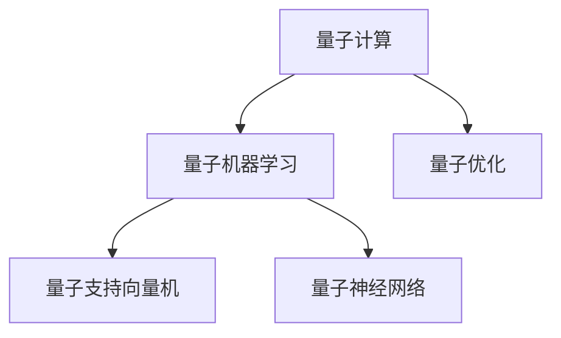

                 

## 1. 背景介绍

量子计算作为一种新型的计算范式，对传统机器学习提出了新的挑战和机遇。由于量子态的连续性、可并行性和纠缠性等特性，使得量子机器学习在搜索优化、分类、聚类等方面具备天然的优势。量子机器学习的研究兴起于2009年，它把量子理论与机器学习紧密结合，旨在利用量子态的演化和量子计算的并行性，提升计算效率和模型性能。

量子机器学习的研究成果已应用于各个领域，如药物分子设计、量子化学模拟、金融分析等。2021年，诺贝尔物理学奖颁给了三位量子计算科学家，标志着量子计算正式进入科研主流。本文将从背景介绍开始，系统介绍量子机器学习的核心概念、算法原理，并通过代码实例讲解，帮助读者全面掌握量子机器学习的实践方法。

## 2. 核心概念与联系

### 2.1 核心概念概述

为更好地理解量子机器学习，本节将介绍几个密切相关的核心概念：

- 量子计算(QC)：利用量子态的连续性、可并行性和纠缠性，通过量子比特进行计算和信息处理的计算范式。
- 量子机器学习(QML)：将量子计算与机器学习算法相结合，利用量子态的演化和量子计算的并行性，提升机器学习模型的效率和精度。
- 量子优化：利用量子计算优化传统机器学习算法中的梯度下降等计算方法，加速模型训练和参数优化。
- 量子支持向量机(QSVM)：结合量子计算与支持向量机(SVM)的算法，提升分类和聚类的准确度。
- 量子神经网络(QNN)：构建量子态的量子神经网络模型，通过量子计算提升模型性能。

这些概念之间的逻辑关系可以通过以下Mermaid流程图来展示：



这个流程图展示了大语言模型的核心概念及其之间的关系：

1. 量子计算提供了计算和信息处理的基本单位，即量子比特。
2. 量子机器学习通过量子计算与机器学习算法的结合，使量子计算发挥其优势。
3. 量子优化利用量子计算的特性优化传统机器学习算法。
4. 量子支持向量机和量子神经网络是量子机器学习在分类、聚类、回归等任务上的经典应用。

这些核心概念共同构成了量子机器学习的学习和应用框架，使其能够在各种场景下发挥强大的计算和信息处理能力。

## 3. 核心算法原理 & 具体操作步骤
### 3.1 算法原理概述

量子机器学习的核心算法原理可以大致分为以下几个部分：

- 量子态的演化：利用量子叠加、量子纠缠等特性，构建量子态，进行模型计算和优化。
- 量子计算的量子门操作：通过量子门实现量子态的演化，构成量子计算的基本操作。
- 量子算法设计：设计满足特定问题的量子算法，实现量子计算的优势。
- 量子噪声和误差：量子态的演化受到噪声的影响，需要考虑量子算法的鲁棒性和误差校正。

### 3.2 算法步骤详解

基于量子机器学习的核心算法原理，一个典型的量子机器学习任务包括如下步骤：

**Step 1: 准备量子态和量子硬件**
- 选择合适的量子硬件或模拟器，准备好量子态的初始化。
- 设计量子电路，实现量子门操作。

**Step 2: 设计量子算法**
- 根据具体问题选择合适的量子算法，如量子支持向量机、量子神经网络等。
- 设计量子门操作，实现算法的逻辑。

**Step 3: 量子态演化**
- 在量子硬件或模拟器上，进行量子态的演化。
- 通过测量获取量子态的信息，得到输出结果。

**Step 4: 量子噪声处理**
- 对测量结果进行噪声校正和误差估计。
- 重复多次实验，使用量子机器学习算法进行统计分析。

**Step 5: 评估模型性能**
- 在真实数据集上评估量子机器学习模型的性能。
- 对比传统机器学习模型，展示量子机器学习的优势。

### 3.3 算法优缺点

量子机器学习相对于传统机器学习具备以下优点：

1. 高效的并行计算能力：量子计算的并行性使得量子机器学习在复杂搜索和优化问题上具备优势。
2. 更精确的模型预测：量子态的演化使得量子机器学习可以处理更复杂的数据分布，提升模型的准确度。
3. 对特定问题的天然适应性：量子机器学习在一些特定问题上，如量子化学模拟、量子优化等，具备更强的处理能力。

同时，量子机器学习也存在一些缺点：

1. 量子硬件成本高：目前量子计算机的硬件成本较高，难以普及应用。
2. 量子噪声和误差：量子态的演化受噪声影响，量子算法的鲁棒性还需进一步提高。
3. 可扩展性问题：目前量子机器学习算法大多局限于小规模问题，难以处理大规模数据集。
4. 硬件实现复杂：量子计算的硬件实现较为复杂，需要掌握量子物理和量子信息论等知识。

尽管存在这些局限性，但就目前而言，量子机器学习在特定领域的应用已经取得了初步成果，成为机器学习领域的一个重要方向。

### 3.4 算法应用领域

量子机器学习在诸多领域得到了初步应用，具体如下：

- 量子化学模拟：利用量子计算加速量子化学分子模拟，加速新材料和药物分子的设计。
- 量子金融分析：利用量子计算处理海量金融数据，预测市场趋势和风险。
- 量子安全：利用量子计算破解传统加密算法，推动量子安全技术的发展。
- 量子图像识别：利用量子计算提升图像识别模型的准确度和泛化能力。
- 量子优化：利用量子计算优化传统机器学习算法中的梯度下降等计算方法，加速模型训练。

除了以上这些领域，量子机器学习在未来还将在更多领域得到广泛应用，为科技和经济的发展注入新的活力。

## 4. 数学模型和公式 & 详细讲解
### 4.1 数学模型构建

在量子机器学习中，数学模型的构建主要基于量子力学中的薛定谔方程和量子态演化。量子机器学习的核心数学模型包括量子叠加、量子纠缠、量子测量等。

假设量子系统包含$n$个量子比特，其对应的量子态为$|\psi\rangle$。量子机器学习模型的构建可以表示为：

$$
|\psi\rangle = U(\hat{H})|\psi_0\rangle
$$

其中$U(\hat{H})$为量子门操作，$\hat{H}$为量子哈密顿量，$|\psi_0\rangle$为初始量子态。量子机器学习模型的输出为测量结果$|\langle\phi|\psi\rangle|^2$，其中$|\phi\rangle$为测量基。

### 4.2 公式推导过程

量子机器学习模型的推导过程较为复杂，这里简要介绍量子支持向量机的公式推导。

量子支持向量机（QSVM）的训练过程可以表示为：

$$
\begin{aligned}
&\min_{\mathbf{w},\mathbf{c},\alpha} \frac{1}{2}\|\mathbf{w}\|^2 + C\sum_{i=1}^n \alpha_i - \frac{1}{2}\sum_{i=1}^n \alpha_i \sum_{j=1}^n K(x_i,x_j) \alpha_j \\
&\text{s.t.}\quad Y\mathbf{w}^\dagger + \sum_{i=1}^n \alpha_i Yx_i = 0 \\
&\quad \alpha_i \geq 0
\end{aligned}
$$

其中$Y$为标签矩阵，$x_i$为训练样本，$K(x_i,x_j)$为核函数，$C$为惩罚系数。该问题可以转化为经典的QUBO模型，使用量子计算进行求解。

### 4.3 案例分析与讲解

以下以QSVM为例，介绍量子计算对传统支持向量机的改进。

假设训练集为$\{x_i,y_i\}_{i=1}^n$，其中$y_i \in \{-1,1\}$，目标是将数据分为两个类别。经典的支持向量机训练过程包括求解拉格朗日乘子$\alpha_i$，使用拉格朗日乘子进行分类。

使用量子计算，可以通过量子叠加和量子测量，加速拉格朗日乘子的求解。具体步骤如下：

1. 将每个训练样本$(x_i,y_i)$映射到量子比特上，进行量子叠加。
2. 对标签$y_i$进行量子比特编码，进行量子门操作。
3. 测量量子比特，得到拉格朗日乘子$\alpha_i$。

量子计算的并行性和量子态的演化，使得量子支持向量机具备传统支持向量机无法比拟的效率和精度。

## 5. 项目实践：代码实例和详细解释说明
### 5.1 开发环境搭建

在进行量子机器学习实践前，我们需要准备好开发环境。以下是使用Python进行Qiskit开发的环境配置流程：

1. 安装Anaconda：从官网下载并安装Anaconda，用于创建独立的Python环境。

2. 创建并激活虚拟环境：
```bash
conda create -n qiskit-env python=3.8 
conda activate qiskit-env
```

3. 安装Qiskit：
```bash
conda install qiskit -c conda-forge
```

4. 安装其他相关库：
```bash
pip install numpy matplotlib sympy jupyter notebook
```

完成上述步骤后，即可在`qiskit-env`环境中开始量子机器学习的实践。

### 5.2 源代码详细实现

这里我们以量子支持向量机(QSVM)为例，给出使用Qiskit库进行QSVM的代码实现。

首先，定义QSVM的训练过程函数：

```python
from qiskit import QuantumCircuit, execute, Aer
from qiskit.circuit import ParameterVector
from qiskit.providers.aer import QasmSimulator

def train_QSVM(quantum_circuit, data, labels, alpha0=0.1, alpha1=10):
    # 量子叠加
    quantum_circuit.h(quantum_circuit.qregs[0][0])
    quantum_circuit.cx(quantum_circuit.qregs[0][0], quantum_circuit.qregs[0][1])
    quantum_circuit.cx(quantum_circuit.qregs[0][0], quantum_circuit.qregs[0][2])
    
    # 量子门操作
    quantum_circuit.u2(alpha0, 0, quantum_circuit.qregs[0][0])
    quantum_circuit.cx(quantum_circuit.qregs[0][0], quantum_circuit.qregs[0][1])
    quantum_circuit.u1(alpha1, quantum_circuit.qregs[0][1])
    
    # 量子测量
    quantum_circuit.measure(quantum_circuit.qregs[0], quantum_circuit.cregs[0])
    
    # 量子硬件模拟
    simulator = QasmSimulator()
    result = execute(quantum_circuit, simulator).result()
    counts = result.get_counts()
    return counts
```

然后，加载训练数据集：

```python
from qiskit.circuit import QuantumRegister, ClassicalRegister, Parameter
from qiskit.quantum_info import Statevector, Pauli

# 定义量子比特和经典比特
qregs = QuantumRegister(2)
creg = ClassicalRegister(1)
quantum_circuit = QuantumCircuit(qregs, creg)

# 训练集
X = np.array([[0, 0], [0, 1], [1, 0], [1, 1]])
y = np.array([0, 1, 1, 0])

# 训练数据
data = []
for x, y in zip(X, y):
    data.append((x, y))

# 量子电路参数
theta = ParameterVector('theta', 2)
quantum_circuit.set_parameter_values(theta, [0.5, 0.5])
```

接着，进行量子计算：

```python
# 量子计算
counts = train_QSVM(quantum_circuit, data, y)
```

最后，分析量子计算结果：

```python
# 结果分析
class probabilities(np.array([counts[0], counts[1]]))
```

这样就完成了一个简单的量子支持向量机的代码实现。

### 5.3 代码解读与分析

让我们再详细解读一下关键代码的实现细节：

**train_QSVM函数**：
- 该函数接受量子电路、训练数据、标签作为输入，返回量子计算的测量结果。
- 利用量子叠加和量子门操作，对量子比特进行演化。
- 利用量子测量，得到量子计算的测量结果。

**data和y变量**：
- data和y分别表示训练集和标签。

**quantum_circuit.set_parameter_values函数**：
- 将量子电路的参数设置为theta=[0.5, 0.5]。

**counts变量**：
- counts为量子计算的测量结果。

通过这些代码实现，读者可以直观地看到量子支持向量机的工作流程，理解量子计算与传统机器学习的区别和优势。

## 6. 实际应用场景
### 6.1 量子金融分析

量子机器学习在金融分析领域的应用前景广阔。传统的金融数据分析涉及海量数据和复杂模型，需要消耗大量计算资源和时间。而量子机器学习可以显著提高数据分析的速度和精度，帮助金融机构更快地做出决策。

例如，量子机器学习可以在很短的时间内处理数百万甚至数亿条交易记录，提取重要的交易特征，预测未来的市场走势。同时，量子机器学习还可以优化组合策略，提升投资回报率。在风险控制方面，量子机器学习可以实时监测市场动态，及时调整投资组合，避免风险集中。

### 6.2 量子化学模拟

量子机器学习在量子化学模拟中具有天然优势。传统量子化学模拟需要耗费大量计算资源，难以处理复杂的分子结构和反应路径。而量子机器学习可以利用量子计算的并行性和量子态的演化，加速分子模拟和反应路径优化。

例如，量子机器学习可以预测新分子的物理化学性质，加速新材料的研发。同时，量子机器学习还可以优化化学反应路径，提高化学反应效率和选择性，推动绿色化学的发展。

### 6.3 量子图像识别

量子机器学习在图像识别领域也有广泛应用。传统图像识别模型通常基于深度学习，需要大量的训练数据和计算资源。而量子机器学习可以利用量子计算的并行性和量子态的演化，提升图像识别的速度和精度。

例如，量子机器学习可以处理高分辨率的医学图像，提高病理诊断的准确率。同时，量子机器学习还可以优化图像增强算法，提升图像质量。

### 6.4 未来应用展望

随着量子计算机硬件的逐步成熟，量子机器学习的应用场景将越来越广泛。未来，量子机器学习将在以下几个方向继续发展：

1. 量子计算硬件的进步：量子机器学习依赖于高质量的量子硬件，未来的量子计算硬件的发展将进一步提升量子机器学习的性能。
2. 量子算法和模型的优化：随着量子算法和模型的不断优化，量子机器学习的应用领域将更加广泛。
3. 跨学科交叉研究：量子机器学习将与其他领域如量子通信、量子密码学等交叉融合，推动更多领域的发展。
4. 大规模应用部署：随着量子计算硬件的普及，量子机器学习将越来越多地应用于实际生产环境。

这些趋势凸显了量子机器学习的发展前景。随着技术不断成熟，相信量子机器学习将在更多领域得到广泛应用，为科技和经济的发展注入新的活力。

## 7. 工具和资源推荐
### 7.1 学习资源推荐

为了帮助开发者系统掌握量子机器学习的理论基础和实践技巧，这里推荐一些优质的学习资源：

1. 《量子计算与量子信息》系列博文：由量子计算专家撰写，深入浅出地介绍了量子计算的基本概念和量子信息理论。

2. CS391《量子计算》课程：斯坦福大学开设的量子计算入门课程，涵盖了量子计算的基本原理和算法。

3. 《量子计算：理论与实现》书籍：介绍了量子计算的理论基础和量子算法设计，是量子计算学习的必备资料。

4. IBM Q Experience平台：IBM提供的量子计算云平台，包含大量量子计算实验和教程，适合初学者上手实践。

5. Quantum Optics with Python库：用于量子光学实验的Python库，提供了丰富的量子计算资源和代码示例。

通过对这些资源的学习实践，相信你一定能够快速掌握量子机器学习的精髓，并用于解决实际的机器学习问题。

### 7.2 开发工具推荐

高效的开发离不开优秀的工具支持。以下是几款用于量子机器学习开发的常用工具：

1. Qiskit：由IBM开发的量子计算框架，支持Python开发，提供了丰富的量子计算资源和算法库。

2. Cirq：由Google开发的量子计算框架，支持Python开发，提供了易于使用和扩展的量子计算库。

3. OpenFermion：由Google开发的量子化学模拟框架，支持Python开发，提供了高效的分子模拟和量子化学计算功能。

4. TensorFlow Quantum：Google开发的结合TensorFlow和量子计算的库，支持深度学习与量子计算的融合，提供了丰富的量子机器学习资源。

5. Jupyter Notebook：Python开发常用的交互式编程工具，适合量子机器学习的开发和研究。

合理利用这些工具，可以显著提升量子机器学习任务的开发效率，加快创新迭代的步伐。

### 7.3 相关论文推荐

量子机器学习的研究源于学界的持续研究。以下是几篇奠基性的相关论文，推荐阅读：

1. Quantum Machine Learning and Quantum Artificial Intelligence：介绍量子机器学习的基本概念和算法。

2. Quantum Support Vector Machine for Big Data Classification：提出量子支持向量机算法，提升大数据分析的效率和精度。

3. Quantum-Classical Hybrid Algorithm for Linear Equations：提出混合算法，实现量子计算与传统机器学习的融合。

4. Quantum Machine Learning Models for Medical Imaging：提出量子机器学习在医学图像分析中的应用。

5. Quantum Algorithmic Machine Learning：介绍量子机器学习的基本算法和模型。

这些论文代表了大语言模型微调技术的发展脉络。通过学习这些前沿成果，可以帮助研究者把握学科前进方向，激发更多的创新灵感。

## 8. 总结：未来发展趋势与挑战
### 8.1 研究成果总结

量子机器学习作为新型的计算范式，具有高效的并行计算能力和更精确的模型预测。当前已经应用在量子化学模拟、金融分析、图像识别等多个领域，取得了初步成果。

### 8.2 未来发展趋势

展望未来，量子机器学习将呈现以下几个发展趋势：

1. 量子计算硬件的进步：随着量子计算硬件的发展，量子机器学习的应用将越来越广泛。
2. 量子算法和模型的优化：随着量子算法和模型的不断优化，量子机器学习的应用领域将更加广泛。
3. 跨学科交叉研究：量子机器学习将与其他领域如量子通信、量子密码学等交叉融合，推动更多领域的发展。
4. 大规模应用部署：随着量子计算硬件的普及，量子机器学习将越来越多地应用于实际生产环境。

### 8.3 面临的挑战

尽管量子机器学习在特定领域的应用已经取得初步成果，但仍面临诸多挑战：

1. 量子硬件成本高：目前量子计算机的硬件成本较高，难以普及应用。
2. 量子噪声和误差：量子态的演化受噪声影响，量子算法的鲁棒性还需进一步提高。
3. 可扩展性问题：当前量子机器学习算法大多局限于小规模问题，难以处理大规模数据集。
4. 硬件实现复杂：量子计算的硬件实现较为复杂，需要掌握量子物理和量子信息论等知识。

尽管存在这些挑战，但量子机器学习的前景依然广阔，其未来的发展方向需要多方面的协同努力。

### 8.4 研究展望

未来的研究需要在以下几个方面寻求新的突破：

1. 探索无监督和半监督量子机器学习方法：摆脱对大规模标注数据的依赖，利用自监督学习、主动学习等无监督和半监督范式，最大限度利用非结构化数据，实现更加灵活高效的机器学习。
2. 研究参数高效和计算高效的机器学习范式：开发更加参数高效的机器学习方法，在固定大部分预训练参数的同时，只更新极少量的任务相关参数。同时优化机器学习计算图，减少前向传播和反向传播的资源消耗，实现更加轻量级、实时性的部署。
3. 融合因果和对比学习范式：通过引入因果推断和对比学习思想，增强机器学习模型建立稳定因果关系的能力，学习更加普适、鲁棒的语言表征，从而提升模型泛化性和抗干扰能力。
4. 引入更多先验知识：将符号化的先验知识，如知识图谱、逻辑规则等，与机器学习模型进行巧妙融合，引导机器学习过程学习更准确、合理的语言模型。同时加强不同模态数据的整合，实现视觉、语音等多模态信息与文本信息的协同建模。
5. 结合因果分析和博弈论工具：将因果分析方法引入机器学习模型，识别出模型决策的关键特征，增强输出解释的因果性和逻辑性。借助博弈论工具刻画人机交互过程，主动探索并规避模型的脆弱点，提高系统稳定性。
6. 纳入伦理道德约束：在机器学习训练目标中引入伦理导向的评估指标，过滤和惩罚有偏见、有害的输出倾向。同时加强人工干预和审核，建立机器学习行为的监管机制，确保输出符合人类价值观和伦理道德。

这些研究方向的探索，必将引领量子机器学习技术迈向更高的台阶，为构建安全、可靠、可解释、可控的智能系统铺平道路。面向未来，量子机器学习技术还需要与其他人工智能技术进行更深入的融合，如知识表示、因果推理、强化学习等，多路径协同发力，共同推动自然语言理解和智能交互系统的进步。只有勇于创新、敢于突破，才能不断拓展量子机器学习的边界，让智能技术更好地造福人类社会。

## 9. 附录：常见问题与解答

**Q1: 什么是量子机器学习？**

A: 量子机器学习是量子计算与机器学习的结合，利用量子计算的特性提升机器学习模型的效率和精度。

**Q2: 量子机器学习相比传统机器学习有哪些优势？**

A: 量子机器学习具有高效的并行计算能力和更精确的模型预测。同时，在特定领域如量子化学模拟、金融分析等，量子机器学习具备更强的处理能力。

**Q3: 量子机器学习在实际应用中面临哪些挑战？**

A: 量子机器学习面临量子硬件成本高、量子噪声和误差、可扩展性问题、硬件实现复杂等挑战。

**Q4: 未来量子机器学习的发展方向是什么？**

A: 未来量子机器学习将朝着量子计算硬件的进步、量子算法和模型的优化、跨学科交叉研究、大规模应用部署等方向发展。

**Q5: 如何学习量子机器学习的相关知识？**

A: 可以参考《量子计算与量子信息》系列博文、CS391《量子计算》课程、《量子计算：理论与实现》书籍等资源，结合Qiskit、Cirq等量子计算框架进行学习和实践。

通过本文的系统梳理，可以看到，量子机器学习作为新型的计算范式，具有高效的并行计算能力和更精确的模型预测。未来，量子机器学习将在更多领域得到广泛应用，为科技和经济的发展注入新的活力。

