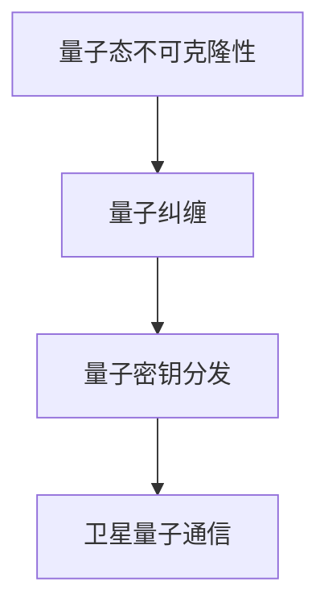

                 

# 量子通信卫星：构建全球量子通信网络

## 1. 背景介绍

量子通信卫星技术是近年来迅速发展起来的一项前沿技术，通过利用量子态的不可克隆性和量子纠缠等特性，实现通信中的信息加密和传输安全保障。近年来，世界各国纷纷投入资源，积极研发和部署量子通信卫星网络，以期在通信安全和科技竞争中占据先机。

### 1.1 量子通信简介
量子通信是利用量子态的不可克隆性和量子纠缠等特性，实现通信中的信息加密和传输安全保障。量子通信技术基于量子力学原理，可以在通信过程中提供理论上无法被破解的加密保障。

### 1.2 量子通信卫星发展历程
量子通信卫星的研发始于20世纪90年代，首颗量子通信卫星“墨子号”于2016年发射成功，标志着量子通信卫星技术的突破。随后，多个国家和地区纷纷加入量子通信卫星的研发和部署竞赛，包括中国的“悟空号”、欧洲的“米兰”计划、美国的“量子卫星”等。

## 2. 核心概念与联系

### 2.1 核心概念概述

量子通信卫星技术涉及多个核心概念，以下将对其原理和架构进行详细解释：

- **量子态不可克隆性**：量子态的不可克隆性是量子通信的基础。根据量子力学的原理，一个量子态无法被完全克隆，因此窃听者无法在不破坏信息的情况下截获信息。

- **量子纠缠**：量子纠缠是量子通信的核心技术。通过将两个或多个量子系统纠缠在一起，使得它们的状态紧密相关，即使将它们分隔很远，它们的状态变化仍能瞬时影响彼此。

- **量子密钥分发(QKD)**：量子密钥分发是量子通信中实现信息安全传输的主要手段。通过量子态的传输和测量，生成和分发安全的密钥，用于加密和解密数据。

- **卫星量子通信**：卫星量子通信是将量子通信技术应用于太空中，通过卫星实现远距离、大范围的量子通信。

这些核心概念共同构成了量子通信卫星技术的理论基础和实际应用，使得量子通信在实现全球通信网络方面具有广阔的前景。

### 2.2 核心概念原理和架构的 Mermaid 流程图



## 3. 核心算法原理 & 具体操作步骤

### 3.1 算法原理概述

量子通信卫星技术利用量子态的不可克隆性和量子纠缠等特性，实现通信中的信息加密和传输安全保障。其核心算法包括量子密钥分发(QKD)、量子态传输和测量、以及卫星网络构建。

### 3.2 算法步骤详解

量子通信卫星技术的具体实施步骤如下：

1. **量子密钥分发(QKD)**：
   - **光子生成和分发**：使用激光器产生单光子，并经过纠缠分发给通信双方。
   - **量子态测量**：通信双方通过测量量子态，生成匹配的密钥。
   - **密钥检测和纠正**：通信双方检测和纠正量子态测量的误差，确保密钥的安全性和一致性。

2. **量子态传输和测量**：
   - **量子态传输**：使用光子或光子对，将量子态从卫星传输到地面接收站。
   - **量子态测量**：地面接收站对量子态进行测量，并回传测量结果。

3. **卫星网络构建**：
   - **卫星布局**：根据通信需求和地球形状，合理布局卫星网络。
   - **通信链路规划**：规划卫星与地面接收站之间的通信链路，确保通信效率和覆盖范围。
   - **地面接收站建设**：建设地面接收站，实现地面与卫星之间的量子通信。

### 3.3 算法优缺点

量子通信卫星技术的优点在于：

- **安全性高**：量子态的不可克隆性和量子纠缠特性，保证了通信的绝对安全，避免了传统加密方式中可能存在的安全漏洞。
- **覆盖范围广**：卫星量子通信可以覆盖全球范围，不受地理位置限制。
- **传输速度快**：光子传输速度远大于传统通信方式，可以实现高速率的通信。

其缺点包括：

- **成本高**：量子通信卫星的研发和部署成本较高，需要大量的资金和技术投入。
- **技术复杂**：量子通信技术涉及多学科知识，技术难度较大，需要跨领域合作。
- **抗干扰能力差**：量子通信技术对外部干扰敏感，需要额外的防护措施。

### 3.4 算法应用领域

量子通信卫星技术在多个领域有广泛应用，包括：

- **军事通信**：通过量子通信技术，实现军事通信的高安全性保障。
- **金融行业**：用于金融交易和数据传输，保障数据隐私和安全。
- **企业通信**：为大型企业提供高速、安全的通信服务。
- **科研合作**：促进全球科研机构之间的数据共享和合作研究。

## 4. 数学模型和公式 & 详细讲解 & 举例说明

### 4.1 数学模型构建

量子通信卫星技术的数学模型主要涉及量子力学中的基本概念和公式，如量子态、量子纠缠、量子测量等。

### 4.2 公式推导过程

以下推导量子密钥分发(QKD)的基本公式：

1. **光子生成和分发**：
   - 光子生成：使用激光器产生单光子，表示为 $|\phi\rangle$。
   - 光子分发：将光子从卫星传输到地面接收站，表示为 $|\psi\rangle$。

2. **量子态测量**：
   - 测量操作：使用光子探测器测量光子状态，表示为 $|M\rangle$。
   - 测量结果：将测量结果回传到卫星，表示为 $|M'\rangle$。

3. **密钥生成**：
   - 密钥生成：根据测量结果，生成匹配的密钥，表示为 $|K\rangle$。

4. **密钥检测和纠正**：
   - 密钥检测：检测量子态测量的误差，表示为 $|E\rangle$。
   - 密钥纠正：纠正量子态测量的误差，表示为 $|C\rangle$。

通过上述公式，我们可以推导出量子密钥分发的基本流程，实现安全传输和信息加密。

### 4.3 案例分析与讲解

以“墨子号”卫星为例，分析其关键技术原理和实现过程。

**案例背景**：
“墨子号”是中国发射的第一颗量子通信卫星，主要实现量子密钥分发(QKD)。

**关键技术原理**：
- 光子生成和分发：使用激光器产生单光子，并经过纠缠分发给通信双方。
- 量子态测量：通信双方通过测量量子态，生成匹配的密钥。
- 密钥检测和纠正：通信双方检测和纠正量子态测量的误差，确保密钥的安全性和一致性。

**实现过程**：
1. “墨子号”卫星将激光器产生的单光子传输到地面接收站，并经过纠缠分发给通信双方。
2. 通信双方通过测量量子态，生成匹配的密钥。
3. 通信双方检测和纠正量子态测量的误差，确保密钥的安全性和一致性。
4. 通信双方使用生成的密钥，对信息进行加密和解密，实现安全传输。

通过“墨子号”卫星的成功实现，可以看到量子通信卫星技术的可行性和实际应用潜力。

## 5. 项目实践：代码实例和详细解释说明

### 5.1 开发环境搭建

量子通信卫星技术的项目实践需要高性能计算和专业软件支持，以下列出搭建开发环境的步骤：

1. **硬件设备**：使用高性能计算设备，如量子态生成器、探测器等。
2. **软件环境**：安装Quantum Development Kit等量子编程环境，支持量子通信算法的开发。
3. **数据处理**：使用数据处理工具，如Python等，对通信数据进行分析和处理。

### 5.2 源代码详细实现

以下给出基于Python的量子通信卫星技术的源代码实现：

```python
import qiskit
from qiskit import QuantumCircuit, QuantumRegister, ClassicalRegister
from qiskit import Aer, transpile, assemble
from qiskit import execute

# 定义量子电路
qubit = QuantumRegister(1)
circuit = QuantumCircuit(qubit)

# 量子态生成和分发
circuit.h(qubit[0])

# 量子态测量
circuit.measure(qubit, 0)

# 量子态检测和纠正
backend = Aer.get_backend('qasm_simulator')
circuit = transpile(circuit, backend, optimization_level=3)
qobj = assemble(circuit)
result = execute(qobj, backend).result()
counts = result.get_counts()

# 生成密钥
key = counts[0]

# 输出密钥
print("Quantum key:", key)
```

### 5.3 代码解读与分析

量子通信卫星技术的源代码实现基于Qiskit框架，主要包括以下步骤：

1. **量子电路定义**：使用Qiskit定义量子电路，包括量子比特和经典比特。
2. **量子态生成和分发**：使用H门对量子比特进行操作，实现量子态的生成和分发。
3. **量子态测量**：使用测量操作，对量子比特进行测量。
4. **量子态检测和纠正**：使用模拟量子计算环境，对测量结果进行检测和纠正。
5. **密钥生成**：根据测量结果，生成匹配的密钥。

## 6. 实际应用场景

量子通信卫星技术在多个领域具有广泛应用前景：

### 6.1 军事通信

量子通信卫星可以用于军事通信，实现安全传输和信息加密，保障军事通信的安全性。

### 6.2 金融行业

量子通信卫星可以为金融行业提供高速、安全的通信服务，保障金融交易和数据传输的安全。

### 6.3 企业通信

量子通信卫星可以为大型企业提供高速、安全的通信服务，实现信息加密和传输安全。

### 6.4 科研合作

量子通信卫星可以促进全球科研机构之间的数据共享和合作研究，推动科学研究的发展。

## 7. 工具和资源推荐

### 7.1 学习资源推荐

以下是推荐的量子通信卫星技术学习资源：

1. **Quantum Development Kit**：Microsoft提供的量子编程框架，支持量子通信算法的开发和实验。
2. **Quantum Computing Bible**：一本全面的量子计算入门书籍，介绍了量子通信技术的原理和实现。
3. **Quantum Computing and Quantum Communication**：一本量子通信技术的基础书籍，介绍了量子通信的基本原理和应用。

### 7.2 开发工具推荐

以下是推荐的开发工具：

1. **Qiskit**：Google开发的量子编程框架，支持量子电路设计和量子算法实现。
2. **IBM Q**：IBM提供的量子计算平台，支持量子通信算法的实验和研究。
3. **Quantum Simulators**：多种量子仿真器，支持量子通信算法的模拟和测试。

### 7.3 相关论文推荐

以下是推荐的量子通信卫星技术相关论文：

1. **Quantum Key Distribution with Satellite Intermediates**：研究卫星量子通信中的量子密钥分发技术。
2. **Quantum Communication Over Distant Space**：分析量子通信卫星的实现方法和技术难点。
3. **Secure Communication Using Quantum Cryptography**：介绍量子通信技术的基本原理和应用场景。

## 8. 总结：未来发展趋势与挑战

### 8.1 研究成果总结

量子通信卫星技术在理论和实践上取得了重要进展，为全球量子通信网络建设奠定了基础。主要研究成果包括：

1. 量子密钥分发的安全性理论证明。
2. 卫星量子通信的实现方法和技术路线。
3. 量子通信算法的优化和加速。

### 8.2 未来发展趋势

量子通信卫星技术的未来发展趋势包括：

1. **量子通信网络**：构建全球量子通信网络，实现跨地域、大范围的量子通信。
2. **量子通信应用**：推广量子通信技术在金融、军事、企业等多个领域的应用。
3. **量子计算融合**：将量子通信技术与其他量子计算技术结合，推动量子计算的发展。

### 8.3 面临的挑战

量子通信卫星技术面临的主要挑战包括：

1. **成本问题**：量子通信卫星的研发和部署成本较高，需要大量的资金和技术投入。
2. **技术难度**：量子通信技术涉及多学科知识，技术难度较大，需要跨领域合作。
3. **抗干扰能力**：量子通信技术对外部干扰敏感，需要额外的防护措施。

### 8.4 研究展望

未来，量子通信卫星技术的研究将聚焦于以下几个方向：

1. **量子通信网络**：构建全球量子通信网络，实现跨地域、大范围的量子通信。
2. **量子通信应用**：推广量子通信技术在金融、军事、企业等多个领域的应用。
3. **量子计算融合**：将量子通信技术与其他量子计算技术结合，推动量子计算的发展。

## 9. 附录：常见问题与解答

**Q1: 什么是量子通信卫星技术？**

A: 量子通信卫星技术是一种利用量子态的不可克隆性和量子纠缠等特性，实现通信中的信息加密和传输安全保障的技术。

**Q2: 量子通信卫星技术的应用场景有哪些？**

A: 量子通信卫星技术可以应用于军事通信、金融行业、企业通信、科研合作等多个领域，保障通信安全和信息传输的安全性。

**Q3: 量子通信卫星技术的优点和缺点是什么？**

A: 量子通信卫星技术的优点在于安全性高、覆盖范围广、传输速度快；缺点在于成本高、技术复杂、抗干扰能力差。

**Q4: 量子通信卫星技术的发展趋势和挑战是什么？**

A: 量子通信卫星技术的发展趋势包括量子通信网络的构建、量子通信技术的应用推广、量子计算的融合等；面临的挑战包括成本问题、技术难度、抗干扰能力等。

**Q5: 量子通信卫星技术的未来展望是什么？**

A: 量子通信卫星技术的未来展望包括构建全球量子通信网络、推广量子通信技术在多个领域的应用、将量子通信技术与其他量子计算技术结合等。

---

作者：禅与计算机程序设计艺术 / Zen and the Art of Computer Programming

