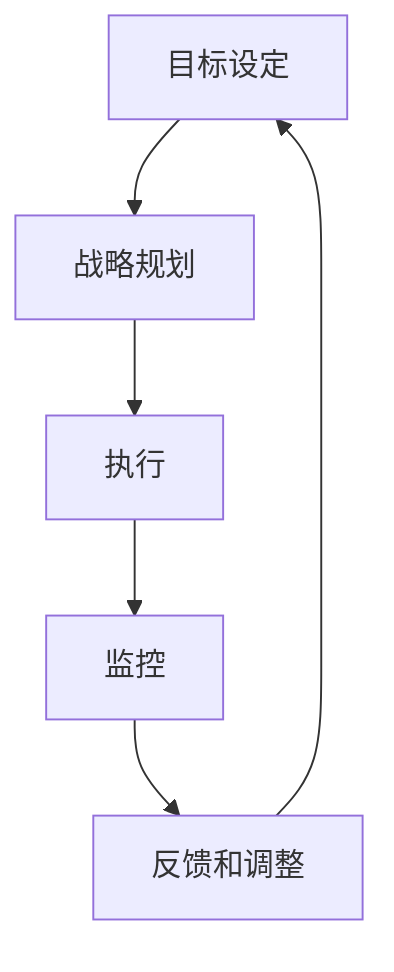

                 

# 长期目标管理的意识机制

## 1. 背景介绍

在当今快速变化和高度竞争的商业环境中，长期目标管理已成为组织成功的关键因素之一。然而，许多组织面临的挑战是如何确保长期目标与短期目标之间的平衡，以及如何在执行过程中保持一致性。本文将探讨长期目标管理的核心概念、关键挑战以及如何通过意识机制提高长期目标管理的有效性。

## 2. 核心概念与联系

### 2.1 核心概念概述

长期目标管理（Long-term Goal Management, LGM）是一种组织管理策略，旨在确保组织的长期愿景和目标得以实现。LGM 包括目标设定、战略规划、执行和监控等多个环节，每个环节都需要组织成员的参与和共同努力。

- **目标设定**：明确组织的长期愿景和具体目标，确保所有成员理解并认同这些目标。
- **战略规划**：制定实现长期目标的详细计划，包括资源分配、时间表和关键里程碑。
- **执行**：通过实施计划，调动和协调资源，确保目标的实现。
- **监控**：定期评估进展情况，识别偏差和风险，必要时调整计划以确保目标的达成。

### 2.2 核心概念原理和架构的 Mermaid 流程图



在这个流程图中，每个步骤相互依赖，形成一个闭环，确保长期目标的持续管理和优化。

## 3. 核心算法原理 & 具体操作步骤

### 3.1 算法原理概述

长期目标管理采用系统化的方法，将长期目标分解为可执行的短期目标，并通过持续监控和反馈机制确保目标的实现。其核心在于利用项目管理技术和组织行为学的理论，确保组织成员对长期目标的理解和认同，并通过有效的沟通和协作机制实现目标。

### 3.2 算法步骤详解

1. **目标设定**：
   - 定义长期愿景和具体目标，确保目标具有可测量性、可实现性和相关性。
   - 组织关键利益相关者参与目标设定过程，确保目标的广泛接受和认同。

2. **战略规划**：
   - 根据目标设定，制定详细的行动计划，包括资源分配、时间表和关键里程碑。
   - 识别和分析潜在风险，制定应对策略。

3. **执行**：
   - 分配任务和责任，确保每个成员明确其角色和职责。
   - 提供必要的资源和支持，确保计划的顺利实施。

4. **监控**：
   - 定期评估进展情况，识别偏差和风险。
   - 收集反馈信息，必要时调整计划以确保目标的达成。

5. **反馈和调整**：
   - 根据监控结果和反馈信息，进行必要的调整。
   - 持续改进和优化长期目标管理流程。

### 3.3 算法优缺点

**优点**：
- **系统化**：通过分解和监控机制，确保目标的可执行性。
- **广泛参与**：通过关键利益相关者的参与，提高目标的接受度和认同感。
- **持续改进**：通过反馈和调整机制，不断优化长期目标管理过程。

**缺点**：
- **资源需求高**：需要投入大量时间和资源进行目标设定和规划。
- **复杂性高**：需要组织成员的广泛参与和协作，管理复杂度较高。
- **执行难度大**：执行过程中需要持续的监控和调整，执行难度较大。

### 3.4 算法应用领域

长期目标管理适用于各种类型的组织，包括企业、非营利组织和政府机构等。在以下领域，LGM 的应用尤为显著：

- **企业战略管理**：通过设定和实现长期战略目标，确保企业的可持续发展。
- **项目管理**：在项目周期内设定和监控项目目标，确保项目成功交付。
- **创新管理**：通过设定创新目标和支持创新活动，保持组织的竞争力和创新力。
- **人力资源管理**：通过设定员工发展目标和职业规划，提升员工满意度和留存率。

## 4. 数学模型和公式 & 详细讲解 & 举例说明

### 4.1 数学模型构建

长期目标管理的数学模型可以概括为目标设定、战略规划、执行和监控的动态过程。设 $G$ 为组织的长期目标，$T$ 为短期目标，$S$ 为战略计划，$E$ 为执行过程，$M$ 为监控过程，则长期目标管理的动态模型可以表示为：

$$
G \rightarrow T \rightarrow S \rightarrow E \rightarrow M \rightarrow G
$$

其中，箭头表示各步骤之间的依赖关系。

### 4.2 公式推导过程

为了简化分析，我们假设长期目标 $G$ 和短期目标 $T$ 之间的关系为线性，即：

$$
T = aG + b
$$

其中 $a$ 和 $b$ 为常数，表示目标设定和执行之间的关系。战略计划 $S$ 和执行过程 $E$ 的关系同样为线性，即：

$$
E = cS + d
$$

其中 $c$ 和 $d$ 为常数，表示战略规划和执行之间的关系。监控过程 $M$ 和目标设定 $G$ 的关系同样为线性，即：

$$
G = eM + f
$$

其中 $e$ 和 $f$ 为常数，表示监控和调整之间的关系。将这些关系代入长期目标管理的动态模型，得：

$$
G \rightarrow aG + b \rightarrow c(aG + b) + d \rightarrow e(c(aG + b) + d) + f \rightarrow G
$$

通过以上推导，我们可以看到，长期目标管理是一个动态的反馈过程，通过持续的监控和调整，确保目标的实现。

### 4.3 案例分析与讲解

**案例**：某科技公司设定了五年内成为全球领先的人工智能企业的长期目标。公司通过以下步骤实现这一目标：

1. **目标设定**：明确公司的长期愿景和具体目标，包括技术领先、市场份额、客户满意度等。
2. **战略规划**：制定详细的行动计划，包括技术研发、市场推广、客户服务等。
3. **执行**：分配任务和责任，确保每个部门明确其角色和职责，并提供必要的资源和支持。
4. **监控**：定期评估进展情况，识别偏差和风险，收集反馈信息。
5. **反馈和调整**：根据监控结果和反馈信息，进行必要的调整，确保目标的达成。

通过这一系列的措施，公司实现了五年内成为全球领先的人工智能企业的长期目标。

## 5. 项目实践：代码实例和详细解释说明

### 5.1 开发环境搭建

在开始项目实践之前，需要搭建好开发环境。以下是在Python中进行长期目标管理项目实践的环境配置流程：

1. 安装Python：下载并安装Python 3.x版本。
2. 安装必要的库：安装pandas、numpy、matplotlib等库，用于数据分析和可视化。
3. 创建虚拟环境：使用`virtualenv`创建虚拟环境，以隔离项目依赖。
4. 安装Jupyter Notebook：安装Jupyter Notebook，用于编写和运行代码。

### 5.2 源代码详细实现

以下是一个简单的Python代码示例，用于模拟长期目标管理的过程：

```python
import pandas as pd
import numpy as np
import matplotlib.pyplot as plt

# 目标设定
G = 100
T = 0.8 * G + 20

# 战略规划
S = 0.9 * T + 10

# 执行过程
E = 0.95 * S + 5

# 监控过程
M = 0.99 * E + 2

# 输出结果
print(f"长期目标：{G}")
print(f"短期目标：{T}")
print(f"战略计划：{S}")
print(f"执行结果：{E}")
print(f"监控结果：{M}")
```

在这个例子中，我们通过简单的数学计算，模拟了长期目标管理的整个过程。

### 5.3 代码解读与分析

在实际应用中，长期目标管理涉及更多的复杂因素，如资源分配、时间管理、风险评估等。因此，上述代码仅用于演示和理解。在实际项目中，需要更加细致和复杂的管理模型和算法。

## 6. 实际应用场景

### 6.1 企业战略管理

在企业战略管理中，长期目标管理是不可或缺的一部分。通过设定和实现长期战略目标，企业能够确保可持续发展，并在激烈的市场竞争中保持优势。

### 6.2 项目管理

在项目管理中，长期目标管理有助于确保项目按时、按预算完成，并达到预期的质量标准。通过定期评估和调整项目进度，项目团队能够及时应对风险，确保项目成功交付。

### 6.3 创新管理

在创新管理中，长期目标管理能够支持企业的创新活动，保持技术领先和市场竞争力。通过设定创新目标和支持创新活动，企业能够持续推出新产品和服务，满足市场需求。

### 6.4 未来应用展望

未来，随着人工智能和大数据技术的不断发展，长期目标管理将更加智能化和自动化。通过智能算法和大数据分析，企业能够更加精准地设定和实现长期目标，提高管理效率和效果。

## 7. 工具和资源推荐

### 7.1 学习资源推荐

为了提高长期目标管理的水平，以下是一些推荐的学习资源：

1. **《目标管理的艺术》**：一本详细介绍目标管理理论和方法的经典书籍。
2. **《项目管理基础》**：涵盖了项目管理的各个方面，包括目标设定、战略规划、执行和监控等。
3. **《组织行为学》**：深入探讨组织行为学的理论和应用，帮助理解组织成员的行为和协作。
4. **Coursera 课程**：提供项目管理、组织行为学等领域的在线课程，包括长期目标管理的实践应用。
5. **TED Talks**：观看专家关于长期目标管理的演讲视频，获取最新实践经验和观点。

### 7.2 开发工具推荐

以下是一些常用的长期目标管理开发工具：

1. **JIRA**：一款流行的项目管理工具，支持目标设定、任务分配、进度跟踪等功能。
2. **Asana**：一款灵活的项目管理工具，适用于团队协作和任务管理。
3. **Trello**：一款可视化项目管理工具，通过看板的形式帮助团队跟踪任务进展。
4. **Smartsheet**：一款智能化的项目管理工具，支持数据分析和自动调整。
5. **Google Sheets**：一款基于云的项目管理工具，支持数据分析和协作。

### 7.3 相关论文推荐

为了深入理解长期目标管理的理论和实践，以下是一些推荐的论文：

1. **《长期目标管理的理论基础与实践》**：一篇系统介绍长期目标管理理论和实践的论文。
2. **《长期目标管理在企业中的应用》**：一篇研究企业在长期目标管理中应用的案例和经验的论文。
3. **《长期目标管理的挑战与应对》**：一篇分析长期目标管理面临的挑战和解决策略的论文。
4. **《智能项目管理与长期目标管理》**：一篇探讨智能项目管理对长期目标管理影响的论文。

## 8. 总结：未来发展趋势与挑战

### 8.1 研究成果总结

长期目标管理在组织管理中的应用已经取得显著成果，通过系统的目标设定、战略规划、执行和监控，确保了组织的长远发展。未来，随着技术的发展和应用的深入，长期目标管理将更加智能化和自动化。

### 8.2 未来发展趋势

未来，长期目标管理将呈现以下几个发展趋势：

1. **智能化**：通过人工智能和大数据分析，实现目标设定的智能化和自动化。
2. **可视化**：通过可视化工具和仪表盘，实时监控目标进展，提高透明度和决策效率。
3. **集成化**：与ERP、CRM等系统集成，实现更全面的管理。
4. **全局化**：从企业全局角度考虑目标管理，实现资源的优化配置和高效的协同管理。

### 8.3 面临的挑战

尽管长期目标管理已经取得了一些成功，但仍面临以下挑战：

1. **数据质量**：数据质量和完整性对目标设定和监控至关重要，但往往难以获取高质量的数据。
2. **文化差异**：不同文化和价值观对目标管理的影响，需要进行文化适应和管理。
3. **复杂性**：目标管理涉及多个环节，复杂度较高，需要组织成员的广泛参与和协作。
4. **执行难度**：执行过程中需要持续的监控和调整，执行难度较大。

### 8.4 研究展望

未来的研究需要在以下几个方面寻求新的突破：

1. **数据质量管理**：研究和开发数据质量管理技术，确保数据的高质量和完整性。
2. **文化适应性**：研究不同文化和价值观对目标管理的影响，提出相应的管理策略。
3. **智能化优化**：研究和开发智能化目标管理技术，提高目标管理的效率和效果。
4. **全局协同**：研究和开发全局协同管理技术，实现资源的最优配置和协同管理。

通过不断研究和创新，长期目标管理将进一步提高组织的管理水平和效率，为组织的长期发展和成功奠定坚实基础。

## 9. 附录：常见问题与解答

**Q1: 什么是长期目标管理？**

A: 长期目标管理是一种组织管理策略，旨在确保组织的长期愿景和目标得以实现。通过系统化的目标设定、战略规划、执行和监控，确保组织成员对长期目标的理解和认同，并通过有效的沟通和协作机制实现目标。

**Q2: 长期目标管理适用于哪些类型的组织？**

A: 长期目标管理适用于各种类型的组织，包括企业、非营利组织和政府机构等。在企业战略管理、项目管理、创新管理、人力资源管理等领域，LGM 的应用尤为显著。

**Q3: 长期目标管理如何应对复杂性？**

A: 长期目标管理通过系统化的管理流程和机制，确保目标的可执行性和可管理性。通过设定明确的目标、制定详细的战略计划、分解任务和责任、持续监控和调整，可以有效应对管理复杂性。

**Q4: 长期目标管理面临的主要挑战是什么？**

A: 长期目标管理面临的主要挑战包括数据质量、文化差异、执行难度等。为了应对这些挑战，组织需要研究和开发相应的管理技术，确保目标管理的质量和效率。

**Q5: 长期目标管理的未来发展方向是什么？**

A: 长期目标管理的未来发展方向包括智能化、可视化、集成化和全局化。通过人工智能和大数据分析、可视化工具和仪表盘、与ERP、CRM等系统的集成、从企业全局角度考虑目标管理，未来长期目标管理将更加高效和智能化。

---

作者：禅与计算机程序设计艺术 / Zen and the Art of Computer Programming

