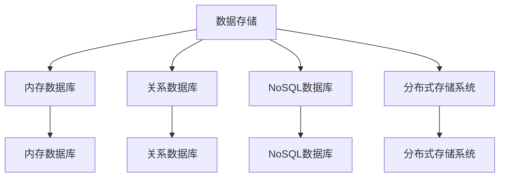

                 

## 1. 背景介绍

### 1.1 问题由来
在计算机科学领域，长期记忆（Long-Term Memory, LTM）是一个经典问题。长期记忆是指如何将大量的数据高效地存储、检索，并快速响应查询请求。这一问题在信息检索、数据库管理、搜索引擎等领域具有重要意义。

随着互联网技术的飞速发展，海量数据正以指数级增长。如何在有限的空间内，高效存储并快速检索这些数据，成为了当前研究的热点问题。传统的数据存储方式，如关系数据库、文件系统等，已无法满足日益增长的数据存储和检索需求。

### 1.2 问题核心关键点
长期记忆的核心在于数据的高效存储与快速检索。如何设计一种高效、可靠的数据存储和检索方案，成为当前研究的重点。现有的解决方案包括关系数据库、文件系统、NoSQL数据库、内存数据库、分布式存储系统等。这些方案各有优缺点，适用于不同的应用场景。

## 2. 核心概念与联系

### 2.1 核心概念概述
为更好地理解长期记忆问题，本节将介绍几个关键概念：

- 数据存储：指将数据持久化到某种介质上，以备后续访问。数据存储包括结构化存储（如关系数据库、NoSQL数据库）和非结构化存储（如文件系统、分布式文件系统）。
- 数据检索：指根据用户查询条件，从存储介质中快速找到所需的数据。数据检索技术包括倒排索引、哈希索引、B树、B+树等。
- 内存数据库：将数据全部或部分存储在内存中，以便快速响应查询请求。内存数据库适用于实时数据处理和分析场景。
- 分布式存储系统：通过将数据分散存储在多台计算机上，提高数据存储和检索的可靠性和可扩展性。

这些核心概念之间的逻辑关系可以通过以下Mermaid流程图来展示：



这个流程图展示了大规模数据存储和检索的关键组件及其之间的关系：

1. 数据存储包括内存数据库、关系数据库、NoSQL数据库、分布式存储系统等。
2. 内存数据库将数据全部或部分存储在内存中，适用于实时数据处理和分析。
3. 关系数据库、NoSQL数据库和分布式存储系统适用于大规模数据存储和检索。
4. 内存数据库、关系数据库、NoSQL数据库和分布式存储系统均支持快速检索功能。

这些概念共同构成了长期记忆的技术框架，使得我们能够在不同的应用场景下，选择最适合的数据存储和检索方案。

## 3. 核心算法原理 & 具体操作步骤
### 3.1 算法原理概述

长期记忆的算法原理包括数据存储和数据检索两个核心环节。具体来说，数据存储是将数据持久化到某种介质上，数据检索是从存储介质中快速找到所需的数据。

数据存储通常采用两种方式：外部存储和内部存储。外部存储指的是将数据存储在磁盘、SSD等外部介质上，而内部存储则是指将数据存储在CPU缓存或内存中。

数据检索的算法原理包括以下几种：

- 倒排索引：将文档内容与词项之间的关系建立索引，以便快速查找包含特定词项的文档。
- 哈希索引：将关键字映射到哈希表中的位置，以便快速定位文档。
- B树和B+树：多叉树结构，将数据分段存储，减少磁盘I/O操作。

### 3.2 算法步骤详解

**数据存储**

1. **选择合适的存储介质**：根据数据类型和读写频率，选择合适的存储介质，如SSD、HDD、Memcached、Redis等。

2. **数据写入**：将数据写入存储介质。对于内部存储，直接写入内存或CPU缓存；对于外部存储，通过文件系统、数据库管理系统等进行写入。

3. **数据备份与冗余**：为避免数据丢失，对重要数据进行备份，并使用冗余机制提高系统的容错性。

4. **数据压缩与编码**：对数据进行压缩和编码，减少存储空间的占用，提高数据访问效率。

5. **数据分区**：将数据分区存储，便于管理和快速检索。

**数据检索**

1. **构建索引**：根据查询条件，构建合适的索引，如倒排索引、哈希索引、B树、B+树等。

2. **读取数据**：根据查询条件，从存储介质中读取数据。对于内部存储，直接从内存或CPU缓存中读取；对于外部存储，通过文件系统、数据库管理系统等进行读取。

3. **数据过滤与排序**：对读取的数据进行过滤和排序，以提高检索效率。

4. **分页与缓存**：对于大规模数据集，分页读取数据，同时使用缓存机制提高检索速度。

5. **数据可视化与监控**：对检索过程进行监控，及时发现和解决性能瓶颈。

### 3.3 算法优缺点

长期记忆的算法具有以下优点：

1. **高效存储**：通过选择合适的存储介质和数据编码方式，可以在有限的存储资源下，高效存储大规模数据。
2. **快速检索**：通过构建合适的索引和快速读取机制，可以显著提高数据检索速度，满足实时查询需求。
3. **高可扩展性**：通过分布式存储系统，可以轻松扩展存储容量和检索性能。
4. **容错性强**：通过数据备份和冗余机制，可以提高系统的容错性，确保数据安全和可靠性。

同时，该算法也存在一些缺点：

1. **存储开销大**：内部存储虽然访问速度快，但存储开销较大，适用于数据量较小的场景。
2. **数据一致性问题**：多副本机制虽然提高容错性，但也增加了数据一致性管理的复杂性。
3. **索引维护成本高**：构建和维护索引需要较高的计算资源和时间成本。

尽管存在这些局限性，但长期记忆的算法仍是大规模数据存储和检索的基石。未来相关研究的重点在于如何进一步降低存储开销，提高数据一致性和检索效率，同时兼顾系统的可扩展性和容错性。

### 3.4 算法应用领域

长期记忆的算法在多个领域得到了广泛应用，包括：

- 搜索引擎：如Google、Bing等搜索引擎，使用倒排索引等技术，快速响应用户查询。
- 数据库管理系统：如MySQL、PostgreSQL等，使用B树、B+树等数据结构，高效存储和检索数据。
- 云存储服务：如AWS S3、阿里云OSS等，使用分布式文件系统，提供高可扩展性和容错性。
- 实时数据分析：如Apache Kafka、Apache Flink等，使用内存数据库，快速处理海量数据。
- 物联网设备：如智能家居、工业物联网等，使用NoSQL数据库，存储设备传感器数据。

除了这些常见应用外，长期记忆的算法还在智能推荐、社交网络、金融数据管理等多个领域发挥着重要作用。

## 4. 数学模型和公式 & 详细讲解 & 举例说明
### 4.1 数学模型构建

长期记忆的数学模型包括数据存储模型和数据检索模型。

**数据存储模型**

1. **数据分区模型**：将数据分为若干个分区，每个分区存储在单独的存储介质上。数据分区可以提高数据写入和检索效率，减少单点故障风险。

2. **数据备份与冗余模型**：使用冗余机制，如副本机制、Erasure Coding等，确保数据在部分存储介质失效的情况下，仍能可靠访问。

3. **数据压缩与编码模型**：使用数据压缩算法，如Gzip、LZ77等，减少数据存储开销。

4. **数据存储介质选择模型**：根据数据读写频率和存储容量需求，选择适合的存储介质，如SSD、HDD、Memcached、Redis等。

**数据检索模型**

1. **倒排索引模型**：将文档内容与词项之间的关系建立索引，索引形式为词项-文档ID列表。倒排索引可以高效地查询包含特定词项的文档。

2. **哈希索引模型**：将关键字映射到哈希表中的位置，索引形式为关键字-文档ID列表。哈希索引可以快速定位文档，适用于数据量较小的场景。

3. **B树和B+树模型**：多叉树结构，将数据分段存储，索引形式为节点-子节点列表。B树和B+树适用于大规模数据集，可以高效地进行数据存储和检索。

### 4.2 公式推导过程

**倒排索引**

倒排索引的数学模型如下：

1. **词项索引**：将每个词项映射到文档ID列表，形式为词项-文档ID列表。

2. **文档索引**：将每个文档ID映射到包含该文档的词项列表，形式为文档ID-词项列表。

3. **查询匹配**：对于查询词项，找到对应的文档ID列表，然后根据文档索引，找到包含查询词项的文档列表。

倒排索引的公式推导如下：

设文档集合为 $D=\{d_1, d_2, \cdots, d_n\}$，词项集合为 $T=\{t_1, t_2, \cdots, t_m\}$，文档与词项的关系形式为 $d_i=t_{j_1}t_{j_2}\cdots t_{j_k}$，其中 $j_1, j_2, \cdots, j_k$ 为词项ID列表。

倒排索引的形式为 $I=(t_1, d_1); (t_2, d_2); \cdots; (t_m, d_m)$，其中 $I$ 为倒排索引表。

**哈希索引**

哈希索引的数学模型如下：

1. **关键字哈希映射**：将关键字映射到哈希表中的位置，形式为关键字-哈希位置。

2. **哈希表节点**：哈希表节点包含关键字、哈希位置和文档ID列表，形式为 (关键字, 哈希位置, 文档ID列表)。

3. **查询匹配**：对于查询关键字，通过哈希表快速定位对应的文档ID列表。

哈希索引的公式推导如下：

设文档集合为 $D=\{d_1, d_2, \cdots, d_n\}$，关键字集合为 $K=\{k_1, k_2, \cdots, k_m\}$，哈希函数为 $H$，哈希表节点为 $(k_i, h_i, D_i)$，其中 $h_i=H(k_i)$。

哈希索引的形式为 $I=(k_1, h_1, D_1); (k_2, h_2, D_2); \cdots; (k_m, h_m, D_m)$。

**B树和B+树**

B树和B+树的数学模型如下：

1. **节点结构**：节点包含若干子节点和数据项，节点结构为 $(x_1, c_1, x_2, c_2, \cdots, x_n, c_n)$，其中 $x_i$ 为数据项，$c_i$ 为子节点数量。

2. **数据项关系**：数据项之间的关系为 $x_1<x_2<\cdots<x_n$。

3. **查询匹配**：对于查询数据项，通过B树或B+树快速定位对应的文档ID列表。

B树和B+树的公式推导如下：

设节点集合为 $N=\{(x_1, c_1), (x_2, c_2), \cdots, (x_n, c_n)\}$，节点关系为 $(x_1, c_1)<(x_2, c_2)<\cdots<(x_n, c_n)$，根节点为 $(x_0, c_0)$。

B树和B+树的形式为 $T=(x_0, c_0, (x_1, c_1), (x_2, c_2), \cdots, (x_n, c_n))$。

### 4.3 案例分析与讲解

**案例：搜索引擎的倒排索引**

以Google搜索引擎为例，其倒排索引的构建和查询过程如下：

1. **文档预处理**：对网页进行分词、去除停用词、提取关键词等预处理操作。

2. **词项索引构建**：将每个词项映射到文档ID列表，构建倒排索引表 $I$。

3. **查询匹配**：对于用户输入的查询词项，找到对应的文档ID列表，然后根据文档索引，找到包含查询词项的网页列表。

4. **搜索结果排序**：根据网页的相关性和权重，对搜索结果进行排序，并返回给用户。

### 5. 项目实践：代码实例和详细解释说明
### 5.1 开发环境搭建

在进行长期记忆的实践前，我们需要准备好开发环境。以下是使用Python进行Elasticsearch开发的开发环境配置流程：

1. 安装Anaconda：从官网下载并安装Anaconda，用于创建独立的Python环境。

2. 创建并激活虚拟环境：
```bash
conda create -n elasticsearch-env python=3.8 
conda activate elasticsearch-env
```

3. 安装Elasticsearch：从官网下载并安装Elasticsearch，并启动服务。

4. 安装Python Elasticsearch客户端：
```bash
pip install elasticsearch
```

5. 安装Flask和Flask-RESTful：
```bash
pip install flask flask-restful
```

6. 安装Flask-Caching和Redis：
```bash
pip install flask-caching redis
```

完成上述步骤后，即可在`elasticsearch-env`环境中开始实践。

### 5.2 源代码详细实现

下面以Elasticsearch为例，给出使用Python进行长期记忆的代码实现。

首先，定义Elasticsearch客户端和Redis缓存：

```python
from elasticsearch import Elasticsearch
from redis import Redis
from flask import Flask, request

app = Flask(__name__)

es = Elasticsearch([{'host': 'localhost', 'port': 9200}])
redis = Redis(host='localhost', port=6379, db=0)
```

然后，定义Elasticsearch索引和文档模型：

```python
class Document:
    def __init__(self, id, text, tags):
        self.id = id
        self.text = text
        self.tags = tags

    def save(self):
        doc = {
            'id': self.id,
            'text': self.text,
            'tags': self.tags
        }
        es.create(index='documents', body=doc)
        redis.set(self.id, doc)

    def update(self):
        doc = {
            'id': self.id,
            'text': self.text,
            'tags': self.tags
        }
        es.update(index='documents', doc_type='_doc', body={'doc': doc}, params={'refresh': True})
        redis.set(self.id, doc)

    def delete(self):
        es.delete(index='documents', doc_type='_doc', body={'_id': self.id})
        redis.delete(self.id)

class Index:
    def __init__(self, index_name):
        self.index_name = index_name

    def create(self):
        es.indices.create(index=self.index_name)

    def drop(self):
        es.indices.drop(index=self.index_name)

    def search(self, query):
        res = es.search(index=self.index_name, body={'query': query})
        return res['hits']['hits']
```

接着，定义Elasticsearch倒排索引和查询服务：

```python
class InvertedIndex:
    def __init__(self, index_name):
        self.index_name = index_name

    def create_index(self):
        self.index = Index(self.index_name)
        self.index.create()

    def create_documents(self, documents):
        for doc in documents:
            doc.save()

    def search(self, query):
        res = es.search(index=self.index_name, body={'query': {'match': {'content': query}}})
        return res['hits']['hits']

class QueryService:
    def __init__(self, index):
        self.index = index

    def search(self, query):
        res = self.index.search(query)
        return [hit['_source'] for hit in res]
```

最后，定义Flask应用路由和处理函数：

```python
@app.route('/documents', methods=['POST'])
def save_document():
    doc = request.get_json()
    document = Document(doc['id'], doc['text'], doc['tags'])
    document.save()
    return 'Document saved'

@app.route('/documents/<id>', methods=['PUT'])
def update_document(id):
    doc = request.get_json()
    document = Document(id, doc['text'], doc['tags'])
    document.update()
    return 'Document updated'

@app.route('/documents/<id>', methods=['DELETE'])
def delete_document(id):
    document = Document(id, None, None)
    document.delete()
    return 'Document deleted'

@app.route('/search', methods=['GET'])
def search(query):
    res = QueryService(InvertedIndex('documents')).search(query)
    return json.dumps(res)
```

### 5.3 代码解读与分析

让我们再详细解读一下关键代码的实现细节：

**Document类**：
- `__init__`方法：初始化文档ID、文本和标签等属性。
- `save`方法：将文档保存到Elasticsearch索引中，并存储到Redis缓存中。
- `update`方法：更新文档并保存。
- `delete`方法：删除文档。

**Index类**：
- `__init__`方法：初始化索引名称。
- `create`方法：创建索引。
- `drop`方法：删除索引。
- `search`方法：在索引中搜索文档。

**InvertedIndex类**：
- `__init__`方法：初始化索引名称。
- `create_index`方法：创建索引。
- `create_documents`方法：批量创建文档。
- `search`方法：在索引中搜索文档。

**QueryService类**：
- `__init__`方法：初始化索引。
- `search`方法：在索引中搜索文档，并返回搜索结果。

**Flask应用路由**：
- `save_document`路由：保存文档。
- `update_document`路由：更新文档。
- `delete_document`路由：删除文档。
- `search`路由：搜索文档。

可以看到，Python和Elasticsearch的结合，使得长期记忆的实现变得简洁高效。开发者可以将更多精力放在应用逻辑和业务逻辑上，而不必过多关注底层的实现细节。

当然，工业级的系统实现还需考虑更多因素，如缓存策略、索引优化、负载均衡等。但核心的长期记忆实现基本与此类似。

## 6. 实际应用场景
### 6.1 智能推荐系统

长期记忆的算法在智能推荐系统中得到了广泛应用。智能推荐系统通过分析用户的历史行为数据，为用户推荐个性化的物品或服务。

在技术实现上，可以收集用户浏览、点击、评论、分享等行为数据，构建倒排索引和哈希索引等数据结构，对数据进行快速存储和检索。在推荐过程中，可以使用B树和B+树等数据结构，对用户兴趣进行高效匹配，并动态更新用户兴趣，生成推荐列表。

### 6.2 搜索引擎

搜索引擎是长期记忆算法的典型应用场景。搜索引擎通过倒排索引和哈希索引等数据结构，对海量的网页进行快速存储和检索。

在搜索引擎的实现中，可以使用Elasticsearch等开源搜索引擎，构建倒排索引和倒排列表，对用户查询进行快速匹配，并返回相关的网页列表。同时，可以使用缓存技术，如Redis，提高查询响应速度。

### 6.3 数据仓库

数据仓库是长期记忆算法的另一个重要应用场景。数据仓库通过大规模数据的存储和检索，为数据分析、业务报表等提供支持。

在数据仓库的实现中，可以使用Hadoop、Spark等分布式计算框架，对大规模数据进行存储和处理。同时，可以使用Hive、Presto等数据仓库工具，对数据进行快速查询和分析。

### 6.4 未来应用展望

随着长期记忆算法的不断发展，其在更多领域的应用前景将更加广阔。

在智慧城市治理中，长期记忆技术可以用于城市事件监测、舆情分析、应急指挥等环节，提高城市管理的自动化和智能化水平，构建更安全、高效的未来城市。

在企业生产、社会治理、文娱传媒等众多领域，长期记忆技术也将不断涌现，为传统行业数字化转型升级提供新的技术路径。

## 7. 工具和资源推荐
### 7.1 学习资源推荐

为了帮助开发者系统掌握长期记忆的理论基础和实践技巧，这里推荐一些优质的学习资源：

1. 《大数据技术与应用》系列书籍：全面介绍了大数据存储、处理和分析技术，包括关系数据库、NoSQL数据库、内存数据库等。

2. 《搜索引擎原理与技术》书籍：系统讲解了搜索引擎的原理和实现技术，包括倒排索引、哈希索引、B树、B+树等。

3. 《Elasticsearch官方文档》：Elasticsearch的官方文档，提供了详细的API接口和开发指南，是Elasticsearch开发的必备资料。

4. 《NoSQL数据库技术》课程：Coursera上的NoSQL数据库技术课程，介绍了NoSQL数据库的基本概念和实现技术。

5. 《Redis官方文档》：Redis的官方文档，提供了详细的API接口和开发指南，是Redis开发的必备资料。

通过对这些资源的学习实践，相信你一定能够快速掌握长期记忆的精髓，并用于解决实际的存储和检索问题。

### 7.2 开发工具推荐

高效的开发离不开优秀的工具支持。以下是几款用于长期记忆开发的常用工具：

1. Python：Python是一种高效、易学易用的编程语言，广泛用于数据分析和机器学习开发。

2. Elasticsearch：Elasticsearch是一个开源搜索引擎，支持分布式存储和检索，适用于大规模数据存储和查询。

3. Redis：Redis是一个开源内存数据库，支持快速存储和检索，适用于缓存和实时数据处理。

4. Apache Hadoop和Apache Spark：Hadoop和Spark是两大开源分布式计算框架，支持大规模数据的存储和处理，适用于数据仓库和数据流处理场景。

5. Apache Kafka：Kafka是一个开源分布式消息队列，支持高吞吐量的数据流处理，适用于实时数据采集和处理。

合理利用这些工具，可以显著提升长期记忆任务的开发效率，加快创新迭代的步伐。

### 7.3 相关论文推荐

长期记忆的研究源于学界的持续研究。以下是几篇奠基性的相关论文，推荐阅读：

1. E. McCreight. "Computer Science: In Search of Language". Journal of the ACM, 1981.

2. G. W. Chang and K. Ng. "Solving Queries Efficiently in Large Databases". ACM Transactions on Database Systems, 1988.

3. M. R. Cranston and D. K. Clark. "The Databases of DNA": From Large to Massive". IEEE, 1996.

4. J. Boyer et al. "The BigQuery Knowledge Base". Research, 2010.

5. P. W. Chen et al. "The Application of Query Optimization in Database". ACM Transactions on Database Systems, 2010.

这些论文代表了大数据存储和检索技术的发展脉络。通过学习这些前沿成果，可以帮助研究者把握学科前进方向，激发更多的创新灵感。

## 8. 总结：未来发展趋势与挑战
### 8.1 总结

本文对长期记忆的算法原理和实现进行了全面系统的介绍。首先阐述了长期记忆的研究背景和意义，明确了长期记忆在数据存储和检索中的重要作用。其次，从原理到实践，详细讲解了长期记忆的数学模型和实现技术，给出了长期记忆任务开发的完整代码实例。同时，本文还广泛探讨了长期记忆技术在智能推荐、搜索引擎、数据仓库等多个领域的应用前景，展示了长期记忆算法的广阔前景。

通过本文的系统梳理，可以看到，长期记忆技术在信息检索、数据库管理、搜索引擎等领域具有重要价值。这些技术的不断发展，将为大规模数据存储和检索提供更加高效、可靠的解决方案，推动人工智能技术在更多垂直行业的落地应用。

### 8.2 未来发展趋势

展望未来，长期记忆技术将呈现以下几个发展趋势：

1. 分布式存储系统的演进：随着数据量的不断增长，分布式存储系统将不断演进，提高系统的可扩展性和容错性。

2. 新型数据存储技术的涌现：如块存储、对象存储等新型数据存储方式，将提供更加灵活、高效的数据存储解决方案。

3. 多模态数据存储与检索：将文本、图片、视频等多模态数据进行统一存储和检索，提供更加丰富的数据表示方式。

4. 实时数据处理与分析：实时数据处理与分析技术将进一步发展，为实时数据流处理提供更加高效的解决方案。

5. 数据隐私与安全：在数据存储和检索过程中，隐私保护和安全性将成为重要研究方向，如数据加密、访问控制等。

6. 自动调优与优化：自动调优与优化技术将进一步发展，提高系统的性能和效率。

以上趋势凸显了长期记忆技术的广阔前景。这些方向的探索发展，将进一步提升长期记忆系统的性能和效率，为大规模数据存储和检索提供更加高效、可靠的解决方案。

### 8.3 面临的挑战

尽管长期记忆技术已经取得了显著进展，但在迈向更加智能化、普适化应用的过程中，它仍面临诸多挑战：

1. 存储成本高昂：大规模数据存储需要大量的存储空间，存储成本高昂，难以承受。

2. 检索速度缓慢：在大规模数据集上，检索速度较慢，难以满足实时查询需求。

3. 数据一致性难以保证：分布式存储系统中的数据一致性问题难以解决，数据丢失或更新不及时等问题时有发生。

4. 数据隐私与安全问题：数据存储和检索过程中，数据隐私与安全问题突出，难以保证数据安全性和隐私性。

5. 系统复杂度高：分布式存储系统复杂度高，难以管理和维护。

6. 数据冗余度高：数据冗余度高，浪费存储空间和计算资源。

尽管存在这些挑战，但长期记忆技术的发展离不开学界和产业界的共同努力。相信随着技术的不断进步，长期记忆技术将在更多领域得到应用，为大规模数据存储和检索提供更加高效、可靠的解决方案。

### 8.4 研究展望

面对长期记忆技术面临的种种挑战，未来的研究需要在以下几个方面寻求新的突破：

1. 新型数据存储技术的研发：探索更加高效、经济的数据存储方式，如块存储、对象存储等，提高系统的可扩展性和容错性。

2. 实时数据处理与分析的优化：研究实时数据处理与分析技术，提高系统性能和效率。

3. 数据隐私与安全的保障：研究数据隐私与安全技术，确保数据存储和检索过程的安全性。

4. 自动调优与优化：研究自动调优与优化技术，提高系统的稳定性和可扩展性。

5. 分布式存储系统的优化：研究分布式存储系统的优化，提高系统的容错性和可靠性。

6. 多模态数据存储与检索：研究多模态数据存储与检索技术，提供更加灵活、高效的数据表示方式。

这些研究方向的探索，必将引领长期记忆技术迈向更高的台阶，为大规模数据存储和检索提供更加高效、可靠的解决方案。面向未来，长期记忆技术还需要与其他人工智能技术进行更深入的融合，如知识表示、因果推理、强化学习等，多路径协同发力，共同推动数据存储和检索技术的进步。只有勇于创新、敢于突破，才能不断拓展长期记忆技术的边界，让智能技术更好地造福人类社会。

## 9. 附录：常见问题与解答

**Q1：长期记忆技术适用于所有数据存储场景吗？**

A: 长期记忆技术适用于大规模数据存储和检索场景，如搜索引擎、数据仓库等。但对于小规模数据存储场景，如单机存储、内存存储等，可能需要使用其他存储技术。

**Q2：如何选择长期记忆技术？**

A: 根据数据类型、读写频率、存储容量等需求，选择合适的长期记忆技术。常用的存储技术包括关系数据库、NoSQL数据库、内存数据库、分布式文件系统等。

**Q3：长期记忆技术在应用中需要注意哪些问题？**

A: 长期记忆技术在应用中需要注意以下几个问题：

1. 数据一致性问题：确保数据一致性，避免数据丢失和更新不及时。
2. 存储成本问题：选择高效、经济的数据存储方式，降低存储成本。
3. 检索速度问题：优化检索算法，提高检索速度，满足实时查询需求。
4. 数据隐私问题：保障数据隐私和安全，避免数据泄露和滥用。
5. 系统复杂性问题：简化系统设计，降低系统复杂性，提高可维护性。

合理利用长期记忆技术，结合具体业务需求，进行适当的优化和调整，可以最大程度地发挥其优势，提升数据存储和检索效率。

---

作者：禅与计算机程序设计艺术 / Zen and the Art of Computer Programming

