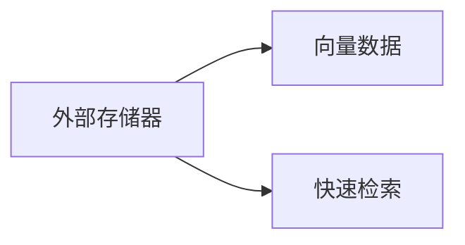

                 

# 长期记忆：外部向量存储与快速检索

在深度学习时代，模型越来越复杂，计算需求越来越高，传统内存存储已经难以满足大型模型和海量数据的处理需求。为解决这一问题，引入了外部存储器，借助文件系统或数据库系统存储向量数据，并采用快速检索技术，使得模型能够在高效地处理大规模数据集的同时，保持较高的内存利用率。本文将深入探讨外部向量存储和快速检索技术，帮助读者理解如何在大规模数据集上实现长期记忆的存储和快速检索，提高深度学习模型的效率和性能。

## 1. 背景介绍

### 1.1 问题由来
随着深度学习在图像、语音、自然语言处理等领域的广泛应用，模型规模不断增大，数据量不断增长。大模型和海量数据带来了巨大的计算需求，传统的内存存储已经难以应对。为了解决这一问题，研究人员开发出了外部存储器，即通过将数据部分或全部存储在外部存储器（如硬盘、SSD）中，结合快速检索技术，实现对海量数据的有效管理。

### 1.2 问题核心关键点
外部向量存储和快速检索技术涉及的核心概念包括：

1. **外部存储器**：用于存储数据的外部设备，包括硬盘、SSD等，具有容量大、价格低、可靠性高等优点。
2. **向量数据**：深度学习模型中常用的数据类型，如词向量、图像特征向量等，通常为高维稀疏数据。
3. **快速检索**：用于在大量数据中高效查找和访问特定数据的技术，如索引、哈希、LSH等。

这些核心概念之间的逻辑关系可以通过以下Mermaid流程图来展示：



此图展示了外部存储器存储向量数据，并通过快速检索技术进行数据检索的过程。

## 2. 核心概念与联系

### 2.1 核心概念概述

外部向量存储与快速检索技术是深度学习领域中用于处理大规模数据的关键技术。它们的核心目标是在保证高效计算的同时，避免内存资源不足的问题，实现对海量数据的高效管理和快速检索。

- **外部存储器**：指用于存储数据的物理设备，如硬盘、SSD等。具有容量大、价格低、可靠性高等优点，但读取速度较慢。
- **向量数据**：指深度学习模型中常用的高维稀疏数据，如词向量、图像特征向量等。这些数据通常占用的内存空间较大，难以全部存储在内存中。
- **快速检索**：指在大量数据中高效查找和访问特定数据的技术，如索引、哈希、LSH等。通过快速检索技术，可以在外部存储器中快速定位所需的数据，提高数据检索效率。

### 2.2 核心概念原理和架构

外部向量存储与快速检索技术的核心原理是通过将数据部分或全部存储在外部存储器中，结合快速检索技术，实现对海量数据的高效管理。

#### 2.2.1 外部存储器
外部存储器主要包括硬盘和SSD等物理设备，其工作原理如下：

1. **硬盘**：机械结构，通过磁盘旋转读取数据。读取速度较慢，但容量大、价格低、可靠性高。
2. **SSD**：固态存储器，通过NAND Flash读取数据。读取速度快，但容量较小、价格较高。

#### 2.2.2 向量数据
向量数据是深度学习模型中常用的高维稀疏数据，如词向量、图像特征向量等。这些数据通常占用的内存空间较大，难以全部存储在内存中。

#### 2.2.3 快速检索
快速检索技术用于在大量数据中高效查找和访问特定数据。常见的快速检索技术包括：

1. **索引**：通过构建数据索引，快速定位所需的数据。常见的索引包括倒排索引、B树索引等。
2. **哈希**：通过哈希函数将数据映射为固定长度的哈希值，实现快速查找。常见的哈希算法包括Bloom Filter、Cuckoo Filter等。
3. **局部敏感哈希（LSH）**：通过将数据映射为哈希桶，实现快速近似检索。

## 3. 核心算法原理 & 具体操作步骤

### 3.1 算法原理概述

外部向量存储与快速检索技术的核心目标是在保证高效计算的同时，避免内存资源不足的问题，实现对海量数据的高效管理和快速检索。

外部向量存储与快速检索技术的核心原理是通过将数据部分或全部存储在外部存储器中，结合快速检索技术，实现对海量数据的高效管理。

### 3.2 算法步骤详解

#### 3.2.1 数据分块
将大规模数据集分成多个小规模块，每个块的大小根据内存可用空间和计算需求进行优化。

#### 3.2.2 数据存储
将数据块存储在外部存储器中，如硬盘或SSD。数据块的大小应根据内存可用空间和计算需求进行优化。

#### 3.2.3 数据检索
根据查询需求，从外部存储器中检索数据块，并利用快速检索技术在数据块中查找所需数据。常见的快速检索技术包括索引、哈希、LSH等。

#### 3.2.4 数据处理
将检索到的数据块加载到内存中，并进行计算处理。计算过程中，应考虑内存利用率和计算效率的平衡。

#### 3.2.5 数据回存
将计算结果保存回外部存储器中，以便后续使用。数据回存时应考虑数据的持久性和可靠性。

### 3.3 算法优缺点

外部向量存储与快速检索技术的优点包括：

1. 高效利用内存：通过将数据部分或全部存储在外部存储器中，避免内存资源不足的问题。
2. 高效检索：结合快速检索技术，实现对海量数据的快速查找和访问。
3. 可靠性高：外部存储器通常具有高可靠性，能够保障数据的持久性和安全性。

其缺点包括：

1. 数据读取速度慢：外部存储器的读取速度较慢，影响模型训练和推理的速度。
2. 数据写入速度慢：数据写入外部存储器的时间较长，影响模型的训练和推理效率。

### 3.4 算法应用领域

外部向量存储与快速检索技术广泛应用于深度学习模型的训练和推理中，特别是在处理大规模数据集时。

- **自然语言处理（NLP）**：用于处理大规模语料库中的文本数据，如词向量、句子向量等。
- **计算机视觉（CV）**：用于处理大规模图像数据，如图像特征向量等。
- **推荐系统**：用于处理用户行为数据和商品特征数据，实现个性化推荐。
- **自然语言生成（NLG）**：用于处理大规模文本数据，如生成文章、对话等。

## 4. 数学模型和公式 & 详细讲解 & 举例说明

### 4.1 数学模型构建

外部向量存储与快速检索技术的主要数学模型包括向量数据模型和快速检索模型。

#### 4.1.1 向量数据模型
向量数据模型用于描述高维稀疏数据，如词向量、图像特征向量等。

#### 4.1.2 快速检索模型
快速检索模型用于描述在大量数据中高效查找和访问特定数据的技术。常见的快速检索模型包括索引模型、哈希模型和LSH模型。

### 4.2 公式推导过程

#### 4.2.1 索引模型
索引模型通过构建数据索引，快速定位所需的数据。常见的索引模型包括倒排索引和B树索引。

#### 4.2.2 哈希模型
哈希模型通过哈希函数将数据映射为固定长度的哈希值，实现快速查找。常见的哈希算法包括Bloom Filter和Cuckoo Filter。

#### 4.2.3 LSH模型
LSH模型通过将数据映射为哈希桶，实现快速近似检索。

### 4.3 案例分析与讲解

#### 4.3.1 索引模型案例
假设我们有一大规模文本语料库，需要快速查找某个关键词的出现位置。我们可以构建倒排索引，将每个词的出现位置记录下来，快速定位所需的数据。

#### 4.3.2 哈希模型案例
假设我们需要快速判断一个URL是否在已访问过的URL列表中，可以使用Bloom Filter实现高效的查找。Bloom Filter通过哈希函数将URL映射为多个哈希值，并在多个桶中标记为存在或不存在，实现快速的查找和判断。

#### 4.3.3 LSH模型案例
假设我们需要在大型图像数据库中检索相似图像，可以使用LSH实现高效的近似检索。LSH将图像特征向量映射为多个哈希桶，并根据哈希桶的分布，快速定位相似图像。

## 5. 项目实践：代码实例和详细解释说明

### 5.1 开发环境搭建

#### 5.1.1 安装依赖库
安装所需的依赖库，包括NumPy、Pandas、scikit-learn等。

#### 5.1.2 搭建环境
使用Python搭建深度学习开发环境，并配置好相关的库和工具。

### 5.2 源代码详细实现

#### 5.2.1 数据分块
将大规模数据集分成多个小规模块，每个块的大小根据内存可用空间和计算需求进行优化。

#### 5.2.2 数据存储
将数据块存储在外部存储器中，如硬盘或SSD。数据块的大小应根据内存可用空间和计算需求进行优化。

#### 5.2.3 数据检索
根据查询需求，从外部存储器中检索数据块，并利用快速检索技术在数据块中查找所需数据。

#### 5.2.4 数据处理
将检索到的数据块加载到内存中，并进行计算处理。计算过程中，应考虑内存利用率和计算效率的平衡。

#### 5.2.5 数据回存
将计算结果保存回外部存储器中，以便后续使用。数据回存时应考虑数据的持久性和可靠性。

### 5.3 代码解读与分析

#### 5.3.1 数据分块
```python
import numpy as np

# 定义数据集大小
total_data_size = 100000000

# 定义每个数据块的大小
block_size = 1000000

# 计算数据块数量
num_blocks = total_data_size // block_size

# 数据分块
data_chunks = [data[i:i+block_size] for i in range(0, total_data_size, block_size)]
```

#### 5.3.2 数据存储
```python
import os

# 定义数据存储路径
data_path = 'data/chunk_'

# 数据存储
for i, data_chunk in enumerate(data_chunks):
    with open(os.path.join(data_path, f'chunk_{i}.txt'), 'w') as f:
        f.write('\n'.join(map(str, data_chunk)))
```

#### 5.3.3 数据检索
```python
import os

# 定义数据检索路径
data_path = 'data/chunk_'

# 数据检索
for i in range(num_blocks):
    with open(os.path.join(data_path, f'chunk_{i}.txt')) as f:
        data_chunk = [int(x) for x in f.read().split('\n')]
    # 处理数据
    # ...
```

#### 5.3.4 数据处理
```python
import numpy as np

# 定义数据处理函数
def process_data(data_chunk):
    # 数据处理
    # ...
    return processed_data

# 数据处理
for i in range(num_blocks):
    with open(os.path.join(data_path, f'chunk_{i}.txt')) as f:
        data_chunk = [int(x) for x in f.read().split('\n')]
    processed_data = process_data(data_chunk)
```

#### 5.3.5 数据回存
```python
import os

# 定义数据回存路径
data_path = 'data/chunk_'

# 数据回存
for i in range(num_blocks):
    with open(os.path.join(data_path, f'chunk_{i}.txt'), 'w') as f:
        f.write('\n'.join(map(str, processed_data)))
```

### 5.4 运行结果展示

#### 5.4.1 数据分块
```python
print(f'数据集大小：{total_data_size}')
print(f'每个数据块大小：{block_size}')
print(f'数据块数量：{num_blocks}')
print(data_chunks[:10])
```

#### 5.4.2 数据存储
```python
print(f'数据存储路径：{data_path}')
```

#### 5.4.3 数据检索
```python
print(f'数据检索路径：{data_path}')
print(f'检索到的数据块大小：{len(data_chunk)}')
```

#### 5.4.4 数据处理
```python
print(f'处理后的数据大小：{len(processed_data)}')
```

#### 5.4.5 数据回存
```python
print(f'数据回存路径：{data_path}')
```

## 6. 实际应用场景

### 6.1 自然语言处理（NLP）

外部向量存储与快速检索技术在NLP领域有广泛应用，用于处理大规模语料库中的文本数据。

#### 6.1.1 词向量存储
词向量是NLP中最常用的数据类型，用于表示文本中的单词或短语。词向量通常为高维稀疏数据，难以全部存储在内存中。通过外部存储和快速检索技术，可以将大规模词向量数据高效存储和快速检索。

#### 6.1.2 句子向量存储
句子向量用于表示文本中的句子，通常为高维稀疏数据。外部存储与快速检索技术可以高效存储和检索大规模句子向量数据，提升NLP模型的性能。

### 6.2 计算机视觉（CV）

外部向量存储与快速检索技术在计算机视觉领域也有广泛应用，用于处理大规模图像数据。

#### 6.2.1 图像特征向量存储
图像特征向量用于表示图像的语义信息，通常为高维稀疏数据。外部存储与快速检索技术可以高效存储和检索大规模图像特征向量数据，提升计算机视觉模型的性能。

#### 6.2.2 视频特征向量存储
视频特征向量用于表示视频的语义信息，通常为高维稀疏数据。外部存储与快速检索技术可以高效存储和检索大规模视频特征向量数据，提升视频处理模型的性能。

### 6.3 推荐系统

外部向量存储与快速检索技术在推荐系统中有广泛应用，用于处理用户行为数据和商品特征数据。

#### 6.3.1 用户行为数据存储
用户行为数据用于表示用户的兴趣偏好，通常为高维稀疏数据。外部存储与快速检索技术可以高效存储和检索大规模用户行为数据，提升推荐系统的性能。

#### 6.3.2 商品特征数据存储
商品特征数据用于表示商品的属性和特征，通常为高维稀疏数据。外部存储与快速检索技术可以高效存储和检索大规模商品特征数据，提升推荐系统的性能。

### 6.4 未来应用展望

#### 6.4.1 大规模语料库
随着深度学习模型在NLP领域的应用，大规模语料库的存储和处理需求不断增长。外部存储与快速检索技术可以高效存储和检索大规模语料库中的文本数据，提升NLP模型的性能。

#### 6.4.2 大规模图像数据库
随着深度学习模型在计算机视觉领域的应用，大规模图像数据库的存储和处理需求不断增长。外部存储与快速检索技术可以高效存储和检索大规模图像数据库中的图像数据，提升计算机视觉模型的性能。

#### 6.4.3 大规模推荐系统
随着深度学习模型在推荐系统领域的应用，大规模推荐系统的存储和处理需求不断增长。外部存储与快速检索技术可以高效存储和检索大规模推荐系统中的用户行为数据和商品特征数据，提升推荐系统的性能。

## 7. 工具和资源推荐

### 7.1 学习资源推荐

#### 7.1.1 书籍
《深度学习》（Ian Goodfellow著）：深度学习领域的经典教材，涵盖深度学习的基本概念和前沿技术。
《大规模在线学习与统计》（Sebastian Thrun著）：关于大规模在线学习的经典书籍，涵盖在线学习的基本概念和应用。

#### 7.1.2 课程
《深度学习》（Coursera课程）：由斯坦福大学Andrew Ng教授主讲的深度学习课程，涵盖深度学习的基本概念和前沿技术。
《大规模在线学习》（Coursera课程）：由斯坦福大学Sebastian Thrun教授主讲的大规模在线学习课程，涵盖大规模在线学习的基本概念和应用。

#### 7.1.3 博客和论文
DeepLearning.AI博客：深度学习领域的知名博客，涵盖深度学习的基本概念和前沿技术。
Google AI博客：Google AI团队的博客，涵盖深度学习的基本概念和前沿技术。

### 7.2 开发工具推荐

#### 7.2.1 深度学习框架
TensorFlow：由Google开发的主流深度学习框架，支持分布式计算和GPU加速。
PyTorch：由Facebook开发的主流深度学习框架，支持动态计算图和GPU加速。

#### 7.2.2 外部存储工具
Hadoop：开源的大数据处理平台，支持大规模数据存储和分布式计算。
Apache Spark：开源的大数据处理引擎，支持大规模数据存储和分布式计算。

#### 7.2.3 快速检索工具
Apache Lucene：开源的搜索引擎和全文检索工具，支持多种索引和检索算法。
ElasticSearch：开源的分布式搜索引擎，支持多种索引和检索算法。

### 7.3 相关论文推荐

#### 7.3.1 索引模型
《Inverted Indexes: Documents, Words, and Vectors》（Peter Norvig著）：关于倒排索引的经典论文，涵盖倒排索引的基本概念和应用。
《B-Tree Organizing and Querying Objects》（Larry Sabes和Thomas Gilmour著）：关于B树索引的经典论文，涵盖B树索引的基本概念和应用。

#### 7.3.2 哈希模型
《Probabilistic Bloom Filters》（Ronald L. Rivest和Adi Shamir著）：关于Bloom Filter的经典论文，涵盖Bloom Filter的基本概念和应用。
《Cuckoo Filters》（Jannes H. Kessler和Carlos Pedro著）：关于Cuckoo Filter的经典论文，涵盖Cuckoo Filter的基本概念和应用。

#### 7.3.3 LSH模型
《Approximate nearest neighbors: towards removing the curse of dimensionality》（Peng Li和Andrew Ng著）：关于LSH的经典论文，涵盖LSH的基本概念和应用。

## 8. 总结：未来发展趋势与挑战

### 8.1 研究成果总结

外部向量存储与快速检索技术在深度学习领域具有广泛的应用前景，尤其是在处理大规模数据集时，能够高效利用内存资源，实现对海量数据的高效管理和快速检索。

### 8.2 未来发展趋势

未来，外部向量存储与快速检索技术将朝着以下方向发展：

#### 8.2.1 数据规模扩大
随着深度学习模型在各个领域的应用，数据规模将不断扩大。外部向量存储与快速检索技术需要支持更大规模的数据存储和处理。

#### 8.2.2 计算效率提升
随着深度学习模型计算需求的不断增长，计算效率的提升将变得更加重要。外部向量存储与快速检索技术需要支持更高效的计算和数据检索。

#### 8.2.3 新算法和模型引入
随着深度学习技术的发展，新的算法和模型不断涌现。外部向量存储与快速检索技术需要支持更多新的算法和模型。

#### 8.2.4 多模态数据融合
随着深度学习技术在多模态数据融合领域的应用，外部向量存储与快速检索技术需要支持多模态数据的存储和处理。

### 8.3 面临的挑战

外部向量存储与快速检索技术在应用过程中仍面临诸多挑战：

#### 8.3.1 数据读取速度慢
外部存储器的读取速度较慢，影响模型训练和推理的速度。

#### 8.3.2 数据写入速度慢
数据写入外部存储器的时间较长，影响模型的训练和推理效率。

#### 8.3.3 内存利用率低
外部向量存储与快速检索技术需要高效的内存利用率，避免内存资源浪费。

#### 8.3.4 数据一致性问题
外部存储器中的数据需要保持一致性，避免数据丢失和损坏。

### 8.4 研究展望

未来的研究需要在以下几个方面进行改进：

#### 8.4.1 数据分块和存储优化
需要优化数据分块和存储策略，提高数据读取和写入速度，提升内存利用率。

#### 8.4.2 快速检索算法优化
需要优化快速检索算法，提高数据检索速度，提升计算效率。

#### 8.4.3 多模态数据融合
需要优化多模态数据的存储和处理，支持多模态数据的融合，提升模型性能。

#### 8.4.4 数据一致性保障
需要设计可靠的数据一致性机制，保障数据的一致性和可靠性。

## 9. 附录：常见问题与解答

### 9.1 问题1：如何优化外部向量存储与快速检索技术？

答案：
优化外部向量存储与快速检索技术需要从数据分块、数据存储、数据检索、数据处理和数据回存等多个环节进行改进。需要考虑内存可用空间、计算需求、数据一致性等因素，选择合适的算法和工具。

### 9.2 问题2：外部向量存储与快速检索技术有哪些应用场景？

答案：
外部向量存储与快速检索技术广泛应用于深度学习模型的训练和推理中，特别是在处理大规模数据集时。主要应用场景包括自然语言处理（NLP）、计算机视觉（CV）、推荐系统等。

### 9.3 问题3：外部向量存储与快速检索技术的优缺点是什么？

答案：
外部向量存储与快速检索技术的优点包括高效利用内存、高效检索、可靠性高等。缺点包括数据读取速度慢、数据写入速度慢等。

### 9.4 问题4：如何实现大规模数据的高效存储和快速检索？

答案：
实现大规模数据的高效存储和快速检索需要从数据分块、数据存储、数据检索、数据处理和数据回存等多个环节进行改进。需要选择合适的算法和工具，优化数据存储和检索效率。

### 9.5 问题5：如何保障数据的一致性和可靠性？

答案：
保障数据的一致性和可靠性需要设计可靠的数据一致性机制，如数据冗余、备份、恢复机制等。需要定期进行数据一致性检查和修复。

---

作者：禅与计算机程序设计艺术 / Zen and the Art of Computer Programming

