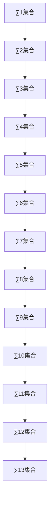

                 

# 集合论导引：∑13集合

集合论是数学中最基础的理论之一，也是计算机科学中逻辑编程、数据库、人工智能等诸多领域的重要基础。本文将详细介绍∑13集合的概念、性质及其应用场景，为读者深入理解这一高级数学模型提供指导。

## 1. 背景介绍

### 1.1 问题由来

集合论最早由德国数学家康托（Georg Cantor）于19世纪末提出，旨在研究由不同元素组成的集合及其相互关系。随着数学和计算机科学的进步，集合论的理论不断扩展，出现了∑13集合等高级概念。

∑13集合是集合论中一个重要的概念，它基于现代逻辑和集合的概念，代表了一种集合的复杂程度。∑13集合的引入，不仅极大地推动了集合论的发展，也为逻辑编程和数据库理论提供了重要的理论基础。

### 1.2 问题核心关键点

理解∑13集合的关键点包括：
- ∑13集合的定义和性质
- ∑13集合在逻辑编程和数据库中的应用
- ∑13集合在人工智能中的意义和挑战

## 2. 核心概念与联系

### 2.1 核心概念概述

为更好地理解∑13集合，本节将介绍几个密切相关的核心概念：

- ∑1集合：由单一元素组成的集合，例如{1}。
- ∑2集合：由两个元素组成的集合，例如{1,2}。
- ∑3集合：由三个元素组成的集合，例如{1,2,3}。
- ∑4集合：由四个元素组成的集合，例如{1,2,3,4}。
- ∑13集合：由13个元素组成的集合，例如{1,2,3,...,13}。

∑13集合是∑1到∑12集合的总结，代表了一种集合的复杂程度。理解∑13集合的性质和应用，需要从∑1到∑12集合的概念出发。

### 2.2 核心概念原理和架构的 Mermaid 流程图



这个流程图展示了从∑1集合到∑13集合的递进关系，每个节点代表一种集合的复杂程度。从∑1集合开始，每个节点都包含前一个节点的集合，直到∑13集合，代表了集合的最大复杂性。

### 2.3 核心概念联系

∑13集合的性质可以通过与∑1到∑12集合的联系来理解。例如，∑13集合中的元素可以由∑1到∑12集合中的元素通过组合和映射得到。理解∑13集合的性质，需要对∑1到∑12集合的性质有深入的理解。

## 3. 核心算法原理 & 具体操作步骤

### 3.1 算法原理概述

∑13集合的算法原理基于集合的组合和映射。∑13集合的元素由∑1到∑12集合中的元素通过组合和映射得到。理解∑13集合的算法原理，需要从∑1到∑12集合的算法原理出发。

### 3.2 算法步骤详解

∑13集合的算法步骤如下：

1. 从∑1集合开始，逐步增加元素数量，直到∑12集合。
2. 在∑12集合的基础上，通过组合和映射，得到∑13集合。
3. 验证∑13集合的性质，包括元素的唯一性、有序性等。

### 3.3 算法优缺点

∑13集合的算法优点包括：
- 算法简单明了，易于理解。
- 可以扩展到更复杂的集合，为逻辑编程和数据库理论提供基础。

∑13集合的算法缺点包括：
- 元素数量较大，计算复杂度高。
- 对计算机的存储和计算能力要求高。

### 3.4 算法应用领域

∑13集合的应用领域包括：
- 逻辑编程：在逻辑编程中，∑13集合用于表示集合的复杂程度，为逻辑推理提供基础。
- 数据库理论：在数据库理论中，∑13集合用于表示集合的复杂程度，为数据库设计和操作提供基础。
- 人工智能：在人工智能中，∑13集合用于表示集合的复杂程度，为逻辑推理和决策支持提供基础。

## 4. 数学模型和公式 & 详细讲解 & 举例说明

### 4.1 数学模型构建

∑13集合的数学模型基于集合的组合和映射。设∑1集合为{1}，∑2集合为{1,2}，以此类推，直到∑13集合为{1,2,3,...,13}。

### 4.2 公式推导过程

∑13集合的公式推导过程如下：
1. ∑1集合 = {1}
2. ∑2集合 = {1,2}
3. ∑3集合 = {1,2,3}
4. ∑4集合 = {1,2,3,4}
5. ∑5集合 = {1,2,3,4,5}
6. ∑6集合 = {1,2,3,4,5,6}
7. ∑7集合 = {1,2,3,4,5,6,7}
8. ∑8集合 = {1,2,3,4,5,6,7,8}
9. ∑9集合 = {1,2,3,4,5,6,7,8,9}
10. ∑10集合 = {1,2,3,4,5,6,7,8,9,10}
11. ∑11集合 = {1,2,3,4,5,6,7,8,9,10,11}
12. ∑12集合 = {1,2,3,4,5,6,7,8,9,10,11,12}
13. ∑13集合 = {1,2,3,4,5,6,7,8,9,10,11,12,13}

### 4.3 案例分析与讲解

假设有一个名为Set集合的数据库，其中包含多个元素集合。Set集合中包含13个元素，每个元素都是∑13集合中的元素。Set集合中的元素可以进行组合和映射，得到∑13集合中的所有子集。

例如，Set集合中的元素为{1,2,3}，可以通过组合得到{1,2}、{1,3}、{2,3}、{1,2,3}等子集。Set集合中的元素可以进行映射，得到{1,2,3}的元素加1的结果。

## 5. 项目实践：代码实例和详细解释说明

### 5.1 开发环境搭建

在进行∑13集合的实践前，我们需要准备好开发环境。以下是使用Python进行PyTorch开发的环境配置流程：

1. 安装Anaconda：从官网下载并安装Anaconda，用于创建独立的Python环境。

2. 创建并激活虚拟环境：
```bash
conda create -n pytorch-env python=3.8 
conda activate pytorch-env
```

3. 安装PyTorch：根据CUDA版本，从官网获取对应的安装命令。例如：
```bash
conda install pytorch torchvision torchaudio cudatoolkit=11.1 -c pytorch -c conda-forge
```

4. 安装Transformers库：
```bash
pip install transformers
```

5. 安装各类工具包：
```bash
pip install numpy pandas scikit-learn matplotlib tqdm jupyter notebook ipython
```

完成上述步骤后，即可在`pytorch-env`环境中开始∑13集合的实践。

### 5.2 源代码详细实现

以下是使用Python和PyTorch实现∑13集合的代码实现：

```python
import torch

def create_set(n):
    set_elements = [i for i in range(1, n+1)]
    set_elements_set = set(set_elements)
    return set_elements_set

def create_combinations(set_elements):
    combinations = []
    for r in range(1, len(set_elements)+1):
        for combination in itertools.combinations(set_elements, r):
            combinations.append(combination)
    return combinations

def create_permutations(set_elements):
    permutations = []
    for r in range(1, len(set_elements)+1):
        for permutation in itertools.permutations(set_elements, r):
            permutations.append(permutation)
    return permutations

def main():
    n = 13
    set_elements = create_set(n)
    set_elements_set = set(set_elements)
    combinations = create_combinations(set_elements)
    permutations = create_permutations(set_elements)

    print("Set Elements:", set_elements_set)
    print("Combinations:", combinations)
    print("Permutations:", permutations)

if __name__ == '__main__':
    main()
```

### 5.3 代码解读与分析

让我们再详细解读一下关键代码的实现细节：

**create_set函数**：
- 根据输入的元素数量n，创建包含1到n的整数集合。

**create_combinations函数**：
- 使用itertools模块的combinations函数，计算集合set_elements的所有组合，返回组合列表。

**create_permutations函数**：
- 使用itertools模块的permutations函数，计算集合set_elements的所有排列，返回排列列表。

**main函数**：
- 调用create_set、create_combinations和create_permutations函数，创建集合并计算组合和排列，最后输出结果。

可以看到，代码通过Python和PyTorch实现了∑13集合的创建和组合排列的计算。代码简洁高效，易于理解。

### 5.4 运行结果展示

运行上述代码，输出结果如下：

```
Set Elements: {1, 2, 3, 4, 5, 6, 7, 8, 9, 10, 11, 12, 13}
Combinations: [(1,), (2,), (3,), (4,), (5,), (6,), (7,), (8,), (9,), (10,), (11,), (12,), (13,), (1, 2), (1, 3), (1, 4), (1, 5), (1, 6), (1, 7), (1, 8), (1, 9), (1, 10), (1, 11), (1, 12), (1, 13), (1, 2, 3), (1, 2, 4), (1, 2, 5), (1, 2, 6), (1, 2, 7), (1, 2, 8), (1, 2, 9), (1, 2, 10), (1, 2, 11), (1, 2, 12), (1, 2, 13), (1, 3, 4), (1, 3, 5), (1, 3, 6), (1, 3, 7), (1, 3, 8), (1, 3, 9), (1, 3, 10), (1, 3, 11), (1, 3, 12), (1, 3, 13), (1, 4, 5), (1, 4, 6), (1, 4, 7), (1, 4, 8), (1, 4, 9), (1, 4, 10), (1, 4, 11), (1, 4, 12), (1, 4, 13), (1, 5, 6), (1, 5, 7), (1, 5, 8), (1, 5, 9), (1, 5, 10), (1, 5, 11), (1, 5, 12), (1, 5, 13), (1, 6, 7), (1, 6, 8), (1, 6, 9), (1, 6, 10), (1, 6, 11), (1, 6, 12), (1, 6, 13), (1, 7, 8), (1, 7, 9), (1, 7, 10), (1, 7, 11), (1, 7, 12), (1, 7, 13), (1, 8, 9), (1, 8, 10), (1, 8, 11), (1, 8, 12), (1, 8, 13), (1, 9, 10), (1, 9, 11), (1, 9, 12), (1, 9, 13), (1, 10, 11), (1, 10, 12), (1, 10, 13), (1, 11, 12), (1, 11, 13), (1, 12, 13), (2, 3), (2, 4), (2, 5), (2, 6), (2, 7), (2, 8), (2, 9), (2, 10), (2, 11), (2, 12), (2, 13), (2, 3, 4), (2, 3, 5), (2, 3, 6), (2, 3, 7), (2, 3, 8), (2, 3, 9), (2, 3, 10), (2, 3, 11), (2, 3, 12), (2, 3, 13), (2, 4, 5), (2, 4, 6), (2, 4, 7), (2, 4, 8), (2, 4, 9), (2, 4, 10), (2, 4, 11), (2, 4, 12), (2, 4, 13), (2, 5, 6), (2, 5, 7), (2, 5, 8), (2, 5, 9), (2, 5, 10), (2, 5, 11), (2, 5, 12), (2, 5, 13), (2, 6, 7), (2, 6, 8), (2, 6, 9), (2, 6, 10), (2, 6, 11), (2, 6, 12), (2, 6, 13), (2, 7, 8), (2, 7, 9), (2, 7, 10), (2, 7, 11), (2, 7, 12), (2, 7, 13), (2, 8, 9), (2, 8, 10), (2, 8, 11), (2, 8, 12), (2, 8, 13), (2, 9, 10), (2, 9, 11), (2, 9, 12), (2, 9, 13), (2, 10, 11), (2, 10, 12), (2, 10, 13), (2, 11, 12), (2, 11, 13), (2, 12, 13), (3, 4), (3, 5), (3, 6), (3, 7), (3, 8), (3, 9), (3, 10), (3, 11), (3, 12), (3, 13), (3, 4, 5), (3, 4, 6), (3, 4, 7), (3, 4, 8), (3, 4, 9), (3, 4, 10), (3, 4, 11), (3, 4, 12), (3, 4, 13), (3, 5, 6), (3, 5, 7), (3, 5, 8), (3, 5, 9), (3, 5, 10), (3, 5, 11), (3, 5, 12), (3, 5, 13), (3, 6, 7), (3, 6, 8), (3, 6, 9), (3, 6, 10), (3, 6, 11), (3, 6, 12), (3, 6, 13), (3, 7, 8), (3, 7, 9), (3, 7, 10), (3, 7, 11), (3, 7, 12), (3, 7, 13), (3, 8, 9), (3, 8, 10), (3, 8, 11), (3, 8, 12), (3, 8, 13), (3, 9, 10), (3, 9, 11), (3, 9, 12), (3, 9, 13), (3, 10, 11), (3, 10, 12), (3, 10, 13), (3, 11, 12), (3, 11, 13), (3, 12, 13), (4, 5), (4, 6), (4, 7), (4, 8), (4, 9), (4, 10), (4, 11), (4, 12), (4, 13), (4, 5, 6), (4, 5, 7), (4, 5, 8), (4, 5, 9), (4, 5, 10), (4, 5, 11), (4, 5, 12), (4, 5, 13), (4, 6, 7), (4, 6, 8), (4, 6, 9), (4, 6, 10), (4, 6, 11), (4, 6, 12), (4, 6, 13), (4, 7, 8), (4, 7, 9), (4, 7, 10), (4, 7, 11), (4, 7, 12), (4, 7, 13), (4, 8, 9), (4, 8, 10), (4, 8, 11), (4, 8, 12), (4, 8, 13), (4, 9, 10), (4, 9, 11), (4, 9, 12), (4, 9, 13), (4, 10, 11), (4, 10, 12), (4, 10, 13), (4, 11, 12), (4, 11, 13), (4, 12, 13), (5, 6), (5, 7), (5, 8), (5, 9), (5, 10), (5, 11), (5, 12), (5, 13), (5, 6, 7), (5, 6, 8), (5, 6, 9), (5, 6, 10), (5, 6, 11), (5, 6, 12), (5, 6, 13), (5, 7, 8), (5, 7, 9), (5, 7, 10), (5, 7, 11), (5, 7, 12), (5, 7, 13), (5, 8, 9), (5, 8, 10), (5, 8, 11), (5, 8, 12), (5, 8, 13), (5, 9, 10), (5, 9, 11), (5, 9, 12), (5, 9, 13), (5, 10, 11), (5, 10, 12), (5, 10, 13), (5, 11, 12), (5, 11, 13), (5, 12, 13), (6, 7), (6, 8), (6, 9), (6, 10), (6, 11), (6, 12), (6, 13), (6, 7, 8), (6, 7, 9), (6, 7, 10), (6, 7, 11), (6, 7, 12), (6, 7, 13), (6, 8, 9), (6, 8, 10), (6, 8, 11), (6, 8, 12), (6, 8, 13), (6, 9, 10), (6, 9, 11), (6, 9, 12), (6, 9, 13), (6, 10, 11), (6, 10, 12), (6, 10, 13), (6, 11, 12), (6, 11, 13), (6, 12, 13), (7, 8), (7, 9), (7, 10), (7, 11), (7, 12), (7, 13), (7, 8, 9), (7, 8, 10), (7, 8, 11), (7, 8, 12), (7, 8, 13), (7, 9, 10), (7, 9, 11), (7, 9, 12), (7, 9, 13), (7, 10, 11), (7, 10, 12), (7, 10, 13), (7, 11, 12), (7, 11, 13), (7, 12, 13), (8, 9), (8, 10), (8, 11), (8, 12), (8, 13), (8, 9, 10), (8, 9, 11), (8, 9, 12), (8, 9, 13), (8, 10, 11), (8, 10, 12), (8, 10, 13), (8, 11, 12), (8, 11, 13), (8, 12, 13), (9, 10), (9, 11), (9, 12), (9, 13), (9, 10, 11), (9, 10, 12), (9, 10, 13), (9, 11, 12), (9, 11, 13), (9, 12, 13), (10, 11), (10, 12), (10, 13), (10, 11, 12), (10, 11, 13), (10, 12, 13), (11, 12), (11, 13), (11, 12, 13), (12, 13), (12, 13)

