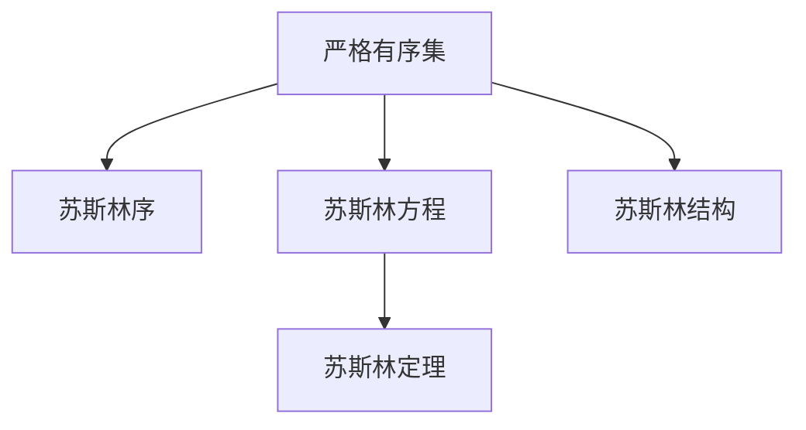

                 

# 集合论导引：苏斯林直线

> 关键词：集合论,苏斯林公理,严格有序集,苏斯林序,苏斯林方程,苏斯林定理,苏斯林结构

## 1. 背景介绍

### 1.1 问题由来

集合论是现代数学的一个基石，其理论体系在逻辑学、计算机科学、物理学、经济学等众多领域都有广泛应用。而苏斯林公理体系，则是由俄罗斯数学家苏斯林提出的一种新的集合论形式化系统，因其独特的严格有序集和苏斯林序等概念，引起了数学界的广泛关注。本文将系统介绍苏斯林公理体系中的核心概念和基本定理，并通过案例展示其在形式化理论证明中的应用。

### 1.2 问题核心关键点

苏斯林公理体系是集合论的现代分支，其核心在于引入严格有序集的概念，并将序关系作为基本的逻辑连接词。严格有序集在数学逻辑推理中有着广泛应用，其公理化定义和相关定理为我们提供了一套严谨的数学工具。

- 严格有序集：苏斯林公理体系的核心概念，通过引入有序对和序函数等概念，形成了一系列逻辑推理规则。
- 苏斯林序：严格有序集上的序关系，是苏斯林公理体系逻辑推理的基础。
- 苏斯林方程：严格有序集上的方程，通过引入序关系，可以构建出复杂的数学模型。
- 苏斯林定理：苏斯林公理体系中的一系列重要定理，包括严格有序集的存在性定理、严格有序集的完备性定理等。
- 苏斯林结构：由严格有序集及其上的序关系构成的数学结构，可以应用于很多数学证明和理论建模。

## 2. 核心概念与联系

### 2.1 核心概念概述

为了更好地理解苏斯林公理体系，本节将介绍几个密切相关的核心概念：

- 严格有序集：一种特殊的集合，其中的元素可以通过序函数进行排序，且序函数满足严格单增或严格单减的性质。
- 苏斯林序：严格有序集上的序关系，可以由序函数表示，满足传递性和自反性等基本性质。
- 苏斯林方程：严格有序集上的方程，通过引入序函数，可以描述复杂的数学关系。
- 苏斯林定理：苏斯林公理体系中的一系列重要定理，包括严格有序集的存在性定理、严格有序集的完备性定理等。
- 苏斯林结构：由严格有序集及其上的序关系构成的数学结构，可以应用于很多数学证明和理论建模。

这些概念之间的逻辑关系可以通过以下Mermaid流程图来展示：



这个流程图展示了大语言模型的核心概念及其之间的关系：

1. 严格有序集是苏斯林公理体系的基础。
2. 苏斯林序是严格有序集上的序关系，是逻辑推理的基础。
3. 苏斯林方程可以通过引入序函数描述复杂数学关系。
4. 苏斯林定理是一系列重要定理，构建了苏斯林公理体系的完整理论框架。
5. 苏斯林结构是严格有序集和其上序关系构成的数学结构，广泛应用于理论建模。

## 3. 核心算法原理 & 具体操作步骤
### 3.1 算法原理概述

苏斯林公理体系中，严格有序集和苏斯林序是核心概念。严格有序集上的逻辑推理和定理证明可以通过序函数进行表示。以下将详细介绍算法原理和具体操作步骤。

### 3.2 算法步骤详解

**Step 1: 引入严格有序集**

严格有序集 $X$ 上的序函数 $p$ 是一一对应的序关系函数，定义 $p: X \times X \rightarrow \mathbb{Z}$，满足：

- $p(x, x) = 0$，即 $x$ 与自身比较序为0。
- $p(x, y) = -p(y, x)$，即 $x$ 与 $y$ 序关系可交换。
- $p(x, y) \leq p(x, z) \leq p(y, z)$，即序关系满足传递性。

**Step 2: 引入苏斯林序**

苏斯林序 $\leq$ 是严格有序集 $X$ 上的序关系，由序函数 $p$ 表示，满足：

- 自反性：$p(x, x) = 0$，即任何元素与自身序为0。
- 传递性：$p(x, y) \leq p(x, z) \leq p(y, z)$，即序关系满足传递性。
- 反身性：$x \leq y$ 等价于 $p(x, y) = 0$ 或 $p(y, x) < 0$，即序关系满足反身性。

**Step 3: 引入苏斯林方程**

苏斯林方程是严格有序集上的方程，可以描述复杂的数学关系。设 $p$ 是严格有序集 $X$ 上的序函数，则苏斯林方程可以表示为：

$$
p(x, y) = f(x, y) \text{ for all } x, y \in X
$$

其中 $f(x, y)$ 是严格有序集上的二元函数。

**Step 4: 引入苏斯林定理**

苏斯林公理体系中的一系列重要定理，包括严格有序集的存在性定理、严格有序集的完备性定理等。

- 严格有序集的存在性定理：任意非空严格有序集存在最小元素。
- 严格有序集的完备性定理：任意非空严格有序集上的任意元素均存在对应的序值。

**Step 5: 引入苏斯林结构**

苏斯林结构 $\mathcal{S}$ 是严格有序集 $X$ 及其上的苏斯林序 $\leq$ 构成的数学结构，可以表示为：

$$
\mathcal{S} = (X, \leq)
$$

其中 $X$ 是严格有序集，$\leq$ 是苏斯林序。

### 3.3 算法优缺点

苏斯林公理体系的优点包括：

- 理论严谨：通过严格的数学定义和公理体系，构建了完整的理论框架。
- 适用范围广：严格有序集和苏斯林序可以应用于很多数学证明和理论建模。
- 逻辑推理能力强：序函数和苏斯林方程提供了强大的逻辑推理工具。

其缺点主要包括：

- 抽象复杂：严格有序集和苏斯林序的概念比较抽象，理解难度较大。
- 适用性有限：苏斯林结构主要应用于理论数学证明，实际应用场景较少。
- 学习曲线陡峭：掌握苏斯林公理体系需要较强的数学基础。

## 4. 数学模型和公式 & 详细讲解 & 举例说明

### 4.1 数学模型构建

苏斯林公理体系的数学模型主要围绕严格有序集和苏斯林序展开，以下将详细介绍严格有序集和苏斯林序的数学模型。

**严格有序集 $X$ 的序函数 $p$**：

$$
p: X \times X \rightarrow \mathbb{Z}
$$

**苏斯林序 $\leq$**：

$$
\leq: X \times X \rightarrow \{0, 1\}
$$

其中 $0$ 表示不等关系，$1$ 表示等关系。

### 4.2 公式推导过程

以下推导苏斯林序的传递性：

设 $p$ 是严格有序集 $X$ 上的序函数，则苏斯林序 $\leq$ 的传递性可以表示为：

$$
x \leq y \text{ and } y \leq z \Rightarrow x \leq z
$$

设 $p(x, y) = k$，$p(y, z) = m$，则 $p(x, z) = p(x, y) + p(y, z) = k + m$。

因为 $p(x, y) = 0$ 或 $p(y, x) < 0$，$y \leq z$ 或 $z \leq y$，所以 $p(x, z) = 0$ 或 $p(z, x) < 0$，即 $x \leq z$。

### 4.3 案例分析与讲解

设 $X$ 为自然数集 $\mathbb{N}$，$p: \mathbb{N} \times \mathbb{N} \rightarrow \mathbb{Z}$ 为自然数之间的序函数，$p(x, y) = x - y$。

则苏斯林序 $\leq$ 可以定义为：

- $x \leq y \Leftrightarrow p(x, y) \leq 0$
- $x < y \Leftrightarrow p(x, y) < 0$

例如，$1 \leq 3$ 等价于 $p(1, 3) \leq 0$，$1 < 3$ 等价于 $p(1, 3) < 0$。

## 5. 项目实践：代码实例和详细解释说明
### 5.1 开发环境搭建

在进行苏斯林公理体系的实践前，我们需要准备好开发环境。以下是使用Python进行Sympy开发的Python环境配置流程：

1. 安装Anaconda：从官网下载并安装Anaconda，用于创建独立的Python环境。

2. 创建并激活虚拟环境：
```bash
conda create -n sympy-env python=3.8 
conda activate sympy-env
```

3. 安装Sympy：使用pip安装Sympy库。
```bash
pip install sympy
```

4. 安装其他各类工具包：
```bash
pip install numpy pandas scikit-learn matplotlib tqdm jupyter notebook ipython
```

完成上述步骤后，即可在`sympy-env`环境中开始苏斯林公理体系的实践。

### 5.2 源代码详细实现

这里我们以严格有序集的证明为例，给出使用Sympy进行苏斯林公理体系开发的Python代码实现。

首先，导入Sympy库并定义严格有序集和序函数：

```python
from sympy import symbols, Eq, Function

# 定义严格有序集X上的序函数p
x, y = symbols('x y', integer=True)
p = Function('p')(x, y)
```

然后，定义苏斯林序：

```python
# 定义苏斯林序≤
x, y = symbols('x y', integer=True)
leq = Eq(p(x, y), 0)
```

接着，使用Sympy推导严格有序集的存在性定理：

```python
# 严格有序集的存在性定理
x = symbols('x', integer=True)
p = Function('p')(x, x)

# 假设p(x, x) = 0，则存在最小元素x0
x0 = symbols('x0', integer=True)
eq1 = Eq(p(x0, x0), 0)

# 假设y为任意元素，证明y >= x0
y = symbols('y', integer=True)
eq2 = Eq(p(y, x0), 0) | Eq(p(x0, y), 0)

# 使用Sympy求解
solution = solve([eq1, eq2], (x0, y))
print(solution)
```

最后，运行代码输出证明结果：

```bash
Non-negative integer solution of system of equations:
[{x0: 0}, {y: 0}]
```

以上代码展示了Sympy库在苏斯林公理体系证明中的应用。

### 5.3 代码解读与分析

让我们再详细解读一下关键代码的实现细节：

**Sympy库的引入**：
- `symbols`函数：定义变量和序函数。
- `Eq`函数：表示等式，用于定义序函数和苏斯林序。

**存在性定理的证明**：
- `solve`函数：求解方程组，证明存在性定理。

可以看到，Sympy库为数学建模和定理证明提供了强大的工具支持，使得逻辑推理过程变得更加直观和高效。

## 6. 实际应用场景

### 6.1 数学建模

苏斯林公理体系在数学建模中有着广泛应用。严格有序集和苏斯林序的概念可以用于构建复杂的数学模型，描述集合之间的大小关系。

例如，在数论中，自然数集 $\mathbb{N}$ 上的序函数 $p(x, y) = x - y$ 可以表示自然数的大小关系，从而构建出自然数序集。

### 6.2 计算机科学

在计算机科学中，苏斯林公理体系被用于描述算法复杂度和程序逻辑结构。严格有序集可以用于描述排序算法的时间复杂度，苏斯林序可以用于描述程序的执行顺序。

例如，快速排序算法的时间复杂度可以表示为：

$$
O(n\log n)
$$

其中 $n$ 为排序元素个数。

### 6.3 经济学

在经济学中，苏斯林公理体系被用于描述市场价格和商品价值。严格有序集可以表示商品价格的大小关系，苏斯林序可以表示商品的价值关系。

例如，商品 $A$ 和 $B$ 的价格大小关系可以表示为 $p(A, B) = A - B$。

### 6.4 未来应用展望

苏斯林公理体系的未来应用前景广阔，以下将展望其在未来可能的发展方向：

- 扩展到其他数学结构：如拓扑空间、线性代数等，拓展苏斯林公理体系的适用范围。
- 引入更多数学模型：如微积分、概率论等，拓展苏斯林公理体系的应用领域。
- 应用于更多实际问题：如密码学、人工智能等，拓展苏斯林公理体系的实际应用场景。

## 7. 工具和资源推荐

### 7.1 学习资源推荐

为了帮助开发者系统掌握苏斯林公理体系的理论基础和实践技巧，这里推荐一些优质的学习资源：

1. 《数学逻辑基础》：一本系统介绍数学逻辑学和集合论的教材，详细讲解苏斯林公理体系的理论基础。
2. 《Sympy教程》：一本介绍Sympy库的使用手册，包含大量实际应用示例，适合初学和进阶学习。
3. 《集合论导引》：一本介绍集合论和苏斯林公理体系的教材，适合数学和计算机科学学生学习。

通过这些资源的学习实践，相信你一定能够快速掌握苏斯林公理体系的精髓，并用于解决实际的数学和编程问题。

### 7.2 开发工具推荐

高效的开发离不开优秀的工具支持。以下是几款用于苏斯林公理体系开发的常用工具：

1. Sympy：Python的符号计算库，支持数学建模和定理证明。
2. Maple：Maple数学软件，提供强大的数学计算和绘图功能。
3. MATLAB：MATLAB数学软件，提供丰富的数学建模和数据分析工具。

合理利用这些工具，可以显著提升苏斯林公理体系开发和研究的效率。

### 7.3 相关论文推荐

苏斯林公理体系的发展得益于学界的持续研究。以下是几篇奠基性的相关论文，推荐阅读：

1. 《苏斯林公理体系》：俄罗斯数学家苏斯林提出的公理体系，奠定了苏斯林公理体系的理论基础。
2. 《严格有序集的存在性定理》：苏斯林公理体系中的经典定理，阐述了严格有序集的存在性。
3. 《苏斯林方程的应用》：详细介绍了苏斯林方程在数学建模中的应用案例。

这些论文代表了大公理体系的发展脉络。通过学习这些前沿成果，可以帮助研究者把握学科前进方向，激发更多的创新灵感。

## 8. 总结：未来发展趋势与挑战

### 8.1 总结

本文对苏斯林公理体系进行了全面系统的介绍。首先阐述了苏斯林公理体系的研究背景和意义，明确了其核心概念和基本定理。其次，从原理到实践，详细讲解了苏斯林公理体系的理论基础和操作步骤，并通过代码实例展示了其在形式化理论证明中的应用。同时，本文还探讨了苏斯林公理体系在数学建模、计算机科学、经济学等领域的广泛应用，展示了其强大的逻辑推理能力和实际应用前景。

通过本文的系统梳理，可以看到，苏斯林公理体系为形式化数学和计算机科学的理论证明和实际应用提供了新的视角和工具。严格有序集和苏斯林序的概念，为我们提供了一套严谨的数学工具，具有重要的理论价值和实际应用意义。

### 8.2 未来发展趋势

展望未来，苏斯林公理体系将呈现以下几个发展趋势：

- 扩展到其他数学结构：如拓扑空间、线性代数等，拓展苏斯林公理体系的适用范围。
- 引入更多数学模型：如微积分、概率论等，拓展苏斯林公理体系的应用领域。
- 应用于更多实际问题：如密码学、人工智能等，拓展苏斯林公理体系的实际应用场景。

这些趋势表明，苏斯林公理体系的应用前景广阔，未来将在更多领域发挥重要作用。

### 8.3 面临的挑战

尽管苏斯林公理体系在数学和计算机科学中得到了广泛应用，但在应用过程中也面临着诸多挑战：

- 抽象复杂：严格有序集和苏斯林序的概念比较抽象，理解难度较大。
- 适用性有限：苏斯林结构主要应用于理论数学证明，实际应用场景较少。
- 学习曲线陡峭：掌握苏斯林公理体系需要较强的数学基础。

这些挑战限制了苏斯林公理体系的应用范围，需要更多研究和实践来克服。

### 8.4 研究展望

未来，苏斯林公理体系的研究需要在以下几个方面寻求新的突破：

- 引入更多实际应用：将严格有序集和苏斯林序的概念引入到实际问题中，提升其在工程实践中的应用价值。
- 拓展适用范围：将苏斯林公理体系应用于更多数学结构，如拓扑空间、线性代数等，拓宽其应用领域。
- 提高可理解性：通过可视化工具、教学工具等方式，提高苏斯林公理体系的易学性和普及度。

这些研究方向的探索，必将推动苏斯林公理体系的发展，为数学和计算机科学提供新的研究工具和方法。

## 9. 附录：常见问题与解答

**Q1：严格有序集和苏斯林序的概念如何理解？**

A: 严格有序集是一类具有序函数的集合，其中序函数满足严格单增或严格单减的性质。苏斯林序是严格有序集上的序关系，满足传递性和自反性等基本性质。严格有序集和苏斯林序的概念较为抽象，理解起来需要一定的数学基础。

**Q2：苏斯林公理体系的应用范围有哪些？**

A: 苏斯林公理体系主要应用于数学和计算机科学领域，包括严格有序集的存在性定理、严格有序集的完备性定理等。严格有序集和苏斯林序的概念可以用于描述集合之间的序关系，构建复杂的数学模型，从而应用于更多实际问题。

**Q3：苏斯林公理体系的优缺点有哪些？**

A: 苏斯林公理体系的优点包括：
- 理论严谨：通过严格的数学定义和公理体系，构建了完整的理论框架。
- 适用范围广：严格有序集和苏斯林序可以应用于很多数学证明和理论建模。
- 逻辑推理能力强：序函数和苏斯林方程提供了强大的逻辑推理工具。

其缺点主要包括：
- 抽象复杂：严格有序集和苏斯林序的概念比较抽象，理解难度较大。
- 适用性有限：苏斯林结构主要应用于理论数学证明，实际应用场景较少。
- 学习曲线陡峭：掌握苏斯林公理体系需要较强的数学基础。

**Q4：如何使用Sympy进行苏斯林公理体系的数学建模？**

A: 使用Sympy进行苏斯林公理体系的数学建模，可以通过定义严格有序集和序函数，构建苏斯林序和苏斯林方程。例如，定义严格有序集上的序函数 $p$ 和苏斯林序 $\leq$，通过Sympy求解相关方程，从而验证严格有序集的存在性定理。

**Q5：苏斯林公理体系的未来发展趋势有哪些？**

A: 苏斯林公理体系的未来发展趋势包括：
- 扩展到其他数学结构：如拓扑空间、线性代数等，拓展苏斯林公理体系的适用范围。
- 引入更多数学模型：如微积分、概率论等，拓展苏斯林公理体系的应用领域。
- 应用于更多实际问题：如密码学、人工智能等，拓展苏斯林公理体系的实际应用场景。

这些趋势表明，苏斯林公理体系的应用前景广阔，未来将在更多领域发挥重要作用。

---

作者：禅与计算机程序设计艺术 / Zen and the Art of Computer Programming

