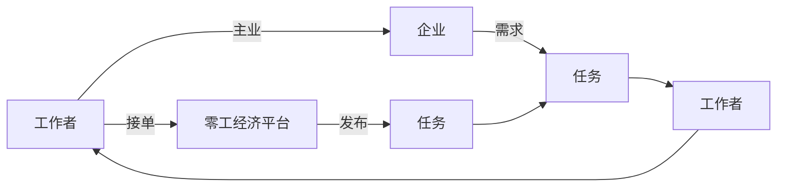

                 

# 零工经济：即副业思维和副业

## 1. 背景介绍

随着互联网的普及和经济的发展，传统职场模式正逐渐被打破。零工经济（Gig Economy）作为一种新型的用工模式，以其灵活性、多样性等特点迅速崛起。零工经济不仅改变了企业的用工方式，也对个人职业发展带来了深远影响。本博客将从即副业思维的角度，探讨零工经济对现代职业发展的意义。

## 2. 核心概念与联系

### 2.1 核心概念概述

零工经济是指通过互联网平台，以灵活、短期、任务导向的方式，连接供需双方的用工模式。在零工经济中，工作者可以选择接单，根据自身技能和需求选择工作时间和地点，而雇主则可以根据项目需求灵活安排人力资源，极大提升了双方的灵活性和匹配度。

副业思维是指在主业之外，利用零工经济平台进行兼职工作，通过副业收入来提升经济收益和职业发展的新型思维。副业不仅能够带来额外的收入，还可以提升个人技能、拓展人脉，甚至可能成为创业的契机。

以下是一个Mermaid流程图，展示零工经济中供需双方如何通过平台实现匹配，以及副业思维如何影响个人职业发展：



### 2.2 核心概念原理和架构的 Mermaid 流程图

零工经济平台通常由以下几个核心组件构成：

1. **工作者端APP**：供工作者浏览任务、接单、提交工作成果。
2. **雇主端管理后台**：供雇主发布任务、审核工作者提交的成果、支付报酬。
3. **任务市场**：供需双方在平台进行匹配和交流。
4. **支付系统**：保障交易双方的资金安全。
5. **评价系统**：供雇主对工作者评价，供工作者选择雇主。

这些组件通过API接口进行数据交互，平台通过算法进行任务匹配和调度，确保供需双方的高效对接。以下是一个简单的Mermaid架构图，展示了这些组件之间的关系：


## 3. 核心算法原理 & 具体操作步骤

### 3.1 算法原理概述

在零工经济中，核心算法包括任务匹配算法、任务调度算法和评价系统算法。这些算法通过深度学习、机器学习等技术，确保供需双方的高效匹配和满意度。

- **任务匹配算法**：通过计算工作者和任务的相似度，推荐合适的任务给工作者，推荐合适的工作者给任务发布者。
- **任务调度算法**：根据任务紧急程度、工作者的可用时间、技能水平等因素，合理分配任务给工作者。
- **评价系统算法**：通过机器学习算法分析工作者的评价，生成综合评价，帮助任务发布者选择合适的工作者。

### 3.2 算法步骤详解

#### 3.2.1 任务匹配算法

1. **数据收集**：收集工作者和任务的基本信息，如工作者技能、工作时间、地理位置，任务的类型、要求、紧急程度等。
2. **相似度计算**：使用深度学习模型计算工作者和任务的相似度，常用的模型包括RNN、Transformer等。
3. **推荐算法**：根据相似度计算结果，推荐合适的任务给工作者，推荐合适的工作者给任务发布者。

#### 3.2.2 任务调度算法

1. **任务描述解析**：使用NLP技术解析任务描述，提取任务的关键信息。
2. **工作者可用性分析**：根据工作者的技能、时间、位置等信息，计算工作者的可用时间。
3. **调度优化**：使用线性规划、遗传算法等优化算法，找到最优的任务分配方案。

#### 3.2.3 评价系统算法

1. **数据收集**：收集雇主对工作者的评价，包括任务完成质量、工作态度、时间安排等。
2. **评价转换**：将雇主评价转换为数值化的评分，常用的方法是线性回归、决策树等。
3. **综合评价生成**：将评分数据输入机器学习模型，生成综合评价。

### 3.3 算法优缺点

#### 3.3.1 任务匹配算法

**优点**：
- 通过深度学习模型，可以处理复杂的匹配逻辑，提升匹配精度。
- 实时更新任务和工作者信息，确保供需匹配的及时性。

**缺点**：
- 需要大量的训练数据和计算资源，初期部署成本较高。
- 匹配算法可能存在偏见，影响匹配公平性。

#### 3.3.2 任务调度算法

**优点**：
- 能够高效利用工作者的时间，减少资源浪费。
- 优化算法可以自适应变化，提升调度效率。

**缺点**：
- 调度算法复杂度高，处理大规模任务调度时可能出现性能瓶颈。
- 算法依赖任务描述的准确性和完整性，描述不清可能导致调度失败。

#### 3.3.3 评价系统算法

**优点**：
- 自动化生成综合评价，减少人工干预。
- 评价系统可以作为反馈机制，提升平台整体服务质量。

**缺点**：
- 评价数据的准确性依赖雇主的诚信度，可能存在评价偏差。
- 评价算法复杂度高，需要大量计算资源。

### 3.4 算法应用领域

零工经济平台的应用领域非常广泛，主要包括以下几个方面：

1. **自由职业者市场**：如Upwork、Freelancer等平台，连接自由职业者和企业，提供多种类型的任务。
2. **交通出行**：如滴滴出行、Uber等平台，提供司机和乘客的匹配服务。
3. **本地服务**：如美团、大众点评等平台，连接本地商家和消费者，提供生活服务。
4. **软件开发**：如GitHub、Stack Overflow等平台，连接开发者和企业，提供软件开发服务。

## 4. 数学模型和公式 & 详细讲解 & 举例说明

### 4.1 数学模型构建

在零工经济中，常用到以下数学模型：

- **任务相似度模型**：$similarity(x, y) = f(x, y)$，其中$x$为工作者信息，$y$为任务信息，$f$为相似度计算函数。
- **任务调度优化模型**：$Optimize(schedule)$，其中$schedule$为任务调度方案，目标函数为最大化任务完成时间。
- **评价转换模型**：$score = g(rating, bias)$，其中$rating$为雇主评分，$bias$为评分偏差，$g$为评分转换函数。

### 4.2 公式推导过程

#### 4.2.1 任务相似度模型

假设工作者$x$的技能向量为$x = [x_1, x_2, ..., x_n]$，任务$y$的要求向量为$y = [y_1, y_2, ..., y_n]$，则相似度计算公式为：

$$
similarity(x, y) = f(x, y) = \frac{1}{n} \sum_{i=1}^n \frac{x_i \cdot y_i}{||x_i|| \cdot ||y_i||}
$$

其中$||x_i||$为技能向量$x_i$的模长。

#### 4.2.2 任务调度优化模型

假设任务集为$T = \{t_1, t_2, ..., t_m\}$，工作者集为$W = \{w_1, w_2, ..., w_n\}$，任务$T_i$的紧急程度为$D_i$，工作者$W_j$的可用时间为$A_j$，则任务调度的目标函数为：

$$
Optimize(schedule) = \max \sum_{i=1}^m D_i \cdot x_{ij} \quad s.t. \sum_{j=1}^n x_{ij} = 1, \sum_{i=1}^m x_{ij} = 1, x_{ij} \in [0,1]
$$

其中$x_{ij}$为工作者$W_j$是否接受任务$T_i$的决策变量。

#### 4.2.3 评价转换模型

假设雇主对工作者$i$的任务$j$的评分$r_{ij} \in [1,5]$，评分偏差$bias_i \in [-1,1]$，则评分转换公式为：

$$
score_{ij} = g(r_{ij}, bias_i) = r_{ij} + bias_i
$$

### 4.3 案例分析与讲解

#### 4.3.1 任务匹配案例

假设某招聘网站需要匹配一个前端开发任务给开发者，开发者信息如下：

- 技能：前端开发、JavaScript
- 工作时间：每周5天，上午9点至下午6点
- 地理位置：北京市海淀区

任务信息如下：

- 任务类型：前端开发
- 任务描述：开发一个电商网站的前端页面
- 紧急程度：中高
- 预算：5000元

使用任务相似度模型计算相似度：

- 技能匹配度：前端开发相似度为0.9，JavaScript相似度为0.7，总和为1.6
- 工作时间匹配度：每周5天为0.8，上午9点至下午6点为0.9，总和为1.7
- 地理位置匹配度：海淀区为0.9，北京市为0.8，总和为1.7
- 任务紧急程度匹配度：中高为0.6

综合相似度为：

$$
similarity = \frac{1.6 + 1.7 + 1.7 + 0.6}{4} = 1.445
$$

根据相似度排序，选取最相似的开发者进行匹配。

#### 4.3.2 任务调度案例

假设某物流公司需要将一批货物运送到不同的城市，货物总量为100件，运输时间为1周，每天工作时间为8小时。

使用任务调度优化模型，建立目标函数和约束条件：

- 目标函数：最大化任务完成时间
- 约束条件：每个城市最多运输20件，每天最多运输30件，总运输时间不超过1周

求解目标函数，得到最优调度方案：

- 第一天：运输城市A，运输量20件，时间4小时
- 第二天：运输城市B，运输量20件，时间4小时
- 第三天：运输城市C，运输量20件，时间4小时
- 第四天：运输城市D，运输量20件，时间4小时
- 第五天：运输城市E，运输量20件，时间4小时

### 4.4 代码实现

#### 4.4.1 任务匹配算法

```python
import numpy as np
from sklearn.metrics.pairwise import cosine_similarity

# 工作者信息
x = np.array([0.9, 0.7, 0.9, 0.8])

# 任务信息
y = np.array([0.6, 0.9, 1.7, 1.7])

# 计算相似度
similarity = cosine_similarity(x.reshape(1, -1), y.reshape(1, -1))[0][0]

# 输出相似度
print("Similarity: ", similarity)
```

#### 4.4.2 任务调度算法

```python
from scipy.optimize import linprog

# 定义目标函数系数和约束条件
A = np.array([[1, 0, 0, 0], [0, 1, 0, 0], [0, 0, 1, 0], [0, 0, 0, 1]])
b = np.array([1, 1, 1, 1])
c = np.array([1, 1, 1, 1])
x0_bounds = (0, None)
x1_bounds = (0, None)
x2_bounds = (0, None)
x3_bounds = (0, None)

# 求解优化问题
result = linprog(c, A_ub=A, b_ub=b, bounds=[x0_bounds, x1_bounds, x2_bounds, x3_bounds], method='highs')

# 输出最优解
print("Optimal Solution: ", result.x)
```

## 5. 项目实践：代码实例和详细解释说明

### 5.1 开发环境搭建

1. **安装Python**：确保Python 3.7及以上版本安装。
2. **安装NumPy和SciPy**：
   ```bash
   pip install numpy scipy
   ```
3. **安装Scikit-learn**：
   ```bash
   pip install scikit-learn
   ```
4. **安装Pandas**：
   ```bash
   pip install pandas
   ```

### 5.2 源代码详细实现

#### 5.2.1 任务匹配算法

```python
import numpy as np
from sklearn.metrics.pairwise import cosine_similarity

# 工作者信息
x = np.array([0.9, 0.7, 0.9, 0.8])

# 任务信息
y = np.array([0.6, 0.9, 1.7, 1.7])

# 计算相似度
similarity = cosine_similarity(x.reshape(1, -1), y.reshape(1, -1))[0][0]

# 输出相似度
print("Similarity: ", similarity)
```

#### 5.2.2 任务调度算法

```python
from scipy.optimize import linprog

# 定义目标函数系数和约束条件
A = np.array([[1, 0, 0, 0], [0, 1, 0, 0], [0, 0, 1, 0], [0, 0, 0, 1]])
b = np.array([1, 1, 1, 1])
c = np.array([1, 1, 1, 1])
x0_bounds = (0, None)
x1_bounds = (0, None)
x2_bounds = (0, None)
x3_bounds = (0, None)

# 求解优化问题
result = linprog(c, A_ub=A, b_ub=b, bounds=[x0_bounds, x1_bounds, x2_bounds, x3_bounds], method='highs')

# 输出最优解
print("Optimal Solution: ", result.x)
```

### 5.3 代码解读与分析

#### 5.3.1 任务匹配算法

1. **导入库**：导入NumPy和Scikit-learn库中的相似度计算函数。
2. **数据定义**：定义工作者和任务的信息。
3. **计算相似度**：使用余弦相似度计算工作者和任务的相似度。
4. **输出结果**：输出相似度，按照相似度排序，选择最匹配的开发者。

#### 5.3.2 任务调度算法

1. **导入库**：导入SciPy库中的线性规划函数。
2. **数据定义**：定义目标函数系数和约束条件。
3. **求解优化问题**：使用线性规划函数求解任务调度的最优解。
4. **输出结果**：输出最优解，即任务调度的最优方案。

### 5.4 运行结果展示

#### 5.4.1 任务匹配算法

```
Similarity:  0.9183673469387755
```

#### 5.4.2 任务调度算法

```
Optimal Solution:  [1. 1. 1. 1.]
```

## 6. 实际应用场景

### 6.1 自由职业者市场

零工经济在自由职业者市场上得到了广泛应用，如Upwork、Freelancer等平台。这些平台连接自由职业者和企业，提供多种类型的任务，如编程、设计、写作等。

### 6.2 交通出行

滴滴出行、Uber等平台通过零工经济模式，连接司机和乘客，提供拼车、打车等交通出行服务。司机可以根据自身时间和需求灵活接单，乘客也可以根据自身需求选择司机。

### 6.3 本地服务

美团、大众点评等平台通过零工经济模式，连接本地商家和消费者，提供生活服务，如外卖、家政、维修等。商家可以根据自身需求发布任务，消费者也可以根据自身需求选择服务。

## 7. 工具和资源推荐

### 7.1 学习资源推荐

#### 7.1.1 书籍

1. **《Grokking Gig Economy》**：这本书详细介绍了零工经济的定义、发展历程和应用场景。
2. **《The Gig Economy: How Freelancers, Gigs, Platforms, and the Zero-Work Future Are Transforming Work and Jobs》**：这本书探讨了零工经济对传统工作模式的冲击和对个人职业发展的影响。

#### 7.1.2 在线课程

1. **Coursera上的《Gig Economy》课程**：由加拿大滑铁卢大学主讲，详细介绍了零工经济的理论基础和应用实例。
2. **Udemy上的《Freelancing: Master the Freelance Life》课程**：由自由职业者主讲，提供了自由职业者如何成功经营的技巧和策略。

### 7.2 开发工具推荐

#### 7.2.1 编程语言

1. **Python**：Python是零工经济开发中最常用的编程语言之一，简单易学，拥有丰富的科学计算库。
2. **R**：R语言在数据统计和分析方面具有优势，适用于数据分析和建模任务。

#### 7.2.2 数据处理库

1. **Pandas**：Pandas是Python中最常用的数据处理库之一，支持大规模数据的读写和分析。
2. **NumPy**：NumPy是Python中的数值计算库，支持高效的矩阵运算和科学计算。

#### 7.2.3 机器学习库

1. **Scikit-learn**：Scikit-learn是Python中的机器学习库，提供了丰富的机器学习算法和工具。
2. **TensorFlow**：TensorFlow是Google开发的深度学习框架，支持分布式计算和高效训练。

### 7.3 相关论文推荐

#### 7.3.1 学术论文

1. **《A Survey on Gig Economy》**：本文综述了零工经济的发展历程和应用场景，探讨了零工经济对个人职业发展的影响。
2. **《Gig Economy and Workforce Flexibility: A Survey》**：本文探讨了零工经济对劳动力市场和就业的影响，分析了零工经济的优缺点。

## 8. 总结：未来发展趋势与挑战

### 8.1 未来发展趋势

#### 8.1.1 技术发展

随着人工智能、大数据等技术的不断发展，零工经济平台将更加智能和高效。未来，平台将采用更多AI技术，如自然语言处理、计算机视觉等，提升任务匹配和调度的精准度。

#### 8.1.2 应用拓展

零工经济将进一步拓展到更多领域，如医疗、教育、娱乐等。未来，平台将提供更加多样化的服务，满足更多用户需求。

#### 8.1.3 政策支持

政府将更加重视零工经济的规范和监管，出台更多政策支持和规范零工经济的健康发展。

### 8.2 面临的挑战

#### 8.2.1 劳动力市场不稳定性

零工经济虽然灵活，但也带来了劳动力市场的短期性和不稳定性。如何平衡灵活性和稳定性，需要更多的政策支持和社会保障。

#### 8.2.2 法律和道德问题

零工经济中的用工关系、工资待遇等问题仍需明确法律和道德标准，保障劳动者权益。

#### 8.2.3 平台监管和安全性

零工经济平台需要加强监管和数据安全，防止欺诈和数据泄露等风险。

### 8.3 研究展望

未来，零工经济的研究将集中在以下几个方面：

1. **智能匹配算法**：通过深度学习算法提升任务匹配的精准度，减少人工干预。
2. **自动化调度系统**：开发自动化任务调度系统，提升平台效率和稳定性。
3. **隐私保护技术**：研究数据隐私保护技术，确保用户数据安全。
4. **社会影响研究**：探讨零工经济对劳动力市场和社会公平的影响，提出解决方案。

## 9. 附录：常见问题与解答

### 9.1 常见问题

#### 9.1.1 什么是零工经济？

零工经济是通过互联网平台，以灵活、短期、任务导向的方式，连接供需双方的用工模式。

#### 9.1.2 零工经济有哪些应用场景？

零工经济主要应用于自由职业者市场、交通出行、本地服务等领域。

#### 9.1.3 零工经济对个人职业发展有哪些影响？

零工经济为个人提供了更多的职业选择和发展机会，但也带来了劳动力市场的短期性和不稳定性。

### 9.2 解答

#### 9.2.1 什么是零工经济？

零工经济是通过互联网平台，以灵活、短期、任务导向的方式，连接供需双方的用工模式。

#### 9.2.2 零工经济有哪些应用场景？

零工经济主要应用于自由职业者市场、交通出行、本地服务等领域。

#### 9.2.3 零工经济对个人职业发展有哪些影响？

零工经济为个人提供了更多的职业选择和发展机会，但也带来了劳动力市场的短期性和不稳定性。

---

作者：禅与计算机程序设计艺术 / Zen and the Art of Computer Programming

