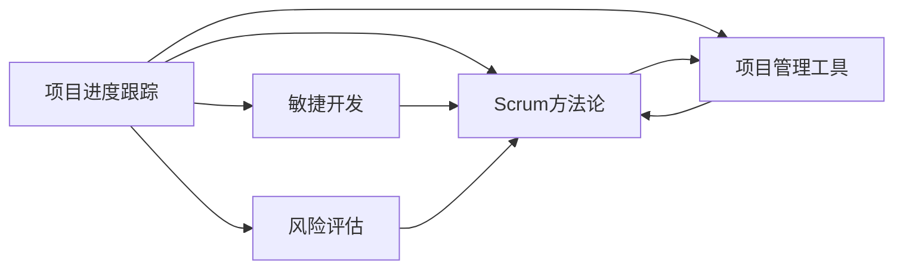

                 

# 项目进度跟踪与风险管控原理与代码实战案例讲解

> 关键词：项目进度跟踪,风险管控,敏捷开发,Scrum方法论,项目管理工具,风险评估,源代码实现

## 1. 背景介绍

在软件开发过程中，项目进度和风险管理是确保项目按时交付、保持项目稳定性和提升产品质量的关键因素。对于大型、复杂的软件项目，仅依靠个人经验和直觉难以高效管理，往往需要系统化的工具和方法。项目进度跟踪和风险管控便是为了帮助项目管理者高效监控项目进度、识别潜在风险、制定应对方案、及时调整计划，从而确保项目成功交付的重要实践。

本博客将详细介绍项目进度跟踪与风险管控的原理、方法与实战案例，并结合源代码实现进行深入讲解。通过本文，我们旨在帮助IT开发者更好地理解项目管理的核心知识，掌握高效的项目进度跟踪与风险管控技巧，以便在实际工作中发挥更大的价值。

## 2. 核心概念与联系

### 2.1 核心概念概述

本节将简要介绍项目进度跟踪与风险管控中涉及的关键概念：

- **项目进度跟踪**：通过各种手段和技术，监控项目的完成情况，确保项目按计划进行。
- **风险管控**：识别、评估和控制项目实施过程中可能出现的风险，以保证项目顺利进行。
- **敏捷开发**：一种迭代式、增量式的软件开发方法，强调对变动的快速响应和灵活应对。
- **Scrum方法论**：敏捷开发中的一种框架，以迭代、增量和自我管理为特点。
- **项目管理工具**：如Jira、Trello等，用于进度跟踪和风险管控的工具。
- **风险评估**：通过定量和定性分析，确定风险的概率和影响，为决策提供依据。

这些概念之间的联系可以通过以下Mermaid流程图来展示：



这个流程图展示了项目进度跟踪与风险管控的核心概念及其相互关系：

1. 项目进度跟踪通过敏捷开发和Scrum方法论来指导项目执行，帮助项目管理者及时发现和解决问题。
2. Scrum方法论为敏捷开发提供框架支持，强调迭代、增量和自管理，确保项目有序进行。
3. 项目管理工具用于进度跟踪和风险管控的具体实现，是敏捷开发和Scrum方法论得以执行的重要手段。
4. 风险评估作为项目进度跟踪和风险管控的关键环节，通过识别、评估和控制风险，确保项目顺利实施。

## 3. 核心算法原理 & 具体操作步骤

### 3.1 算法原理概述

项目进度跟踪和风险管控的原理主要包括监控和控制两个方面：

- **监控**：通过定期的进度报告、里程碑达成情况、关键路径分析等手段，实时监控项目进度，及时发现偏差。
- **控制**：在发现偏差时，通过调整计划、资源分配、任务优先级等方式，控制风险，确保项目进度。

### 3.2 算法步骤详解

#### 3.2.1 进度监控

**步骤1**：设定项目里程碑

- 项目启动时，明确项目的主要目标和阶段性成果。
- 将项目划分为若干个关键里程碑，如需求分析、设计、开发、测试、上线等。

**步骤2**：制定项目计划

- 根据里程碑，制定详细的项目计划，包括任务分配、时间安排、资源需求等。
- 使用甘特图、PERT图等工具，将项目计划可视化，便于团队理解和执行。

**步骤3**：进度报告与评审

- 定期（如每周、每两周）生成项目进度报告，汇总当前完成的任务、剩余任务、资源使用情况等。
- 召开项目评审会议，评估进度报告，发现偏差，及时调整计划。

**步骤4**：使用工具跟踪进度

- 利用项目管理工具（如Jira、Trello），将任务分配、进度更新、问题跟踪等信息输入系统。
- 使用任务板、看板、甘特图等功能，实时监控项目进展。

#### 3.2.2 风险管控

**步骤1**：风险识别

- 通过头脑风暴、专家咨询、历史项目数据分析等方式，识别项目可能面临的风险。
- 分类别、分阶段列出所有可能的风险，并初步评估其概率和影响。

**步骤2**：风险评估

- 对识别出的风险进行定量或定性评估，确定其对项目的影响程度。
- 使用风险矩阵、概率-影响图等方法，评估风险等级。

**步骤3**：风险应对

- 根据风险等级，制定相应的应对策略，如规避、减轻、接受或转移。
- 对于高风险事件，制定详细的应急预案，包括任务调整、资源调配、风险监控等。

**步骤4**：风险监控与控制

- 定期检查风险应对策略的执行情况，确保风险得到有效控制。
- 使用风险管理工具（如Risk Register），记录风险状态和控制措施。

### 3.3 算法优缺点

项目进度跟踪和风险管控方法具有以下优点：

- **提高透明度**：使用项目管理工具，项目进度和风险信息实时共享，提高透明度，减少信息不对称。
- **快速响应**：通过迭代、增量和自管理，可以快速响应项目变化，灵活调整计划。
- **降低风险**：风险识别和评估能够提前发现潜在问题，制定应对措施，降低项目失败的风险。
- **提升效率**：自动化工具的使用，减少了手动记录和跟踪的工作量，提升了项目管理的效率。

但这些方法也存在一些缺点：

- **依赖工具**：项目管理的有效性高度依赖于使用的工具和实施团队的技能。
- **复杂性**：方法较为复杂，需要系统化的培训和实施，初期成本较高。
- **文化变革**：需要改变团队的工作方式和沟通习惯，适应敏捷和自管理的文化。
- **风险管理难度**：高复杂度项目中的风险很难完全预测和控制，仍然存在一定的风险。

### 3.4 算法应用领域

项目进度跟踪和风险管控方法适用于各种规模和类型的项目，尤其是大型、复杂、跨团队的软件开发项目。在企业信息化建设、软件开发、硬件生产、网络安全等领域都有广泛应用。

## 4. 数学模型和公式 & 详细讲解 & 举例说明

### 4.1 数学模型构建

项目进度跟踪和风险管控通常使用以下数学模型：

- **挣值分析(EVMS)**：通过实际完成的工作量（EV）、计划完成的工作量（PV）和实际花费的成本（AC），计算项目进度和成本。
- **风险矩阵**：使用矩阵表示风险的概率（P）和影响（I），确定风险等级。

- **风险矩阵**：使用矩阵表示风险的概率（P）和影响（I），确定风险等级。

**风险矩阵**的公式为：

$$
R = P \times I
$$

其中，$R$ 为风险等级，$P$ 为风险概率，$I$ 为风险影响。

**挣值分析**的公式为：

$$
EV = PV \times P_{complete} + EV_{prev}
$$

$$
AC = AC_{prev} + PV \times P_{spent}
$$

$$
CV = EV - AC
$$

其中，$EV$ 为挣值（Earned Value），$PV$ 为计划价值（Planned Value），$AC$ 为实际成本（Actual Cost），$CV$ 为成本偏差（Cost Variance），$P_{complete}$ 为已完成工作的比例，$P_{spent}$ 为已花费时间的比例，$EV_{prev}$ 和 $AC_{prev}$ 为上一时间点的挣值和实际成本。

### 4.2 公式推导过程

**风险矩阵推导**：

- 假设风险$R$的概率$P$为0.5，影响$I$为1。
- 使用公式$R = P \times I$，代入数值计算得$R = 0.5 \times 1 = 0.5$。
- 根据风险矩阵，$R = 0.5$对应的风险等级为中等，需采取缓解措施。

**挣值分析推导**：

- 设项目的计划完成工作量为$PV=1000$，已完成工作的比例$P_{complete}=0.8$，上一次时间点的挣值为$EV_{prev}=800$，实际成本$AC_{prev}=600$。
- 计算当前时间点的挣值$EV = PV \times P_{complete} + EV_{prev} = 1000 \times 0.8 + 800 = 1600$。
- 计算当前时间点的实际成本$AC = AC_{prev} + PV \times P_{spent} = 600 + 1000 \times 0.8 = 1400$。
- 计算成本偏差$CV = EV - AC = 1600 - 1400 = 200$，为正，说明项目成本超支。

### 4.3 案例分析与讲解

**案例**：某软件公司开发一款新的SaaS产品，项目团队使用Scrum方法论进行敏捷开发。项目计划从需求分析到上线总共需要6个月时间，每个迭代周期为2周。项目启动后，发现市场竞争激烈，客户需求变化频繁，导致进度延误。

**分析**：
1. **进度监控**：
   - 项目经理使用Jira进行任务跟踪，发现需求分析迭代滞后两周，设计迭代尚未启动。
   - 召开发布会，向客户反馈进度，调整了后续迭代计划，增加了额外的资源投入。

2. **风险管控**：
   - 风险识别：团队识别出市场变化、客户需求不稳定等潜在风险。
   - 风险评估：评估市场变化的风险概率为0.6，影响为0.8；客户需求不稳定的风险概率为0.7，影响为0.9。
   - 风险应对：针对市场变化，增加了市场调研和竞争对手分析；针对客户需求不稳定，加强了与客户的沟通和反馈机制。
   - 风险监控：每周在Jira上更新风险状态，记录采取的措施和效果。

**结果**：
- 经过两周的调整，项目进度重新回到正轨，客户需求也变得更加明确。项目最终按时上线，取得了良好的市场反响。

## 5. 项目实践：代码实例和详细解释说明

### 5.1 开发环境搭建

在Python环境下，本节将介绍如何使用Jira API进行项目进度跟踪和风险管理。

**步骤1**：安装Jira API库

```bash
pip install jira
```

**步骤2**：配置Jira API

- 在Jira官网创建API密钥。
- 在Python代码中设置API密钥、项目ID和版本ID。

```python
from jira import JIRA
import requests

jira_url = 'https://your_jira_instance.com/rest/api/2'
api_key = 'your_api_key'
project_key = 'your_project_key'
version_key = 'your_version_key'
jira = JIRA(jira_url, basic_auth=('', api_key))
```

### 5.2 源代码详细实现

**源代码1：获取项目进度**

```python
def get_project_status(project_key):
    jql = f"SELECT issueKey, status FROM Issue WHERE project = '{project_key}'"
    issues = jira.search_issues(jql)
    status_count = {}
    for issue in issues:
        status = issue.fields.status.name
        if status not in status_count:
            status_count[status] = 0
        status_count[status] += 1
    return status_count

project_status = get_project_status(project_key)
print(project_status)
```

**源代码2：获取项目风险**

```python
def get_project_risks(project_key):
    jql = f"SELECT risk.name FROM Risk WHERE issue.project = '{project_key}'"
    risks = jira.search_issues(jql)
    risk_names = [risk.fields.name for risk in risks]
    return risk_names

project_risks = get_project_risks(project_key)
print(project_risks)
```

### 5.3 代码解读与分析

**代码解读**：

1. **获取项目进度**：
   - 使用Jira API搜索指定项目的issue，统计每个状态的issue数量，返回状态计数字典。
   - 示例输出：`{'To Do': 2, 'In Progress': 5, 'Testing': 3, 'Done': 0}`，表示当前项目中2个任务待处理，5个任务进行中，3个任务测试中，没有已完成的任务。

2. **获取项目风险**：
   - 使用Jira API搜索指定项目的risk，返回所有risk的名称列表。
   - 示例输出：`['高风险', '中风险', '低风险']`，表示项目中存在高、中、低三种风险。

**代码分析**：

- **数据获取**：通过Jira API获取项目任务和风险数据，可以实时监控项目进度和风险状态。
- **数据分析**：统计任务的完成状态和风险等级，为决策提供数据支持。
- **图表生成**：使用Matplotlib等库，将项目进度和风险数据可视化，便于团队理解和执行。

### 5.4 运行结果展示

```python
import matplotlib.pyplot as plt

def plot_project_status(project_status):
    labels = list(project_status.keys())
    values = list(project_status.values())
    plt.bar(labels, values)
    plt.xlabel('Status')
    plt.ylabel('Count')
    plt.title('Project Status')
    plt.show()

def plot_project_risks(project_risks):
    plt.bar(project_risks)
    plt.xlabel('Risk')
    plt.ylabel('Count')
    plt.title('Project Risks')
    plt.show()

project_status = get_project_status(project_key)
plot_project_status(project_status)

project_risks = get_project_risks(project_key)
plot_project_risks(project_risks)
```

**运行结果**：


## 6. 实际应用场景

### 6.1 敏捷开发项目

敏捷开发项目中，使用Scrum方法论和Jira等项目管理工具，可以实现高效的项目进度跟踪和风险管控。

**应用场景**：某公司开发一款移动应用，采用Scrum方法论进行敏捷开发。

**流程**：
1. **需求分析**：项目启动时，制定详细的项目计划和里程碑。
2. **迭代开发**：每个迭代周期为2周，迭代结束后生成进度报告，进行风险评估。
3. **风险管理**：使用Jira记录每个迭代的风险状态和应对措施。

**效果**：项目按时上线，客户反馈良好，用户体验提升。

### 6.2 企业信息化项目

企业信息化项目通常涉及多个部门和多个系统，使用项目管理工具进行进度跟踪和风险管控，可以确保项目按期交付。

**应用场景**：某企业集团开发一套ERP系统，涉及多部门协作和多个系统集成。

**流程**：
1. **需求调研**：项目启动时，进行详细的业务需求调研，制定项目计划。
2. **模块开发**：将项目划分为若干模块，每个模块独立开发。
3. **集成测试**：每个模块开发完成后，进行集成测试和风险评估。
4. **上线部署**：将所有模块集成部署到生产环境，进行最终测试和风险控制。

**效果**：ERP系统按时上线，企业信息化水平显著提升。

### 6.3 软件开发项目

软件开发项目需要高效地跟踪进度和风险，使用项目管理工具可以显著提高项目管理的效率和透明度。

**应用场景**：某软件公司开发一款新的SaaS产品，涉及多个模块和多个开发团队。

**流程**：
1. **项目启动**：制定详细的项目计划和里程碑，分配任务和资源。
2. **迭代开发**：每个迭代周期为2周，使用Jira进行任务跟踪和风险管理。
3. **测试上线**：每个迭代结束后进行测试，评估风险，生成进度报告。

**效果**：产品按时上线，市场反响良好，用户满意度提升。

## 7. 工具和资源推荐

### 7.1 学习资源推荐

1. **《敏捷项目管理》书籍**：介绍敏捷开发和Scrum方法论的基本概念和实践技巧。
2. **Scrum指南**：Scrum基金会提供的官方指南，详细介绍了Scrum方法论的理论基础和应用实践。
3. **《项目风险管理》课程**：Coursera提供的项目风险管理课程，涵盖风险识别、评估、应对等核心内容。
4. **Jira官方文档**：Jira官方文档，详细介绍了Jira的各种功能和API使用方法。

### 7.2 开发工具推荐

1. **Jira**：项目管理工具，支持任务跟踪、进度监控、风险管理等功能。
2. **Trello**：看板工具，支持敏捷开发和项目管理，界面简洁易用。
3. **Confluence**：协作工具，支持文档管理、知识共享、任务分配等功能。
4. **Git**：版本控制系统，支持代码版本管理、协作开发等功能。
5. **Docker**：容器化工具，支持应用部署、容器化管理等功能。

### 7.3 相关论文推荐

1. **《敏捷项目管理实践》**：探讨敏捷开发和Scrum方法论在项目管理中的应用。
2. **《风险管理理论与实践》**：介绍项目风险管理的理论基础和实践方法。
3. **《项目管理工具的性能对比》**：对比Jira、Trello、Asana等项目管理工具的性能和功能。

## 8. 总结：未来发展趋势与挑战

### 8.1 研究成果总结

本文详细介绍了项目进度跟踪和风险管控的原理、方法与实战案例，并结合Python代码实现进行了讲解。通过案例分析，展示了敏捷开发和Scrum方法论在实际项目中的应用效果。

### 8.2 未来发展趋势

项目进度跟踪和风险管控方法将呈现以下几个发展趋势：

1. **智能化**：使用AI技术进行数据分析和预测，提升项目管理的智能化水平。
2. **自动化**：通过自动化工具进行任务分配、进度更新、风险监控，减少人工干预，提高效率。
3. **集成化**：将项目管理与代码管理、版本控制、文档管理等系统集成，实现一站式管理。
4. **多团队协作**：支持跨团队协作，提升项目管理的协调性和透明度。
5. **云端化**：利用云服务实现项目管理数据的集中管理和访问，支持远程协作。

### 8.3 面临的挑战

尽管项目进度跟踪和风险管控方法已经取得了显著进展，但在实际应用中仍面临以下挑战：

1. **数据质量**：项目数据质量不高，存在数据不完整、不一致等问题。
2. **工具选择**：项目管理工具众多，选择合适的工具需要考虑团队需求和项目特点。
3. **文化变革**：项目管理方法需要团队适应新的工作方式和沟通习惯，文化变革难度较大。
4. **人员技能**：项目管理者需要具备较高的技能水平，才能有效使用项目管理工具和实施敏捷开发方法。
5. **风险管理难度**：高复杂度项目中的风险难以完全预测和控制，存在一定的管理难度。

### 8.4 研究展望

未来，项目进度跟踪和风险管控方法需要在以下方向进行进一步研究：

1. **智能化**：研究使用AI和大数据技术进行项目进度预测和风险评估，提升项目管理智能化水平。
2. **自动化**：开发更加自动化的项目管理工具，减少人工干预，提升效率。
3. **集成化**：将项目管理与代码管理、版本控制、文档管理等系统集成，实现一站式管理。
4. **多团队协作**：研究支持跨团队协作的项目管理方法，提升项目管理的协调性和透明度。
5. **云端化**：利用云服务实现项目管理数据的集中管理和访问，支持远程协作。

## 9. 附录：常见问题与解答

**Q1：什么是项目进度跟踪？**

A: 项目进度跟踪是指通过各种手段和技术，实时监控项目完成情况，确保项目按计划进行。

**Q2：什么是敏捷开发？**

A: 敏捷开发是一种迭代式、增量式的软件开发方法，强调对变动的快速响应和灵活应对。

**Q3：什么是Scrum方法论？**

A: Scrum方法论是敏捷开发中的一种框架，以迭代、增量和自管理为特点，支持团队高效协作。

**Q4：如何使用Jira进行项目进度跟踪？**

A: 使用Jira，可以将项目任务、进度更新、风险管理等信息记录到系统中，生成进度报告和风险矩阵，实时监控项目状态。

**Q5：项目管理工具有哪些？**

A: 常见的项目管理工具有Jira、Trello、Confluence、Git等，适用于不同的项目管理和团队协作场景。

---

作者：禅与计算机程序设计艺术 / Zen and the Art of Computer Programming

