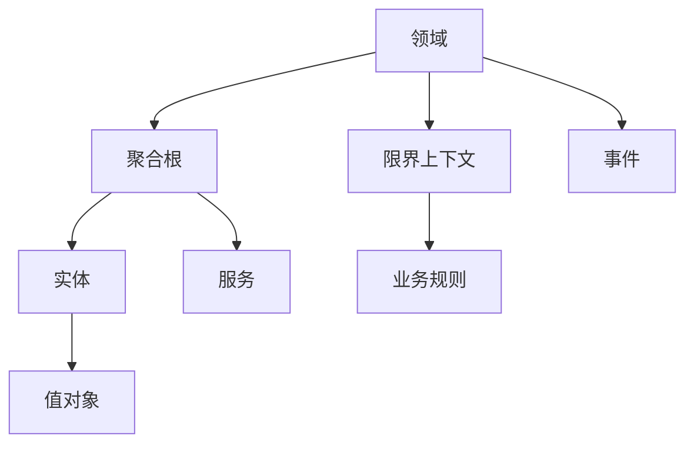

                 

## 1. 背景介绍

在当今快速变化的技术和业务环境中，构建一个复杂且可持续的业务系统变得更加困难。这个挑战不仅需要技术专长，还需要深入理解业务领域。领域驱动设计（Domain-Driven Design, DDD）是一种应对复杂业务系统构建的强大方法，它提供了一套系统化的工具和策略，帮助开发者理解业务领域并有效地构建业务系统。

### 1.1 问题由来

传统的软件开发方法，如瀑布模型、迭代-增量模型等，常常因为缺乏对业务领域的深入理解，导致系统构建混乱，难以适应变化。此外，复杂的业务逻辑和领域知识难以通过传统方式表达和建模。

领域驱动设计（DDD）的提出，就是为了解决这些问题。它强调业务领域的核心概念，将领域知识和软件设计紧密结合，从而构建出满足业务需求的、灵活可扩展的软件系统。

### 1.2 问题核心关键点

DDD的核心思想包括以下几个关键点：

1. **统一语言**：通过与业务专家协作，使用统一的语言来表达业务领域的概念，避免由于术语差异带来的误解。
2. **领域建模**：将业务领域建模为一系列核心概念、实体和边界，确保软件系统能够准确反映业务逻辑。
3. **策略模式**：使用策略模式将业务规则和决策逻辑封装到业务领域中，提高系统的可维护性和可扩展性。
4. **限界上下文**：将业务领域划分为多个限界上下文，每个上下文负责管理一组相关的业务规则和数据，增强系统的模块化和独立性。
5. **持续重构**：通过不断的重构和优化，确保软件系统能够适应业务变化和技术进步。

## 2. 核心概念与联系

### 2.1 核心概念概述

为更好地理解DDD方法，本节将介绍几个密切相关的核心概念：

- **领域（Domain）**：业务系统所涉及的特定业务领域，如金融、医疗、电商等。领域驱动设计强调对领域的深入理解。
- **限界上下文（Bounded Context）**：一个限界上下文是一个独立的、具有明确边界的领域模型。一个限界上下文内部使用领域语言，并且严格定义了与外部系统的交互方式。
- **聚合根（Aggregate Root）**：一个聚合根是一组关联实体的组合，它是该聚合根的单一入口，所有的操作都通过聚合根进行。
- **实体（Entity）**：实体是业务领域中具有唯一标识的模型对象，如客户、订单、产品等。
- **值对象（Value Object）**：值对象是一个不可变的、具有唯一值的模型对象，用于描述业务领域中的概念，如地址、日期等。
- **服务（Service）**：服务是一种业务逻辑的封装，用于执行特定的业务规则和操作。
- **事件（Event）**：事件是业务领域中发生的可观测变化，用于记录业务状态的变化和更新。

这些核心概念之间的逻辑关系可以通过以下Mermaid流程图来展示：



这个流程图展示了一些核心概念的相互关系：

1. 领域是大语言模型的基础，用于描述业务系统的核心概念。
2. 限界上下文是领域的一部分，包含一组相关的业务规则和数据。
3. 聚合根是一组实体的组合，是进入该聚合根的单一入口。
4. 实体和值对象是领域中的基本模型对象，用于描述业务领域中的概念。
5. 服务封装了业务逻辑，用于执行特定的业务规则和操作。
6. 事件记录了业务状态的变化和更新，用于事件驱动架构。

这些概念共同构成了DDD方法的核心框架，使得开发者能够系统地理解和构建业务系统。

## 3. 核心算法原理 & 具体操作步骤

### 3.1 算法原理概述

DDD方法通过将业务领域建模为一系列的核心概念和实体，并使用领域语言进行描述。通过与业务专家的协作，定义限界上下文、聚合根和业务规则，从而构建出满足业务需求的、灵活可扩展的软件系统。

DDD的实现通常分为以下几个步骤：

1. **领域建模**：与业务专家协作，确定业务领域的核心概念和实体，构建领域模型。
2. **限界上下文划分**：将领域模型划分为多个限界上下文，每个上下文负责管理一组相关的业务规则和数据。
3. **聚合根设计**：设计聚合根，确保聚合根的单一入口，所有的操作都通过聚合根进行。
4. **业务规则封装**：将业务规则和决策逻辑封装到服务中，提高系统的可维护性和可扩展性。
5. **事件驱动架构**：使用事件驱动架构，记录业务状态的变化和更新，确保系统的响应性和可扩展性。
6. **持续重构**：通过不断的重构和优化，确保软件系统能够适应业务变化和技术进步。

### 3.2 算法步骤详解

以下是DDD方法的具体实现步骤：

**Step 1: 领域建模**

1. **收集业务需求**：与业务专家进行访谈，了解业务领域的核心需求和问题。
2. **定义领域核心概念**：确定业务领域中的核心概念和实体，如客户、订单、产品等。
3. **构建领域模型**：将业务领域建模为一系列的核心概念和实体，并使用领域语言进行描述。

**Step 2: 限界上下文划分**

1. **识别限界上下文边界**：根据业务需求和领域模型，识别并划分限界上下文。每个限界上下文负责管理一组相关的业务规则和数据。
2. **定义限界上下文接口**：定义限界上下文与其他上下文的交互方式，确保上下文之间松散耦合。

**Step 3: 聚合根设计**

1. **确定聚合根实体**：确定聚合根实体，并设计其聚合根。聚合根是进入该聚合根的单一入口，所有的操作都通过聚合根进行。
2. **定义聚合根接口**：定义聚合根接口，确保聚合根的可测试性和可扩展性。

**Step 4: 业务规则封装**

1. **设计服务**：将业务规则和决策逻辑封装到服务中，确保业务逻辑的清晰和独立。
2. **定义服务接口**：定义服务的接口，确保服务与其他组件的松散耦合。

**Step 5: 事件驱动架构**

1. **定义事件**：根据业务需求，定义事件，用于记录业务状态的变化和更新。
2. **实现事件驱动架构**：使用事件驱动架构，确保系统的响应性和可扩展性。

**Step 6: 持续重构**

1. **重构代码**：根据业务需求和技术进步，持续重构代码，确保系统的稳定性和可维护性。
2. **优化设计**：优化设计，提高系统的性能和可扩展性。

### 3.3 算法优缺点

DDD方法有以下优点：

1. **提高开发效率**：通过与业务专家的协作，明确业务需求和核心概念，提高系统的开发效率和可维护性。
2. **增强系统灵活性**：通过划分限界上下文和封装业务规则，增强系统的模块化和独立性，确保系统能够适应业务变化和技术进步。
3. **优化系统响应性**：通过使用事件驱动架构，确保系统的响应性和可扩展性，提高系统的性能。

同时，DDD方法也存在一些缺点：

1. **学习成本高**：DDD方法需要深入理解业务领域，并掌握相关的建模工具和技术，需要一定的学习成本。
2. **复杂度高**：DDD方法强调对业务领域的深入理解，可能会导致系统设计复杂度增加。
3. **开发成本高**：DDD方法需要与业务专家紧密协作，可能会增加开发成本。

### 3.4 算法应用领域

DDD方法广泛应用于以下几个领域：

- **金融系统**：用于构建银行、保险、证券等金融业务系统，通过精确建模业务规则和决策逻辑，确保系统的稳定性和可靠性。
- **医疗系统**：用于构建医院、诊所等医疗业务系统，通过精确建模医疗流程和患者信息，提高系统的可维护性和可扩展性。
- **电商系统**：用于构建在线商店、物流等电商业务系统，通过精确建模订单管理、库存管理等业务规则，增强系统的模块化和独立性。
- **供应链系统**：用于构建供应链管理、库存管理等业务系统，通过精确建模业务流程和数据模型，提高系统的响应性和可扩展性。

除了这些典型领域，DDD方法还可以应用于更多场景中，如制造、教育、政府等，为传统行业数字化转型升级提供新的技术路径。

## 4. 数学模型和公式 & 详细讲解

### 4.1 数学模型构建

DDD方法的核心模型构建过程主要依赖于领域建模和限界上下文划分。以下是一个简单的领域模型示例：

**核心概念**：

- **客户（Customer）**：包含客户信息、订单信息等。
- **订单（Order）**：包含订单信息、订单状态等。
- **产品（Product）**：包含产品信息、库存信息等。

**限界上下文**：

- **客户管理（Customer Management）**：负责管理客户信息、订单信息等。
- **订单管理（Order Management）**：负责管理订单信息、订单状态等。
- **产品管理（Product Management）**：负责管理产品信息、库存信息等。

**聚合根**：

- **客户聚合根**：包含客户信息、订单信息等。
- **订单聚合根**：包含订单信息、订单状态等。
- **产品聚合根**：包含产品信息、库存信息等。

### 4.2 公式推导过程

DDD方法的数学模型构建主要依赖于领域建模和限界上下文划分。以下是一个简单的数学模型示例：

**领域模型**：

- **客户（Customer）**：$C$，包含客户信息 $I$，订单信息 $O$，
- **订单（Order）**：$O$，包含订单信息 $I$，订单状态 $S$，
- **产品（Product）**：$P$，包含产品信息 $I$，库存信息 $S$。

**限界上下文**：

- **客户管理（Customer Management）**：$C_M$，包含客户信息 $I$，订单信息 $O$，
- **订单管理（Order Management）**：$O_M$，包含订单信息 $I$，订单状态 $S$，
- **产品管理（Product Management）**：$P_M$，包含产品信息 $I$，库存信息 $S$。

**聚合根**：

- **客户聚合根**：$C_A$，包含客户信息 $I$，订单信息 $O$，
- **订单聚合根**：$O_A$，包含订单信息 $I$，订单状态 $S$，
- **产品聚合根**：$P_A$，包含产品信息 $I$，库存信息 $S$。

### 4.3 案例分析与讲解

**案例分析**：

假设我们需要构建一个在线商店的DDD系统。首先，我们需要与业务专家进行访谈，了解业务领域的核心需求和问题。通过访谈，我们了解到在线商店的核心需求包括订单管理、库存管理和产品管理等。

接下来，我们定义了三个核心概念：客户、订单和产品。然后，我们将这些概念建模为领域模型，并划分了三个限界上下文：客户管理、订单管理和产品管理。最后，我们设计了三个聚合根：客户聚合根、订单聚合根和产品聚合根，用于封装相关的业务规则和数据。

在实现过程中，我们设计了相应的服务，如订单服务、库存服务和产品服务，用于封装业务规则和决策逻辑。同时，我们使用了事件驱动架构，记录了订单状态变化、库存状态变化等事件，确保系统的响应性和可扩展性。

## 5. 项目实践：代码实例和详细解释说明

### 5.1 开发环境搭建

在进行DDD实践前，我们需要准备好开发环境。以下是使用Spring Boot进行DDD开发的环境配置流程：

1. 安装JDK：从官网下载并安装JDK，用于开发运行。
2. 安装Spring Boot：从官网下载并安装Spring Boot，用于构建Web应用。
3. 安装MyBatis：用于进行数据访问。
4. 安装MyBatis Plus：基于MyBatis的增强型ORM框架。
5. 安装Lombok：用于简化Java代码。

完成上述步骤后，即可在IDE中使用Spring Boot构建DDD系统。

### 5.2 源代码详细实现

这里我们以在线商店的DDD系统为例，给出完整的Java代码实现。

首先，定义客户实体类：

```java
import io.github.seba typedef.DDD.DDDEntity;
import io.github.seba typedef.DDD.ValueObject;
import io.github.seba typedef.DDD.AggregateRoot;

@AggregateRoot
public class Customer implements ValueObject {

    private Long id;
    private String name;
    private String address;

    // getter和setter方法
}
```

然后，定义订单实体类：

```java
import io.github.seba typedef.DDD.DDDEntity;
import io.github.seba typedef.DDD.ValueObject;
import io.github.seba typedef.DDD.AggregateRoot;

@AggregateRoot
public class Order implements ValueObject {

    private Long id;
    private Long customerId;
    private String productName;
    private Double price;
    private OrderStatus status;

    // getter和setter方法
}
```

接下来，定义产品实体类：

```java
import io.github.seba typedef.DDD.DDDEntity;
import io.github.seba typedef.DDD.ValueObject;
import io.github.seba typedef.DDD.AggregateRoot;

@AggregateRoot
public class Product implements ValueObject {

    private Long id;
    private String name;
    private Double price;
    private Integer stock;

    // getter和setter方法
}
```

定义事件类：

```java
import io.github.seba typedef.DDD.Event;

public class OrderPlacedEvent implements Event {

    private Long id;
    private Long customerId;
    private String productName;
    private Double price;
    private OrderStatus status;

    // getter和setter方法
}
```

最后，定义订单管理服务类：

```java
import io.github.seba typedef.DDD.Service;
import io.github.seba typedef.DDD.Repository;
import io.github.seba typedef.DDD.AggregateRoot;
import io.github.seba typedef.DDD.ValueObject;
import io.github.seba typedef.DDD.Event;

import java.util.List;

@Service
public class OrderService implements Repository<Order> {

    private final OrderRepository orderRepository;

    public OrderService(OrderRepository orderRepository) {
        this.orderRepository = orderRepository;
    }

    public Order save(Order order) {
        orderRepository.save(order);
        EventBus.publish(new OrderPlacedEvent(order.getId(), order.getCustomerId(), order.getProductName(), order.getPrice(), order.getStatus()));
        return order;
    }

    public List<Order> findAll() {
        return orderRepository.findAll();
    }
}
```

### 5.3 代码解读与分析

让我们再详细解读一下关键代码的实现细节：

**Customer实体类**：
- 使用@AggregateRoot注解标记为聚合根，并实现了ValueObject接口，表示不可变。
- 定义了id、name、address属性，并提供了getter和setter方法。

**Order实体类**：
- 使用@AggregateRoot注解标记为聚合根，并实现了ValueObject接口，表示不可变。
- 定义了id、customerId、productName、price、status属性，并提供了getter和setter方法。

**Product实体类**：
- 使用@AggregateRoot注解标记为聚合根，并实现了ValueObject接口，表示不可变。
- 定义了id、name、price、stock属性，并提供了getter和setter方法。

**OrderPlacedEvent事件类**：
- 使用@Event注解标记为事件，并实现了Event接口。
- 定义了id、customerId、productName、price、status属性，并提供了getter和setter方法。

**OrderService服务类**：
- 使用@Service注解标记为服务，并实现了Repository接口。
- 定义了save方法，保存订单并发布订单已下达事件。
- 定义了findAll方法，查找所有订单。

## 6. 实际应用场景

### 6.1 智能客服系统

DDD方法在智能客服系统中得到了广泛应用。通过精确建模客户、订单、产品等核心概念，DDD系统可以更好地理解客户需求，提供个性化的服务。

在实现中，DDD系统可以设计多个限界上下文，如客户管理、订单管理和产品管理等，每个上下文负责管理一组相关的业务规则和数据。同时，可以使用事件驱动架构，记录客户咨询、订单处理等事件，确保系统的响应性和可扩展性。

### 6.2 金融系统

DDD方法在金融系统中同样具有重要应用。通过精确建模银行账户、交易记录等核心概念，DDD系统可以更好地管理金融数据，提高系统的安全性和可靠性。

在实现中，DDD系统可以设计多个限界上下文，如账户管理、交易管理等，每个上下文负责管理一组相关的业务规则和数据。同时，可以使用事件驱动架构，记录交易操作、账户余额变化等事件，确保系统的响应性和可扩展性。

### 6.3 电商系统

DDD方法在电商系统中也有广泛应用。通过精确建模商品信息、订单信息等核心概念，DDD系统可以更好地管理电商数据，提高系统的稳定性和可靠性。

在实现中，DDD系统可以设计多个限界上下文，如商品管理、订单管理等，每个上下文负责管理一组相关的业务规则和数据。同时，可以使用事件驱动架构，记录订单状态变化、商品库存变化等事件，确保系统的响应性和可扩展性。

### 6.4 未来应用展望

随着DDD方法的发展和成熟，其应用领域将不断拓展，涵盖更多行业和场景。

在智慧医疗领域，DDD方法可以用于构建医院信息系统、电子病历管理系统等，通过精确建模医疗流程和患者信息，提高系统的可维护性和可扩展性。

在智能教育领域，DDD方法可以用于构建在线教育平台、智能答疑系统等，通过精确建模课程信息、学生信息等，提高系统的个性化和互动性。

在智能城市治理中，DDD方法可以用于构建城市管理系统、智能交通系统等，通过精确建模城市数据、交通数据等，提高系统的响应性和可扩展性。

## 7. 工具和资源推荐

### 7.1 学习资源推荐

为了帮助开发者系统掌握DDD方法的原理和实践，这里推荐一些优质的学习资源：

1. 《领域驱动设计：实践模式、原则与模式》：Eric Evans的经典之作，详细介绍了DDD方法的理论基础和实践策略。
2. 《DDD 概念与实践》：Spring IO平台的DDD指南，介绍了DDD方法的核心概念和实践工具。
3. 《DDD实践》：GoF（Gang of Four）团队的DDD实践指南，介绍了DDD方法在实战中的应用。
4. 《DDD模式与实践》：Mike Pound的DDD模式与实践指南，介绍了DDD方法中的关键模式和设计原则。
5. 《DDD项目实践》：Simon unconLabs的DDD项目实践指南，介绍了DDD方法在实际项目中的成功应用。

通过对这些资源的学习实践，相信你一定能够快速掌握DDD方法的精髓，并用于解决实际的业务问题。

### 7.2 开发工具推荐

DDD方法的开发离不开优秀的工具支持。以下是几款用于DDD开发的常用工具：

1. Spring Boot：基于Spring框架的Web应用开发框架，支持微服务架构，易于扩展和维护。
2. MyBatis：基于JDBC的ORM框架，支持动态SQL，提高数据访问的灵活性和性能。
3. MyBatis Plus：基于MyBatis的增强型ORM框架，支持实体树、多层级查询等功能，提高数据访问的便捷性和可读性。
4. Event Driven Architectures：使用Spring Cloud Stream和RabbitMQ实现事件驱动架构，支持消息队列和分布式消息传递。
5. Spring Data：基于Spring框架的数据访问框架，支持多种数据源和数据库，提供便捷的数据访问接口。

合理利用这些工具，可以显著提升DDD开发的效率和质量，降低开发成本，加速创新迭代的步伐。

### 7.3 相关论文推荐

DDD方法的发展源于学界的持续研究。以下是几篇奠基性的相关论文，推荐阅读：

1. "Domain-Driven Design: Tackling Complexity in the Heart of Software"（Eric Evans）：DDD方法的创始人Eric Evans的经典论文，系统介绍了DDD方法的核心思想和实践策略。
2. "Building the Domain-Driven Design Tactic Toolbox"（Ron Jeffries）：Ron Jeffries的DDD工具集，介绍了DDD方法中的关键工具和技术。
3. "DDD: A guide to creating complex applications by placing the right constraints on the right abstractions"（Eric Evans）：Eric Evans的DDD指南，详细介绍了DDD方法中的核心概念和设计原则。
4. "Domain-Driven Design for Software Developers"（Brian O'Leary）：Brian O'Leary的DDD指南，介绍了DDD方法在软件开发中的应用。
5. "Building Microservices with Domain-Driven Design"（Ron Jeffries）：Ron Jeffries的DDD微服务指南，介绍了DDD方法在微服务架构中的应用。

这些论文代表了大DDD方法的发展脉络。通过学习这些前沿成果，可以帮助研究者把握学科前进方向，激发更多的创新灵感。

## 8. 总结：未来发展趋势与挑战

### 8.1 总结

本文对领域驱动设计（DDD）方法进行了全面系统的介绍。首先阐述了DDD方法的提出背景和应用意义，明确了DDD方法在复杂业务系统构建中的重要性。其次，从原理到实践，详细讲解了DDD方法的核心概念和关键步骤，给出了DDD系统开发的完整代码实例。同时，本文还广泛探讨了DDD方法在多个领域的应用前景，展示了DDD方法的巨大潜力。此外，本文精选了DDD方法的各类学习资源，力求为读者提供全方位的技术指引。

通过本文的系统梳理，可以看到，DDD方法在构建复杂业务系统方面具有显著的优势。这些方向的探索发展，必将进一步推动DDD方法的成熟和应用，为各行各业的数字化转型提供新的技术路径。

### 8.2 未来发展趋势

展望未来，DDD方法将呈现以下几个发展趋势：

1. **工具和框架的完善**：随着DDD方法的发展，更多的工具和框架将涌现，帮助开发者更方便、更高效地进行DDD系统构建。
2. **领域建模技术的演进**：DDD方法中的领域建模技术将不断演进，出现更多先进的建模工具和语言，帮助开发者更好地理解业务领域。
3. **DDD与新兴技术的融合**：DDD方法将与其他新兴技术，如区块链、AI、IoT等进行深度融合，带来新的应用场景和解决方案。
4. **DDD方法论的扩展**：DDD方法将逐渐成为一种系统化的方法论，应用于更多领域的业务系统构建中，推动各行业的数字化转型。
5. **DDD社区的壮大**：DDD方法将吸引更多开发者和实践者，形成DDD社区，推动DDD方法的发展和应用。

### 8.3 面临的挑战

尽管DDD方法已经取得了不少成果，但在迈向更加智能化、普适化应用的过程中，它仍面临着诸多挑战：

1. **学习成本高**：DDD方法需要深入理解业务领域，掌握相关工具和技术，需要一定的学习成本。
2. **设计复杂度高**：DDD方法中的领域建模和限界上下文划分需要仔细推敲，设计复杂度高。
3. **开发成本高**：DDD方法需要与业务专家紧密协作，可能会增加开发成本。
4. **维护成本高**：DDD方法中的领域建模和限界上下文划分需要不断维护和调整，维护成本高。

### 8.4 研究展望

面对DDD方法面临的挑战，未来的研究需要在以下几个方面寻求新的突破：

1. **简化DDD设计**：简化DDD方法的设计流程，提高开发效率和可维护性。
2. **引入智能工具**：引入智能工具，如领域建模工具、智能代码生成器等，降低DDD方法的学习成本。
3. **优化DDD实践**：优化DDD方法的实践策略，引入更多先进的建模技术和方法，提高DDD方法的适应性和可扩展性。
4. **DDD与其他技术的融合**：将DDD方法与其他新兴技术，如AI、IoT等进行深度融合，带来新的应用场景和解决方案。
5. **DDD方法的普及**：通过教育和培训，普及DDD方法，提高开发者的DDD意识和技术水平。

这些研究方向的探索，必将引领DDD方法的发展，推动其更广泛的应用和推广。

## 9. 附录：常见问题与解答

**Q1: DDD是什么？**

A: 领域驱动设计（DDD）是一种系统化的软件设计方法，强调在软件构建过程中深入理解业务领域，并将业务领域建模为一系列的核心概念和实体。DDD方法旨在帮助开发者更好地理解业务需求，构建出满足业务需求的、灵活可扩展的软件系统。

**Q2: DDD的核心思想是什么？**

A: DDD的核心思想包括以下几个方面：
1. 统一语言：与业务专家协作，使用统一的语言来表达业务领域的概念，避免由于术语差异带来的误解。
2. 领域建模：将业务领域建模为一系列的核心概念和实体，并使用领域语言进行描述。
3. 限界上下文划分：将领域模型划分为多个限界上下文，每个上下文负责管理一组相关的业务规则和数据。
4. 聚合根设计：设计聚合根，确保聚合根的单一入口，所有的操作都通过聚合根进行。
5. 业务规则封装：将业务规则和决策逻辑封装到服务中，提高系统的可维护性和可扩展性。
6. 事件驱动架构：使用事件驱动架构，记录业务状态的变化和更新，确保系统的响应性和可扩展性。

**Q3: DDD的优缺点是什么？**

A: DDD方法有以下优点：
1. 提高开发效率：通过与业务专家的协作，明确业务需求和核心概念，提高系统的开发效率和可维护性。
2. 增强系统灵活性：通过划分限界上下文和封装业务规则，增强系统的模块化和独立性，确保系统能够适应业务变化和技术进步。
3. 优化系统响应性：通过使用事件驱动架构，确保系统的响应性和可扩展性，提高系统的性能。

DDD方法也存在一些缺点：
1. 学习成本高：DDD方法需要深入理解业务领域，并掌握相关工具和技术，需要一定的学习成本。
2. 设计复杂度高：DDD方法中的领域建模和限界上下文划分需要仔细推敲，设计复杂度高。
3. 开发成本高：DDD方法需要与业务专家紧密协作，可能会增加开发成本。

**Q4: DDD在实际应用中如何实现？**

A: DDD在实际应用中的实现通常分为以下几个步骤：
1. 收集业务需求：与业务专家进行访谈，了解业务领域的核心需求和问题。
2. 定义领域核心概念：确定业务领域中的核心概念和实体，如客户、订单、产品等。
3. 构建领域模型：将业务领域建模为一系列的核心概念和实体，并使用领域语言进行描述。
4. 划分限界上下文：根据业务需求和领域模型，识别并划分限界上下文。每个上下文负责管理一组相关的业务规则和数据。
5. 设计聚合根：确定聚合根实体，并设计其聚合根。聚合根是进入该聚合根的单一入口，所有的操作都通过聚合根进行。
6. 封装业务规则：将业务规则和决策逻辑封装到服务中，确保业务逻辑的清晰和独立。
7. 使用事件驱动架构：定义事件，记录业务状态的变化和更新，确保系统的响应性和可扩展性。
8. 持续重构：根据业务需求和技术进步，持续重构代码，确保系统的稳定性和可维护性。

这些步骤需要开发者与业务专家紧密协作，确保系统能够准确反映业务逻辑，同时具备良好的灵活性和可扩展性。

---

作者：禅与计算机程序设计艺术 / Zen and the Art of Computer Programming

