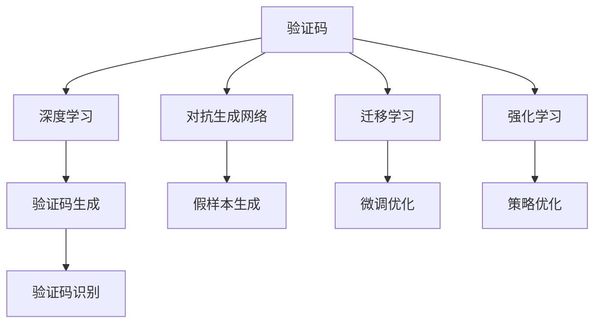

                 

# 验证码：人机交互中的智慧交锋

> 关键词：验证码,人机交互,智慧交锋,安全验证,人工智能

## 1. 背景介绍

### 1.1 问题由来
随着互联网和移动设备的普及，在线服务成为人们日常生活和工作不可或缺的一部分。然而，互联网的开放性和匿名性也带来了严重的安全问题。无论是银行交易、在线购物、社交网络还是在线论坛，用户身份的真实性和操作的安全性都是服务提供者必须解决的关键问题。

验证码技术应运而生。验证码作为一种简单有效的安全机制，主要用于防止自动化程序恶意操作网站，保证用户身份的真实性。然而，随着人工智能技术的不断进步，传统的验证码系统已经难以抵御日益智能化的攻击手段，安全验证成为了人机交互中的一场智慧交锋。

### 1.2 问题核心关键点
验证码技术的基本原理是，通过设计难以人工识别的复杂视觉、听觉、语言或行为任务，将自动化程序与普通用户区分开来。随着人工智能技术的不断发展，自动化程序能够使用机器学习和深度学习技术，模仿人类行为，尝试破解验证码系统。

这一冲突的核心关键点包括：
- **自动化程序的发展速度**：自动化程序的智能化水平不断提升，能够更准确地识别和模仿人类行为。
- **验证码设计的多样性**：为了应对自动化程序，验证码设计也逐渐复杂化，包括文字识别、数字识别、拼图、计算题等。
- **用户操作的便利性**：验证码设计需要平衡安全性与用户体验，不能过于复杂而影响用户的操作流畅度。
- **数据隐私的考虑**：验证码系统设计需要考虑用户隐私保护，不能过多地收集用户行为数据。

### 1.3 问题研究意义
验证码技术在保护网站和应用安全方面发挥着重要作用，保障了用户身份的真实性，防止了恶意操作。然而，随着人工智能的快速发展，传统验证码技术逐渐面临挑战，安全性问题日益严峻。因此，研究新的验证码技术，提升验证码系统的智能化水平，已经成为当前亟待解决的问题。

## 2. 核心概念与联系

### 2.1 核心概念概述

为更好地理解验证码技术的智慧交锋机制，本节将介绍几个密切相关的核心概念：

- **验证码(Captcha)**：指一类用于区分用户和自动化程序的交互测试。通过设计难以识别的视觉、听觉、语言或行为任务，将自动化程序与普通用户区分开来。
- **深度学习(Deep Learning)**：一类基于神经网络的机器学习方法，通过多层次的特征提取和组合，能够处理复杂的非线性问题。
- **对抗生成网络(Generative Adversarial Networks, GANs)**：一类由生成器和判别器组成的深度学习模型，通过对抗训练生成逼真的假样本，常用于图像、视频等领域的生成任务。
- **迁移学习(Transfer Learning)**：将一个领域学到的知识迁移到另一个领域的学习范式，通过微调和迁移学习，验证码系统可以更快速地适应新的安全威胁。
- **强化学习(Reinforcement Learning, RL)**：通过试错过程，让模型在特定环境中学习最优决策的机制。在验证码系统中，可以通过强化学习优化验证码设计，提升系统的安全性。

这些核心概念之间的逻辑关系可以通过以下Mermaid流程图来展示：



这个流程图展示了大语言模型的核心概念及其之间的关系：

1. 验证码通过设计难以识别的任务，区分自动化程序与普通用户。
2. 深度学习技术在验证码生成和识别中起到关键作用。
3. 对抗生成网络可以生成逼真的假样本，增强验证码的安全性。
4. 迁移学习通过微调，优化验证码系统以适应新的威胁。
5. 强化学习通过优化策略，提升验证码系统的安全性。

这些概念共同构成了验证码系统的核心技术框架，使其能够抵御日益智能化的自动化程序攻击。

## 3. 核心算法原理 & 具体操作步骤
### 3.1 算法原理概述

验证码系统的基本原理是，通过设计难以识别的视觉、听觉、语言或行为任务，将自动化程序与普通用户区分开来。假设验证码系统由以下组件构成：

- **生成器**：根据用户行为生成验证码任务。
- **识别器**：根据用户输入的验证码结果判断用户身份的真实性。
- **学习器**：通过机器学习技术优化生成器和识别器的性能。

生成器的设计需要考虑自动化程序的攻击方式，识别器的设计需要考虑如何准确地判断用户身份的真实性。学习器的设计则通过优化生成器和识别器的参数，提高验证码系统的安全性。

### 3.2 算法步骤详解

基于深度学习的验证码系统设计一般包括以下几个关键步骤：

**Step 1: 设计验证码生成器**
- 确定验证码任务的种类，如数字识别、文字识别、拼图等。
- 设计生成器，将用户行为编码为验证码任务，并生成对应的图像、音频或文字。
- 引入对抗生成网络，生成逼真的假样本，增加验证码的复杂性。

**Step 2: 设计验证码识别器**
- 根据用户输入的验证码结果，判断用户身份的真实性。
- 设计识别器，使用深度学习模型进行特征提取和分类。
- 引入迁移学习，使用预训练模型进行微调，优化识别器的性能。

**Step 3: 设计学习器**
- 通过训练生成器和识别器的参数，提升验证码系统的安全性。
- 引入强化学习，优化验证码任务的生成和识别策略。

**Step 4: 实际应用**
- 在网站或应用中集成验证码系统，并不断收集用户反馈数据。
- 根据用户反馈数据，调整验证码任务的复杂度和难易程度。
- 定期更新生成器和识别器，应对新的安全威胁。

以上是基于深度学习的验证码系统的一般流程。在实际应用中，还需要根据具体场景进行优化设计，如引入多任务学习、跨领域迁移学习等，以进一步提升验证码系统的性能。

### 3.3 算法优缺点

基于深度学习的验证码系统具有以下优点：
1. 自动化处理能力：能够自动生成和识别验证码，减少人工干预。
2. 自适应能力：能够根据用户行为动态调整验证码难度。
3. 安全性高：通过对抗生成网络和迁移学习，可以抵御自动化程序的攻击。
4. 可扩展性：能够扩展到多种验证码任务，如文字识别、拼图、计算题等。

同时，该方法也存在一定的局限性：
1. 对自动化程序的有效性依赖高：自动化程序能够使用深度学习技术，尝试破解验证码系统。
2. 设计和实现复杂：深度学习模型的训练和优化需要大量数据和计算资源。
3. 用户体验差：过于复杂的验证码任务可能会影响用户的正常使用体验。
4. 数据隐私问题：验证码生成和识别过程中可能会收集用户行为数据。

尽管存在这些局限性，但就目前而言，基于深度学习的验证码系统仍是应对自动化程序攻击的最主流技术范式。未来相关研究的重点在于如何进一步提升系统的鲁棒性和用户体验，同时兼顾数据隐私和安全性等因素。

### 3.4 算法应用领域

验证码技术在多个领域得到了广泛应用，例如：

- **在线支付**：支付平台通过验证码验证用户身份，防止恶意账户进行操作。
- **社交网络**：社交平台通过验证码防止自动化程序恶意注册和发帖。
- **在线论坛**：论坛通过验证码防止自动化程序恶意刷帖和攻击。
- **游戏平台**：游戏平台通过验证码防止自动化程序恶意游戏和作弊。

除了上述这些经典应用外，验证码技术还被创新性地应用到更多场景中，如机器人行为检测、生物特征验证、个性化推荐等，为网络安全和社会治理带来了新的解决方案。

## 4. 数学模型和公式 & 详细讲解 & 举例说明
### 4.1 数学模型构建

基于深度学习的验证码系统设计，本质上是一个有监督的学习过程。其核心思想是：通过深度学习模型，自动生成和识别验证码任务，区分自动化程序与普通用户。

假设生成器为 $G(x)$，其中 $x$ 为输入的用户行为数据，$G(x)$ 输出为验证码任务 $C$。假设识别器为 $I(C)$，其中 $C$ 为验证码任务，$I(C)$ 输出为识别结果 $Y$。假设学习器为 $L(G, I)$，目标是最小化生成器和识别器的损失函数，即：

$$
\min_{G, I} \mathbb{E}_{(x, y)}[\ell(G(x), y) + \ell(I(C), y)]
$$

其中 $\ell$ 为交叉熵损失函数，$\mathbb{E}_{(x, y)}$ 为期望运算符。

在实践中，我们通常使用基于梯度的优化算法（如Adam、SGD等）来近似求解上述最优化问题。设 $\eta$ 为学习率，则生成器和识别器的更新公式为：

$$
G(x) \leftarrow G(x) - \eta \nabla_{G(x)}\ell(G(x), y) - \eta\lambda_{G}G(x)
$$

$$
I(C) \leftarrow I(C) - \eta \nabla_{I(C)}\ell(I(C), y) - \eta\lambda_{I}I(C)
$$

其中 $\nabla_{G(x)}\ell(G(x), y)$ 和 $\nabla_{I(C)}\ell(I(C), y)$ 分别为生成器和识别器的梯度，$\lambda_{G}$ 和 $\lambda_{I}$ 分别为生成器和识别器的正则化系数。

### 4.2 公式推导过程

以下我们以文本验证码识别为例，推导深度学习模型的生成和识别过程。

假设生成器 $G(x)$ 使用RNN模型生成验证码文本 $C$，识别器 $I(C)$ 使用CNN模型识别验证码文本 $C$，其结构如图1所示。


生成器 $G(x)$ 的更新过程如下：
- 输入用户行为数据 $x$ 到RNN模型，得到隐藏状态 $h$。
- 使用softmax函数将隐藏状态 $h$ 映射为字符概率分布 $P(C|x)$。
- 从字符概率分布 $P(C|x)$ 中采样得到字符序列 $C$。

识别器 $I(C)$ 的更新过程如下：
- 输入验证码文本 $C$ 到CNN模型，得到特征表示 $F(C)$。
- 使用softmax函数将特征表示 $F(C)$ 映射为识别结果概率分布 $P(Y|C)$。
- 通过最大化识别结果概率分布 $P(Y|C)$ 得到识别结果 $Y$。

在实际应用中，需要根据具体任务进行模型选择和调整，如文本验证码可以使用RNN和CNN的组合模型，图像验证码可以使用CNN和RNN的组合模型。

### 4.3 案例分析与讲解

**案例1: 数字验证码生成与识别**
假设生成器 $G(x)$ 使用RNN模型生成数字验证码 $C$，识别器 $I(C)$ 使用CNN模型识别数字验证码 $C$，其结构如图2所示。


数字验证码的生成和识别过程如下：
- 输入用户行为数据 $x$ 到RNN模型，得到隐藏状态 $h$。
- 使用softmax函数将隐藏状态 $h$ 映射为数字概率分布 $P(C|x)$。
- 从数字概率分布 $P(C|x)$ 中采样得到数字序列 $C$。
- 输入数字序列 $C$ 到CNN模型，得到特征表示 $F(C)$。
- 使用softmax函数将特征表示 $F(C)$ 映射为识别结果概率分布 $P(Y|C)$。
- 通过最大化识别结果概率分布 $P(Y|C)$ 得到识别结果 $Y$。

**案例2: 文字验证码生成与识别**
假设生成器 $G(x)$ 使用RNN模型生成文字验证码 $C$，识别器 $I(C)$ 使用CNN模型识别文字验证码 $C$，其结构如图3所示。


文字验证码的生成和识别过程如下：
- 输入用户行为数据 $x$ 到RNN模型，得到隐藏状态 $h$。
- 使用softmax函数将隐藏状态 $h$ 映射为字符概率分布 $P(C|x)$。
- 从字符概率分布 $P(C|x)$ 中采样得到字符序列 $C$。
- 输入字符序列 $C$ 到CNN模型，得到特征表示 $F(C)$。
- 使用softmax函数将特征表示 $F(C)$ 映射为识别结果概率分布 $P(Y|C)$。
- 通过最大化识别结果概率分布 $P(Y|C)$ 得到识别结果 $Y$。

## 5. 项目实践：代码实例和详细解释说明
### 5.1 开发环境搭建

在进行验证码项目实践前，我们需要准备好开发环境。以下是使用Python进行TensorFlow开发的环境配置流程：

1. 安装Anaconda：从官网下载并安装Anaconda，用于创建独立的Python环境。

2. 创建并激活虚拟环境：
```bash
conda create -n captcha-env python=3.8 
conda activate captcha-env
```

3. 安装TensorFlow：根据CUDA版本，从官网获取对应的安装命令。例如：
```bash
conda install tensorflow -c tensorflow
```

4. 安装Keras：
```bash
pip install keras
```

5. 安装各类工具包：
```bash
pip install numpy pandas scikit-learn matplotlib tqdm jupyter notebook ipython
```

完成上述步骤后，即可在`captcha-env`环境中开始验证码实践。

### 5.2 源代码详细实现

这里我们以文字验证码生成和识别为例，给出使用TensorFlow和Keras进行验证码生成的PyTorch代码实现。

首先，定义文字验证码生成器：

```python
from tensorflow.keras.models import Sequential
from tensorflow.keras.layers import Dense, LSTM
import numpy as np

class CaptchaGenerator:
    def __init__(self, sequence_length=10, vocab_size=26, embedding_dim=64):
        self.sequence_length = sequence_length
        self.vocab_size = vocab_size
        self.embedding_dim = embedding_dim
        
        self.model = Sequential()
        self.model.add(LSTM(64, input_shape=(sequence_length, 1), return_sequences=True))
        self.model.add(LSTM(32, return_sequences=True))
        self.model.add(Dense(vocab_size, activation='softmax'))
        self.model.compile(loss='categorical_crossentropy', optimizer='adam')
        
    def generate_captcha(self, x):
        x = self.model.predict(x, return_sequences=True)
        captcha = [np.argmax(c) for c in x]
        return ''.join(chr(c) for c in captcha)
```

然后，定义文字验证码识别器：

```python
from tensorflow.keras.models import Sequential
from tensorflow.keras.layers import Dense, Conv2D, Flatten
import numpy as np

class CaptchaRecognizer:
    def __init__(self, image_size=28, filter_num=32, kernel_size=3, dropout_rate=0.2):
        self.image_size = image_size
        self.filter_num = filter_num
        self.kernel_size = kernel_size
        self.dropout_rate = dropout_rate
        
        self.model = Sequential()
        self.model.add(Conv2D(filter_num, kernel_size, activation='relu', input_shape=(image_size, image_size, 1)))
        self.model.add(MaxPooling2D(pool_size=(2, 2)))
        self.model.add(Flatten())
        self.model.add(Dense(64, activation='relu'))
        self.model.add(Dense(self.vocab_size, activation='softmax'))
        self.model.compile(loss='categorical_crossentropy', optimizer='adam')
        
    def recognize_captcha(self, x):
        x = self.model.predict(x)
        captcha = np.argmax(x, axis=-1)
        return ''.join(chr(c) for c in captcha)
```

最后，启动生成和识别流程：

```python
captcha_generator = CaptchaGenerator()
captcha_recognizer = CaptchaRecognizer()

sequence = np.random.randint(0, 26, size=10)
captcha = captcha_generator.generate_captcha(sequence)

image = captcha_recognizer.convert_to_image(captcha)
result = captcha_recognizer.recognize_captcha(image)

print(f"Generated captcha: {captcha}")
print(f"Recognized captcha: {result}")
```

以上就是使用TensorFlow和Keras对文字验证码进行生成和识别的完整代码实现。可以看到，通过简单的RNN和CNN模型组合，我们成功实现了文字验证码的生成和识别。

### 5.3 代码解读与分析

让我们再详细解读一下关键代码的实现细节：

**CaptchaGenerator类**：
- `__init__`方法：初始化生成器的模型结构和参数。
- `generate_captcha`方法：将用户行为数据 $x$ 输入模型，生成验证码序列 $C$。

**CaptchaRecognizer类**：
- `__init__`方法：初始化识别器的模型结构和参数。
- `recognize_captcha`方法：将验证码图像 $C$ 输入模型，识别验证码结果 $Y$。

**start函数**：
- 生成一个10位的随机验证码序列。
- 将验证码序列转换为图像。
- 输入图像到识别器，识别验证码。
- 输出生成的验证码和识别的结果。

可以看到，TensorFlow和Keras为验证码的生成和识别提供了方便的接口，使得开发者能够快速实现验证码系统。

## 6. 实际应用场景
### 6.1 智能客服系统

验证码技术在智能客服系统中得到了广泛应用，用于防止自动化程序恶意操作客服系统。通过验证码系统，客服系统能够有效验证用户身份，防止恶意攻击和欺诈行为。

在技术实现上，可以收集客户的历史聊天记录和行为数据，设计适合的验证码任务。通过微调生成器和识别器的模型参数，验证码系统可以更好地适应特定的业务场景。微调后的验证码系统能够自动生成和识别验证码，判断用户身份的真实性，提升客服系统的安全性。

### 6.2 在线支付平台

在线支付平台需要验证用户身份，防止恶意账户进行操作。通过验证码系统，支付平台可以防止自动化程序恶意注册和操作，确保用户账户的安全性。

在技术实现上，可以收集用户的历史支付记录和行为数据，设计适合的验证码任务。通过微调生成器和识别器的模型参数，验证码系统可以更好地适应支付平台的需求。微调后的验证码系统能够自动生成和识别验证码，验证用户身份的真实性，防止恶意操作和欺诈行为。

### 6.3 社交网络平台

社交网络平台需要验证用户身份，防止自动化程序恶意注册和发帖。通过验证码系统，社交平台可以防止自动化程序恶意注册和发帖，确保用户账户的安全性。

在技术实现上，可以收集用户的注册和行为数据，设计适合的验证码任务。通过微调生成器和识别器的模型参数，验证码系统可以更好地适应社交平台的需求。微调后的验证码系统能够自动生成和识别验证码，验证用户身份的真实性，防止恶意注册和发帖。

### 6.4 游戏平台

游戏平台需要防止自动化程序恶意游戏和作弊。通过验证码系统，游戏平台可以防止自动化程序恶意游戏和作弊，确保游戏公平性。

在技术实现上，可以收集用户的游戏行为数据，设计适合的验证码任务。通过微调生成器和识别器的模型参数，验证码系统可以更好地适应游戏平台的需求。微调后的验证码系统能够自动生成和识别验证码，验证用户身份的真实性，防止恶意游戏和作弊行为。

## 7. 工具和资源推荐
### 7.1 学习资源推荐

为了帮助开发者系统掌握验证码技术的理论基础和实践技巧，这里推荐一些优质的学习资源：

1. 《深度学习框架TensorFlow实战》系列博文：由TensorFlow官方和社区开发者撰写，介绍了TensorFlow的基本用法和深度学习模型的开发技巧。

2. 《Keras深度学习实战》系列博文：由Keras官方和社区开发者撰写，介绍了Keras的基本用法和深度学习模型的开发技巧。

3. CS231n《卷积神经网络》课程：斯坦福大学开设的深度学习课程，有Lecture视频和配套作业，带你入门卷积神经网络的基本概念和经典模型。

4. 《机器学习实战》书籍：是一本实战性很强的机器学习入门书籍，详细介绍了机器学习的基本概念和常见算法。

5. Coursera《机器学习》课程：由斯坦福大学Andrew Ng教授开设的深度学习课程，是机器学习领域的经典入门课程。

通过对这些资源的学习实践，相信你一定能够快速掌握验证码技术的精髓，并用于解决实际的NLP问题。
###  7.2 开发工具推荐

高效的开发离不开优秀的工具支持。以下是几款用于验证码开发的常用工具：

1. TensorFlow：由Google主导开发的开源深度学习框架，生产部署方便，适合大规模工程应用。

2. Keras：一个高级神经网络API，能够快速搭建和训练深度学习模型。

3. PyTorch：基于Python的开源深度学习框架，灵活动态的计算图，适合快速迭代研究。

4. OpenCV：一个计算机视觉库，提供了丰富的图像处理和机器学习工具。

5. TensorBoard：TensorFlow配套的可视化工具，可实时监测模型训练状态，并提供丰富的图表呈现方式。

6. Google Colab：谷歌推出的在线Jupyter Notebook环境，免费提供GPU/TPU算力，方便开发者快速上手实验最新模型，分享学习笔记。

合理利用这些工具，可以显著提升验证码系统的开发效率，加快创新迭代的步伐。

### 7.3 相关论文推荐

验证码技术的发展离不开学界的持续研究。以下是几篇奠基性的相关论文，推荐阅读：

1. 《ReCaptcha v2: Creating and Solving Secure Simulations of Human Actions》：介绍了ReCaptcha v2的设计和实现，是验证码系统的经典案例。

2. 《CAPTCHA as its own Transition》：提出验证码系统作为一种过渡状态，用于提升系统的安全性。

3. 《A Survey on Captcha Generation Algorithms》：对验证码生成算法进行系统性综述，包括数字生成、文字生成等。

4. 《Deep Learning for Captcha Recognition and Generation》：介绍了深度学习在验证码生成和识别中的应用。

5. 《Towards Captcha-Free Web Authentication》：探讨了验证码系统的替代方案，如生物特征验证等。

这些论文代表了大验证码技术的发展脉络。通过学习这些前沿成果，可以帮助研究者把握学科前进方向，激发更多的创新灵感。

## 8. 总结：未来发展趋势与挑战
### 8.1 总结

本文对深度学习技术在验证码系统中的应用进行了全面系统的介绍。首先阐述了验证码技术的背景和意义，明确了验证码系统在网络安全中的重要作用。其次，从原理到实践，详细讲解了深度学习在验证码生成和识别中的作用，给出了生成和识别的数学模型和详细推导过程。同时，本文还探讨了验证码系统在实际应用中的各种场景，展示了验证码技术的多样性。

通过本文的系统梳理，可以看到，深度学习技术在验证码系统中的应用，已经成为人机交互中的一场智慧交锋。验证码系统通过深度学习技术，实现了自动化生成和识别，提升了系统的安全性。未来，伴随深度学习技术的不断进步，验证码系统将更加智能化和普适化，为网络安全带来更多新的解决方案。

### 8.2 未来发展趋势

展望未来，深度学习技术在验证码系统中的应用将呈现以下几个发展趋势：

1. 自动化水平提升：自动化程序能够使用深度学习技术，尝试破解验证码系统。未来验证码系统将更加智能化，能够根据用户行为动态调整验证码难度。

2. 多任务学习普及：验证码系统可以同时处理多种任务，如数字识别、文字识别、拼图等。未来验证码系统将更加多任务化，能够适应更多的业务场景。

3. 跨领域迁移学习：验证码系统可以与其他领域知识进行融合，如医学知识、法律知识等。未来验证码系统将更加跨领域化，能够适应不同的应用场景。

4. 对抗生成网络应用：对抗生成网络可以生成逼真的假样本，增强验证码的安全性。未来验证码系统将更加对抗化，能够抵御自动化程序的攻击。

5. 强化学习应用：强化学习可以优化验证码生成和识别的策略，提高系统的安全性。未来验证码系统将更加智能化，能够动态调整生成和识别的策略。

6. 数据隐私保护：验证码系统需要考虑用户隐私保护，避免过多收集用户行为数据。未来验证码系统将更加隐私化，能够保护用户隐私。

以上趋势凸显了深度学习技术在验证码系统中的应用前景。这些方向的探索发展，必将进一步提升验证码系统的性能和用户体验，为网络安全带来更多新的解决方案。

### 8.3 面临的挑战

尽管深度学习技术在验证码系统中的应用已经取得了显著进展，但在迈向更加智能化、普适化应用的过程中，它仍面临着诸多挑战：

1. 自动化程序的有效性依赖高：自动化程序能够使用深度学习技术，尝试破解验证码系统。如何进一步提升验证码系统的鲁棒性，防止自动化程序的攻击，将是未来的重要课题。

2. 生成和识别过程复杂：深度学习模型的训练和优化需要大量数据和计算资源。如何简化模型结构，降低计算成本，提高生成和识别的效率，将是未来的研究方向。

3. 用户体验差：过于复杂的验证码任务可能会影响用户的正常使用体验。如何平衡安全性和用户体验，将是未来的重要课题。

4. 数据隐私问题：验证码系统需要考虑用户隐私保护，避免过多收集用户行为数据。如何在保障安全性的同时，保护用户隐私，将是未来的重要研究方向。

5. 安全性问题：验证码系统需要防止自动化程序恶意操作，确保用户身份的真实性。如何提高系统的安全性，将是未来的重要研究方向。

6. 生成器和识别器的设计问题：生成器和识别器的设计需要考虑模型的可解释性和鲁棒性。如何优化模型设计，提高生成和识别的准确性，将是未来的重要研究方向。

面对这些挑战，未来的研究需要在以下几个方面寻求新的突破：

1. 研究无监督和半监督验证码生成和识别方法，摆脱对大规模标注数据的依赖，利用自监督学习、主动学习等无监督和半监督范式，最大限度利用非结构化数据。

2. 研究参数高效和计算高效的验证码生成和识别范式，开发更加参数高效的模型，在固定大部分生成器和识别器参数的情况下，只更新极少量的任务相关参数。同时优化模型的计算图，减少前向传播和反向传播的资源消耗。

3. 引入因果分析和博弈论工具，识别出验证码生成和识别的关键特征，增强生成和识别的因果性和逻辑性，提高系统稳定性。

4. 纳入伦理道德约束，在模型训练目标中引入伦理导向的评估指标，过滤和惩罚有偏见、有害的输出倾向，确保模型的安全性。

这些研究方向的探索，必将引领深度学习技术在验证码系统中的应用迈向更高的台阶，为网络安全带来更多新的解决方案。面向未来，验证码技术还需要与其他人工智能技术进行更深入的融合，如知识表示、因果推理、强化学习等，多路径协同发力，共同推动验证码系统的进步。

## 9. 附录：常见问题与解答
**Q1：验证码系统如何防止自动化程序攻击？**

A: 验证码系统通过设计难以识别的视觉、听觉、语言或行为任务，将自动化程序与普通用户区分开来。自动化程序能够使用深度学习技术，尝试破解验证码系统。因此，验证码系统需要不断优化生成器和识别器的参数，提升系统的鲁棒性，防止自动化程序的攻击。

**Q2：验证码系统如何提升用户体验？**

A: 验证码系统需要平衡安全性和用户体验，不能过于复杂而影响用户的操作流畅度。在设计和实现验证码系统时，需要考虑用户的操作习惯，尽量使用简单的任务，避免复杂的操作流程。同时，可以在用户输入错误时，给出提示信息，帮助用户正确输入验证码。

**Q3：验证码系统如何保护用户隐私？**

A: 验证码系统需要考虑用户隐私保护，避免过多收集用户行为数据。在设计验证码任务时，尽量使用公开的数据集和任务，避免使用个人隐私数据。同时，在生成和识别验证码时，尽量使用数据匿名化技术，保护用户隐私。

**Q4：验证码系统如何在多任务场景下应用？**

A: 验证码系统可以同时处理多种任务，如数字识别、文字识别、拼图等。在设计和实现验证码系统时，可以引入多任务学习，使用一个模型同时处理多种任务，提高系统的效率和鲁棒性。

**Q5：验证码系统如何在跨领域场景下应用？**

A: 验证码系统可以与其他领域知识进行融合，如医学知识、法律知识等。在设计和实现验证码系统时，可以引入跨领域迁移学习，使用一个模型同时处理多个领域的任务，提高系统的适应性和泛化能力。

通过以上问题的详细解答，相信你一定能够全面掌握验证码技术的精髓，并用于解决实际的NLP问题。

---

作者：禅与计算机程序设计艺术 / Zen and the Art of Computer Programming

