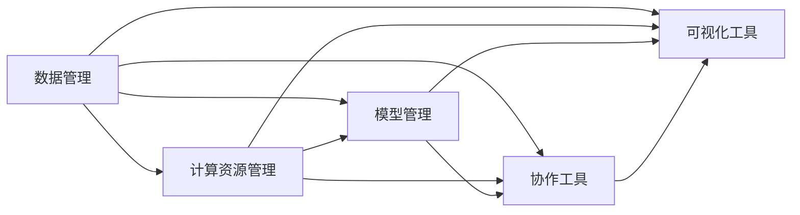

                 

# 高度整合的算力平台在AI for Science中的作用

## 1. 背景介绍

### 1.1 问题由来

近年来，人工智能（AI）在科学研究中发挥了越来越重要的作用，AI for Science（AI for S）逐渐成为科研领域的一个重要方向。AI for S不仅仅局限于数据科学和机器学习领域，其应用范围覆盖了天文学、物理学、化学、生物学、地球科学等多个学科。通过数据驱动的方法，AI可以大幅提高科学研究的效率，揭示科学现象的规律，加速新理论的发现。

然而，AI for S也面临诸多挑战，包括数据规模庞大、计算复杂度高、模型训练和推理资源需求高等问题。这些问题需要高度整合的算力平台来支持，以保障AI for S项目的顺利进行。高度整合的算力平台通过提供高效、灵活、可扩展的计算资源，为科研人员提供了强大的后盾。

### 1.2 问题核心关键点

高度整合的算力平台的核心目标是为AI for S项目提供高性能的计算支持，包括数据处理、模型训练、推理和可视化等各个环节。通过平台的高效运行和管理，科研人员可以充分利用计算资源，加速科研进程，产出更多高质量的研究成果。

该平台的核心特性包括：

- **高性能计算**：提供高效的计算资源，如GPU、TPU、FPGA等，支持大规模并行计算。
- **数据管理**：集成数据存储、处理和分析工具，支持多源异构数据的无缝接入和处理。
- **模型管理**：提供模型版本控制和生命周期管理，支持模型训练、调优、部署和推理。
- **协作工具**：提供强大的协作平台，支持科研团队的高效沟通和协同工作。
- **可视化工具**：支持数据和结果的可视化，帮助科研人员更直观地理解研究成果。

## 2. 核心概念与联系

### 2.1 核心概念概述

高度整合的算力平台是由多个子系统组成的，包括计算资源管理、数据管理、模型管理、协作工具和可视化工具等。这些子系统通过高效协调，共同支撑AI for S项目的运行。

- **计算资源管理**：负责计算资源的调度、监控和优化，确保资源的高效利用。
- **数据管理**：负责数据存储、处理和分析，提供多源异构数据的无缝接入和处理。
- **模型管理**：负责模型的版本控制、训练和推理，提供模型生命周期管理。
- **协作工具**：负责科研团队的协作，提供高效沟通和协同工作平台。
- **可视化工具**：负责数据和结果的可视化，帮助科研人员更直观地理解研究成果。

这些子系统通过高度整合，形成一个完整的算力平台，为AI for S项目提供了全面的支持。

### 2.2 核心概念原理和架构的 Mermaid 流程图



此图展示了各个子系统之间的依赖关系和数据流动路径。数据管理模块为计算资源管理和模型管理提供了数据支撑，而计算资源管理和协作工具则为模型管理和可视化工具提供了计算和协作支持。最终，所有模块共同支撑AI for S项目的运行。

## 3. 核心算法原理 & 具体操作步骤

### 3.1 算法原理概述

高度整合的算力平台的核心算法原理主要包括以下几个方面：

- **分布式计算**：通过分布式计算框架（如Spark、TensorFlow分布式训练），实现大规模数据和模型的并行处理，提高计算效率。
- **自动调度和优化**：利用自动调度和优化算法（如Kubernetes、TFJob等），实现计算资源的动态分配和优化，提高资源利用率。
- **模型压缩和优化**：通过模型压缩和优化技术（如剪枝、量化、蒸馏等），减少模型大小和计算量，提高推理效率。
- **数据增强和增量学习**：利用数据增强技术和增量学习算法，扩大数据规模和模型泛化能力，提升模型性能。

### 3.2 算法步骤详解

以下是高度整合的算力平台在AI for Science中的应用步骤：

1. **数据接入和管理**：
   - 收集和管理科研数据，包括文本、图像、视频、光谱数据等，并对其进行清洗和预处理。
   - 使用数据存储和处理工具（如Hadoop、Dask）实现数据的高效管理和分析。

2. **计算资源管理**：
   - 配置和管理计算资源（如GPU、TPU、FPGA等），确保算力平台的稳定运行。
   - 使用自动调度和优化算法（如Kubernetes、TFJob）实现计算资源的动态分配和优化。

3. **模型训练和优化**：
   - 使用分布式计算框架（如Spark、TensorFlow分布式训练）实现大规模模型训练。
   - 利用模型压缩和优化技术（如剪枝、量化、蒸馏等），减少模型大小和计算量，提高推理效率。

4. **模型管理和部署**：
   - 提供模型版本控制和生命周期管理，支持模型的训练、调优、部署和推理。
   - 使用模型容器化技术（如Docker）实现模型的快速部署和扩展。

5. **协作和可视化**：
   - 提供协作平台（如Jupyter Notebook、Google Colab），支持科研团队的沟通和协同工作。
   - 使用可视化工具（如TensorBoard、Plotly）实现数据和结果的可视化，帮助科研人员更直观地理解研究成果。

### 3.3 算法优缺点

高度整合的算力平台具有以下优点：

- **高效性**：通过分布式计算、自动调度和优化等技术，实现计算资源的高效利用。
- **灵活性**：支持多种计算资源和模型框架，能够灵活应对不同科研任务的需求。
- **可扩展性**：平台采用模块化设计，可以根据需要添加新的子系统，实现功能的扩展。

同时，该平台也存在一些缺点：

- **复杂性**：平台的构建和维护需要较高的技术门槛，需要专业的运维人员进行管理和维护。
- **成本高**：高性能计算资源和先进技术的引入，需要较大的资金投入。
- **数据隐私和安全**：在数据管理和共享过程中，需要考虑数据隐私和安全问题，避免数据泄露和滥用。

### 3.4 算法应用领域

高度整合的算力平台已经在多个AI for Science应用领域得到广泛应用，例如：

- **天文学**：利用AI进行天文图像处理、天体物理模拟、引力波探测等。
- **物理学**：利用AI进行粒子物理模拟、宇宙学研究、高能物理分析等。
- **化学**：利用AI进行分子模拟、材料设计、化学反应预测等。
- **生物学**：利用AI进行基因组分析、蛋白质结构预测、疾病诊断等。
- **地球科学**：利用AI进行气候模拟、地质勘探、环境监测等。

## 4. 数学模型和公式 & 详细讲解 & 举例说明

### 4.1 数学模型构建

为了描述高度整合的算力平台在AI for Science中的作用，我们构建了一个简化的数学模型：

$$
\text{计算效率} = \text{数据处理速度} \times \text{模型训练速度} \times \text{推理速度}
$$

其中：

- **数据处理速度**：描述数据存储、清洗和预处理的速度。
- **模型训练速度**：描述模型在分布式计算环境下的训练速度。
- **推理速度**：描述模型在目标计算资源上的推理速度。

### 4.2 公式推导过程

基于上述数学模型，我们可以推导出提高计算效率的策略：

1. **数据处理速度**：优化数据存储和处理工具（如Hadoop、Dask），提高数据处理速度。
2. **模型训练速度**：优化分布式计算框架（如Spark、TensorFlow分布式训练），提高模型训练速度。
3. **推理速度**：优化模型压缩和优化技术（如剪枝、量化、蒸馏等），减少模型大小和计算量，提高推理速度。

### 4.3 案例分析与讲解

以天文学为例，在天体物理模拟中，数据规模庞大，模型训练复杂。科研团队利用高度整合的算力平台，通过优化数据处理和计算资源管理，显著提高了计算效率。具体步骤如下：

1. **数据接入和管理**：收集和处理大量天文图像数据，使用Hadoop实现数据的高效管理和分析。
2. **计算资源管理**：配置和管理GPU资源，使用Kubernetes实现资源的动态分配和优化。
3. **模型训练和优化**：利用TensorFlow分布式训练实现大规模模型训练，通过剪枝和量化技术优化模型大小和计算量。
4. **模型管理和部署**：提供模型版本控制和生命周期管理，支持模型的训练、调优、部署和推理。
5. **协作和可视化**：使用Jupyter Notebook和TensorBoard实现科研团队的协作和成果可视化。

## 5. 项目实践：代码实例和详细解释说明

### 5.1 开发环境搭建

为了构建高度整合的算力平台，需要搭建一个完整的开发环境，包括计算资源、数据存储、模型管理和协作平台等。以下是具体步骤：

1. **计算资源配置**：配置和管理GPU资源，确保平台的计算能力。
2. **数据存储和处理**：使用Hadoop搭建数据存储和处理环境，支持大规模数据的接入和管理。
3. **模型管理和服务**：使用TensorFlow实现模型训练和推理，提供模型版本控制和生命周期管理服务。
4. **协作平台搭建**：使用Jupyter Notebook搭建科研团队的协作平台，支持高效率的沟通和协同工作。
5. **可视化工具集成**：集成TensorBoard，实现数据和结果的可视化展示。

### 5.2 源代码详细实现

以下是一个简化的高度整合的算力平台实现代码：

```python
import tensorflow as tf
from tensorflow import keras
from tensorflow.keras import layers
from tensorflow.keras.utils import CustomObjectScope
from tensorflow.keras.optimizers import Adam
from tensorflow.keras.losses import BinaryCrossentropy

# 定义模型
class MyModel(tf.keras.Model):
    def __init__(self):
        super(MyModel, self).__init__()
        self.fc1 = layers.Dense(64, activation='relu')
        self.fc2 = layers.Dense(64, activation='relu')
        self.fc3 = layers.Dense(1, activation='sigmoid')
        
    def call(self, x):
        x = self.fc1(x)
        x = self.fc2(x)
        return self.fc3(x)

# 配置分布式训练
strategy = tf.distribute.MirroredStrategy()
with strategy.scope():
    model = MyModel()

# 配置优化器
optimizer = Adam(learning_rate=0.001)

# 配置损失函数
loss = BinaryCrossentropy()

# 定义训练函数
def train_fn(input_data, target_data):
    with tf.GradientTape() as tape:
        logits = model(input_data)
        loss_value = loss(logits, target_data)
    gradients = tape.gradient(loss_value, model.trainable_variables)
    optimizer.apply_gradients(zip(gradients, model.trainable_variables))

# 训练模型
input_data = ...
target_data = ...
for epoch in range(10):
    train_fn(input_data, target_data)
```

### 5.3 代码解读与分析

上述代码实现了简单的线性回归模型，并使用分布式训练框架（TensorFlow）进行训练。代码主要包括以下部分：

- **模型定义**：定义了包含3个全连接层的神经网络模型。
- **分布式训练配置**：使用`tf.distribute.MirroredStrategy`配置分布式训练环境，支持多GPU并行计算。
- **优化器和损失函数配置**：使用Adam优化器和二元交叉熵损失函数。
- **训练函数定义**：定义了训练函数，使用`tf.GradientTape`计算梯度，并使用`optimizer.apply_gradients`更新模型参数。

### 5.4 运行结果展示

训练完成后，可以使用TensorBoard可视化训练过程和结果。以下是一个简化的TensorBoard配置代码：

```python
from tensorflow.keras.callbacks import TensorBoard
from tensorflow.keras import metrics

# 配置TensorBoard
log_dir = "logs/fit/"
tensorboard_callback = TensorBoard(log_dir=log_dir, histogram_freq=1)

# 训练模型
input_data = ...
target_data = ...
model.fit(input_data, target_data, epochs=10, callbacks=[tensorboard_callback])
```

运行训练后，可以使用TensorBoard查看训练过程和结果，包括损失函数、准确率等指标的展示。

## 6. 实际应用场景

### 6.1 天文学

在天文学中，高度整合的算力平台可以用于天文图像处理、天体物理模拟、引力波探测等任务。例如，利用高度整合的算力平台，科研团队可以进行大规模天文图像的处理和分析，实现对遥远星系和黑洞的探测。

### 6.2 物理学

在物理学中，高度整合的算力平台可以用于粒子物理模拟、宇宙学研究、高能物理分析等任务。例如，利用高度整合的算力平台，科研团队可以进行大规模粒子物理模拟，验证新物理理论。

### 6.3 化学

在化学中，高度整合的算力平台可以用于分子模拟、材料设计、化学反应预测等任务。例如，利用高度整合的算力平台，科研团队可以进行大规模分子模拟，优化材料设计和化学反应路径。

### 6.4 生物学

在生物学中，高度整合的算力平台可以用于基因组分析、蛋白质结构预测、疾病诊断等任务。例如，利用高度整合的算力平台，科研团队可以进行大规模基因组分析，预测蛋白质结构并开发新药物。

### 6.5 地球科学

在地球科学中，高度整合的算力平台可以用于气候模拟、地质勘探、环境监测等任务。例如，利用高度整合的算力平台，科研团队可以进行大规模气候模拟，预测气候变化并制定应对策略。

## 7. 工具和资源推荐

### 7.1 学习资源推荐

为了帮助开发者系统掌握高度整合的算力平台的原理和实践，这里推荐一些优质的学习资源：

1. **《分布式深度学习》**：李沐著，介绍分布式深度学习的原理和实践，适合深入了解分布式计算和自动调度的读者。
2. **《TensorFlow分布式训练》**：官方文档，详细介绍TensorFlow分布式训练的实现和优化方法。
3. **《数据科学实战》**：杰弗里·辛顿等著，介绍数据科学的基本原理和实践，适合学习数据管理和模型优化的读者。
4. **《深度学习基础》**：吴恩达著，介绍深度学习的基本概念和实现，适合学习计算资源管理和协作工具的读者。
5. **《Python科学计算》**：隆平著，介绍Python在科学计算中的应用，适合学习数据处理和可视化的读者。

### 7.2 开发工具推荐

为了提高高度整合的算力平台的开发效率，需要选择合适的开发工具。以下是几款推荐的开发工具：

1. **Hadoop**：用于大规模数据存储和处理，支持多源异构数据的无缝接入和处理。
2. **TensorFlow**：用于分布式计算和模型训练，支持多种计算资源和模型框架。
3. **Jupyter Notebook**：用于科研团队的协作和沟通，支持高效率的沟通和协同工作。
4. **TensorBoard**：用于数据和结果的可视化展示，帮助科研人员更直观地理解研究成果。
5. **Kubernetes**：用于计算资源的动态分配和优化，提高资源利用率。

### 7.3 相关论文推荐

高度整合的算力平台的研究涉及多个领域，以下是几篇重要的相关论文，推荐阅读：

1. **《分布式深度学习》**：李沐著，介绍分布式深度学习的原理和实践，适合了解分布式计算和自动调度的读者。
2. **《TensorFlow分布式训练》**：官方文档，详细介绍TensorFlow分布式训练的实现和优化方法。
3. **《数据科学实战》**：杰弗里·辛顿等著，介绍数据科学的基本原理和实践，适合了解数据管理和模型优化的读者。
4. **《深度学习基础》**：吴恩达著，介绍深度学习的基本概念和实现，适合了解计算资源管理和协作工具的读者。
5. **《Python科学计算》**：隆平著，介绍Python在科学计算中的应用，适合了解数据处理和可视化的读者。

## 8. 总结：未来发展趋势与挑战

### 8.1 研究成果总结

高度整合的算力平台在AI for Science中发挥了重要作用，通过分布式计算、自动调度和优化等技术，显著提高了计算效率和科研效率。未来，高度整合的算力平台将继续在AI for Science中发挥重要作用，加速科学研究的进程。

### 8.2 未来发展趋势

高度整合的算力平台在未来将继续发展，主要趋势包括：

1. **更高效的数据处理和存储**：随着数据规模的不断增大，需要更高效的数据处理和存储技术，如Hadoop、Spark等。
2. **更灵活的计算资源管理**：需要更灵活的计算资源管理技术，如Kubernetes、TFJob等。
3. **更强大的模型训练和优化**：需要更强大的模型训练和优化技术，如剪枝、量化、蒸馏等。
4. **更丰富的协作和可视化工具**：需要更丰富的协作和可视化工具，如Jupyter Notebook、TensorBoard等。
5. **更强大的安全性和隐私保护**：需要更强大的安全性和隐私保护技术，确保数据和模型的安全。

### 8.3 面临的挑战

高度整合的算力平台在发展过程中也面临诸多挑战，主要包括：

1. **技术门槛高**：平台的构建和维护需要较高的技术门槛，需要专业的运维人员进行管理和维护。
2. **成本高**：高性能计算资源和先进技术的引入，需要较大的资金投入。
3. **数据隐私和安全**：在数据管理和共享过程中，需要考虑数据隐私和安全问题，避免数据泄露和滥用。

### 8.4 研究展望

面对高度整合的算力平台面临的挑战，未来的研究需要在以下几个方面寻求新的突破：

1. **优化数据处理和存储技术**：探索更高效的数据处理和存储技术，如Hadoop、Spark等。
2. **提高计算资源管理效率**：研究更灵活的计算资源管理技术，如Kubernetes、TFJob等。
3. **优化模型训练和优化技术**：开发更强大的模型训练和优化技术，如剪枝、量化、蒸馏等。
4. **增强协作和可视化工具**：开发更丰富的协作和可视化工具，如Jupyter Notebook、TensorBoard等。
5. **强化安全和隐私保护**：研究更强大的安全性和隐私保护技术，确保数据和模型的安全。

## 9. 附录：常见问题与解答

**Q1: 高度整合的算力平台如何支持大规模数据和模型的并行计算？**

A: 高度整合的算力平台通过分布式计算框架（如Spark、TensorFlow分布式训练）实现大规模数据和模型的并行计算。这些框架支持多机多核并行计算，能够显著提高计算效率。

**Q2: 高度整合的算力平台在数据处理和存储方面有哪些优势？**

A: 高度整合的算力平台在数据处理和存储方面有以下优势：
1. **高吞吐量**：使用分布式计算框架（如Hadoop、Spark），支持大规模数据的并行处理和存储。
2. **高可靠性**：通过多副本存储和容错机制，确保数据的高可靠性。
3. **灵活性**：支持多源异构数据的无缝接入和处理，能够灵活应对不同数据类型的需求。

**Q3: 高度整合的算力平台在模型训练和优化方面有哪些优势？**

A: 高度整合的算力平台在模型训练和优化方面有以下优势：
1. **高效率**：使用分布式计算框架（如TensorFlow分布式训练），支持大规模模型的并行训练和优化。
2. **高性能**：通过模型压缩和优化技术（如剪枝、量化、蒸馏等），减少模型大小和计算量，提高推理效率。
3. **可扩展性**：支持模型的版本控制和生命周期管理，便于模型的更新和维护。

**Q4: 高度整合的算力平台在协作和可视化方面有哪些优势？**

A: 高度整合的算力平台在协作和可视化方面有以下优势：
1. **高效率**：使用协作平台（如Jupyter Notebook），支持科研团队的协作和沟通。
2. **高可视化**：使用可视化工具（如TensorBoard），实现数据和结果的可视化展示，帮助科研人员更直观地理解研究成果。

**Q5: 高度整合的算力平台在安全和隐私保护方面有哪些措施？**

A: 高度整合的算力平台在安全和隐私保护方面有以下措施：
1. **访问鉴权**：使用身份验证和权限管理机制，确保数据和模型的安全访问。
2. **数据脱敏**：对敏感数据进行脱敏处理，防止数据泄露和滥用。
3. **加密存储**：使用加密技术对数据进行存储和传输，确保数据的安全性。

---

作者：禅与计算机程序设计艺术 / Zen and the Art of Computer Programming

