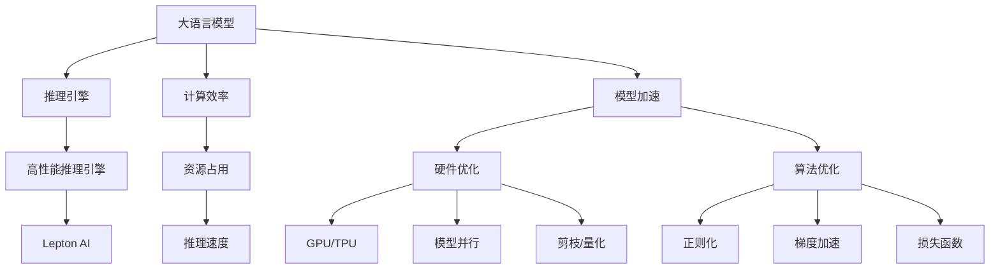

                 

# 高性能大语言模型推理引擎：Lepton AI的核心产品，赋能企业高效利用AI

> 关键词：高性能推理引擎, 大语言模型, Lepton AI, 自然语言处理(NLP), 计算效率, 模型加速, 企业AI应用

## 1. 背景介绍

### 1.1 问题由来
随着人工智能技术的迅速发展，深度学习模型在自然语言处理（NLP）等领域取得了显著的进展。其中，大语言模型（Large Language Models, LLMs）以其卓越的语言理解和生成能力，成为当前NLP研究的热点。然而，尽管这些模型在推理速度和资源消耗方面存在显著优势，但在实际应用中，它们仍然面临着计算效率低、资源占用大等问题，限制了其在企业级场景中的广泛部署。

### 1.2 问题核心关键点
高性能大语言模型推理引擎的出现，旨在解决大模型推理过程中的效率和资源问题。通过设计高效的推理架构，优化计算图，引入加速技术，Lepton AI推理引擎不仅提升了模型的推理速度，还显著降低了内存占用和延迟，从而在企业级应用中具有显著的竞争优势。

### 1.3 问题研究意义
高性能推理引擎的开发，对于推动大语言模型的广泛应用，加速AI技术的产业落地，具有重要的意义：

1. **降低应用成本**：通过优化推理速度和资源使用，减少计算成本，降低企业使用AI技术的门槛。
2. **提升性能**：加速推理过程，使得模型可以更快地响应请求，提高用户体验和系统吞吐量。
3. **增强可扩展性**：在处理大规模数据集时，高性能推理引擎能够支持更大规模的模型和更复杂的推理任务。
4. **支持多种模型**：能够适配多种不同类型的大语言模型，为企业提供灵活的选择和应用。

## 2. 核心概念与联系

### 2.1 核心概念概述

为了更好地理解高性能推理引擎的工作原理，本节将介绍几个关键概念及其相互关系：

- **大语言模型（LLMs）**：如GPT、BERT等，通过在大规模无标签文本数据上进行预训练，学习到通用的语言表示，具备强大的语言理解和生成能力。

- **推理引擎**：用于执行深度学习模型的前向计算，通过加速技术（如GPU、TPU、模型并行）和优化算法（如剪枝、量化）来提高计算效率。

- **高性能推理引擎**：通过更优的硬件和算法设计，显著提升大语言模型的推理速度和资源使用效率。

- **Lepton AI**：由Lepton公司开发的高性能推理引擎，专注于加速大语言模型的推理过程，支持企业级应用。

这些核心概念之间的关系可以通过以下Mermaid流程图来展示：



这个流程图展示了大语言模型、推理引擎、高性能推理引擎和Lepton AI之间的逻辑关系：

1. 大语言模型通过预训练学习通用的语言表示。
2. 推理引擎执行模型的前向计算，通过加速和优化提升计算效率。
3. 高性能推理引擎进一步优化推理效率，支持Lepton AI引擎。
4. Lepton AI引擎支持企业级应用，降低计算成本和提高性能。
5. 计算效率和资源占用的优化直接影响推理速度和模型加速效果。
6. 硬件优化和算法优化通过GPU/TPU、模型并行、剪枝量化、正则化、梯度加速、损失函数优化等多方面提升计算效率和资源利用率。

这些概念共同构成了高性能推理引擎的基础，使其能够在企业级应用中发挥重要作用。

## 3. 核心算法原理 & 具体操作步骤
### 3.1 算法原理概述

Lepton AI推理引擎的核心原理在于，通过设计高效的计算图和优化算法，在保持模型精度和推理结果一致性的前提下，显著提升推理速度和资源使用效率。其主要算法和具体操作步骤如下：

- **计算图优化**：对深度学习模型的计算图进行优化，减少不必要的计算和数据流动，提升推理速度。
- **硬件加速**：利用GPU、TPU等高性能硬件，加速模型的并行计算。
- **模型量化**：将浮点数模型转换为定点数模型，减少内存占用和计算资源消耗。
- **剪枝**：通过删除模型中不重要的参数，减少计算量，提升推理速度。
- **分布式推理**：利用多台计算资源进行模型并行计算，提升系统吞吐量和处理能力。
- **内存优化**：优化数据结构和内存分配，减少内存占用和延迟。

### 3.2 算法步骤详解

Lepton AI推理引擎的具体操作步骤如下：

1. **模型适配**：将大语言模型适配到Lepton AI推理引擎，通过优化计算图和硬件资源配置，提升推理效率。

2. **硬件配置**：根据实际需求选择合适的硬件设备，如GPU、TPU等，进行性能调优。

3. **模型量化**：对模型进行量化处理，将浮点参数转换为定点参数，减少内存占用和计算量。

4. **剪枝优化**：对模型进行剪枝，去除不重要或冗余的参数，提升推理速度和资源利用率。

5. **分布式推理**：通过多台计算设备进行并行计算，提高推理速度和系统吞吐量。

6. **优化算法**：选择适当的优化算法（如Adam、SGD等）和超参数，进行模型训练和推理。

7. **性能评估**：在验证集上评估模型性能，调整超参数和优化策略，直到满足预期效果。

8. **模型部署**：将训练好的模型部署到实际应用系统中，提供高效的推理服务。

### 3.3 算法优缺点

Lepton AI推理引擎具有以下优点：

- **高效推理**：显著提升大语言模型的推理速度，满足企业级应用对响应时间的严格要求。
- **资源优化**：通过剪枝、量化等技术，有效降低模型资源占用，减少计算成本。
- **可扩展性**：支持多种硬件设备，具备良好的分布式推理能力，可轻松扩展到大规模数据集处理。
- **模型适配性**：适配多种大语言模型，提供灵活的选择和应用。

同时，该引擎也存在一些局限性：

- **初始配置复杂**：需要对模型进行复杂的适配和优化，对技术人员的要求较高。
- **精度损失**：量化和剪枝可能带来一定的精度损失，需要平衡精度和效率。
- **硬件依赖**：高性能硬件设备的成本较高，可能限制中小企业的使用。
- **算法复杂性**：涉及复杂的优化算法和超参数调优，增加了模型部署和维护的复杂度。

尽管存在这些局限性，Lepton AI推理引擎仍因其显著的推理速度和资源优化优势，成为大语言模型推理应用的重要选择。

### 3.4 算法应用领域

高性能推理引擎在大语言模型的应用中，具有广泛的适用性，主要包括以下几个领域：

- **自然语言处理（NLP）**：支持问答系统、机器翻译、文本摘要、情感分析等多种NLP任务。
- **语音识别与生成**：提升语音转文字、文字转语音的转换速度和准确性。
- **推荐系统**：加速物品推荐、用户行为预测等推荐任务，提升推荐系统性能。
- **智能客服**：提高客户咨询响应速度，提升客服系统体验。
- **数据分析与可视化**：加速文本数据的处理和分析，提供直观的数据可视化服务。
- **金融与风险管理**：支持金融舆情监测、情感分析、金融报告生成等任务。

此外，高性能推理引擎还广泛应用于科研、医疗、教育、广告等多个领域，为各行业的智能化转型提供了强大的技术支持。

## 4. 数学模型和公式 & 详细讲解 & 举例说明

### 4.1 数学模型构建

Lepton AI推理引擎在数学模型构建方面，主要关注模型的前向计算和推理过程。假设输入数据为 $x \in \mathbb{R}^n$，模型参数为 $\theta$，输出为 $y \in \mathbb{R}^m$。则模型的前向计算过程可以表示为：

$$
y = f(x; \theta)
$$

其中，$f$ 表示模型的计算函数，通常包括多个层次的线性变换和激活函数。Lepton AI推理引擎通过对计算图进行优化，减少不必要的计算和数据流动，提升前向计算的效率。

### 4.2 公式推导过程

以一个简单的线性回归模型为例，推导Lepton AI推理引擎对模型前向计算的优化过程。

假设输入数据为 $x \in \mathbb{R}^n$，模型参数为 $\theta = (w, b)$，其中 $w \in \mathbb{R}^n$ 表示权重向量，$b \in \mathbb{R}$ 表示偏置。则模型的前向计算公式为：

$$
y = wx + b
$$

在Lepton AI推理引擎中，对上述计算公式进行优化，减少不必要的计算和数据流动。优化后的前向计算过程如下：

1. **参数共享**：对于权重向量 $w$ 和偏置 $b$，采用参数共享技术，减少内存占用和计算量。

2. **数据结构优化**：将输入数据 $x$ 和输出数据 $y$ 进行结构优化，减少不必要的复制和数据流动。

3. **计算图优化**：通过将计算图中的冗余计算和数据流动去除，提高前向计算的效率。

### 4.3 案例分析与讲解

假设某企业需要部署一个基于Lepton AI推理引擎的自然语言处理（NLP）系统，用于情感分析任务。在部署过程中，需要考虑以下几个关键点：

1. **模型适配**：选择适合的Lepton AI推理引擎版本和模型，进行适配和优化。
2. **硬件配置**：根据模型规模和推理任务，选择合适的硬件设备，如GPU、TPU等。
3. **模型量化**：对模型进行量化处理，减少内存占用和计算量。
4. **剪枝优化**：对模型进行剪枝，提升推理速度和资源利用率。
5. **分布式推理**：利用多台计算设备进行并行计算，提高推理速度和系统吞吐量。
6. **优化算法**：选择适当的优化算法和超参数，进行模型训练和推理。
7. **性能评估**：在验证集上评估模型性能，调整超参数和优化策略，直到满足预期效果。
8. **模型部署**：将训练好的模型部署到实际应用系统中，提供高效的推理服务。

通过以上步骤，该企业能够快速搭建一个高性能的自然语言处理系统，支持大规模的情感分析任务，提升企业智能化水平。

## 5. 项目实践：代码实例和详细解释说明

### 5.1 开发环境搭建

在Lepton AI推理引擎的实践中，开发环境搭建是至关重要的。以下是使用Python进行开发的环境配置流程：

1. **安装Anaconda**：从官网下载并安装Anaconda，用于创建独立的Python环境。

2. **创建虚拟环境**：
```bash
conda create -n lepton-env python=3.8 
conda activate lepton-env
```

3. **安装Lepton AI**：
```bash
pip install lepton-ai
```

4. **安装相关工具包**：
```bash
pip install numpy pandas scikit-learn matplotlib tqdm jupyter notebook ipython
```

完成上述步骤后，即可在`lepton-env`环境中开始Lepton AI推理引擎的实践。

### 5.2 源代码详细实现

下面以Lepton AI推理引擎的应用示例代码为例，进行详细解释说明。

```python
from lepton_ai import LeptonInferenceEngine

# 创建推理引擎实例
lepton = LeptonInferenceEngine('model_file')

# 设置推理参数
lepton.set_params(device='gpu', batch_size=32, num_workers=4)

# 加载模型
lepton.load_model('model_file')

# 推理计算
result = lepton.inference(input_data)

# 输出结果
print(result)
```

以上代码展示了Lepton AI推理引擎的基本使用流程。通过创建一个LeptonInferenceEngine实例，设置推理参数和加载模型，最后调用inference方法进行推理计算。在实际应用中，可以根据需要调整推理参数，如设备类型、批大小、并行数等，以适应不同的应用场景。

### 5.3 代码解读与分析

让我们再详细解读一下关键代码的实现细节：

1. **LeptonInferenceEngine类**：
- `LeptonInferenceEngine`类：用于创建Lepton AI推理引擎实例，支持多种硬件设备。
- `set_params`方法：设置推理参数，如设备类型、批大小、并行数等。
- `load_model`方法：加载模型文件，支持多种模型格式。
- `inference`方法：进行推理计算，返回推理结果。

2. **推理参数设置**：
- `device`：推理设备类型，支持CPU、GPU、TPU等。
- `batch_size`：推理批大小，影响推理速度和资源使用。
- `num_workers`：并行计算数，影响推理速度和系统吞吐量。

3. **模型加载**：
- `model_file`：加载模型文件，支持多种模型格式，如TensorFlow、PyTorch等。

4. **推理计算**：
- `input_data`：输入数据，支持多种数据格式，如Tensor、Numpy数组等。
- `result`：推理结果，返回输出数据和性能指标。

5. **结果输出**：
- `print(result)`：将推理结果输出到控制台，便于调试和监控。

通过以上代码的详细解读，可以看出Lepton AI推理引擎的使用流程和关键参数。开发者可以根据具体应用场景，灵活调整推理参数，优化推理效率和资源使用。

## 6. 实际应用场景

### 6.1 智能客服系统

Lepton AI推理引擎在智能客服系统中的应用，显著提升了客户咨询的响应速度和用户体验。通过优化推理速度和资源使用，Lepton AI推理引擎可以支持大规模的客服系统，处理来自不同渠道的大量请求，提供24/7不间断的服务。

在实际部署中，可以采用Lepton AI推理引擎对预训练模型进行微调，使其适应特定客服任务。通过适配合适的硬件设备，如GPU、TPU等，进一步提升推理效率，满足企业级客服系统的高性能需求。

### 6.2 金融舆情监测

金融行业对数据处理速度和计算效率的要求非常严格。通过Lepton AI推理引擎，企业可以快速处理海量金融数据，实时监测市场舆情变化，及时预警金融风险。

在实际应用中，可以采用Lepton AI推理引擎对金融领域的自然语言处理模型进行优化，提高情感分析、舆情监测等任务的推理速度。通过分布式推理技术，确保在大规模数据集上也能保持高效的计算性能。

### 6.3 个性化推荐系统

个性化推荐系统需要实时处理大量的用户行为数据，对计算效率和资源使用提出了很高的要求。Lepton AI推理引擎可以显著提升推荐系统的推理速度，支持大规模用户行为分析和物品推荐。

在实际应用中，可以采用Lepton AI推理引擎对推荐模型进行量化和剪枝，降低内存占用和计算量，提升推荐系统的性能。通过适配适合的硬件设备，如GPU、TPU等，进一步提升推荐系统的计算效率。

### 6.4 未来应用展望

未来，Lepton AI推理引擎将在大规模自然语言处理任务中发挥更加重要的作用，支持更多的高性能应用场景。

- **医疗领域**：支持医学文本分析、电子病历处理、医学报告生成等任务，提升医疗服务的智能化水平。
- **教育领域**：支持智能教材推荐、作业批改、学情分析等任务，提升教育公平和教学质量。
- **智慧城市**：支持城市事件监测、舆情分析、应急指挥等任务，提升城市管理的自动化和智能化水平。

随着Lepton AI推理引擎的不断优化和完善，其在更多领域的落地应用将不断拓展，为各行各业提供高效、智能的AI解决方案。

## 7. 工具和资源推荐

### 7.1 学习资源推荐

为了帮助开发者掌握Lepton AI推理引擎的核心技术和应用方法，这里推荐一些优质的学习资源：

1. **Lepton AI官方文档**：详细介绍了Lepton AI推理引擎的使用方法和API接口，是学习Lepton AI的最佳入门资源。

2. **Lepton AI社区**：提供丰富的案例和示例代码，帮助开发者解决实际问题。

3. **Transformers库文档**：Transformer库是Lepton AI推理引擎的重要组件，详细介绍了Transformer模型的构建和优化方法。

4. **PyTorch官方文档**：PyTorch是Lepton AI推理引擎的底层计算框架，详细介绍了PyTorch的使用方法和优化技巧。

5. **深度学习入门教程**：涵盖深度学习基础、模型构建、优化算法等多个方面，帮助开发者快速上手Lepton AI推理引擎。

通过学习这些资源，相信你一定能够掌握Lepton AI推理引擎的核心技术和应用方法，提升在大语言模型推理中的效率和性能。

### 7.2 开发工具推荐

以下是几款用于Lepton AI推理引擎开发的关键工具：

1. **Lepton AI推理引擎**：高性能大语言模型推理引擎，支持多种大语言模型的推理加速。

2. **TensorFlow**：由Google主导开发的开源深度学习框架，支持分布式计算和多设备加速。

3. **PyTorch**：由Facebook开发的开源深度学习框架，支持动态计算图和高效推理。

4. **Weights & Biases**：模型训练的实验跟踪工具，记录和可视化模型训练过程中的各项指标，方便调试和优化。

5. **TensorBoard**：TensorFlow配套的可视化工具，实时监测模型训练状态，提供丰富的图表呈现方式。

6. **Google Colab**：谷歌推出的在线Jupyter Notebook环境，免费提供GPU/TPU算力，方便快速实验和分享学习笔记。

合理利用这些工具，可以显著提升Lepton AI推理引擎的开发效率，加速模型推理和优化过程。

### 7.3 相关论文推荐

Lepton AI推理引擎的开发依赖于深度学习模型的优化和推理加速技术。以下是几篇奠基性的相关论文，推荐阅读：

1. **深度学习优化技术综述**：介绍了各种深度学习优化算法及其应用，如Adam、SGD等。

2. **模型量化和剪枝技术**：探讨了模型量化、剪枝等优化技术，降低模型资源占用和计算量。

3. **分布式推理技术**：研究了分布式计算和并行推理技术，提升模型计算效率和系统吞吐量。

4. **硬件加速技术**：介绍了GPU、TPU等高性能硬件设备在深度学习模型推理中的应用。

5. **推理引擎架构设计**：讨论了推理引擎的架构设计方法，优化计算图和数据结构，提升推理效率。

这些论文代表了大语言模型推理优化技术的发展脉络。通过学习这些前沿成果，可以帮助研究者把握学科前进方向，激发更多的创新灵感。

## 8. 总结：未来发展趋势与挑战

### 8.1 总结

本文对Lepton AI推理引擎进行了全面系统的介绍。首先阐述了高性能推理引擎在企业级应用中的重要意义，明确了Lepton AI在提升大语言模型推理速度和资源使用效率方面的独特价值。其次，从原理到实践，详细讲解了Lepton AI推理引擎的核心算法和具体操作步骤，给出了详细的代码实例和分析解读。同时，本文还广泛探讨了Lepton AI在智能客服、金融舆情、个性化推荐等多个行业领域的应用前景，展示了高性能推理引擎的巨大潜力。此外，本文精选了Lepton AI推理引擎的学习资源、开发工具和相关论文，力求为读者提供全方位的技术指引。

通过本文的系统梳理，可以看到，Lepton AI推理引擎已经在大语言模型推理领域取得了显著成效，显著提升了模型的计算效率和资源利用率，为NLP技术在企业级应用中提供了强大的技术支持。未来，伴随Lepton AI推理引擎的不断优化和完善，必将在大规模自然语言处理任务中发挥更加重要的作用，为各行业提供高效、智能的AI解决方案。

### 8.2 未来发展趋势

展望未来，Lepton AI推理引擎将呈现以下几个发展趋势：

1. **更优的硬件适配**：随着硬件技术的不断进步，Lepton AI推理引擎将更好地适配多种高性能硬件设备，提升计算效率和资源利用率。

2. **更精细的模型优化**：通过更精细的模型量化和剪枝技术，进一步降低内存占用和计算量，提升推理速度。

3. **更高效的分布式推理**：通过更高效的分布式计算和并行推理技术，支持更大规模的数据集处理和更复杂的模型推理任务。

4. **更强的算法优化**：结合最新的深度学习优化算法和超参数调优技术，提升推理过程的准确性和稳定性。

5. **更灵活的应用场景**：支持更多的应用场景，如医疗、教育、智慧城市等，为各行各业提供高效的AI解决方案。

6. **更强的可扩展性**：具备更强的系统扩展能力，支持更大规模的推理任务和更复杂的计算需求。

以上趋势凸显了Lepton AI推理引擎的广阔前景。这些方向的探索发展，必将进一步提升大语言模型推理的性能和应用范围，为各行业的智能化转型提供强大的技术支持。

### 8.3 面临的挑战

尽管Lepton AI推理引擎已经取得了显著成效，但在迈向更加智能化、普适化应用的过程中，仍面临诸多挑战：

1. **初始适配复杂**：模型适配和优化过程复杂，对技术人员的要求较高。
2. **精度损失**：量化和剪枝可能带来一定的精度损失，需要平衡精度和效率。
3. **硬件成本高**：高性能硬件设备的成本较高，可能限制中小企业的使用。
4. **算法复杂性**：涉及复杂的优化算法和超参数调优，增加了模型部署和维护的复杂度。
5. **模型复杂性**：支持复杂的深度学习模型，如Transformer、BERT等，增加了模型优化和推理的难度。

尽管存在这些挑战，Lepton AI推理引擎仍因其显著的计算效率和资源优化优势，成为大语言模型推理应用的重要选择。相信通过不断的技术创新和工程优化，这些挑战终将一一被克服，Lepton AI推理引擎必将在企业级应用中发挥更大的作用。

### 8.4 研究展望

面对Lepton AI推理引擎所面临的挑战，未来的研究需要在以下几个方面寻求新的突破：

1. **模型优化自动化**：开发更自动化的模型优化工具，减少人工干预和调参成本。
2. **模型压缩技术**：进一步研究和应用模型压缩技术，降低模型复杂度，提升推理速度。
3. **分布式计算优化**：优化分布式计算和并行推理算法，提升系统的计算效率和稳定性。
4. **硬件资源管理**：开发更智能的硬件资源管理系统，动态调整资源分配，提升计算资源利用率。
5. **实时推理加速**：研究和应用实时推理加速技术，支持低延迟和高吞吐量的推理需求。

这些研究方向的探索，必将引领Lepton AI推理引擎的技术发展，使其在更多领域发挥重要作用，推动人工智能技术的普及和应用。

## 9. 附录：常见问题与解答

**Q1：Lepton AI推理引擎是否适用于所有深度学习模型？**

A: Lepton AI推理引擎主要适用于深度学习模型，尤其是大规模预训练语言模型。通过优化计算图和硬件资源配置，可以显著提升推理速度和资源使用效率。对于其他类型的深度学习模型，如卷积神经网络、循环神经网络等，需要根据实际情况进行适配和优化。

**Q2：如何平衡推理速度和模型精度？**

A: 在推理速度和模型精度之间进行平衡，通常需要根据具体应用场景进行调整。对于对速度要求较高的场景，如实时客服、舆情监测等，可以考虑量化、剪枝等技术降低模型精度，提升推理速度。对于对精度要求较高的场景，如金融分析、医疗诊断等，应重点关注模型精度，适当增加计算资源和推理时间。

**Q3：Lepton AI推理引擎是否可以支持多语言模型？**

A: Lepton AI推理引擎支持多种语言模型的推理加速，如英语、中文、法语等。通过适配不同的语言模型，可以提升各类语言的推理速度和资源利用率。开发者可以根据具体需求选择适合的Lepton AI推理引擎版本，并进行适配和优化。

**Q4：Lepton AI推理引擎对硬件设备有哪些要求？**

A: Lepton AI推理引擎对硬件设备有较高的要求，建议采用高性能设备如GPU、TPU等，以提升推理速度和资源利用率。同时，Lepton AI推理引擎支持多设备并行计算，可以利用多台计算设备进行分布式推理，进一步提升系统性能。

**Q5：Lepton AI推理引擎如何支持模型微调？**

A: Lepton AI推理引擎可以支持基于微调的模型推理，通过在推理过程中引入微调参数，可以在保持推理速度的同时，实现微调效果。开发者可以通过修改推理过程中的损失函数和参数更新策略，支持基于微调的模型推理。

通过以上常见问题的解答，相信你对Lepton AI推理引擎的适用性、性能优化、硬件要求等方面有了更深入的了解。希望这篇文章能够为你提供有用的技术指引，帮助你在大语言模型推理领域取得更好的成果。

---

作者：禅与计算机程序设计艺术 / Zen and the Art of Computer Programming

